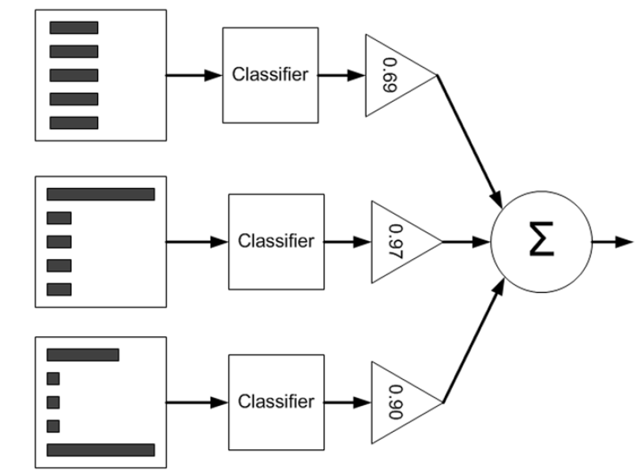
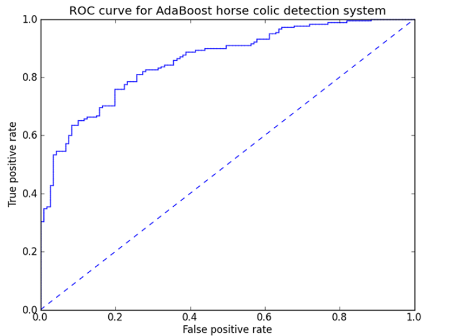
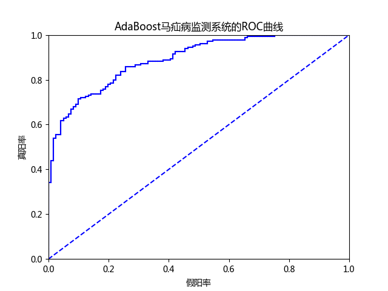
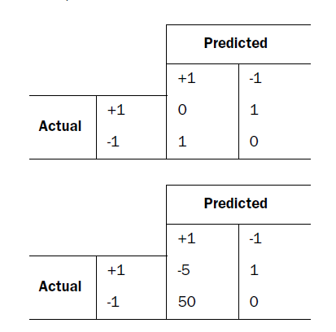

## 元算法概述
> 将不同分类器组合使用

### AdaBoost算法的优缺点
* 优点：泛化错误率低，易编码，可以应用在大部分分类器上，无参数调整
* 缺点：对离群点敏感
* 适用数据类型：数值型和标称型数据

### AdaBoost的工作原理
#### bagging
**自举汇聚法(bootstrap aggregating)** 也称为bagging方法[^1]，是在从原始数据集选择S次后得到S个新数据集的一种技术。新数据集和原数据集的大小相等。每个数据集都是通过在原始数据集中随机选择一个样本来进行替换而得到的(*放回取样*)，新数据允许有重复值同时原始数据集中的某些值在新数据集中可以不存在。
在S个数据集建好后将某个学习算法分别作用于每个数据集得到S个分类器，然后在需要对新数据分类时应用这S个分类器，然后进行多数表决，分类器中投票结果最多的类别作为最终的分类结果。

#### boosting
boosting和bagging是很类似的技术，两者使用的多个分类器的类型都是一致的。不过在boosting中不同的分类器是通过串行训练获得的，每个新分类器都根据已训练出的分类器的性能来进行训练。boosting是通过集中关注被已有分类器 **错分** 的那些数据来获得新的分类器的。
boosting分类的结果是基于所有分类器的 **加权求和** 结果的，bagging中的分类器权重是相等的，boosting中的分类器权重并不相等，每个权重代表的是其对应分类器在上一轮迭代中的成功度。

#### AdaBoost
AdaBoost是adaptive boosting(自适应boosting)的缩写，训练过程如下：
1. 训练数据中的每个 **样本**，并赋予一个权重，这些权重构成一个向量D，权重都被初始化成相等值
2. 在训练数据上训练出一个弱分类器并计算该分类器的错误率
3. 重新调整每个样本的权重(第一次分对的样本权重将会降低，分错的样本权重将会提高)，在同一个数据集上再次训练弱分类器

为了从所有弱分类器中得到最终的分类结果，AdaBoost为每个分类器都分配了一个权重值alpha，这些alpha值是基于每个弱分类器的错误率进行计算。错误率$\epsilon$的定义为：
$$\epsilon=\frac{未正确分类的样本数目}{所有样本数目}$$
alpha的计算公式如下:
$$\alpha=\frac{1}{2}ln(\frac{1-\epsilon}{\epsilon})$$
* AdaBoost算法示意图

左边的是数据集，其中直方图的不同宽度表示每个样例上的不同权重。在经过一个分类器后，加权的预测结果会通过三角形中的alpha值进行加权。每个三角形中输出的加权结果在原形中求和，从而得到最终的输出结果

计算出alpha值之后，可以对权重向量D进行更新，以使得那些正确分类的样本的权重降低而错分样本的权重升高。
如果某个样本被正确分类，该样本的权重更改为:
$$D_i^{(t+1)}=\frac{D_i^{(t)}e^{-\alpha}}{Sum(D)}$$
如果某个样本被错分，该样本的权重更改为：
$$D_i^{(t+1)}=\frac{D_i^{(t)}e^{\alpha}}{Sum(D)}$$
在计算出D之后，AdaBoost进入下一轮迭代。AdaBoost算法会不断重复训练和调整权重的过程，知道训练错误率为0或者弱分类器的数目达到指定值为止

### AdaBoost算法的一般流程
1. 收集数据：可以使用任意方法
2. 准备数据：依赖于所使用的弱分类器类型，这里使用单层决策树，这种分类器可以处理任何数据类型。可以使用任意分类器作为弱分类器，作为弱分类器，简单分类器的效果更好
3. 分析数据：可以使用任意方法
4. 训练算法：AdaBoost的大部分时间都用在训练上，分类器将多次在同一数据集上训练弱分类器
5. 测试算法：计算分类的错误率
6. 使用算法：同SVM一样，AdaBoost预测两个类别中的一个。如果想应用到多个类别的场合，就需要对AdaBoost进行修改

## AdaBoost算法的实现
### 基于单层决策树构建弱分类器
**单层决策树(decision stump，也称决策树桩)** 是一种简单的决策树，它仅基于单个特征来做决策
* 创建简单数据
```Python
def load_simple_data():
    """添加一个简单数据集
    :return:
    """
    data_mat = np.matrix([[1., 2.1],
                          [2., 1.1],
                          [1.3, 1.],
                          [1., 1.],
                          [2., 1.]])
    class_labels = [1.0, 1.0, -1.0, -1.0, 1.0]
    return data_mat, class_labels
```
* 伪代码
```
将最小错误率min_error设置为正无穷
对数据集中的每一个特征(第一层循环):
    对每个步长(第二层循环):
        对每个不等号(第三层循环):
            建立一颗单层决策树并利用加权数据集对它进行测试
            如果错误率低于min_error，则将当前单层决策树设为最佳单层决策树
返回最佳单层决策树
```
* 生成单层决策树
```Python
def stump_classify(data_matrix, dimen, thresh_val, thresh_ineq):
    """通过阈值分类
    :param data_matrix: 数据集
    :param dimen: 特征下标
    :param thresh_val: 阈值
    :param thresh_ineq: 符号
    :return:
    """
    ret_array = np.ones((np.shape(data_matrix)[0], 1))
    if thresh_ineq == 'lt':
        # 将小于阈值的置为-1类
        ret_array[data_matrix[:, dimen] <= thresh_val] = -1.0
    else:
        # 将大于阈值的置为-1类
        ret_array[data_matrix[:, dimen] > thresh_val] = -1.0
    return ret_array


def build_stump(data_arr, class_labels, d):
    """生成单层决策树
    :param data_arr: 数据集
    :param class_labels: 类别标签
    :param d: 权重
    :return:
    """
    data_mat = np.mat(data_arr)
    label_mat = np.mat(class_labels).T
    m, n = np.shape(data_mat)
    # 在特征的所有可能值上进行遍历
    num_steps = 10.0
    # 存储给定权重向量d时所得到的最佳单层决策树的相关信息
    best_stump = {}
    best_class_est = np.mat(np.zeros((m, 1)))
    # 设为无穷大，用于寻找可能的最小错误率
    min_error = np.inf
    for i in range(n):
        # 在数据的所有特征上遍历
        # 通过特征的最大最小值来确定步长
        range_min = data_mat[:, i].min()
        range_max = data_mat[:, i].max()
        step_size = (range_max-range_min)/num_steps
        for j in range(-1, int(num_steps)+1):
            for inequal in ['lt', 'gt']:
                thresh_val = (range_min + float(j) * step_size)
                # 计算预测的分类
                predicted_vals = stump_classify(data_mat, i, thresh_val, inequal)
                # 设置预测分类和真实类别不同的值为1
                err_arr = np.mat(np.ones((m, 1)))
                err_arr[predicted_vals == label_mat] = 0
                # 计算错误向量的权重和
                weight_error = d.T * err_arr
                if weight_error < min_error:
                    # 更新最小错误和最佳单层数
                    min_error = weight_error
                    best_class_est = predicted_vals.copy()
                    best_stump['dim'] = i
                    best_stump['thresh'] = thresh_val
                    best_stump['ineq'] = inequal
    return best_stump, min_error, best_class_est
```
### 完整的AdaBoost算法
* 伪代码
```
对每次迭代：
    利用build_stump()函数找到最佳的单层决策树
    将最佳单层决策树加入到单层决策树数组
    计算alpha
    计算新的权重向量D
    更新累计类别估计值
    如果错误率等于0.0，退出循环
```
* AdbBoost训练
```Python
def adaboost_train_ds(data_arr, class_labels, num_it=40):
    """基于单层决策树训练AdaBoost
    :param data_arr: 数据集
    :param class_labels: 类别标签
    :param num_it: 迭代次数
    :return:
    """
    weak_class_arr = []
    m = np.shape(data_arr)[0]
    # 为每一条数据初始化权重
    d = np.mat(np.ones((m, 1))/m)
    # 记录每个数据点的类别估计累计值
    agg_class_est = np.mat(np.zeros((m, 1)))
    for i in range(num_it):
        # 建立单层决策树
        best_stump, error, class_est = build_stump(data_arr, class_labels, d)
        print("D:", d.T)
        # 计算每一个单层决策树的权重
        # max(error,1e-16)保证在没有错误时不会除0异常
        alpha = float(0.5*np.log((1-error)/np.longfloat(max(error, 1e-16))))
        # 保存决策树权重和单层决策树
        best_stump['alpha'] = alpha
        weak_class_arr.append(best_stump)
        print("class_est:", class_est.T)
        # 计算新的权重向量d
        expon = np.multiply(-1*alpha*np.mat(class_labels).T, class_est)
        d = np.multiply(d, np.exp(expon))
        d = d/d.sum()
        # 类别估计值
        agg_class_est += alpha*class_est
        print('agg_class_est', agg_class_est.T)
        # 获取错误率
        agg_errors = np.multiply(np.sign(agg_class_est) != np.mat(class_labels).T, np.ones((m, 1)))
        print(agg_errors)
        error_rate = agg_errors.sum()/m
        print('total error', error_rate, '\n')
        if error_rate == 0.0:
            break
    return weak_class_arr
```
* 分类函数
```Python
def ada_classify(dat_to_class, classifier_arr):
    """分类函数
    :param dat_to_class: 待分类的数据
    :param classifier_arr: 弱分类器数组
    :return:
    """
    data_matrix = np.mat(dat_to_class)
    m = np.shape(data_matrix)[0]
    # 记录每个数据点的类别估计累计值
    agg_class_est = np.mat(np.zeros((m, 1)))
    for i in range(len(classifier_arr)):
        # 计算类别估计值
        class_est = stump_classify(data_matrix,
                                   classifier_arr[i]['dim'],
                                   classifier_arr[i]['thresh'],
                                   classifier_arr[i]['ineq'])
        agg_class_est += classifier_arr[i]['alpha']*class_est
        print(agg_class_est)
    return np.sign(agg_class_est)
```
## 非均衡分类问题
大多数情况下不同类别的分类代价并不相等，所以需要分类器性能度量方法并通过图像技术来对非均衡问题下不同分类器的性能进行可视化处理
### 正确率、召回率及ROC曲线
关于正确率和召回率的性能度量可以查看[Coursera上的MachineLearning课程资料](https://github.com/coldJune/machineLearning/blob/master/machineLearningCourseraNote/Note6.pdf)
另一个用于度量分类中的非均衡性的工具是ROC曲线(ROC curve)，ROC代表接收者操作特征(receiver operating characteristic)
* AdaBoost马疝病监测系统的ROC曲线

ROC曲线中给出了两条线，一条虚线一条实线。横轴是负阳性的比例(假阳率=负阳性/(负阳性+正阴性))，纵轴表示是正阳性的比例(真阳率=正阳性/(正阳性+假阴性))。ROC曲线给出的事当阈值变化时假阳率和真阳率的变化情况。左下角的带你对应的将所有样例判为反例的情况，而右上角的点对应将所有样例判为正例的情况。虚线是随机猜测的结果曲线。

在理想情况下，最佳的分类器应该尽可能地处于左上角。
**曲线下的面积(Area User the Curve,AUC)** 是对不同的ROC曲线进行比较的一个指标。AUC给出的事分类器的平均性能值。一个完美的分类器AUC为1.0,而随机猜测的AUC为0.5。
创建ROC曲线需按照以下步骤：
1. 将分类样例按照其预测强度排序
2. 从排名最低的样例开始。所有排名更低的样例被判为反例，排名更高的样例被判为正例。对应的点为$<1.0,1.0>$
3. 将其一到排名次低的样例中去，如果该样例属于正例，修改真阳率；如果该样例属于反例，修改假阴率

* ROC曲线绘制及AUC计算函数
```Python
def plot_roc(pred_strengths, class_labels):
    """画出ROC曲线
    :param pred_strengths: 行向量组成的矩阵，表示分类器的预测强度
    :param class_labels: 类别标签
    :return:
    """
    import matplotlib.pyplot as plt
    # 保留绘制光标的位置
    cur = (1.0, 1.0)
    # 用于计算AUC的值
    y_sum = 0.0
    # 计算正例的数目
    num_pos_class = sum(np.array(class_labels) == 1.0)
    # 确定x轴和y轴上的步长
    y_step = 1/float(num_pos_class)
    x_step = 1/float(len(class_labels)-num_pos_class)
    # 得到排序索引
    # 因为索引时按照最小到最大的顺序排列
    # 所以从点<1.0,1.0>绘到<0,0>
    sorted_indicies = pred_strengths.argsort()
    fig = plt.figure()
    fig.clf()
    ax = fig.add_subplot(111)
    for index in sorted_indicies.tolist()[0]:
        # 在排序值上进行循环
        if class_labels[index] == 1.0:
            # 得到一个标签为1.0的类，在y轴上下降一个步长
            # 即不断降低真阳率
            del_x = 0
            del_y = y_step
        else:
            # 其他类别的标签，按x轴方向上倒退一个步长
            # 假阴率方向
            del_x = x_step
            del_y = 0
            # 对矩形的高度进行累加
            y_sum += cur[1]
        # 在当前点和新点之间画一条线
        ax.plot([cur[0], cur[0]-del_x], [cur[1], cur[1]-del_y], color='b')
        # 更新当前点的位置
        cur = (cur[0]-del_x, cur[1]-del_y)
    ax.plot([0, 1], [0, 1], 'b--')
    plt.xlabel('假阳率')
    plt.ylabel('真阳率')
    plt.title('AdaBoost马疝病监测系统的ROC曲线')
    ax.axis([0, 1, 0, 1])
    plt.show()
    # 乘以x_step得到总面积
    print("曲线下面积为:", y_sum*x_step)
```
* 使用马疝病数据绘制ROC曲线
```Python
In [13]: importlib.reload(adaboost)
Out[13]: <module 'adaboost' from 'D:\\machineLearning\\MachineLearningInAction\\adaboost\\adaboost.py'>

In [14]: data,label = adaboost.load_data_set('data/horseColicTraining2.txt')

In [15]: classifier_arr,agg_class_est = adaboost.adaboost_train_ds(data, label,40)

In [16]: adaboost.plot_roc(agg_class_est.T, label)
曲线下面积为: 0.8918191104095092
```
* AdaBoost马疝病监测系统的ROC曲线-40个分类器


### 基于代价函数的分类器决策
除了调节分类器的阈值之外，还可以使用 **代价敏感的学习(cost-sensitive learning)**
* 代价矩阵

第一张表的代价为 $$TP*0+FN*1+FP*1+TN*0$$ ，第二张表的代价为 $$TP*(-5)+FN*1+FP*50+TN*0$$[^2]
在构建分类器时，如果知道了代价值就可以选择付出最小代价的分类器。

### 非均衡问题的数据抽样方法
对于非均衡分类器可以对分类器的训练数据进行改造。可以通过 **欠抽样(undersampling)** 或者 **过抽样(oversampling)** 来实现。过抽样意味着复制样例，欠抽样意味着删除样例。
****
[示例代码](https://github.com/coldJune/machineLearning/tree/master/MachineLearningInAction/adaboost/adaboost.py)
[^1]: 可以使用[随机森林](http://statistics.berkeley.edu/sites/default/files/tech-reports/567.pdf)等更先进的bagging方法
[^2]: 变量的意义参考[准确率和召回率](https://github.com/coldJune/machineLearning/blob/master/machineLearningCourseraNote/Note6.pdf)的部分
