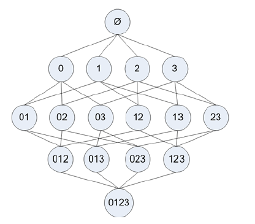
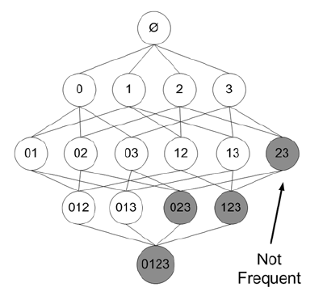
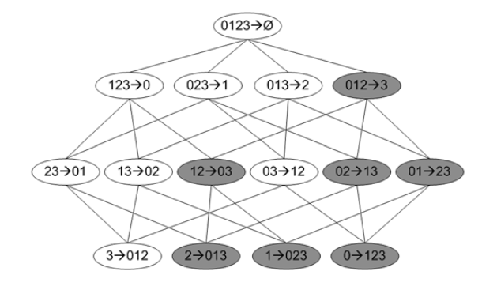

## Apriori算法概述
> 更智能的方法在合理的时间范围内找到频繁项集

### Apriori算法的优缺点
* 优点：易编码实现
* 缺点：在大数据集上可能较慢
* 适用数据类型：数值型或者标称型数据

### 工作原理
从大规模数据集中寻找物品间的隐含关系被称作 **关联分析(association analysis)** 或者 **关联规则学习(association rule learning)**。关联分析是一种在大规模数据集上寻找关系的任务，这些关系有两种形式：
1. 频繁项集(*frequent item sets*)：经常出现在一起的物品的集合
2. 关联规则(*association rules*)：暗示两种物品之间可能存在很强的关系

* 某杂货部交易清单

| 交易号码 |           商品           |
|:--------:|:------------------------:|
|    0     |        豆奶，莴苣        |
|    1     | 莴苣，尿布，葡萄酒，甜菜 |
|    2     | 豆奶，尿布，葡萄酒，橙汁 |
|    3     | 莴苣，豆奶，尿布，葡萄酒 |
|    4     |  莴苣，豆奶，尿布，橙汁  |
*{豆奶，尿布，葡萄酒}* 指一个频繁项集；*尿布->葡萄酒* 是一个关联规则目标是如果有人买了尿布，他很可能也会买葡萄酒

**支持度(support)** 被定义为数据集中包含该项集的记录所占的比例。上表中，*{豆奶}* 的支持度为$\frac{4}{5}$，*{豆奶，尿布}* 的支持度为$\frac{3}{5}$。支持度是针对项集来说，可以定义一个最小支持度，而只保留满足最小支持度的项集。
**可信度(confidence)** 是针对一条关联规则来定义的。*{尿布}->{葡萄酒}* 这条关联规则的可信度被定义为 *支持度({尿布，葡萄酒})/支持度({尿布})* 。上表中 *{尿布，葡萄酒}* 的支持度为$\frac{3}{5}$，尿布的支持度为$\frac{4}{5}$，所以*{尿布}->{葡萄酒}* 的可信度为$\frac{3}{4}=0.75$
支持度和可信度是用来量化关联分析是否成功的方法。
* 集合{0,1,2,3}的所有可能

图中从上往下的第一个集合是$\phi$，表示空集或不包含任何物品的集合。物品集合之间的连线表名两个或者更多集合可以组合形成一个更大的集合。这里对于4种物品的集合遍历了14遍数据。
Apriori原理是指如果某个项集是频繁的，那么它的所有自己也是频繁的。意味着如果${0,1}$是频繁的，那么${0}$、${1}$也一定是频繁的。反过来说，如果一个项集是非频繁集，那么它的所有超集也是非频繁的。
* 标识出非频繁项集的所有项集

图中给出了所有可能的项集，其中非频繁项集用灰色表示。由于集合${2,3}$是非频繁的，因此${0,2,3}$、$1,2,3$和$0,1,2,3$也是非频繁的，它们的支持度不需要计算

### Apriori算法的一般流程
1. 收集数据：使用任意方法
2. 准备数据：任何数据类型都行，只保存集合
3. 分析数据：任何方法
4. 训练算法：使用Apriori算法来找到频繁项集
5. 测试算法：不需要测试过程
6. 使用算法：用于发现频繁项集以及物品之间的关联规则

## 实现Apriori算法
### 发现频繁集
* 数据集扫描伪代码
```
对数据集中的每条记录tran:
    对每个候选集can:
        检查can是否是tran的子集：
            如果是：
                增加can的计数值
对每个候选项集：
    如果其支持度不低于最小值：
        保留该项集
返回所有频繁项集列表
```
* 辅助函数
```Python
def load_data_set():
    """生成数据集
    :return:
    """
    return [[1, 3, 4], [2, 3, 5], [1, 2, 3, 5], [2, 5]]


def create_c1(data_set):
    """构建大小为1的所有候选项集的集合
    :param data_set:
    :return:
    """
    # 构建集合C1
    candidate_1 = []
    for transaction in data_set:
        for item in transaction:
            # 提取候选集
            if not [item] in candidate_1:
                candidate_1.append([item])
    candidate_1.sort()
    # 创建一个不可改变的集合
    return list(map(frozenset, candidate_1))


def scan_d(d, candidate_k, min_support):
    """创建满足最小支持度的列表
    :param d: 数据集
    :param candidate_k: 候选集合列表
    :param min_support: 最小支持度
    :return:
    """

    ss_cnt = {}
    for tid in d:
        # 遍历所有交易记录
        for can in candidate_k:
            # 遍历所有候选集
            if can.issubset(tid):
                # 如果候选集是记录的一部分
                if can not in ss_cnt.keys():
                    # 为记载则记为1
                    ss_cnt[can] = 1
                else:
                    # 否则记录+1
                    ss_cnt[can] += 1
    # 记录的大小
    num_items = np.float(len(d))
    ret_list = []
    support_data = {}
    for key in ss_cnt:
        # 扫描所有候选集
        # 计算候选集的支持度
        support = ss_cnt[key]/num_items
        if support >= min_support:
            # 候选集的支持度大于最小支持度
            # 将候选集加入列表
            ret_list.insert(0, key)
        # 记录候选集的支持度
        support_data[key] = support
    return ret_list, support_data
```
* Apriori算法伪代码
```
当集合中项的个数大于0时：
    构建一个k个项组成的候选项集的列表
    检查数据以确认每个项集是频繁的
    保留频繁项集并构建k+1项组成的候选项集的列表
```
* Apriori算法
```Python
def apriori_gen(list_k, k):
    """构建大小为k的所有候选项集的集合
    :param list_k: 频繁项列表
    :param k: 项集元素个数
    :return:
    """
    ret_list = []
    # 计算l_k的元素个数
    len_list_k = len(list_k)
    for i in range(len_list_k):
        for j in range(i+1, len_list_k):
            # 比较l_k中的每个元素和其他元素
            # 前k-2个元素相同
            l_1 = list(list_k[i])[:k-2]
            l_2 = list(list_k[j])[:k-2]
            l_1.sort()
            l_2.sort()
            if l_1 == l_2:
                # 求并并添加到列表中
                ret_list.append(list_k[i] | list_k[j])
    return ret_list


def apriori(data_set, min_support=0.5):
    """主函数
    :param data_set:
    :param min_support:
    :return:
    """
    # 创建大小为1的所有候选项集的集合
    candidate_1 = create_c1(data_set)
    # 数据去重
    d = list(map(set, data_set))
    # 计算候选项集为1的满足最小支持度的列表
    list_1, support_data = scan_d(d, candidate_1, min_support)
    lis = [list_1]
    k = 2
    while len(lis[k-2]) > 0:
        # 创建大小为k的所有候选项集的集合
        candidate_k = apriori_gen(lis[k-2], k)
        # 计算候选项集为k的满足最小支持度的列表
        list_k, support_k = scan_d(d, candidate_k, min_support)
        # 更新支持度字典
        support_data.update(support_k)
        # 添加候选集为k的满足最小支持度的列表
        lis.append(list_k)
        k += 1
    return lis, support_data
```
### 从频繁项集挖掘关联规则
某个元素或者某个元素集合可能会推导出另一个元素。如果有一个频繁项集 *{豆奶,莴苣}*，那么就有一条关联规则"*豆奶—>莴苣*"。这意味着如果有人购买了豆奶，那么在统计上他会购买莴苣的概率较大。但反之不一定成立，也就是说即使"*豆奶—>莴苣*"统计上显著，那么"*莴苣—>豆奶*"也不一定成立。(从逻辑研究上讲，箭头左边的集合称作**前件**，箭头邮编的集合称为**后件**)
对于关联规则，使用可信度来进行量化。一条规则$P\to H$的可信度定义为$\frac{support(P\mid H)}{support(P)}$。其中$P\mid H$是指所有出现在集合P或者集合H中的元素。
* 对于频繁项集{0,1,2,3}的关联规则网格示意图

阴影区域给出的事低可信度的规则。如果发现$0,1,2\to 3$是一条低可信度规则，那么所有其他以$3$作为后件的规则可信度也会较低
类似于频繁项集生成。如果某条规则不满足最小可信度要求，那么该规则的所有子集也不会满足最小可信度要求。假设规则$0,1,2\to 3$并不满足最小可信度要求，那么任何左部为${0,1,2}$子集的规则也不会满足最小可信度要求。
1. 从一个频繁项集开始
2. 创建一个规则列表，其中规则右部只包含一个元素
3. 然后对这些规则进行测试
4. 合并所有剩余规则来创建一个新的规则列表，其中规则右部包含两个元素
这种方法被称为分级法
* 关联规则生成
```Python
def rule_from_conseq(freq_set, h, support_data, big_rule_list, min_conf=0.7):
    """关联规则生成
    :param freq_set: 频繁项集
    :param h: 每个频繁项集只包含单个元素集合的列表
    :param support_data: 频繁项集支持数据的字典
    :param big_rule_list: 包含可信度的规则列表
    :param min_conf: 最小可信度
    :return:
    """
    # 计算h中频繁集大小
    m = len(h[0])
    if len(freq_set) > m+1:
        # 频繁项集大到可以移除大小为m的子集
        # 生成h中元素的无重复组合
        hmp1 = apriori_gen(h, m+1)
        # 计算可信度
        hmp1 = calc_conf(freq_set, hmp1, support_data, big_rule_list, min_conf)
        if len(hmp1) > 1:
            # 如果不止一条规则满足要求
            # 进行迭代
            rule_from_conseq(freq_set, hmp1, support_data, big_rule_list, min_conf)


def calc_conf(freq_set, h, support_data, big_rule_list, min_conf=0.7):
    """计算可信度
    :param freq_set: 频繁项集
    :param h:每个频繁项集只包含单个元素集合的列表
    :param support_data: 频繁项集支持数据的字典
    :param big_rule_list: 包含可信度的规则列表
    :param min_conf: 最小可信度
    :return:
    """
    pruned_h = []
    for conseq in h:
        # 计算所有项集的可信度
        conf = support_data[freq_set]/support_data[freq_set-conseq]
        if conf >= min_conf:
            # 可信度大于最小可信度
            print(freq_set-conseq, '-->',  conseq, 'conf:', conf)
            # 加入列表
            big_rule_list.append((freq_set-conseq, conseq, conf))
            pruned_h.append(conseq)
    return pruned_h


def generate_rules(lis, support_data, min_conf=0.7):
    """关联规则生成主函数
    :param lis: 频繁项集列表
    :param support_data: 频繁项集支持数据的字典
    :param min_conf: 最小可信度阈值
    :return:
    """
    # 包含可信度的规则列表
    big_rule_list = []
    for i in range(1, len(lis)):
        # 获取两个或更多元素的列表
        for freq_set in lis[i]:
            # 对每个频繁项集创建只包含单个元素集合的列表
            h_1 = [frozenset([item]) for item in freq_set]
            if i > 1:
                # 如果频繁项集的元素数目超过2就对它进行进一步合并
                rule_from_conseq(freq_set, h_1, support_data, big_rule_list, min_conf)
            else:
                # 只有两个元素则计算可信度
                calc_conf(freq_set, h_1, support_data, big_rule_list, min_conf)
    return big_rule_list
```
****
[示例代码](https://github.com/coldJune/machineLearning/tree/master/MachineLearningInAction/apriori/apriori.py)
