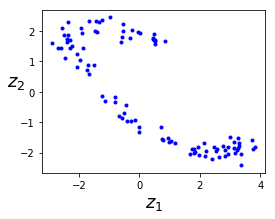
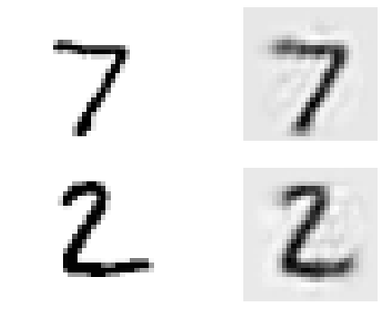
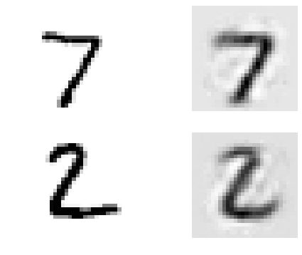
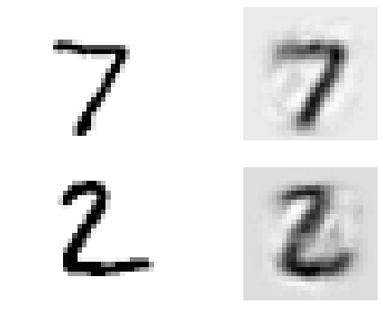
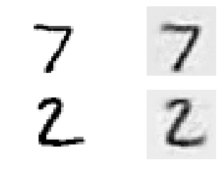
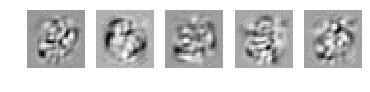
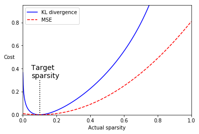
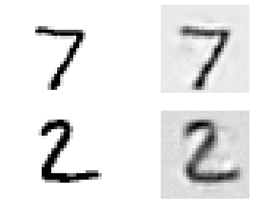
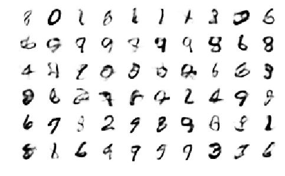
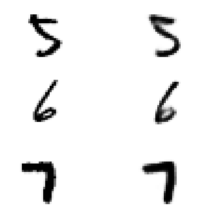

---

# 准备


```python
import os
import sys

import numpy as np

%matplotlib inline
import matplotlib
import matplotlib.pyplot as plt

import tensorflow as tf
def reset_graph(seed=42):
    tf.reset_default_graph()
    tf.set_random_seed(seed)
    np.random.seed(seed)

def plot_image(image, shape=[28, 28]):
    plt.imshow(image.reshape(shape), cmap="Greys", interpolation="nearest")
    plt.axis("off")

def plt_multiple_images(images, n_rows, n_cols, pad=2):
    images = images - images.min()
    w, h = images.shape[1:]
    image = np.zeros(((w+pad)*n_rows+pad, (h+pad)*n_cols+pad))
    for y in range(n_rows):
        for x in range(n_cols):
            image[(y*(h+pad)+pad):(y*(h+pad)+pad+h), (x*(w+pad)+pad):(x*(w+pad)+pad+w)]=images[y*n_cols+x]
        plt.imshow(image, cmap="Greys", interpolation="nearest")
        plt.axis("off")
```

# 使用线性Autoencoder进行主成分分析(PCA)


```python
import numpy.random as rnd

rnd.seed(4)
m = 200
w1, w2 = 0.1, 0.3
noise = 0.1

angles = rnd.rand(m) * 3 * np.pi / 2 - 0.5
data = np.empty((m, 3))
data[:, 0] = np.cos(angles) + np.sin(angles)/2 + noise * rnd.randn(m) / 2
data[:, 1] = np.sin(angles) * 0.7 + noise * rnd.randn(m) / 2
data[:, 2] = data[:, 0] * w1 + data[:, 1] * w2 + noise * rnd.randn(m)
```


```python
from sklearn.preprocessing import StandardScaler
scaler = StandardScaler()
X_train = scaler.fit_transform(data[:100])
X_test = scaler.transform(data[100:])
```


```python
import tensorflow as tf

reset_graph()

n_inputs = 3
n_hidden = 2
n_outputs = n_inputs

learning_rate = 0.01

X = tf.placeholder(tf.float32, shape=[None, n_inputs])
hidden = tf.layers.dense(X, n_hidden)
outputs = tf.layers.dense(hidden, n_outputs)

reconstruction_loss = tf.reduce_mean(tf.square(outputs - X))

optimizer = tf.train.AdamOptimizer(learning_rate)
training_op = optimizer.minimize(reconstruction_loss)

init = tf.global_variables_initializer()
```


```python
n_iterations = 1000
codings = hidden

with tf.Session() as sess:
    init.run()
    for iteration in range(n_iterations):
        training_op.run(feed_dict={X: X_train})
        coding_val = codings.eval(feed_dict={X: X_test})
```


```python
fig = plt.figure(figsize=(4,3))
plt.plot(coding_val[:, 0], coding_val[:, 1], "b.")
plt.xlabel("$z_1$", fontsize=18)
plt.ylabel("$z_2$", fontsize=18, rotation=0)
plt.show()
```





# Stacked Autoencoders


```python
from tensorflow.examples.tutorials.mnist import input_data
mnist  = input_data.read_data_sets("tmp/data/")
```

    WARNING:tensorflow:From <ipython-input-7-39eecf39f555>:2: read_data_sets (from tensorflow.contrib.learn.python.learn.datasets.mnist) is deprecated and will be removed in a future version.
    Instructions for updating:
    Please use alternatives such as official/mnist/dataset.py from tensorflow/models.
    WARNING:tensorflow:From e:\python\python36\lib\site-packages\tensorflow\contrib\learn\python\learn\datasets\mnist.py:260: maybe_download (from tensorflow.contrib.learn.python.learn.datasets.base) is deprecated and will be removed in a future version.
    Instructions for updating:
    Please write your own downloading logic.
    WARNING:tensorflow:From e:\python\python36\lib\site-packages\tensorflow\contrib\learn\python\learn\datasets\mnist.py:262: extract_images (from tensorflow.contrib.learn.python.learn.datasets.mnist) is deprecated and will be removed in a future version.
    Instructions for updating:
    Please use tf.data to implement this functionality.
    Extracting tmp/data/train-images-idx3-ubyte.gz
    WARNING:tensorflow:From e:\python\python36\lib\site-packages\tensorflow\contrib\learn\python\learn\datasets\mnist.py:267: extract_labels (from tensorflow.contrib.learn.python.learn.datasets.mnist) is deprecated and will be removed in a future version.
    Instructions for updating:
    Please use tf.data to implement this functionality.
    Extracting tmp/data/train-labels-idx1-ubyte.gz
    Extracting tmp/data/t10k-images-idx3-ubyte.gz
    Extracting tmp/data/t10k-labels-idx1-ubyte.gz
    WARNING:tensorflow:From e:\python\python36\lib\site-packages\tensorflow\contrib\learn\python\learn\datasets\mnist.py:290: DataSet.__init__ (from tensorflow.contrib.learn.python.learn.datasets.mnist) is deprecated and will be removed in a future version.
    Instructions for updating:
    Please use alternatives such as official/mnist/dataset.py from tensorflow/models.


## 一次性训练所有层


```python
reset_graph()

from functools import partial

n_inputs = 28 * 28
n_hidden1 = 300
n_hidden2 = 150
n_hidden3 = n_hidden1
n_outputs = n_inputs

learning_rate = 0.01
l2_reg = 0.0001

X = tf.placeholder(tf.float32, shape=[None, n_inputs])

he_init = tf.contrib.layers.variance_scaling_initializer()
l2_regularizer = tf.contrib.layers.l2_regularizer(l2_reg)

my_dense_layer = partial(tf.layers.dense,
                        activation=tf.nn.elu,
                        kernel_initializer=he_init,
                        kernel_regularizer=l2_regularizer)

hidden1 = my_dense_layer(X, n_hidden1)
hidden2 = my_dense_layer(hidden1, n_hidden2)
hidden3 = my_dense_layer(hidden2, n_hidden3)
outputs = my_dense_layer(hidden3, n_outputs, activation=None)

reconstruction_loss = tf.reduce_mean(tf.square(outputs - X))

reg_losses = tf.get_collection(tf.GraphKeys.REGULARIZATION_LOSSES)
loss = tf.add_n([reconstruction_loss] + reg_losses)

optimizer = tf.train.AdamOptimizer(learning_rate=learning_rate)
training_op = optimizer.minimize(loss)

init = tf.global_variables_initializer()
saver = tf.train.Saver()
```


```python
n_epochs = 5
batch_size = 150

with tf.Session() as sess:
    init.run()
    for epoch in range(n_epochs):
        n_batches = mnist.train.num_examples // batch_size
        for iteration in range(n_batches):
            print("\r{}%".format(100 * iteration // n_batches), end="")
            sys.stdout.flush()
            X_batch, y_batch = mnist.train.next_batch(batch_size)
            sess.run(training_op, feed_dict={X: X_batch})
        loss_train = reconstruction_loss.eval(feed_dict={X: X_batch})
        sys.stdout.flush()
        print("\r{}".format(epoch), "Train MSE:", loss_train)
        saver.save(sess, "autoencoder/my_model_all_layers.ckpt")
```

    0 Train MSE: 0.020302307
    1 Train MSE: 0.011643166
    2 Train MSE: 0.010225781
    3 Train MSE: 0.009899946
    4 Train MSE: 0.010377405


```python
def show_reconstruction_digits(X, outputs, model_path=None, n_test_digits=2):
    with tf.Session() as sess:
        if model_path:
            saver.restore(sess, model_path)
        X_test = mnist.test.images[:n_test_digits]
        outputs_val = outputs.eval(feed_dict={X: X_test})
    fig = plt.figure(figsize=(8, 3 * n_test_digits))
    for digit_index in range(n_test_digits):
        plt.subplot(n_test_digits, 2, digit_index * 2 + 1)
        plot_image(X_test[digit_index])
        plt.subplot(n_test_digits, 2, digit_index * 2 + 2)
        plot_image(outputs_val[digit_index])
```


```python
show_reconstruction_digits(X, outputs, "autoencoder/my_model_all_layers.ckpt")
```

    INFO:tensorflow:Restoring parameters from autoencoder/my_model_all_layers.ckpt





## 调整权重


```python
reset_graph()

n_inputs = 28 * 28
n_hidden1 = 300
n_hidden2 = 150
n_hidden3 = n_hidden1
n_outputs = n_inputs

learning_rate = 0.01
l2_reg = 0.0005
```


```python
activation = tf.nn.elu
regularizer = tf.contrib.layers.l2_regularizer(l2_reg)
initializer = tf.contrib.layers.variance_scaling_initializer()

X = tf.placeholder(tf.float32, shape=[None, n_inputs])

weights1_init = initializer([n_inputs, n_hidden1])
weights2_init = initializer([n_hidden1, n_hidden2])

weights1 = tf.Variable(weights1_init, dtype=tf.float32, name="weights1")
weights2 = tf.Variable(weights2_init, dtype=tf.float32, name="weights2")
weights3 = tf.transpose(weights2, name="weights3")
weights4 = tf.transpose(weights1, name="weights4")

biases1 = tf.Variable(tf.zeros(n_hidden1), name="biases1")
biases2 = tf.Variable(tf.zeros(n_hidden2), name="biases2")
biases3 = tf.Variable(tf.zeros(n_hidden3), name="biases3")
biases4 = tf.Variable(tf.zeros(n_outputs), name="biases4")

hidden1 = activation(tf.matmul(X, weights1) + biases1)
hidden2 = activation(tf.matmul(hidden1, weights2) + biases2)
hidden3 = activation(tf.matmul(hidden2, weights3) + biases3)
outputs = tf.matmul(hidden3, weights4) + biases4

reconstruction_loss = tf.reduce_mean(tf.square(outputs - X))
reg_loss = regularizer(weights1) + regularizer(weights2)
loss = reconstruction_loss + reg_loss

optimizer = tf.train.AdamOptimizer(learning_rate=learning_rate)
training_op = optimizer.minimize(loss)

init = tf.global_variables_initializer()
```


```python
saver = tf.train.Saver()
```


```python
n_epochs = 5
batch_size = 150

with tf.Session() as sess:
    init.run()
    for epoch in range(n_epochs):
        n_batches = mnist.train.num_examples // batch_size
        for iteration in range(n_batches):
            print("\r{}%".format(100 * iteration // n_batches), end="")
            sys.stdout.flush()
            X_batch, y_batch = mnist.train.next_batch(batch_size)
            sess.run(training_op, feed_dict={X: X_batch})
        loss_train = reconstruction_loss.eval(feed_dict={X: X_batch})
        sys.stdout.flush()
        print("\r{}".format(epoch), "Train MSE:", loss_train)
        saver.save(sess, "autoencoder/my_model_tying_weights.ckpt")
```

    0 Train MSE: 0.015066842
    1 Train MSE: 0.016488561
    2 Train MSE: 0.017375803
    3 Train MSE: 0.016878227
    4 Train MSE: 0.015587644


```python
show_reconstruction_digits(X, outputs, "autoencoder/my_model_tying_weights.ckpt")
```

    INFO:tensorflow:Restoring parameters from autoencoder/my_model_tying_weights.ckpt





## Training one Autoencoder at a time in multiple graphs


```python
reset_graph()
```


```python
from functools import partial

def train_autoencoder(X_train, n_neurons, n_epochs, batch_size,
                     learning_rate=0.01, l2_reg=0.0005, seed=42,
                     hidden_activation=tf.nn.elu,
                     output_activation=tf.nn.elu):
    graph = tf.Graph()
    with graph.as_default():
        tf.set_random_seed(seed)

        n_inputs = X_train.shape[1]

        X = tf.placeholder(tf.float32, shape=[None, n_inputs])

        my_dense_layer = partial(
            tf.layers.dense,
            kernel_initializer=tf.contrib.layers.variance_scaling_initializer(),
            kernel_regularizer=tf.contrib.layers.l2_regularizer(l2_reg)
        )

        hidden = my_dense_layer(X, n_neurons, activation=hidden_activation, name="hidden")
        outputs = my_dense_layer(hidden, n_inputs, activation=output_activation, name="outputs")

        reconstruction_loss = tf.reduce_mean(tf.square(outputs - X))

        reg_losses = tf.get_collection(tf.GraphKeys.REGULARIZATION_LOSSES)
        loss = tf.add_n([reconstruction_loss] + reg_losses)

        optimizer = tf.train.AdamOptimizer(learning_rate=learning_rate)
        training_op = optimizer.minimize(loss)
        init = tf.global_variables_initializer()

        with tf.Session() as sess:
            init.run()
            for epoch in range(n_epochs):
                n_batches = len(X_train) // batch_size
                for iteration in range(n_batches):
                    print("\r{}%".format(100 * iteration // n_batches), end="")
                    sys.stdout.flush()
                    indices = rnd.permutation(len(X_train))[:batch_size]
                    X_batch = X_train[indices]
                    sess.run(training_op, feed_dict={X: X_batch})
                loss_train = reconstruction_loss.eval(feed_dict={X: X_batch})
                sys.stdout.flush()
                print("\r{}".format(epoch), "Train MSE:", loss_train)
            params = dict([(var.name, var.eval())
                           for var in tf.get_collection(tf.GraphKeys.TRAINABLE_VARIABLES)])
            hidden_val = hidden.eval(feed_dict={X: X_train})
            return hidden_val, params["hidden/kernel:0"],params["hidden/bias:0"], params["outputs/kernel:0"], params["outputs/bias:0"]
```


```python
hidden_output, W1, b1, W4, b4 = train_autoencoder(mnist.train.images,
                                                  n_neurons=300, n_epochs=4,
                                                  batch_size=150, output_activation=None)
_, W2,b2, W3, b3 = train_autoencoder(hidden_output, n_neurons=150,
                                     n_epochs=4, batch_size=150)
```

    0 Train MSE: 0.018517738
    1 Train MSE: 0.0186826
    2 Train MSE: 0.018467626
    3 %Train MSE: 0.019231623
    0 Train MSE: 0.0042361086
    1 Train MSE: 0.0048326803
    2 Train MSE: 0.004668748
    3 Train MSE: 0.0044039097


```python
reset_graph()

n_inputs = 28 * 28

X = tf.placeholder(tf.float32, shape=[None, n_inputs])
hidden1 = tf.nn.elu(tf.matmul(X, W1) + b1)
hidden2 = tf.nn.elu(tf.matmul(hidden1, W2) + b2)
hidden3 = tf.nn.elu(tf.matmul(hidden2, W3) + b3)
outputs = tf.matmul(hidden3, W4) + b4
```


```python
show_reconstruction_digits(X, outputs)
```





## Training one Autoencoder at a time in a single graph


```python
reset_graph()

n_inputs = 28 * 28
n_hidden1 = 300
n_hidden2 = 150
n_hidden3 = n_hidden1
n_outputs = n_inputs

learning_rate = 0.01
l2_reg = 0.0001

activation = tf.nn.elu
regularizer = tf.contrib.layers.l2_regularizer(l2_reg)
initializer = tf.contrib.layers.variance_scaling_initializer()

X = tf.placeholder(tf.float32, shape=[None, n_inputs])

weights1_init = initializer([n_inputs, n_hidden1])
weights2_init = initializer([n_hidden1, n_hidden2])
weights3_init = initializer([n_hidden2, n_hidden3])
weights4_init = initializer([n_hidden3, n_outputs])

weights1 = tf.Variable(weights1_init, dtype=tf.float32, name="weights1")
weights2 = tf.Variable(weights2_init, dtype=tf.float32, name="weigths2")
weights3 = tf.Variable(weights3_init, dtype=tf.float32, name="weights3")
weights4 = tf.Variable(weights4_init, dtype=tf.float32, name="weights4")

biases1 = tf.Variable(tf.zeros(n_hidden1), name="biases1")
biases2 = tf.Variable(tf.zeros(n_hidden2), name="biases2")
biases3 = tf.Variable(tf.zeros(n_hidden3), name="biases3")
biases4 = tf.Variable(tf.zeros(n_outputs), name="biases4")

hidden1 = activation(tf.matmul(X, weights1) + biases1)
hidden2 = activation(tf.matmul(hidden1, weights2) + biases2)
hidden3 = activation(tf.matmul(hidden2, weights3) + biases3)
outputs = tf.matmul(hidden3, weights4) + biases4

reconstruction_loss = tf.reduce_mean(tf.square(outputs - X))
```


```python
optimizer = tf.train.AdamOptimizer(learning_rate=learning_rate)

with tf.name_scope("phase1"):
    phasel_outputs = tf.matmul(hidden1, weights4) + biases4
    phase1_reconstruction_loss = tf.reduce_mean(tf.square(phasel_outputs - X))
    phase1_reg_loss = regularizer(weights1) + regularizer(weights4)
    phase1_loss = phase1_reconstruction_loss + phase1_reg_loss
    phase1_training_op = optimizer.minimize(phase1_loss)

with tf.name_scope("phase2"):
    phase2_reconstruction_loss = tf.reduce_mean(tf.square(hidden3 - hidden1))
    phase2_reg_loss = regularizer(weights2) + regularizer(weights3)
    phase2_loss = phase2_reconstruction_loss + phase2_reg_loss
    train_vars = [weights2, biases2, weights3, biases3]
    phase2_training_op = optimizer.minimize(phase2_loss, var_list=train_vars)
```


```python
init = tf.global_variables_initializer()
saver = tf.train.Saver()
```


```python
training_ops = [phase1_training_op, phase2_training_op]
reconstruction_loesses = [phase1_reconstruction_loss, phase2_reconstruction_loss]
n_epochs = [4, 4]
batch_sizes = [150, 150]

with tf.Session() as sess:
    init.run()
    for phase in range(2):
        print("Training phase #{}".format(phase + 1))
        for epoch in range(n_epochs[phase]):
            n_batches = mnist.train.num_examples // batch_sizes[phase]
            for iteration in range(n_batches):
                print("\r{}%".format(100 * iteration // n_batches), end="")
                sys.stdout.flush()
                X_batch, y_batch = mnist.train.next_batch(batch_sizes[phase])
                sess.run(training_ops[phase],feed_dict={X: X_batch})
            loss_train = reconstruction_loesses[phase].eval(feed_dict={X: X_batch})
            sys.stdout.flush()
            print("\r{}".format(epoch), "Training MSE:", loss_train)
            saver.save(sess, "autoencoder/my_model_one_at_a_time.ckpt")
    loss_test = reconstruction_loss.eval(feed_dict={X: mnist.test.images})
    print("Test MSE:", loss_test)
```

    Training phase #1
    0 Training MSE: 0.0074068382
    1 Training MSE: 0.0078287525
    2 Training MSE: 0.007728059
    3 Training MSE: 0.0074089756
    Training phase #2
    0 Training MSE: 0.3257823
    1 Training MSE: 0.00573954
    2 Training MSE: 0.0029418417
    39% Training MSE: 0.0024437662
    Test MSE: 0.009793411


## 缓存冻结的层输出


```python
training_ops = [phase1_training_op, phase2_training_op]
reconstruction_loesses = [phase1_reconstruction_loss, phase2_reconstruction_loss]
n_epochs = [4, 4]
batch_sizes = [150, 150]

with tf.Session() as sess:
    init.run()
    for phase in range(2):
        print("Training phase #{}".format(phase + 1))
        if phase == 1:
            hidden1_cache = hidden1.eval(feed_dict={X: mnist.train.images})
        for epoch in range(n_epochs[phase]):
            n_batches = mnist.train.num_examples // batch_sizes[phase]
            for iteration in range(n_batches):
                print("\r{}%".format(100 * iteration // n_batches), end="")
                sys.stdout.flush()
                if phase == 1:
                    indices = rnd.permutation(mnist.train.num_examples)
                    hidden1_batch = hidden1_cache[indices[:batch_sizes[phase]]]
                    feed_dict = {hidden1: hidden1_batch}
                    sess.run(training_ops[phase], feed_dict=feed_dict)
                else:
                    X_batch, y_batch = mnist.train.next_batch(batch_sizes[phase])
                    feed_dict = {X: X_batch}
                    sess.run(training_ops[phase], feed_dict=feed_dict)
            loss_train = reconstruction_loesses[phase].eval(feed_dict=feed_dict)
            sys.stdout.flush()
            print("\r{}".format(epoch), "Train MSE:", loss_train)
            saver.save(sess, "autoencoder/my_mode_cache_frozen.ckpt")
        loss_test = reconstruction_loss.eval(feed_dict={X: mnist.test.images})
        print("Test MSE:", loss_test)
```

    Training phase #1
    0 Train MSE: 0.007538227
    1 Train MSE: 0.007754632
    2 Train MSE: 0.007343643
    3 Train MSE: 0.007837738
    Test MSE: 0.10728952
    Training phase #2
    0 Train MSE: 0.16884093
    1 Train MSE: 0.0044883126
    2 Train MSE: 0.0024808452
    3 Train MSE: 0.0020300867
    Test MSE: 0.009770555


## 可视化重构


```python
n_test_digits = 2
X_test = mnist.test.images[:n_test_digits]

with tf.Session() as sess:
    saver.restore(sess, "autoencoder/my_model_one_at_a_time.ckpt")
    outputs_val = outputs.eval(feed_dict={X: X_test})

for digit_index in range(n_test_digits):
    plt.subplot(n_test_digits, 2, digit_index * 2 + 1)
    plot_image(X_test[digit_index])
    plt.subplot(n_test_digits, 2, digit_index * 2 + 2)
    plot_image(outputs_val[digit_index])
```

    INFO:tensorflow:Restoring parameters from autoencoder/my_model_one_at_a_time.ckpt





## 可视化另外的特征


```python
with tf.Session() as sess:
    saver.restore(sess, "autoencoder/my_model_one_at_a_time.ckpt")
    weights_val = weights1.eval()

for i in range(5):
    plt.subplot(1, 5, i + 1)
    plot_image(weights_val.T[i])
```

    INFO:tensorflow:Restoring parameters from autoencoder/my_model_one_at_a_time.ckpt





## 非监督的预训练


```python
reset_graph()

n_inputs = 28 * 28
n_hidden1 = 300
n_hidden2 = 150
n_outputs = 10

learning_rate = 0.01
l2_reg = 0.0005

activation = tf.nn.elu
regularizer = tf.contrib.layers.l2_regularizer(l2_reg)
initializer = tf.contrib.layers.variance_scaling_initializer()

X = tf.placeholder(tf.float32, shape=[None, n_inputs])
y = tf.placeholder(tf.int32, shape=[None])

weights1_init = initializer([n_inputs, n_hidden1])
weights2_init = initializer([n_hidden1, n_hidden2])
weights3_init = initializer([n_hidden2, n_hidden3])

weights1 = tf.Variable(weights1_init, dtype=tf.float32, name="weights1")
weights2 = tf.Variable(weights2_init, dtype=tf.float32, name="weights2")
weights3 = tf.Variable(weights3_init, dtype=tf.float32, name="weights3")

biases1 = tf.Variable(tf.zeros(n_hidden1), name="biases1")
biases2 = tf.Variable(tf.zeros(n_hidden2), name="biases2")
biases3 = tf.Variable(tf.zeros(n_hidden3), name="biases3")

hidden1 = activation(tf.matmul(X, weights1) + biases1)
hidden2 = activation(tf.matmul(hidden1, weights2) + biases2)
logits = tf.matmul(hidden2, weights3) + biases3

cross_entropy = tf.nn.sparse_softmax_cross_entropy_with_logits(labels=y, logits=logits)
reg_loss = regularizer(weights1) + regularizer(weights2) + regularizer(weights3)
loss = cross_entropy + reg_loss
optimizer = tf.train.AdamOptimizer(learning_rate)
training_op = optimizer.minimize(loss)

correct = tf.nn.in_top_k(logits, y, 1)
accuracy = tf.reduce_mean(tf.cast(correct, tf.float32))

init = tf.global_variables_initializer()
pretrain_saver = tf.train.Saver([weights1, weights2, biases1, biases2])
saver = tf.train.Saver()
```


```python
n_epochs = 4
batch_size = 150
n_labeled_instance = 20000

with tf.Session() as sess:
    init.run()
    for epoch in range(n_epochs):
        n_batches = n_labeled_instance // batch_size
        for iteration in range(n_batches):
            print("\r{}%".format(100 * iteration // n_batches), end="")
            sys.stdout.flush()
            indices = rnd.permutation(n_labeled_instance)[:batch_size]
            X_batch, y_batch = mnist.train.images[indices], mnist.train.labels[indices]
            sess.run(training_op, feed_dict={X: X_batch, y: y_batch})
        accuracy_val = accuracy.eval(feed_dict={X: X_batch, y: y_batch})
        sys.stdout.flush()
        print("\r{}".format(epoch), "Traing accuracy:", accuracy_val, end="")
        saver.save(sess, "autoencoder/my_model_supervised.ckpt")
        accuracy_val = accuracy.eval(feed_dict={X: mnist.test.images, y: mnist.test.labels})
        print("Test accuracy:", accuracy_val)
```

    0 Traing accuracy: 0.94Test accuracy: 0.9247
    1 Traing accuracy: 0.97333336Test accuracy: 0.9328
    2 Traing accuracy: 0.9866667Test accuracy: 0.9406
    3 Traing accuracy: 0.98Test accuracy: 0.9423


```python
n_epochs = 4
batch_size = 150
n_labeled_instance = 2000
with tf.Session() as sess:
    init.run()
    pretrain_saver.restore(sess, "autoencoder/my_model_supervised.ckpt")
    for epoch in range(n_epochs):
        n_batches = n_labeled_instance // batch_size
        for iteration in range(n_batches):
            print("\r{}%".format(100 * iteration // n_batches), end="")
            sys.stdout.flush()
            indices = rnd.permutation(n_labeled_instance)[:batch_size]
            X_batch, y_batch = mnist.train.images[indices], mnist.train.labels[indices]
            sess.run(training_op, feed_dict={X: X_batch, y: y_batch})
        accuracy_val = accuracy.eval(feed_dict={X: X_batch, y: y_batch})
        sys.stdout.flush()
        print("\r{}".format(epoch), "Traing accuracy:", accuracy_val, end="")
        saver.save(sess, "autoencoder/my_model_supervised.ckpt")
        accuracy_val = accuracy.eval(feed_dict={X: mnist.test.images, y: mnist.test.labels})
        print("Test accuracy:", accuracy_val)
```

    INFO:tensorflow:Restoring parameters from autoencoder/my_model_supervised.ckpt
    0 Traing accuracy: 0.9533333Test accuracy: 0.8857
    1 Traing accuracy: 0.9866667Test accuracy: 0.929
    2 Traing accuracy: 1.0Test accuracy: 0.936
    3 Traing accuracy: 1.0Test accuracy: 0.9339


# Denoising Autoencoders


```python
reset_graph()

n_inputs = 28 * 28
n_hidden1 = 300
n_hidden2 = 150
n_hidden3 = n_hidden1
n_outputs = n_inputs

learning_rate = 0.01
```


```python
noise_level = 1.0

X = tf.placeholder(tf.float32, shape=[None, n_inputs])
X_noisy = X + noise_level * tf.random_normal(tf.shape(X))

hidden1 = tf.layers.dense(X_noisy, n_hidden1, activation=tf.nn.elu,
                         name="hidden1")
hidden2 = tf.layers.dense(hidden1, n_hidden2, activation=tf.nn.elu,
                         name="hidden2")
hidden3 = tf.layers.dense(hidden2, n_hidden3, activation=tf.nn.elu,
                         name="hidden3")
outputs = tf.layers.dense(hidden3, n_outputs, name="outputs")

reconstruction_loss = tf.reduce_mean(tf.square(outputs - X))
```


```python
optimizer = tf.train.AdamOptimizer(learning_rate)
training_op = optimizer.minimize(reconstruction_loss)

init = tf.global_variables_initializer()
saver = tf.train.Saver()
```


```python
n_epochs = 10
batch_size = 150

with tf.Session() as sess:
    init.run()
    for epoch in range(n_epochs):
        n_batches = mnist.train.num_examples // batch_size
        for iteration in range(n_batches):
            print("\r{}%".format(100 * iteration // n_batches), end="")
            sys.stdout.flush()
            X_batch, y_batch = mnist.train.next_batch(batch_size)
            sess.run(training_op, feed_dict={X: X_batch})
        loss_train = reconstruction_loss.eval(feed_dict={X: X_batch})
        sys.stdout.flush()
        print("\r{}".format(epoch), "Train MSE:", loss_train)
        saver.save(sess, "autoencoder/my_model_stacked_denosing_gaussian.ckpt")
```

    0 Train MSE: 0.044155695
    1 Train MSE: 0.041478604
    2 Train MSE: 0.0402305
    3 Train MSE: 0.03867544
    4 Train MSE: 0.036705464
    5 Train MSE: 0.035445902
    6 Train MSE: 0.03501453
    7 Train MSE: 0.03678643
    8 Train MSE: 0.2745152
    9 Train MSE: 0.09069635


## 使用dropout


```python
reset_graph()

n_inputs = 28 * 28
n_hidden1 = 300
n_hidden2 = 150
n_hidden3 = n_hidden1
n_outputs = n_inputs

learning_rate = 0.01
```


```python
dropout_rate = 0.3

training = tf.placeholder_with_default(False, shape=(), name="training")

X = tf.placeholder(tf.float32, [None, n_inputs])
X_drop = tf.layers.dropout(X, dropout_rate, training=training)

hidden1 = tf.layers.dense(X_drop, n_hidden1, activation=tf.nn.relu,
                         name="hidden1")
hidden2 = tf.layers.dense(hidden1, n_hidden2, activation=tf.nn.relu,
                         name="hidden2")
hidden3 = tf.layers.dense(hidden2, n_hidden3, activation=tf.nn.relu,
                         name="hidden3")
outputs = tf.layers.dense(hidden3, n_outputs, name="outputs")

reconstruction_loss = tf.reduce_mean(tf.square(outputs - X))
```


```python
optimizer = tf.train.AdamOptimizer(learning_rate=learning_rate)
training_op = optimizer.minimize(reconstruction_loss)

init = tf.global_variables_initializer()
saver = tf.train.Saver()
```


```python
n_epochs = 10
batch_size = 150

with tf.Session() as sess:
    init.run()
    for epoch in range(n_epochs):
        n_batches = mnist.train.num_examples // batch_size
        for iteration in range(n_batches):
            print("\r{}%".format(100 * iteration // n_batches), end="")
            sys.stdout.flush()
            X_batch, y_batch  = mnist.train.next_batch(batch_size)
            sess.run(training_op, feed_dict={X: X_batch, training:True})
        loss_train = reconstruction_loss.eval(feed_dict={X: X_batch})
        sys.stdout.flush()
        print("\r{}".format(epoch), "Train MSE:", loss_train)
        saver.save(sess, "autoencoder/my_model_stacked_denoising_dropout.ckpt")
```

    0 Train MSE: 0.032365285
    1 Train MSE: 0.028017173
    2 Train MSE: 0.027088877
    3 Train MSE: 0.027295204
    4 Train MSE: 0.024870027
    5 Train MSE: 0.026465423
    6 Train MSE: 0.025175484
    7 Train MSE: 0.026861466
    8 Train MSE: 0.023711765
    9 Train MSE: 0.026963389


```python
show_reconstruction_digits(X, outputs, "autoencoder/my_model_stacked_denoising_dropout.ckpt")
```

    INFO:tensorflow:Restoring parameters from autoencoder/my_model_stacked_denoising_dropout.ckpt


# Sparse Autoencoder


```python
p = 0.1
q = np.linspace(0.001, 0.999, 500)
kl_div = p * np.log(p / q) + (1 - p) * np.log((1-p) / (1 - q))
mse = (p - q) ** 2
plt.plot([p, p], [0, 0.3], "k:")
plt.text(0.05, 0.32, "Target\nsparsity", fontsize=14)
plt.plot(q, kl_div, "b-", label="KL divergence")
plt.plot(q, mse, "r--", label="MSE")
plt.legend(loc="upper left")
plt.xlabel("Actual sparsity")
plt.ylabel("Cost", rotation=0)
plt.axis([0, 1, 0, 0.95])
plt.show()
```





```python
reset_graph()

n_inputs = 28 * 28
n_hidden1 = 1000
n_outputs = n_inputs
```


```python
def kl_divergence(p, q):
    return p * tf.log(p / q) + (1 - p) * tf.log((1 - p) / (1 - q))

learning_rate = 0.01
sparsity_target = 0.1
sparsity_weight = 0.2

X = tf.placeholder(tf.float32, shape=[None, n_inputs])

hidden1 = tf.layers.dense(X, n_hidden1, activation=tf.nn.sigmoid)
outputs = tf.layers.dense(hidden1, n_outputs)

hidden1_mean = tf.reduce_mean(hidden1, axis=0)
sparsity_loss = tf.reduce_sum(kl_divergence(sparsity_target, hidden1_mean))
reconstruction_loss = tf.reduce_mean(tf.square(outputs - X))
loss = reconstruction_loss + sparsity_weight * sparsity_loss

optimizer = tf.train.AdamOptimizer(learning_rate)
training_op = optimizer.minimize(loss)
```


```python
init = tf.global_variables_initializer()
saver = tf.train.Saver()
```


```python
n_epochs = 30
batch_size = 1000

with tf.Session() as sess:
    init.run()
    for epoch in range(n_epochs):
        n_batches = mnist.train.num_examples // batch_size
        for iteration in range(n_batches):
            print("\r{}%".format(100 * iteration // n_batches), end="")
            sys.stdout.flush()
            X_batch, y_batch = mnist.train.next_batch(batch_size)
            sess.run(training_op, feed_dict={X: X_batch})
        reconstruction_loss_val, sparsity_loss_val, loss_val = sess.run(
            [reconstruction_loss, sparsity_loss, loss],
            feed_dict={X: X_batch}
        )
        sys.stdout.flush()
        print("\r{}".format(epoch), "Train MSE:", reconstruction_loss_val,
              "\t Sparsity loss:", sparsity_loss_val,
              "\tTotal loss:", loss_val)
        saver.save(sess, "autoencoder/my_model_sparse.ckpt")
```

    0 Train MSE: 0.13597836 	 Sparsity loss: 0.34833914 	Total loss: 0.20564619
    1 Train MSE: 0.05859924 	 Sparsity loss: 0.010568377 	Total loss: 0.060712915
    2 Train MSE: 0.05301216 	 Sparsity loss: 0.0274893 	Total loss: 0.05851002
    3 Train MSE: 0.048152912 	 Sparsity loss: 0.02638663 	Total loss: 0.053430237
    4 Train MSE: 0.04519025 	 Sparsity loss: 0.028350491 	Total loss: 0.050860345
    5 Train MSE: 0.043140396 	 Sparsity loss: 0.015900817 	Total loss: 0.04632056
    6 Train MSE: 0.03955833 	 Sparsity loss: 0.06444825 	Total loss: 0.05244798
    7 Train MSE: 0.035567418 	 Sparsity loss: 0.03933688 	Total loss: 0.043434795
    8 Train MSE: 0.032602772 	 Sparsity loss: 0.049595118 	Total loss: 0.042521797
    9 Train MSE: 0.029823603 	 Sparsity loss: 0.08126265 	Total loss: 0.046076134
    10 Train MSE: 0.027128985 	 Sparsity loss: 0.010442203 	Total loss: 0.029217426
    11 Train MSE: 0.025444714 	 Sparsity loss: 0.16434407 	Total loss: 0.058313526
    12 Train MSE: 0.02411371 	 Sparsity loss: 0.27343276 	Total loss: 0.07880026
    13 Train MSE: 0.02250252 	 Sparsity loss: 0.6099131 	Total loss: 0.14448515
    14 Train MSE: 0.02092416 	 Sparsity loss: 0.070890054 	Total loss: 0.03510217
    15 Train MSE: 0.020057669 	 Sparsity loss: 0.08326996 	Total loss: 0.036711663
    16 Train MSE: 0.019493314 	 Sparsity loss: 0.09606047 	Total loss: 0.03870541
    17 Train MSE: 0.018581435 	 Sparsity loss: 0.055874564 	Total loss: 0.029756349
    18 Train MSE: 0.017862516 	 Sparsity loss: 0.18050222 	Total loss: 0.05396296
    19 Train MSE: 0.017116258 	 Sparsity loss: 0.2812312 	Total loss: 0.0733625
    20 Train MSE: 0.015459475 	 Sparsity loss: 0.10458441 	Total loss: 0.036376357
    21 Train MSE: 0.015748186 	 Sparsity loss: 0.18440554 	Total loss: 0.052629292
    22 Train MSE: 0.016706262 	 Sparsity loss: 0.23294647 	Total loss: 0.06329556
    23 Train MSE: 0.01546143 	 Sparsity loss: 0.08982499 	Total loss: 0.033426426
    24 Train MSE: 0.015510442 	 Sparsity loss: 0.050992575 	Total loss: 0.025708957
    25 Train MSE: 0.01604331 	 Sparsity loss: 0.3630172 	Total loss: 0.088646755
    26 Train MSE: 0.014945716 	 Sparsity loss: 0.13651599 	Total loss: 0.042248912
    27 Train MSE: 0.014371737 	 Sparsity loss: 0.08159548 	Total loss: 0.030690834
    28 Train MSE: 0.013957049 	 Sparsity loss: 0.042383395 	Total loss: 0.022433728
    29 Train MSE: 0.014041565 	 Sparsity loss: 0.11076699 	Total loss: 0.036194965


```python
show_reconstruction_digits(X, outputs,  "autoencoder/my_model_sparse.ckpt")
```

    INFO:tensorflow:Restoring parameters from autoencoder/my_model_sparse.ckpt





```python
hidden1 = tf.layers.dense(X, n_hidden1, activation=tf.nn.sigmoid)
```


```python
logits = tf.layers.dense(hidden1, n_outputs)
outputs = tf.nn.sigmoid(logits)

xentropy = tf.nn.sigmoid_cross_entropy_with_logits(labels=X, logits=logits)
reconstruction_loss = tf.reduce_mean(xentropy)
```

# Variational Autoencoder


```python
reset_graph()

from functools import partial

n_inputs = 28 * 28
n_hidden1 = 500
n_hidden2 = 500
n_hidden3 = 20
n_hidden4 = n_hidden2
n_hidden5 = n_hidden1
n_outputs = n_inputs
learning_rate = 0.001

initializer = tf.contrib.layers.variance_scaling_initializer()

my_dense_layer = partial(
    tf.layers.dense,
    activation=tf.nn.elu,
    kernel_initializer=initializer
)

X = tf.placeholder(tf.float32, [None, n_inputs])
hidden1 = my_dense_layer(X, n_hidden1)
hidden2 = my_dense_layer(hidden1, n_hidden2)

hidden3_mean = my_dense_layer(hidden2, n_hidden3, activation=None)
hidden3_sigma = my_dense_layer(hidden2, n_hidden3, activation=None)
noise = tf.random_normal(tf.shape(hidden3_sigma), dtype=tf.float32)
hidden3 = hidden3_mean + hidden3_sigma * noise

hidden4 = my_dense_layer(hidden3, n_hidden4)
hidden5 = my_dense_layer(hidden4, n_hidden5)
logits = my_dense_layer(hidden5, n_outputs, activation=None)
outputs = tf.sigmoid(logits)

xentropy =tf.nn.sigmoid_cross_entropy_with_logits(labels=X, logits=logits)
reconstruction_loss = tf.reduce_sum(xentropy)
```


```python
eps = 1e-10

latent_loss = 0.5 * tf.reduce_sum(
    tf.square(hidden3_sigma) + tf.square(hidden3_mean)
    - 1 - tf.log(eps + tf.square(hidden3_sigma))
)

```


```python
loss = reconstruction_loss + latent_loss

optimizer = tf.train.AdamOptimizer(learning_rate=learning_rate)
training_op = optimizer.minimize(loss)

init = tf.global_variables_initializer()
saver = tf.train.Saver()
```


```python
n_epochs = 30
batch_size = 150

with tf.Session() as sess:
    init.run()
    for epoch in range(n_epochs):
        n_batches = mnist.train.num_examples // batch_size
        for iteration in range(n_batches):
            print("\r{}%".format(100 * iteration // n_batches), end="")
            sys.stdout.flush()
            X_batch, y_batch = mnist.train.next_batch(batch_size)
            sess.run(training_op, feed_dict={X: X_batch})
        loss_val, reconstruction_loss_val, latent_loss_val = sess.run(
            [loss, reconstruction_loss, latent_loss],
            feed_dict={X: X_batch}
        )
        sys.stdout.flush()
        print("\r{}".format(epoch), "Train total loss:", loss_val,
             "\tReconstruction loss:", reconstruction_loss_val,
             "\tLatent loss:", latent_loss_val)
        saver.save(sess, "autoencoder/my_mode_variational.ckpt")
```

    0 Train total loss: 28618.115 	Reconstruction loss: 24168.121 	Latent loss: 4449.9946
    1 Train total loss: 30913.555 	Reconstruction loss: 24000.023 	Latent loss: 6913.5303
    2 Train total loss: 29388.672 	Reconstruction loss: 23002.838 	Latent loss: 6385.834
    3 Train total loss: 24904.79 	Reconstruction loss: 21492.559 	Latent loss: 3412.2295
    4 Train total loss: 23107.95 	Reconstruction loss: 19479.098 	Latent loss: 3628.8516
    5 Train total loss: 20817.688 	Reconstruction loss: 18077.043 	Latent loss: 2740.6455
    6 Train total loss: 18226.535 	Reconstruction loss: 15215.681 	Latent loss: 3010.855
    7 Train total loss: 18172.998 	Reconstruction loss: 15165.561 	Latent loss: 3007.438
    8 Train total loss: 16930.88 	Reconstruction loss: 13802.411 	Latent loss: 3128.4705
    9 Train total loss: 16704.396 	Reconstruction loss: 13389.804 	Latent loss: 3314.5933
    10 Train total loss: 16542.025 	Reconstruction loss: 13393.953 	Latent loss: 3148.0718
    11 Train total loss: 16166.852 	Reconstruction loss: 12910.099 	Latent loss: 3256.753
    12 Train total loss: 16105.586 	Reconstruction loss: 12837.162 	Latent loss: 3268.4233
    13 Train total loss: 16308.055 	Reconstruction loss: 12895.441 	Latent loss: 3412.6133
    14 Train total loss: 16188.68 	Reconstruction loss: 12905.858 	Latent loss: 3282.8215
    15 Train total loss: 15944.889 	Reconstruction loss: 12597.764 	Latent loss: 3347.1245
    16 Train total loss: 16157.871 	Reconstruction loss: 12752.218 	Latent loss: 3405.6528
    17 Train total loss: 16119.484 	Reconstruction loss: 12944.701 	Latent loss: 3174.7832
    18 Train total loss: 16498.84 	Reconstruction loss: 13098.1875 	Latent loss: 3400.6523
    19 Train total loss: 16263.916 	Reconstruction loss: 12844.331 	Latent loss: 3419.5847
    20 Train total loss: 15123.937 	Reconstruction loss: 11745.332 	Latent loss: 3378.6045
    21 Train total loss: 15629.256 	Reconstruction loss: 12185.464 	Latent loss: 3443.7915
    22 Train total loss: 15720.427 	Reconstruction loss: 12303.7295 	Latent loss: 3416.6973
    23 Train total loss: 16194.514 	Reconstruction loss: 12576.848 	Latent loss: 3617.6655
    24 Train total loss: 33406.54 	Reconstruction loss: 21884.143 	Latent loss: 11522.3955
    25 Train total loss: 31271.346 	Reconstruction loss: 24857.89 	Latent loss: 6413.4556
    26 Train total loss: 27312.076 	Reconstruction loss: 23121.59 	Latent loss: 4190.486
    27 Train total loss: 32417.924 	Reconstruction loss: 23142.03 	Latent loss: 9275.895
    28 Train total loss: 19135.332 	Reconstruction loss: 15877.373 	Latent loss: 3257.9597
    29 Train total loss: 17062.746 	Reconstruction loss: 13949.103 	Latent loss: 3113.644


```python
reset_graph()

from functools import partial

n_inputs = 28 * 28
n_hidden1 = 500
n_hidden2 = 500
n_hidden3 = 20
n_hidden4 = n_hidden2
n_hidden5 = n_hidden1
n_outputs = n_inputs
learning_rate = 0.001

initializer = tf.contrib.layers.variance_scaling_initializer()
my_dense_layer = partial(
    tf.layers.dense,
    activation=tf.nn.elu,
    kernel_initializer=initializer
)

X = tf.placeholder(tf.float32, [None, n_inputs])
hidden1 = my_dense_layer(X, n_hidden1)
hidden2 = my_dense_layer(hidden1, n_hidden2)
hidden3_mean = my_dense_layer(hidden2, n_hidden3, activation=None)
hidden3_gamma = my_dense_layer(hidden2, n_hidden3, activation=None)
noise = tf.random_normal(tf.shape(hidden3_gamma), dtype=tf.float32)
hidden3 = hidden3_mean + tf.exp(0.5 * hidden3_gamma) * noise
hidden4 = my_dense_layer(hidden3, n_hidden4)
hidden5 = my_dense_layer(hidden4, n_hidden5)
logits = my_dense_layer(hidden5, n_outputs, activation=None)
outputs = tf.sigmoid(logits)

xentropy = tf.nn.sigmoid_cross_entropy_with_logits(labels=X, logits=logits)
reconstruction_loss = tf.reduce_sum(xentropy)
latent_loss = 0.5 * tf.reduce_sum(
    tf.exp(hidden3_gamma) + tf.square(hidden3_mean) - 1 - hidden3_gamma
)
loss = reconstruction_loss + latent_loss

optimizer = tf.train.AdamOptimizer(learning_rate=learning_rate)
training_op = optimizer.minimize(loss)

init = tf.global_variables_initializer()
saver = tf.train.Saver()
```

## 生成数字


```python
import numpy as np

n_digits = 60
n_epochs = 50
batch_size = 150

with tf.Session() as sess:
    init.run()
    for epoch in range(n_epochs):
        n_batches = mnist.train.num_examples // batch_size
        for iteration in range(n_batches):
            print("\r{}%".format(100 * iteration // n_batches), end="")
            sys.stdout.flush()
            X_batch, y_batch = mnist.train.next_batch(batch_size)
            sess.run(training_op, feed_dict={X: X_batch})
        loss_val, reconstruction_loss_val, latent_loss_val = sess.run(
            [loss, reconstruction_loss, latent_loss],
            feed_dict={X: X_batch}
        )
        sys.stdout.flush()
        print("\r{}".format(epoch), "Train total loss:", loss_val,
             "\tReconstruction loss:", reconstruction_loss_val,
             "\tLatent loss:", latent_loss_val)
        saver.save(sess, "autoencoder/my_mode_variational.ckpt")

    codings_rnd = np.random.normal(size=[n_digits, n_hidden3])
    outputs_val = outputs.eval(feed_dict={hidden3: codings_rnd})
```

    0 Train total loss: 17901.604 	Reconstruction loss: 14327.854 	Latent loss: 3573.75
    1 Train total loss: 17533.953 	Reconstruction loss: 13797.998 	Latent loss: 3735.9556
    2 Train total loss: 17169.412 	Reconstruction loss: 13212.218 	Latent loss: 3957.1948
    3 Train total loss: 16717.809 	Reconstruction loss: 12906.914 	Latent loss: 3810.895
    4 Train total loss: 16044.961 	Reconstruction loss: 12291.742 	Latent loss: 3753.2183
    5 Train total loss: 15961.359 	Reconstruction loss: 12190.328 	Latent loss: 3771.031
    6 Train total loss: 15915.147 	Reconstruction loss: 12045.509 	Latent loss: 3869.6387
    7 Train total loss: 16101.495 	Reconstruction loss: 12314.455 	Latent loss: 3787.04
    8 Train total loss: 16155.182 	Reconstruction loss: 12248.786 	Latent loss: 3906.395
    9 Train total loss: 15280.502 	Reconstruction loss: 11493.895 	Latent loss: 3786.6072
    10 Train total loss: 15289.568 	Reconstruction loss: 11527.297 	Latent loss: 3762.272
    11 Train total loss: 15314.567 	Reconstruction loss: 11661.371 	Latent loss: 3653.1965
    12 Train total loss: 16085.252 	Reconstruction loss: 12162.346 	Latent loss: 3922.9058
    13 Train total loss: 15621.995 	Reconstruction loss: 11872.033 	Latent loss: 3749.9617
    14 Train total loss: 15449.285 	Reconstruction loss: 11592.572 	Latent loss: 3856.7124
    15 Train total loss: 15287.921 	Reconstruction loss: 11499.002 	Latent loss: 3788.9192
    16 Train total loss: 15538.403 	Reconstruction loss: 11705.019 	Latent loss: 3833.3848
    17 Train total loss: 15225.552 	Reconstruction loss: 11402.747 	Latent loss: 3822.8047
    18 Train total loss: 15403.612 	Reconstruction loss: 11579.656 	Latent loss: 3823.956
    19 Train total loss: 15133.092 	Reconstruction loss: 11382.73 	Latent loss: 3750.361
    20 Train total loss: 14997.918 	Reconstruction loss: 11217.044 	Latent loss: 3780.8738
    21 Train total loss: 14820.831 	Reconstruction loss: 11080.611 	Latent loss: 3740.22
    22 Train total loss: 15386.146 	Reconstruction loss: 11490.824 	Latent loss: 3895.3218
    23 Train total loss: 15093.336 	Reconstruction loss: 11351.523 	Latent loss: 3741.813
    24 Train total loss: 14981.201 	Reconstruction loss: 11242.91 	Latent loss: 3738.2905
    25 Train total loss: 15472.315 	Reconstruction loss: 11591.695 	Latent loss: 3880.62
    26 Train total loss: 15147.291 	Reconstruction loss: 11353.133 	Latent loss: 3794.1577
    27 Train total loss: 14945.247 	Reconstruction loss: 11207.519 	Latent loss: 3737.7285
    28 Train total loss: 15122.988 	Reconstruction loss: 11392.824 	Latent loss: 3730.1636
    29 Train total loss: 14832.348 	Reconstruction loss: 11220.064 	Latent loss: 3612.2834
    30 Train total loss: 14930.701 	Reconstruction loss: 11258.225 	Latent loss: 3672.4766
    31 Train total loss: 14597.051 	Reconstruction loss: 10906.106 	Latent loss: 3690.944
    32 Train total loss: 14825.398 	Reconstruction loss: 11091.76 	Latent loss: 3733.6384
    33 Train total loss: 15294.322 	Reconstruction loss: 11642.213 	Latent loss: 3652.1094
    34 Train total loss: 15126.83 	Reconstruction loss: 11404.553 	Latent loss: 3722.2778
    35 Train total loss: 15034.021 	Reconstruction loss: 11319.728 	Latent loss: 3714.2944
    36 Train total loss: 14350.993 	Reconstruction loss: 10798.258 	Latent loss: 3552.735
    37 Train total loss: 14759.768 	Reconstruction loss: 11103.823 	Latent loss: 3655.9438
    38 Train total loss: 14463.07 	Reconstruction loss: 10842.15 	Latent loss: 3620.92
    39 Train total loss: 15347.902 	Reconstruction loss: 11575.847 	Latent loss: 3772.0554
    40 Train total loss: 14960.492 	Reconstruction loss: 11185.019 	Latent loss: 3775.4731
    41 Train total loss: 14601.76 	Reconstruction loss: 10891.197 	Latent loss: 3710.563
    42 Train total loss: 15046.1045 	Reconstruction loss: 11385.711 	Latent loss: 3660.3936
    43 Train total loss: 15596.535 	Reconstruction loss: 11777.922 	Latent loss: 3818.6138
    44 Train total loss: 15113.572 	Reconstruction loss: 11316.323 	Latent loss: 3797.249
    45 Train total loss: 14451.59 	Reconstruction loss: 10892.8955 	Latent loss: 3558.6946
    46 Train total loss: 14933.413 	Reconstruction loss: 11258.839 	Latent loss: 3674.5745
    47 Train total loss: 15393.2705 	Reconstruction loss: 11576.03 	Latent loss: 3817.2402
    48 Train total loss: 15296.997 	Reconstruction loss: 11525.246 	Latent loss: 3771.751
    49 Train total loss: 14890.031 	Reconstruction loss: 11069.418 	Latent loss: 3820.6135


```python
plt.figure(figsize=(8, 50))
for iteration in range(n_digits):
    plt.subplot(n_digits, 10, iteration + 1)
    plot_image(outputs_val[iteration])
```





```python
latent_loss = 0.5 * tf.reduce_sum(tf.exp(hidden3_gamma) + tf.square(hidden3_mean) - 1 - hidden3_gamma )
```

# Encode & Decode

## Encode


```python
n_digits = 3
X_test, y_test = mnist.train.next_batch(batch_size)
codings = hidden3

with tf.Session() as sess:
    saver.restore(sess, "autoencoder/my_mode_variational.ckpt")
    codings_val = codings.eval(feed_dict={X: X_test})
```

    INFO:tensorflow:Restoring parameters from autoencoder/my_mode_variational.ckpt


## Decode


```python
with tf.Session() as sess:
    saver.restore(sess, "autoencoder/my_mode_variational.ckpt")
    outputs_val = outputs.eval(feed_dict={codings: codings_val})
```

    INFO:tensorflow:Restoring parameters from autoencoder/my_mode_variational.ckpt


```python
fig = plt.figure(figsize=(8, 2.5 * n_digits))
for iteration in range(n_digits):
    plt.subplot(n_digits, 2, 1 + 2 * iteration )
    plot_image(X_test[iteration])
    plt.subplot(n_digits, 2, 2 + 2 * iteration)
    plot_image(outputs_val[iteration])
```





## Interpolate digits


```python
n_iterations  = 3
n_digits = 6
codings_rnd = np.random.normal(size=[n_digits, n_hidden3])

with tf.Session() as sess:
    saver.restore(sess, "autoencoder/my_mode_variational.ckpt")
    target_codings = np.roll(codings_rnd, -1, axis=0)
    for iteration in range(n_iterations + 1):
        codings_interpolate = codings_rnd + (target_codings - codings_rnd) * iteration / n_iterations
        outputs_val = outputs.eval(feed_dict={codings: codings_interpolate})
        plt.figure(figsize=(11, 1.5*n_iterations))
        for digit_index in range(n_digits):
            plt.subplot(1, n_digits, digit_index + 1)
            plot_image(outputs_val[digit_index])
        plt.show()
```

    INFO:tensorflow:Restoring parameters from autoencoder/my_mode_variational.ckpt


****
[源文件](https://github.com/coldJune/machineLearning/blob/master/handson-ml/Autoencoder.ipynb)
