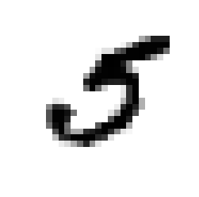
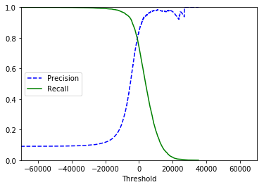
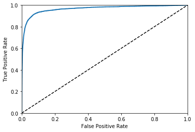
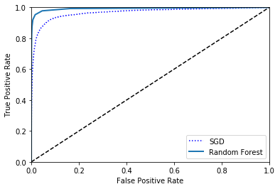
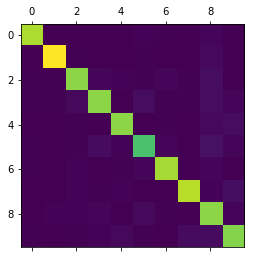
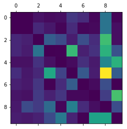
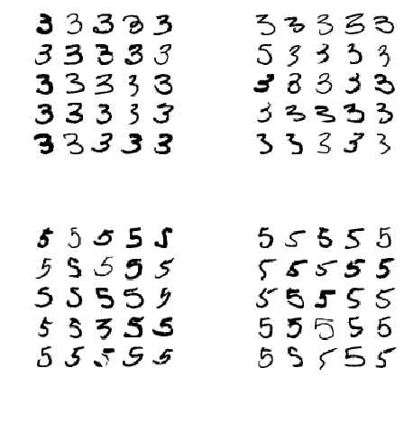
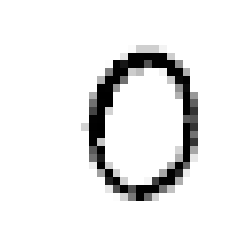

# 准备数据


```python
from sklearn.datasets import fetch_mldata
mnist = fetch_mldata("MNIST original", data_home='./datasets/')
mnist
```

    e:\python\python36\lib\site-packages\sklearn\utils\deprecation.py:77: DeprecationWarning: Function fetch_mldata is deprecated; fetch_mldata was deprecated in version 0.20 and will be removed in version 0.22
      warnings.warn(msg, category=DeprecationWarning)
    e:\python\python36\lib\site-packages\sklearn\utils\deprecation.py:77: DeprecationWarning: Function mldata_filename is deprecated; mldata_filename was deprecated in version 0.20 and will be removed in version 0.22
      warnings.warn(msg, category=DeprecationWarning)


    {'COL_NAMES': ['label', 'data'],
     'DESCR': 'mldata.org dataset: mnist-original',
     'data': array([[0, 0, 0, ..., 0, 0, 0],
            [0, 0, 0, ..., 0, 0, 0],
            [0, 0, 0, ..., 0, 0, 0],
            ...,
            [0, 0, 0, ..., 0, 0, 0],
            [0, 0, 0, ..., 0, 0, 0],
            [0, 0, 0, ..., 0, 0, 0]], dtype=uint8),
     'target': array([0., 0., 0., ..., 9., 9., 9.])}


```python
X, y = mnist["data"], mnist["target"]
```


```python
X.shape
```


    (70000, 784)


```python
y.shape
```


    (70000,)


## 查看图片


```python
%matplotlib inline
import matplotlib
import matplotlib.pyplot as plt

some_digit = X[36000]
some_digit_image = some_digit.reshape(28, 28)
plt.imshow(some_digit_image, cmap=matplotlib.cm.binary,
          interpolation="nearest")
plt.axis("off")
plt.show()
```





```python
y[36000]
```


    5.0


## 准备训练集和测试集


```python
#划分
X_train, X_test, y_train, y_test = X[:60000], X[60000:], y[:60000], y[60000:]
```


```python
#混洗
import numpy as np

shuffle_index = np.random.permutation(60000)
X_train, y_train = X_train[shuffle_index], y_train[shuffle_index]
```

# 训练二元分类


```python
# 数据集中所有为5的置为True,所有不为5的置为False
y_train_5 = (y_train == 5)
y_test_5 = (y_test == 5)
```


```python
#训练
from sklearn.linear_model import SGDClassifier

sgd_clf = SGDClassifier(random_state=42, max_iter=300, tol=1e-3) #设置random_state来取得有复验性的结果
sgd_clf.fit(X_train, y_train_5)
```


    SGDClassifier(alpha=0.0001, average=False, class_weight=None,
           early_stopping=False, epsilon=0.1, eta0=0.0, fit_intercept=True,
           l1_ratio=0.15, learning_rate='optimal', loss='hinge', max_iter=300,
           n_iter=None, n_iter_no_change=5, n_jobs=None, penalty='l2',
           power_t=0.5, random_state=42, shuffle=True, tol=0.001,
           validation_fraction=0.1, verbose=0, warm_start=False)


```python
sgd_clf.predict([some_digit])
```


    array([ True])


# 性能评估

## 用交叉验证集测量精度


```python
from sklearn.model_selection import cross_val_score

cross_val_score(sgd_clf, X_train, y_train_5, cv=3, scoring="accuracy")
```


    array([0.96385, 0.9663 , 0.96225])


```python
# 预测所有的均为非5
from sklearn.base import BaseEstimator

class Never5Classifier(BaseEstimator):
    def fit(self, X, y=None):
        pass
    def predict(self, X):
        return np.zeros((len(X), 1), dtype=bool)

never_5_clf = Never5Classifier()
cross_val_score(never_5_clf, X_train, y_train_5, cv=3, scoring="accuracy")
```


    array([0.90875, 0.9118 , 0.9084 ])


## 混淆矩阵


```python
# 使用cross_val_predict()预测
from sklearn.model_selection import cross_val_predict
y_train_pred = cross_val_predict(sgd_clf, X_train, y_train_5, cv=3)
y_train_pred
```


    array([False, False,  True, ..., False, False,  True])


```python
# 生成混淆矩阵
from sklearn.metrics import confusion_matrix
confusion_matrix(y_train_5, y_train_pred)
```


    array([[53843,   736],
           [ 1416,  4005]], dtype=int64)


```python
y_train_perfect_predictions = y_train_5
confusion_matrix(y_train_5, y_train_perfect_predictions)
```


    array([[54579,     0],
           [    0,  5421]], dtype=int64)


## [准确率和召回率](https://github.com/coldJune/machineLearning/blob/master/machineLearningCourseraNote/Note6.pdf)


```python
from sklearn.metrics import precision_score, recall_score
precision_score(y_train_5, y_train_pred)# 4005/(4005+736)
```


    0.8447584897700907


```python
recall_score(y_train_5, y_train_pred)# 4005/(4005+1416)
```


    0.7387935805201993


```python
# f1score
from sklearn.metrics import f1_score
f1_score(y_train_5, y_train_pred)
```


    0.7882306632552647


## 准确率/召回率权衡


```python
# 返回该实例的度量分数
y_scores = sgd_clf.decision_function([some_digit])
y_scores
```


    array([4067.16672909])


```python
threshold = 0
y_som_digit_pred = (y_scores > threshold)
y_som_digit_pred
```


    array([ True])


```python
threshold = 5000
y_som_digit_pred = (y_scores > threshold)
y_som_digit_pred
```


    array([False])


```python
y_scores = cross_val_predict(sgd_clf, X_train, y_train_5, cv=3, method="decision_function")#使用decision_function代替predictions
```


```python
# 画出准确率和召回率的曲线
from sklearn.metrics import precision_recall_curve

precisions, recalls, thresholds = precision_recall_curve(y_train_5, y_scores)

def plot_precision_recall_vs_threshold(precisions, recalls, thresholds):
    plt.plot(thresholds, precisions[:-1], "b--", label="Precision")
    plt.plot(thresholds, recalls[:-1], "g-", label="Recall")
    plt.xlabel("Threshold")
    plt.legend(loc="center left")
    plt.ylim([0, 1])
    plt.xlim([-70000, 70000])

plot_precision_recall_vs_threshold(precisions, recalls, thresholds)
plt.show()
```





```python
#90%precision
y_train_pred_90 = (y_scores > 20000)
precision_score(y_train_5, y_train_pred_90)
```


    0.9716981132075472


```python
recall_score(y_train_5, y_train_pred_90)
```


    0.019000184467810367


## [ROC曲线](http://coldjune.com/2018/05/23/AdaBoost%E5%85%83%E7%AE%97%E6%B3%95/#%E6%AD%A3%E7%A1%AE%E7%8E%87%E3%80%81%E5%8F%AC%E5%9B%9E%E7%8E%87%E5%8F%8AROC%E6%9B%B2%E7%BA%BF)


```python
from sklearn.metrics import roc_curve

fpr, tpr, thresholds = roc_curve(y_train_5, y_scores)

def plot_roc_curve(fpr, tpr, label=None):
    plt.plot(fpr, tpr, linewidth=2, label=label)
    plt.plot([0,1], [0,1], 'k--')
    plt.axis([0, 1, 0, 1])
    plt.xlabel('False Positive Rate')
    plt.ylabel('True Positive Rate')

plot_roc_curve(fpr, tpr)
plt.show()
```





```python
from sklearn.metrics import roc_auc_score
roc_auc_score(y_train_5, y_scores)
```


    0.9665469033599001


```python
#随机森林的ROC曲线
from sklearn.ensemble import RandomForestClassifier

forest_clf = RandomForestClassifier(random_state=42, n_estimators=10)
y_probas_forest = cross_val_predict(forest_clf, X_train, y_train_5, cv=3, method='predict_proba')

y_scores_forest = y_probas_forest[:,1]
fpr_forest, tpr_forest, thresholds_forest = roc_curve(y_train_5, y_scores_forest)

plt.plot(fpr, tpr, 'b:', label="SGD")
plot_roc_curve(fpr_forest, tpr_forest, "Random Forest")
plt.legend(loc="lower right")
plt.show()
```





```python
roc_auc_score(y_train_5, y_scores_forest)
```


    0.9923774040313053


# 多级分类


```python
sgd_clf.fit(X_train, y_train)#底层训练了10个二元分类器，选择最大的
sgd_clf.predict([some_digit])
```

    e:\python\python36\lib\site-packages\sklearn\linear_model\stochastic_gradient.py:603: ConvergenceWarning: Maximum number of iteration reached before convergence. Consider increasing max_iter to improve the fit.
      ConvergenceWarning)


    array([5.])


```python
some_digit_scores = sgd_clf.decision_function([some_digit])
some_digit_scores
```


    array([[ -1924.18040085, -24335.92781177,  -8446.0176118 ,
             -1942.26247443, -13280.95661159,   4067.16672909,
            -15844.49239355, -21310.04623554,  -9717.41918688,
            -12970.31612817]])


```python
np.argmax(some_digit_scores)
```


    5


```python
sgd_clf.classes_
```


    array([0., 1., 2., 3., 4., 5., 6., 7., 8., 9.])


```python
sgd_clf.classes_[5]
```


    5.0


```python
#使用一对一的训练器
from sklearn.multiclass import OneVsOneClassifier

ovo_clf = OneVsOneClassifier(SGDClassifier(random_state=42, max_iter=500, tol=1e-3))
ovo_clf.fit(X_train, y_train)
ovo_clf.predict([some_digit])
```


    array([5.])


```python
len(ovo_clf.estimators_)
```


    45


```python
forest_clf.fit(X_train, y_train)
forest_clf.predict([some_digit])
```


    array([5.])


```python
forest_clf.predict_proba([some_digit])
```


    array([[0. , 0. , 0. , 0. , 0. , 0.9, 0. , 0. , 0.1, 0. ]])


```python

cross_val_score(sgd_clf, X_train, y_train, cv=3, scoring="accuracy")
```


    array([0.88242352, 0.8860443 , 0.87363104])


```python
# 缩减输入
from sklearn.preprocessing import StandardScaler
scaler = StandardScaler()
X_train_scaled = scaler.fit_transform(X_train.astype(np.float64))
cross_val_score(sgd_clf, X_train_scaled, y_train, cv=3, scoring="accuracy")
```

    e:\python\python36\lib\site-packages\sklearn\linear_model\stochastic_gradient.py:603: ConvergenceWarning: Maximum number of iteration reached before convergence. Consider increasing max_iter to improve the fit.
      ConvergenceWarning)
    e:\python\python36\lib\site-packages\sklearn\linear_model\stochastic_gradient.py:603: ConvergenceWarning: Maximum number of iteration reached before convergence. Consider increasing max_iter to improve the fit.
      ConvergenceWarning)
    e:\python\python36\lib\site-packages\sklearn\linear_model\stochastic_gradient.py:603: ConvergenceWarning: Maximum number of iteration reached before convergence. Consider increasing max_iter to improve the fit.
      ConvergenceWarning)


    array([0.91106779, 0.91079554, 0.90988648])


# 误差分析


```python
#首先查看混淆矩阵
y_train_pred = cross_val_predict(sgd_clf, X_train_scaled, y_train, cv=3)
conf_mx = confusion_matrix(y_train, y_train_pred)
conf_mx
```

    e:\python\python36\lib\site-packages\sklearn\linear_model\stochastic_gradient.py:603: ConvergenceWarning: Maximum number of iteration reached before convergence. Consider increasing max_iter to improve the fit.
      ConvergenceWarning)
    e:\python\python36\lib\site-packages\sklearn\linear_model\stochastic_gradient.py:603: ConvergenceWarning: Maximum number of iteration reached before convergence. Consider increasing max_iter to improve the fit.
      ConvergenceWarning)
    e:\python\python36\lib\site-packages\sklearn\linear_model\stochastic_gradient.py:603: ConvergenceWarning: Maximum number of iteration reached before convergence. Consider increasing max_iter to improve the fit.
      ConvergenceWarning)


    array([[5657,    1,   16,    9,   12,   53,   40,    6,  125,    4],
           [   1, 6451,   43,   24,    5,   46,    6,    9,  142,   15],
           [  36,   29, 5339,   95,   74,   26,   78,   42,  226,   13],
           [  38,   26,  128, 5334,    2,  226,   29,   48,  216,   84],
           [  15,   15,   47,   14, 5323,   10,   43,   23,  148,  204],
           [  39,   19,   33,  177,   60, 4602,   83,   24,  297,   87],
           [  28,   22,   51,    2,   40,   96, 5591,   10,   78,    0],
           [  19,   16,   58,   32,   53,    8,    8, 5764,   63,  244],
           [  22,   73,   56,  111,    6,  138,   39,   12, 5318,   76],
           [  26,   22,   30,   73,  132,   33,    2,  186,  189, 5256]],
          dtype=int64)


```python
#使用图像显示矩阵
plt.matshow(conf_mx)
plt.show()
```





```python
#画出误差
row_nums =conf_mx.sum(axis=1, keepdims=True)#计算每一类实际的数量
row_nums
```


    array([[5923],
           [6742],
           [5958],
           [6131],
           [5842],
           [5421],
           [5918],
           [6265],
           [5851],
           [5949]], dtype=int64)


```python
norm_conf_mx = conf_mx/row_nums# 计算错误比例
norm_conf_mx
```


    array([[9.55090326e-01, 1.68833361e-04, 2.70133378e-03, 1.51950025e-03,
            2.02600034e-03, 8.94816816e-03, 6.75333446e-03, 1.01300017e-03,
            2.11041702e-02, 6.75333446e-04],
           [1.48323939e-04, 9.56837734e-01, 6.37792940e-03, 3.55977455e-03,
            7.41619697e-04, 6.82290122e-03, 8.89943637e-04, 1.33491546e-03,
            2.10619994e-02, 2.22485909e-03],
           [6.04229607e-03, 4.86740517e-03, 8.96106076e-01, 1.59449480e-02,
            1.24202753e-02, 4.36388050e-03, 1.30916415e-02, 7.04934542e-03,
            3.79321920e-02, 2.18194025e-03],
           [6.19801011e-03, 4.24074376e-03, 2.08775077e-02, 8.70004893e-01,
            3.26211059e-04, 3.68618496e-02, 4.73006035e-03, 7.82906541e-03,
            3.52307943e-02, 1.37008645e-02],
           [2.56761383e-03, 2.56761383e-03, 8.04519000e-03, 2.39643958e-03,
            9.11160561e-01, 1.71174255e-03, 7.36049298e-03, 3.93700787e-03,
            2.53337898e-02, 3.49195481e-02],
           [7.19424460e-03, 3.50488840e-03, 6.08743774e-03, 3.26508024e-02,
            1.10680686e-02, 8.48920863e-01, 1.53108283e-02, 4.42722745e-03,
            5.47869397e-02, 1.60486995e-02],
           [4.73132815e-03, 3.71747212e-03, 8.61777628e-03, 3.37952011e-04,
            6.75904022e-03, 1.62216965e-02, 9.44744846e-01, 1.68976005e-03,
            1.31801284e-02, 0.00000000e+00],
           [3.03272147e-03, 2.55387071e-03, 9.25778132e-03, 5.10774142e-03,
            8.45969673e-03, 1.27693536e-03, 1.27693536e-03, 9.20031923e-01,
            1.00558659e-02, 3.89465283e-02],
           [3.76004102e-03, 1.24764997e-02, 9.57101350e-03, 1.89711160e-02,
            1.02546573e-03, 2.35857118e-02, 6.66552726e-03, 2.05093146e-03,
            9.08904461e-01, 1.29892326e-02],
           [4.37048243e-03, 3.69810052e-03, 5.04286435e-03, 1.22709699e-02,
            2.21886031e-02, 5.54715078e-03, 3.36190956e-04, 3.12657590e-02,
            3.17700454e-02, 8.83509834e-01]])


```python
np.fill_diagonal(norm_conf_mx, 0)#将对角线置为0，只显示误差
plt.matshow(norm_conf_mx)#行越暗表示预测越正确，越亮表示误差越高
plt.show()
```





```python
#画出所有的3和5
cl_3, cl_5 = 3, 5
X_33 = X_train[(y_train == cl_3) & (y_train_pred == cl_3)]#实际为3和预测为3
X_35 = X_train[(y_train == cl_3) & (y_train_pred == cl_5)]#实际为3和预测为5
X_53 = X_train[(y_train == cl_5) & (y_train_pred == cl_3)]#实际为5和预测为3
X_55 = X_train[(y_train == cl_5) & (y_train_pred == cl_5)]#实际为5和预测为5

def plot_digits(instances, images_per_row=10, **options):
    size = 28
    images_per_row = min(len(instances), images_per_row)
    images = [instance.reshape(size,size) for instance in instances]
    n_rows = images_per_row+1
    row_images = []
    n_empty = n_rows * images_per_row - len(instances)
    images.append(np.zeros((size, size * n_empty)))
    for row in range(n_rows):
        rimages = images[row * images_per_row : (row + 1) * images_per_row]
        row_images.append(np.concatenate(rimages, axis=1))
    image = np.concatenate(row_images, axis=0)
    plt.imshow(image, cmap=matplotlib.cm.binary, **options)
    plt.axis("off")


plt.figure(figsize=(8,8))
plt.subplot(221)
plot_digits(X_33[:25], images_per_row=5)
plt.subplot(222)
plot_digits(X_35[:25], images_per_row=5)
plt.subplot(223)
plot_digits(X_53[:25], images_per_row=5)
plt.subplot(224)
plot_digits(X_55[:25], images_per_row=5)
```





# 多标签分类


```python
from sklearn.neighbors import KNeighborsClassifier
y_train_large = (y_train >= 7)
y_train_odd = (y_train %2 == 1)
y_multilabel = np.c_[y_train_large, y_train_odd]

knn_clf = KNeighborsClassifier()
knn_clf.fit(X_train, y_multilabel)
```


    KNeighborsClassifier(algorithm='auto', leaf_size=30, metric='minkowski',
               metric_params=None, n_jobs=None, n_neighbors=5, p=2,
               weights='uniform')


```python
knn_clf.predict([some_digit])
```


    array([[False,  True]])


```python
#计算F1
y_train_knn_pred = cross_val_predict(knn_clf, X_train, y_train, cv=3)
f1_score(y_train, y_train_knn_pred, average="macro")
```


    0.9686571237993065


# 多路输出


```python
#在图片数据上添加噪声
import numpy.random as rnd

noise = rnd.randint(0, 100, (len(X_train), 784))
X_train_mod = X_train + noise

noise = rnd.randint(0, 100, (len(X_test), 784))
X_test_mod = X_test + noise

y_train_mod = X_train
y_test_mod = X_test
```


```python
def plot_digit(data):
    image = data.reshape(28, 28)
    plt.imshow(image, cmap = matplotlib.cm.binary,
               interpolation="nearest")
    plt.axis("off")

knn_clf.fit(X_train_mod, y_train_mod)
clean_digit = knn_clf.predict([X_test_mod[2]])
plot_digit(clean_digit)
```



****
[源文件](https://github.com/coldJune/machineLearning/blob/master/handson-ml/Classification.ipynb)
