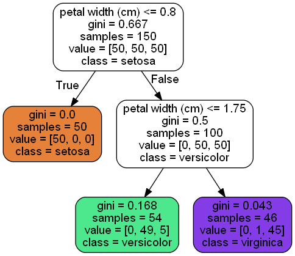

# 训练和显示决策树


```python
from sklearn.datasets import load_iris
from sklearn.tree import DecisionTreeClassifier

iris = load_iris()
X = iris.data[:, 2:]
y = iris.target

tree_clf = DecisionTreeClassifier(max_depth=2)
tree_clf.fit(X, y)
```


    DecisionTreeClassifier(class_weight=None, criterion='gini', max_depth=2,
                max_features=None, max_leaf_nodes=None,
                min_impurity_decrease=0.0, min_impurity_split=None,
                min_samples_leaf=1, min_samples_split=2,
                min_weight_fraction_leaf=0.0, presort=False, random_state=None,
                splitter='best')


```python
# 生成dot文件
from sklearn.tree import export_graphviz
import os
def image_path(fig_id):
    return os.path.join('.', "images", "decision_trees", fig_id)

export_graphviz(
    tree_clf,
    out_file=image_path('iris_tree.dot'),
    feature_names=iris.feature_names[2:],
    class_names=iris.target_names,
    rounded=True,
    filled=True
)
```

## [安装graphviz](https://graphviz.gitlab.io/download/)

> dot -Tpng .\images\decision_trees\iris_tree.dot -o .\images\decision_trees\iris_tree.png


# 预测和评估分类可能性


```python
tree_clf.predict_proba([[5, 1.5]])
```


    array([[0.        , 0.90740741, 0.09259259]])


```python
tree_clf.predict([[5, 1.5]])
```


    array([1])


# 回归


```python
from sklearn.tree import DecisionTreeRegressor

tree_reg = DecisionTreeRegressor(max_depth=2)
tree_reg.fit(X, y)
```


    DecisionTreeRegressor(criterion='mse', max_depth=2, max_features=None,
               max_leaf_nodes=None, min_impurity_decrease=0.0,
               min_impurity_split=None, min_samples_leaf=1,
               min_samples_split=2, min_weight_fraction_leaf=0.0,
               presort=False, random_state=None, splitter='best')


```python
export_graphviz(
    tree_clf,
    out_file=image_path('iris_tree_regression.dot'),
    feature_names=iris.feature_names[2:],
    class_names=iris.target_names,
    rounded=True,
    filled=True
)
```



****
[源文件](https://github.com/coldJune/machineLearning/blob/master/handson-ml/Decision%20Trees.ipynb)
