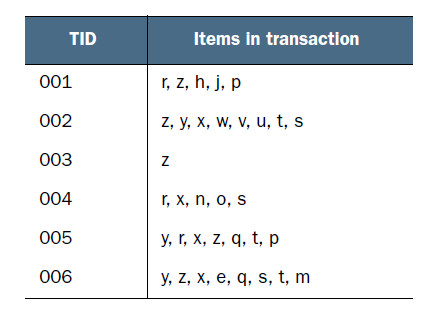
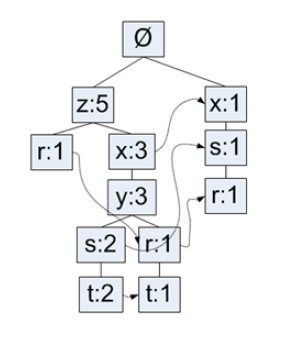
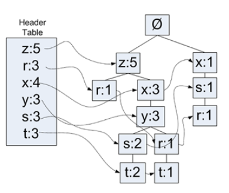
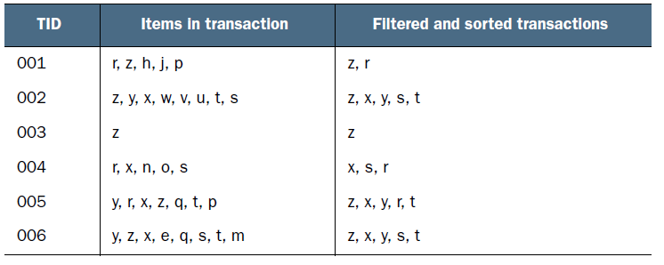
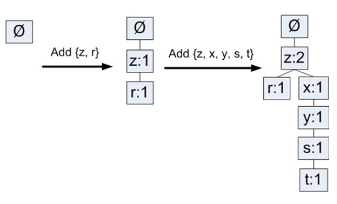
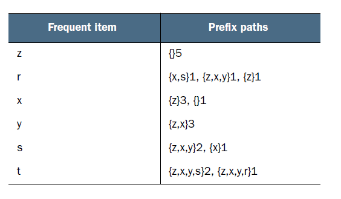
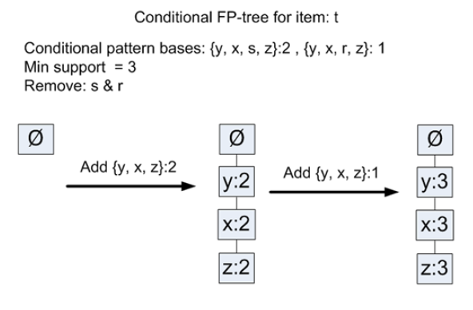

## FP-growth算法概述
> 基于Apriori构建，将数据集存储在一个特定的称作FP树的结构之后发现频繁项集或者频繁项对，即常在一块出现的元素项的集合FP树

### FP-growth算法的优缺点
* 优点：一般要快于Apriori
* 缺点：实现比较困难，在某些数据集上性能会下降
* 适用数据类型：标称型数据

### 工作原理
FP-growth算法将数据存储在一种称为FP树的紧凑数据结构中。FP代表 **频繁模式(Frequent Pattern)**。一棵FP树与计算机科学中的其他树结构类似，但是它通过连接(link)来连接相似元素，被连起来的元素项可以看成一个链表。一个元素项可以在一棵FP树中出现多次。FP树会存储项集的出现频率，而每个项集会以路径的方式存储在树中。存在相似元素的集合会共享树的一部分。只有当集合之间完全不同时，树才会分叉。树节点上给出集合中的单个元素及其在序列中的出现次数，路径会给出该序列的出现次数。相似项之间的连接即 **节点连接(node link)**，用于快速发现相似项的位置。
* 简单示例数据

* 一棵FP树

上图中元素项$z$出现了5次，集合$\{r,z\}$出现了1次，$\{t,s,y,x,z\}$出现了2次，$\{t,r,y,x,z\}$出现了一次。元素$z$的右边标的是5，表示z出现了5次，刚才的集合已经给出了4次出现，所以$z$单独出现1次。

FP-growth算法工作流程如下：
1. 构建FP树
  * 扫描第一遍数据，对所有元素项的出现次数进行计数(如果某元素不频繁，那么该元素的超集也不频繁)
2. 第二遍扫描，利用FP树挖掘频繁项集

### FP-growth算法的一般流程
1. 收集数据：用任何方法
2. 准备数据：由于存储的是集合，所以需要离散数据。处理连续数据需要将它们量化为离散值
3. 分析数据：使用任意方法
4. 训练算法：构建一个FP树，并对树进行挖掘
5. 测试算法：没有测试过程
6. 使用算法：可用于识别经常出现的元素项，从而用于指定决策、推荐元素或进行预测

## FP-growth算法实现
### 构建FP树
* FP树类定义
```Python
# 树结构
class TreeNode:
    def __init__(self, name_value, num_occur, parent_node):
        """初始化方法
        :param name_value: 节点名称
        :param num_occur: 对应节点元素的个数
        :param parent_node: 父节点
        """
        self.name = name_value
        self.count = num_occur
        # 链接相似的元素项
        self.node_link = None
        self.parent = parent_node
        self.children = {}

    def inc(self, num_occur):
        """计数值
        :param num_occur: 数量
        :return:
        """
        self.count += num_occur

    def display(self, ind=1):
        """显示树结构
        :param ind: 子树锁进个数
        :return:
        """
        print(' '*ind, self.name, ' ', self.count)
        for child in self.children.values():
            child.display(ind+1)
```

除了给出的FP树之外，还需要一个头指针表来指向给定类型的第一个实例。利用头指针表，可以快速访问FP树中一个给定类型的所有元素。这里使用一个字典作为数据结构来保存头指针表，除了存放指针外，头指针表还可以用来保存FP树中每类元素的总数。
* 带头指针表的FP树


第一次遍历数据集会获得每个元素项的出现频率，然后去掉不满足最小支持度的元素项。下一步构建FP树，在构建时，读入每个项集并将其添加到一条已存在的路径中，如果该路径不存在，则创建一条新路径。由于每个事务都是无序集合，假设有集合$\{z,x,y\}$和$\{y,z,r\}$，在FP树中相同项($y$)只表示一次。为了解决这个问题，在将集合添加到树之前，需要对每个集合基于元素项的绝对出现频率来进行排序。
* 将非频繁项移除并且重排序后的事务数据集


对事务记录过滤和排序后，就可以构建FP树。从空集($\phi$)开始，向其中不断添加频繁项集。过滤、排序后的事务依次添加到树中，如果树中已存在现有元素，则增加现有元素的值；如果元素不存在，则向树添加一个分枝。
* FP树构建过程

* FP树构建函数
```Python
create_tree(data_set, min_sup=1):
   """构建FP树
   :param data_set: 数据集
   :param min_sup: 最小支持度
   :return:
   """
   # 用字典创建头指针表
   header_table = {}
   for trans in data_set:
       # 扫描数据集
       for item in trans:
           # 统计每个元素项出现的频度
           # 将信息存储在头指针标中
           header_table[item] = header_table.get(item, 0) + data_set[trans]
   keys = header_table.keys()
   for key in list(keys):
       if header_table[key] < min_sup:
           # 删除头指针表中出现次数少于最小支持度的项
           del(header_table[key])
   # 对头指针表中的数据去重
   freq_item_set = set(header_table.keys())
   if len(freq_item_set) == 0:
       # 如果去重后的数据为空则返回None
       return None, None
   for key in header_table:
       # 扩展头指针表
       # 用于保存元素项的计数值及指向第一个元素项的指针
       header_table[key] = [header_table[key], None]
   # 创建只包含空集合的根节点
   ret_tree = TreeNode('Null Set', 1, None)
   for tran_set, count in data_set.items():
       # 遍历数据集
       local_d = {}
       for item in tran_set:
           if item in freq_item_set:
               # 统计元素全局频率
               local_d[item] = header_table[item][0]
       if len(local_d) > 0:
           # 如果元素大于0
           # 根据全局频率对每个事务中的元素进行排序
           ordered_items = [v[0] for v in sorted(local_d.items(),
                                                 key=lambda p: p[1], reverse=True)]
           # 更新树
           update_tree(ordered_items, ret_tree, header_table, count)
   return ret_tree, header_table


def update_tree(items, in_tree, header_table, count):
   """更新树
   :param items: 一个项集
   :param in_tree: 树
   :param header_table: 头指针表
   :param count: 该项集对应的计数
   :return:
   """
   if items[0] in in_tree.children:
       # 测试事务的第一恶搞元素是否作为子节点
       # 如果是，更新该元素项的计数
       in_tree.children[items[0]].inc(count)
   else:
       # 如果不存在
       # 创一个新的子节点添加到树中
       in_tree.children[items[0]] = TreeNode(items[0], count, in_tree)
       if header_table[items[0]][1] is None:
           # 如果头指针没有指向
           # 将其添加到头指针指向
           header_table[items[0]][1] = in_tree.children[items[0]]
       else:
           # 否则在该元素项头指针列表后面进行更新
           update_header(header_table[items[0]][1], in_tree.children[items[0]])
   if len(items) > 1:
       # 迭代调用
       # 每次去掉列表中的第一个元素
       update_tree(items[1::], in_tree.children[items[0]], header_table, count)


def update_header(node_to_test, target_node):
   """更新头指针列表
   :param node_to_test: 指针为止
   :param target_node: 当前节点
   :return:
   """
   while node_to_test.node_link is not None:
       # 更新指针为止直到成为尾指针
       node_to_test = node_to_test.node_link
   # 将该节点添加到尾指针后面
   node_to_test.node_link = target_node
```
* 简单数据集及包装器
```Python
def load_simple_dat():
    """创建简单数据集
    :return:
    """
    simple_dat = [['r', 'z', 'h', 'j', 'p'],
               ['z', 'y', 'x', 'w', 'v', 'u', 't', 's'],
               ['z'],
               ['r', 'x', 'n', 'o', 's'],
               ['y', 'r', 'x', 'z', 'q', 't', 'p'],
               ['y', 'z', 'x', 'e', 'q', 's', 't', 'm']]
    return simple_dat


def create_init_set(data_set):
    """包装数据为字典
    :param data_set: 数据集
    :return:
    """
    ret_dict = {}
    for trans in data_set:
        ret_dict[frozenset(trans)] = 1
    return ret_dict
```
### 挖掘频繁项集
#### 抽取条件模式基
从FP树中抽取频繁项集的步骤：
1. 从FP树中获得条件模式基
2. 利用条件模式基，构建一个条件FP树
3. 迭代重复步骤(1)和步骤(2)，直到树包含一个元素项为止

**条件模式基(conditional pattern base)** 是以查找元素项为结尾的路径集合。每一条路径都是一条 **前缀路径(prefix path)**，即介于所查找元素项与根节点之间的所有内容。
* 带头指针表的FP树

上图中符号$r$的前缀路径是$\{x,s\}$、$\{z,x,y\}$和$\{z\}$。每一条前缀路径都与一个计数值关联。该计数值等于起始元素项的计数值，该计数值给了每条路径上r的数目
* 每个频繁项的前缀路径

* 查找前缀路径
```Python
def ascend_tree(leaf_node, prefix_path):
    """上溯FP树
    :param leaf_node: 树节点
    :param prefix_path: 前缀路径
    :return:
    """
    if leaf_node.parent is not None:
        # 如果树节点的父节点不为空
        # 添加前缀路径
        prefix_path.append(leaf_node.name)
        # 上溯父节点
        ascend_tree(leaf_node.parent, prefix_path)


def find_prefix_path(base_path, tree_node):
    """寻找前缀路径
    :param base_path: 基本路径
    :param tree_node: 树节点
    :return:
    """
    # 条件模式基字典
    cond_paths = {}
    while tree_node is not None:
        # 如果树节点不为空
        prefix_path = []
        # 从该节点上溯
        ascend_tree(tree_node, prefix_path)
        if len(prefix_path) > 1:
            # 更新该条件模式基的数目
            cond_paths[frozenset(prefix_path[1:])] = tree_node.count
        # 指向链表的下一个元素
        tree_node = tree_node.node_link
    return cond_paths
```
#### 构建条件FP树
对于每一个频繁项都要创建一棵条件FP树，使用每一个频繁项的条件模式基作为输入数据，通过相同的建树代码构建条件树。然后递归发现频繁项、发现条件模式基以及另外的条件数
* 元素项t的条件FP树构建过程

最初树以空集作为根节点。接下来原始的集合$\{y,x,s,z\}$中的集合$\{y,x,z\}$被添加进来。因为不满足最小支持度要求，字符$s$并没有加入。类似地$\{y,x,z\}$也从原始集合$\{y,x,r,z\}$中添加进来
* 查找频繁项集
```Python
def mine_tree(in_tree, header_table, min_sup, pre_fix, freq_item_list):
    """查找频繁项集
    :param in_tree: 树
    :param header_table: 头指针列表
    :param min_sup: 最小支持度
    :param pre_fix: 前缀路径
    :param freq_item_list: 频繁项列表
    :return:
    """
    # 对头指针表中的元素按照其出现频率进行排序
    big_list = [v[0] for v in sorted(header_table.items(), key=lambda p: p[0])]
    for base_pat in big_list:
        # 将频繁项添加到频繁项列表
        new_freq_set = pre_fix.copy()
        new_freq_set.add(base_pat)
        freq_item_list.append(new_freq_set)
        # 查找条件模式基
        cond_patt_bases = find_prefix_path(base_pat, header_table[base_pat][1])
        # 创建条件基对应的FP树
        my_cond_tree, my_head = create_tree(cond_patt_bases, min_sup)
        if my_head is not None:
            # 如果树中有元素项递归调用
            print('conditional tree for: ', new_freq_set)
            my_cond_tree.display()
            mine_tree(my_cond_tree, my_head, min_sup, new_freq_set, freq_item_list)
```
## 示例：从新闻网站点击流中挖掘
* 提取新闻频繁项集
```Python
In [10]: parsed_dat = [line.split() for line in open('data/kosarak.dat').readlines()]#将数据集导入列表

In [11]: init_set = fp_growth.create_init_set(parsed_dat)#初始集合格式化

In [12]: my_fp_tree, my_header = fp_growth.create_tree(init_set, 100000)#构建FP树，寻找至少被10万人浏览过的新闻

In [13]: my_freq_list = []#创建空列表保存频繁项集

In [14]: fp_growth.mine_tree(my_fp_tree,my_header,100000,set([]),my_freq_list)
conditional tree for:  {'1'}
  Null Set   1
   6   107404
conditional tree for:  {'11'}
  Null Set   1
   6   261773
conditional tree for:  {'3'}
  Null Set   1
   6   186289
    11   117401
   11   9718
conditional tree for:  {'11', '3'}
  Null Set   1
   6   117401

In [15]: len(my_freq_list)
Out[15]: 9

In [16]: my_freq_list
Out[16]:
[{'1'},
 {'1', '6'},
 {'11'},
 {'11', '6'},
 {'3'},
 {'11', '3'},
 {'11', '3', '6'},
 {'3', '6'},
 {'6'}]
```
