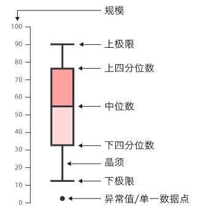

# 前言
&nbsp;&nbsp;&nbsp;&nbsp;&nbsp;&nbsp;&nbsp;&nbsp;我真正接触Kaggle是在做《Hands-On Machine Learning with Scikit-Learn and TensorFlow》的一道练习题的时候，那道练习题使用的数据是Kaggle上一个分类数据集——[Titanic: Machine Learning from Disaster](https://www.kaggle.com/c/titanic)，当我登录这个页面的时候后发现这是一个非常热门的项目，其参与团队(个人)已经达到了11223个，这对我这样一个初来乍到的人是一个不小的冲击，抱着决定在这个平台试一试的心态我开始寻找适合我的项目。
&nbsp;&nbsp;&nbsp;&nbsp;&nbsp;&nbsp;&nbsp;&nbsp;[House-Prices-Advanced-Regression-Techniques](https://www.kaggle.com/c/house-prices-advanced-regression-techniques)是Kaggle上的一个知识性竞赛，作为一个回归问题，它提供了适量的数据以及特征供学习者使用；而作为机器学习的入门项目它帮助了很多人完成了从0到1的过程，现在上面有4746个团队(个人)提交了自己的预测结果。我作为一名学习者，也通过自己的努力在上面获得了自己的分数——0.12702，这是使用`KernelRidge`实现的模型进行预测的结果，这并不算一个很好的评分，大概排在1757名左右(前37%)，但对我来说确实一个很大的进步，这标示着从无到有的过程。
&nbsp;&nbsp;&nbsp;&nbsp;&nbsp;&nbsp;&nbsp;&nbsp;kaggle对于数据初学者来说确实是一个非常适合的平台，kaggler们都不吝啬自己的知识，发布着自己的kernel，表述自己的想法，借此帮助每一个需要帮助的社区成员。能完成这个项目对我来说意义非凡，在这里我特别感谢kaggle上的两位kaggler以及他们的对自己项目的无私奉献，他们分别是[@Pedro Marcelino](https://www.kaggle.com/pmarcelino)和他的kenel——[Comprehensive data exploration with Python](https://www.kaggle.com/pmarcelino/comprehensive-data-exploration-with-python),他对数据的分析以及把控让现在的我难以望其项背，给了我非常大的启发；以及[@Serigne](https://www.kaggle.com/serigne)和他的kernel——[Stacked Regressions : Top 4% on LeaderBoard](https://www.kaggle.com/serigne/stacked-regressions-top-4-on-leaderboard),他同样用了[@Pedro Marcelino](https://www.kaggle.com/pmarcelino)的数据分析方法，但是他在数据分析的基础上增加了模型的训练以及分析过程，帮助我学会把控自己的模型。再次对他们表示真挚的感谢。
&nbsp;&nbsp;&nbsp;&nbsp;&nbsp;&nbsp;&nbsp;&nbsp;虽然这个项目的准确程度还可以有很大的提升，但就我现在的能力而言我决定让它暂且休息一下，好回头看看，总结总结得失。

# 准备工作
&nbsp;&nbsp;&nbsp;&nbsp;&nbsp;&nbsp;&nbsp;&nbsp;在我个人的学习过程中，对于机器学习的理解一直都是觉得算法有多么多么重要，但当我真正着手去做的时候，发现事实其实与我想象中的大相径庭。不可否认，算法是构建模型的关键步骤，是不可逾越的一道关隘，但是其对最终模型的起到的作用其实并没有想象中的那么重要。这不经让我想到微软发布的那个关于数据和算法对模型影响的论文——[The Unreasonable Effectiveness of Data](http://static.googleusercontent.com/media/research.google.com/fr//pubs/archive/35179.pdf)，这篇论文说明了当数据量达到一定程度时，算法的优劣将被摒弃，颇有一些殊途同归的意思。而按我的理解，当数据的质量达到一定程度时，算法的优劣差异也会被一定程度上的减弱。我想这也是那么多前辈强调特征工程重要性的原因。
## 数据篇
&nbsp;&nbsp;&nbsp;&nbsp;当我们拿到一份数据的时侯不是将它直接塞入算法，让算法产出一个模型，而应该是先对数据有一个全局的insight，了解数据的组成成分，包括以下几点：
1. 目标
&nbsp;&nbsp;&nbsp;&nbsp;即分类任务或者回归任务，观察需要预测的目标的分布，可以借用`seaborn`库进行可视化
2. 特征值
&nbsp;&nbsp;&nbsp;&nbsp;即实例的属性，确定属性值是离散的类别标签还是连续的数值型数据，对不同类型的数据需要进行不同的处理
3. 异常值
&nbsp;&nbsp;&nbsp;&nbsp;不是所有的数据分布都是合理的，在数据集中可能存在部分数据的分布超过一定的阈值，这部分数据被称作异常值或者离群点，对异常值的处理需要非常谨慎，这部分数据对模型的好坏起着非常关键的作用。
4. 空值
&nbsp;&nbsp;&nbsp;&nbsp;空值一般是指那种数据集中缺失的值，这部分值可能代表数据的特性，如表示某种特征，也可能只是单纯的缺失值。如果是单纯的值缺失，数值类型可以使用中位数进行填充，而类别标签可以用当前特征表示某种类别数量最多的类别值填充；而如果是表示某种特征，则可以使用`None`填充类别标签，用`0`填充数值特征，表示该缺失类别
### 观测
&nbsp;&nbsp;&nbsp;&nbsp;&nbsp;&nbsp;&nbsp;&nbsp;kaggle有一个非常友好的地方，那就是在每一个项目里面都有关于这个数据集的描述，这个项目的描述文件可以在[data_description.txt](https://github.com/coldJune/machineLearning/blob/master/kaggle/house_price/data_description.txt)中看到。结合描述文件和一些python代码可以对数据有一个比较清晰的认知，了解特征的特性、取值和分布，了解目标的特性以及特征和目标之间的直接关系，下面的代码用表的方式直观地展现了数据的一些特性。
```python
# 导入相关数据包
import pandas as pd
import numpy as np
import seaborn as sbn
import matplotlib.pyplot as plt
import warnings

def ignore_warn(*args, **kwargs):
    # 忽略警告输出
    pass
warnings.warn = ignore_warn
# 设置最大显示列数
pd.set_option("display.max_columns",500)
# 导入数据
data = pd.read_csv('./house_price/train.csv')
#展示数据的前5行
data.head()
```
<div>
<style scoped>
    .dataframe tbody tr th:only-of-type {
        vertical-align: middle;
    }

    .dataframe tbody tr th {
        vertical-align: top;
    }

    .dataframe thead th {
        text-align: right;
    }
</style>
<table border="1" class="dataframe">
  <thead>
    <tr style="text-align: right;">
      <th></th>
      <th>Id</th>
      <th>MSSubClass</th>
      <th>MSZoning</th>
      <th>LotFrontage</th>
      <th>LotArea</th>
      <th>Street</th>
      <th>Alley</th>
      <th>LotShape</th>
      <th>LandContour</th>
      <th>Utilities</th>
      <th>LotConfig</th>
      <th>LandSlope</th>
      <th>Neighborhood</th>
      <th>Condition1</th>
      <th>Condition2</th>
      <th>BldgType</th>
      <th>HouseStyle</th>
      <th>OverallQual</th>
      <th>OverallCond</th>
      <th>YearBuilt</th>
      <th>YearRemodAdd</th>
      <th>RoofStyle</th>
      <th>RoofMatl</th>
      <th>Exterior1st</th>
      <th>Exterior2nd</th>
      <th>MasVnrType</th>
      <th>MasVnrArea</th>
      <th>ExterQual</th>
      <th>ExterCond</th>
      <th>Foundation</th>
      <th>BsmtQual</th>
      <th>BsmtCond</th>
      <th>BsmtExposure</th>
      <th>BsmtFinType1</th>
      <th>BsmtFinSF1</th>
      <th>BsmtFinType2</th>
      <th>BsmtFinSF2</th>
      <th>BsmtUnfSF</th>
      <th>TotalBsmtSF</th>
      <th>Heating</th>
      <th>HeatingQC</th>
      <th>CentralAir</th>
      <th>Electrical</th>
      <th>1stFlrSF</th>
      <th>2ndFlrSF</th>
      <th>LowQualFinSF</th>
      <th>GrLivArea</th>
      <th>BsmtFullBath</th>
      <th>BsmtHalfBath</th>
      <th>FullBath</th>
      <th>HalfBath</th>
      <th>BedroomAbvGr</th>
      <th>KitchenAbvGr</th>
      <th>KitchenQual</th>
      <th>TotRmsAbvGrd</th>
      <th>Functional</th>
      <th>Fireplaces</th>
      <th>FireplaceQu</th>
      <th>GarageType</th>
      <th>GarageYrBlt</th>
      <th>GarageFinish</th>
      <th>GarageCars</th>
      <th>GarageArea</th>
      <th>GarageQual</th>
      <th>GarageCond</th>
      <th>PavedDrive</th>
      <th>WoodDeckSF</th>
      <th>OpenPorchSF</th>
      <th>EnclosedPorch</th>
      <th>3SsnPorch</th>
      <th>ScreenPorch</th>
      <th>PoolArea</th>
      <th>PoolQC</th>
      <th>Fence</th>
      <th>MiscFeature</th>
      <th>MiscVal</th>
      <th>MoSold</th>
      <th>YrSold</th>
      <th>SaleType</th>
      <th>SaleCondition</th>
      <th>SalePrice</th>
    </tr>
  </thead>
  <tbody>
    <tr>
      <th>0</th>
      <td>1</td>
      <td>60</td>
      <td>RL</td>
      <td>65.0</td>
      <td>8450</td>
      <td>Pave</td>
      <td>NaN</td>
      <td>Reg</td>
      <td>Lvl</td>
      <td>AllPub</td>
      <td>Inside</td>
      <td>Gtl</td>
      <td>CollgCr</td>
      <td>Norm</td>
      <td>Norm</td>
      <td>1Fam</td>
      <td>2Story</td>
      <td>7</td>
      <td>5</td>
      <td>2003</td>
      <td>2003</td>
      <td>Gable</td>
      <td>CompShg</td>
      <td>VinylSd</td>
      <td>VinylSd</td>
      <td>BrkFace</td>
      <td>196.0</td>
      <td>Gd</td>
      <td>TA</td>
      <td>PConc</td>
      <td>Gd</td>
      <td>TA</td>
      <td>No</td>
      <td>GLQ</td>
      <td>706</td>
      <td>Unf</td>
      <td>0</td>
      <td>150</td>
      <td>856</td>
      <td>GasA</td>
      <td>Ex</td>
      <td>Y</td>
      <td>SBrkr</td>
      <td>856</td>
      <td>854</td>
      <td>0</td>
      <td>1710</td>
      <td>1</td>
      <td>0</td>
      <td>2</td>
      <td>1</td>
      <td>3</td>
      <td>1</td>
      <td>Gd</td>
      <td>8</td>
      <td>Typ</td>
      <td>0</td>
      <td>NaN</td>
      <td>Attchd</td>
      <td>2003.0</td>
      <td>RFn</td>
      <td>2</td>
      <td>548</td>
      <td>TA</td>
      <td>TA</td>
      <td>Y</td>
      <td>0</td>
      <td>61</td>
      <td>0</td>
      <td>0</td>
      <td>0</td>
      <td>0</td>
      <td>NaN</td>
      <td>NaN</td>
      <td>NaN</td>
      <td>0</td>
      <td>2</td>
      <td>2008</td>
      <td>WD</td>
      <td>Normal</td>
      <td>208500</td>
    </tr>
    <tr>
      <th>1</th>
      <td>2</td>
      <td>20</td>
      <td>RL</td>
      <td>80.0</td>
      <td>9600</td>
      <td>Pave</td>
      <td>NaN</td>
      <td>Reg</td>
      <td>Lvl</td>
      <td>AllPub</td>
      <td>FR2</td>
      <td>Gtl</td>
      <td>Veenker</td>
      <td>Feedr</td>
      <td>Norm</td>
      <td>1Fam</td>
      <td>1Story</td>
      <td>6</td>
      <td>8</td>
      <td>1976</td>
      <td>1976</td>
      <td>Gable</td>
      <td>CompShg</td>
      <td>MetalSd</td>
      <td>MetalSd</td>
      <td>None</td>
      <td>0.0</td>
      <td>TA</td>
      <td>TA</td>
      <td>CBlock</td>
      <td>Gd</td>
      <td>TA</td>
      <td>Gd</td>
      <td>ALQ</td>
      <td>978</td>
      <td>Unf</td>
      <td>0</td>
      <td>284</td>
      <td>1262</td>
      <td>GasA</td>
      <td>Ex</td>
      <td>Y</td>
      <td>SBrkr</td>
      <td>1262</td>
      <td>0</td>
      <td>0</td>
      <td>1262</td>
      <td>0</td>
      <td>1</td>
      <td>2</td>
      <td>0</td>
      <td>3</td>
      <td>1</td>
      <td>TA</td>
      <td>6</td>
      <td>Typ</td>
      <td>1</td>
      <td>TA</td>
      <td>Attchd</td>
      <td>1976.0</td>
      <td>RFn</td>
      <td>2</td>
      <td>460</td>
      <td>TA</td>
      <td>TA</td>
      <td>Y</td>
      <td>298</td>
      <td>0</td>
      <td>0</td>
      <td>0</td>
      <td>0</td>
      <td>0</td>
      <td>NaN</td>
      <td>NaN</td>
      <td>NaN</td>
      <td>0</td>
      <td>5</td>
      <td>2007</td>
      <td>WD</td>
      <td>Normal</td>
      <td>181500</td>
    </tr>
    <tr>
      <th>2</th>
      <td>3</td>
      <td>60</td>
      <td>RL</td>
      <td>68.0</td>
      <td>11250</td>
      <td>Pave</td>
      <td>NaN</td>
      <td>IR1</td>
      <td>Lvl</td>
      <td>AllPub</td>
      <td>Inside</td>
      <td>Gtl</td>
      <td>CollgCr</td>
      <td>Norm</td>
      <td>Norm</td>
      <td>1Fam</td>
      <td>2Story</td>
      <td>7</td>
      <td>5</td>
      <td>2001</td>
      <td>2002</td>
      <td>Gable</td>
      <td>CompShg</td>
      <td>VinylSd</td>
      <td>VinylSd</td>
      <td>BrkFace</td>
      <td>162.0</td>
      <td>Gd</td>
      <td>TA</td>
      <td>PConc</td>
      <td>Gd</td>
      <td>TA</td>
      <td>Mn</td>
      <td>GLQ</td>
      <td>486</td>
      <td>Unf</td>
      <td>0</td>
      <td>434</td>
      <td>920</td>
      <td>GasA</td>
      <td>Ex</td>
      <td>Y</td>
      <td>SBrkr</td>
      <td>920</td>
      <td>866</td>
      <td>0</td>
      <td>1786</td>
      <td>1</td>
      <td>0</td>
      <td>2</td>
      <td>1</td>
      <td>3</td>
      <td>1</td>
      <td>Gd</td>
      <td>6</td>
      <td>Typ</td>
      <td>1</td>
      <td>TA</td>
      <td>Attchd</td>
      <td>2001.0</td>
      <td>RFn</td>
      <td>2</td>
      <td>608</td>
      <td>TA</td>
      <td>TA</td>
      <td>Y</td>
      <td>0</td>
      <td>42</td>
      <td>0</td>
      <td>0</td>
      <td>0</td>
      <td>0</td>
      <td>NaN</td>
      <td>NaN</td>
      <td>NaN</td>
      <td>0</td>
      <td>9</td>
      <td>2008</td>
      <td>WD</td>
      <td>Normal</td>
      <td>223500</td>
    </tr>
    <tr>
      <th>3</th>
      <td>4</td>
      <td>70</td>
      <td>RL</td>
      <td>60.0</td>
      <td>9550</td>
      <td>Pave</td>
      <td>NaN</td>
      <td>IR1</td>
      <td>Lvl</td>
      <td>AllPub</td>
      <td>Corner</td>
      <td>Gtl</td>
      <td>Crawfor</td>
      <td>Norm</td>
      <td>Norm</td>
      <td>1Fam</td>
      <td>2Story</td>
      <td>7</td>
      <td>5</td>
      <td>1915</td>
      <td>1970</td>
      <td>Gable</td>
      <td>CompShg</td>
      <td>Wd Sdng</td>
      <td>Wd Shng</td>
      <td>None</td>
      <td>0.0</td>
      <td>TA</td>
      <td>TA</td>
      <td>BrkTil</td>
      <td>TA</td>
      <td>Gd</td>
      <td>No</td>
      <td>ALQ</td>
      <td>216</td>
      <td>Unf</td>
      <td>0</td>
      <td>540</td>
      <td>756</td>
      <td>GasA</td>
      <td>Gd</td>
      <td>Y</td>
      <td>SBrkr</td>
      <td>961</td>
      <td>756</td>
      <td>0</td>
      <td>1717</td>
      <td>1</td>
      <td>0</td>
      <td>1</td>
      <td>0</td>
      <td>3</td>
      <td>1</td>
      <td>Gd</td>
      <td>7</td>
      <td>Typ</td>
      <td>1</td>
      <td>Gd</td>
      <td>Detchd</td>
      <td>1998.0</td>
      <td>Unf</td>
      <td>3</td>
      <td>642</td>
      <td>TA</td>
      <td>TA</td>
      <td>Y</td>
      <td>0</td>
      <td>35</td>
      <td>272</td>
      <td>0</td>
      <td>0</td>
      <td>0</td>
      <td>NaN</td>
      <td>NaN</td>
      <td>NaN</td>
      <td>0</td>
      <td>2</td>
      <td>2006</td>
      <td>WD</td>
      <td>Abnorml</td>
      <td>140000</td>
    </tr>
    <tr>
      <th>4</th>
      <td>5</td>
      <td>60</td>
      <td>RL</td>
      <td>84.0</td>
      <td>14260</td>
      <td>Pave</td>
      <td>NaN</td>
      <td>IR1</td>
      <td>Lvl</td>
      <td>AllPub</td>
      <td>FR2</td>
      <td>Gtl</td>
      <td>NoRidge</td>
      <td>Norm</td>
      <td>Norm</td>
      <td>1Fam</td>
      <td>2Story</td>
      <td>8</td>
      <td>5</td>
      <td>2000</td>
      <td>2000</td>
      <td>Gable</td>
      <td>CompShg</td>
      <td>VinylSd</td>
      <td>VinylSd</td>
      <td>BrkFace</td>
      <td>350.0</td>
      <td>Gd</td>
      <td>TA</td>
      <td>PConc</td>
      <td>Gd</td>
      <td>TA</td>
      <td>Av</td>
      <td>GLQ</td>
      <td>655</td>
      <td>Unf</td>
      <td>0</td>
      <td>490</td>
      <td>1145</td>
      <td>GasA</td>
      <td>Ex</td>
      <td>Y</td>
      <td>SBrkr</td>
      <td>1145</td>
      <td>1053</td>
      <td>0</td>
      <td>2198</td>
      <td>1</td>
      <td>0</td>
      <td>2</td>
      <td>1</td>
      <td>4</td>
      <td>1</td>
      <td>Gd</td>
      <td>9</td>
      <td>Typ</td>
      <td>1</td>
      <td>TA</td>
      <td>Attchd</td>
      <td>2000.0</td>
      <td>RFn</td>
      <td>3</td>
      <td>836</td>
      <td>TA</td>
      <td>TA</td>
      <td>Y</td>
      <td>192</td>
      <td>84</td>
      <td>0</td>
      <td>0</td>
      <td>0</td>
      <td>0</td>
      <td>NaN</td>
      <td>NaN</td>
      <td>NaN</td>
      <td>0</td>
      <td>12</td>
      <td>2008</td>
      <td>WD</td>
      <td>Normal</td>
      <td>250000</td>
    </tr>
  </tbody>
</table>
</div>

&nbsp;&nbsp;&nbsp;&nbsp;&nbsp;&nbsp;&nbsp;&nbsp;上表将所有的特征列都展示了出来，通过和描述文件结合，可以大概知道特征存在数值和类别两种不同形式的数据。<br/>
&nbsp;&nbsp;&nbsp;&nbsp;&nbsp;&nbsp;&nbsp;&nbsp;但仅有这些明显是不够的，在远距离观察之后，让我们走近一点，细细品一品这些有趣的数据。在接近它之前，还有一点点额外的工作需要做。我们知道在用`pandas`导入数据的时候，`DataFrame`会自动为我们创建`index`,而通过对数据的遥望，我们发现数据集中有一个叫`Id`的特征列是按照有序递增的方式排列的，这个特征列在描述文件中并没有提及，由此我们可以相信这是一个与数据集分布无关的列，只是每个实例的唯一标志——当然，得出这个结论其实不需要这么复杂的分析，因为它是显而易见的。因此，我们可以放弃自动生成的`index`而使用`Id`作为新的`index`。
```python
data = data.set_index(['Id'])
```
&nbsp;&nbsp;&nbsp;&nbsp;&nbsp;&nbsp;&nbsp;&nbsp;现在，可以说是万事具备只欠东风了。是时候深入了解我们的数据了。我想没有什么能比图片更具有表现力了吧，现在就让我们来通过图来观察它。<br/>
&nbsp;&nbsp;&nbsp;&nbsp;&nbsp;&nbsp;&nbsp;&nbsp;数值型的特征有一个类别特征不具备的好处，它可以直接和目标值绘制出相关性，而接下来的代码就是做这件事的。我们首先将数值型的特征筛选出来，然后分别和`SalePrice`进行关联，`SalePrice`作为`Y`轴是因变量，特征值作为`X`轴是自变量
```python
fig = plt.figure(figsize=(24, 36))
count = 1
for x in data[data.columns[data.dtypes != 'object']]:
    ax = fig.add_subplot(8,5, count)
    ax.scatter(y=data['SalePrice'], x=data[x])
    ax.set_xlabel(x, fontsize=13)
    ax.set_ylabel('SalePrice', fontsize=13)
    ax.set_title(x)
    count += 1
plt.subplots_adjust(hspace=0.9, bottom=0.1, wspace=0.4)
```

&nbsp;&nbsp;&nbsp;&nbsp;&nbsp;&nbsp;&nbsp;&nbsp;通过这些图，可以看出一些特征和目标有比较明显的线性关系，例如`TotalBsmtSF`、`1stFlrSF`和`2ndFlrSF`等，在进行特征值处理的时候就可以在这些数据上做些文章。<br/>
&nbsp;&nbsp;&nbsp;&nbsp;&nbsp;&nbsp;&nbsp;&nbsp;当然，除了数据的相关性以外，还可以看出数据的一些其它情况，例如离群点。从下面的代码中可以看出我将大部分的离群点都做过处理，但是在这里我把它注释掉了。至于原因，当然是因为这么处理之后模型训练并不理想，这是因为在训练集中虽然可以删除所有的异常值，让数据看起来非常完美，让模型的训练准确率变得很高，但是这样做是没有意义的，因为这将导致在测试的时候效果变得很差，对于测试的数据，我们总不能也将这些异常值删去不做预测吧，就像在业务场景中我们不可能抛弃一部分看起来不太合理但实际存在的客户一样，所以后面采用了其它方式处理训练集和测试集的离群点.至于保留这部分注释，也是为了保留这个思考过程。<br/>
&nbsp;&nbsp;&nbsp;&nbsp;&nbsp;&nbsp;&nbsp;&nbsp;在众多删除异常值的代码中，唯独有一行并没有删去。这一行删除的数据是`[0, 3]`这张图的那两个异常点，是参考[@Pedro Marcelino](https://www.kaggle.com/pmarcelino)的[kenel](https://www.kaggle.com/pmarcelino/comprehensive-data-exploration-with-python)后选择保留的。刚开始保留的时候我其实并不太清楚为何[@Pedro Marcelino](https://www.kaggle.com/pmarcelino)独独要删去这两个离群点而对其它的视而不见，后来我阅读关于这个特征的描述——*Above grade (ground) living area square feet*以及后面的相关性矩阵发现这个特征和大多数的面积特征都有关系(毕竟它表示地上生活面积)，并且在去掉这两个离群点之后重新画了图，看到其它面积的离群点也一起消失了。这无疑证明了[@Pedro Marcelino](https://www.kaggle.com/pmarcelino)这种处理方式的合理性。

```python
# data.drop(data[data['LotFrontage'] > 300].index, inplace=True)
# data.drop(data[data['LotArea'] > 100000].index, inplace=True)
# data.drop(data[data['MasVnrArea'] > 1500].index, inplace=True)
data.drop(data[(data['GrLivArea'] > 4000) & (data['SalePrice']<300000)].index, inplace=True)
# data.drop(data[data['BsmtFullBath'] == 3].index, inplace=True)
# data.drop(data[data['EnclosedPorch'] > 400].index, inplace=True)
# data.drop(data[data['PoolArea'] > 200].index, inplace=True)
# data.drop(data[data['MiscVal'] > 5000].index, inplace=True)
# fig = plt.figure(figsize=(24, 36))
# count = 1
# for x in data[data.columns[data.dtypes != 'object']]:
#     ax = fig.add_subplot(8,5, count)
#     ax.scatter(y=data['SalePrice'], x=data[x])
#     ax.set_xlabel(x, fontsize=13)
#     ax.set_ylabel('SalePrice', fontsize=13)
#     ax.set_title(x)
#     count += 1
# plt.subplots_adjust(hspace=0.9, bottom=0.1, wspace=0.4)
```
&nbsp;&nbsp;&nbsp;&nbsp;&nbsp;&nbsp;&nbsp;&nbsp;处理完了明显的异常点之后，换个方向，看看我们的目标值。我们知道线性模型往往最简单的回归模型，而根据[奥卡姆剃刀原理](https://baike.baidu.com/item/%E5%A5%A5%E5%8D%A1%E5%A7%86%E5%89%83%E5%88%80%E5%8E%9F%E7%90%86/10900565?fr=aladdin)，当两个模型拥有一致的性能的时候，选取相对简单的那个。适用线性模型的数据往往具有[正态分布](https://baike.baidu.com/item/%E6%AD%A3%E6%80%81%E5%88%86%E5%B8%83/829892?fr=aladdin)的特性，为了明白线性模型是否适用于当前数据集，我们可以通过查看目标值是否满足这一特性。
&nbsp;&nbsp;&nbsp;&nbsp;&nbsp;&nbsp;&nbsp;&nbsp;通过调用`seaborn`库的`distplot`函数，能够很简单明了的发现数据存在比较明显的偏斜。为了让数据分布更加符合正态分布，可以尝试对其进行取对数操作，因为取对数并不会影响数据的相对关系，并且可以减弱数据的[异方差](https://baike.baidu.com/item/%E5%BC%82%E6%96%B9%E5%B7%AE%E6%80%A7/3206526?fromtitle=%E5%BC%82%E6%96%B9%E5%B7%AE&fromid=17503121&fr=aladdin)。通过下方的第二张图可以发现，在进行对数操作之后的数据图形更加符合正态分布。
* 原始
```python
#查看售价分布
sbn.distplot(data['SalePrice'])
```

* 取对数
```python
sbn.distplot(np.log1p(data['SalePrice']))
```

&nbsp;&nbsp;&nbsp;&nbsp;&nbsp;&nbsp;&nbsp;&nbsp;现在，我们对数据集已经有了一个大概的了解，包括特征值和目标值，并知道了需要对目标值做相应的处理(上面的取对数操作)，是时候将目标值取出来放在旁边了。
&nbsp;&nbsp;&nbsp;&nbsp;&nbsp;&nbsp;&nbsp;&nbsp;使用`DataFrame`提供的切片操作，将数据的特征和目标划分开并分别定义为`x_train`(特征)和`y_train`(目标)。在完成这个步骤之后，通过`info()`函数查看特征值的类型和数量关系，明确哪类特征有多少缺失值，方便后序处理。当我看见特征列中有部分数据存在大量缺失的时候，如`PoolQC`、`Fence`等，第一反应是直接删除这些数据，当然这种方式是欠考虑的；正如前文所述，在处理缺失值的时候我们应该考虑它是否代表该特征的部分特性以便做特殊处理。(后面未被删去的注释代码体现了这一思考过程)。
```python
x_train, y_train = data.loc[:,:'SaleCondition'], np.log1p(data['SalePrice']).get_values()
x_train.info()
```
    <class 'pandas.core.frame.DataFrame'>
    Int64Index: 1458 entries, 1 to 1460
    Data columns (total 79 columns):
    MSSubClass       1458 non-null int64
    MSZoning         1458 non-null object
    LotFrontage      1199 non-null float64
    LotArea          1458 non-null int64
    Street           1458 non-null object
    Alley            91 non-null object
    LotShape         1458 non-null object
    LandContour      1458 non-null object
    Utilities        1458 non-null object
    LotConfig        1458 non-null object
    LandSlope        1458 non-null object
    Neighborhood     1458 non-null object
    Condition1       1458 non-null object
    Condition2       1458 non-null object
    BldgType         1458 non-null object
    HouseStyle       1458 non-null object
    OverallQual      1458 non-null int64
    OverallCond      1458 non-null int64
    YearBuilt        1458 non-null int64
    YearRemodAdd     1458 non-null int64
    RoofStyle        1458 non-null object
    RoofMatl         1458 non-null object
    Exterior1st      1458 non-null object
    Exterior2nd      1458 non-null object
    MasVnrType       1450 non-null object
    MasVnrArea       1450 non-null float64
    ExterQual        1458 non-null object
    ExterCond        1458 non-null object
    Foundation       1458 non-null object
    BsmtQual         1421 non-null object
    BsmtCond         1421 non-null object
    BsmtExposure     1420 non-null object
    BsmtFinType1     1421 non-null object
    BsmtFinSF1       1458 non-null int64
    BsmtFinType2     1420 non-null object
    BsmtFinSF2       1458 non-null int64
    BsmtUnfSF        1458 non-null int64
    TotalBsmtSF      1458 non-null int64
    Heating          1458 non-null object
    HeatingQC        1458 non-null object
    CentralAir       1458 non-null object
    Electrical       1457 non-null object
    1stFlrSF         1458 non-null int64
    2ndFlrSF         1458 non-null int64
    LowQualFinSF     1458 non-null int64
    GrLivArea        1458 non-null int64
    BsmtFullBath     1458 non-null int64
    BsmtHalfBath     1458 non-null int64
    FullBath         1458 non-null int64
    HalfBath         1458 non-null int64
    BedroomAbvGr     1458 non-null int64
    KitchenAbvGr     1458 non-null int64
    KitchenQual      1458 non-null object
    TotRmsAbvGrd     1458 non-null int64
    Functional       1458 non-null object
    Fireplaces       1458 non-null int64
    FireplaceQu      768 non-null object
    GarageType       1377 non-null object
    GarageYrBlt      1377 non-null float64
    GarageFinish     1377 non-null object
    GarageCars       1458 non-null int64
    GarageArea       1458 non-null int64
    GarageQual       1377 non-null object
    GarageCond       1377 non-null object
    PavedDrive       1458 non-null object
    WoodDeckSF       1458 non-null int64
    OpenPorchSF      1458 non-null int64
    EnclosedPorch    1458 non-null int64
    3SsnPorch        1458 non-null int64
    ScreenPorch      1458 non-null int64
    PoolArea         1458 non-null int64
    PoolQC           6 non-null object
    Fence            281 non-null object
    MiscFeature      54 non-null object
    MiscVal          1458 non-null int64
    MoSold           1458 non-null int64
    YrSold           1458 non-null int64
    SaleType         1458 non-null object
    SaleCondition    1458 non-null object
    dtypes: float64(3), int64(33), object(43)
    memory usage: 911.2+ KB
## 数据分类
&nbsp;&nbsp;&nbsp;&nbsp;&nbsp;&nbsp;&nbsp;&nbsp;全局的审视已经告一段落了，是时候关注一些局部的细节了。正如前文已经提到的，特征一般分为两类，而现在就是要对两类数据分开讨论了。<br/>
&nbsp;&nbsp;&nbsp;&nbsp;&nbsp;&nbsp;&nbsp;&nbsp;在这里，我们将会分别讨论数值型和类别型特征，包括数据分布，数值特征、数量关系等。
### 数值型数据
&nbsp;&nbsp;&nbsp;&nbsp;&nbsp;&nbsp;&nbsp;&nbsp;在之前的分析中，我们已经其实已经对数值型的数据有一个大概的了解了，现在我们需要进行具体的数值分析。数值型的数据有很多的指标可以进行分析，通过平均数、中位数、分位数、总数、标准差等可以得到不少有用的信息。而这些指标可以使用`describe`方法直接求的，下面便是计算之后的结果：
```python
x_train.describe()
```
<div>
<style scoped>
    .dataframe tbody tr th:only-of-type {
        vertical-align: middle;
    }

    .dataframe tbody tr th {
        vertical-align: top;
    }

    .dataframe thead th {
        text-align: right;
    }
</style>
<table border="1" class="dataframe">
  <thead>
    <tr style="text-align: right;">
      <th></th>
      <th>MSSubClass</th>
      <th>LotFrontage</th>
      <th>LotArea</th>
      <th>OverallQual</th>
      <th>OverallCond</th>
      <th>YearBuilt</th>
      <th>YearRemodAdd</th>
      <th>MasVnrArea</th>
      <th>BsmtFinSF1</th>
      <th>BsmtFinSF2</th>
      <th>BsmtUnfSF</th>
      <th>TotalBsmtSF</th>
      <th>1stFlrSF</th>
      <th>2ndFlrSF</th>
      <th>LowQualFinSF</th>
      <th>GrLivArea</th>
      <th>BsmtFullBath</th>
      <th>BsmtHalfBath</th>
      <th>FullBath</th>
      <th>HalfBath</th>
      <th>BedroomAbvGr</th>
      <th>KitchenAbvGr</th>
      <th>TotRmsAbvGrd</th>
      <th>Fireplaces</th>
      <th>GarageYrBlt</th>
      <th>GarageCars</th>
      <th>GarageArea</th>
      <th>WoodDeckSF</th>
      <th>OpenPorchSF</th>
      <th>EnclosedPorch</th>
      <th>3SsnPorch</th>
      <th>ScreenPorch</th>
      <th>PoolArea</th>
      <th>MiscVal</th>
      <th>MoSold</th>
      <th>YrSold</th>
    </tr>
  </thead>
  <tbody>
    <tr>
      <th>count</th>
      <td>1458.000000</td>
      <td>1199.000000</td>
      <td>1458.000000</td>
      <td>1458.000000</td>
      <td>1458.000000</td>
      <td>1458.000000</td>
      <td>1458.000000</td>
      <td>1450.000000</td>
      <td>1458.000000</td>
      <td>1458.000000</td>
      <td>1458.000000</td>
      <td>1458.000000</td>
      <td>1458.000000</td>
      <td>1458.000000</td>
      <td>1458.000000</td>
      <td>1458.000000</td>
      <td>1458.000000</td>
      <td>1458.000000</td>
      <td>1458.000000</td>
      <td>1458.00000</td>
      <td>1458.000000</td>
      <td>1458.000000</td>
      <td>1458.000000</td>
      <td>1458.000000</td>
      <td>1377.000000</td>
      <td>1458.000000</td>
      <td>1458.000000</td>
      <td>1458.000000</td>
      <td>1458.000000</td>
      <td>1458.000000</td>
      <td>1458.000000</td>
      <td>1458.000000</td>
      <td>1458.000000</td>
      <td>1458.000000</td>
      <td>1458.000000</td>
      <td>1458.000000</td>
    </tr>
    <tr>
      <th>mean</th>
      <td>56.893004</td>
      <td>69.797331</td>
      <td>10459.936900</td>
      <td>6.093964</td>
      <td>5.576132</td>
      <td>1971.218107</td>
      <td>1984.834019</td>
      <td>102.753793</td>
      <td>438.827160</td>
      <td>46.613169</td>
      <td>567.096708</td>
      <td>1052.537037</td>
      <td>1158.851166</td>
      <td>345.762003</td>
      <td>5.852538</td>
      <td>1510.465706</td>
      <td>0.423868</td>
      <td>0.057613</td>
      <td>1.563786</td>
      <td>0.38203</td>
      <td>2.866255</td>
      <td>1.046639</td>
      <td>6.510974</td>
      <td>0.611111</td>
      <td>1978.464052</td>
      <td>1.766118</td>
      <td>472.050069</td>
      <td>94.084362</td>
      <td>46.245542</td>
      <td>21.984225</td>
      <td>3.414266</td>
      <td>15.081619</td>
      <td>2.433471</td>
      <td>43.548697</td>
      <td>6.323045</td>
      <td>2007.816187</td>
    </tr>
    <tr>
      <th>std</th>
      <td>42.329437</td>
      <td>23.203458</td>
      <td>9859.198156</td>
      <td>1.376369</td>
      <td>1.113359</td>
      <td>30.193754</td>
      <td>20.641760</td>
      <td>179.442156</td>
      <td>432.969094</td>
      <td>161.420729</td>
      <td>442.087187</td>
      <td>414.982320</td>
      <td>372.039498</td>
      <td>435.423924</td>
      <td>48.655960</td>
      <td>507.878508</td>
      <td>0.517404</td>
      <td>0.238907</td>
      <td>0.549891</td>
      <td>0.50271</td>
      <td>0.816323</td>
      <td>0.220483</td>
      <td>1.615880</td>
      <td>0.641988</td>
      <td>24.682879</td>
      <td>0.747104</td>
      <td>212.239248</td>
      <td>125.350021</td>
      <td>65.312932</td>
      <td>61.155666</td>
      <td>29.337173</td>
      <td>55.792877</td>
      <td>38.209947</td>
      <td>496.460799</td>
      <td>2.700167</td>
      <td>1.328826</td>
    </tr>
    <tr>
      <th>min</th>
      <td>20.000000</td>
      <td>21.000000</td>
      <td>1300.000000</td>
      <td>1.000000</td>
      <td>1.000000</td>
      <td>1872.000000</td>
      <td>1950.000000</td>
      <td>0.000000</td>
      <td>0.000000</td>
      <td>0.000000</td>
      <td>0.000000</td>
      <td>0.000000</td>
      <td>334.000000</td>
      <td>0.000000</td>
      <td>0.000000</td>
      <td>334.000000</td>
      <td>0.000000</td>
      <td>0.000000</td>
      <td>0.000000</td>
      <td>0.00000</td>
      <td>0.000000</td>
      <td>0.000000</td>
      <td>2.000000</td>
      <td>0.000000</td>
      <td>1900.000000</td>
      <td>0.000000</td>
      <td>0.000000</td>
      <td>0.000000</td>
      <td>0.000000</td>
      <td>0.000000</td>
      <td>0.000000</td>
      <td>0.000000</td>
      <td>0.000000</td>
      <td>0.000000</td>
      <td>1.000000</td>
      <td>2006.000000</td>
    </tr>
    <tr>
      <th>25%</th>
      <td>20.000000</td>
      <td>59.000000</td>
      <td>7544.500000</td>
      <td>5.000000</td>
      <td>5.000000</td>
      <td>1954.000000</td>
      <td>1967.000000</td>
      <td>0.000000</td>
      <td>0.000000</td>
      <td>0.000000</td>
      <td>223.000000</td>
      <td>795.250000</td>
      <td>882.000000</td>
      <td>0.000000</td>
      <td>0.000000</td>
      <td>1128.500000</td>
      <td>0.000000</td>
      <td>0.000000</td>
      <td>1.000000</td>
      <td>0.00000</td>
      <td>2.000000</td>
      <td>1.000000</td>
      <td>5.000000</td>
      <td>0.000000</td>
      <td>1961.000000</td>
      <td>1.000000</td>
      <td>331.500000</td>
      <td>0.000000</td>
      <td>0.000000</td>
      <td>0.000000</td>
      <td>0.000000</td>
      <td>0.000000</td>
      <td>0.000000</td>
      <td>0.000000</td>
      <td>5.000000</td>
      <td>2007.000000</td>
    </tr>
    <tr>
      <th>50%</th>
      <td>50.000000</td>
      <td>69.000000</td>
      <td>9475.000000</td>
      <td>6.000000</td>
      <td>5.000000</td>
      <td>1972.500000</td>
      <td>1994.000000</td>
      <td>0.000000</td>
      <td>382.000000</td>
      <td>0.000000</td>
      <td>477.500000</td>
      <td>991.000000</td>
      <td>1086.000000</td>
      <td>0.000000</td>
      <td>0.000000</td>
      <td>1461.500000</td>
      <td>0.000000</td>
      <td>0.000000</td>
      <td>2.000000</td>
      <td>0.00000</td>
      <td>3.000000</td>
      <td>1.000000</td>
      <td>6.000000</td>
      <td>1.000000</td>
      <td>1980.000000</td>
      <td>2.000000</td>
      <td>479.500000</td>
      <td>0.000000</td>
      <td>24.500000</td>
      <td>0.000000</td>
      <td>0.000000</td>
      <td>0.000000</td>
      <td>0.000000</td>
      <td>0.000000</td>
      <td>6.000000</td>
      <td>2008.000000</td>
    </tr>
    <tr>
      <th>75%</th>
      <td>70.000000</td>
      <td>80.000000</td>
      <td>11600.000000</td>
      <td>7.000000</td>
      <td>6.000000</td>
      <td>2000.000000</td>
      <td>2004.000000</td>
      <td>164.750000</td>
      <td>711.000000</td>
      <td>0.000000</td>
      <td>808.000000</td>
      <td>1296.750000</td>
      <td>1390.750000</td>
      <td>728.000000</td>
      <td>0.000000</td>
      <td>1776.000000</td>
      <td>1.000000</td>
      <td>0.000000</td>
      <td>2.000000</td>
      <td>1.00000</td>
      <td>3.000000</td>
      <td>1.000000</td>
      <td>7.000000</td>
      <td>1.000000</td>
      <td>2002.000000</td>
      <td>2.000000</td>
      <td>576.000000</td>
      <td>168.000000</td>
      <td>68.000000</td>
      <td>0.000000</td>
      <td>0.000000</td>
      <td>0.000000</td>
      <td>0.000000</td>
      <td>0.000000</td>
      <td>8.000000</td>
      <td>2009.000000</td>
    </tr>
    <tr>
      <th>max</th>
      <td>190.000000</td>
      <td>313.000000</td>
      <td>215245.000000</td>
      <td>10.000000</td>
      <td>9.000000</td>
      <td>2010.000000</td>
      <td>2010.000000</td>
      <td>1600.000000</td>
      <td>2188.000000</td>
      <td>1474.000000</td>
      <td>2336.000000</td>
      <td>3206.000000</td>
      <td>3228.000000</td>
      <td>2065.000000</td>
      <td>572.000000</td>
      <td>4476.000000</td>
      <td>3.000000</td>
      <td>2.000000</td>
      <td>3.000000</td>
      <td>2.00000</td>
      <td>8.000000</td>
      <td>3.000000</td>
      <td>14.000000</td>
      <td>3.000000</td>
      <td>2010.000000</td>
      <td>4.000000</td>
      <td>1390.000000</td>
      <td>857.000000</td>
      <td>547.000000</td>
      <td>552.000000</td>
      <td>508.000000</td>
      <td>480.000000</td>
      <td>738.000000</td>
      <td>15500.000000</td>
      <td>12.000000</td>
      <td>2010.000000</td>
    </tr>
  </tbody>
</table>
</div>

&nbsp;&nbsp;&nbsp;&nbsp;&nbsp;&nbsp;&nbsp;&nbsp;通过**count**行可以比上面的全局更直观地看到哪些数据存在缺失，哪些没有；**mean**可以知道相应特征的平均值；**std**是指的标准差；**min**和**max**分别表示最小值和最大值；剩下对应的行是相对应的分位数。
&nbsp;&nbsp;&nbsp;&nbsp;&nbsp;&nbsp;&nbsp;&nbsp;通过最大最小值可以得到数据的分布区间，比如`LotArea`的最大值为   *215245*而最小值为*1300*而`Fireplaces`最大值为*3*最小值为*0*。不同的区间会导致模型的性能不佳，所以需要进行标准化。标准化的方法有很多，有**Min-Max标准化**[^1]和**Z-score标准化**，而这里用的是`StandardScaler`提供的**Z-score标准化**:
$$z = \frac{x - u}{s}$$
* z: 标准化后的值
* x: 原始值
* u: 对应特征列的平均值
* s: 对应特征列的标准差

&nbsp;&nbsp;&nbsp;&nbsp;&nbsp;&nbsp;&nbsp;&nbsp;上述的的标准化已经基本使用到了除了分位数的所有指标，那么分位数又有什么用呢？先让我们画出箱线图吧。
```python
fig = plt.figure(figsize=(24, 24))
count = 1
for x in x_train[x_train.columns[x_train.dtypes != 'object']]:
    ax = fig.add_subplot(8,5, count)
    ax.boxplot(x_train[x])
    ax.set_title(x)
    count += 1
```

&nbsp;&nbsp;&nbsp;&nbsp;&nbsp;&nbsp;&nbsp;&nbsp;上面的图就是是所有数值型特征的箱线图，我想你也看到了这些图基本上都具有一箱三线多点的特征。提到箱线图就不得不说一下它的依据了，它是根据计算**IQR(四分位距)**来绘制的，这里先列出它的计算公式：
$$IQR = Q_3 -Q_1$$
* $Q_3$表示上四分位数即$\frac{3}{4}$分位数
* $Q_1$表示下四分位数即$\frac{1}{4}$分位数

&nbsp;&nbsp;&nbsp;&nbsp;&nbsp;&nbsp;&nbsp;&nbsp;箱线图中的矩形表示的就是**IQR**，矩形的上下边界分别就是指的$Q_3$和$Q_1$，而矩形中间的一条线是**中位数**；上下的线段分别叫做上极限和下极限，而超出这个界限的那些点就被视为异常点，下面是上下极限的计算方法：
* 上极限$upper = Q_3+ 1.5IQR$
* 下极限$down = Q_1 - 1.5IQR$
下面是我在网上找的一张关于箱线图的详解

&nbsp;&nbsp;&nbsp;&nbsp;&nbsp;&nbsp;&nbsp;&nbsp;箱线图可以比较直观的观察数据的分布，知道其是否出现异常值，有多少异常值，数据是否偏斜等。通过上面的图，可以发现几乎每个特征都存在异常值，还有部分数据存在严重的偏斜。对于异常值，我们有多种处理方式：
1. 删除异常值
2. 用平均数或中位数修正
3. 采用处理缺失值的方法
4. 取对数减少极值影响
5. 压缩极值到上下极限
6. 不处理

可以根据不同情况选取上述方式。而偏斜的数据我们之前其实已经做过处理，便是使用自然对数。<br/>
&nbsp;&nbsp;&nbsp;&nbsp;&nbsp;&nbsp;&nbsp;&nbsp;我们已经通过箱线图观测到了异常值，也发现部分数据存在偏斜，那么接下来使用直方图来观察数据，明晰具体数据都存在怎样的偏斜。
```python
x_train.hist(figsize=(24, 24))
```

&nbsp;&nbsp;&nbsp;&nbsp;&nbsp;&nbsp;&nbsp;&nbsp;通过上图我们可以看到部分数据具有明显的正态分布，比如`OverallQual`、`TotRmsAbvGrd`，再结合箱线图发现他们的中位数缺失是靠近数据的中点的，这样的数据除了标准化就不用进行太多处理；但是像`BsmtUnfSF`和`2ndFlrSF`等就存在数据偏斜的问题，这部分数据除了需要进行归一化，可能还需要进行取对数平滑等操作来降低其可能带来的误差；除了上述的分布以外，我们还可以看到诸如`YrSold`的均匀分布和`3SsnPorch`这样的比较极端的分布，对于均匀分布我们不需要做太多处理，而对于那些比较极端分布可以根据数据的数量关系和对目标的影响来决定是否保留或做其它处理。<br/>
&nbsp;&nbsp;&nbsp;&nbsp;&nbsp;&nbsp;&nbsp;&nbsp;之前我们使用散点图观察了数值型特征和目标之间的相关性并且排除了两个异常点，现在我们需要了解的是特征之间的相关性。关于相关性我们依然可以沿用散点图来进行观测，但是这里一共有**36**个特征，如果要绘制出两两之间的散点图，那么一共需要绘制**1260**张图，这是非常不利于观察和总结的。因此我们这里摒弃了这种方式，而是使用`seaborn`的`heatmap`方法来绘制出相关性矩阵的热力图。
```python
plt.figure(figsize=(24, 24))
sbn.heatmap(x_train.corr(), linewidths=0.5, annot=True)
```


&nbsp;&nbsp;&nbsp;&nbsp;&nbsp;&nbsp;&nbsp;&nbsp;通过上图我们可以看到有部分特征具有很高的相关性，比如`YearBuilt`和`GarageYrBlt``TotRmsAbvGrd`和`GrLiveArea`等。对于相关性高的数据，我们可以采用整合数据为新的特征列、留一去一等方式，这需要根据实际情况来决定。但是相关性矩阵有一个缺点就是其只能表示线性相关，而不能体现其它相关性，如多项式、指数等，但是往往线性相关就已经能能够说明问题。对于诸如多项式之类的可以在训练中使用核技巧(*如果必要*)来弥补这部分缺陷。

### 非数值型数据
&nbsp;&nbsp;&nbsp;&nbsp;&nbsp;&nbsp;&nbsp;&nbsp;如你所见，数值型特征有很多分析方法，通过图表可以对数据有很清晰的认知，同时基于认识可以规划出相应的处理方式。说完了数值型特征，那么就要处理非数值型的特征了。虽然非数值型的数据没有那么多分析方法，但是其复杂度却并不少，同样需要考虑异常值、数据分布等。下面先让我们看看数据的分布。
```python
fig = plt.figure(figsize=(24, 48))
count = 1
for x in x_train.columns[x_train.dtypes == 'object']:
    ax = fig.add_subplot(15, 3, count)
    temp_feature = x_train[x].value_counts()
    feature_bar = ax.bar(range(temp_feature.shape[0]), temp_feature.values,  align='center')
    ax.set_xticks(np.arange(temp_feature.shape[0]))
    if temp_feature.shape[0] > 10:
        indexs = [index[-2:] for index in temp_feature.index]
        ax.set_xticklabels(indexs)
    else:
        ax.set_xticklabels(temp_feature.index)
    for bar in feature_bar:
        height = bar.get_height()
        ax.text(bar.get_x()+bar.get_width()/2-0.1, 1.1*height, str(height))
#     ax.set_ylim(0, 1.2 * temp_feature.values[0])
    ax.set_title(x+'('+str(np.sum(temp_feature))+')')
    count+=1
    
plt.subplots_adjust(hspace=0.9, bottom=0.1)
```

&nbsp;&nbsp;&nbsp;&nbsp;&nbsp;&nbsp;&nbsp;&nbsp;柱状图以每个特征的取值为横坐标，相应取值的数量为纵坐标，可以比较清晰地看到数据的数量关系。其中`Utilities`中共有1457条取值为`AllPub`的数据，1条取值为`NoSeWa`的数据，对训练并不会有什么帮助，因此可以删去这个特征。而其它的特征虽然也存在明显的偏斜，但是为了保证训练出来的模型不至于过拟合，还是应该适当保留这些特征而不应为了使数据完美而删去这部分特征。
## 处理数据
在这个阶段，结合以上对数据的观察与分析，着手对数据的预处理，包括填充空值，处理类别数据，筛选特征等


```python
from sklearn.base import BaseEstimator, TransformerMixin
from sklearn.model_selection import learning_curve
class FeaturePreProcessing(BaseEstimator, TransformerMixin):
    """预处理所有特征"""
    def fit(self, X, y=None):
        return self
    def transform(self, X, y=None):
        X['MSSubClass'] = X['MSSubClass'].astype('str')
        X['YrSold'] = X['YrSold'].astype('str')
        X['MoSold'] = X['MoSold'].astype('str')
        X['OverallQual'] = X['OverallQual'].astype('str')
        X['OverallCond'] = X['OverallCond'].astype('str')
        X['TotalSF'] = X['TotalBsmtSF'] + X['1stFlrSF'] + X['2ndFlrSF']
        return X

class FeatureSelect(BaseEstimator, TransformerMixin):
    """特征选取"""
    def __init__(self, obj=True):
        self.obj = obj
        
    def fit(self, X, y=None):
        return self
    
    def transform(self, X, y=None):
        return X[X.columns[X.dtypes == 'object']] if self.obj else X[X.columns[X.dtypes != 'object']]
    
class NumericalImputer(BaseEstimator, TransformerMixin):
    """数值型特征填充空值"""
    def fit(self, X, y=None):
        self.attributes = ['BsmtFinSF1', 'BsmtFinSF2', 'BsmtUnfSF', 'TotalBsmtSF', 'BsmtFullBath', 'BsmtHalfBath', 
                           'Fireplaces', 
                           'MasVnrArea',
                           'GarageCars', 'GarageArea', 'GarageYrBlt']
        return self
    def transform(self, X, y=None):
        for attribute in self.attributes:
            X[attribute].fillna(0.0, inplace=True)
        # 添加总面积特征
        X['TotalSF'] = X['TotalBsmtSF'] + X['1stFlrSF'] + X['2ndFlrSF']
        return X

class StringImputer(BaseEstimator, TransformerMixin):
    """填充String类型的空值"""
    def fit(self, X, y=None):
        self.most_frequent_ = pd.Series([X[c].value_counts().index[0] for c in X],
                        index=X.columns)
        return self
    
    def transform(self, X, y=None):
        """
        Alley: Type of alley access to property
           Grvl Gravel
           Pave Paved
           NA  No alley access
        """
        X['Alley'].fillna('None', inplace=True)
        """
        MasVnrType: Masonry veneer type
           BrkCmn   Brick Common
           BrkFace  Brick Face
           CBlock   Cinder Block
           None None
           Stone    Stone
        """
        X['MasVnrType'].fillna('None', inplace=True)
        """
        BsmtCond: Evaluates the general condition of the basement
           Ex   Excellent
           Gd   Good
           TA   Typical - slight dampness allowed
           Fa   Fair - dampness or some cracking or settling
           Po   Poor - Severe cracking, settling, or wetness
           NA   No Basement
        """
        X['BsmtCond'].fillna('None', inplace=True)
        """
        BsmtExposure: Refers to walkout or garden level walls
           Gd   Good Exposure
           Av   Average Exposure (split levels or foyers typically score average or above)  
           Mn   Mimimum Exposure
           No   No Exposure
           NA   No Basement
        """
        X['BsmtExposure'].fillna('None', inplace=True)
        """
        BsmtFinType1: Rating of basement finished area
           GLQ  Good Living Quarters
           ALQ  Average Living Quarters
           BLQ  Below Average Living Quarters   
           Rec  Average Rec Room
           LwQ  Low Quality
           Unf  Unfinshed
           NA   No Basement
        """
        X['BsmtFinType1'].fillna('None', inplace=True)
        """
        BsmtFinType2: Rating of basement finished area (if multiple types)
           GLQ  Good Living Quarters
           ALQ  Average Living Quarters
           BLQ  Below Average Living Quarters   
           Rec  Average Rec Room
           LwQ  Low Quality
           Unf  Unfinshed
           NA   No Basement
        """
        X['BsmtFinType2'].fillna('None', inplace=True)
        """
        FireplaceQu: Fireplace quality
           Ex   Excellent - Exceptional Masonry Fireplace
           Gd   Good - Masonry Fireplace in main level
           TA   Average - Prefabricated Fireplace in main living area or Masonry Fireplace in basement
           Fa   Fair - Prefabricated Fireplace in basement
           Po   Poor - Ben Franklin Stove
           NA   No Fireplace
        """
        X['FireplaceQu'].fillna('None', inplace=True)
        """
        GarageType: Garage location
           2Types   More than one type of garage
           Attchd   Attached to home
           Basment  Basement Garage
           BuiltIn  Built-In (Garage part of house - typically has room above garage)
           CarPort  Car Port
           Detchd   Detached from home
           NA   No Garage
        """
        X['GarageType'].fillna('None', inplace=True)
        """
        GarageFinish: Interior finish of the garage
           Fin  Finished
           RFn  Rough Finished  
           Unf  Unfinished
           NA   No Garage
        """
        X['GarageFinish'].fillna('None', inplace=True)
        """
        GarageQual: Garage quality
           Ex   Excellent
           Gd   Good
           TA   Typical/Average
           Fa   Fair
           Po   Poor
           NA   No Garage
        """
        X['GarageQual'].fillna('None', inplace=True)
        """
        GarageCond: Garage condition
           Ex   Excellent
           Gd   Good
           TA   Typical/Average
           Fa   Fair
           Po   Poor
           NA   No Garage
        """
        X['GarageCond'].fillna('None', inplace=True)
#         X['GarageYrBlt'].fillna('None', inplace=True)
        """  
        PoolQC: Pool quality
           Ex Excellent
           Gd Good
           TA Average/Typical
           Fa Fair
           NA No Pool
        """
        X['PoolQC'].fillna('None', inplace=True)
        """
        Fence: Fence quality
           GdPrv  Good Privacy
           MnPrv  Minimum Privacy
           GdWo  Good Wood
           MnWw Minimum Wood/Wire
           NA No Fence
        """
        X['Fence'].fillna('None', inplace=True)
        """
        MiscFeature: Miscellaneous feature not covered in other categories
           Elev Elevator
           Gar2 2nd Garage (if not described in garage section)
           Othr Other
           Shed Shed (over 100 SF)
           TenC Tennis Court
           NA None
        """
        X['MiscFeature'].fillna('None', inplace=True)
        return X.fillna(self.most_frequent_)
    
class DropFeature(BaseEstimator, TransformerMixin):
    """删除部分特征"""
    def __init__(self, features):
        self.features = features
        
    def fit(self, X, y=None):
        return self
    
    def transform(self, X, y=None):
        return X.drop(self.features, axis=1)

class RemoveOutlier(BaseEstimator, TransformerMixin):
    """处理异常值"""
    def fit(self, X, y=None):
        q1 = X.quantile(0.25)
        q3 = X.quantile(0.75)
        iqr = q3 - q1
        self.upper = q3 + 1.5 * iqr
        self.down = q1 - 1.5 * iqr
        self.median = X.median()
        return self
        
    def transform(self, X, y=None):
        X.where(X <= self.upper, self.upper, axis=1, inplace=True)
        X.where(X >= self.down, self.down, axis=1, inplace=True)
#         X['MiscVal'].where(X['MiscVal'] <= 5000, 5000, inplace=True)
#         X['LotFrontage'].where(X['LotFrontage'] <= 300, 300, inplace=True)
#         X['LotArea'].where(X['LotArea'] <= 100000, 100000, inplace=True )
#         X['MasVnrArea'].where(X['MasVnrArea'] <= 1500, 1500, inplace=True)
#         X['GrLivArea'].where(X['GrLivArea'] <= 4000, 4000, inplace=True)
#         X['EnclosedPorch'].where(X['EnclosedPorch'] <= 400, 400, inplace=True)
#         X['MiscVal'].where(X['MiscVal'] <= 5000, 5000, inplace=True)
        return X
    
def plot_learning_curve(model, X, y):
    train_size, train_scores, test_scores = learning_curve(model, X, y, 
                                                           n_jobs=-1, verbose=True, cv=10, random_state=42)

    train_scores_mean = np.mean(train_scores, axis=1)
    train_scores_std = np.std(train_scores, axis=1)
    test_scores_mean = np.mean(test_scores, axis=1)
    test_scores_std = np.std(test_scores, axis=1)
    plt.grid()

    plt.fill_between(train_size, train_scores_mean - train_scores_std,
                    train_scores_mean + train_scores_std, alpha=0.1,
                    color='r')
    plt.fill_between(train_size, test_scores_mean - test_scores_std,
                    test_scores_mean + test_scores_std, alpha=0.1,
                    color='b')
    plt.plot(train_size, train_scores_mean, 'r-', label='train')
    plt.plot(train_size, test_scores_mean, 'b--',label='val')
    plt.ylim(0.5, 1.05)
    plt.yticks( np.linspace(0.5, 1, 11))
    plt.xlabel('Train Size', fontsize=14)
    plt.ylabel('acc', fontsize=14)
    plt.legend(loc='lower right')
```


```python
from sklearn.pipeline import Pipeline
from sklearn.pipeline import FeatureUnion
from sklearn.impute import SimpleImputer
from sklearn.preprocessing import StandardScaler
from sklearn.preprocessing import OneHotEncoder

all_pipeline = Pipeline([
    ('featurePre', FeaturePreProcessing())
])
numeric_pipeline = Pipeline([
#         ('drop', DropFeature(['PoolQC','YearBuilt', 'TotRmsAbvGrd', '1stFlrSF'])),
        ('selector', FeatureSelect(False)),
        ('impute1', NumericalImputer()),
#         ('outlier', RemoveOutlier()),
        ('impute', SimpleImputer(strategy='median')),
        ('standard', StandardScaler())
])

cat_pipeline = Pipeline([
        ('drop', DropFeature([ 'Utilities'])),
        ('selector', FeatureSelect()),
        ('impute', StringImputer()),
        ('oneHot', OneHotEncoder(sparse=False, handle_unknown='ignore'))
])

full_pipeline = Pipeline([
    ('all_pipeline', all_pipeline),
    ('featureunion',FeatureUnion([
        ('numeric_pipeline', numeric_pipeline),
        ('cat_pipeline', cat_pipeline)]))
])

x_train = full_pipeline.fit_transform(x_train)
```

# 模型选择
这里将尝试数个模型，比较它们的性能，来选择最优的模型

## 随机梯度下降


```python
from sklearn.linear_model import SGDRegressor
from sklearn.model_selection import cross_val_predict
from sklearn.metrics import mean_squared_error
from sklearn.preprocessing import PolynomialFeatures
from sklearn.pipeline import Pipeline
# lr_pipline = Pipeline([
# #     ('poly', PolynomialFeatures(degree=2)),
#     ('lr', SGDRegressor(alpha=0.000, penalty='elasticnet'))
# ])
# lr_pipline.fit(x_train, y_train)
# lr_pred = cross_val_predict(lr_pipline, x_train, y_train, 
#                             verbose=True, n_jobs=-1, cv=3)
# lr_mse = mean_squared_error(lr_pred, y_train)
# np.sqrt(lr_mse)
```


```python
# plot_learning_curve(lr_pipline, x_train, y_train)
```

## 岭回归


```python
from sklearn.kernel_ridge import KernelRidge

ridge = KernelRidge(degree=2, alpha=0.05, kernel='polynomial')
ridge_pred = cross_val_predict(ridge, x_train, y_train, 
                               cv=3, verbose=True, n_jobs=-1)
ridge_mse = mean_squared_error(y_train, ridge_pred)
np.sqrt(ridge_mse)
```

    [Parallel(n_jobs=-1)]: Using backend LokyBackend with 4 concurrent workers.
    [Parallel(n_jobs=-1)]: Done   3 out of   3 | elapsed:    1.5s finished


    0.11650866851364311


```python
plot_learning_curve(ridge, x_train, y_train)
```

    [Parallel(n_jobs=-1)]: Using backend LokyBackend with 4 concurrent workers.


    [learning_curve] Training set sizes: [ 131  426  721 1016 1312]


    [Parallel(n_jobs=-1)]: Done  50 out of  50 | elapsed:    1.3s finished


使用岭回归可以看到训练正确率有所下降，验证正确率有所上升，下面再试试`LASSO`回归

## LASSO回归


```python
from sklearn.linear_model import Lasso
lasso = Lasso(alpha=0.0005)
lasso_pred = cross_val_predict(lasso, x_train, y_train, 
                               cv=3, verbose=True, n_jobs=-1)
lasso_mse = mean_squared_error(lasso_pred, y_train)
np.sqrt(lasso_mse)
```

    [Parallel(n_jobs=-1)]: Using backend LokyBackend with 4 concurrent workers.
    [Parallel(n_jobs=-1)]: Done   3 out of   3 | elapsed:    0.2s finished


    0.1165640368257087


```python
plot_learning_curve(lasso, x_train, y_train)
```

    [Parallel(n_jobs=-1)]: Using backend LokyBackend with 4 concurrent workers.


    [learning_curve] Training set sizes: [ 131  426  721 1016 1312]


    [Parallel(n_jobs=-1)]: Done  50 out of  50 | elapsed:    2.5s finished


可以看出`Lasso`的效果并没有岭回归好，可能是因为`Lasso`使用`l1`范数稀疏掉了过多的特征导致其泛化能力的下降

## Elastic Net


```python
from sklearn.linear_model import ElasticNet
from sklearn.metrics import mean_squared_error
from sklearn.model_selection import cross_val_predict
from sklearn.model_selection import RandomizedSearchCV

# en = ElasticNet()
# en_param = {
#     'l1_ratio': np.linspace(0.3, 0.8),
#     'alpha': np.linspace(0, 0.01)
# }
# en_grid_cv = RandomizedSearchCV(en, param_distributions=en_param, verbose=True, 
#                                 cv=3, n_jobs=-1)
# en_grid_cv.fit(x_train, y_train)
en = ElasticNet(alpha=0.0012244897959183673, copy_X=True, fit_intercept=True,
      l1_ratio=0.3, max_iter=1000, normalize=False, positive=False,
      precompute=False, random_state=None, selection='cyclic', tol=0.0001,
      warm_start=False)
en.fit(x_train, y_train)
```


    ElasticNet(alpha=0.0012244897959183673, copy_X=True, fit_intercept=True,
          l1_ratio=0.3, max_iter=1000, normalize=False, positive=False,
          precompute=False, random_state=None, selection='cyclic', tol=0.0001,
          warm_start=False)


```python
# en_grid_cv.best_estimator_
```


```python
# en_grid_cv.best_score_
```


```python
en_pred = cross_val_predict(en, x_train, y_train, 
                            verbose=True, n_jobs=-1, cv=3)
mse = mean_squared_error(y_train, en_pred)
np.sqrt(mse)
```

    [Parallel(n_jobs=-1)]: Using backend LokyBackend with 4 concurrent workers.
    [Parallel(n_jobs=-1)]: Done   3 out of   3 | elapsed:    0.3s finished


    0.11718105973133436


```python
plot_learning_curve(en, x_train, y_train)
```

    [Parallel(n_jobs=-1)]: Using backend LokyBackend with 4 concurrent workers.


    [learning_curve] Training set sizes: [ 131  426  721 1016 1312]


    [Parallel(n_jobs=-1)]: Done  50 out of  50 | elapsed:    2.9s finished


### KernelPCA


```python
# from sklearn.decomposition import KernelPCA
# from sklearn.model_selection import GridSearchCV
# from sklearn.model_selection import RandomizedSearchCV
# lr_pipeline = Pipeline([
# #     ('kpca', KernelPCA()),
#     ('lr', LinearRegression())
# ])

# lr_param = {
# #     'kpca__gamma': np.linspace(0.001, 0.03, 10),
# #     'kpca__kernel': ['rbf', 'linear', 'poly'],
#     'lr__normalize': [False, True]
# }

# lr_grid_cv = RandomizedSearchCV(lr_pipeline, param_distributions=lr_param, cv=3, 
#                           verbose=True, n_jobs=-1, iid=True)
# lr_grid_cv.fit(x_train, y_train)
```


```python
# lr_grid_cv.best_params_
```


```python
# lr_grid_cv.best_score_
```


```python
# lr = lr_grid_cv.best_estimator_
# lr_pred = cross_val_predict(lr, x_train, y_train, 
#                             cv=3, verbose=True, n_jobs=-1)
# mse = mean_squared_error(y_train, lr_pred)
# np.sqrt(mse)
```


```python
# plot_learning_curve(lr, x_train, y_train)
```

可以明显看到，使用PCA之后训练集的准确率为`1`，这是明显的过拟合现象

## 随机森林


```python
from sklearn.ensemble import RandomForestRegressor
from sklearn.model_selection import RandomizedSearchCV
# rf_pipeline = Pipeline([
# #     ('kpca', KernelPCA()),
#     ('rf', RandomForestRegressor(n_estimators=100, oob_score=True))
# ])
# rf_param = {
# #     'kpca__gamma': np.linspace(0.01, 0.10, 10),
# #     'kpca__degree': np.arange(1, 5),
# #     'kpca__kernel': ['rbf', 'linear', 'poly'],
#     'rf__n_estimators': np.arange(3000, 9000, 100),
#     'rf__max_depth': np.arange(3, 10),
# #     'rf__min_samples_leaf': np.linspace(1e-3, 0.5),
# #     'rf__min_samples_split': np.linspace(1e-3, 1)
# }
# rf_grid_cv = RandomizedSearchCV(rf_pipeline, param_distributions=rf_param,
#                          cv=3, verbose=True, n_jobs=-1)
# rf_grid_cv.fit(x_train, y_train)
rf = RandomForestRegressor(bootstrap=True, criterion='mse', max_depth=9,
           max_features='auto', max_leaf_nodes=None,
           min_impurity_decrease=0.0, min_impurity_split=None,
           min_samples_leaf=1, min_samples_split=2,
           min_weight_fraction_leaf=0.0, n_estimators=8300, n_jobs=None,
           oob_score=True, random_state=None, verbose=0, warm_start=False)
rf.fit(x_train, y_train)
```


    RandomForestRegressor(bootstrap=True, criterion='mse', max_depth=9,
               max_features='auto', max_leaf_nodes=None,
               min_impurity_decrease=0.0, min_impurity_split=None,
               min_samples_leaf=1, min_samples_split=2,
               min_weight_fraction_leaf=0.0, n_estimators=8300, n_jobs=None,
               oob_score=True, random_state=None, verbose=0, warm_start=False)


```python
# rf_grid_cv.best_estimator_
```


```python
# rf_grid_cv.best_score_
```


```python
rf_pred = cross_val_predict(rf, x_train, y_train, 
                                 verbose=True, n_jobs=-1, cv=3)
mse = mean_squared_error(y_train, rf_pred)
np.sqrt(mse)
```

    [Parallel(n_jobs=-1)]: Using backend LokyBackend with 4 concurrent workers.
    [Parallel(n_jobs=-1)]: Done   3 out of   3 | elapsed:  2.3min finished


    0.1439767651809211


```python
plot_learning_curve(rf, x_train, y_train)
```

    [Parallel(n_jobs=-1)]: Using backend LokyBackend with 4 concurrent workers.


    [learning_curve] Training set sizes: [ 131  426  721 1016 1312]


    [Parallel(n_jobs=-1)]: Done  50 out of  50 | elapsed: 29.5min finished


## GBDT


```python
from sklearn.ensemble import GradientBoostingRegressor
from sklearn.model_selection import RandomizedSearchCV

# gbdt_param = {
#     'n_estimators': np.arange(1000, 5000, 100),
#     'max_depth': np.arange(2, 10),
#     'subsample': np.linspace(0.1, 1, 20),
#     'max_features':['auto', 'sqrt', 'log2']
# }

# gbdt_grid_cv = RandomizedSearchCV(GradientBoostingRegressor(n_estimators=100), param_distributions=gbdt_param, n_jobs=-1,
#                                  verbose=True, random_state=42, cv=3)
# gbdt_grid_cv.fit(x_train, y_train)
gbdt = GradientBoostingRegressor(alpha=0.9, criterion='friedman_mse', init=None,
             learning_rate=0.1, loss='ls', max_depth=4,
             max_features='auto', max_leaf_nodes=None,
             min_impurity_decrease=0.0, min_impurity_split=None,
             min_samples_leaf=1, min_samples_split=2,
             min_weight_fraction_leaf=0.0, n_estimators=3900,
             n_iter_no_change=None, presort='auto', random_state=None,
             subsample=0.5736842105263158, tol=0.0001,
             validation_fraction=0.1, verbose=0, warm_start=False)
gbdt.fit(x_train, y_train)
```


    GradientBoostingRegressor(alpha=0.9, criterion='friedman_mse', init=None,
                 learning_rate=0.1, loss='ls', max_depth=4,
                 max_features='auto', max_leaf_nodes=None,
                 min_impurity_decrease=0.0, min_impurity_split=None,
                 min_samples_leaf=1, min_samples_split=2,
                 min_weight_fraction_leaf=0.0, n_estimators=3900,
                 n_iter_no_change=None, presort='auto', random_state=None,
                 subsample=0.5736842105263158, tol=0.0001,
                 validation_fraction=0.1, verbose=0, warm_start=False)


```python
# gbdt_grid_cv.best_estimator_
```


```python
# gbdt_grid_cv.best_score_
```


```python
from sklearn.model_selection import cross_val_predict
from sklearn.metrics import mean_squared_error
# gbdt = gbdt_grid_cv.best_estimator_
gbdt_pred = cross_val_predict(gbdt, x_train, y_train,
                             verbose=True, n_jobs=-1, cv=5)
mse = mean_squared_error(y_train, gbdt_pred)
np.sqrt(mse)
```

    [Parallel(n_jobs=-1)]: Using backend LokyBackend with 4 concurrent workers.
    [Parallel(n_jobs=-1)]: Done   5 out of   5 | elapsed:   58.5s finished


    0.12245307114524771


```python
plot_learning_curve(gbdt, x_train, y_train)
```

    [Parallel(n_jobs=-1)]: Using backend LokyBackend with 4 concurrent workers.


    [learning_curve] Training set sizes: [ 131  426  721 1016 1312]


    [Parallel(n_jobs=-1)]: Done  50 out of  50 | elapsed:  4.5min finished


## XGBoost


```python
from xgboost import XGBRegressor
from sklearn.model_selection import RandomizedSearchCV
from sklearn.metrics import mean_squared_error
from sklearn.model_selection import cross_val_predict
from sklearn.pipeline import Pipeline
from sklearn.decomposition import KernelPCA
# xg = XGBRegressor(n_estimators=100, n_jobs=-1, random_state=42)
# xg_pipeline = Pipeline([
# #     ('kpca',KernelPCA()),
#     ('xg', xg)
# ])
# xg_param = {
# #     'kpca__gamma': np.linspace(0.01, 0.10, 10),
# #     'kpca__kernel': ['rbf', 'linear', 'poly'],
#     'xg__n_estimators': np.arange(3000, 5000, 100),
#     'xg__max_depth': np.arange(2, 10) ,
#     'xg__gamma': np.linspace(0, 0.1),
#     'xg__min_child_weight': np.linspace(1, 5),
#     'xg__reg_lambda': np.linspace(0, 1),
#     'xg__reg_alpha': np.linspace(0, 1),
#     'xg__colsample_bytree': np.linspace(0, 1),
#     'xg__subsample': np.linspace(0, 1),
#     'xg__learning_rate': np.linspace(0, 0.1)
# }
# xg_grid_cv = RandomizedSearchCV(xg_pipeline, param_distributions=xg_param, cv=3,
#                                n_jobs=-1, verbose=True)
# xg_grid_cv.fit(x_train, y_train)
xg = XGBRegressor(base_score=0.5, booster='gbtree', colsample_bylevel=1,
         colsample_bynode=1, colsample_bytree=0.673469387755102,
         gamma=0.030612244897959186, importance_type='gain',
         learning_rate=0.030612244897959186, max_delta_step=0, max_depth=8,
         min_child_weight=1.2448979591836735, missing=None,
         n_estimators=3600, n_jobs=-1, nthread=None, objective='reg:linear',
         random_state=42, reg_alpha=0.5714285714285714,
         reg_lambda=0.12244897959183673, scale_pos_weight=1, seed=None,
         silent=None, subsample=0.6938775510204082, verbosity=1)
xg.fit(x_train, y_train)
```

    [19:46:24] WARNING: src/objective/regression_obj.cu:152: reg:linear is now deprecated in favor of reg:squarederror.


    XGBRegressor(base_score=0.5, booster='gbtree', colsample_bylevel=1,
           colsample_bynode=1, colsample_bytree=0.673469387755102,
           gamma=0.030612244897959186, importance_type='gain',
           learning_rate=0.030612244897959186, max_delta_step=0, max_depth=8,
           min_child_weight=1.2448979591836735, missing=None,
           n_estimators=3600, n_jobs=-1, nthread=None, objective='reg:linear',
           random_state=42, reg_alpha=0.5714285714285714,
           reg_lambda=0.12244897959183673, scale_pos_weight=1, seed=None,
           silent=None, subsample=0.6938775510204082, verbosity=1)


```python
#  xg_grid_cv.best_estimator_
```


```python
# xg_grid_cv.best_score_
```


```python
xg_pred = cross_val_predict(xg, x_train, y_train, 
                            cv=3, verbose=True, n_jobs=-1)
```

    [Parallel(n_jobs=-1)]: Using backend LokyBackend with 4 concurrent workers.
    [Parallel(n_jobs=-1)]: Done   3 out of   3 | elapsed:  1.5min finished


```python
mse = mean_squared_error(y_train, xg_pred)
np.sqrt(mse)
```


    0.12419601284479917


```python
plot_learning_curve(xg, x_train, y_train)
```

    [Parallel(n_jobs=-1)]: Using backend LokyBackend with 4 concurrent workers.


    [learning_curve] Training set sizes: [ 131  426  721 1016 1312]


    [Parallel(n_jobs=-1)]: Done  50 out of  50 | elapsed: 21.1min finished


## stack 


```python
from sklearn.base import BaseEstimator, TransformerMixin, RegressorMixin, clone
from sklearn.model_selection import KFold

class StackModel(BaseEstimator, TransformerMixin, RegressorMixin):
    def __init__(self, base_models, final_model, n_folds=5):
        self.base_models = base_models
        self.final_model = final_model
        self.n_folds = n_folds
        
    def fit(self, X, y):
        self.base_models_ = [list() for i in self.base_models]
        self.final_model_ = clone(self.final_model)
        kfold = KFold(n_splits=self.n_folds, shuffle=True, random_state=42)
        
        out_predictions = np.zeros((X.shape[0], len(self.base_models)))
        for i, model in enumerate(self.base_models):
            for train_index, holdout_index in kfold.split(X, y):
                instance = clone(model)
                self.base_models_[i].append(instance)
                instance.fit(X[train_index], y[train_index])
                y_pred = instance.predict(X[holdout_index])
                out_predictions[holdout_index, i] = y_pred
        
        self.final_model_.fit(out_predictions, y)
        return self
                
    def predict(self, X):
        final_feature = np.column_stack([
            np.column_stack([model.predict(X) for model in base_models]).mean(axis=1)
            for base_models in self.base_models_
        ])
        return self.final_model_.predict(final_feature)
        
```


```python
from sklearn.linear_model import  Lasso, ElasticNet
from sklearn.kernel_ridge import KernelRidge
from sklearn.ensemble import GradientBoostingRegressor

ridge = KernelRidge(degree=2, alpha=0.05, kernel='polynomial')
lasso = Lasso(alpha=0.0005)
en = ElasticNet(alpha=0.0012244897959183673, copy_X=True, fit_intercept=True,
      l1_ratio=0.3, max_iter=1000, normalize=False, positive=False,
      precompute=False, random_state=None, selection='cyclic', tol=0.0001,
      warm_start=False)
GBR = GradientBoostingRegressor(alpha=0.9, criterion='friedman_mse', init=None,
             learning_rate=0.1, loss='ls', max_depth=4,
             max_features='auto', max_leaf_nodes=None,
             min_impurity_decrease=0.0, min_impurity_split=None,
             min_samples_leaf=1, min_samples_split=2,
             min_weight_fraction_leaf=0.0, n_estimators=3900,
             n_iter_no_change=None, presort='auto', random_state=None,
             subsample=0.5736842105263158, tol=0.0001,
             validation_fraction=0.1, verbose=0, warm_start=False)

stack_models = StackModel(base_models=(ridge, GBR, en), final_model=lasso)
stack_models.fit(x_train, y_train)
```


    StackModel(base_models=(KernelRidge(alpha=0.05, coef0=1, degree=2, gamma=None, kernel='polynomial',
          kernel_params=None), GradientBoostingRegressor(alpha=0.9, criterion='friedman_mse', init=None,
                 learning_rate=0.1, loss='ls', max_depth=4,
                 max_features='auto', max_leaf_nodes=None,...
          precompute=False, random_state=None, selection='cyclic', tol=0.0001,
          warm_start=False)),
          final_model=Lasso(alpha=0.0005, copy_X=True, fit_intercept=True, max_iter=1000,
       normalize=False, positive=False, precompute=False, random_state=None,
       selection='cyclic', tol=0.0001, warm_start=False),
          n_folds=5)


```python
from sklearn.metrics import mean_squared_error
from sklearn.model_selection import cross_val_predict
stack_pred = stack_models.predict(x_train)
mse = mean_squared_error(stack_pred, y_train)
np.sqrt(mse)
```


    0.06843459950134186


```python
plot_learning_curve(stack_models, x_train, y_train)
```

    [learning_curve] Training set sizes: [ 131  426  721 1016 1312]


    [Parallel(n_jobs=-1)]: Using backend LokyBackend with 4 concurrent workers.
    [Parallel(n_jobs=-1)]: Done  50 out of  50 | elapsed: 16.8min finished


## LightGBM


```python
from  lightgbm import LGBMRegressor
from sklearn.metrics import mean_squared_error
from sklearn.model_selection import cross_val_predict
from sklearn.model_selection import RandomizedSearchCV
lgb_params = {
    'n_estimators': np.arange(500, 3000, 100),
    'num_leaves': np.arange(3, 100),
    'learning_rate': np.linspace(1e-3, 0.1),
    'max_bin': np.arange(10, 100),
    'bagging_fraction': np.linspace(1e-3, 1),
    'bagging_freq': np.arange(1, 10),
    'feature_fraction': np.linspace(1e-3, 1),
    'min_data_in_leaf': np.arange(1, 20),
    'min_sum_hessian_in_leaf': np.linspace(1e-3, 20),
    'max_depth': np.arange(10, 20)
}
lgb_grid_cv = RandomizedSearchCV(LGBMRegressor(objective='regression', feature_fraction_seed=42, bagging_seed=42), 
                                param_distributions=lgb_params, cv=5,
                                n_jobs=-1, verbose=True)
lgb_grid_cv.fit(x_train, y_train)
```

    Fitting 5 folds for each of 10 candidates, totalling 50 fits


    [Parallel(n_jobs=-1)]: Using backend LokyBackend with 4 concurrent workers.
    [Parallel(n_jobs=-1)]: Done  42 tasks      | elapsed:   17.1s
    [Parallel(n_jobs=-1)]: Done  50 out of  50 | elapsed:   18.4s finished


    RandomizedSearchCV(cv=5, error_score='raise-deprecating',
              estimator=LGBMRegressor(bagging_seed=42, boosting_type='gbdt', class_weight=None,
           colsample_bytree=1.0, feature_fraction_seed=42,
           importance_type='split', learning_rate=0.1, max_depth=-1,
           min_child_samples=20, min_child_weight=0.001, min_split_gain=0.0,
           n_estimators=100, n_jobs=-1, num_leaves=31, objective='regression',
           random_state=None, reg_alpha=0.0, reg_lambda=0.0, silent=True,
           subsample=1.0, subsample_for_bin=200000, subsample_freq=0),
              fit_params=None, iid='warn', n_iter=10, n_jobs=-1,
              param_distributions={'n_estimators': array([ 500,  600,  700,  800,  900, 1000, 1100, 1200, 1300, 1400, 1500,
           1600, 1700, 1800, 1900, 2000, 2100, 2200, 2300, 2400, 2500, 2600,
           2700, 2800, 2900]), 'num_leaves': array([ 3,  4, ..., 98, 99]), 'learning_rate': array([0.001  , 0.00302, 0.00...91837e+01, 1.95919e+01, 2.00000e+01]), 'max_depth': array([10, 11, 12, 13, 14, 15, 16, 17, 18, 19])},
              pre_dispatch='2*n_jobs', random_state=None, refit=True,
              return_train_score='warn', scoring=None, verbose=True)


```python
lgb_grid_cv.best_score_
```


    0.9038911706779178


```python
lgb_grid_cv.best_params_
```


    {'num_leaves': 3,
     'n_estimators': 2300,
     'min_sum_hessian_in_leaf': 2.858,
     'min_data_in_leaf': 14,
     'max_depth': 13,
     'max_bin': 27,
     'learning_rate': 0.011102040816326531,
     'feature_fraction': 1.0,
     'bagging_freq': 5,
     'bagging_fraction': 0.775734693877551}


```python
lgb_pred = cross_val_predict(lgb_grid_cv.best_estimator_, x_train, y_train, 
                  cv=3, n_jobs=-1)
mse = mean_squared_error(y_train, lgb_pred)
np.sqrt(mse)
```


    0.12889382465830496


```python
plot_learning_curve(lgb_grid_cv.best_estimator_, x_train, y_train)
```

    [learning_curve] Training set sizes: [ 131  426  721 1016 1312]


    [Parallel(n_jobs=-1)]: Using backend LokyBackend with 4 concurrent workers.
    [Parallel(n_jobs=-1)]: Done  50 out of  50 | elapsed:   11.1s finished


## 结合不同预测


```python
ensemble_pred = stack_pred*0.8 + xg_pred*0.2
mse = mean_squared_error(ensemble_pred, y_train)
np.sqrt(mse)
```


    0.07707245327525736


# 预测


```python
test = pd.read_csv('house_price/test.csv')
index = np.array(test[['Id']])[:,0]
test = test.set_index(['Id'])
x_test = full_pipeline.transform(test)
```


```python
# ridge.fit(x_train, y_train)
pre =  lgb_grid_cv.best_estimator_.predict(x_test)
# xg_pre = xg.predict(x_test)
# ensemble_pred = stack_pre*0.8 + xg_pre*0.2
pred_df = pd.DataFrame({'Id':index,
                       'SalePrice':np.expm1(pre)})
pred_df.to_csv('./house_price/prediction.csv', index='')
```


[^1]: $z = \frac{m - min}{max - min}$

