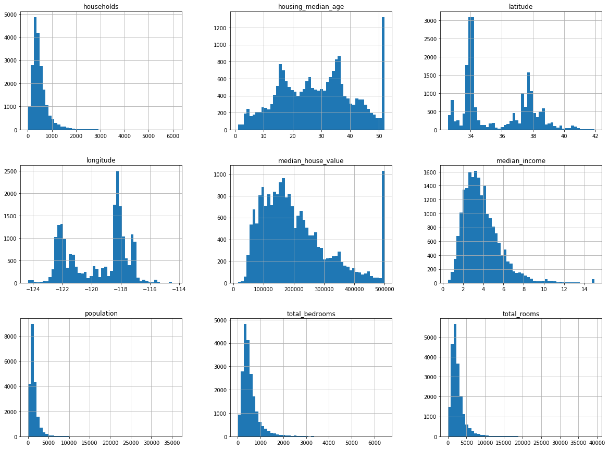
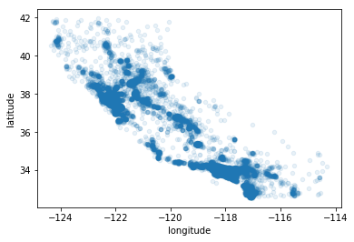
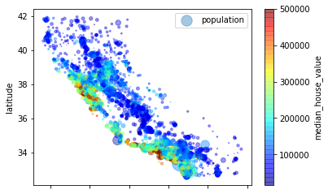
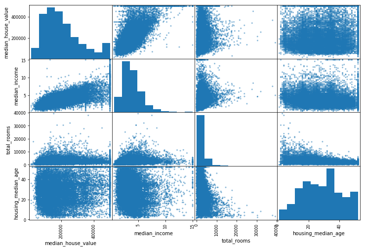
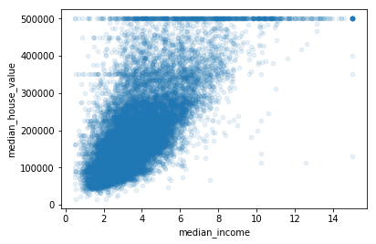

```python
import os
import tarfile
from six.moves import urllib


DOWNLOAD_ROOT = "https://raw.githubusercontent.com/ageron/handson-ml/master/"
HOUSING_PATH = "datasets/housing"
HOUSING_URL = DOWNLOAD_ROOT + HOUSING_PATH + "/housing.tgz"


def fetch_housing_data(housing_url=HOUSING_URL, housing_path=HOUSING_PATH):
    """获取数据源并解压缩
    :param housing_url 下载链接
    :param housing_path 文件保存地址
    :return
    """
    if not os.path.isdir(housing_path):
        os.makedirs(housing_path)
    tgz_path = os.path.join(housing_path, "housing.tgz")
    print("正在从："+housing_url+"下载文件...")
    urllib.request.urlretrieve(housing_url, tgz_path)
    print("正在解压文件...")
    housing_tgz = tarfile.open(tgz_path)
    housing_tgz.extractall(path=housing_path)
    print("解压完成！")
    housing_tgz.close()

fetch_housing_data()
```

    正在从：https://raw.githubusercontent.com/ageron/handson-ml/master/datasets/housing/housing.tgz下载文件...
    正在解压文件...
    解压完成！


```python
import pandas as pd


def load_housing_data(housing_path=HOUSING_PATH):
    """加载数据文件
    :param housing_path 数据地址
    :return
    """
    csv_path = os.path.join(housing_path, "housing.csv")
    return pd.read_csv(csv_path)
```


```python
housing = load_housing_data()
housing.head()
```


<div>
<style scoped>
    .dataframe tbody tr th:only-of-type {
        vertical-align: middle;
    }

    .dataframe tbody tr th {
        vertical-align: top;
    }

    .dataframe thead th {
        text-align: right;
    }
</style>
<table border="1" class="dataframe">
  <thead>
    <tr style="text-align: right;">
      <th></th>
      <th>longitude</th>
      <th>latitude</th>
      <th>housing_median_age</th>
      <th>total_rooms</th>
      <th>total_bedrooms</th>
      <th>population</th>
      <th>households</th>
      <th>median_income</th>
      <th>median_house_value</th>
      <th>ocean_proximity</th>
    </tr>
  </thead>
  <tbody>
    <tr>
      <th>0</th>
      <td>-122.23</td>
      <td>37.88</td>
      <td>41.0</td>
      <td>880.0</td>
      <td>129.0</td>
      <td>322.0</td>
      <td>126.0</td>
      <td>8.3252</td>
      <td>452600.0</td>
      <td>NEAR BAY</td>
    </tr>
    <tr>
      <th>1</th>
      <td>-122.22</td>
      <td>37.86</td>
      <td>21.0</td>
      <td>7099.0</td>
      <td>1106.0</td>
      <td>2401.0</td>
      <td>1138.0</td>
      <td>8.3014</td>
      <td>358500.0</td>
      <td>NEAR BAY</td>
    </tr>
    <tr>
      <th>2</th>
      <td>-122.24</td>
      <td>37.85</td>
      <td>52.0</td>
      <td>1467.0</td>
      <td>190.0</td>
      <td>496.0</td>
      <td>177.0</td>
      <td>7.2574</td>
      <td>352100.0</td>
      <td>NEAR BAY</td>
    </tr>
    <tr>
      <th>3</th>
      <td>-122.25</td>
      <td>37.85</td>
      <td>52.0</td>
      <td>1274.0</td>
      <td>235.0</td>
      <td>558.0</td>
      <td>219.0</td>
      <td>5.6431</td>
      <td>341300.0</td>
      <td>NEAR BAY</td>
    </tr>
    <tr>
      <th>4</th>
      <td>-122.25</td>
      <td>37.85</td>
      <td>52.0</td>
      <td>1627.0</td>
      <td>280.0</td>
      <td>565.0</td>
      <td>259.0</td>
      <td>3.8462</td>
      <td>342200.0</td>
      <td>NEAR BAY</td>
    </tr>
  </tbody>
</table>
</div>


```python
housing.info() #获取数据的相关信息
```

    <class 'pandas.core.frame.DataFrame'>
    RangeIndex: 20640 entries, 0 to 20639
    Data columns (total 10 columns):
    longitude             20640 non-null float64
    latitude              20640 non-null float64
    housing_median_age    20640 non-null float64
    total_rooms           20640 non-null float64
    total_bedrooms        20433 non-null float64
    population            20640 non-null float64
    households            20640 non-null float64
    median_income         20640 non-null float64
    median_house_value    20640 non-null float64
    ocean_proximity       20640 non-null object
    dtypes: float64(9), object(1)
    memory usage: 1.6+ MB


```python
housing["ocean_proximity"].value_counts() #统计相关类别的信息(非数值信息)
```


    <1H OCEAN     9136
    INLAND        6551
    NEAR OCEAN    2658
    NEAR BAY      2290
    ISLAND           5
    Name: ocean_proximity, dtype: int64


```python
housing.describe()#数值信息的摘要(会去除空的数据)
```


<div>
<style scoped>
    .dataframe tbody tr th:only-of-type {
        vertical-align: middle;
    }

    .dataframe tbody tr th {
        vertical-align: top;
    }

    .dataframe thead th {
        text-align: right;
    }
</style>
<table border="1" class="dataframe">
  <thead>
    <tr style="text-align: right;">
      <th></th>
      <th>longitude</th>
      <th>latitude</th>
      <th>housing_median_age</th>
      <th>total_rooms</th>
      <th>total_bedrooms</th>
      <th>population</th>
      <th>households</th>
      <th>median_income</th>
      <th>median_house_value</th>
    </tr>
  </thead>
  <tbody>
    <tr>
      <th>count</th>
      <td>20640.000000</td>
      <td>20640.000000</td>
      <td>20640.000000</td>
      <td>20640.000000</td>
      <td>20433.000000</td>
      <td>20640.000000</td>
      <td>20640.000000</td>
      <td>20640.000000</td>
      <td>20640.000000</td>
    </tr>
    <tr>
      <th>mean</th>
      <td>-119.569704</td>
      <td>35.631861</td>
      <td>28.639486</td>
      <td>2635.763081</td>
      <td>537.870553</td>
      <td>1425.476744</td>
      <td>499.539680</td>
      <td>3.870671</td>
      <td>206855.816909</td>
    </tr>
    <tr>
      <th>std</th>
      <td>2.003532</td>
      <td>2.135952</td>
      <td>12.585558</td>
      <td>2181.615252</td>
      <td>421.385070</td>
      <td>1132.462122</td>
      <td>382.329753</td>
      <td>1.899822</td>
      <td>115395.615874</td>
    </tr>
    <tr>
      <th>min</th>
      <td>-124.350000</td>
      <td>32.540000</td>
      <td>1.000000</td>
      <td>2.000000</td>
      <td>1.000000</td>
      <td>3.000000</td>
      <td>1.000000</td>
      <td>0.499900</td>
      <td>14999.000000</td>
    </tr>
    <tr>
      <th>25%</th>
      <td>-121.800000</td>
      <td>33.930000</td>
      <td>18.000000</td>
      <td>1447.750000</td>
      <td>296.000000</td>
      <td>787.000000</td>
      <td>280.000000</td>
      <td>2.563400</td>
      <td>119600.000000</td>
    </tr>
    <tr>
      <th>50%</th>
      <td>-118.490000</td>
      <td>34.260000</td>
      <td>29.000000</td>
      <td>2127.000000</td>
      <td>435.000000</td>
      <td>1166.000000</td>
      <td>409.000000</td>
      <td>3.534800</td>
      <td>179700.000000</td>
    </tr>
    <tr>
      <th>75%</th>
      <td>-118.010000</td>
      <td>37.710000</td>
      <td>37.000000</td>
      <td>3148.000000</td>
      <td>647.000000</td>
      <td>1725.000000</td>
      <td>605.000000</td>
      <td>4.743250</td>
      <td>264725.000000</td>
    </tr>
    <tr>
      <th>max</th>
      <td>-114.310000</td>
      <td>41.950000</td>
      <td>52.000000</td>
      <td>39320.000000</td>
      <td>6445.000000</td>
      <td>35682.000000</td>
      <td>6082.000000</td>
      <td>15.000100</td>
      <td>500001.000000</td>
    </tr>
  </tbody>
</table>
</div>


```python
%matplotlib inline
import matplotlib.pylab as plt
housing.hist(bins=50, figsize=(20,15))
plt.show()
```





```python
import numpy as np


def split_train_test(data, test_ratio):
    """从数据中创建训练集和测试集
    :param 数据集
    :param 分割比例(测试集占全集的百分比)
    :return
    """
    shuffled_indices = np.random.permutation(len(data))
    test_set_size = int(len(data) * test_ratio)
    test_indices = shuffled_indices[:test_set_size]
    train_indices = shuffled_indices[test_set_size:]
    return data.iloc[train_indices], data.iloc[test_indices]
```


```python
train_set, tesst_set = split_train_test(housing, 0.2)
print(len(train_set), "train +", len(tesst_set), "test")
```

    16512 train + 4128 test


```python
import hashlib


def test_set_check(identifier, test_ratio, hash):
    """测试集检查
    :param identifier 标识符
    :param test_ratio 测试集比例
    :param hash hash函数
    :return
    """
    return hash(np.int64(identifier)).digest()[-1] < 256 * test_ratio


def split_train_test_by_id(data, test_ratio, id_column, hash=hashlib.md5):
    """通过ID分割
    :param data 数据集
    :param test_ratio 测试集的比例
    :param id_column 作为id的列
    :param hash hash函数
    :return
    """
    ids = data[id_column]
    in_test_set = ids.apply(lambda id_: test_set_check(id_, test_ratio, hash))
    return data.loc[~in_test_set], data.loc[in_test_set]

```


```python
housing_with_id = housing.reset_index() #housing数据无标识符，所以需要添加
train_set, test_set = split_train_test_by_id(housing_with_id, 0.2, "index")
```


```python
housing_with_id["id"] = housing["longitude"] * 1000 + housing["latitude"] #使用联合主键作为id
train_set, tesst_set = split_train_test_by_id(housing_with_id, 0.2, "id")
```


```python
from sklearn.model_selection import train_test_split
train_set, tesst_set = train_test_split(housing, test_size=0.2, random_state=42) #使用sklearn自带的分割函数
```


```python
housing["income_cat"] = np.ceil(housing["median_income"] / 1.5) # 压缩median_income
housing["income_cat"].where(housing["income_cat"] < 5, 5.0, inplace=True)
```


```python
from sklearn.model_selection import StratifiedShuffleSplit


split = StratifiedShuffleSplit(n_splits=1, test_size=0.2, random_state=42)
for train_index, test_index in split.split(housing, housing["income_cat"]):#分层抽样
    strat_train_set = housing.loc[train_index]
    strat_test_set = housing.loc[test_index]
```


```python
housing["income_cat"].value_counts() / len(housing) #每一层样本在总数据集中的比例
```


    3.0    0.350581
    2.0    0.318847
    4.0    0.176308
    5.0    0.114438
    1.0    0.039826
    Name: income_cat, dtype: float64


```python
for set in (strat_test_set, strat_train_set):#删除incom_cat列
    set.drop(["income_cat"], axis=1, inplace=True)
```


```python
housing = strat_train_set.copy()
```


```python
housing.plot(kind="scatter", x="longitude", y="latitude")#画出散点图
```


    <matplotlib.axes._subplots.AxesSubplot at 0x11b8dc4a8>


```python
housing.plot(kind="scatter", x="longitude", y="latitude", alpha=0.1)
```


    <matplotlib.axes._subplots.AxesSubplot at 0x11bdadda0>





```python
housing.plot(kind="scatter", x="longitude", y="latitude", alpha=0.4,
            s=housing["population"] / 100, label="population",
            c="median_house_value", cmap=plt.get_cmap("jet"), colorbar=True,
            )
plt.legend()
```


    <matplotlib.legend.Legend at 0x11bef7cc0>





```python
corr_matrix = housing.corr()#计算相关系数
corr_matrix["median_house_value"].sort_values(ascending=False)
```


    median_house_value    1.000000
    median_income         0.687160
    total_rooms           0.135097
    housing_median_age    0.114110
    households            0.064506
    total_bedrooms        0.047689
    population           -0.026920
    longitude            -0.047432
    latitude             -0.142724
    Name: median_house_value, dtype: float64


```python
from pandas.plotting import scatter_matrix

attributes = ["median_house_value", "median_income",
             "total_rooms","housing_median_age"]
scatter_matrix(housing[attributes], figsize=(12,8)) #从数据图获取相关性
```


    array([[<matplotlib.axes._subplots.AxesSubplot object at 0x1166ded68>,
            <matplotlib.axes._subplots.AxesSubplot object at 0x1166b4e80>,
            <matplotlib.axes._subplots.AxesSubplot object at 0x1162bac18>,
            <matplotlib.axes._subplots.AxesSubplot object at 0x11677d198>],
           [<matplotlib.axes._subplots.AxesSubplot object at 0x11676c940>,
            <matplotlib.axes._subplots.AxesSubplot object at 0x11643ec88>,
            <matplotlib.axes._subplots.AxesSubplot object at 0x1161eb048>,
            <matplotlib.axes._subplots.AxesSubplot object at 0x116220940>],
           [<matplotlib.axes._subplots.AxesSubplot object at 0x1162208d0>,
            <matplotlib.axes._subplots.AxesSubplot object at 0x1165e6fd0>,
            <matplotlib.axes._subplots.AxesSubplot object at 0x11672f9e8>,
            <matplotlib.axes._subplots.AxesSubplot object at 0x115fcdac8>],
           [<matplotlib.axes._subplots.AxesSubplot object at 0x1165824e0>,
            <matplotlib.axes._subplots.AxesSubplot object at 0x116828a58>,
            <matplotlib.axes._subplots.AxesSubplot object at 0x116815fd0>,
            <matplotlib.axes._subplots.AxesSubplot object at 0x116602588>]],
          dtype=object)





```python
housing.plot(kind="scatter", x="median_income", y="median_house_value", alpha=0.1)# 画出收入中位数与房价中位数的关系
```


    <matplotlib.axes._subplots.AxesSubplot at 0x116240e10>





```python
#尝试组合属性查看相关性
housing["rooms_per_household"] = housing["total_rooms"]/housing["households"]
housing["bedrooms_per_room"] = housing["total_bedrooms"]/housing["total_rooms"]
housing["population_per_houshold"] = housing["population"]/housing["households"]

corr_matrix = housing.corr()
corr_matrix["median_house_value"].sort_values(ascending=False)
```


    median_house_value         1.000000
    median_income              0.687160
    rooms_per_household        0.146285
    total_rooms                0.135097
    housing_median_age         0.114110
    households                 0.064506
    total_bedrooms             0.047689
    population_per_houshold   -0.021985
    population                -0.026920
    longitude                 -0.047432
    latitude                  -0.142724
    bedrooms_per_room         -0.259984
    Name: median_house_value, dtype: float64


# 准备训练数据


```python
housing = strat_train_set.drop("median_house_value", axis=1)
housing_labels = strat_train_set["median_house_value"].copy()
```


```python
from sklearn.impute import SimpleImputer
#使用中值填充空值
#median = housing["total_bedrooms"].median()
#housing["total_bedrooms"].fillna(median)
imputer = SimpleImputer(strategy="median")
housing_num = housing.drop("ocean_proximity", axis=1)#删除非数值项
imputer.fit(housing_num)
X = imputer.transform(housing_num)
housing_tr = pd.DataFrame(X, columns=housing_num.columns)

```


```python
print(housing_num.median().values)
imputer.statistics_#每一个属性的中值保存在statistics_

```

    [-118.51     34.26     29.     2119.5     433.     1164.      408.
        3.5409]


    array([-118.51  ,   34.26  ,   29.    , 2119.5   ,  433.    , 1164.    ,
            408.    ,    3.5409])


```python
#处理非数值属性
from sklearn.preprocessing import LabelEncoder
encoder = LabelEncoder()
housing_cat = housing["ocean_proximity"]
housing_cat
housing_cat_encoded = encoder.fit_transform(housing_cat)
housing_cat_encoded
```


    array([0, 0, 4, ..., 1, 0, 3])


```python
# 使用该映射方式会使两个相近的值比更相隔更远的值更相似
print(encoder.classes_)#查看映射值
```

    ['<1H OCEAN' 'INLAND' 'ISLAND' 'NEAR BAY' 'NEAR OCEAN']


```python
#使用one-hot encoding解决上述问题，即每一组只有一个属性被映射为1，其它均为0
from sklearn.preprocessing import OneHotEncoder
encoder = OneHotEncoder()
housing_cat_1hot = encoder.fit_transform(housing_cat.values.reshape(-1,1))
housing_cat_1hot#scipy的稀疏矩阵
```


    <16512x5 sparse matrix of type '<class 'numpy.float64'>'
    	with 16512 stored elements in Compressed Sparse Row format>


```python
housing_cat_1hot.toarray()
```


    array([[1., 0., 0., 0., 0.],
           [1., 0., 0., 0., 0.],
           [0., 0., 0., 0., 1.],
           ...,
           [0., 1., 0., 0., 0.],
           [1., 0., 0., 0., 0.],
           [0., 0., 0., 1., 0.]])


```python
from sklearn.preprocessing import LabelBinarizer
encoder = LabelBinarizer()#LabelBinarizer(sparse_output=True)
housing_cat_1hot = encoder.fit_transform(housing_cat)
housing_cat_1hot #默认输出NumPy数组，使用sparse_output=True在LabelBinarizer中
```


    array([[1, 0, 0, 0, 0],
           [1, 0, 0, 0, 0],
           [0, 0, 0, 0, 1],
           ...,
           [0, 1, 0, 0, 0],
           [1, 0, 0, 0, 0],
           [0, 0, 0, 1, 0]])


# 自定义转换器


```python
from sklearn.base import BaseEstimator, TransformerMixin


rooms_ix, bedrooms_ix, population_ix, household_ix = 3, 4, 5, 6


class CombinedAttributesAddr(BaseEstimator, TransformerMixin):
    def __init__(self, add_bedrooms_per_room = True):
        self.add_bedrooms_per_room = add_bedrooms_per_room

    def fit(self, X, y=None):
        return self

    def transform(self, X, y=None):
        rooms_per_household = X[:, rooms_ix] / X[:, household_ix]
        popilation_per_household = X[:, population_ix] / X[:, household_ix]
        if self.add_bedrooms_per_room:
            bedrooms_per_room = X[:, bedrooms_ix] / X[:, rooms_ix]
            return np.c_[X, rooms_per_household, popilation_per_household, bedrooms_per_room]
        else:
            return np.c_[X, rooms_per_household, popilation_per_household]


attr_adder = CombinedAttributesAddr(add_bedrooms_per_room=False)
housing_extra_attribs = attr_adder.transform(housing.values)

```

# 转换管道


```python
# 通过管道定义转换步骤和顺序
from sklearn.pipeline import Pipeline
from sklearn.preprocessing import StandardScaler
num_pipeline  = Pipeline([
    ('imputer', SimpleImputer(strategy='median')),
    ('attribs_adder', CombinedAttributesAddr()),
    ('std_scaler', StandardScaler()),
])
housing_num_tr = num_pipeline.fit_transform(housing_num)
```


```python
from sklearn.pipeline import FeatureUnion


class DataFrameSelector(BaseEstimator, TransformerMixin):
    def __init__(self, attribute_names):
        self.attribute_names = attribute_names

    def fit(self, X, y=None):
        return self

    def transform(self, X, y=None):
        return X[self.attribute_names].values


num_attribs = list(housing_num)
cat_attribs = ["ocean_proximity"]

# 多管道并行运行，直到都到达最终输出进行合并
num_pipeline = Pipeline([
    ('selector', DataFrameSelector(num_attribs)),
    ('imputer', SimpleImputer(strategy='median')),
    ('attribs_adder', CombinedAttributesAddr()),
    ('std_scaler', StandardScaler()),
])

cat_pipeline = Pipeline([
    ('selector', DataFrameSelector(cat_attribs)),
    ('label_binarizer', OneHotEncoder()),
])

full_pipeline = FeatureUnion(transformer_list=[
    ('num_pipeline', num_pipeline),
    ('cat_pipeline', cat_pipeline),
])
housing_prepared = full_pipeline.fit_transform(housing)
housing_prepared
```


    <16512x16 sparse matrix of type '<class 'numpy.float64'>'
    	with 198144 stored elements in Compressed Sparse Row format>


# 训练模型


```python
from sklearn.linear_model import LinearRegression

lin_reg = LinearRegression()
lin_reg.fit(housing_prepared, housing_labels)
```


    LinearRegression(copy_X=True, fit_intercept=True, n_jobs=None,
             normalize=False)


```python
some_data = housing.iloc[:5]
some_labels = housing_labels.iloc[:5]
some_data_prepared = full_pipeline.transform(some_data)
```


```python
print("Predictions:\t", lin_reg.predict(some_data_prepared))
print("Labels:\t\t", list(some_labels))
```

    Predictions:	 [210644.60465462 317768.80729055 210956.43320428  59218.98857356
     189747.55852838]
    Labels:		 [286600.0, 340600.0, 196900.0, 46300.0, 254500.0]


# 计算误差


```python
from sklearn.metrics import mean_squared_error
housing_predictions = lin_reg.predict(housing_prepared)
lin_mse = mean_squared_error(housing_labels, housing_predictions)
lin_rmse = np.sqrt(lin_mse)
lin_rmse
```


    68628.19819848923


# 使用决策树训练模型


```python
from sklearn.tree import DecisionTreeRegressor
tree_reg = DecisionTreeRegressor()
tree_reg.fit(housing_prepared, housing_labels)
```


    DecisionTreeRegressor(criterion='mse', max_depth=None, max_features=None,
               max_leaf_nodes=None, min_impurity_decrease=0.0,
               min_impurity_split=None, min_samples_leaf=1,
               min_samples_split=2, min_weight_fraction_leaf=0.0,
               presort=False, random_state=None, splitter='best')


```python
housing_predictions = tree_reg.predict(housing_prepared)
tree_mse = mean_squared_error(housing_labels, housing_predictions)
tree_rmse = np.sqrt(tree_mse)
tree_rmse#过拟合
```


    0.0


# 使用交叉验证集


```python
from sklearn.model_selection import cross_val_score
scores = cross_val_score(tree_reg, housing_prepared,
                        housing_labels, scoring="neg_mean_squared_error", cv=10)
rmse_scores = np.sqrt(-scores)
```


```python
def display_scores(scores):
    print("Scores:", scores)
    print("Mean:", scores.mean())
    print("Standard deviation:", scores.std())

display_scores(rmse_scores)
```

    Scores: [69387.06653153 67286.59471614 70828.67634657 68637.08950797
     71446.95561512 75698.68535069 72708.74498639 71492.80752186
     76248.48154091 68464.80592567]
    Mean: 71219.99080428517
    Standard deviation: 2844.881736248285


```python
lin_scores = cross_val_score(lin_reg, housing_prepared,
                            housing_labels, scoring="neg_mean_squared_error", cv=10)
lin_rmse_scores = np.sqrt(-lin_scores)
display_scores(lin_rmse_scores)
```

    Scores: [66782.73844317 66960.11809222 70347.95243904 74739.57055258
     68031.13389115 71193.84181183 64969.63056023 68281.61137907
     71552.91565846 67665.10081739]
    Mean: 69052.46136451427
    Standard deviation: 2731.674003577556


# 使用随机森林


```python
from sklearn.ensemble import RandomForestRegressor
forest_reg = RandomForestRegressor()
forest_reg.fit(housing_prepared, housing_labels)
housing_predictions = forest_reg.predict(housing_prepared)
forest_rmse = mean_squared_error(housing_labels, housing_predictions)
forest_rmse = np.sqrt(forest_rmse)
forest_rmse
```

    /usr/local/lib/python3.6/site-packages/sklearn/ensemble/forest.py:246: FutureWarning: The default value of n_estimators will change from 10 in version 0.20 to 100 in 0.22.
      "10 in version 0.20 to 100 in 0.22.", FutureWarning)


    22163.130551903472


```python
from sklearn.model_selection import cross_val_score
forest_rmse_scores = cross_val_score(forest_reg, housing_prepared,
                             housing_labels, scoring="neg_mean_squared_error", cv=10)
forest_rmse_scores = np.sqrt(-forest_rmse_scores)
display_scores(forest_rmse_scores)
```

    Scores: [52527.47724318 49900.17270529 53256.69381502 54127.96523378
     52565.69742633 55149.84634202 51794.92861894 51150.56514327
     55913.16499668 52788.63800042]
    Mean: 52917.51495249358
    Standard deviation: 1712.2101214708819


# 调整模型

## 网格查找


```python
#网格查找用于指定想要组合的属性，使用交叉验证集进行验证
from sklearn.model_selection import GridSearchCV

param_grid = [
    {'n_estimators':[3, 10, 30], 'max_features': [2, 4, 6, 8]},
    {'bootstrap': [False], 'n_estimators': [3, 10], 'max_features':[2, 3, 4]}
]
forest_reg = RandomForestRegressor()
grid_search = GridSearchCV(forest_reg, param_grid, cv=5,
                          scoring='neg_mean_squared_error')
grid_search.fit(housing_prepared, housing_labels)
grid_search.best_params_
```


    {'max_features': 6, 'n_estimators': 30}


```python
grid_search.best_estimator_
```


    RandomForestRegressor(bootstrap=True, criterion='mse', max_depth=None,
               max_features=6, max_leaf_nodes=None, min_impurity_decrease=0.0,
               min_impurity_split=None, min_samples_leaf=1,
               min_samples_split=2, min_weight_fraction_leaf=0.0,
               n_estimators=30, n_jobs=None, oob_score=False,
               random_state=None, verbose=0, warm_start=False)


```python
cvres = grid_search.cv_results_
for mean_score, params in zip(cvres["mean_test_score"], cvres["params"]):
    print(np.sqrt(-mean_score), params)
```

    64228.003388102516 {'max_features': 2, 'n_estimators': 3}
    55454.00031053945 {'max_features': 2, 'n_estimators': 10}
    53155.36771883186 {'max_features': 2, 'n_estimators': 30}
    60238.28891932349 {'max_features': 4, 'n_estimators': 3}
    53044.27139651894 {'max_features': 4, 'n_estimators': 10}
    50650.62627231678 {'max_features': 4, 'n_estimators': 30}
    58658.342221629726 {'max_features': 6, 'n_estimators': 3}
    52358.51674007991 {'max_features': 6, 'n_estimators': 10}
    49887.67768112314 {'max_features': 6, 'n_estimators': 30}
    58730.283997131446 {'max_features': 8, 'n_estimators': 3}
    52432.46120216881 {'max_features': 8, 'n_estimators': 10}
    49923.33236627694 {'max_features': 8, 'n_estimators': 30}
    63281.22274071418 {'bootstrap': False, 'max_features': 2, 'n_estimators': 3}
    54214.06059814892 {'bootstrap': False, 'max_features': 2, 'n_estimators': 10}
    59820.193646740416 {'bootstrap': False, 'max_features': 3, 'n_estimators': 3}
    52310.6659263699 {'bootstrap': False, 'max_features': 3, 'n_estimators': 10}
    58663.61528699336 {'bootstrap': False, 'max_features': 4, 'n_estimators': 3}
    51510.14057731367 {'bootstrap': False, 'max_features': 4, 'n_estimators': 10}


## 随机查找


```python
#当查找范围小时使用GridSearch
#范围大时使用随机查找
```


```python
#分析模型和误差
fearture_importances = grid_search.best_estimator_.feature_importances_
fearture_importances
```


    array([7.69331738e-02, 6.97499695e-02, 4.36568780e-02, 1.82661833e-02,
           1.66823710e-02, 1.80076874e-02, 1.62985023e-02, 3.12925764e-01,
           6.02271320e-02, 1.09872594e-01, 7.56850138e-02, 1.48263701e-02,
           1.56744680e-01, 4.83159596e-05, 3.56162952e-03, 6.51373535e-03])


```python
extra_attribs = ["rooms_per_hhold", "pop_per_hhhold", "bedrooms_per_room"]
cat_one_hot_attribs = list(encoder.classes_)
attributes = num_attribs + extra_attribs + cat_one_hot_attribs
sorted(zip(fearture_importances, attributes), reverse=True)
```


    [(0.31292576369427055, 'median_income'),
     (0.15674468046305143, 'INLAND'),
     (0.1098725938995592, 'pop_per_hhhold'),
     (0.07693317375274458, 'longitude'),
     (0.07568501377495424, 'bedrooms_per_room'),
     (0.06974996951561971, 'latitude'),
     (0.06022713204358833, 'rooms_per_hhold'),
     (0.043656877966590804, 'housing_median_age'),
     (0.01826618328336908, 'total_rooms'),
     (0.01800768738966343, 'population'),
     (0.01668237100450264, 'total_bedrooms'),
     (0.016298502278259873, 'households'),
     (0.014826370100255391, '<1H OCEAN'),
     (0.006513735353629898, 'NEAR OCEAN'),
     (0.0035616295203113124, 'NEAR BAY'),
     (4.831595962946045e-05, 'ISLAND')]


# 在测试集上评估


```python
final_model = grid_search.best_estimator_
X_test = strat_test_set.drop("median_house_value", axis=1)
y_test = strat_test_set["median_house_value"].copy()

X_test_prepared = full_pipeline.transform(X_test)
final_prediction = final_model.predict(X_test_prepared)
final_mse = mean_squared_error(y_test, final_prediction)
final_rmse = np.sqrt(final_mse)
final_rmse
```


    47932.162242297694
****
[源文件](https://github.com/coldJune/machineLearning/blob/master/handson-ml/LinearRegression.ipynb)
