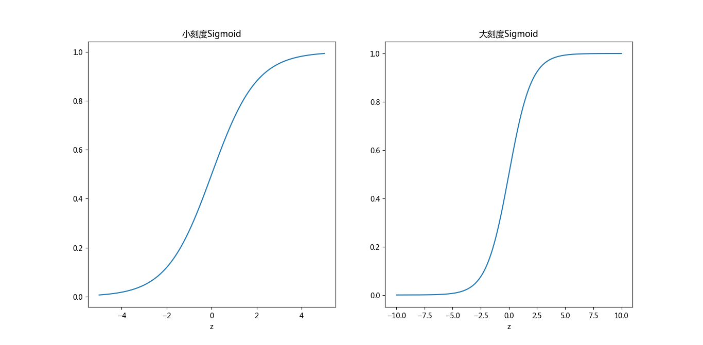
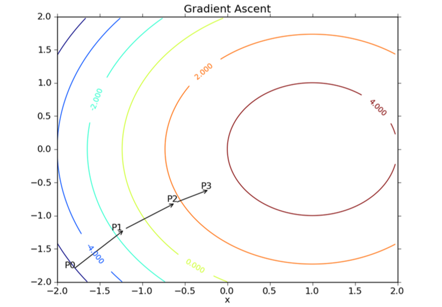
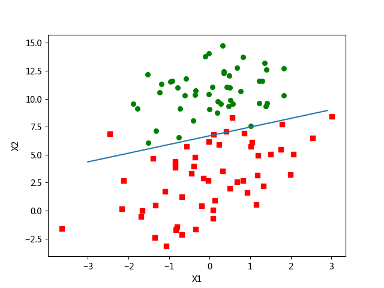
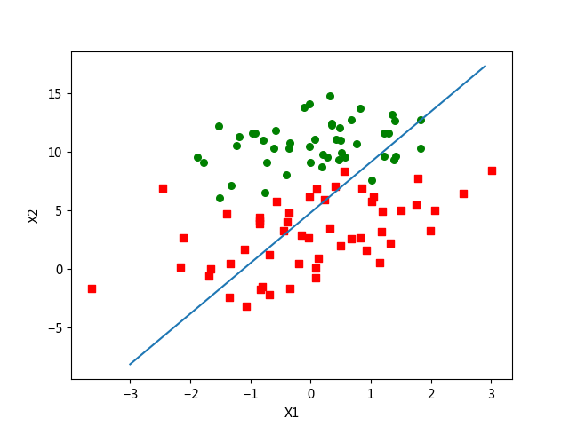
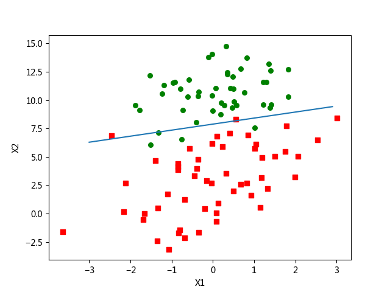

## Logistic回归概述
> 根据现有数据对分类边界线建立回归公式，以此进行分类。训练分类器就是寻找最佳拟合参数，使用的是最优化算法

### Logistic回归的优缺点
* 优点：计算代价不高，易于理解和实现
* 缺点：容易欠拟合，分类精度可能不高
* 适用数据类型：数值型和标称型数据

### Logistic回归的工作原理
#### Sigmoid函数
**海维赛德阶跃函数(Heaviside step function)**(或称为 **单位阶跃函数**)能接受所有的输入然后预测出类别(*在两个类的情况下，输出0或1*)。但是该函数是从跳跃点上从0瞬间跳跃到1，这个跳跃过程很难处理。另一个**Sigmoid函数**具有类似的性质：
$$\sigma(z)=\frac{1}{1+e^{-z}}$$
当$z=0$时，*Sigmoid*函数值为*0.5*，随着$z$的增大，对应的值将逼近与1；而随着$z$的减小，对应的值将逼近于0。在横坐标刻度足够大的情况下，$Sigmoid$函数看起来像一个阶跃函数。
* Sigmoid函数

因此，实现Logistic回归的本质就是**在每个特征上乘以一个回归系数**，将所有的结果相加然后带入*Sigmoid*函数中,得到一个范围在0~1之间的数值，然后根据分界线判断类别(这里取0.5，大于0.5分为1类，小于0.5分为0类)。

### Logistic回归的一般流程
1. 收集数据：采用任意方法收集数据
2. 准备数据：由于需要进行距离计算，要求数据类型为数值型。结构化数据格式最佳
3. 分析数据：采用任意方法对数据进行分析
4. 训练算法：为了找到最佳的分类回归系数
5. 测试算法：训练完成后，分类速度会很快
6. 使用算法：输入一些数据将其转换为对应的结构化数值；使用训练好的回归系数拟合数据进行分类；对分好类的数据进行分析

## Logistic回归的实现
### 基于最优化方法的最佳回归系数
*Sigmoid* 函数的输入记为$z$,可以由下面公式得出：
$$z=w_0x_0+w_1x_1+w_2x_2+……+w_nx_n$$
向量形式为：
$$z=W^TX$$
表示将两个数值向量对应元素相乘后全部加起来。其中向量$X$是分类器的输入数据，向量$W$是回归系数

### 梯度上升法
**梯度上升法** 沿着某函数的梯度方向探寻找到该函数的最大值。
将梯度记为$\nabla$，则函数$f(x,y)$的梯度由下式表示:
$$\nabla f(x,y)=\begin{pmatrix}\frac{\partial f(x,y)}{\partial x}\\\frac{\partial f(x,y)}{\partial y}\end{pmatrix}$$
这个梯度意味着沿$x$的方向移动$\frac{\partial f(x,y)}{\partial x}$，沿$y$方向移动$\frac{\partial f(x,y)}{\partial y}$。其中，函数$f(x,y)$必须在待计算的点上有定义并且可微。
* 梯度上升


梯度上升算法沿梯度方向移动，梯度算子总是指向函数值增长最快的方向。移动量的大小称为**步长**，记作$\alpha$，用向量表示梯度算法的迭代公式为:
$$w:=w+\nabla_wf(w)$$
该公式将一直被迭代执行，知道达到某个停止条件为止(指定值或达到允许误差范围)

#### 使用梯度上升算法
* 伪代码
```
每个回归系数初始化为1
重复R次：
    计算整个数据集的梯度
    使用alpha*gradient更新回归系数的向量
    返回回归系数
```
* Logistic回归梯度上升优化算法[^1]
```Python
def load_data_set():
    """加载测试数据集
    打开文本逐行读取，设置x_0为1，每行前两个值为x_1,x_2
    第三个值对应类别标签
    :return:
    """
    data_mat = []
    label_mat = []
    with open('data/testSet.txt', 'r', encoding='utf-8') as fr:
        for line in fr.readlines():
            line_arr = line.strip().split()
            data_mat.append([1.0, float(line_arr[0]), float(line_arr[1])])
            label_mat.append(int(line_arr[2]))
    return data_mat, label_mat


def sigmoid(in_x):
    """定义阶跃函数
    :param in_x: 线性假设函数theta'*X(weight'*X)
    :return:
    """
    return np.longfloat(1.0/(1+np.exp(-in_x)))


def grad_ascent(data_mat_in, class_labels):
    """梯度上升函数
    :param data_mat_in: 数据集m*n的矩阵，m行表示m个训练样本，n列表式n个特征值(x_0为1)
    :param class_labels: 类别标签,为1*m的行向量，m对应m个训练样本
    :return:
    """
    # 将数据装换为NumPy矩阵
    # 将类别标签行向量转换为列向量
    data_matrix = np.mat(data_mat_in)
    label_mat = np.mat(class_labels).transpose()
    m, n = np.shape(data_matrix)
    # 初始化梯度上升算法的一些值
    # alpha为移动步长
    # max_cycles为迭代次数
    alpha = 0.001
    max_cycles = 500
    weights = np.ones((n, 1))
    for k in range(max_cycles):
        # 计算梯度上升算法
        h = sigmoid(data_matrix*weights)
        error = label_mat - h
        weights = weights + alpha*data_matrix.transpose()*error
    return weights
```
* 画出决策边界
```Python
def plot_best_fit(weight):
    """ 画出分界线
    :param weight: 数据训练出来的参数值
    :return:
    """
    import matplotlib.pyplot as plt
    # 将矩阵转换为数组
    weights = weight.getA()
    data_mat, label_mat = load_data_set()
    data_arr = np.array(data_mat)
    n = np.shape(data_arr)[0]
    xcord1, ycord1 = [], []
    xcord2, ycord2 = [], []
    for i in range(n):
        # 区分数据类别
        if int(label_mat[i]) == 1:
            xcord1.append(data_arr[i, 1])
            ycord1.append(data_arr[i, 2])
        else:
            xcord2.append(data_arr[i, 1])
            ycord2.append(data_arr[i, 2])
    fig = plt.figure()
    ax = fig.add_subplot(111)
    ax.scatter(xcord1, ycord1, s=30, c='red', marker='s')
    ax.scatter(xcord2, ycord2, s=30, c='green')
    # 使sigmoid函数值为0.5即weight'*X=0
    x = np.arange(-3.0, 3.0, 0.1)
    y = (-weights[0]-weights[1]*x)/weights[2]
    ax.plot(x, y)
    plt.xlabel('X1')
    plt.ylabel('X2')
    plt.show()
```
* 最佳决策边界


#### 随机梯度上升
梯度上升算法会在每次更新回归系数时遍历整个数据集，而**随机梯度上升**一次仅使用一个样本点来更新回归系数。由于可以在新样本到来时对分类器进行增量式更新，所以其也是一个**在线学习算法**。而一次处理所有数据被称为"批处理"[^2]。
* 伪代码
```
所有回归系数初始化为1
对数据集中每个样本：
    计算该样本的梯度
    使用alpha*gradient更新回归系数值
返回回归系数值
```
* 随机梯度上升
```Python
def stoc_grad_ascent0(data_matrix, class_labels):
    """ 随机梯度上升算法
    :param data_matrix: 训练数据集
    :param class_labels:  训练数据对应的分类标签
    :return:
    """
    m, n = np.shape(data_matrix)
    data_matrix = np.mat(data_matrix)
    alpha = 0.01
    weights = np.ones((n,1))
    for i in range(m):
        # 每一次只对一个样本运行梯度上升算法
        h = sigmoid(data_matrix[i]*weights)
        error = class_labels[i] - h
        weights = weights + np.mat(alpha*error*data_matrix[i]).transpose()
    return weights
```
* 随机梯度上升决策边界


由于存在一些不能正确分类的样本点(数据集非线性可分)，在每次迭代时会引发系数的剧烈改变，从而导致最佳拟合直线并非最佳分类线。为了避免算法来回波动，可以对随机梯度上升算法做出改进。
* 改进的随机梯度上升算法
```Python
def stoc_grad_ascent1(data_matrix, class_labels, num_iter=150):
    """改进后的随机梯度上升算法
    :param data_matrix: 训练数据集
    :param class_labels: 训练数据对应的分类标签
    :param num_iter: 迭代次数
    :return:
    """
    m, n = np.shape(data_matrix)
    # 将数据转换为矩阵
    weights = np.ones((n, 1))
    data_matrix = np.mat(data_matrix)
    class_labels = np.mat(class_labels).transpose()
    for j in range(num_iter):
        data_index = list(range(m))
        for i in range(m):
            # 每次迭代中调整步进值
            alpha = 4/(1.0+j+i)+0.01
            # 随机选取样本更新回归系数
            # 然后从列表中删除对应的值
            rand_index = int(np.random.uniform(0, len(data_index)))
            h = sigmoid(data_matrix[rand_index]*weights)
            error = class_labels[rand_index] - h
            weights = weights + alpha*data_matrix[rand_index].transpose()*error
            del(data_index[rand_index])
    return weights
```
* 改进的随机梯度上升算法决策边界


## 从疝气病症预测病马死亡率
### 处理数据中的缺失值
* 使用可用特征的均值来填补缺失值
* 使用特殊值来填补缺失值，如-1
* 忽略有缺失值的样本
* 使用相似样本的均值填补缺失值
* 使用另外的机器学习算法预测缺失值

*如果一条数据是类别标签缺失，则直接丢弃该条数据*
### 使用Logistic回归进行分类
```Python
"""从疝气病症预测病马的死亡率
1. 收集数据：给定数据文件
2. 准备数据：用Python解析文本文件并填充缺失值
3. 分析数据：可视化并观察数据
4. 训练算法：使用优化算法，找到最佳系数
5. 测试算法：观察错误率，通过改变迭代的次数和步长等菜蔬来得到更好的回归系数
6. 使用算法：
"""


def classify_vector(in_x, weights):
    """分类函数
    计算对应的Sigmoid值来对数据进行分类
    :param in_x: 数据集
    :param weights: 回归系数
    :return:
    """
    prob = sigmoid(in_x*weights)
    if prob > 0.5:
        return 1.0
    else:
        return 0.0


def colic_test():
    """训练函数
    :return:
    """
    train_set = []
    train_labels = []
    with open('data/horseColicTraining.txt', 'r', encoding='utf-8') as fr_train:
        # 训练训练集，训练回归系数
        for line in fr_train.readlines():
            curr_line = line.strip().split('\t')
            line_arr = []
            for i in range(21):
                line_arr.append(float(curr_line[i]))
            train_set.append(line_arr)
            train_labels.append(float(curr_line[21]))
    train_weight = stoc_grad_ascent1(train_set, train_labels, 500)
    error_count = 0.0
    num_test_vec = 0.0
    with open('data/horseColicTest.txt', 'r', encoding='utf-8') as fr_test:
        # 使用测试集测试
        for line in fr_test.readlines():
            num_test_vec += 1.0
            curr_line = line.strip().split('\t')
            line_arr = []
            for i in range(21):
                line_arr.append(float(curr_line[i]))
            if int(classify_vector(np.array(line_arr), train_weight)) != int(curr_line[21]):
                error_count += 1
    error_rate = (float(error_count)/num_test_vec)
    print('错误率为：%f' % error_rate)
    return error_rate


def multi_test():
    """多次测试函数
    :return:
    """
    num_tests = 10
    error_sum = 0.0
    for k in range(num_tests):
        error_sum += colic_test()
    print('迭代%d次后平均误差为%f' % (num_tests, error_sum/float(num_tests)))
```
****
[示例代码](https://github.com/coldJune/machineLearning/blob/master/MachineLearningInAction/log_regres/log_regres.py)
[^1]: 数据有100个样本点，每个点包含两个数值型特征：X1和X2
[^2]: 可以分块加载数据，这种方式叫随机批处理
