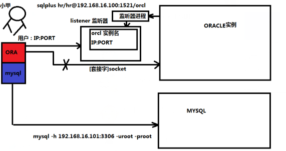

# 为什么不装在winddows系统上？
我们需要知道windows是基于线程的系统，他会将多组ORACLE进程封装成一个更大的运行进程。这样的初衷虽然是简化了进程维护成本，但是却增加了DBA管理难度，并且相关的服务被WINDOWS封装到其系统内部，所以更改起来会变得困难。非主要生产数据库是可以使用WINDOWS的，但是核心生产库一般没有人使用WINDOWS.
# 为什么是LINUX
LINUX操作系统是基于进程级别的。可以直接在进程控制界面[PS命令]看到我们的ORACLE的后台与前台进程。所以大大降低了管理的不透明度，让DBA维护变得更加简单，而且由于LINUX是基于进程级别的。所以比线程封装级别的WINDOWS更加稳定，切维护成本更低
# 为什么使用CENTOS 6.6
* CENTOS是不需要授权的，是免费的使用的
* CENTOS 6.6这个版本在目前生产系统中是量最大的。
>ORACLE可以安装在IBM HP OS/390等小型鱼大型服务器上。但是要根据具体的操作系统和服务器类型进行针对性的选择。

# 为什么要有那么多依赖包？
因为ORACLE是由C语言、C++语言、java语言等多语言共同开发出来的。所以在安装oracle之前需要安装这些语言的工作和支持环境，并且ORACLE使用到的安全相关以及一些网络协议，也是在这些依赖包中的。最重要的是我们可能需要一些图形和图像界面。也需要通过这种方式安装，所以打了那么多个依赖包。

# 为什么要搭建本地yum系统?
yum是LINUX软件管理系统，他和常规的RPM安装包比起来，是不需要安装程序人员去考虑包之间依赖关系的。所以YUM可以更好的去安装相关的软件和ORACLE的依赖包。
yum总共三张类型:
* 网络yum 
>但是数据库大部分都是拖网状态，所以这种不可用
* 光盘与ISO镜像yum 
>这一种操作简便，但是对于软件更新和缺失软件填补造成了极大苦难，所以不推荐
* 本地文件系统yum 
>这一种需要将所有的软件包拷贝到本地文件系统目录中，而且后期发现有缺失或者升级的软件包也可以拷贝到这里。并且我门可以使用这种方式做内部yum源 供其他服务器使用。

>yum类似java maven 、python pip
>yum install a -y

# 为什么ORACLE要修改很多参数
因为ORACLE数据库运行时需要使用大量资源，并且在解析SQL语句的时候也需要使用大量资源，所以我们修改系统参数去为我们ORACLE数据库提供更多资源

# 为什么要使用oracle用户
oracle官方主要是从安全角度上去考虑 让特有用户去维护特有资源，这就是用户分离。

# 数据库
* 关系型数据库和类关系型数据库
1. ORACLE
2. SQLSERVER
3. MYSQL
4. POSTGRESQL---->GREENPLUM
5. HIVE [HADOOP---数仓]类关系型数据库[存储HDFS 元数据MYSQL DERBY POST]

* 非关系型数据库[NOSQL]
1. REDIS
2. MONGODB
3. HBASE
4. CASSANDRA
5. RDB

# 关系型数据库和非关系型数据库主要区别：
||关系型数据库|非关系型数据库|
|:--:|:--:|:--:|
|物化关系映射|物理-->逻辑-->表|notable (key-value) or bigtable(hbase)|
||关系型数据库主要读取或存储数据方式以行为主|非关系型数据库主要读取和存储方式以列为主(key-value)|
||关系型数据库以事务做驱动|非关系型数据库以数据做驱动|

# 数据结构补充
* 四种基础关系
1. 集合关系:表
2. 线性关系:列和列之间关系[同表列和不同表列]
3. 树形关系:索引、目录结构、文件结构
4. 图形关系:位图表与位图索引构建和使用 直方图和相关的统计算法
* 基本存储关系：
1. 顺序存储关系
2. 链表式存储关系[线性表的延伸]

# 三范式：
1. 表中所有的列必须是原子化的，不可拆分
2. 表中必须有主键
3. 表中的非主键列不允许靠其他的非主键列和主键列发生关系（非主键列和主键列之间不能有第三者）

# Oracle客户端连接数据库方式
ORACLE客户端并不是直接连到Oracle数据库的，他要走一个叫做监听器（Listener东西。
原因：这里有个进程，叫监听器进程（后台进程）。他会把oracle的实例，通过监听进程，注册到监听的实例信息区中。而实例信息区中主要包括实例的IP、端口号、实例名等相关信息。客户端可以从监听的实例信息区中找到相关的信息，然后通过TCP/IP协议的IPC协议与实例建立连接【产生套接字socket】，为产生session做好物理准备。

# 服务器类型
ORACLE服务器在网络层面上可以分为两种服务器类型：
* 独占服务器类型
>每一个用户在和ORACLE服务器连接以后，都会有一个专有的serverprocess与你产生sesssion，然后通过这个session进行相关的SQL语句操作以及服务器命令操作
* 共享服务类型
>这种是为了解决狼多肉少的情况建立的。也就是说连接的用户多但是服务器进程(serverprocess)由于服务器性能所限数量较少。那么这时候需要一个调度器的组件去实现多个用户进程共享一个serverprocess的操作。这里涉及到一个问题叫做进程独占锁，当一个用户进程占用serverprocess的时候其他用户只能等待释放以后才能使用该serverprocess。这里大大的节省了资源，但是有可能增加相关的响应时间。

>ORACLE默认是独占模式。
>12c以后由于多租户模式的使用，所以当使用多租户的时候就有大量的共有服务器模式。
 

