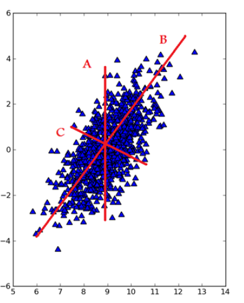
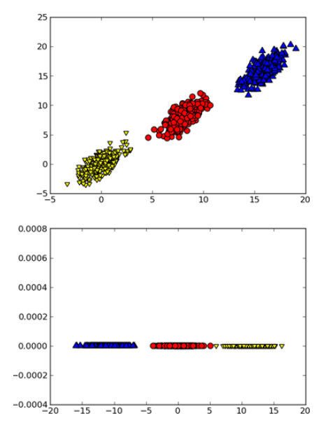
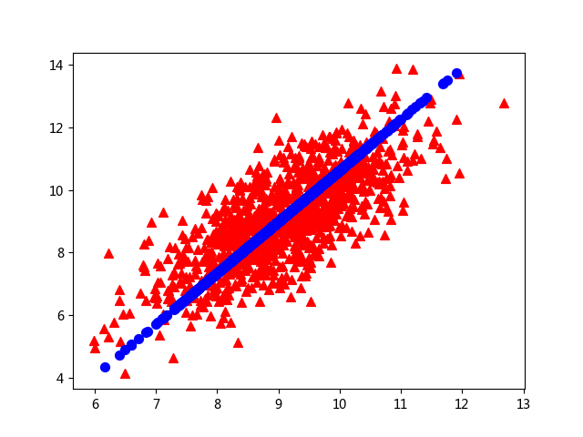

## PCA(主成分分析法)概述[^1]
> 数据从原来的坐标系转换到新的坐标系，新坐标系的选择是由数据本身决定的。第一个坐标轴选择的是原始数据中方差最大的方向，第二个坐标轴的选择和第一个坐标轴正交且具有最大方差的方向

### PCA的优缺点
* 优点：降低数据的复杂性，识别最重要的多个特征
* 缺点：不一定需要，且可能损失有用信息
* 适用数据类型：数值型数据

### [工作原理](https://github.com/coldJune/machineLearning/blob/master/machineLearningCourseraNote/Note8.pdf)
* 覆盖整个数据集的直线

其中直线B最长，并给出了数据集中差异化最大的方向

在PCA中，对数据的坐标进行了旋转，该旋转的过程取决于数据的本身。第一条坐标轴旋转到覆盖数据的最大方差位置，即图中的直线B。数据的最大方差给出了数据的最重要的信息。
在选择了覆盖数据最大差异性的坐标轴后，选择第二条坐标轴。第二条坐标轴是与第一条坐标轴正交的直线，它是覆盖数据次大差异性的坐标轴，即图中直线C。
* 二维空间的三个类别

当在数据集上应用PCA时，可以去掉一维，从而使分类问题变得更容易

## PCA的实现
第一个主成分是数据差异性最大(即方差最大)的方向提取出来的，第二个主成分则来自数据差异性次大的方向且与第一个主成分方向正交。通过数据集的协方差矩阵及其特征值分析，可以求得主成分的值。一旦得到协方差矩阵的特征向量，就可以保留最大的N个值。这些特征向量给出了N个最重要特征的真实结构。可以通过将数据乘上这N个特征向量而将它转换到新的空间。
* 伪代码
```
减去平均值
计算协方差矩阵
计算协方差矩阵的特征值和特征向量
将特征值从大到小排序
保留最上面的N个特征向量
将数据转换到上述N个特征向量构建的新空间中
```
* 主成分分析
```Python
def pca(data_mat, top_n_feat=9999999):
    """主成分分析法
    :param data_mat: 数据集
    :param top_n_feat: 最大的特征值的个数
    :return:
    """
    # 计算并减去原始数据的平均值
    mean_vals = np.mean(data_mat, axis=0)
    mean_removed = data_mat-mean_vals
    # 计算协方差矩阵及其特征值
    cov_mat = np.cov(mean_removed, rowvar=0)
    eig_vals, eig_vects = np.linalg.eig(np.mat(cov_mat))
    # 根据特征值排序
    eig_vals_ind = np.argsort(eig_vals)
    # 获取前top_n_feat个特征值的下标
    eig_vals_ind = eig_vals_ind[:-(top_n_feat+1):-1]
    # 获取特征向量
    red_eig_vects = eig_vects[:, eig_vals_ind]
    # 将数据转换到新空间中
    low_dem_data_mat = mean_removed*red_eig_vects
    recon_mat = (low_dem_data_mat*red_eig_vects.T)+mean_vals
    # 返回降维后的数据和重构后的数据
    return low_dem_data_mat, recon_mat
```
* 运行
```Python
In [2]: data_mat = pca.load_data_set('data/testSet.txt')

In [3]: low_d_mat,recon_mat = pca.pca(data_mat, 1)

In [4]: shape(low_d_mat)
Out[4]: (1000, 1)

In [5]: fig = plt.figure()

In [6]: ax = fig.add_subplot(111)

In [9]: ax.scatter(data_mat[:,0].flatten().A[0], data_mat[:,1].flatten().A[0],marker='^',s=50,c='red')
Out[9]: <matplotlib.collections.PathCollection at 0x1fdf83e9860>

In [10]: ax.scatter(recon_mat[:,0].flatten().A[0], recon_mat[:,1].flatten().A[0],marker='o',s=50,c='blue')
Out[10]: <matplotlib.collections.PathCollection at 0x1fd83a3a470>
```
* 运行结果

[^1]: 有其他两种降维方法。一种是因子分析(Factor Analysis)，假设在观察数据的生成中有一些观察不到的隐变量，假设观察数据是这些隐变量和某些噪声的线型组合，就可以通过找到隐变量实现数据的降维；另一种是独立成分分析(Independent Component Analysis,ICA)，ICA假设是从N个数据源生成，数据为多个数据源的混合观察结果，这些数据源之间在统计上是相互独立的，如果数据源的数目少于观察数据的数目，就可以实现降维过程。
