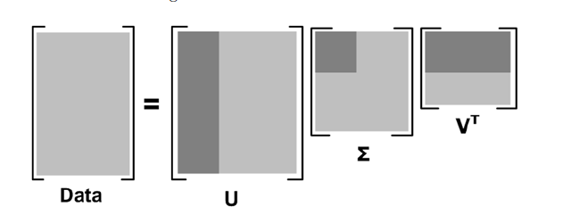
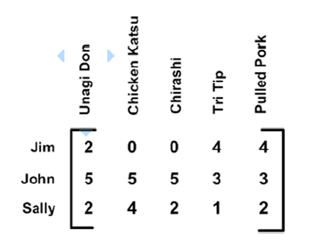
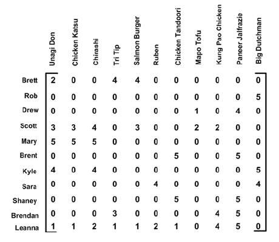

## [SVD概述](http://open.163.com/movie/2010/11/1/G/M6V0BQC4M_M6V2B5R1G.html)
> 从噪声数据中抽取相关特征

### SVD优缺点
* 优点：简化数据，去除噪声，提高算法的结果
* 缺点：数据的转换可能难以理解
* 适用数据类型：数值型数据

### SVD工作原理
不同于特征值分解只能用于方阵，奇异值分解可以用于任何矩阵，奇异值分解的公式为：
$$A_{m\times n}=U_{m\times m}\Sigma_{m\times n}V^T_{n \times n}$$
其中$A$是一个$m\times n$的矩阵，$U$是一个$m\times m$的正定矩阵(向量正交)，$\Sigma$是一个$m\times n$的从大到小排列的对角矩阵(对角线的值为奇异值)，$V^T$是一个$n \times n$的正定矩阵(向量正交)。
在某个奇异值的数目(r个)之后，其他的奇异值都置为0。即数据集拥有r个重要特征其余特征都是噪声或冗余特征。
确定保留多少个奇异值可以通过以下公式:
$$\frac{\sum_{ii}^k\Sigma_{ii}}{\sum_{ii}^n\Sigma_{ii}}\ge90\% $$
其中$k$表示保留的奇异值，$n$表示总的奇异值，压缩后的数据表示为
$$A_{m\times n}\approx U_{m\times k}\Sigma_{k\times k}V^T_{k\times n}$$
* 奇异值分解


## 实现SVD
### 基于协同过滤的[推荐系统](https://github.com/coldJune/machineLearning/blob/master/machineLearningCourseraNote/Note9.pdf)
**协同过滤(collaborative filtering)** 是通过将用户和其他用户的数据进行对比来实现推荐的。当数据采用矩阵形式进行组织时，可以通过用户或物品之间的相似度利用已有的数据预测用户喜好。
#### 相似度计算
* 用于相似度计算的矩阵

通过用户对物品的意见计算相似度
* 欧氏距离
*手撕猪肉(Pulled Pork)* 和 *烤牛肉(Tri Tip)* 之间的欧氏距离为：
$$\sqrt{(4-4)^2+(3-3)^2+(2-1)^2}=1$$
*手撕猪肉(Pulled Pork)* 和 *鳗鱼饭(Unagi Don)* 之间的欧氏距离为：
$$\sqrt{(4-2)^2+(3-5)^2+(2-2)^2}=2.83$$
从上面的数据中可以看出 *手撕猪肉(Pulled Pork)* 和 *烤牛肉(Tri Tip)* 之间的距离小于 *手撕猪肉(Pulled Pork)* 和 *鳗鱼饭(Unagi Don)* 之间的距离，因此 *手撕猪肉(Pulled Pork)* 和 *烤牛肉(Tri Tip)* 比与 *鳗鱼饭(Unagi Don)* 更相似。为了使相似度在$0$到$1$之间变化，并且物品越相似，它们相似度越大，相似度公式改写为：
$$similarity=\frac{1}{1+distance}$$

* 皮尔逊相关系数
**皮尔逊相关系数(Pearson correlation)** 度量的事两个向量之间的相似度。其相对于欧氏距离的优势在于它对用户评级的量级并不敏感。在`NumPy`中，皮尔逊相关系数的计算是由函数`corrcoef()`进行，它的取值范围是从$-1$到$+1$,为了将其归一化到$0$到$1$之间，所以相似度计算为：
$$0.5+0.5*corrcoef$$

* 余弦相似度
**余弦相似度(cosine similarity)** 计算的事两个向量夹角的余弦值。如果夹角为$90^{\circ}$，则相似度为$0$；如果两个向量方向相同，相似度为$1.0$。余弦相似度的取值范围也在$-1$到$+1$之间，因此也要将其归一化到$0$到$1$。两个向量$A$和$B$夹角的余弦相似度如下:
$$cos\theta=\frac{A \cdot B}{\mid\mid A\mid\mid\;\mid\mid B\mid\mid}$$
其中$\mid\mid A\mid\mid$和$\mid\mid B\mid\mid$表示向量$A$、$B$的2范数。向量$[4,2,2]$的2范数为:
$$\sqrt{4^2+2^2+2^2}$$
在`NumPy`的线性代数工具箱中提供了范数的计算方法`linalg.norm()`

* 相似度计算
```Python
def eclud_sim(in_a, in_b):
    """欧式距离计算相似度
    相似度=1/(1+距离)
    :param in_a: 矩阵A
    :param in_b: 矩阵B
    :return:
    """
    return 1.0/(1.0+la.norm(in_a-in_b))


def pears_sim(in_a, in_b):
    """皮尔逊相关系数计算相似度
    相似度=0.5+0.5*相关系数
    :param in_a: 矩阵A
    :param in_b: 矩阵B
    :return:
    """
    if len(in_a) < 3:
        return 1.0
    return 0.5+0.5*np.corrcoef(in_a, in_b, rowvar=0)[0][1]


def cos_sim(in_a, in_b):
    """余弦相似度
    相似度=向量乘积/范数乘积
    :param in_a: 矩阵A
    :param in_b: 矩阵B
    :return:
    """
    num = np.float(in_a.T*in_b)
    denom = la.norm(in_a)*la.norm(in_b)
    return 0.5+0.5*(num/denom)
```
上面的相似度计算都是假设数据采用了列向量方式进行表示，这里使用列向量暗示将利用基于物品的相似度计算方法。
使用 **基于物品(item-based)** 的相似度还是 **基于用户(user-based)** 的相似度[^1]取决于用户或物品的数目
。基于物品相似度计算的时间会随物品数量的增加而增加；基于用户的相似度计算的时间则会随用户数量的增加而增加。对于大部分产品导向的推荐引擎，用户的数量往往大于物品的数量。

#### 评价推荐引擎
通过交叉测试的方法，将已知评分值去掉，然后对它们进行预测，最后计算预测值和真实值之间的差异。用于推荐引擎评价的指标是称为 **最小均方根误差(Root Mean Squared Error, RMSE)** 的指标，它首先计算均方误差的平均值然后取其平方根。[^2]
#### 餐馆菜肴推荐引擎
##### 基于物品相似度的推荐引擎
推荐引擎工作过程：给定一个用户，系统会为此用户返回N个最好的推荐菜。
1. 寻找用户没有评级的菜肴，即在用户-物品矩阵中的0值
2. 在用户没有评级的所有物品中，对每个物品预计一个可能的评级分数
3. 对这些物品的评分从高到低进行排序，返回前N个物品
* 基于物品相似度的推荐引擎
```Python
def stand_est(data_mat, user, sim_meas, item):
    """计算用户对物品的估计评分值
    :param data_mat: 数据矩阵
    :param user: 用户编号
    :param sim_meas: 相似度计算方法
    :param item: 物品编号
    :return:
    """
    # 获取物品总数
    n = np.shape(data_mat)[1]
    # 总的相似度
    sim_total = 0.0
    # 总的相似度评分
    rat_sim_total = 0.0
    for j in range(n):
        # 对每一个物品
        # 计算用户的评分
        user_rating = data_mat[user, j]
        if user_rating == 0:
            # 如果用户没有对该物品评分
            # 跳过该物品
            continue
        # 找到重合的元素
        # 即寻找用户都评级的两个物品
        over_lap = np.nonzero(np.logical_and(data_mat[:, item].A > 0,
                                             data_mat[:, j].A > 0))[0]
        if len(over_lap) == 0:
            # 如果没有重合的元素
            similarity = 0
        else:
            # 计算重合物品的相似度
            similarity = sim_meas(data_mat[over_lap, item], data_mat[over_lap, j])
        print('%d 和 %d 相似度为 %f' % (item, j, similarity))
        # 累加相似度
        sim_total += similarity
        # 计算相似度和当前用户评分的乘积
        rat_sim_total += similarity*user_rating
    if sim_total == 0:
        # 直接退出
        return 0
    else:
        # 对评分进行归一化
        return rat_sim_total/sim_total


def recommend(data_mat, user, n=3, sim_meas=cos_sim, est_method=stand_est):
    """推荐
    :param data_mat: 数据矩阵
    :param user: 用户编号
    :param n: 推荐结果数量
    :param sim_meas: 相似度计算函数
    :param est_method: 估计方法
    :return:
    """
    # 找到用户未评级的武平
    unrated_items = np.nonzero(data_mat[user, :].A == 0)[1]
    if len(unrated_items) == 0:
        return '你对所有物品都进行了评级'
    item_scores = []
    for item in unrated_items:
        # 对每一个未评级的物品
        # 计算估计评分
        estimated_score = est_method(data_mat, user, sim_meas, item)
        # 将物品编号和对应评分存入列表
        item_scores.append((item, estimated_score))
    # 排序后返回前n个值
    return sorted(item_scores, key=lambda j: j[1], reverse=True)[:n]
```

##### 使用SVD提高推荐效果
* 用户菜肴矩阵

* 基于SVD的评分估计
```Python
def svd_est(data_mat, user, sim_meas, item):
    """基于SVD的评分估计
    :param data_mat:
    :param user:
    :param sim_meas:
    :param item:
    :return:
    """
    n = np.shape(data_mat)[1]
    sim_total = 0.0
    rat_sim_total = 0.0
    # 使用SVD分解
    u, sigma, vt = la.svd(data_mat)
    # 使用包含90%能量值的奇异值
    # 将其转换为一个对角矩阵
    sig4 = np.mat(np.eye(4)*sigma[:4])
    # 使用U矩阵将物品转换到低维空间
    x_formed_items = data_mat.T*u[:, :4]*sig4.I
    for j in range(n):
        # 对所有物品
        # 获取用户的评分值
        user_rating = data_mat[user, j]
        if user_rating == 0 or j == item:
            continue
        # 计算低维空间下的相似度
        similarity = sim_meas(x_formed_items[item, :].T, x_formed_items[j, :].T)
        print('%d 和 %d 相似度为 %f' % (item, j, similarity))
        # 累加相似度
        sim_total += similarity
        # 计算相似度和当前用户评分的乘积
        rat_sim_total += similarity*user_rating
    if sim_total == 0:
        return 0
    else:
        return rat_sim_total/sim_total
```
### 基于SVD的图像压缩
* 基于SVD的图像压缩
```Python
def img_compress(num_sv=3, thresh=0.8):
    """图像压缩
    :param num_sv: 奇异值数目
    :param thresh: 阈值
    :return:
    """
    myl = []
    with open('data/0_5.txt', 'r', encoding='utf-8') as f:
        for line in f.readlines():
            new_row = []
            for i in range(32):
                new_row.append(np.int(line[i]))
            myl.append(new_row)
    my_mat = np.mat(myl)
    print('原始矩阵')
    print_mat(my_mat, thresh)
    u, sigma, v_t = la.svd(my_mat)
    sig_recon = np.mat(np.zeros((num_sv, num_sv)))
    for k in range(num_sv):
        sig_recon[k, k] = sigma[k]
    recon_mat = u[:, :num_sv]*sig_recon*v_t[:num_sv, :]
    print('使用%d个奇异值重构矩阵' % num_sv)
    print_mat(recon_mat, thresh)
```
****
[示例代码](https://github.com/coldJune/machineLearning/tree/master/MachineLearningInAction/svd)
[^1]: 在[用于相似度计算的矩阵]这张图中，行与行之间比较的是基于用户的相似度，列与列之间比较的事基于物品的相似度。
[^2]: 如果评级在1星到5星，而RMSE为1，意味着预测值和真实评价相差一个星级
