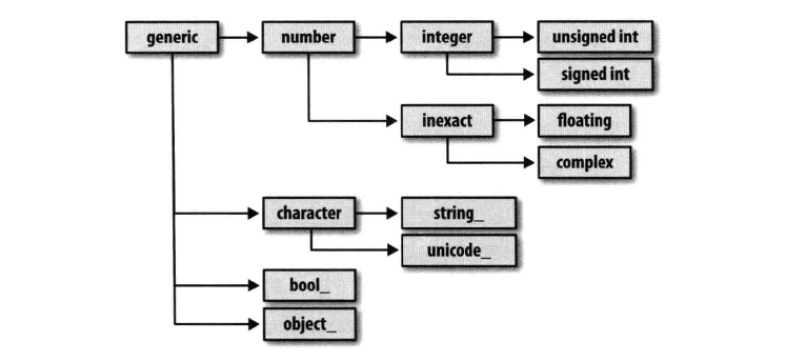
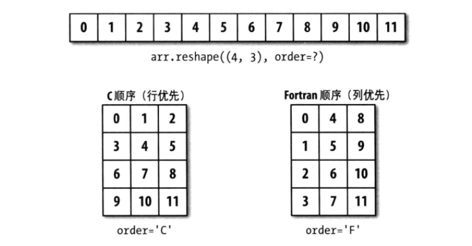
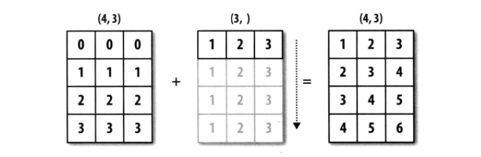
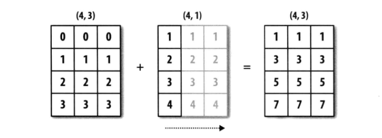
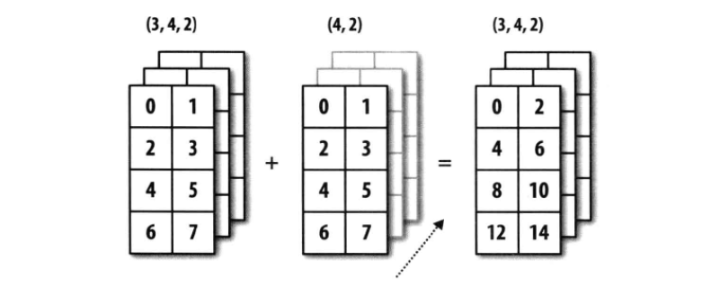
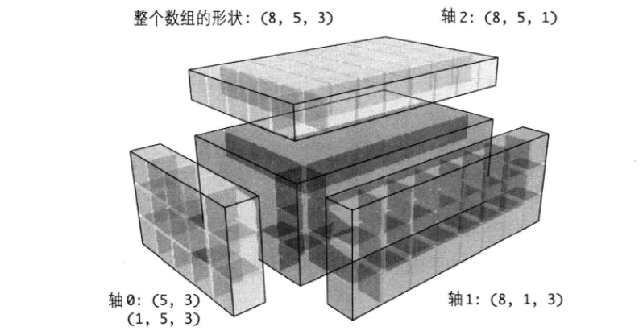

## ndarray对象的内部机制
NumPy的ndarray提供了一种同质数据块(连续/跨越)解释为多维数组对象的方式。**数据类型(dtype)** 决定了数据的解释方式。ndarray所有数组对象都是数据块的一个跨度视图，ndarray由以下内容组成:
1. 一个指向数组(一个系统内存块)的指针
2. 数据类型或dtype
3. 一个表示数组形状(shape)的元组，例如一个2x2的数组形状为(2,2)
4. 一个跨度元组(stride)，其中整数指的是为了前进到当前维度的下一个元素需要跨过的字节数(C顺序的3x4x5的float64(8字节)数组跨度为(160,40,8))
* ndarray的内部结构

跨度可以是负数，这样会使数组在内存中后向移动，切片中obj[::-1]或obj[:,::-1]就是如此

### NumPy数据类型体系
`dtype`都有一个超类，可以跟`np.issubdtype`函数结合使用，调用`dtype`的`mro`方法查看其所有父类:
```Python
In [2]: ints = np.ones(10,dtype=np.uint16)

In [3]: floats = np.ones(10,dtype=np.float32)

In [4]: np.issubdtype(ints.dtype,np.integer)
Out[4]: True

In [5]: np.issubdtype(floats.dtype,np.floating)
Out[5]: True

In [6]: np.float64.mro()#查看父类
Out[6]:
[numpy.float64,
 numpy.floating,
 numpy.inexact,
 numpy.number,
 numpy.generic,
 float,
 object]

```
* NumPy的dtype体系


## 高级数组操作
### 数组重塑
**数组重塑** 只需向数组的实例方法`reshape`传入一个表示新形状的元组，一维数组和多维数组都能被重塑，当作为参数形状的其中一维为 *-1* 时表示该维度的大小由数据本身推断出来；可以将数组的`shape`属性传入`reshape`方法。与`reshape`将一维数组转换为多维数组的运算过程相反的运算叫做 **扁平化(flattening)** 或 **散开(raveling)**,`ravel`不会产生源数据的副本，`flatten`方法返回数据的副本:
```Python
In [7]: arr = np.arange(8)

In [8]: arr
Out[8]: array([0, 1, 2, 3, 4, 5, 6, 7])

In [9]: arr.reshape((4,2)) #转换为一个4x2的矩阵
Out[9]:
array([[0, 1],
       [2, 3],
       [4, 5],
       [6, 7]])

In [10]: arr.reshape((4,2)).reshape((2,4)) #重塑多维数组
Out[10]:
array([[0, 1, 2, 3],
       [4, 5, 6, 7]])


In [13]: arr = np.arange(15)

In [14]: arr.reshape((3,-1)) #设置-1，让其自动推断
Out[14]:
array([[ 0,  1,  2,  3,  4],
       [ 5,  6,  7,  8,  9],
       [10, 11, 12, 13, 14]])

In [15]: other_arr = np.ones((5,3))

In [16]: other_arr.shape
Out[16]: (5, 3)

In [17]: arr.reshape(other_arr.shape) #使用数组的shape属性
Out[17]:
array([[ 0,  1,  2],
       [ 3,  4,  5],
       [ 6,  7,  8],
       [ 9, 10, 11],
       [12, 13, 14]])


In [19]: arr = arr.reshape((5,3))

In [21]: arr
Out[21]:
array([[ 0,  1,  2],
       [ 3,  4,  5],
       [ 6,  7,  8],
       [ 9, 10, 11],
       [12, 13, 14]])

In [22]: arr.ravel() #扁平化
Out[22]: array([ 0,  1,  2,  3,  4,  5,  6,  7,  8,  9, 10, 11, 12, 13, 14])

In [24]: arr.flatten()
Out[24]: array([ 0,  1,  2,  3,  4,  5,  6,  7,  8,  9, 10, 11, 12, 13, 14])

```

### C和Fortran顺序
**C顺序** 是指行优先顺序，对于一个二维数组，每行中的数据项是被存放在相邻内存位置上的。 **Fortran顺序** 是指列优先顺序，每列中的数据项是被存放在相邻内存位置上。`reshape`和`reval`这样的含糊可以接受一个表示数组数据存放顺序的`order`参数，一般是'C'或'F';C和Fortran顺序的关键区别是维度的行进顺序:
* C/行优先顺序：先经过更高的维度(*轴1优先于轴0被处理*)
* Fortran/列优先顺序: 后经过更高的维度(*轴0会先于轴1被处理*)

```Python
In [26]: arr = np.arange(12).reshape((3,4))

In [27]: arr.ravel() #行优先
Out[27]: array([ 0,  1,  2,  3,  4,  5,  6,  7,  8,  9, 10, 11])

In [28]: arr.ravel('F') #列优先
Out[28]: array([ 0,  4,  8,  1,  5,  9,  2,  6, 10,  3,  7, 11])

```
* 按行或列优先进行重塑


### 数组的合并和拆分
* 数组连接/拆分函数

|          函数          |                       说明                       |
|:----------------------:|:------------------------------------------------:|
|      concatenate       |       最一般化的连接，沿一条轴连接一组数组       |
|   vstack、row_stack    |       以面向行的方式对数组进行堆叠(沿轴0)        |
|         hstack         |       以面向列的方式对数组进行堆叠(沿轴1)        |
|      column_stack      | 类似于hstack，但是会先将一维数组转换为二维列向量 |
|         dstack         |     以面向"深度"的方式对数组进行堆叠(沿轴2)      |
|         split          |           沿指定轴在指定的位置拆分数组           |
| hsplit、vsplit、dsplit |      split的便捷化函数，分别沿轴0、轴1、轴2      |

```Python
In [29]: #使用numpy.concatenate按指定轴将一个由数组组成的序列连接到一起

In [30]: arr1 = np.array([[1,2,3],[4,5,6]])

In [31]: arr2 = np.array([[7,8,9],[10,11,12]])

In [32]: np.concatenate([arr1,arr2],axis=0)
Out[32]:
array([[ 1,  2,  3],
       [ 4,  5,  6],
       [ 7,  8,  9],
       [10, 11, 12]])

In [33]: np.concatenate([arr1,arr2],axis=1)
Out[33]:
array([[ 1,  2,  3,  7,  8,  9],
       [ 4,  5,  6, 10, 11, 12]])

In [34]: #使用vstack和hstack

In [35]: np.vstack((arr1,arr2))
Out[35]:
array([[ 1,  2,  3],
       [ 4,  5,  6],
       [ 7,  8,  9],
       [10, 11, 12]])

In [36]: np.hstack((arr1,arr2))
Out[36]:
array([[ 1,  2,  3,  7,  8,  9],
       [ 4,  5,  6, 10, 11, 12]])

In [37]: arr = np.random.randn(5,2)

In [38]: arr
Out[38]:
array([[ 1.37094925,  0.05685231],
       [-0.95278187,  0.06863068],
       [ 0.00680745, -0.67222854],
       [ 0.40865965, -0.63241948],
       [ 1.1155423 ,  2.87073277]])

In [39]: #使用split将一个数组沿指定轴拆分为多个数组

In [40]: first,sencond,third = np.split(arr,[1,3])

In [41]: first
Out[41]: array([[ 1.37094925,  0.05685231]])

In [42]: sencond
Out[42]:
array([[-0.95278187,  0.06863068],
       [ 0.00680745, -0.67222854]])

In [43]: third
Out[43]:
array([[ 0.40865965, -0.63241948],
       [ 1.1155423 ,  2.87073277]])
```
#### 堆叠辅助类：r_和c_
NumPy命名空间有两个特殊的对象`r_`和`c_`，它们能简化数组的堆叠操作:
```Python
In [44]: arr1 = np.arange(6).reshape((3,2))

In [45]: arr2 = randn(3,2)

In [46]: np.r_[arr1,arr2] #在列上堆叠
Out[46]:
array([[ 0.        ,  1.        ],
       [ 2.        ,  3.        ],
       [ 4.        ,  5.        ],
       [ 0.76365569,  0.53019635],
       [ 0.10616532, -0.66130024],
       [-0.20727219,  0.82787646]])

In [47]: np.c_[np.r_[arr1,arr2],np.arange(6)]#在列上堆叠后在行上堆叠
Out[47]:
array([[ 0.        ,  1.        ,  0.        ],
       [ 2.        ,  3.        ,  1.        ],
       [ 4.        ,  5.        ,  2.        ],
       [ 0.76365569,  0.53019635,  3.        ],
       [ 0.10616532, -0.66130024,  4.        ],
       [-0.20727219,  0.82787646,  5.        ]])

In [48]: #将切片翻译成数组

In [49]: np.c_[1:3,-3:-1]
Out[49]:
array([[ 1, -3],
       [ 2, -2]])

In [50]: np.r_[1:3,-3:-1]
Out[50]: array([ 1,  2, -3, -2])

```
### 元素的重复炒作:tile和repeat
`repeat`会将数组中各个元素重复一定的次数，从而产生一个更大的数组，默认情况下如果传入的是一个整数，则各元素都会被重复熊那个盈整数次。如果传入的是一组整数，则各元素就可以重复不同的次数。如果传入的是一组整数，则各元素就可以重复不同的次数
```Python

In [48]: #将切片翻译成数组

In [49]: np.c_[1:3,-3:-1]
Out[49]:
array([[ 1, -3],
       [ 2, -2]])

In [50]: np.r_[1:3,-3:-1]
Out[50]: array([ 1,  2, -3, -2])

In [51]: arr = np.arange(3)

In [52]: arr
Out[52]: array([0, 1, 2])

In [53]: arr.repeat(3)
Out[53]: array([0, 0, 0, 1, 1, 1, 2, 2, 2])

In [54]: arr.repeat([2,3])
---------------------------------------------------------------------------
ValueError                                Traceback (most recent call last)
<ipython-input-54-a0c86ecd16ca> in <module>()
----> 1 arr.repeat([2,3])

ValueError: operands could not be broadcast together with shape (3,) (2,)

In [55]: arr.repeat([2,3,4])
Out[55]: array([0, 0, 1, 1, 1, 2, 2, 2, 2])

In [56]: #指定轴重复

In [57]: arr = np.random.randn(2,2)

In [58]: arr
Out[58]:
array([[ 0.1934937 ,  0.02686283],
       [-1.37329786,  1.04754158]])

In [59]: arr.repeat(2,axis=0)
Out[59]:
array([[ 0.1934937 ,  0.02686283],
       [ 0.1934937 ,  0.02686283],
       [-1.37329786,  1.04754158],
       [-1.37329786,  1.04754158]])

In [60]: arr.repeat([2,3],axis=0)
Out[60]:
array([[ 0.1934937 ,  0.02686283],
       [ 0.1934937 ,  0.02686283],
       [-1.37329786,  1.04754158],
       [-1.37329786,  1.04754158],
       [-1.37329786,  1.04754158]])

In [61]: arr.repeat([2,3],axis=1)
Out[61]:
array([[ 0.1934937 ,  0.1934937 ,  0.02686283,  0.02686283,  0.02686283],
       [-1.37329786, -1.37329786,  1.04754158,  1.04754158,  1.04754158]])
```
`tile`的功能是沿指定轴向堆叠数组的副本，第二个参数是堆叠的次数，对于标量，是水平堆叠的，它还可以是一个元组
```Python
In [62]: arr
Out[62]:
array([[ 0.1934937 ,  0.02686283],
       [-1.37329786,  1.04754158]])

In [63]: np.tile(arr,2)
Out[63]:
array([[ 0.1934937 ,  0.02686283,  0.1934937 ,  0.02686283],
       [-1.37329786,  1.04754158, -1.37329786,  1.04754158]])

In [64]: np.tile(arr,(2,1))
Out[64]:
array([[ 0.1934937 ,  0.02686283],
       [-1.37329786,  1.04754158],
       [ 0.1934937 ,  0.02686283],
       [-1.37329786,  1.04754158]])

In [65]: np.tile(arr,(3,2))
Out[65]:
array([[ 0.1934937 ,  0.02686283,  0.1934937 ,  0.02686283],
       [-1.37329786,  1.04754158, -1.37329786,  1.04754158],
       [ 0.1934937 ,  0.02686283,  0.1934937 ,  0.02686283],
       [-1.37329786,  1.04754158, -1.37329786,  1.04754158],
       [ 0.1934937 ,  0.02686283,  0.1934937 ,  0.02686283],
       [-1.37329786,  1.04754158, -1.37329786,  1.04754158]])
```
### 花式索引的等价函数:take和put
ndarray有两个方法专门用于获取和设置单个轴向上的选区，要在其他轴上使用`take`需要传入`axis`关键字；`put`不接受`axis`参数，它只会在数组的扁平化版本(一维，C顺序)上进行索引：
```Python
In [66]: arr = np.arange(10)*100

In [67]: inds = [4,2,5,6]

In [68]: arr.take(inds)
Out[68]: array([400, 200, 500, 600])

In [69]: arr.put(inds,66)

In [70]: arr
Out[70]: array([  0, 100,  66, 300,  66,  66,  66, 700, 800, 900])

In [71]: # 其他轴上使用take

In [72]: ins = [2,0,2,1]

In [74]: arr = np.random.randn(2,4)

In [75]: arr
Out[75]:
array([[-1.16866402, -0.38862055, -0.30056282, -0.11058824],
       [-2.17866244,  0.06630283,  0.47301188, -0.00937435]])

In [77]: arr.take(ins,axis=1)
Out[77]:
array([[-0.30056282, -1.16866402, -0.30056282, -0.38862055],
       [ 0.47301188, -2.17866244,  0.47301188,  0.06630283]])

```

## 广播
**广播(broadcasting)** 指的是不同形状的数组之间的算术运算的执行方式，只要遵循一定的规则[^1]，低纬度的值可以被广播到数组的任意维度
* 一维数组在轴0上的广播
```Python
In [80]: arr = randn(4,3)

In [81]: arr.mean(0)
Out[81]: array([-0.28703998, -0.39306773,  0.41940885])

In [82]: demeaned = arr-arr.mean(0)

In [83]: demeaned
Out[83]:
array([[-0.99338257,  0.87131685,  0.65287535],
       [ 0.75548156,  0.13286309,  1.0316277 ],
       [-0.05877416, -0.41411289, -1.13737663],
       [ 0.29667517, -0.59006705, -0.54712642]])

In [84]: demeaned.mean(0)
Out[84]: array([ -1.38777878e-17,  -2.77555756e-17,   0.00000000e+00])
```
由于`arr.mean(0)`的长度为3，所以它可以在0轴(这里的行)进行广播，因为arr的后缘维度是3，所以它们是兼容的


要在1轴上做减法(各行减去行平均值)，较小的那个数组必须是(4,1)：
```Python
In [85]: arr
Out[85]:
array([[-1.28042256,  0.47824912,  1.0722842 ],
       [ 0.46844158, -0.26020464,  1.45103655],
       [-0.34581414, -0.80718062, -0.71796778],
       [ 0.00963519, -0.98313478, -0.12771757]])

In [86]: row_means = arr.mean(1)

In [87]: row_means.reshape((4,1))
Out[87]:
array([[ 0.09003692],
       [ 0.55309117],
       [-0.62365418],
       [-0.36707239]])

In [88]: demeaned = arr-row_means.reshape((4,1))

In [89]: demeaned
Out[89]:
array([[-1.37045948,  0.3882122 ,  0.98224728],
       [-0.08464958, -0.8132958 ,  0.89794539],
       [ 0.27784004, -0.18352644, -0.0943136 ],
       [ 0.37670757, -0.61606239,  0.23935482]])

In [90]: demeaned.mean(1)
Out[90]:
array([  3.70074342e-17,   0.00000000e+00,   7.40148683e-17,
         0.00000000e+00])

```
* 二维数组在轴1上的广播


* 三维数组再轴0上的广播


### 沿其他轴向广播
根据广播的原则，较小数组的"广播维"必须为1，对于三维的情况，在三维的任何一维上广播其实就是将数据重塑为兼容的形状，于是变需要专门为了广播添加一个长度为1的轴。NumPy数组通过特殊的`np.newaxis`属性以及 **"全"切片** 的方式插入新轴：
```Python
In [91]: arr = np.zeros((4,4))

In [92]: arr_3d = arr[:,np.newaxis,:]

In [93]: arr_3d
Out[93]:
array([[[ 0.,  0.,  0.,  0.]],

       [[ 0.,  0.,  0.,  0.]],

       [[ 0.,  0.,  0.,  0.]],

       [[ 0.,  0.,  0.,  0.]]])

In [94]: arr_3d.shape
Out[94]: (4, 1, 4)

In [In [95]: arr_1d = np.random.normal(size=3)

In [96]: arr_1d
Out[96]: array([-1.22549157, -0.3134849 ,  2.53183583])

In [97]: arr_1d[:,np.newaxis]
Out[97]:
array([[-1.22549157],
       [-0.3134849 ],
       [ 2.53183583]])

In [98]: arr_1d[np.newaxis,]
Out[98]: array([[-1.22549157, -0.3134849 ,  2.53183583]])

In [99]: #对一个三维数组的轴二进行距平化

In [102]: arr = np.random.randn(3,4,5)

In [103]: depth_means = arr.mean(2)

In [104]: depth_means
Out[104]:
array([[ 0.97772551, -0.31477537, -0.07086849, -0.00903146],
       [-0.05710366, -0.21994819, -0.88640694, -1.13437736],
       [ 0.2764665 ,  0.21509737,  0.17401022, -0.02444951]])

In [105]: demeaned =arr - depth_means[:,:,np.newaxis]

In [106]: demeaned
Out[106]:
array([[[ 0.18417271, -0.6440984 ,  0.33705976, -0.72700844,  0.84987438],
        [ 0.62215472,  0.96952659, -0.83439414,  0.53091573, -1.28820289],
        [-0.82589887, -1.21061523, -0.65990178,  1.04349758,  1.6529183 ],
        [-0.96572226, -0.17109805,  0.47527161,  0.29543314,  0.36611556]],

       [[-0.74199902,  1.0335094 ,  0.79082135,  0.74965704, -1.83198878],
        [-0.13308665, -0.06519346, -1.25928735, -0.53072789,  1.98829536],
        [-1.29463221,  0.74406668,  0.11684248,  2.0569325 , -1.62320945],
        [ 0.16037305, -0.28538757, -0.52345196,  1.32871473, -0.68024825]],

       [[ 1.85145343, -1.72601091, -1.15556288, -0.10519721,  1.13531758],
        [-1.68513998,  1.01516175,  0.05503934,  1.32854393, -0.71360504],
        [-0.42673112,  0.17061598, -1.07571345, -0.05948793,  1.39131652],
        [ 0.2301913 , -1.45091258,  0.1423503 ,  0.52866008,  0.54971089]]])

In [107]: demeaned.mean(2)
Out[107]:
array([[  4.44089210e-17,  -4.44089210e-17,   0.00000000e+00,
          3.33066907e-17],
       [  0.00000000e+00,   0.00000000e+00,   1.33226763e-16,
          1.33226763e-16],
       [  0.00000000e+00,  -4.44089210e-17,   0.00000000e+00,
          0.00000000e+00]])
```
* 能在三维数组上广播的二维数组的形状示例


### 通过广播设置数组的值
算术运算所遵循的广播原则同样适用于通过索引机制设置数组值的操作
```Python

In [108]: arr = np.zeros((4,3))

In [109]: arr[:] = 5

In [110]: arr
Out[110]:
array([[ 5.,  5.,  5.],
       [ 5.,  5.,  5.],
       [ 5.,  5.,  5.],
       [ 5.,  5.,  5.]])

In [111]: #用一个一维数组来设置目标数组的各列

In [112]: col = np.array([1,2,3,4])

In [113]: arr[:]=col[:,np.newaxis]

In [114]: arr
Out[114]:
array([[ 1.,  1.,  1.],
       [ 2.,  2.,  2.],
       [ 3.,  3.,  3.],
       [ 4.,  4.,  4.]])

In [115]: arr[:2] =[[5],[6]]

In [116]: arr
Out[116]:
array([[ 5.,  5.,  5.],
       [ 6.,  6.,  6.],
       [ 3.,  3.,  3.],
       [ 4.,  4.,  4.]])
```
## ufunc高级应用

[^1]: 广播的原则:如果两个数组的后缘维度(trailing dimension，即从末尾开始算起的维度)的轴长度相符或其中一方的长度为1，则认为它们是广播兼容的。广播会在缺失和(或)长度为1的维度上进行。
