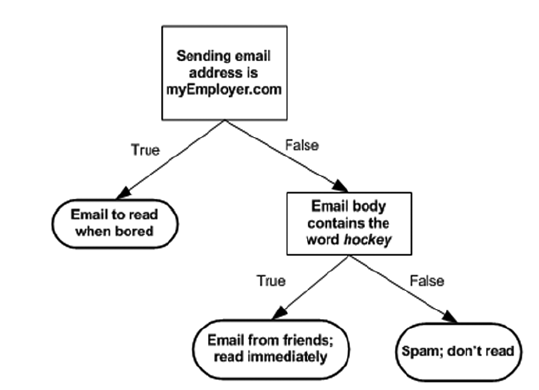
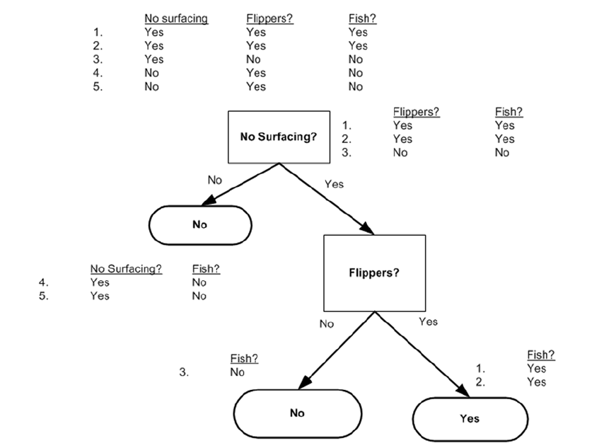
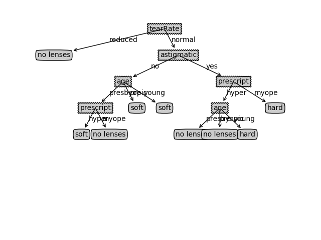

## 决策树算法概述
> 使用具体标签划分类别

* **决策树**

### 决策树算法的优缺点
* 优点：计算复杂度不高，输出结果易于理解，对中间值的缺失不敏感，可以处理不相关特征数据
* 缺点：可能会产生过度匹配问题
* 适用数据类型：数值型和标称型

### 决策树的工作原理
* **伪代码**
```
检测数据集中的每个子项是否属于同一分类：
    if so return 类标签;
    else
        寻找划分数据集的最好特征
        划分数据集
        创建分支节点
            for 每个划分的子集
                重复前面的步骤并增加返回结果到分支节点中
        return 分支节点
```
### 决策树的一般流程
1. 收集数据：可以使用任何方法
2. 准备数据：树构造算法只适用于标称型数据，因此数据型数据必须离散化
3. 分析数据：可以使用任何方法，构造树完成之后，检查图形书否符合预期
4. 训练算法：构造树的数据结构
5. 测试算法：使用经验树计算错误率
6. 使用算法：此步骤可以适用于任何监督学习算法，而是用决策树可以更好地理解数据的内在含义

## 实现决策树算法
### 信息增益
划分数据集的大原则是：**将无序的数据变得更加有序**。在划分数据集前后信息发生的变化称为 **信息增益**。可以计算每个特征值划分数据集获得的信息增益并选择使信息增益最高的特征来划分数据集。集合信息的度量方式称为 **香农熵** 或简称为 **熵**。**熵(entropy)** 定义为信息的期望值。
如果待分类的事务可能划分在多个分类中，则符号$x_i$的信息定义为：
$$l(x_i)=-\log_2p(x_i)$$
其中$p(x_i)$是选择该分类的概率。
为了计算熵，需要计算所有类别所有可能值包含的信息期望值：
$$H=-\sum_{i=1}^{n}p(x_i)\log_2p(x_i)$$
其中$n$是分类的数目
* **计算给定数据集的香农熵**
```python
def calc_shannon_ent(data_set):
    """计算给定数据集的香农熵
    :param data_set:
    :return:
    """
    # 计算数据集大小
    num_entries = len(data_set)
    # 创建数据字典，键值为数据集最后一列的值
    # 计算每一个键值出现的次数
    label_counts = {}
    for feat_vec in data_set:
        current_label = feat_vec[-1]
        if current_label not in label_counts.keys():
            label_counts[current_label] = 0
        label_counts[current_label] += 1
    shannon_ent = 0.0
    for key in label_counts:
        # 使用类标签的发生频率计算类别出现的概率
        # 计算香农熵
        prob = float(label_counts[key]) / num_entries
        shannon_ent -= prob * log(prob, 2)
    return shannon_ent
```
熵越高，则混合的数据越多。得到熵之后可以按照获取最大信息增益的方法划分数据集。

### 划分数据集
分类算法除了需要测量信息熵，还需要划分数据集，度量划分数据集的熵。对每个特征划分数据集的结果计算一次信息熵，然后判断按照哪个特征划分数据集是最好的划分方式
* **按照给定特征划分数据集**
```Python
def split_data_set(data_set, axis, value):
    """按照给定特征划分数据集
    :param data_set: 待划分的数据集
    :param axis: 划分数据集的特征
    :param value: 需要返回的特征的值
    :return:
    """
    # 创建新的list对象
    ret_data_set = []
    for feat_vec in data_set:
        # 遍历数据集中每个元素，发现符合要求的值将其添加到新的列表中
        # 即按照某个特征划分数据集时将所有符合要求的元素抽取出来
        if feat_vec[axis] == value:
            reduced_feat_vec = feat_vec[:axis]
            reduced_feat_vec.extend(feat_vec[axis+1:])
            ret_data_set.append(reduced_feat_vec)
    return ret_data_set
```

* **选择最好的数据划分方式**
```Python
def choose_best_feature_to_split(data_set):
    """选取最好的数据集划分方式
    循环计算香农熵和split_data_set()函数，熵计算会说明划分数据集的最好数据组织方式
    1.数据必须是一种由列表元素组成的列表，所有列表元素长度相同
    2.数据的最后一列或每个实例的最后一个元素是当前实例的类别标签
    :param data_set: 待划分的数据集
    :return:
    """
    num_features = len(data_set[0]) - 1
    # 计算整个数据集的原始香农熵，用于与划分完之后的数据集计算的熵值进行比较
    base_entropy = calc_shannon_ent(data_set)
    best_info_gain, best_feature = 0.0, -1
    for i in range(num_features):
        # 遍历数据集中的所有特征
        # 将数据集中所有第i个特征值或者所有可能存在的值写入新的list中
        feat_list = [example[i] for example in data_set]
        # 去重
        unique_vals = set(feat_list)
        new_entropy = 0.0
        for value in unique_vals:
            # 遍历所有当前特征中的所有唯一属性值
            # 对每个唯一属性划分一次数据集
            # 然后计算数据集的新熵值
            # 对所有数据集求得的熵值求和
            sub_data_set = split_data_set(data_set, i, value)
            prob = len(sub_data_set)/float(len(data_set))
            new_entropy += prob * calc_shannon_ent(sub_data_set)
        info_gain = base_entropy - new_entropy
        if info_gain > best_info_gain:
            # 比较信息增益，返回最好特征的索引值
            best_info_gain = info_gain
            best_feature = i
    return best_feature
```
### 递归构建决策树
上面完成了从数据集构造决策树算法所需要的子功能模块，工作原理如下：
> 得到原始数据集，然后基于最好的特征值划分数据集，由于特征值可能多于两个，因此可能存在大于两个分支的数据集划分。第一次划分之后，数据将向下传递到树分支的下一个节点，然后在这个节点上再次划分数据。

递归结束的条件：
> 程序遍历完所有划分数据集的属性或者每个分支下的所有实例都具有相同的分类

如果所有的实例具有相同的分类，则得到一个叶子节点或者终止块。任何到达叶子节点的数据必然属于叶子节点的分类。
* **划分数据时的数据路径**

如果数据集已经处理了所有属性，但类标签依然不是唯一的，这时通常使用多数表决的方法决定该子节点的分类
* **多数表决**
```Python
def majority_cnt(class_list):
    """多数表决
    计算每个类标签出现的频率，返回出现次数最多的分类名称
    :param class_list: 分类名称的列表
    :return:
    """
    class_count = {}
    for vote in class_list:
        if vote not in class_count.keys():
            class_count[vote] = 0
        class_count[vote] += 1
        sorted_class_count = sorted(class_count.items(), key=operator.itemgetter(1), reverse=True)
    return sorted_class_count[0][0]
```

* **创建树**
```Python
def create_tree(data_set, labels):
    """创建树
    :param data_set: 数据集
    :param labels: 标签列表
    :return:
    """
    class_list = [example[-1] for example in data_set]
    if class_list.count(class_list[0]) == len(class_list):
        # 所有类标签完全相同则停止划分
        return class_list[0]
    if len(data_set[0]) == 1:
        # 使用完所有特征停止划分
        return majority_cnt(class_list)
    # 存储最好特征
    # 得到列表包含的所有属性值
    best_feature = choose_best_feature_to_split(data_set)
    best_feat_label = labels[best_feature]
    my_tree = {best_feat_label: {}}
    del(labels[best_feature])
    feat_values = [example[best_feature] for example in data_set]
    unique_vals = set(feat_values)
    for value in unique_vals:
        # 复制类标签
        sub_labels = labels[:]
        # 在每个数据集划分上调用create_tree()
        # 得到的返回值被插入到my_tree中
        my_tree[best_feat_label][value] = create_tree(split_data_set(data_set, best_feature, value), sub_labels)
    return my_tree
```

## [在Python中使用Matplotlib注解绘制树形图](https://github.com/coldJune/machineLearning/blob/master/MachineLearningInAction/trees/tree_plotter.py)
## 测试和存储分类器
### 测试算法：使用决策树执行分类
依靠训练数据构造的决策树，程序比较测试数据与决策树上的数值，递归执行该过程直到进入叶子节点，最后将测试数据定义为叶子节点所属的类型。
* **执行分类**
```Python
def classify(input_tree, feat_labels, test_vec):
    """使用决策树分类
    :param input_tree: 数据集
    :param feat_labels: 特征标签
    :param test_vec: 测试向量
    :return:
    """
    first_str = list(input_tree.keys())[0]
    second_dict = input_tree[first_str]
    # 找到当前列表第一个匹配first_str变量的标签
    feat_index = feat_labels.index(first_str)
    for key in second_dict.keys():
        # 遍历整棵树，比较test_vec变量中的值与树节点的值
        # 如果到达叶子节点就返回节点的分类标签
        if test_vec[feat_index] == key:

            if type(second_dict[key]).__name__ == 'dict':
                class_label = classify(second_dict[key], feat_labels, test_vec)
            else:
                class_label = second_dict[key]
    return class_label
```
### 使用算法：决策树的存储
为了节省计算时间，可以使用Python模块pickle序列化构造好的决策树对象，序列化对象可以在磁盘上保存对象，并在需要的时候读取出来。
* **序列化**
```Python
def store_tree(input_tree, filename):
    """存储决策树
    :param input_tree: 树结构
    :param filename: 文件名
    :return:
    """
    with open(filename, 'w', encoding='utf-8') as fw:
        pickle.dump(input_tree, fw)


def grab_tree(filename):
    """读取决策树
    :param filename: 文件名
    :return:
    """
    with open(filename, 'r', encoding='utf-8') as fr:
        return pickle.load(fr)
```
## 示例：使用决策树预测隐形眼镜类型
* **使用决策树**
```Python
In [6]: import trees

In [7]: import tree_plotter

In [8]: fr = open('data/lenses.txt')

In [9]: lenses = [inst.strip().split('\t') for inst in fr.readlines()]

In [10]: lenses_labels = ['age', 'prescript', 'astigmatic', 'tearRate']

In [11]: lenseTree = trees.create_tree(lenses,lenses_labels)

In [12]: lenseTree
Out[12]:
{'tearRate': {'normal': {'astigmatic': {'no': {'age': {'pre': 'soft',
      'presbyopic': {'prescript': {'hyper': 'soft', 'myope': 'no lenses'}},
      'young': 'soft'}},
    'yes': {'prescript': {'hyper': {'age': {'pre': 'no lenses',
        'presbyopic': 'no lenses',
        'young': 'hard'}},
      'myope': 'hard'}}}},
  'reduced': 'no lenses'}}

In [13]: tree_plotter.create_plot(lenseTree)
```
* **ID3算法产生的决策树**

****
[示例代码](https://github.com/coldJune/machineLearning/tree/master/MachineLearningInAction/trees)
