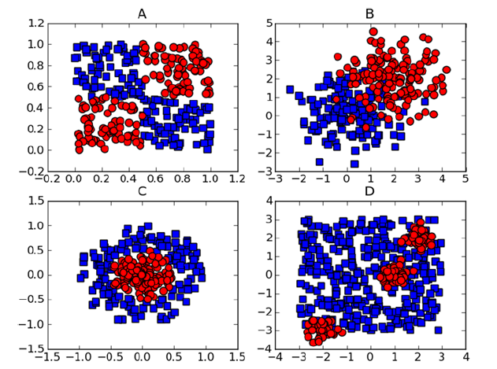
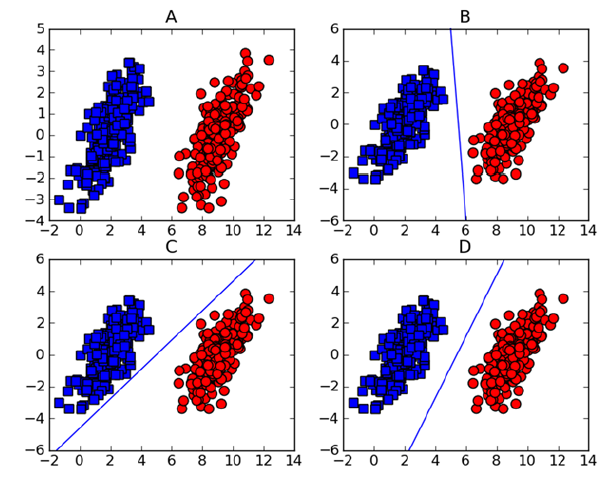
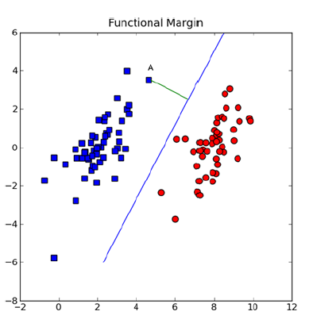
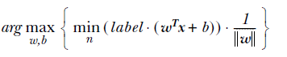
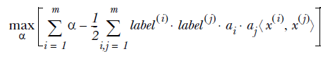
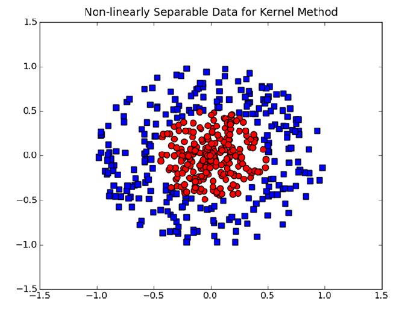

## [SVM概述](https://github.com/coldJune/machineLearning/blob/master/machineLearningCourseraNote/Note7.pdf)
> SVM是一种基于最大间隔分隔数据的算法

### SVM的优缺点
* 优点：泛化错误率低，计算开销不大，结果易解释
* 缺点：对参数调节和核函数的选择敏感，原始分类器不加修改仅适用于处理二类问题
* 适用数据类型：数值型和标称型数据

### SVM的工作原理
#### 基于最大间隔分隔数据
* 4个线性不可分的例子


* 线性可分和分隔实例


如上图A框的数据所示，由于数据之间分隔间距足够大，所有可以在图中画出一条直线将两组数据点分开，这种数据被称为 **线性可分(linearly separable)** 数据。而将数据集分隔开的直线被称为 **分隔超平面(separating hyperplane)**[^1]，是分类的决策边界[^2]。通过这种方式构建分类器是希望找到离分隔超平面最近的点，确保它们离分隔面的距离足够远。这种点到分隔面的距离被称为 **间隔(margin)**。为了确保分类器足够健壮，则间隔就要尽可能地大。**支持向量(support vector)** 就是离分隔超平面最近的点。

#### 寻找最大间隔
分隔超平面的形式可以写成$w^Tx+b$。要计算点A到分隔超平面的距离，就必须计算点到分割面的法线或垂线的长度$\frac{|w^TA+b|}{||w||}$，常数$b$类似于Logistic回归中的截距$w_0$。向量$w$和常数$b$一起描述了所给数据的分隔线或超平面。
* 函数间隔


##### 分类器求解优化
输入数据给分类器会输出一个类别标签。使用类似 **海维赛德阶跃函数** 的函数对$w^Tx+b$作用得到$f(w^Tx+b)$，当$u<0$时$f(u)$输出是$-1$，反之则输出$+1$。当计算数据点到分隔面的距离并确定分隔面的放置位置时，间隔通过$label\ast(w^Tx+b)$来计算。 现在的目标是找出分类器定义中的$w$和$b$，为此必须找到具有最小间隔的数据点(即支持向量)，在找到数据点后需要对间隔最大化：[^3]

通过固定其中一个因子来最大化其他因子来求解上述问题。如果令所有支持向量的$label\ast(w^Tx+b)$都等于$1$，那么就可以通过求解$||w||^{-1}$的最大值来得到最终解。因为并非所有数据点的$label\ast(w^Tx+b)$都等于$1$，只有那些离分隔超平面最近的点的值才为$1$。而离超平面越远的数据点，其$label\ast(w^Tx+b)$的值越大。
在上面的优化中给定了约束条件$label\ast(w^Tx+b \geq 1.0)$，通过引入[拉格朗日乘子](https://baike.baidu.com/item/%E6%8B%89%E6%A0%BC%E6%9C%97%E6%97%A5%E4%B9%98%E5%AD%90%E6%B3%95/1946079?fr=aladdin)就可以基于约束条件来表述原来的问题。由于这里的约束条件都是基于数据点的，所以将超平面写成数据点的形式后优化目标函数为:

其约束条件为:
$$a \geq 0$$
$$\sum_{i-1}^m \alpha_i \cdot label^{(i)}$$
由于数据并非100%线性可分，所以通过引入 **松弛变量(slack variable)** 来允许数据点可以处于分隔面的错误一次，则此时优化目标不变，约束条件变为：
$$C \geq \alpha \geq 0$$
$$\sum_{i-1}^{m}\alpha_i \cdot label^{(i)}$$
常数$C$用于控制“最大化间隔”和“保证大部分点的函数间隔小于1.0”这两个目标的权重，在算法实现中可以通过调节该参数得到不同的结果。一旦求出所有的alpha，那么分隔超平面就可以通过这些alpha来表达。

### SVM的一般流程
1. 收集数据：可以使用任意方法
2. 准备数据：需要数值型数据
3. 分析数据：有助于可视化分隔超平面
4. 训练算法：SVM的大部分时间源自训练，该过程主要实现两个参数的调优
5. 测试算法：十分简单的计算过程就可以实现
6. 使用算法：几乎所有分类问题都可以使用SVM，SVM本身是一个二类分类器，对多类问题应用SVM需要对代码做一些修改

## SVM算法的实现
### SMO优化算法
SMO表示 **序列最小优化**，其将大优化问题分解为多个小优化问题来求解。SMO算法的目标是求出一系列的alpha和b，一旦求出这些alpha，就很容易就算出权重向量$w$并得到分隔超平面。
#### SMO工作原理
每次循环中选择两个alpha进行优化处理。一旦找到 **一对** 合适的alpha，那么就增大其中一个同时减少另一个。其中两个alpha必须符合一定的条件：
1. 两个alpha必须在间隔边界之外
2. 两个alpha没有进行过区间化处理或者不在边界上

### 使用简化版SMO处理小规模数据集
之所以需要同时改变两个alpha，是因为约束条件$\sum_{i-1}^m \alpha_i \cdot label^{(i)}$的存在，改变一个alpha会导致该约束条件失效，因此需要同时改变两个alpha。
* SMO算法的辅助函数
```Python
def load_data_set(file_name):
    """加载数据
    :param file_name: 文件名
    :return:
    """
    data_mat = []
    label_mat = []
    with open(file_name, 'r', encoding='utf-8') as fr:
        for line in fr.readlines():
            line_arr = line.strip().split('\t')
            data_mat.append([float(line_arr[0]), float(line_arr[1])])
            label_mat.append(float(line_arr[2]))
    return data_mat, label_mat


def select_j_rand(i, m):
    """随机选择一个整数
    :param i: alpha的下标
    :param m: 所有alpha的数目
    :return:
    """
    j = i
    while j == i:
        # 只要函数值不等于输入值i,就进行随机选择
        j = int(np.random.uniform(0, m))
    return j


def clip_alpha(aj, h, l):
    """调整数值
    :param aj: alpha值
    :param h: 上限
    :param l: 下限
    :return:
    """
    if aj > h:
        aj = h
    if aj < l:
        aj = l
    return aj
```
* SMO简化版伪代码
```
创建一个alpha向量并将其初始化为0向量
当迭代次数小于最大迭代次数时(外循环):
    对数据集中的每个数据向量(内循环):
        如果该数据向量可以被优化：
            随机选择另一个数据向量
            同时优化这两个向量
            如果两个向量都不能被优化，退出内循环
    如果所有向量都没被优化，增加迭代数目，继续下一次循环
```
* 简化版SMO算法
```Python
def smo_simple(data_mat_in, class_labels, c, toler, max_iter):
    """简化版SMO算法
    :param data_mat_in: 数据集
    :param class_labels: 类别标签
    :param c: 常数C
    :param toler: 容错率
    :param max_iter: 取消前最大的循环次数
    :return:
    """
    data_matrix = np.mat(data_mat_in)
    label_mat = np.mat(class_labels).transpose()
    b = 0
    m, n = np.shape(data_matrix)
    alphas = np.mat(np.zeros((m, 1)))
    # 在没有任何alpha改变的情况下遍历数据集的次数
    ite = 0
    while ite < max_iter:
        # 记录alpha是否进行优化
        alpha_pairs_changed = 0
        for i in range(m):
            # 计算预测的类别
            forecast_x_i = float(np.multiply(alphas, label_mat).T *
                                 (data_matrix*data_matrix[i, :].T)) + b
            # 计算预测类别和真实类别的误差
            error_i = forecast_x_i - float(label_mat[i])
            if (((label_mat[i]*error_i < -toler) and (alphas[i] < c)) or
                    ((label_mat[i]*error_i > toler) and (alphas[i] > 0))):
                # 如果误差超出范围(不等于0或C,正负间隔值)
                # 选取第二个alpha值
                j = select_j_rand(i, m)
                # 计算第二个alpha预测的类别
                forecast_x_j = float(np.multiply(alphas, label_mat).T *
                                     (data_matrix*data_matrix[j, :].T)) + b
                # 计算第二个alpha预测的类别和真实类别的误差
                error_j = forecast_x_j - float(label_mat[j])
                # 保存第一个和第二个alpha
                alpha_i_old = alphas[i].copy()
                alpha_j_old = alphas[j].copy()
                if label_mat[i] != label_mat[j]:
                    # 计算l和h
                    # 用于将alpha[j]调整到0到c之间
                    l = max(0, alphas[j] - alphas[i])
                    h = max(c, c + alphas[j] - alphas[i])
                else:
                    l = max(0, alphas[j] + alphas[i] - c)
                    h = min(c, alphas[j] + alphas[i])
                if l == h:
                    # 如果两者相等则不做任何改变进入下一次循环
                    print('L==H')
                    continue
                # 计算alpha[j]的最优修改量
                eta = 2.0 * data_matrix[i, :]*data_matrix[j, :].T \
                    - data_matrix[i, :]*data_matrix[i, :].T \
                    - data_matrix[j, :]*data_matrix[j, :].T
                if eta >= 0:
                    print('eta>0')
                    continue
                # 计算新的alphas[j]
                alphas[j] -= label_mat[j]*(error_i - error_j)/eta
                alphas[j] = clip_alpha(alphas[j], h, l)
                if abs(alphas[j] - alpha_j_old) < 0.00001:
                    # 检查alphas[j]是否有轻微改变，有就进入下一次循环
                    print('j未移动足够的量')
                    continue
                # 对i进行修改，修改量与j相同，单方向相反
                alphas[i] += label_mat[j]*label_mat[i]*(alpha_j_old-alphas[j])
                # 设置常数项
                b1 = b-error_i-label_mat[i]*(alphas[i]-alpha_i_old) * \
                    data_matrix[i, :]*data_matrix[i, :].T - \
                    label_mat[j]*(alphas[j]-alpha_j_old) * \
                    data_matrix[i, :]*data_matrix[j, :].T

                b2 = b-error_j-label_mat[i]*(alphas[i]-alpha_i_old) * \
                    data_matrix[i, :]*data_matrix[j, :].T - \
                    label_mat[j]*(alphas[j]-alpha_j_old) * \
                    data_matrix[j, :]*data_matrix[j, :].T
                if (alphas[i] > 0) and (alphas[i] < c):
                    b = b1
                elif (alphas[j] > 0) and (alphas[j] < c):
                    b = b2
                else:
                    b = (b1+b2)/2.0
                # 记录改变的对数
                alpha_pairs_changed += 1
                print("iter: %d i:%d,pair changed:%d" % (ite, i, alpha_pairs_changed))
        if alpha_pairs_changed == 0:
            # 如果未更新则迭代次数加1
            ite += 1
        else:
            # 否则迭代次数置为0
            ite = 0
        print("迭代次数:%d" % ite)
    return b, alphas
```
### 完整版SMO算法加速优化
简化版的SMO算法在更大的数据集上的运行速度就会变慢。完整版的SMO算法应用了一些能够提速的启发式方法来选择alpha。
SMO会通过一个外循环来选择第一个alpha值，选择过程会在两种方式之间进行交替:
1. 在所有数据集上进行单遍扫描
2. 在非边界alpha中(不等于0或C的alpha值)实现单遍扫描

实现非边界alpha值扫描时，首先需要建立这些alpha值的列表，然后在对这个列表进行遍历，同时跳过那些已知不会改变的alpha值。
在选择第一个alpha之后，会通过一个内循环来选择第二个alpha值。在优化过程中会通过 **最大化步长** 的方式获取第二个alpha值。通过建立一个全局的缓存保存误差值，并从中选择使得步长或者说$error_i-error_j$最大的alpha值。
* SMO的支持函数
```Python
class OptStruct:
    """
    建立一个数据结构保存所有重要的值
    """
    def __init__(self, data_mat_in, class_labels, c, toler, k_tup):
        self.X = data_mat_in
        self.label_mat = class_labels
        self.C = c
        self.tol = toler
        self.m = np.shape(data_mat_in)[0]
        self.alphas = np.mat(np.zeros((self.m, 1)))
        self.b = 0
        self.eCache = np.mat(np.zeros((self.m, 2)))
        self.K = np.mat(np.zeros((self.m, self.m)))
        for i in range(self.m):
            self.K[:, i] = kernel_trans(self.X, self.X[i, :], k_tup)


def calc_ek(opt_s, k):
    """计算误差值并返回
    :param opt_s: 数据对象
    :param k: alpha下标
    :return:
    """
    # forecast_x_k = float(np.multiply(opt_s.alphas, opt_s.label_mat).T *
    #                      (opt_s.X*opt_s.X[k, :].T) + opt_s.b)
    # error_k = forecast_x_k - float(opt_s.label_mat[k])
    forecast_x_k = float(np.multiply(opt_s.alphas, opt_s.label_mat).T*opt_s.K[:, k] + opt_s.b)
    error_k = forecast_x_k - float(opt_s.label_mat[k])
    return error_k


def select_j(i, opt_s, error_i):
    """选择第二个alpha值
    :param i: 第一个alpha值的下表
    :param opt_s: 数据对象
    :param error_i: 第一个alpha值的误差
    :return:
    """
    max_k = -1
    max_delta_e = 0
    error_j = 0
    # 输入值error_i在缓存中设置成为有效的
    opt_s.eCache[i] = [1, error_i]
    # 构建一个非零表，非零error值对应的alpha值
    valid_e_chache_list = np.nonzero(opt_s.eCache[:, 0].A)[0]
    if len(valid_e_chache_list) > 1:
        for k in valid_e_chache_list:
            # 在所有值上进行循环并选择其中使得改变最大的那个
            if k == i:
                continue
            error_k = calc_ek(opt_s, k)
            delta_e = abs(error_i-error_k)
            if delta_e > max_delta_e:
                max_k = k
                max_delta_e = delta_e
                error_j = error_k
        return max_k, error_j
    else:
        j = select_j_rand(i, opt_s.m)
        error_j = calc_ek(opt_s, j)
        return j, error_j


def update_error_k(opt_s, k):
    """计算误差值并存入缓存
    :param opt_s: 数据对象
    :param k: 第k个alpha
    :return:
    """
    error_k = calc_ek(opt_s, k)
    opt_s.eCache[k] = [1, error_k]
```
* 内循环
```Python
def inner_l(i, opt_s):
    """内循环
    :param i: 第一个alpha下标
    :param opt_s: 数据对象
    :return:
    """
    error_i = calc_ek(opt_s, i)
    if (((opt_s.label_mat[i]*error_i < -opt_s.tol) and (opt_s.alphas[i] < opt_s.C)) or
            ((opt_s.label_mat[i]*error_i > opt_s.tol) and (opt_s.alphas[i] > 0))):
        j, error_j = select_j(i, opt_s, error_i)
        alpha_i_old = opt_s.alphas[i].copy()
        alpha_j_old = opt_s.alphas[j].copy()
        if opt_s.label_mat[i] != opt_s.label_mat[j]:
            l = max(0, opt_s.alphas[j] - opt_s.alphas[i])
            h = min(opt_s.C, opt_s.C + opt_s.alphas[j] - opt_s.alphas[i])
        else:
            l = max(0, opt_s.alphas[j]+opt_s.alphas[i]-opt_s.C)
            h = min(opt_s.C, opt_s.alphas[j] + opt_s.alphas[i])
        if l == h:
            print('L==H')
            return 0
        # eta = 2.0*opt_s.X[i, :]*opt_s.X[j, :].T -\
        #     opt_s.X[i, :]*opt_s.X[i, :].T -\
        #     opt_s.X[j, :]*opt_s.X[j, :].T
        eta = 2.0* opt_s.K[i, j] - opt_s.K[i, i] - opt_s.K[j, j] #核函数
        if eta >= 0:
            print('eta >=0')
            return 0
        opt_s.alphas[j] -= opt_s.label_mat[j] * (error_i-error_j)/eta
        opt_s.alphas[j] = clip_alpha(opt_s.alphas[j], h, l)
        update_error_k(opt_s, j)
        if abs(opt_s.alphas[j] - alpha_j_old) < 0.00001:
            print('j未移动足够的量')
            return 0
        opt_s.alphas[i] += opt_s.label_mat[j]*opt_s.label_mat[i]*(alpha_j_old-opt_s.alphas[j])
        update_error_k(opt_s, i)
        # b1 = opt_s.b-error_i-opt_s.label_mat[i] * \
        #     (opt_s.alphas[i]-alpha_i_old)*opt_s.X[i, :]*opt_s.X[i, :].T - \
        #     opt_s.label_mat[j]*(opt_s.alphas[j]-alpha_j_old)*opt_s.X[i, :]*opt_s.X[j, :].T
        # b2 = opt_s.b - error_j-opt_s.label_mat[i] *\
        #     (opt_s.alphas[i]-alpha_i_old)*opt_s.X[i, :]*opt_s.X[i, :].T - \
        #     opt_s.label_mat[j]*(opt_s.alphas[j]-alpha_j_old)*opt_s.X[j, :]*opt_s.X[j, :].T
        b1 = opt_s.b - error_i - opt_s.label_mat[i] * (opt_s.alphas[i] - alpha_i_old) * opt_s.K[i, i] - \
            opt_s.label_mat[j] * (opt_s.alphas[j] - alpha_j_old) * opt_s.K[i, j]
        b2 = opt_s.b - error_j - opt_s.label_mat[i] * (opt_s.alphas[i] - alpha_i_old) * opt_s.K[i, j] - \
            opt_s.label_mat[j] * (opt_s.alphas[j] - alpha_j_old) * opt_s.K[j, j]
        if (0 < opt_s.alphas[i]) and (opt_s.C > opt_s.alphas[i]):
            opt_s.b = b1
        elif (0 < opt_s.alphas[j]) and (opt_s.C > opt_s.alphas[j]):
            opt_s.b = b2
        else:
            opt_s.b = (b1+b2)/2.0
        return 1
    else:
        return 0
```
* 外循环
```Python
def smo_p(data_mat_in, class_labels, c, toler, max_iter, k_tup=('lin', 0)):
    """外循环
    :param data_mat_in: 数据集
    :param class_labels: 类别标签
    :param c: 常数C
    :param toler: 容错率
    :param max_iter: 取消前最大的循环次数
    :param k_tup:
    :return:
    """
    # 构建数据结构容纳所有数据
    opt_s = OptStruct(np.mat(data_mat_in), np.mat(class_labels).transpose(), c, toler, k_tup)
    ite = 0
    entire_set = True
    alpha_pairs_changed = 0
    while ite < max_iter and (alpha_pairs_changed > 0 or entire_set):
        # 当迭代次数超过指定的最大值或遍历整个集合都为对任意alpha对进行修改时退出
        alpha_pairs_changed = 0
        if entire_set:
            # 在数据集上遍历任意可能的alpha
            for i in range(opt_s.m):
                alpha_pairs_changed += inner_l(i, opt_s)
            print("所有值，iter:%d i:%d ,pairs changed %d" % (ite, i, alpha_pairs_changed))
            ite += 1
        else:
            # 遍历所有非边界alpha值
            non_bound_is = np.nonzero((opt_s.alphas.A > 0)*(opt_s.alphas.A < c))[0]
            for i in non_bound_is:
                alpha_pairs_changed += inner_l(i, opt_s)
                print("非边界，iter:%d i:%d,pairs changed:%d" % (ite, i, alpha_pairs_changed))
            ite += 1
        if entire_set:
            entire_set = False
        elif alpha_pairs_changed == 0:
            entire_set = True
        print("迭代次数：%d" % ite)
    return opt_s.b, opt_s.alphas
```
### 使用核函数
* 核函数的非线性数据


上图中可以看出数据的决策边界是一个圆，但对分类器而言它只能识别分类器的结果是大于0还是小于0。通过对圆中的数据进行某种形式的转换从而得到某些新的变量来表示数据，这样就更容易得到大于0或小于0的测试结果。这个过程称之为 **从一个特征空间到另一个特征空间的映射**，而这是通过核函数来实现的。核函数能把数据从某个很难处理的形式转换成另一个较容易处理的形式。经过转换后，就可以在高维空间解决线性问题，相当于在低维空间解决非线性问题。
SVM优化中所有的运算都可以写成 **内积**，向量的内积是指两个向量相乘，之后得到单个标量或者数值，通过将内积运算替换成核函数而不必做简化处理。

#### 径向基核函数
径向基核函数是一个采用向量作为自变量的函数，能够基于向量距离运算输出一个标量。这个距离是从$<0,0>$向量或者其他向量开始计算的距离。径向基核函数的高斯版本如下：
$$k(x,y)=e^{\frac{-\mid \mid x-y \mid \mid^2}{2 \sigma^2}}$$
其中$\sigma$是用户定义的用于确定 **到达率** 或者说函数跌落到0的速度参数。高斯核函数将数据从其特征空间映射到无穷维的空间。
* 转换核函数
```Python
def kernel_trans(x, a, k_tup):
    """
    :param x: 数据集
    :param a: 数据集的一行
    :param k_tup: 核函数信息
    :return:
    """
    m, n = np.shape(x)
    k = np.mat(np.zeros((m, 1)))
    if k_tup[0] == 'lin':
        # 线性核函数
        # 就算所有数据集和数据集中的一行的内积
        k = x * a.T
    elif k_tup[0] == 'rbf':
        # 径向基核函数
        # 对于矩阵中每个元素计算高斯函数的值
        for j in range(m):
            delta_row = x[j, :] - a
            k[j] = delta_row*delta_row.T
        # 将值应用到整个向量
        k = np.exp(k/(-1*k_tup[1]**2))
    else:
        raise NameError('不支持该核函数')
    return k
```
* 利用核函数进行分类的径向测试函数
```Python
def test_rbf(k1=1.3):
    """测试核函数
    :param k1:
    :return:
    """
    data_arr, label_arr = load_data_set('data/testSetRBF.txt')
    b, alphas = smo_p(data_arr, label_arr, 200, 0.0001, 10000, ('rbf', k1))
    data_mat = np.mat(data_arr)
    label_mat = np.mat(label_arr).transpose()
    # 得到支持向量和alpha的类别标签值
    sv_ind = np.nonzero(alphas.A > 0)[0]
    s_vs = data_mat[sv_ind]
    label_sv = label_mat[sv_ind]
    print("有%d个支持向量" % np.shape(s_vs)[0])
    m, n = np.shape(data_mat)
    error_count = 0
    for i in range(m):
        # 得到转换后的数据
        kernel_eval = kernel_trans(s_vs, data_mat[i, :], ('rbf', k1))
        # 将数据与前面的alpha及类别标签值求积
        predict = kernel_eval.T*np.multiply(label_sv, alphas[sv_ind]) + b
        if np.sign(predict) != np.sign(label_mat[i]):
            error_count += 1
    print("训练错误率为：%f" % (float(error_count)/m))

    # 测试数据集
    data_arr, label_arr = load_data_set('data/testSetRBF2.txt')
    data_mat = np.mat(data_arr)
    label_mat = np.mat(label_arr).transpose()
    m, n = np.shape(data_mat)
    error_count = 0
    for i in range(m):
        kernel_eval = kernel_trans(s_vs, data_mat[i, :], ('rbf', k1))
        predict = kernel_eval.T * np.multiply(label_sv, alphas[sv_ind]) + b
        if np.sign(predict) != np.sign(label_mat[i]):
            error_count += 1
    print("测试错误率为：%f" % (float(error_count)/m))
```
****
[示例代码](https://github.com/coldJune/machineLearning/blob/master/MachineLearningInAction/svm/svm.py)
[^1]: 分隔超平面是一个N-1的对象，如果数据点分布在二维平面上，则分隔超平面就是一条直线；如果在三维空间上，就是一个平面。
[^2]: 在超平面一侧的所有数据属于一个类别，另一侧的所有数据属于另一个类别
[^3]: 如果数据点处于正方向(+1类)并且离分隔超平面很远的位置时，$w^Tx+b$会是一个很大的正数，$label\ast(w^Tx+b)$也会是很大的正数；当数据点处于负方向(-1类)并且离分隔超平面很远时，$w^Tx+b$会得到一个很小的负数，由于类别标签$label=-1$，则$label\ast(w^Tx+b)$会得到一个很大的正数。
