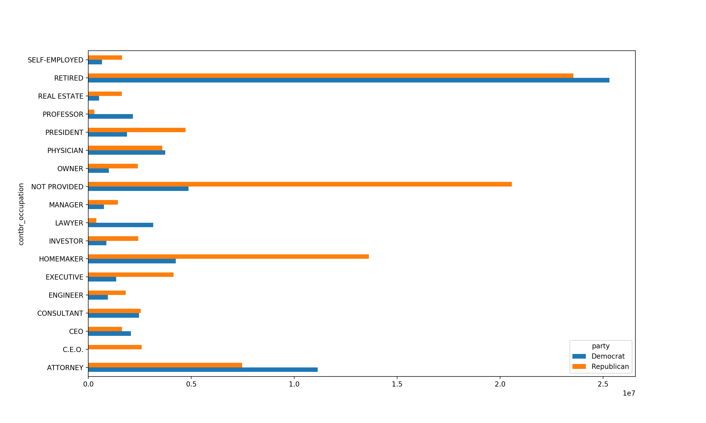
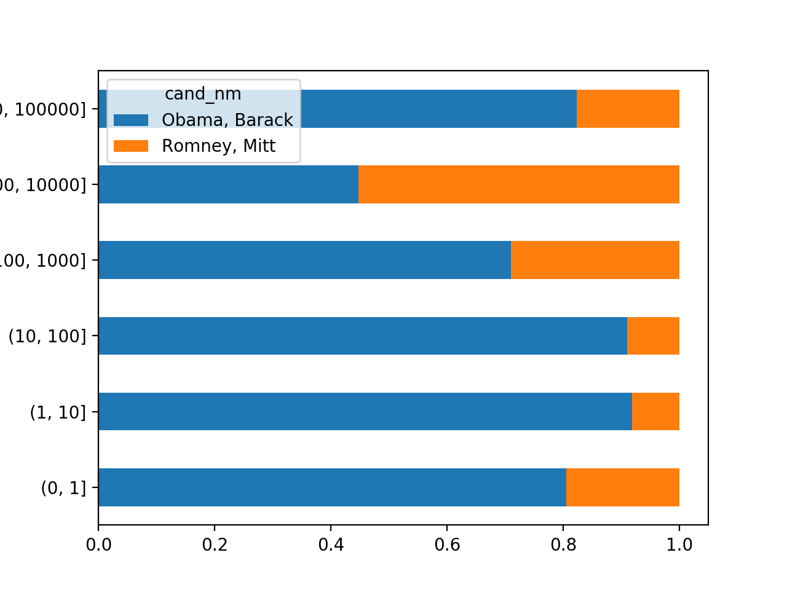

## 用特定与分组的值填充缺失值
>  对于缺失数据的清理工作，有时会用dropna将其滤除，而有时则可能希望用一个固定值或由数据集本身所衍生出来的值去填充NA值，这时就需要使用fillna。

```Python
In [3]: s = Series(np.random.randn(6))

In [4]: s[::2] = np.nan

In [5]: s
Out[5]:
0         NaN
1    1.467329
2         NaN
3    0.066519
4         NaN
5   -0.324448
dtype: float64

In [6]: s.fillna(s.mean()) # 用平均值填充NA值
Out[6]:
0    0.403133
1    1.467329
2    0.403133
3    0.066519
4    0.403133
5   -0.324448
dtype: float64
```
对不同的分组填充不同的值，只需将数据分组，并使用`apply`和一个能够对各数据块调用`fillna`的函数：
```Python
In [7]: states = ['CD', 'CQ','XJ','XM','SH','BJ','NJ','TJ']

In [8]: group_key = ['West']*4 +['East']*4

In [9]: data = Series(np.random.randn(8),index=states)

In [10]: data[['XJ','BJ','TJ']] = np.nan

In [11]: data
Out[11]:
CD    0.438333
CQ    0.156206
XJ         NaN
XM    0.309649
SH   -0.692189
BJ         NaN
NJ    1.812046
TJ         NaN
dtype: float64

In [12]: data.groupby(group_key).mean()
Out[12]:
East    0.559928
West    0.301396
dtype: float64

In [13]: # 用分组平均值去填充NA值

In [14]: fill_mean = lambda g: g.fillna(g.mean())

In [15]: data.groupby(group_key).apply(fill_mean)
Out[15]:
CD    0.438333
CQ    0.156206
XJ    0.301396
XM    0.309649
SH   -0.692189
BJ    0.559928
NJ    1.812046
TJ    0.559928
dtype: float64

In [22]: # 在代码中预定义各组的填充值，可以使用各分组的name属性

In [23]: fill_values={'East':0.5,'West':1}

In [24]: fill_func = lambda g: g.fillna(fill_values[g.name])

In [25]: data.groupby(group_key).apply(fill_func)
Out[25]:
CD    0.438333
CQ    0.156206
XJ    1.000000
XM    0.309649
SH   -0.692189
BJ    0.500000
NJ    1.812046
TJ    0.500000
dtype: float64
```

## 随机采样和排列
> 从一个大数据集中随机抽取样本可以选取np.random.permutation(N)的前K个元素，其中N为完整数据的大小，K为期望的样本大小下面将构造一个扑克牌

```Python
In [37]: # 红桃(Hearts)、黑桃(Spades)、梅花(Clubs)、方片(Diamonds)

In [38]: suits = ['H','S','C','D']

In [39]: card_val = (list(range(1,11))+[10]*3)*4

In [40]: base_names = ['A']+list(range(2,11))+['J','K','Q']

In [41]: cards = []

In [42]: for suit in suits:
    ...:     # 构造卡牌
    ...:     cards.extend(str(num)+ suit for num in base_names)
    ...:

In [43]: deck = Series(card_val,index=cards)

In [44]: deck[:13] # 长度为52的Series，其索引为牌名，值则是用于记分的点数
Out[44]:
AH      1
2H      2
3H      3
4H      4
5H      5
6H      6
7H      7
8H      8
9H      9
10H    10
JH     10
KH     10
QH     10
dtype: int64

In [47]: def draw(deck, n=5):
    ...:     # 从整副牌中抽出5张
    ...:     return deck.take(np.random.permutation(len(deck))[:n])
    ...:

In [48]: draw(deck) # 抽牌
Out[48]:
3H      3
KS     10
9D      9
10S    10
JH     10
dtype: int64

In [53]: # 从每种花色中抽取两张牌。由于花色是最后一个字符，所以根据这个进行分组并使用apply

In [54]: get_suit = lambda card:card[-1] # 只要最后一个字母

In [55]: deck.groupby(get_suit).apply(draw, n=2)
Out[55]:
C  10C    10
   KC     10
D  JD     10
   6D      6
H  6H      6
   3H      3
S  JS     10
   7S      7
dtype: int64

In [56]: # 另一种方法

In [57]: deck.groupby(get_suit, group_keys=False).apply(draw, n=2)
Out[57]:
7C      7
3C      3
10D    10
5D      5
KH     10
8H      8
AS      1
6S      6
dtype: int64
```

## 分组加权平均数和相关系数
> 根据groupby的“拆分-应用-合并”范式，DataFrame的列与列之间或两个Series之间的运算(比如分组加权平均)称为一种标准作业

```Python
In [60]: df = DataFrame({'category':list('aaaabbbb'),
    ...:                 'data':np.random.randn(8),
    ...:                 'weights':np.random.rand(8)})
    ...:

In [61]: df
Out[61]:
  category      data   weights
0        a -0.183911  0.065850
1        a -0.977102  0.897496
2        a  1.632742  0.052966
3        a  1.820148  0.914846
4        b -1.387401  0.256462
5        b  0.858152  0.977665
6        b  1.613297  0.549450
7        b  0.365536  0.472255

In [69]: # 利用catefory计算加权平均数:

In [70]: grouped  = df.groupby('category')

In [71]: get_wavg = lambda g: np.average(g['data'], weights=g['weights'])

In [72]: grouped.apply(get_wavg)
Out[72]:
category
a    0.446664
b    0.683660
dtype: float64
```
来自[Yahoo!Finance的数据集](https://github.com/wesm/pydata-book/blob/2nd-edition/datasets/fec/P00000001-ALL.csv)，其中含有标准普尔500指数(SPX字段)和几只股票的收盘价
```Python
In [75]: # 读取数据

In [76]: close_px = pd.read_csv('stock_px.csv', parse_dates=True, index_col=0)

In [77]: close_px[:4]
Out[77]:
              AA  AAPL    GE    IBM   JNJ  MSFT   PEP     SPX   XOM
1990-02-01  4.98  7.86  2.87  16.79  4.27  0.51  6.04  328.79  6.12
1990-02-02  5.04  8.00  2.87  16.89  4.37  0.51  6.09  330.92  6.24
1990-02-05  5.07  8.18  2.87  17.32  4.34  0.51  6.05  331.85  6.25
1990-02-06  5.01  8.12  2.88  17.56  4.32  0.51  6.15  329.66  6.23

In [78]: # 计算一个由日收益率(通过百分数变化计算)与SPX之间的年度相关系数组成的DataFrame

In [79]: rets = close_px.pct_change().dropna()

In [80]: spx_corr = lambda x: x.corrwith(x['SPX'])

In [81]: by_year = rets.groupby(lambda x: x.year)

In [84]: by_year.apply(spx_corr)[:5]
Out[84]:
            AA      AAPL        GE       IBM       JNJ      MSFT       PEP  \
1990  0.595024  0.545067  0.752187  0.738361  0.801145  0.586691  0.783168
1991  0.453574  0.365315  0.759607  0.557046  0.646401  0.524225  0.641775
1992  0.398180  0.498732  0.632685  0.262232  0.515740  0.492345  0.473871
1993  0.259069  0.238578  0.447257  0.211269  0.451503  0.425377  0.385089
1994  0.428549  0.268420  0.572996  0.385162  0.372962  0.436585  0.450516

      SPX       XOM
1990  1.0  0.517586
1991  1.0  0.569335
1992  1.0  0.318408
1993  1.0  0.318952
1994  1.0  0.395078

In [85]: # 计算列和列之间的相关系数

In [88]: by_year.apply(lambda g: g['AAPL'].corr(g['MSFT']))[:4]  #计算苹果和微软的年度相关系数
Out[88]:
1990    0.408271
1991    0.266807
1992    0.450592
1993    0.236917
dtype: float64
```
## 面向分组的线性回归
> 利用statsmodels库对各数据块执行普通最小二乘法回归:

* 安装statsmodels库
```Python
In [89]: !pip3 install statsmodels
```
* 计算线性回归
```Python
In [90]: import statsmodels.api as sm

In [91]: def regress(data, yvar, xvars):
    ...:     Y = data[yvar]
    ...:     X = data[xvars]
    ...:     X['intercept'] = 1.
    ...:     result = sm.OLS(Y,X).fit()
    ...:     return result.params
    ...:

In [92]: by_year.apply(regress, 'AAPL', ['SPX']) # 按年计算AAPL对SPX收益率的线性回归
Out[92]:
           SPX  intercept
1990  1.512772   0.001395
1991  1.187351   0.000396
1992  1.832427   0.000164
1993  1.390470  -0.002657
1994  1.190277   0.001617
1995  0.858818  -0.001423
1996  0.829389  -0.001791
1997  0.749928  -0.001901
1998  1.164582   0.004075
1999  1.384989   0.003273
2000  1.733802  -0.002523
2001  1.676128   0.003122
2002  1.080330  -0.000199
2003  1.187770   0.000690
2004  1.363463   0.004201
2005  1.766415   0.003246
2006  1.645496   0.000080
2007  1.198761   0.003438
2008  0.968016  -0.001110
2009  0.879103   0.002954
2010  1.052608   0.001261
2011  0.806605   0.001514
```

## 2012联邦选举委员会数据库
```Python
In [105]: # 读取文件

In [106]: fec = pd.read_csv('P00000001-ALL.csv', low_memory=False)

In [107]: #fec.loc[123456]

In [108]: # 读取文件

In [109]: fec = pd.read_csv('P00000001-ALL.csv', low_memory=False)

In [110]: fec.loc[123456] #DataFrame中记录
Out[110]:
cmte_id                             C00431445
cand_id                             P80003338
cand_nm                         Obama, Barack
contbr_nm                         ELLMAN, IRA
contbr_city                             TEMPE
contbr_st                                  AZ
contbr_zip                          852816719
contbr_employer      ARIZONA STATE UNIVERSITY
contbr_occupation                   PROFESSOR
contb_receipt_amt                          50
contb_receipt_dt                    01-DEC-11
receipt_desc                              NaN
memo_cd                                   NaN
memo_text                                 NaN
form_tp                                 SA17A
file_num                               772372
Name: 123456, dtype: object

In [111]: # 数据中没有党派信息，通过unique可以获取全部候选人名单，利用字典说明党派关系

In [112]: unique_cands = fec.cand_nm.unique()

In [113]: unique_cands
Out[113]:
array(['Bachmann, Michelle', 'Romney, Mitt', 'Obama, Barack',
       "Roemer, Charles E. 'Buddy' III", 'Pawlenty, Timothy',
       'Johnson, Gary Earl', 'Paul, Ron', 'Santorum, Rick',
       'Cain, Herman', 'Gingrich, Newt', 'McCotter, Thaddeus G',
       'Huntsman, Jon', 'Perry, Rick'], dtype=object)

In [117]: parties={'Bachmann, Michelle':'Republican',
     ...:         'Romney, Mitt':'Republican',
     ...:         "Roemer, Charles E. 'Buddy' III":'Republican',
     ...:         'Pawlenty, Timothy':'Republican',
     ...:         'Johnson, Gary Earl':'Republican',
     ...:         'Paul, Ron':'Republican',
     ...:         'Santorum, Rick':'Republican',
     ...:         'Cain, Herman':'Republican',
     ...:         'Gingrich, Newt':'Republican',
     ...:         'McCotter, Thaddeus G':'Republican',
     ...:         'Huntsman, Jon':'Republican',
     ...:         'Obama, Barack':'Democrat',
     ...:         'Perry, Rick':'Republican'}
     ...:

In [118]: # 通过这个映射以及Series对象的map方法可以根据候选人姓名得到一组党派信息

In [119]: fec.cand_nm[123456:123461]
Out[119]:
123456    Obama, Barack
123457    Obama, Barack
123458    Obama, Barack
123459    Obama, Barack
123460    Obama, Barack
Name: cand_nm, dtype: object

In [120]: fec.cand_nm[123456:123461].map(parties)
Out[120]:
123456    Democrat
123457    Democrat
123458    Democrat
123459    Democrat
123460    Democrat
Name: cand_nm, dtype: object

In [121]: # 将其添加为一个新列

In [122]: fec['party'] = fec.cand_nm.map(parties)

In [123]: # 限定该数据集只有正的出资额

In [124]: fec = fec[fec.contb_receipt_amt>0]

In [125]: # 由于Barack Obama和Mitt Romney是最主要的两名候选人，所以准备一个只包含针对两人的竞选活动的赞助信息的子集

In [126]: fec_mrbo = fec[fec.cand_nm.isin(['Obama, Barack','Romney, Mitt'])]
```
### 根据职业和雇主统计赞助信息
```Python
In [127]: #根据职业计算出资总额

In [128]: fec.contbr_occupation.value_counts()[:10]
Out[128]:
RETIRED                                   233990
INFORMATION REQUESTED                      35107
ATTORNEY                                   34286
HOMEMAKER                                  29931
PHYSICIAN                                  23432
INFORMATION REQUESTED PER BEST EFFORTS     21138
ENGINEER                                   14334
TEACHER                                    13990
CONSULTANT                                 13273
PROFESSOR                                  12555
Name: contbr_occupation, dtype: int64

In [129]: # 许多职业都涉及相同的基本工作类型，或者同一样东西有多重辩题。下面通过将一个职业信息映射到另一个来清理这样的数据

In [130]: occ_mapping ={
     ...:     'INFORMATION REQUESTED PER BEST EFFORTS':'NOT PROVIDED',
     ...:     'INFORMATION REQUESTED':'NOT PROVIDED',
     ...:     'INFORMATION REQUESTED (BEST EFFORTS)':'NOT PROVIDED',
     ...:     'C.E.O':'CEO'}
     ...:

In [131]: # 使用dict.get允许没有映射关系的职业也能通过，如果没有映射关系则返回x

In [132]: f = lambda x: occ_mapping.get(x,x)

In [133]: fec.contbr_occupation = fec.contbr_occupation.map(f)

In [134]: # 对雇主也进行相同的处理

In [135]: emp_mapping = {
     ...:     'INFORMATION REQUESTED PER BEST EFFORTS':'NOT PROVIDED',
     ...:     'INFORMATION REQUESTED':'NOT PROVIDED',
     ...:     'SELF':'SELF-EMPLOYED',
     ...:     'SELF EMPLOYED':'SELF-EMPLOYED',}
     ...:

In [136]: f = lambda x : emp_mapping.get(x,x)

In [137]: fec.contbr_employer = fec.contbr_employer.map(f)
In [138]: # 通过pivot_table根据党派和职业对数据进行聚合，然后过滤掉总出资额不足200万美元的数据

In [139]:  by_occupation = fec.pivot_table('contb_receipt_amt', index='contbr_occupation',columns='party',aggfunc='sum')

In [140]: over_2mm = by_occupation[by_occupation.sum(1)>2000000]

In [141]: over_2mm
Out[141]:
party                 Democrat    Republican
contbr_occupation
ATTORNEY           11141982.97  7.477194e+06
C.E.O.                 1690.00  2.592983e+06
CEO                 2074284.79  1.640758e+06
CONSULTANT          2459912.71  2.544725e+06
ENGINEER             951525.55  1.818374e+06
EXECUTIVE           1355161.05  4.138850e+06
HOMEMAKER           4248875.80  1.363428e+07
INVESTOR             884133.00  2.431769e+06
LAWYER              3160478.87  3.912243e+05
MANAGER              762883.22  1.444532e+06
NOT PROVIDED        4866973.96  2.056547e+07
OWNER               1001567.36  2.408287e+06
PHYSICIAN           3735124.94  3.594320e+06
PRESIDENT           1878509.95  4.720924e+06
PROFESSOR           2165071.08  2.967027e+05
REAL ESTATE          528902.09  1.625902e+06
RETIRED            25305116.38  2.356124e+07
SELF-EMPLOYED        672393.40  1.640253e+06
```
* 出资总额大于两百万美元


```Python
In [159]: # 对Obama和Romney总出资最高的职业和企业

In [160]: #先对候选人进行分组

In [161]: def get_top_amounts(group, key, n=5):
     ...:     # 求最大值
     ...:     totals = group.groupby(key)['contb_receipt_amt'].sum()
     ...:     # 根据key对totals进行降序排列
     ...:     return totals.sort_values(ascending=False)[n:]
     ...:

In [162]: # 根据职业和雇主进行聚合

In [163]: grouped  = fec_mrbo.groupby('cand_nm')

In [164]: grouped.apply(get_top_amounts, 'contbr_occupation',n=7)
Out[164]:
cand_nm        contbr_occupation
Obama, Barack  PROFESSOR                                 2165071.08
               CEO                                       2073284.79
               PRESIDENT                                 1878509.95
               NOT EMPLOYED                              1709188.20
               EXECUTIVE                                 1355161.05
               TEACHER                                   1250969.15
               WRITER                                    1084188.88
               OWNER                                     1001567.36
               ENGINEER                                   951525.55
               INVESTOR                                   884133.00
               ARTIST                                     763125.00
               MANAGER                                    762883.22
               SELF-EMPLOYED                              672393.40
               STUDENT                                    628099.75
               REAL ESTATE                                528902.09
               CHAIRMAN                                   496547.00
               ARCHITECT                                  483859.89
               DIRECTOR                                   471741.73
               BUSINESS OWNER                             449979.30
               EDUCATOR                                   436600.89
               PSYCHOLOGIST                               427299.92
               SOFTWARE ENGINEER                          396985.65
               PARTNER                                    395759.50
               SALES                                      392886.91
               EXECUTIVE DIRECTOR                         348180.94
               MANAGING DIRECTOR                          329688.25
               SOCIAL WORKER                              326844.43
               VICE PRESIDENT                             325647.15
               ADMINISTRATOR                              323079.26
               SCIENTIST                                  319227.88
                                                            ...
Romney, Mitt   NON-PROFIT VETERANS ORG. CHAIR/ANNUITA         10.00
               PARAPLANNER                                    10.00
               APPRAISAL                                      10.00
               SIGN CONTRACTOR                                10.00
               POLITICAL OPERATIVE                            10.00
               PORT MGT                                       10.00
               PRESIDENT EMERITUS                             10.00
               CONTRACTS SPECIALIST                            9.00
               TEACHER & FREE-LANCE JOURNALIST                 9.00
               FOUNDATION CONSULTANT                           6.00
               MAIL HANDLER                                    6.00
               TREASURER & DIRECTOR OF FINANCE                 6.00
               SECRETARY/BOOKKEPPER                            6.00
               ELAYNE WELLS HARMER                             6.00
               CHICKEN GRADER                                  5.00
               DIRECTOR REISCHAUER CENTER FOR EAST A           5.00
               SCOTT GREENBAUM                                 5.00
               EDUCATION ADMIN                                 5.00
               ENGINEER/RISK EXPERT                            5.00
               PLANNING AND OPERATIONS ANALYST                 5.00
               VILLA NOVA                                      5.00
               FINANCIAL INSTITUTION - CEO                     5.00
               HORTICULTURIST                                  5.00
               MD - UROLOGIST                                  5.00
               DISTRICT REPRESENTATIVE                         5.00
               INDEPENDENT PROFESSIONAL                        3.00
               REMODELER & SEMI RETIRED                        3.00
               AFFORDABLE REAL ESTATE DEVELOPER                3.00
               IFC CONTRACTING SOLUTIONS                       3.00
               3RD GENERATION FAMILY BUSINESS OWNER            3.00
Name: contb_receipt_amt, Length: 35975, dtype: float64
```

### 对出资额分组
```Python
In [165]: # 利用cut函数根据出资额的大小将数据离散到多个面元中

In [166]: bins = np.array([0,1,10,100,1000,10000,100000,1000000,10000000])

In [167]: labels = pd.cut(fec_mrbo.contb_receipt_amt,bins)

In [168]: labels
Out[168]:
411           (10, 100]
412         (100, 1000]
413         (100, 1000]
414           (10, 100]
415           (10, 100]
416           (10, 100]
417         (100, 1000]
418           (10, 100]
419         (100, 1000]
420           (10, 100]
421           (10, 100]
422         (100, 1000]
423         (100, 1000]
424         (100, 1000]
425         (100, 1000]
426         (100, 1000]
427       (1000, 10000]
428         (100, 1000]
429         (100, 1000]
430           (10, 100]
431       (1000, 10000]
432         (100, 1000]
433         (100, 1000]
434         (100, 1000]
435         (100, 1000]
436         (100, 1000]
437           (10, 100]
438         (100, 1000]
439         (100, 1000]
440           (10, 100]
              ...
701356        (10, 100]
701357          (1, 10]
701358        (10, 100]
701359        (10, 100]
701360        (10, 100]
701361        (10, 100]
701362      (100, 1000]
701363        (10, 100]
701364        (10, 100]
701365        (10, 100]
701366        (10, 100]
701367        (10, 100]
701368      (100, 1000]
701369        (10, 100]
701370        (10, 100]
701371        (10, 100]
701372        (10, 100]
701373        (10, 100]
701374        (10, 100]
701375        (10, 100]
701376    (1000, 10000]
701377        (10, 100]
701378        (10, 100]
701379      (100, 1000]
701380    (1000, 10000]
701381        (10, 100]
701382      (100, 1000]
701383          (1, 10]
701384        (10, 100]
701385      (100, 1000]
Name: contb_receipt_amt, Length: 694282, dtype: category
Categories (8, interval[int64]): [(0, 1] < (1, 10] < (10, 100] < (100, 1000] < (1000, 10000] <
                                  (10000, 100000] < (100000, 1000000] < (1000000, 10000000]]

n [171]: # 根据候选人姓名以及面元标签对数据进行分组

In [172]: grouped = fec_mrbo.groupby(['cand_nm',labels])

In [173]: grouped.size().unstack(0)
Out[173]:
cand_nm              Obama, Barack  Romney, Mitt
contb_receipt_amt
(0, 1]                       493.0          77.0
(1, 10]                    40070.0        3681.0
(10, 100]                 372280.0       31853.0
(100, 1000]               153991.0       43357.0
(1000, 10000]              22284.0       26186.0
(10000, 100000]                2.0           1.0
(100000, 1000000]              3.0           NaN
(1000000, 10000000]            4.0           NaN
```
* 两位候选人收到的各种捐赠总额比例


### 根据州统计赞助信息
```Python
n [181]: # 根据候选人和州对数据进行聚合

In [182]: grouped = fec_mrbo.groupby(['cand_nm','contbr_st'])

In [183]: totals = grouped.contb_receipt_amt.sum().unstack(0).fillna(0)

In [184]: totals = totals[totals.sum(1)>100000]

In [185]: totals[:10]
Out[185]:
cand_nm    Obama, Barack  Romney, Mitt
contbr_st
AK             281840.15      86204.24
AL             543123.48     527303.51
AR             359247.28     105556.00
AZ            1506476.98    1888436.23
CA           23824984.24   11237636.60
CO            2132429.49    1506714.12
CT            2068291.26    3499475.45
DC            4373538.80    1025137.50
DE             336669.14      82712.00
FL            7318178.58    8338458.81

In [186]: # 对各行除以总赞助额会得到各候选人在各州的总赞助额比例

In [187]: percent = totals.div(totals.sum(1),axis=0)

In [188]: percent[:10]
Out[188]:
cand_nm    Obama, Barack  Romney, Mitt
contbr_st
AK              0.765778      0.234222
AL              0.507390      0.492610
AR              0.772902      0.227098
AZ              0.443745      0.556255
CA              0.679498      0.320502
CO              0.585970      0.414030
CT              0.371476      0.628524
DC              0.810113      0.189887
DE              0.802776      0.197224
FL              0.467417      0.532583
```
