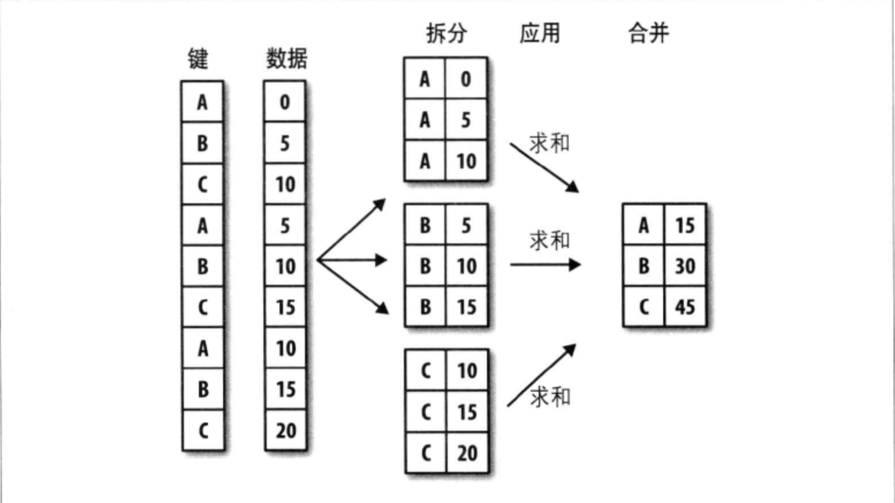

Python和pandas可以利用任何合一接受pandas对象或NumPy数组的函数执行复杂的分组运算：
1. 根据一个或多个键(可以是函数、数组或DataFrame列名)拆分pandas对象
2. 计算分组摘要统计，如计数、平均数、标准差或用户自定义函数
3. 对DataFrame的列应用各种各样的函数
4. 应用组内转换或其他运算，如规格化、线性回归、排名或选取子集等
5. 计算透视表或交叉表
6. 执行分位数分析以及其他分组分析

## GroupBy技术
pandas对象(无论是Series、DataFrane还是其他)中的数据会根据提供的一个或多个键被拆分(split)为多组。拆分操作是在对象的特定轴上执行。然后将一个函数应用(apply)到各个分组并产生一个新值。最后这些函数的执行结果会被合并(combine)到最终结果中。结果对象的形式一般取决于数据上所执行的操作。
* split-apply-combine(分组聚合)


分组键可以有多种形式，且类型不必相同(后三种只是快捷方式其最终目的是产生一组用于拆分对象的值)：
1. 列表或数组，其长度和待分组轴一样
2. 表示DataFrame某个列名的值
3. 字典或Series，给出待分组轴上的值或分组名之间的对应关系
4. 函数、用于处理轴索引或索引中的各个标签

```Python
In [4]: df = DataFrame({'key1':list('aabba'),
   ...:                 'key2':['one','two','one','two','one'],
   ...:                 'data1':np.random.randn(5),
   ...:                 'data2':np.random.randn(5)})
   ...:

In [5]: df
Out[5]:
      data1     data2 key1 key2
0 -0.007051  1.406114    a  one
1  1.136247  1.320876    a  two
2  0.285600 -2.665997    b  one
3  1.578314  0.772522    b  two
4  0.263382 -0.067916    a  one

In [6]: #按key1进行分组，并计算data1的平均值

In [7]: #访问data1，并根据key1调用groupby

In [8]: grouped = df['data1'].groupby(df['key1'])

In [9]: grouped #变量grouped是一个GroupBy对象。它没有进行任何计算，该对象已经有了接下来对分组执行运算所需的一切信息
Out[9]: <pandas.core.groupby.SeriesGroupBy object at 0x11292e4e0>

In [10]: #调用GroupBy的mean方法计算分组平均值

In [11]: grouped.mean()#数据(Series)根据分组键进行了聚合，产生新的一个Series，其索引为key1列中的唯一值
Out[11]:
key1
a    0.464193
b    0.931957
Name: data1, dtype: float64

In [12]: # 传入多个数组

In [15]: means = df['data1'].groupby([df['key1'],df['key2']]).mean()#通过两个键对数据进行了分组，得到一个Series具有层次化索引(由唯一的建对组成)

In [16]: means
Out[16]:
key1  key2
a     one     0.128166
      two     1.136247
b     one     0.285600
      two     1.578314
Name: data1, dtype: float64

In [17]: means.unstack()
Out[17]:
key2       one       two
key1
a     0.128166  1.136247
b     0.285600  1.578314
```

以上分组键均为Series，2⃣️分组键可以是任何 **长度适当** 的数组，也可以将列名(可以是字符串、数字或其他Python对象)用作分组键:
```Python
In [18]: states=np.array(['Ohio','California','California','Ohio','Ohio'])

In [19]: years = np.array([2005,2005,2006,2005,2006])

In [20]: df['data1'].groupby([states,years]).mean()#分组键为适当长度的数组
Out[20]:
California  2005    1.136247
            2006    0.285600
Ohio        2005    0.785631
            2006    0.263382
Name: data1, dtype: float64


In [21]: # 分组键为列名

In [22]: df.groupby('key1').mean()
Out[22]:
         data1     data2
key1
a     0.464193  0.886358
b     0.931957 -0.946738

In [23]: # 结果中没有key2列是因为这一列不是数值数据，会从结果中排除。默认情况所有数值列都会被聚合

In [24]: df.groupby(['key1','key2']).mean()
Out[24]:
              data1     data2
key1 key2
a    one   0.128166  0.669099
     two   1.136247  1.320876
b    one   0.285600 -2.665997
     two   1.578314  0.772522
```

### 对分组进行迭代
GroupBy对象支持迭代，可以产生一组二元元组(由分组名和数据块组成):
```Python
In [26]: for name, group in df.groupby('key1'):
    ...:     print('分组名',name)
    ...:     print('数据块\n',group)
    ...:
分组名 a
数据块
       data1     data2 key1 key2
0 -0.007051  1.406114    a  one
1  1.136247  1.320876    a  two
4  0.263382 -0.067916    a  one
分组名 b
数据块
       data1     data2 key1 key2
2  0.285600 -2.665997    b  one
3  1.578314  0.772522    b  two
```
对于多重键的情况，元组的第一个元素将会是由键值组成的元组：
```Python
In [28]: for (k1,k2), group in df.groupby(['key1','key2']):
    ...:     print(k1,k2)
    ...:     print(group)
    ...:
a one
      data1     data2 key1 key2
0 -0.007051  1.406114    a  one
4  0.263382 -0.067916    a  one
a two
      data1     data2 key1 key2
1  1.136247  1.320876    a  two
b one
    data1     data2 key1 key2
2  0.2856 -2.665997    b  one
b two
      data1     data2 key1 key2
3  1.578314  0.772522    b  two

In [33]: # 将数据片段转化成一个字典

In [34]: pieces = dict(list(df.groupby('key1')))

In [35]: pieces['a']
Out[35]:
      data1     data2 key1 key2
0 -0.007051  1.406114    a  one
1  1.136247  1.320876    a  two
4  0.263382 -0.067916    a  one

In [36]: pieces
Out[36]:
{'a':       data1     data2 key1 key2
 0 -0.007051  1.406114    a  one
 1  1.136247  1.320876    a  two
 4  0.263382 -0.067916    a  one, 'b':       data1     data2 key1 key2
 2  0.285600 -2.665997    b  one
 3  1.578314  0.772522    b  two}
```

`groupby`默认是在`axis=0`(DataFrame行)上进行分组，通过设置可以在其他任何轴上进行分组：
```Python
In [42]: # 通过dtype对列进行分组

In [43]: grouped = df.groupby(df.dtypes, axis=1)

In [44]: dict(list(grouped))
Out[44]:
{dtype('float64'):       data1     data2
 0 -0.007051  1.406114
 1  1.136247  1.320876
 2  0.285600 -2.665997
 3  1.578314  0.772522
 4  0.263382 -0.067916, dtype('O'):   key1 key2
 0    a  one
 1    a  two
 2    b  one
 3    b  two
 4    a  one}
```

### 选取一个或一组列
对于由DataFrame产生的GroupBy对象，如果用一个(单个字符串)或一组(字符串数组)列名对其进行索引，就能实现选取部分列进行聚合的目的：`df.groupby('key1')['data1']`相当于`df['data1'].groupby('key1')`；`df.groupby('key1')[['data2']]`相当于`df[['data2']].groupby(df['key1'])`。对于大数据集很可能只需要对部分列进行聚合，这种索引操作返回的对象是一个DataFrame(如果传入的是列表或数组)或已分组的Series(如果传入的是标量形式的单个列名):
```Python
In [46]: # 计算data2列的平均值并以DataFrame形式得到结果

In [47]: df.groupby(['key1','key2'])[['data2']].mean()
Out[47]:
              data2
key1 key2
a    one   0.669099
     two   1.320876
b    one  -2.665997
     two   0.772522

In [48]: s_grouped= df.groupby(['key1','key2'])['data2']

In [49]: s_grouped
Out[49]: <pandas.core.groupby.SeriesGroupBy object at 0x1119a86a0>

In [50]: s_grouped.mean()
Out[50]:
key1  key2
a     one     0.669099
      two     1.320876
b     one    -2.665997
      two     0.772522
Name: data2, dtype: float64
```

### 通过字典或Series进行分组
除了数组以外，分组信息可以是 **字典**和 **Series**。Series会被看成一个固定大小的映射，如果用Series作为分组键，则pandas会检查Series以确保其索引跟分组轴对齐：
```Python
In [55]: people = DataFrame(np.random.randn(5,5),
    ...:                    columns=list('abcde'),
    ...:                    index=['tom','john','jim','lancy','lucy'])
    ...:

In [56]: people.loc[2:3,['b','c']] = np.nan

In [57]: people
Out[57]:
              a         b         c         d         e
tom    1.522909 -1.357885 -0.262730  0.180761 -1.662128
john   0.941963 -0.330136  0.520398 -0.069789  0.856472
jim   -0.077905       NaN       NaN  0.527588 -0.162906
lancy -0.141172  0.699214 -0.602441 -2.306901 -0.228982
lucy  -1.345708  0.931025  0.615641 -0.733455  1.321982

In [58]: # 字典作为分组键

In [59]: mapping = {'a':'red', 'b':'red', 'c':'blue',
    ...:            'd':'blue', 'e':'red', 'f':'orange'}
    ...:

In [60]: by_column = people.groupby(mapping, axis=1)

In [61]: by_column.sum()
Out[61]:
           blue       red
tom   -0.081968 -1.497105
john   0.450609  1.468299
jim    0.527588 -0.240812
lancy -2.909342  0.329059
lucy  -0.117814  0.907299

In [64]: # Series用作分组键

In [65]: map_series = Series(mapping)

In [66]: people.groupby(map_series, axis=1).count()
Out[66]:
       blue  red
tom       2    3
john      2    3
jim       1    2
lancy     2    3
lucy      2    3
```

### 通过函数进行分组
任何作为分组键的函数都会在各个索引值上被调用一次，其返回值就会被用作分类名称；同时将函数跟数组、列表、字典、Series混用也可以，因为任何东西都会被转换为数组：
```Python
In [67]: # 根据人名的长度进行分组，可以仅仅传入一个len函数

In [68]: people.groupby(len).sum()
Out[68]:
          a         b         c         d         e
3  1.445004 -1.357885 -0.262730  0.708349 -1.825035
4 -0.403745  0.600890  1.136039 -0.803243  2.178454
5 -0.141172  0.699214 -0.602441 -2.306901 -0.228982

In [72]: # 将函数、列表和数组混用

In [73]: key_list =['one','one','one','two','two']

In [74]: people.groupby([len,key_list]).min()
Out[74]:
              a         b         c         d         e
3 one -0.077905 -1.357885 -0.262730  0.180761 -1.662128
4 one  0.941963 -0.330136  0.520398 -0.069789  0.856472
  two -1.345708  0.931025  0.615641 -0.733455  1.321982
5 two -0.141172  0.699214 -0.602441 -2.306901 -0.228982
```

### 根据索引级别分组
通过`level`关键字传入级别编号或名称来根据索引级别聚合层次化索引数据集:
```Python
In [77]: columns = pd.MultiIndex.from_arrays([['US','US','US','CH','CH'],[1,3,5,1,3]],names=['cty','tenor'])

In [78]: hier_df = DataFrame(np.random.randn(4,5), columns=columns)

In [79]: hier_df
Out[79]:
cty          US                            CH
tenor         1         3         5         1         3
0     -1.544928  0.860951 -1.021428  0.150361  0.863332
1      1.500901  0.411124  0.717717 -1.186560 -0.341670
2      1.728200  0.507285 -0.974570  0.856083  0.606669
3      0.356776  0.399169 -0.254092  0.274927  0.169848

In [80]: hier_df.groupby(level='cty',axis=1).count()
Out[80]:
cty  CH  US
0     2   3
1     2   3
2     2   3
3     2   3
```

## 数据聚合
聚合指任何能够从数组产生标量值的数据转换过程，许多常见的聚合运算都有就地计算数据集统计信息的优化实现，也可以自己定义聚合运算，还可以调用分组对象上已经定义好的任何方法。
* 经过优化的groupby方法

|   函数名    |             说明            |
| :---------: | :-------------------------: |
|    count    |      分组中非NA值的数量     |
|     sum     |          非NA值的和         |
|     mean    |        非NA值的平均数       |
|    median   |      非NA值的算术中位数     |
|  std、var   | 无偏(分母为n-1)标准差和方差 |
|  min、max   |    非NA值的最小值和最大值   |
|     prod    |          非NA值的积         |
| first、last |    第一个和最后一个非NA值   |
```Python
In [6]: df
Out[6]:
      data1     data2 key1 key2
0  0.303363 -1.985931    a  one
1 -1.510949  0.351845    a  two
2  1.665133 -0.527562    b  one
3  0.851907 -0.377448    b  two
4  0.141499  0.969610    a  one

In [7]: grouped = df.groupby('key1')

In [8]: # 使用quantile计算Series或DataFrame列的样本分位数

In [9]: grouped['data1'].quantile(0.9)
Out[9]:
key1
a    0.27099
b    1.58381
Name: data1, dtype: float64
```
`quantile`是一个Series方法。GroupBy会高效地对Series进行切片，然后对各片调用`quantile(0.9)`.
要使用自己写的聚集函数，需要将其传入`aggregate`或`agg`方法：
```Python
In [45]: def get_to_peak(arr):
    ...:     return arr.max()-arr.min()
    ...:

In [46]: grouped.agg(get_to_peak)
Out[46]:
         data1     data2
key1
a     1.814312  2.955541
b     0.813225  0.150115
```
并非严格的聚合运算(如`describe`)也可以在这里使用：
```Python
In [47]: grouped.describe()
Out[47]:
     data1                                                              \
     count      mean       std       min       25%       50%       75%
key1
a      3.0 -0.355362  1.004035 -1.510949 -0.684725  0.141499  0.222431
b      2.0  1.258520  0.575037  0.851907  1.055214  1.258520  1.461827

               data2                                                    \
           max count      mean       std       min       25%       50%
key1
a     0.303363   3.0 -0.221492  1.558956 -1.985931 -0.817043  0.351845
b     1.665133   2.0 -0.452505  0.106147 -0.527562 -0.490034 -0.452505


           75%       max
key1
a     0.660727  0.969610
b    -0.414976 -0.377448
```

### 面向列的多函数应用
对Series或DataFrame列的聚合运算其实是使用`aggregate`(使用自定义函数)或调用诸如`mean`、`std`之类的方法。如果希望对不同的列使用不同的聚合函数，活一次应用多个函数可以将函数名以 **字符串** 的形式传入；如果传入 **一组** 函数或函数名，得到的DataFrame的列就会以相应的函数命名；如果传入(name，function)元组组成的列表，则元组的第一个元素就会被用作DataFrame的列名(二元元组列表可以看成一个有序映射)；对于DataFrame可以定义一组应用于全部列的函数或不同的列应用不同的函，而结果DataFrame拥有层次化的列，相当于分别对各列进行聚合然后用`concat`将结果组装到一起，这里也可以传入带有自定义名称的元组列表；如果要对不同的列应用不同的函数，向`agg`传入一个从列名映射到函数的字典；只有将多个函数应用到至少一列事，DataFrame才会拥有层次化的列，使用[小费数据集](https://github.com/coldJune/Python/blob/master/ipython/stock_px.csv):
```Python
In [5]: # 准备数据集

In [6]: tips = pd.read_csv('tips.csv')

In [7]: # 添加"小费占总额百分比"的列

In [8]: tips['tip_pct'] = tips['tip']/tips['total_bill']

In [9]: tips[:3]
Out[9]:
   total_bill   tip smoker  day    time  size   tip_pct
0       16.99  1.01     No  Sun  Dinner     2  0.059447
1       10.34  1.66     No  Sun  Dinner     3  0.160542
2       21.01  3.50     No  Sun  Dinner     3  0.166587

In [20]: grouped  = tips.groupby(['smoker','time']) # 根据smoker和time对tips进行分组

In [21]: grouped_pct = grouped['tip_pct']

In [22]: grouped_pct.agg('mean') #将函数名以字符串的形式传入
Out[22]:
smoker  time
No      Dinner    0.158653
        Lunch     0.160920
Yes     Dinner    0.160828
        Lunch     0.170404
Name: tip_pct, dtype: float64

In [23]: def peak_to_peak(arr):
    ...:     # 自定义方法
    ...:     return arr.max() - arr.min()
    ...:

In [24]: grouped_pct.agg(['mean','std', peak_to_peak]) # 传入一组函数或函数名，得到的DataFrame的列名为对应的函数名
Out[24]:
                   mean       std  peak_to_peak
smoker time
No     Dinner  0.158653  0.040458      0.235193
       Lunch   0.160920  0.038989      0.193350
Yes    Dinner  0.160828  0.095153      0.674707
       Lunch   0.170404  0.042770      0.169300

       In [26]: grouped_pct.agg([('foo','mean'),('bar',np.std)]) #传入一个由(name,function)组成的二元元组列表
       Out[26]:
                           foo       bar
       smoker time
       No     Dinner  0.158653  0.040458
              Lunch   0.160920  0.038989
       Yes    Dinner  0.160828  0.095153
              Lunch   0.170404  0.042770

In [27]: # 定义一组用于全部列的函数

In [28]: functions = ['count','mean','max']

In [29]: result = grouped['tip_pct','total_bill'].agg(functions)

In [30]: result
Out[30]:
              tip_pct                     total_bill
                count      mean       max      count       mean    max
smoker time
No     Dinner     106  0.158653  0.291990        106  20.095660  48.33
       Lunch       45  0.160920  0.266312         45  17.050889  41.19
Yes    Dinner      70  0.160828  0.710345         70  21.859429  50.81
       Lunch       23  0.170404  0.259314         23  17.399130  43.11

In [31]: # 结果DataFrame拥有层次化的列，相当于分别对各列进行聚合，然后用concat将结果组装到一起(列名用作keys参数)

In [32]: result['tip_pct']
Out[32]:
               count      mean       max
smoker time
No     Dinner    106  0.158653  0.291990
       Lunch      45  0.160920  0.266312
Yes    Dinner     70  0.160828  0.710345
       Lunch      23  0.170404  0.259314

In [33]: # 传入自定义名称的元组列表

In [34]: ftuples = [('Durchschnit','mean'),('Abweichung',np.var)]

In [35]: grouped['tip_pct','total_bill'].agg(ftuples)
Out[35]:
                  tip_pct             total_bill
              Durchschnit Abweichung Durchschnit  Abweichung
smoker time
No     Dinner    0.158653   0.001637   20.095660   69.604821
       Lunch     0.160920   0.001520   17.050889   59.587154
Yes    Dinner    0.160828   0.009054   21.859429  104.148753
       Lunch     0.170404   0.001829   17.399130   61.958436

In [36]: # 对不同的列应用不同的函数，向agg传入一个从列名映射到函数的字典

In [37]: grouped.agg({'tip':np.max,'size':'sum'})
Out[37]:
                tip  size
smoker time
No     Dinner   9.0   290
       Lunch    6.7   113
Yes    Dinner  10.0   173
       Lunch    5.0    51

In [38]: grouped.agg({'tip_pct':['min','max','mean','std'],'size':'sum'})
Out[38]:
                tip_pct                               size
                    min       max      mean       std  sum
smoker time
No     Dinner  0.056797  0.291990  0.158653  0.040458  290
       Lunch   0.072961  0.266312  0.160920  0.038989  113
Yes    Dinner  0.035638  0.710345  0.160828  0.095153  173
       Lunch   0.090014  0.259314  0.170404  0.042770   51
```
### 以"无索引"的形式返回聚合数据
可以通过向groupby传入`as_index=False`以禁用生成唯一分组键组成的索引(层次化索引):
```Python
In [39]: tips.groupby(['smoker','time'], as_index=False).mean()
Out[39]:
  smoker    time  total_bill       tip      size   tip_pct
0     No  Dinner   20.095660  3.126887  2.735849  0.158653
1     No   Lunch   17.050889  2.673778  2.511111  0.160920
2    Yes  Dinner   21.859429  3.066000  2.471429  0.160828
3    Yes   Lunch   17.399130  2.834348  2.217391  0.170404
```

## 分组级运算和转换
聚合是分组运算的其中一种，它是数据转换的一个特例，它接受能够将一维数组简化为标量值的函数
```Python
In [43]: #使用县聚合再合并的方式为一个DataFrame添加一个用于存放各索引分组平均值的列

In [44]: df
Out[44]:
      data1     data2 key1 key2
0  0.568585 -0.865028    a  one
1  0.191774  0.063184    a  two
2  1.877514 -0.445805    b  one
3  0.834648 -0.260108    b  two
4 -0.250249 -1.472969    a  one

In [45]: k1_means = df.groupby('key1').mean().add_prefix('mean_')# 利用np.mean函数对两个数据列进行转换

In [46]: k1_means
Out[46]:
      mean_data1  mean_data2
key1
a       0.170037   -0.758271
b       1.356081   -0.352957

In [47]: pd.merge(df,k1_means, left_on='key1', right_index=True)
Out[47]:
      data1     data2 key1 key2  mean_data1  mean_data2
0  0.568585 -0.865028    a  one    0.170037   -0.758271
1  0.191774  0.063184    a  two    0.170037   -0.758271
4 -0.250249 -1.472969    a  one    0.170037   -0.758271
2  1.877514 -0.445805    b  one    1.356081   -0.352957
3  0.834648 -0.260108    b  two    1.356081   -0.352957
```

### transform
`transform`会将一个函数应用到各个分组，然后将结果放置到适当的位置上。如果各分组产生的是一个标量值，则该值就会被广播出去；`transform`和`aggregate`一样也是一个有着严格条件的特殊函数：传入的函数只能产生两种结果，要么产生一个可以广播的标量值，要么产生一个相同大小的结果数组：
```Python
In [49]: key=['one','two','one','two','one']

In [50]: people.groupby(key).mean()
Out[50]:
            a         b         c         d         e
one -0.761405  0.060654  0.157032 -0.791220  0.330372
two -0.253093  0.201181  0.138541  0.459374  0.860159

In [51]: people.groupby(key).transform(np.mean)
Out[51]:
              a         b         c         d         e
tom   -0.761405  0.060654  0.157032 -0.791220  0.330372
john  -0.253093  0.201181  0.138541  0.459374  0.860159
jim   -0.761405  0.060654  0.157032 -0.791220  0.330372
lancy -0.253093  0.201181  0.138541  0.459374  0.860159
lucy  -0.761405  0.060654  0.157032 -0.791220  0.330372
```
从各组中减去平均值：
```Python
In [52]: def demean(arr):
    ...:     # 创建一个距平化函数
    ...:     return arr - arr.mean()
    ...:

In [53]: dameaned = people.groupby(key).transform(demean)

In [54]: dameaned
Out[54]:
              a         b         c         d         e
tom   -0.529944  0.771323 -1.053227  0.098752 -0.720876
john   1.022316  0.626768 -0.418873 -0.901180 -0.117146
jim    0.626749  0.642272 -0.110584  0.192733 -0.023483
lancy -1.022316 -0.626768  0.418873  0.901180  0.117146
lucy  -0.096805 -1.413596  1.163811 -0.291486  0.744359

In [55]: dameaned.groupby(key).mean() #检查现在分组的平均值是否为0
Out[55]:
                a    b    c             d             e
one -7.401487e-17  0.0  0.0  3.700743e-17 -3.700743e-17
two  0.000000e+00  0.0  0.0  0.000000e+00 -5.551115e-17
```
### apply:一般性的"拆分-应用-合并"
`apply`会将待处理的对象拆分成多个片段，然后对各片段调用传入的函数，最后尝试将各片段组合到一起；如果传给apply的函数能够接受其他参数或关键字，可以将这些内容放在函数名后面一并传入:
```Python
In [58]: def top(df, n=5, column='tip_pct'):
    ...:     # 在指定列找出最大值，然后把这个值所在的行选取出来
    ...:     return df.sort_values(by=column)[-n:]
    ...:

In [59]: top(tips, n=3)
Out[59]:
     total_bill   tip smoker  day    time  size   tip_pct
67         3.07  1.00    Yes  Sat  Dinner     1  0.325733
178        9.60  4.00    Yes  Sun  Dinner     2  0.416667
172        7.25  5.15    Yes  Sun  Dinner     2  0.710345

In [60]: top(tips, n=6)
Out[60]:
     total_bill   tip smoker  day    time  size   tip_pct
109       14.31  4.00    Yes  Sat  Dinner     2  0.279525
183       23.17  6.50    Yes  Sun  Dinner     4  0.280535
232       11.61  3.39     No  Sat  Dinner     2  0.291990
67         3.07  1.00    Yes  Sat  Dinner     1  0.325733
178        9.60  4.00    Yes  Sun  Dinner     2  0.416667
172        7.25  5.15    Yes  Sun  Dinner     2  0.710345

In [61]: def top(df, n=5, column='tip_pct'):
    ...:     # 在指定列找出最大值，然后把这个值所在的行选取出来
    ...:     return df.sort_values(by=column)[-n:]
    ...:

In [62]: top(tips, n=3)
Out[62]:
     total_bill   tip smoker  day    time  size   tip_pct
67         3.07  1.00    Yes  Sat  Dinner     1  0.325733
178        9.60  4.00    Yes  Sun  Dinner     2  0.416667
172        7.25  5.15    Yes  Sun  Dinner     2  0.710345

In [65]: tips.groupby('smoker').apply(top) #top函数在DataFrame的各个片段上调用，然后结果由pandas.concat组装到一起，并以分
    ...: 组名称进行了标记，最后得到了一个层次化索引，内层索引值来源于原DataFrame
Out[65]:
            total_bill   tip smoker   day    time  size   tip_pct
smoker
No     88        24.71  5.85     No  Thur   Lunch     2  0.236746
       185       20.69  5.00     No   Sun  Dinner     5  0.241663
       51        10.29  2.60     No   Sun  Dinner     2  0.252672
       149        7.51  2.00     No  Thur   Lunch     2  0.266312
       232       11.61  3.39     No   Sat  Dinner     2  0.291990
Yes    109       14.31  4.00    Yes   Sat  Dinner     2  0.279525
       183       23.17  6.50    Yes   Sun  Dinner     4  0.280535
       67         3.07  1.00    Yes   Sat  Dinner     1  0.325733
       178        9.60  4.00    Yes   Sun  Dinner     2  0.416667
       172        7.25  5.15    Yes   Sun  Dinner     2  0.710345

In [66]: # 传给apply的函数能接受其他参数或关键字，则可以将这些内容放在函数名后面

In [67]: tips.groupby(['smoker','day']).apply(top,n=2,column='total_bill')
Out[67]:
                 total_bill    tip smoker   day    time  size   tip_pct
smoker day
No     Fri  91        22.49   3.50     No   Fri  Dinner     2  0.155625
            94        22.75   3.25     No   Fri  Dinner     2  0.142857
       Sat  59        48.27   6.73     No   Sat  Dinner     4  0.139424
            212       48.33   9.00     No   Sat  Dinner     4  0.186220
       Sun  112       38.07   4.00     No   Sun  Dinner     3  0.105070
            156       48.17   5.00     No   Sun  Dinner     6  0.103799
       Thur 85        34.83   5.17     No  Thur   Lunch     4  0.148435
            142       41.19   5.00     No  Thur   Lunch     5  0.121389
Yes    Fri  90        28.97   3.00    Yes   Fri  Dinner     2  0.103555
            95        40.17   4.73    Yes   Fri  Dinner     4  0.117750
       Sat  102       44.30   2.50    Yes   Sat  Dinner     3  0.056433
            170       50.81  10.00    Yes   Sat  Dinner     3  0.196812
       Sun  184       40.55   3.00    Yes   Sun  Dinner     2  0.073983
            182       45.35   3.50    Yes   Sun  Dinner     3  0.077178
       Thur 83        32.68   5.00    Yes  Thur   Lunch     2  0.152999
            197       43.11   5.00    Yes  Thur   Lunch     4  0.115982

```
#### 禁止分组键
分组键会跟原始对象的索引共同构成结果对象中的层次化索引,向groupvy传入`group_keys=False`禁用:
```Python
In [68]: tips.groupby('smoker',group_keys=False).apply(top,n=2)
Out[68]:
     total_bill   tip smoker   day    time  size   tip_pct
149        7.51  2.00     No  Thur   Lunch     2  0.266312
232       11.61  3.39     No   Sat  Dinner     2  0.291990
178        9.60  4.00    Yes   Sun  Dinner     2  0.416667
172        7.25  5.15    Yes   Sun  Dinner     2  0.710345
```

### 分位数和桶分析
pandas有一些根据指定面元或样本分位数[^1]将数据拆分成多块的工具(比如`cut`和`qcut`)，将这些函数跟groupby结合起来，能实现对数据集的桶(bucket)[^2]或分位数(quantile)分析。
* 长度相等的桶

```Python
In [73]: # 生成随机数据集

In [74]: frame = DataFrame({'data1':np.random.randn(1000),
    ...:                    'data2':np.random.randn(1000)})
    ...:

In [75]: factor = pd.cut(frame.data1, 4) #使用cut将其装入长度相等的桶

In [76]: factor[:5]
Out[76]:
0     (-0.019, 1.563]
1    (-1.601, -0.019]
2      (1.563, 3.146]
3     (-0.019, 1.563]
4    (-1.601, -0.019]
Name: data1, dtype: category
Categories (4, interval[float64]): [(-3.19, -1.601] < (-1.601, -0.019] < (-0.019, 1.563] <
                                    (1.563, 3.146]]

In [77]: # 由cut返回的Factor对象可直接用于groupby

In [81]: def get_stats(group):
    ...:     # 返回对应调用的方法和列名
    ...:     return {'min':group.min(),'max':group.max(),
    ...:             'count':group.count(),'mean':group.mean()}
    ...:

In [82]: grouped = frame.data2.groupby(factor)

In [83]: grouped.apply(get_stats).unstack()
Out[83]:
                  count       max      mean       min
data1
(-3.19, -1.601]    48.0  2.748015  0.087192 -1.809659
(-1.601, -0.019]  452.0  3.046213 -0.007537 -3.326031
(-0.019, 1.563]   444.0  2.372145 -0.012882 -3.489221
(1.563, 3.146]     56.0  3.598193  0.165933 -2.688040
```

* 大小相等的桶
> 使用qcut根据样本分位数得到大小相等的桶，传入labels=False即可只获取分位数的编号

```Python
In [87]: # 返回分位数编号

In [88]: grouping = pd.qcut(frame.data1, 10, labels=False)

In [89]: gropuped = frame.data2.groupby(grouping)

In [90]: grouped.apply(get_stats).unstack()
Out[90]:
                  count       max      mean       min
data1
(-3.19, -1.601]    48.0  2.748015  0.087192 -1.809659
(-1.601, -0.019]  452.0  3.046213 -0.007537 -3.326031
(-0.019, 1.563]   444.0  2.372145 -0.012882 -3.489221
(1.563, 3.146]     56.0  3.598193  0.165933 -2.688040
```
## 透视表和交叉表
### 透视表
**透视表**根据一个或多个键对数据进行聚合，并根据行和列上的分组键将数据分配到各个矩形区域中。可以通过groupby功能以及(能够使用层次化索引的)重塑运算制作透视表。DataFrame有一个`pivot_table`方法(默认聚合类型为分组平均数)，还有一个顶层的`pandas.pivot_table`函数。除了能为groupby提供便利外，`pivot_table`还能添加分项小计(也叫做margins)，只需要传入`margins=True`，这会添加标签为All的行和列，其值对应于单个等级中所有数据的分组统计；要使用其他函数通过`aggfunc`传入；通过使用`fill_value`填充NA值。

* pivot_table的参数

|参数名 |说明|
|:--:|:--:|
|values|待聚合的列的名称。默认集合所有数值列|
|index |用于分组的列名或其他分组键，出现在结果透视表的行|
|columns|用于分组的列名或其他分组键，出现在结果透视表的列|
|aggfunc|聚合函数或函数列表，默认为'mean'。可以是任何对groupby有效的函数|
|fill_value|用于替换结果列表中的缺失值|
|margins|添加行/列小计和总计，默认为False|

```Python
In [97]: #根据smoker和time计算分组平均数

In [98]: tips.pivot_table(index=['smoker','time'])
Out[98]:
                   size       tip   tip_pct  total_bill
smoker time
No     Dinner  2.735849  3.126887  0.158653   20.095660
       Lunch   2.511111  2.673778  0.160920   17.050889
Yes    Dinner  2.471429  3.066000  0.160828   21.859429
       Lunch   2.217391  2.834348  0.170404   17.399130

In [100]: # 聚合tip_pct和size,根据day进行分组，将smoker放在列上，day放在行上

In [101]: tips.pivot_table(['tip_pct','size'],index=['time','day'],columns='smoker')
Out[101]:
                 size             tip_pct
smoker             No       Yes        No       Yes
time   day
Dinner Fri   2.000000  2.222222  0.139622  0.165347
       Sat   2.555556  2.476190  0.158048  0.147906
       Sun   2.929825  2.578947  0.160113  0.187250
       Thur  2.000000       NaN  0.159744       NaN
Lunch  Fri   3.000000  1.833333  0.187735  0.188937
       Thur  2.500000  2.352941  0.160311  0.163863

In [102]: #添加分项小计，All值为平均数

In [103]: tips.pivot_table(['tip_pct','size'],index=['time','day'],columns='smoker',margins=True)
Out[103]:
                 size                       tip_pct
smoker             No       Yes       All        No       Yes       All
time   day
Dinner Fri   2.000000  2.222222  2.166667  0.139622  0.165347  0.158916
       Sat   2.555556  2.476190  2.517241  0.158048  0.147906  0.153152
       Sun   2.929825  2.578947  2.842105  0.160113  0.187250  0.166897
       Thur  2.000000       NaN  2.000000  0.159744       NaN  0.159744
Lunch  Fri   3.000000  1.833333  2.000000  0.187735  0.188937  0.188765
       Thur  2.500000  2.352941  2.459016  0.160311  0.163863  0.161301
All          2.668874  2.408602  2.569672  0.159328  0.163196  0.160803

In [102]: #添加分项小计，All值为平均数

In [103]: tips.pivot_table(['tip_pct','size'],index=['time','day'],columns='smoker',margins=True)
Out[103]:
                 size                       tip_pct
smoker             No       Yes       All        No       Yes       All
time   day
Dinner Fri   2.000000  2.222222  2.166667  0.139622  0.165347  0.158916
       Sat   2.555556  2.476190  2.517241  0.158048  0.147906  0.153152
       Sun   2.929825  2.578947  2.842105  0.160113  0.187250  0.166897
       Thur  2.000000       NaN  2.000000  0.159744       NaN  0.159744
Lunch  Fri   3.000000  1.833333  2.000000  0.187735  0.188937  0.188765
       Thur  2.500000  2.352941  2.459016  0.160311  0.163863  0.161301
All          2.668874  2.408602  2.569672  0.159328  0.163196  0.160803

In [102]: #添加分项小计，All值为平均数

In [103]: tips.pivot_table(['tip_pct','size'],index=['time','day'],columns='smoker',margins=True)
Out[103]:
                 size                       tip_pct
smoker             No       Yes       All        No       Yes       All
time   day
Dinner Fri   2.000000  2.222222  2.166667  0.139622  0.165347  0.158916
       Sat   2.555556  2.476190  2.517241  0.158048  0.147906  0.153152
       Sun   2.929825  2.578947  2.842105  0.160113  0.187250  0.166897
       Thur  2.000000       NaN  2.000000  0.159744       NaN  0.159744
Lunch  Fri   3.000000  1.833333  2.000000  0.187735  0.188937  0.188765
       Thur  2.500000  2.352941  2.459016  0.160311  0.163863  0.161301
All          2.668874  2.408602  2.569672  0.159328  0.163196  0.160803
```

### 交叉表
**交叉表**(*cross-tabulation*简称*crosstab*)是一种用于计算分组频率的特殊透视表。`crosstab`前两个参数可以是数组、Series或数组列表:
```Python
In [108]: pd.crosstab([tips.time,tips.day],tips.smoker,margins=True)
Out[108]:
smoker        No  Yes  All
time   day
Dinner Fri     3    9   12
       Sat    45   42   87
       Sun    57   19   76
       Thur    1    0    1
Lunch  Fri     1    6    7
       Thur   44   17   61
All          151   93  244
```
[^1]: 样本分位数的计算方式为loc= 1+(n-1)*p;n是数据个数，p是分位点。loc介于1到n之间。把数据从小到大排列，找到loc两边的值L和R，值为(R-L)* (loc-floor(loc))+L，其中floor是向下取整
[^2]: 长度相等指的是区间大小相等，大小相等指的是数据点数量相等
