## 时期及其算术运算
**时期(period)** 表示的是时间时区，比如数日、数月、数季、数年等。Period类的构造函数需要用到一个字符串或整数，以及[频率](http://coldjune.com/2018/03/27/%E6%97%B6%E9%97%B4%E5%BA%8F%E5%88%97-%E4%B8%80/#%E9%A2%91%E7%8E%87%E5%92%8C%E6%97%A5%E6%9C%9F%E5%81%8F%E7%A7%BB%E9%87%8F)；对Period对象加上或减去一个整数可根据其频率进行位移；如果两个Period对象拥有相同的频率，则它们的差就是它们之间的单位数量；`period_range`函数可用于创建规则的时期范围；PeriodIndex类保存了一组Period，可以在任何pandas数据结构中被用作轴索引，其构造函数还允许直接使用一组字符串:
```Python
In [3]: # 构造一个Period

In [4]: p = pd.Period(2018, freq='A-DEC')

In [5]: p
Out[5]: Period('2018', 'A-DEC')

In [6]: # 构造一个Period

In [7]: p = pd.Period(2018, freq='A-DEC')

In [8]: p #表示2018年1月1日到2018年12月31日之间的整段时间
Out[8]: Period('2018', 'A-DEC')

In [9]: # 通过加减整数进行位移

In [10]: p+5
Out[10]: Period('2023', 'A-DEC')

In [11]: p-5
Out[11]: Period('2013', 'A-DEC')

In [12]: # 两个相同频率的Period对象的差值

In [13]: pd.Period('2021', freq='A-DEC')-p
Out[13]: 3

In [14]: # 使用period_range创建时期范围

In [20]: g = pd.period_range('2017-8-4','3/28/2018', freq='M')

In [21]: g
Out[21]:
PeriodIndex(['2017-08', '2017-09', '2017-10', '2017-11', '2017-12', '2018-01',
             '2018-02', '2018-03'],
            dtype='period[M]', freq='M')

In [23]: #将PeriodIndex用作轴索引

In [24]: Series(np.random.randn(len(g)),index=g)
Out[24]:
2017-08   -0.373261
2017-09   -0.477122
2017-10   -0.791722
2017-11   -0.270160
2017-12   -0.487488
2018-01   -0.794482
2018-02   -0.859940
2018-03   -2.178295
Freq: M, dtype: float64

In [28]: #直接使用一组字符串构造PeriodIndex

In [29]: values = ['2018Q1','2019Q4','2020Q3']

In [30]: index = pd.PeriodIndex(values, freq='Q-DEC')

In [31]: index
Out[31]: PeriodIndex(['2018Q1', '2019Q4', '2020Q3'], dtype='period[Q-DEC]', freq='Q-DEC')

```
### 时期的频率转换
Period和PeriodIndex对象可以通过`asfreq`方法转换成别的频率，在将高频率装换为低频率时，超时期(superperiod)是由子时期(subperiod)所属的位置决定的(*在A-JUN频率中，月份“2018年8月”实际上是属于周期“2019年”*):
```Python
In [35]: p = pd.Period('2018', freq='A-DEC') # 构造一个年度时期

In [36]: # 转换为年初或年末的一个月度时期

In [37]: p.asfreq('M', how='start') #月初
Out[37]: Period('2018-01', 'M')

In [38]: p.asfreq('M', how='end') #月末
Out[38]: Period('2018-12', 'M')

In [43]: #不以12月结束的财政年度，月度时期的归属情况不一样

In [44]: p = pd.Period('2018',freq='A-JUN')

In [45]: p.asfreq('M',how='start')
Out[45]: Period('2017-07', 'M')

In [46]: p.asfreq('D',how='end')
Out[46]: Period('2018-06-30', 'D')

In [47]: # 高频率转换成低频率

In [48]: p = pd.Period('2017-8','M')

In [49]: p.asfreq('A-JUN')
Out[49]: Period('2018', 'A-JUN')

In [50]: #PeriodIndex或TimeSeries的频率转换方式

In [51]: rng = pd.period_range('2017','2020', freq='A-DEC')

In [52]: ts = Series(np.random.randn(len(rng)), index=rng)

In [53]: ts
Out[53]:
2017    0.217544
2018    1.215839
2019    0.985624
2020    1.705840
Freq: A-DEC, dtype: float64

In [54]: ts.asfreq('M', how='start')
Out[54]:
2017-01    0.217544
2018-01    1.215839
2019-01    0.985624
2020-01    1.705840
Freq: M, dtype: float64

In [55]: ts.asfreq('B', how='end')
Out[55]:
2017-12-29    0.217544
2018-12-31    1.215839
2019-12-31    0.985624
2020-12-31    1.705840
Freq: B, dtype: float64
```
* Period频率转换示例
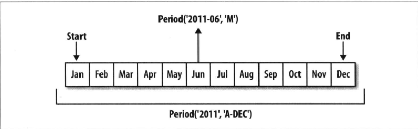

### 按季度计算的时期频率
季度型数据在会计、金融等领域中很常见。许多季度型数据都会涉及"财年末"的概念，通常是一年12个月中某月的最后一个日历日或工作日。时期"2018Q4"根据财年末的不同会有不同的含义，pandas支持12种可能的季度型频率即`Q-JAn`到`Q-DEC`。例如在以1月结束的财年中，2018Q4是从11月到1月；`period_range`还可用于生成季度型范围
```Python
In [56]: #创建以1月结束的财年

In [57]: p = pd.Period('2018Q4', freq='Q-JAN')

In [58]: p
Out[58]: Period('2018Q4', 'Q-JAN')

In [59]: p.asfreq('D','start')
Out[59]: Period('2017-11-01', 'D')

In [60]: p.asfreq('D','e')
Out[60]: Period('2018-01-31', 'D')

In [67]: #该季度倒数第二个工作日下午4点的时间戳

In [68]: p4pm = (p.asfreq('B', 'e')-1).asfreq('T','s')+16*60

In [69]: p4pm
Out[69]: Period('2018-01-30 16:00', 'T')

In [70]: p4pm.to_timestamp()
Out[70]: Timestamp('2018-01-30 16:00:00')

In [71]: # period_range还可用于生成季度型范围

InIn [72]: rng = pd.period_range('2017Q1','2018Q4', freq='Q-JAN')

In [73]: ts = Series(np.random.randn(len(rng)), index=rng)

In [74]: ts
Out[74]:
2017Q1    0.763694
2017Q2   -0.192030
2017Q3   -0.514838
2017Q4    0.071501
2018Q1   -0.765586
2018Q2    0.695312
2018Q3    0.747142
2018Q4   -0.359449
Freq: Q-JAN, dtype: float64

In [75]: # 季度型范围的算术运算

In [76]: new_rng = (rng.asfreq('B','e')-1).asfreq('T','s')+16*60

In [77]: ts.index = new_rng.to_timestamp()

In [78]: ts
Out[78]:
2016-04-28 16:00:00    0.763694
2016-07-28 16:00:00   -0.192030
2016-10-28 16:00:00   -0.514838
2017-01-30 16:00:00    0.071501
2017-04-27 16:00:00   -0.765586
2017-07-28 16:00:00    0.695312
2017-10-30 16:00:00    0.747142
2018-01-30 16:00:00   -0.359449
dtype: float64

```
### 将Timestamp转换为Period(及其反向过程)
通过使用`to_period`方法，可以将由时间戳索引的Series或DataFrame对象转换成以时期索引，由于时期指的是 **非重叠时间区间** ，因此对于给定的频率，一个时间戳只能属于一个时期。新PeriodIndex的频率默认是从时间戳推断出来的，也可以指定任何其他频率，结果中允许存在重复时期。要转换为时间戳可以使用`to_timestamp`方法:
```Python
In [84]: # 将时间戳转换为时期

In [85]: ts = Series(np.random.randn(len(rng)), index=rng)

In [86]: # 将时间戳转换为时期

In [87]: rng = pd.date_range('3/29/2018 8:51', periods=3, freq='M')

In [88]: ts = Series(np.random.randn(len(rng)), index=rng)

In [89]: pts = ts.to_period()

In [90]: ts
Out[90]:
2018-03-31 08:51:00    0.473123
2018-04-30 08:51:00   -0.278769
2018-05-31 08:51:00    0.903042
Freq: M, dtype: float64

In [91]: pts
Out[91]:
2018-03    0.473123
2018-04   -0.278769
2018-05    0.903042
Freq: M, dtype: float64

In [92]: #指定频率转换，允许存在重复时期

In [93]: rng = pd.date_range('3/29/2018 8:51', periods=5, freq='D')

In [94]: ts2 = Series(np.random.randn(len(rng)), index=rng)

In [95]: ts2.to_period('M')
Out[95]:
2018-03   -0.579708
2018-03    0.793771
2018-03    0.327913
2018-04    0.248145
2018-04    1.324320
Freq: M, dtype: float64

In [96]: # 使用to_timestamp转换为时间戳

In [97]: pts
Out[97]:
2018-03    0.473123
2018-04   -0.278769
2018-05    0.903042
Freq: M, dtype: float64

In [98]: pts.to_timestamp(how='end')
Out[98]:
2018-03-31    0.473123
2018-04-30   -0.278769
2018-05-31    0.903042
Freq: M, dtype: float64
```

### 通过数组创建PeriodIndex
固定频率的数据集通常会将时间信息分开存放在多个列中，下面的[宏观经济数据集](https://github.com/coldJune/Python/blob/master/ipython/macrodata.csv)中，年度和季度就分别放在不同的列中:
```Python
In [112]: data = pd.read_csv('macrodata.csv')

In [113]: data.year
Out[113]:
0      1959.0
1      1959.0
2      1959.0
        ...
202    2009.0
Name: year, Length: 203, dtype: float64

In [114]: data.quarter
Out[114]:
0      1.0
1      2.0
2      3.0
3      4.0
4      1.0
5      2.0
      ...
202    3.0
Name: quarter, Length: 203, dtype: float64

In [115]: #将两个数组以及一个频率传入PeriodIndex，将它们合并成DataFrame的一个索引

In [116]: index = pd.PeriodIndex(year=data.year,quarter=data.quarter,freq='Q-DEC')

In [117]: index
Out[117]:
PeriodIndex(['1959Q1', '1959Q2', '1959Q3', '1959Q4', '1960Q1', '1960Q2',
             '1960Q3', '1960Q4', '1961Q1', '1961Q2',
             ...
             '2007Q2', '2007Q3', '2007Q4', '2008Q1', '2008Q2', '2008Q3',
             '2008Q4', '2009Q1', '2009Q2', '2009Q3'],
            dtype='period[Q-DEC]', length=203, freq='Q-DEC')

In [118]: data.index=index

In [119]: data.infl
Out[119]:
1959Q1    0.00
1959Q2    2.34
1959Q3    2.74
          ...
2009Q1    0.94
2009Q2    3.37
2009Q3    3.56
Freq: Q-DEC, Name: infl, Length: 203, dtype: float64
```
## 重采样及频率转换
**重采样(resampling)** 指的是将时间序列从一个频率转换到另一个频率的处理过程。将高频率数据聚合到低频率称为 **降采样(downsampling)**；将低频率数据转换到高频率则称为 **升采样(upsampling)**。(*将W-WED(每周三)转换为W-FRI既不是降采样也不是升采样*)。pandas对象有一个`resample`方法能处理各种频率转换工作。`resample`是一个灵活高效的方法，可以处理非常大的时间序列:
* resample方法的参数

|      参数      |                                                                    说明                                                                    |
|:--------------:|:------------------------------------------------------------------------------------------------------------------------------------------:|
|      rule      |                                      表示重采样频率的字符串或DateOffset，例如'M'、'5min'或Sencond(15)                                      |
|      axis      |                                                          重采样的轴，默认为axis=0                                                          |
| closed='right' |                                在降采样中，各时间段的哪一端是闭合(即包含)的，'right'或'left'，默认为'right'                                |
| label='right'  | 在降采样中，如何设置聚合值的标签，'right'或'left'(面元的右边界或左边界)。例如，在9:30到9:35之间的这5分钟会被标记为9:30或9:35.默认为'right' |
|    loffset     |                                      面元标签的时间校正值，比如'-1s/Sencond(-1)'用于将聚合标签调早1秒                                      |
|   convention   |                               当重采样时期时，将低频率转换到高频率所采用的约定('start'或'end')。默认为'end'                                |
|      kind      |                                  聚合到时期('period')或时间戳('timestamp')，默认聚合到时间序列的索引类型                                   |

```Python
In [133]: rng = pd.date_range('3/29/2018 8:51', periods=100, freq='D')

In [134]: ts = Series(np.random.randn(len(rng)), index=rng)

In [135]: ts.resample('M').mean()  #聚合计算每月的平均值
Out[135]:
2018-03-31    0.174432
2018-04-30   -0.122522
2018-05-31   -0.121770
2018-06-30   -0.253277
2018-07-31   -0.211743
Freq: M, dtype: float64

In [136]: ts.resample('M',kind='period').mean()  #聚合到时期计算每月的平均值
Out[136]:
2018-03    0.174432
2018-04   -0.122522
2018-05   -0.121770
2018-06   -0.253277
2018-07   -0.211743
Freq: M, dtype: float64
```

### 降采样
待聚合的数据不必拥有固定的频率，期望的频率会 **自动定义** 聚合的面元边界，这些面元用于将时间序列拆分为多个片段。*例如，要转换到月度频率('M'或'BM')，数据需要被划分到多个单月时间段中。* 各时间段都是半开放的，一个数据点只能属于一个时间段，所有时间段的并集必须组成整个时间帧。在用`resample`对数据降采样是需要考虑：
1. 各区间哪边是闭合的
2. 如何标记各个聚合面元，用区间的开头还是末尾
对于将"1分钟"数据通过求和的方式聚合到"5分钟"块中`ts.resample('5min')`，传入的频率将会以"5分钟"的增量定义面元边界。默认情况下，面元的右边界是包含的，则 *00:00~00:05* 区间中是包含 *00:05* 的。传入`closed=left`会让区间以左边界闭合，最终的时间序列以各面元左边界的时间戳进行标记，传入`label='left'`使用面元的左边界进行标记；可以通过`loffset`设置一个字符串或日期偏移量来实现从右边界减去1秒以便更容易明白该时间戳表示哪个区间，也可以使用`shifit`方法实现：
* closed和label约定的5分钟
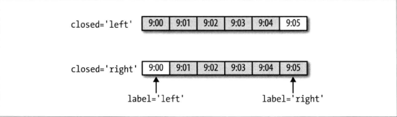

```Python
In [152]: # 定义一分钟数据

In [153]: rng = pd.date_range('3/29/2018', periods=12, freq='T')

In [154]: ts = Series(np.random.randn(len(rng)), index=rng)

In [155]: ts
Out[155]:
2018-03-29 00:00:00    0.773065
2018-03-29 00:01:00   -0.630944
2018-03-29 00:02:00   -0.718832
2018-03-29 00:03:00   -0.076057
2018-03-29 00:04:00   -1.190293
2018-03-29 00:05:00   -0.320130
2018-03-29 00:06:00    0.788608
2018-03-29 00:07:00    0.240031
2018-03-29 00:08:00    0.404883
2018-03-29 00:09:00    0.562027
2018-03-29 00:10:00    0.549154
2018-03-29 00:11:00   -0.233119
Freq: T, dtype: float64

In [156]: #将数据通过求和的方式聚合到5min

In [157]: ts.resample('5min').sum()
Out[157]:
2018-03-29 00:00:00   -1.843060
2018-03-29 00:05:00    1.675418
2018-03-29 00:10:00    0.316035
Freq: 5T, dtype: float64

In [158]: ts.resample('5min',closed='right').sum()
Out[158]:
2018-03-28 23:55:00    0.773065
2018-03-29 00:00:00   -2.936255
2018-03-29 00:05:00    2.544703
2018-03-29 00:10:00   -0.233119
Freq: 5T, dtype: float64

In [162]: ts.resample('5min',closed='left',label='right').sum() #左边闭合 以右边的时间戳为标记
Out[162]:
2018-03-29 00:05:00   -1.843060
2018-03-29 00:10:00    1.675418
2018-03-29 00:15:00    0.316035
Freq: 5T, dtype: float64


In [163]: ts.resample('5min',closed='right',loffset='1s').sum() #以左边为标记，右边闭合，向右移1s
Out[163]:
2018-03-28 23:55:01    0.773065
2018-03-29 00:00:01   -2.936255
2018-03-29 00:05:01    2.544703
2018-03-29 00:10:01   -0.233119
Freq: 5T, dtype: float64

In [170]: ts.resample('5min',closed='right').sum().shift(freq='1s') #使用shift设置偏移量
Out[170]:
2018-03-28 23:55:01    0.773065
2018-03-29 00:00:01   -2.936255
2018-03-29 00:05:01    2.544703
2018-03-29 00:10:01   -0.233119
Freq: 5T, dtype: float64
```

### OHLC重采样
金融领域有一种无所不在的时间序列聚合方式，即计算各面元的四个之:第一个值(*open*，开盘)、最后一个值(*close*，收盘)、最大值(*high*，最高)以及最小值(*low*，最低)，调用`ohlc`可以得到一个含有这四种聚合指的DataFrame:
```Python
In [171]: ts.resample('5min').ohlc()
Out[171]:
                         open      high       low     close
2018-03-29 00:00:00  0.773065  0.773065 -1.190293 -1.190293
2018-03-29 00:05:00 -0.320130  0.788608 -0.320130  0.562027
2018-03-29 00:10:00  0.549154  0.549154 -0.233119 -0.233119
```

#### 通过groupby进行重采样
另一种降采样的方法是使用pandas的 `groupby`功能，如果打算根据月份或星期几进行分组，只需要传入一个能够访问时间序列的索引上的字段的函数:
```Python
In [172]: rng = pd.date_range('3/29/2018', periods=100, freq='D')

In [173]: ts = Series(np.random.randn(len(rng)), index=rng)

In [174]: ts.groupby(lambda x:x.month).mean()
Out[174]:
3   -0.754346
4    0.344039
5    0.103259
6    0.081290
7   -0.093527
dtype: float64

In [175]: ts.groupby(lambda x:x.weekday).mean()
Out[175]:
0    0.521997
1   -0.106740
2   -0.016337
3    0.080450
4   -0.044141
5    0.163868
6    0.336645
dtype: float64
```
### 升采样和插值
在将数据从低频率转换到高频率时不再需要聚合，默认会引入缺失值，可以当想要填充时，可以调用`reindex`一样的方法，也可以只填充指定的时期数；且新的日期索引和旧的 **不必相交**
```Python
In [182]: frame = DataFrame(np.random.randn(2,4),
     ...:                   index=pd.date_range('3/28/2018',periods=2,freq='W-WED'),
     ...:                    columns=['col1','col2','col3','col4'])
     ...:

In [183]: frame
Out[183]:
                col1      col2      col3      col4
2018-03-28  1.724639 -0.712352 -1.918885 -0.671178
2018-04-04 -1.308759 -0.056425 -0.746326  0.153999

In [184]: df_daily = frame.resample('D') #将其重采样到日频率，会引入缺失值

In [185]: df_daily.mean()
Out[185]:
                col1      col2      col3      col4
2018-03-28  1.724639 -0.712352 -1.918885 -0.671178
2018-03-29       NaN       NaN       NaN       NaN
2018-03-30       NaN       NaN       NaN       NaN
2018-03-31       NaN       NaN       NaN       NaN
2018-04-01       NaN       NaN       NaN       NaN
2018-04-02       NaN       NaN       NaN       NaN
2018-04-03       NaN       NaN       NaN       NaN
2018-04-04 -1.308759 -0.056425 -0.746326  0.153999

In [187]: frame.resample('D').mean().ffill()  #使用ffill方法向前填充
Out[187]:
                col1      col2      col3      col4
2018-03-28  1.724639 -0.712352 -1.918885 -0.671178
2018-03-29  1.724639 -0.712352 -1.918885 -0.671178
2018-03-30  1.724639 -0.712352 -1.918885 -0.671178
2018-03-31  1.724639 -0.712352 -1.918885 -0.671178
2018-04-01  1.724639 -0.712352 -1.918885 -0.671178
2018-04-02  1.724639 -0.712352 -1.918885 -0.671178
2018-04-03  1.724639 -0.712352 -1.918885 -0.671178
2018-04-04 -1.308759 -0.056425 -0.746326  0.153999

In [188]: frame.resample('D').mean().ffill(limit=2)  #使用ffill方法向前填充并制定时期数
Out[188]:
                col1      col2      col3      col4
2018-03-28  1.724639 -0.712352 -1.918885 -0.671178
2018-03-29  1.724639 -0.712352 -1.918885 -0.671178
2018-03-30  1.724639 -0.712352 -1.918885 -0.671178
2018-03-31       NaN       NaN       NaN       NaN
2018-04-01       NaN       NaN       NaN       NaN
2018-04-02       NaN       NaN       NaN       NaN
2018-04-03       NaN       NaN       NaN       NaN
2018-04-04 -1.308759 -0.056425 -0.746326  0.153999

In [190]: frame.resample('W-THU').mean() #频率转换为周四
Out[190]:
                col1      col2      col3      col4
2018-03-29  1.724639 -0.712352 -1.918885 -0.671178
2018-04-05 -1.308759 -0.056425 -0.746326  0.153999
```
### 通过时期进行重采样
对使用时期的索引进行重采样是很简单的事，而升采样必须决定在新频率中各区间的哪端用于放置原来的值，`convention`参数默认为`'end'`，可设置为`'start'`；由于时期指的是时间区间，所以升采样和降采样的规则比较严格:
1. 降采样中，目标频率必须是源频率的子时期(subperiod)
2. 升采样中，目标频率必须是源频率的超时期(superperiod)

如果不满足这些条件就会引发异常，主要影响按季、年、周计算的频率，例如由Q-MAR定义的时间区间只能升采样为A-MAR、A-JUN、A-SEP、A-DEC

```Python
In [191]: frame = DataFrame(np.random.randn(12,4),
     ...:                   index=pd.date_range('3/28/2018', '3-2019',freq='M'),
     ...:                    columns=['col1','col2','col3','col4'])
     ...:

In [192]: frame[:5]
Out[192]:
                col1      col2      col3      col4
2018-03-31  0.213243  0.555932 -1.283426 -0.527552
2018-04-30  0.600141  0.312877  0.230994  2.016597
2018-05-31 -0.535206  0.305608  1.046269 -1.363808
2018-06-30  1.303406  0.486195 -0.230848  1.684832
2018-07-31 -0.030762 -0.923983  1.971748 -0.161417

In [193]: annual_frame = frame.resample('A-DEC').mean() #按A-DEC进行降采样

In [194]: annual_frame
Out[194]:
                col1      col2      col3      col4
2018-12-31  0.432316  0.155345 -0.072937  0.322326
2019-12-31 -0.146624  0.161040 -1.046127  0.170322

In [195]: annual_frame.resample('Q-DEC').ffill()#进行升采样并使用前向填充
Out[195]:
                col1      col2      col3      col4
2018-12-31  0.432316  0.155345 -0.072937  0.322326
2019-03-31  0.432316  0.155345 -0.072937  0.322326
2019-06-30  0.432316  0.155345 -0.072937  0.322326
2019-09-30  0.432316  0.155345 -0.072937  0.322326
2019-12-31 -0.146624  0.161040 -1.046127  0.170322
```

## 时间序列绘图
对[数据](https://github.com/coldJune/Python/blob/master/ipython/stock_px.csv)的任意一列调用plot即可生成一张简单的图表:
* APPLE的每日价格
```Python
In [197]: close_px_all = pd.read_csv('stock_px.csv', parse_dates=True, index_col=0)

In [198]: close_px = close_px_all[['AAPL','MSFT','XOM']]

In [199]: close_px = close_px.resample('B').mean().ffill()

In [200]: close_px
Out[200]:
              AAPL   MSFT    XOM
1990-02-01    7.86   0.51   6.12
1990-02-02    8.00   0.51   6.24
1990-02-05    8.18   0.51   6.25
...            ...    ...    ...
2011-10-14  422.00  27.27  78.11

[5662 rows x 3 columns]

In [201]: close_px['AAPL'].plot() #选取一列绘图
Out[201]: <matplotlib.axes._subplots.AxesSubplot at 0x24ce3592860>

```
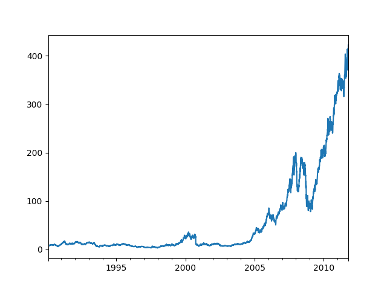

当对DataFrame调用`plot`时，所有时间序列都会被绘制在一个subplot上，并分别生成相应的图例
```Python
In [202]: close_px.loc['2009'].plot() #绘制2009年的数据
Out[202]: <matplotlib.axes._subplots.AxesSubplot at 0x24ce55560b8>

In [204]: close_px['AAPL'].loc['01-2011':'03-2011'].plot() #苹果公司在2011年1月到3月间的每日股价
Out[204]: <matplotlib.axes._subplots.AxesSubplot at 0x24cf66a9710>
```
* 2009年的股票价格
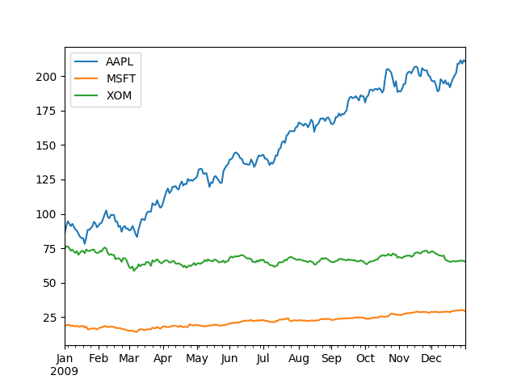
* 苹果公司在2011年1月到3月间的每日股价
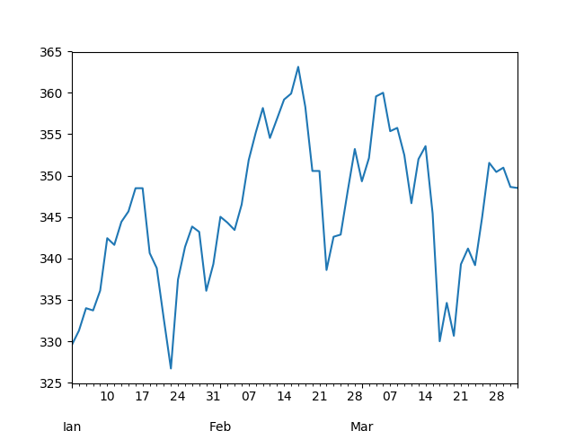

季度型频率的数据会用季度标记进行格式化:
```Python
In [211]: appl_q = close_px['AAPL'].resample('Q-DEC').mean().ffill()

In [212]: appl_q['2009':].plot() #苹果公司在2009年到2011年间的每季度股价
Out[212]: <matplotlib.axes._subplots.AxesSubplot at 0x24cf6593400>
```
* 苹果公司在2009年到2011年间的每季度股价
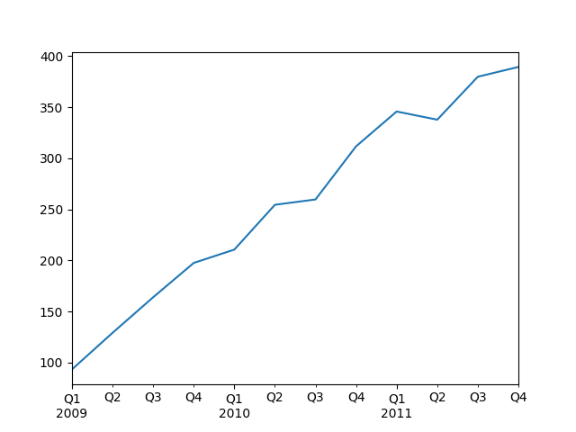

## 移动窗口函数
**移动窗口函数** 是指在移动窗口(可以带有指数衰减权数)上计算的各种统计函数(时间序列的数组变换)，其中还包括哪些窗口不定长的函数(如指数加权移动平均)。跟其他统计函数一样，移动窗口函数也会自动排除缺失值。
使用`Series.rolling`或`DataFrame.rolling`后面加上[基本数组统计方法](http://coldjune.com/2018/03/17/numpy%E5%9F%BA%E7%A1%80-%E4%BA%8C/#%E6%95%B0%E5%AD%A6%E5%92%8C%E7%BB%9F%E8%AE%A1%E6%96%B9%E6%B3%95)变成类似于`Series.rolling(window=250,center=False).mean()`
* 苹果公司股价的250日均线
```Python
In [221]: close_px.AAPL.plot()
Out[221]: <matplotlib.axes._subplots.AxesSubplot at 0x24cf6ae7ac8>

In [222]: close_px.AAPL.rolling(250).mean().plot() #苹果公司股价的250日均线
Out[222]: <matplotlib.axes._subplots.AxesSubplot at 0x24cf6ae7ac8>
```
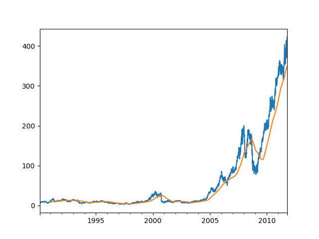

* 苹果公司250日每日回报标准差
```Python
In [223]: app_std250 = close_px.AAPL.rolling(250,min_periods=10).std()

In [224]: app_std250[5:12]
Out[224]:
1990-02-08         NaN
1990-02-09         NaN
1990-02-12         NaN
1990-02-13         NaN
1990-02-14    0.148189
1990-02-15    0.141003
1990-02-16    0.135454
Freq: B, Name: AAPL, dtype: float64

In [225]: app_std250.plot() #苹果公司250日每日回报标准差
Out[225]: <matplotlib.axes._subplots.AxesSubplot at 0x24cf6f95be0>
```
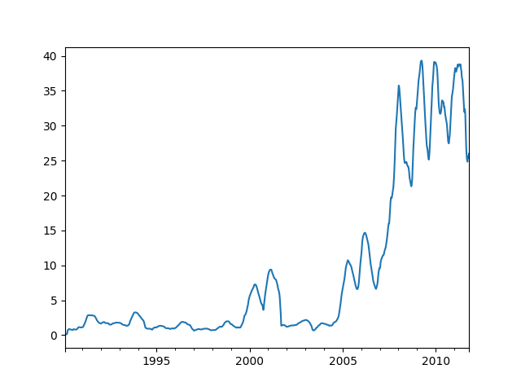

要计算扩展窗口平均(*expanding window mean*)，可以将扩展窗口看成一个特殊的窗口，其长度和时间序列一样，但只需一期或多期即可计算一个值，然后对DataFrame调用`rolling`将其应用到所有列上:
* 各股价60日均线(对数Y轴)
```Python
In [232]: # 定义扩展平均

In [233]: expanding_mean = lambda x: x.rolling(len(x),min_periods=1)

In [234]: close_px.rolling(60).mean().plot(logy=True) #各股价60日均线(对数Y轴)
Out[234]: <matplotlib.axes._subplots.AxesSubplot at 0x24cf708a748>

```
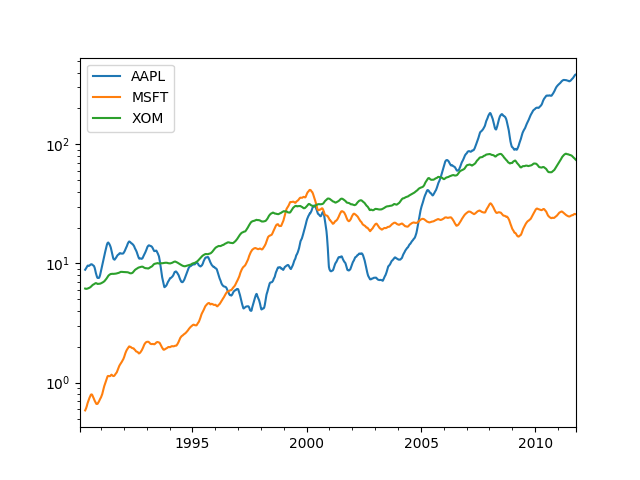

### 指数加权函数
另一个使用固定大小窗口及相等权数观测值的办法是定义一个衰减因子(decay factor)常量，以便使近期的观测值拥有更大的权数。如果ma_t是时间t的移动平均结果，x是时间序列，结果中的各个值可用ma_t=a\*ma\_t-1 +(a-1)\*x\_-t进行计算，其中a为衰减因子。 衰减因子的定义方式有很多，比较流行的是使用时间间隔( *span*)，它可以使结果兼容于窗口大小等于时间间隔的简单移动窗口函数:
* 简单移动平均与指数加权移动平均
```Python
In [238]: fig, axes = plt.subplots(nrows=2,ncols=1,sharex=True,sharey=True,figsize=(12,7))

In [239]: appl_px = close_px.AAPL['2005':'2009']

In [240]: m60 = appl_px.rolling(60, min_periods=50).mean()


In [242]: ewma60 = appl_px.ewm(span=60).mean() #指数加权移动平均

In [243]: appl_px.plot(style='k-', ax=axes[0])
Out[243]: <matplotlib.axes._subplots.AxesSubplot at 0x24cf793d048>

In [244]: m60.plot(style='k--', ax=axes[0])
Out[244]: <matplotlib.axes._subplots.AxesSubplot at 0x24cf793d048>

In [245]: appl_px.plot(style='k-', ax=axes[1])
Out[245]: <matplotlib.axes._subplots.AxesSubplot at 0x24cf7951320>

In [246]: ewma60.plot(style='k--',ax=axes[1])
Out[246]: <matplotlib.axes._subplots.AxesSubplot at 0x24cf7951320>

In [247]: axes[0].set_title('Simple MA')
Out[247]: <matplotlib.text.Text at 0x24cf83de390>

In [248]: axes[1].set_title('Exponenttially-weighted MA')
Out[248]: <matplotlib.text.Text at 0x24cf78d28d0>
```
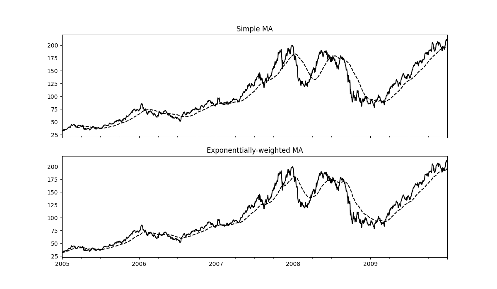

### 二元移动窗口函数
有些统计运算(如相关系数和协方差)需要在两个时间序列上执行
* APPL6个月的回报与标准普尔500指数的相关系数
```Python
In [249]: spx_px = close_px_all['SPX']

In [250]: spx_rets = spx_px/spx_px.shift(1) -1 #计算相关系数

In [251]: returns = close_px.pct_change()

In [254]: corr = returns.AAPL.rolling(125,min_periods=100).corr(spx_rets) #计算百分数变化

In [256]: corr.plot()
Out[256]: <matplotlib.axes._subplots.AxesSubplot at 0x24cfc175dd8>

```
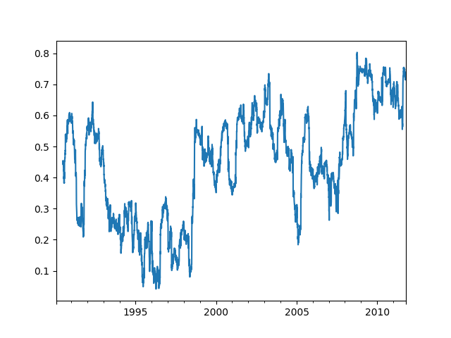

想要一次性计算多只股票与标准普尔500指数的相关系数只需要传入一个TimeSeries和一个DataFrame
* 3只股票6个月的回报与标准普尔500指数的相关系数
```Python
In [257]: corr = returns.rolling(125,min_periods=100).corr(spx_rets)

In [258]: corr.plot()
Out[258]: <matplotlib.axes._subplots.AxesSubplot at 0x24cfb760588>
```
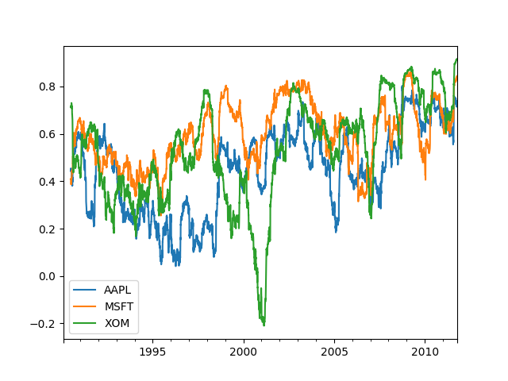
### 用户定义的移动窗口函数
`apply`能够在移动窗口上应用自己设计的数组函数。唯一要求是 **该函数要能从数组的各个片段中产生单个值(即约简)**
* AAPL%2回报率的百分等级(一年窗口期)
```Python
In [11]: from scipy.stats import percentileofscore

In [12]: score_at_2percent = lambda x:percentileofscore(x,0.02)

In [13]: result = returns.AAPL.rolling(250).apply(score_at_2percent)

In [14]: result.plot()
Out[14]: <matplotlib.axes._subplots.AxesSubplot at 0x1baac50c908>
```
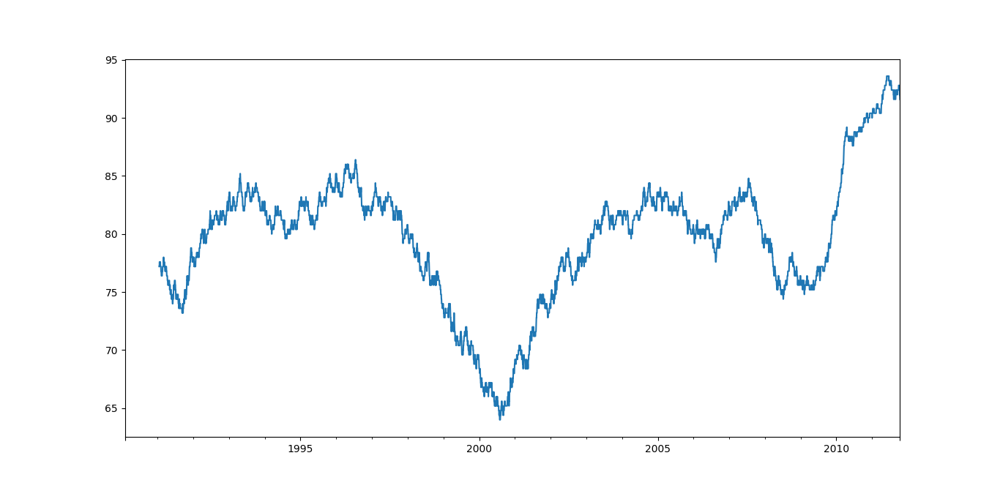
