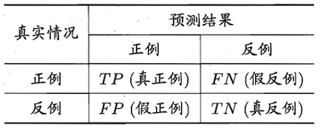
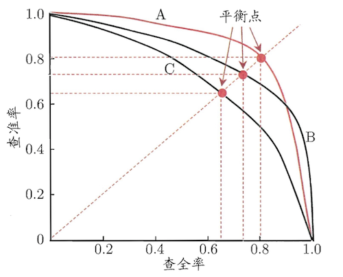
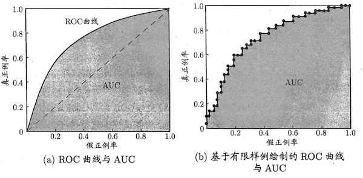
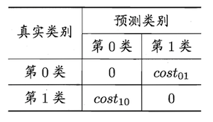
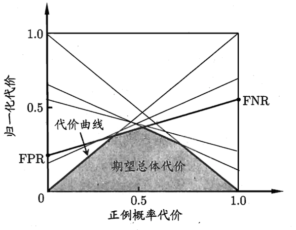

&nbsp;&nbsp;&nbsp;&nbsp;&nbsp;&nbsp;&nbsp;&nbsp;假设用**P**来评估计算机程序在某任务类**T**上的性能，若一个程序通过利用经验**E**在**T**中任务上获得了性能改善，则我们就说关于**T**和**P**，该程序对**E**进行了学习。 

Mitcell,1997
 

# 模型评估与选择
## 误差

* 误差
>**误差**是学习器的实际预测输出与样本真实输出之间的差异，其中在训练集上的误差称为**训练误差**或者**经验误差**，在新样本上的误差称为**泛化误差**。

* 过拟合与欠拟合
>**过拟合**是指学习器把训练样本学习得“太好”，可能将训练样本的一些特点当做所有潜在样本都具有的一般性质而导致泛化性能下降。**欠拟合**则相反，它表示对训练样本的一般性质都未曾学到。欠拟合可以克服而过拟合只能缓解。

## 模型评估
* 留出法
>**留出法**直接将训练集划分为两个不相交的子集，一个作为训练集，一个作为测试集。为了保证被划分后的数据拥有和原始数据同样的分布，避免因数据划分而引入额外的偏差影响最终的结果，可以采用**分层采样**(*stratified sampling*)来保留类别比例；因一个数据集可能存在多种划分方式，如果单次使用留出法可能导致结果不够稳定可靠，一般可采用随机划分、重复进行实验后取平均值作为留出法的评估结果；数据划分将导致最后的模型不是整个数据集的训练结果，而只是一部分数据训练出来的，这将降低评估结果的**保真性**(*fidelity*)，由于没有完美的解决方案，一般是将大约$\frac{2}{3}$~$\frac{4}{5}$的样本用作训练，剩余用于测试(测试集至少应含30个样例)

* 交叉验证法
>**交叉验证法**将数据分为$k$个大小相似的互斥子集，每个子集尽可能保持数据分布的一致性(分层采样)，每次用$k-1$个子集的并集作为训练集，剩下的那个作为测试集，如此进行$k$次则可通过$k$组训练/测试集得到$k$个测试结果，最后取均值。交叉验证法又称为**k折交叉验证**(*k-fold cross validation*)，它评估结果的稳定性和保真性很大程度上取决于$k$，这里$k$的取值常用10；与留出法类似，一个数据集可能存在多种划分，为减小划分引入的差别，k折验证法需要使用不同的划分进行$p$次，最终的结果是这p次k折交叉验证结果的均值。

* 留一法
> **留一法**(*Leave-One-Out, LOO*)是交叉验证法的特例，它将大小为$m$的数据集划分成$m$个子集，即每个子集只包含一个样本，这样就不会受随机划分的影响，同时也让用训练集训练的模型和期望评估的用整个数据集训练的模型相似(两个数据集样本数差一)，使结果更为准确。但是当数据量变大时，留一法需要训练$m$个模型，这个计算开销是巨大而不能忍受的。

* 自助法
> 所谓**自助法**(*booststrapping*)就是通过**自助采样**(*booststrap sampling*)[^1]从原始数据集$D$中有放回地随机选取$m$个样本组成训练用数据集$D'$，因为是有放回的采样，所以$D$中的一部分样本可能在$D'$中多次出现，而另一部分样本则不会出现，样本在$m$次采样中始终不出现的概率为$(1-\frac{1}{1})^m$，对$m$取极限可得$\lim_{m \rightarrow \inf}{(1- \frac{1}{m})^m} = \frac{1}{e} \approx 0.368$。这说明通过自助采样之后有$36.8\%$的数据未参与训练，因此我们可以使用这部分数据作为测试数据集，这样获得的测试结果叫做**包外估计**(*out-of-bag estimate*)。虽然自助法在数据集较小，难以有效划分有效训练集/测试集时很有效，并且由于它能参数多个不同的训练集，在集成学习中也能发挥巨大的作用，但由于它产生的数据集改变了原始数据集的分布，引入了估计偏差，因此在数据量足够多时还是使用留一法或交叉验证法会更好一些。

## 性能度量
### 回归
&nbsp;&nbsp;&nbsp;&nbsp;&nbsp;&nbsp;&nbsp;&nbsp;回归任务中最常用的性能度量是**均方误差**，即对各个样本预测值$f(\boldsymbol{x}_i)$与对应真实值$y_i$的差值的平方进行求和再取平均数：$$E(x;D)=\frac{1}{m}\sum^1_m(f(\boldsymbol{x}_i-y_i))^2$$

### 分类
#### 错误率与精度
&nbsp;&nbsp;&nbsp;&nbsp;&nbsp;&nbsp;&nbsp;&nbsp;**错误率**是分类错误的样本数占样本总数的比例，**精度**是分类正确的样本数占样本总数的比例，两者相加为$1$。 
* 错误率[^2]
$$E(f;D)=\frac{1}{m}\sum_m^1\bold{I}(f(\boldsymbol{x}_i \ne y_i))$$
* 精度
$$acc(f;D)=\frac{1}{m}\sum_m^1\bold{I}(f(\boldsymbol{x}_i = y_i))$$
#### 查准率(准确率)、查全率(召回率)和F1
&nbsp;&nbsp;&nbsp;&nbsp;&nbsp;&nbsp;&nbsp;&nbsp;**查准率**表示分类结果中真正为正的样本(*真正例*)在分类为正的样本中所占的比例，**查全率**表示分类结果中真正为正的样本在总样本中所占的比例。对于这两个度量标准，可以通过混淆矩阵进行直观的展现，

&nbsp;&nbsp;&nbsp;&nbsp;&nbsp;&nbsp;&nbsp;&nbsp;其中**真正例**(*true positive*)表示预测为真实际也为真，**假反例**(*false negative*)表示实际为真预测为加，**假正例**(*false negative*)表示预测为真实际为假，**真反例**(*true negative*)表示实际为假预测也为假，这四种情形对应的样例数之和为总的样本数。而查准率和查全率用可以用这几种情形进行表示
* 查准率(准确率)
$$P = \frac{TP}{TP+FP}$$
* 查全率(召回率)
$$F = \frac{TP}{TP+FN}$$

&nbsp;&nbsp;&nbsp;&nbsp;&nbsp;&nbsp;&nbsp;&nbsp;查准率和查全率是一对相互矛盾的度量，查准率高则查全率低，反之亦然。
&nbsp;&nbsp;&nbsp;&nbsp;&nbsp;&nbsp;&nbsp;&nbsp;**P-R曲线**又名**PR图**，其横轴为查全率，纵轴为查准率，P-R曲线往往是非平滑非单调的。如果一个学习器的P-R曲线被另一个学习器的曲线完全包住，则说明后者的性能优于前者；如果两者有交叉，则只能在具体的查准率和查全率下进行比较。

&nbsp;&nbsp;&nbsp;&nbsp;&nbsp;&nbsp;&nbsp;&nbsp;**平衡点**(*Break-Event Point,BEP*)是一个综合考虑查准率和查全率的度量，它的取值为“查准率=查全率”时的值，一般而言，BEP越大学习器越优。
&nbsp;&nbsp;&nbsp;&nbsp;&nbsp;&nbsp;&nbsp;&nbsp;**F1度量**同样时综合考虑查准率和查全率的度量，它比BEP复杂一些。F1是查准率和查全率的调和平均$\frac{1}{F1}=\frac{1}{2}\cdot (\frac{1}{P}+\frac{1}{R})$，它比算数平均$\frac{P+R}{2}$和几何平均$\sqrt{P\times R}$更重视较小值。
* F1
$$F1=\frac{2\times P\times R}{P+R}=\frac{2\times TP}{样例总数+TP-TN}$$

&nbsp;&nbsp;&nbsp;&nbsp;&nbsp;&nbsp;&nbsp;&nbsp;当应用对查准率和查全率的重视程度不同时，就要是F1的一般形式$F_\beta$来表达出对查准率/查全率的偏好，$\beta>0$度量了查全率和查准率的相对重要性，$\beta=1$将退化成F1度量；$\beta>1$时查全率的影响更大；$\beta<1$时查准率的影响更大。
* $F_\beta$
$$F_\beta=\frac{(1+\beta)\times P\times R}{(\beta^2\times P)+R}$$

&nbsp;&nbsp;&nbsp;&nbsp;&nbsp;&nbsp;&nbsp;&nbsp;在多分类任务中，需要考虑的混淆矩阵将不止一个，可能需要在$n$个混淆矩阵上综合考虑查全率和查准率，这时候有两种不同的度量。一种是先在各个混淆矩阵上计算出各自的查准率和查全率$(P_1,R_1),(P_2,R_2),\cdots,(P_n,R_n)$，然后求平均值，这样得到的是**宏查准率**(*macro-P*)，**宏查全率**(*macro-R*)，**宏F1**(*macro-F1*);另一种是先计算混淆矩阵对应元素的平均值,$\overline{TP}(TP),\overline{FP}(FP),\overline{TN}(TN),\overline{FN}(FN)$，在基于这些平均值计算出**微查准率**(*micro-P*)，**微查全率**(*micro-R*)，**微F1**(*micro-F1*)。
* 宏查准率，宏查全率，宏F1
$$P_{macro}=\frac{1}{n}\sum_{i=1}^nP_i$$
$$R_{macro}=\frac{1}{n}\sum_{i=1}^nR_i$$
$$F1_{macro}=\frac{2\times P_{macro}\times R_{macro}}{P_{macro}+R_{macro}}$$
* 微查准率，微查全率，微F1
$$P_{micro}=\frac{\overline{TP}}{\overline{TP}+\overline{FP}}$$
$$R_{micro}=\frac{\overline{TP}}{\overline{TP}+\overline{FN}}$$
$$F1_{micro}=\frac{2\times P_{micro} \times R_{micro}}{P_{micro}+R_{micro}}$$

#### ROC与AUC
&nbsp;&nbsp;&nbsp;&nbsp;&nbsp;&nbsp;&nbsp;&nbsp;**阈值**是在分类过程中确定样本属于哪一类的标准值，大于阈值则划分为正类，否则为反类。如果将预测结果进行排序，最可能为正例的排在前面(概率大的)，最不可能的排在后面(概率小的)，则阈值便成为了区分正反例的**截断点**。如果更看重查准率，则可选取排序中靠前的位置进行截断(阈值大)，如果更看中查全率，则可选取排序中靠后的位置进行截断(阈值小)。
&nbsp;&nbsp;&nbsp;&nbsp;&nbsp;&nbsp;&nbsp;&nbsp;**受试者工作特征**(*Receiver Operating Characteristic, ROC*)是通过考察排序本身的好坏和截断点的不同来研究学习器的泛化性能。ROC曲线的纵轴是**真正例率**(*True Positive Rate, TPR*)，横轴为**假正例率**(*False Positive Rate, FPR*)，对预测结果进行排序，然后按顺序逐个把样本当成正例进行预测，每次计算出这两个重要的值，然后以它们作为坐标作图。给定$m^+$个正例和$m^-$个反例，具体步骤如下：
1. 根据学习器预测结果对样例进行排序
2. 将分类阈值设为最大(所有样例均为反例，真正例率和假正例率均为0)，在坐标$(0,0)$处标记一个点
3. 将分类阈值依次设置为每个样例的预测值(即依次将每个样例标记为正例)。假设前一个标记点为$(x,y)$,则如果当前样例为正例，则标记为$(x,y+\frac{1}{m^+})$，若为反例则标记为$(x+\frac{1}{m^-},y)$
4. 用线段将相邻的点连接
* 真正例率
$$TPR = \frac{TP}{TP+FN}$$
* 假正例率
$$FPR = \frac{FP}{FP+TN}$$
* ROC

&nbsp;&nbsp;&nbsp;&nbsp;&nbsp;&nbsp;&nbsp;&nbsp;与PR图类似，如果一个学习器的ROC曲线完全被另一个包住，则后者的性能优于前者；如果两个学习器的ROC曲线发生交叉则难以判定。AUC适用于这种交叉情况下的性能比较。**AUC**(*Area Under ROC Curve*)是ROC曲线下的面积，假定ROC曲线是由坐标${(x_1,y_1),(x_2,y_2),\cdots,(x_m,y_m)}$的点连接形成，则AUC的计算公式为：
$$AUC=\frac{1}{2}\sum_{i=1}^{m-1}(x_{i+1}-x_i)\cdot(y_i+y_{i+1})$$

&nbsp;&nbsp;&nbsp;&nbsp;&nbsp;&nbsp;&nbsp;&nbsp;AUC考虑的是样本预测的排序质量，因此它与排序误差有紧密的关系。$\bold{l_{rank}}$对应的是ROC曲线之上的面积，是对排序损失的的定义，若一个正例在ROC曲线上对应标记点的坐标为$(x,y)$，则$x$恰是排序在其前的反例所占的比例，即假正例率，因此$$AUC=1-l_{rank}$$
* $$l_{rank}$$
$$l_{rank}=\frac{1}{m^+m^-}\sum_{x^+ \in D+}\sum_{x^-\in D^-}(\bold{I}(f(x^+)<f(x^-))+\frac{1}{2}\bold{I}(f(x^+)=f(x^-)))$$
其中$m^+$表示正例个数，$m^-$表示反例个数，$D^+$表示正例集合，$D^-$表示反例集合。公式的含义为：考虑每一对正反例，若正例的预测值小于反例，则记一分，若想等则记0.5分，将所有分值相加并除以总共的对数则得到排序的损失(loss)。

#### 代价敏感错误率和代价曲线
&nbsp;&nbsp;&nbsp;&nbsp;&nbsp;&nbsp;&nbsp;&nbsp;**代价敏感错误率**是为权衡不同类型错误造成的不同损失，通过给错误赋予非均等代价(*unequal cost*)以达到最小化总体代价(*total cost*)[^3]的目的一种度量方式。
* 代价矩阵

$cost_{ij}$表示将第$i$类样本预测为第$j$样本的代价，$cost_{ii}$一般为0，如果第0类判别为第1类的损失更大，则$cost_{01}>cost_{10}$，损失相差越大，则$cost_{01}$和$cost_{10}$的值差别越大，同时两则的差值重要的是代价比值而非绝对差值。
* 代价敏感错误率
$$E(f;D:cost)=\frac{1}{m}(\sum_{x_i\in D^+}\bold{I}(f(\boldsymbol{x}_i)\ne y_i)\times cost_{01}+ \sum_{x_i\in D^-}\bold{I}(f(\boldsymbol{x}_i)\ne y_i)\times cost_{10})$$
$D^+$为正例子集，$D^-$为反例子集，$cost_{01}$表示第0类预测为第1类的代价，$cost_{10}$表示第1类预测为第0类的代价；若$cost_{ij}$不限于0、1，则可以定义出多分类的代价敏感错误率。
&nbsp;&nbsp;&nbsp;&nbsp;&nbsp;&nbsp;&nbsp;&nbsp;**代价曲线**(*cost curve*)能在非均等代价下反应出学习器的期望总体代价。代价曲线的横轴是取值为$[0,1]$的正例概率代价，纵轴是取值为$[0,1]$的归一化[^4]代价。
* 正例概率代价
$$P(+)cost=\frac{p\times cost_{01}}{p\times cost_{01}+(1-p)\times cost_{10}}$$
p是样例为正例的概率
* 归一化代价
$$cost_{norm}=\frac{FNR\times p\times cost_{01}+FPR\times (1-p)\times cost_{10}}{p\times cost_{01}+(1-p)\times cost_{10}}$$
FPR是假正例率，$FNR=1-TPR$是假反例率
* 代价曲线的绘制
  1. 设ROC曲线上的点为$(TPR,FPR)$，据此计算出FNR
  2. 在代价平面上绘制一条$(0,FPR)$到$(1,FNR)$的线段，线段下的面积即表示该条件下的期望总代价
  3. 如此将ROC曲线上的每个点转化为代价平面上的线段(ROC曲线上的每一个点对应代价平面上的一条线段)
  4. 取所有线段的下界，围成的面积即为在所有条件下学习器的期望总代价

### 聚类
# 监督学习
&nbsp;&nbsp;&nbsp;&nbsp;&nbsp;&nbsp;&nbsp;&nbsp;**监督学习**是指通过给定一个已知正确输出的数据集，使用该数据集训练出一个表示输入和输出之间关系的模型。监督学习的典型代表是**分类(*classification*)**和**回归(*regression*)**。

## 线性回归
&nbsp;&nbsp;&nbsp;&nbsp;&nbsp;&nbsp;&nbsp;&nbsp;**线性模型**试图学习一个通过属性的线性组合来进行预测的函数，而许多非线性模型也可在线性模型的基础上通过引入层级结构和高维映射获得。线性模型的一般表达式如下:
$$f(x)=w_1x_1+w_2x_2+w_3x_3+...+w_dx_d+b$$
向量形式为:
$$f(x)=\boldsymbol{w^Tx}+b$$
&nbsp;&nbsp;&nbsp;&nbsp;&nbsp;&nbsp;&nbsp;&nbsp;线性模型因为其中的$\boldsymbol{w}$直观地表达了各属性在预测中的重要性，所以具有很好的**可解释性**。
&nbsp;&nbsp;&nbsp;&nbsp;&nbsp;&nbsp;&nbsp;&nbsp;**线性回归**试图学得一个线性模型来尽可能准确地预测。

[^1]: 即有放回采样
[^2]: $\bold{I}$为指示函数，成立时才为$1$
[^3]: 均等代价的度量方式如一般的错误率都是直接计算错误次数
[^4]: 归一化是指将不同范围的值映射到相同的固定范围中，常见为$[0,1]$