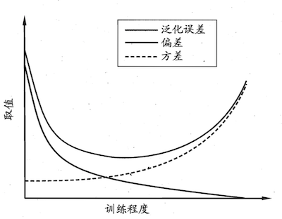
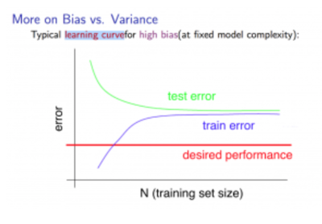
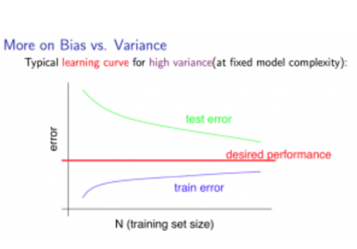
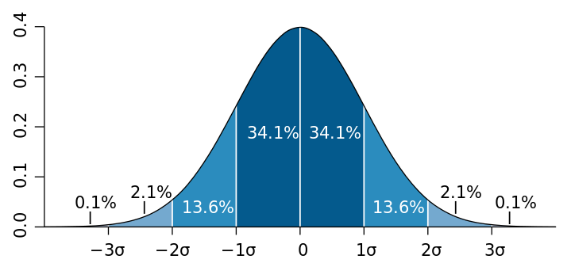
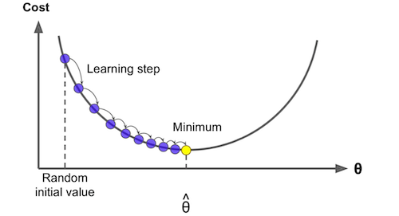
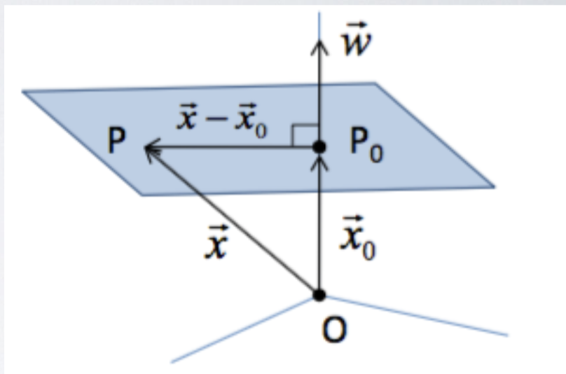
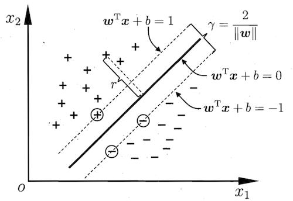
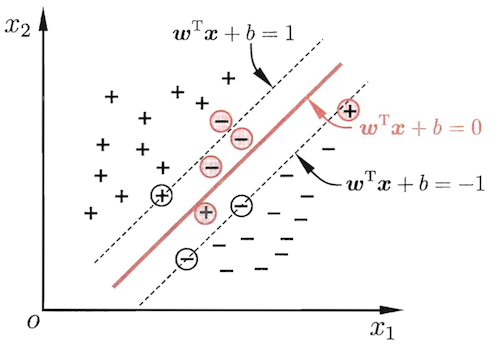
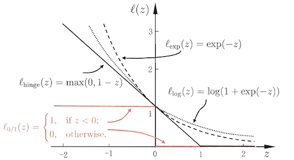
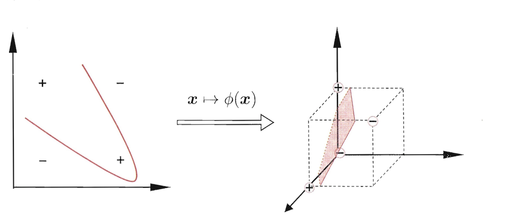

&nbsp;&nbsp;&nbsp;&nbsp;&nbsp;&nbsp;&nbsp;&nbsp;假设用**P**来评估计算机程序在某任务类**T**上的性能，若一个程序通过利用经验**E**在**T**中任务上获得了性能改善，则我们就说关于**T**和**P**，该程序对**E**进行了学习。 
Mitcell,1997

# 模型评估与选择
## 误差

* 误差
>**误差**是学习器的实际预测输出与样本真实输出之间的差异，其中在训练集上的误差称为**训练误差**或者**经验误差**，在新样本上的误差称为**泛化误差**。

* 过拟合与欠拟合
>**过拟合**是指学习器把训练样本学习得“太好”，可能将训练样本的一些特点当做所有潜在样本都具有的一般性质而导致泛化性能下降。**欠拟合**则相反，它表示对训练样本的一般性质都未曾学到。欠拟合可以克服而过拟合只能缓解。

## 模型评估
* 留出法
>**留出法**直接将训练集划分为两个不相交的子集，一个作为训练集，一个作为测试集。为了保证被划分后的数据拥有和原始数据同样的分布，避免因数据划分而引入额外的偏差影响最终的结果，可以采用**分层采样**(*stratified sampling*)来保留类别比例；因一个数据集可能存在多种划分方式，如果单次使用留出法可能导致结果不够稳定可靠，一般可采用随机划分、重复进行实验后取平均值作为留出法的评估结果；数据划分将导致最后的模型不是整个数据集的训练结果，而只是一部分数据训练出来的，这将降低评估结果的**保真性**(*fidelity*)，由于没有完美的解决方案，一般是将大约$\frac{2}{3}$~$\frac{4}{5}$的样本用作训练，剩余用于测试(测试集至少应含30个样例)

* 交叉验证法
>**交叉验证法**将数据分为$k$个大小相似的互斥子集，每个子集尽可能保持数据分布的一致性(分层采样)，每次用$k-1$个子集的并集作为训练集，剩下的那个作为测试集，如此进行$k$次则可通过$k$组训练/测试集得到$k$个测试结果，最后取均值。交叉验证法又称为**k折交叉验证**(*k-fold cross validation*)，它评估结果的稳定性和保真性很大程度上取决于$k$，这里$k$的取值常用10；与留出法类似，一个数据集可能存在多种划分，为减小划分引入的差别，k折验证法需要使用不同的划分进行$p$次，最终的结果是这p次k折交叉验证结果的均值。

* 留一法
> **留一法**(*Leave-One-Out, LOO*)是交叉验证法的特例，它将大小为$m$的数据集划分成$m$个子集，即每个子集只包含一个样本，这样就不会受随机划分的影响，同时也让用训练集训练的模型和期望评估的用整个数据集训练的模型相似(两个数据集样本数差一)，使结果更为准确。但是当数据量变大时，留一法需要训练$m$个模型，这个计算开销是巨大而不能忍受的。

* 自助法
> 所谓**自助法**(*booststrapping*)就是通过**自助采样**(*booststrap sampling*)[^1]从原始数据集$D$中有放回地随机选取$m$个样本组成训练用数据集$D'$，因为是有放回的采样，所以$D$中的一部分样本可能在$D'$中多次出现，而另一部分样本则不会出现，样本在$m$次采样中始终不出现的概率为$(1-\frac{1}{1})^m$，对$m$取极限可得$\lim_{m \rightarrow \inf}{(1- \frac{1}{m})^m} = \frac{1}{e} \approx 0.368$。这说明通过自助采样之后有$36.8\%$的数据未参与训练，因此我们可以使用这部分数据作为测试数据集，这样获得的测试结果叫做**包外估计**(*out-of-bag estimate*)。虽然自助法在数据集较小，难以有效划分有效训练集/测试集时很有效，并且由于它能参数多个不同的训练集，在集成学习中也能发挥巨大的作用，但由于它产生的数据集改变了原始数据集的分布，引入了估计偏差，因此在数据量足够多时还是使用留一法或交叉验证法会更好一些。

## 性能度量
### 回归
&nbsp;&nbsp;&nbsp;&nbsp;&nbsp;&nbsp;&nbsp;&nbsp;回归任务中最常用的性能度量是**均方误差**，即对各个样本预测值$f(\boldsymbol{x}_i)$与对应真实值$y_i$的差值的平方进行求和再取平均数：$$E(x;D)=\frac{1}{m}\sum^1_m(f(\boldsymbol{x}_i-y_i))^2$$

### 分类
#### 错误率与精度
&nbsp;&nbsp;&nbsp;&nbsp;&nbsp;&nbsp;&nbsp;&nbsp;**错误率**是分类错误的样本数占样本总数的比例，**精度**是分类正确的样本数占样本总数的比例，两者相加为$1$。 
* 错误率[^2]
$$E(f;D)=\frac{1}{m}\sum_m^1\boldsymbol{I}(f(\boldsymbol{x}_i \ne y_i))$$
* 精度
$$acc(f;D)=\frac{1}{m}\sum_m^1\boldsymbol{I}(f(\boldsymbol{x}_i = y_i))$$
#### 查准率(准确率)、查全率(召回率)和F1
&nbsp;&nbsp;&nbsp;&nbsp;&nbsp;&nbsp;&nbsp;&nbsp;**查准率**表示分类结果中真正为正的样本(*真正例*)在分类为正的样本中所占的比例，**查全率**表示分类结果中真正为正的样本在总样本中所占的比例。对于这两个度量标准，可以通过混淆矩阵进行直观的展现，

&nbsp;&nbsp;&nbsp;&nbsp;&nbsp;&nbsp;&nbsp;&nbsp;其中**真正例**(*true positive*)表示预测为真实际也为真，**假反例**(*false negative*)表示实际为真预测为加，**假正例**(*false negative*)表示预测为真实际为假，**真反例**(*true negative*)表示实际为假预测也为假，这四种情形对应的样例数之和为总的样本数。而查准率和查全率用可以用这几种情形进行表示
* 查准率(准确率)
$$P = \frac{TP}{TP+FP}$$
* 查全率(召回率)
$$F = \frac{TP}{TP+FN}$$

&nbsp;&nbsp;&nbsp;&nbsp;&nbsp;&nbsp;&nbsp;&nbsp;查准率和查全率是一对相互矛盾的度量，查准率高则查全率低，反之亦然。
&nbsp;&nbsp;&nbsp;&nbsp;&nbsp;&nbsp;&nbsp;&nbsp;**P-R曲线**又名**PR图**，其横轴为查全率，纵轴为查准率，P-R曲线往往是非平滑非单调的。如果一个学习器的P-R曲线被另一个学习器的曲线完全包住，则说明后者的性能优于前者；如果两者有交叉，则只能在具体的查准率和查全率下进行比较。

&nbsp;&nbsp;&nbsp;&nbsp;&nbsp;&nbsp;&nbsp;&nbsp;**平衡点**(*Break-Event Point,BEP*)是一个综合考虑查准率和查全率的度量，它的取值为“查准率=查全率”时的值，一般而言，BEP越大学习器越优。
&nbsp;&nbsp;&nbsp;&nbsp;&nbsp;&nbsp;&nbsp;&nbsp;**F1度量**同样时综合考虑查准率和查全率的度量，它比BEP复杂一些。F1是查准率和查全率的调和平均$\frac{1}{F1}=\frac{1}{2}\cdot (\frac{1}{P}+\frac{1}{R})$，它比算数平均$\frac{P+R}{2}$和几何平均$\sqrt{P\times R}$更重视较小值。
* F1
$$F1=\frac{2\times P\times R}{P+R}=\frac{2\times TP}{样例总数+TP-TN}$$

&nbsp;&nbsp;&nbsp;&nbsp;&nbsp;&nbsp;&nbsp;&nbsp;当应用对查准率和查全率的重视程度不同时，就要是F1的一般形式$F_\beta$来表达出对查准率/查全率的偏好，$\beta>0$度量了查全率和查准率的相对重要性，$\beta=1$将退化成F1度量；$\beta>1$时查全率的影响更大；$\beta<1$时查准率的影响更大。
* $F_\beta$
$$F_\beta=\frac{(1+\beta)\times P\times R}{(\beta^2\times P)+R}$$

&nbsp;&nbsp;&nbsp;&nbsp;&nbsp;&nbsp;&nbsp;&nbsp;在多分类任务中，需要考虑的混淆矩阵将不止一个，可能需要在$n$个混淆矩阵上综合考虑查全率和查准率，这时候有两种不同的度量。一种是先在各个混淆矩阵上计算出各自的查准率和查全率$(P_1,R_1),(P_2,R_2),\cdots,(P_n,R_n)$，然后求平均值，这样得到的是**宏查准率**(*macro-P*)，**宏查全率**(*macro-R*)，**宏F1**(*macro-F1*);另一种是先计算混淆矩阵对应元素的平均值,$\overline{TP}(TP),\overline{FP}(FP),\overline{TN}(TN),\overline{FN}(FN)$，在基于这些平均值计算出**微查准率**(*micro-P*)，**微查全率**(*micro-R*)，**微F1**(*micro-F1*)。
* 宏查准率，宏查全率，宏F1
$$P_{macro}=\frac{1}{n}\sum_{i=1}^nP_i$$
$$R_{macro}=\frac{1}{n}\sum_{i=1}^nR_i$$
$$F1_{macro}=\frac{2\times P_{macro}\times R_{macro}}{P_{macro}+R_{macro}}$$
* 微查准率，微查全率，微F1
$$P_{micro}=\frac{\overline{TP}}{\overline{TP}+\overline{FP}}$$
$$R_{micro}=\frac{\overline{TP}}{\overline{TP}+\overline{FN}}$$
$$F1_{micro}=\frac{2\times P_{micro} \times R_{micro}}{P_{micro}+R_{micro}}$$

#### ROC与AUC
&nbsp;&nbsp;&nbsp;&nbsp;&nbsp;&nbsp;&nbsp;&nbsp;**阈值**是在分类过程中确定样本属于哪一类的标准值，大于阈值则划分为正类，否则为反类。如果将预测结果进行排序，最可能为正例的排在前面(概率大的)，最不可能的排在后面(概率小的)，则阈值便成为了区分正反例的**截断点**。如果更看重查准率，则可选取排序中靠前的位置进行截断(阈值大)，如果更看中查全率，则可选取排序中靠后的位置进行截断(阈值小)。
&nbsp;&nbsp;&nbsp;&nbsp;&nbsp;&nbsp;&nbsp;&nbsp;**受试者工作特征**(*Receiver Operating Characteristic, ROC*)是通过考察排序本身的好坏和截断点的不同来研究学习器的泛化性能。ROC曲线的纵轴是**真正例率**(*True Positive Rate, TPR*)，横轴为**假正例率**(*False Positive Rate, FPR*)，对预测结果进行排序，然后按顺序逐个把样本当成正例进行预测，每次计算出这两个重要的值，然后以它们作为坐标作图。给定$m^+$个正例和$m^-$个反例，具体步骤如下：
1. 根据学习器预测结果对样例进行排序
2. 将分类阈值设为最大(所有样例均为反例，真正例率和假正例率均为0)，在坐标$(0,0)$处标记一个点
3. 将分类阈值依次设置为每个样例的预测值(即依次将每个样例标记为正例)。假设前一个标记点为$(x,y)$,则如果当前样例为正例，则标记为$(x,y+\frac{1}{m^+})$，若为反例则标记为$(x+\frac{1}{m^-},y)$
4. 用线段将相邻的点连接
* 真正例率
$$TPR = \frac{TP}{TP+FN}$$
* 假正例率
$$FPR = \frac{FP}{FP+TN}$$
* ROC

&nbsp;&nbsp;&nbsp;&nbsp;&nbsp;&nbsp;&nbsp;&nbsp;与PR图类似，如果一个学习器的ROC曲线完全被另一个包住，则后者的性能优于前者；如果两个学习器的ROC曲线发生交叉则难以判定。AUC适用于这种交叉情况下的性能比较。**AUC**(*Area Under ROC Curve*)是ROC曲线下的面积，假定ROC曲线是由坐标${(x_1,y_1),(x_2,y_2),\cdots,(x_m,y_m)}$的点连接形成，则AUC的计算公式为：
$$AUC=\frac{1}{2}\sum_{i=1}^{m-1}(x_{i+1}-x_i)\cdot(y_i+y_{i+1})$$

&nbsp;&nbsp;&nbsp;&nbsp;&nbsp;&nbsp;&nbsp;&nbsp;AUC考虑的是样本预测的排序质量，因此它与排序误差有紧密的关系。$\boldsymbol{l_{rank}}$对应的是ROC曲线之上的面积，是对排序损失的的定义，若一个正例在ROC曲线上对应标记点的坐标为$(x,y)$，则$x$恰是排序在其前的反例所占的比例，即假正例率，因此$$AUC=1-l_{rank}$$
* $l_{rank}$
$$l_{rank}=\frac{1}{m^+m^-}\sum_{x^+ \in D+}\sum_{x^-\in D^-}(\boldsymbol{I}(f(x^+)<f(x^-))+\frac{1}{2}\boldsymbol{I}(f(x^+)=f(x^-)))$$
其中$m^+$表示正例个数，$m^-$表示反例个数，$D^+$表示正例集合，$D^-$表示反例集合。公式的含义为：考虑每一对正反例，若正例的预测值小于反例，则记一分，若想等则记0.5分，将所有分值相加并除以总共的对数则得到排序的损失(loss)。

#### 代价敏感错误率和代价曲线
&nbsp;&nbsp;&nbsp;&nbsp;&nbsp;&nbsp;&nbsp;&nbsp;**代价敏感错误率**是为权衡不同类型错误造成的不同损失，通过给错误赋予非均等代价(*unequal cost*)以达到最小化总体代价(*total cost*)[^3]的目的一种度量方式。
* 代价矩阵

$cost_{ij}$表示将第$i$类样本预测为第$j$样本的代价，$cost_{ii}$一般为0，如果第0类判别为第1类的损失更大，则$cost_{01}>cost_{10}$，损失相差越大，则$cost_{01}$和$cost_{10}$的值差别越大，同时两则的差值重要的是代价比值而非绝对差值。
* 代价敏感错误率
$$E(f;D:cost)=\frac{1}{m}(\sum_{x_i\in D^+}\boldsymbol{I}(f(\boldsymbol{x}_i)\ne y_i)\times cost_{01}+ \sum_{x_i\in D^-}\boldsymbol{I}(f(\boldsymbol{x}_i)\ne y_i)\times cost_{10})$$
$D^+$为正例子集，$D^-$为反例子集，$cost_{01}$表示第0类预测为第1类的代价，$cost_{10}$表示第1类预测为第0类的代价；若$cost_{ij}$不限于0、1，则可以定义出多分类的代价敏感错误率。
&nbsp;&nbsp;&nbsp;&nbsp;&nbsp;&nbsp;&nbsp;&nbsp;**代价曲线**(*cost curve*)能在非均等代价下反应出学习器的期望总体代价。代价曲线的横轴是取值为$[0,1]$的正例概率代价，纵轴是取值为$[0,1]$的归一化[^4]代价。
* 正例概率代价
$$P(+)cost=\frac{p\times cost_{01}}{p\times cost_{01}+(1-p)\times cost_{10}}$$
p是样例为正例的概率
* 归一化代价
$$cost_{norm}=\frac{FNR\times p\times cost_{01}+FPR\times (1-p)\times cost_{10}}{p\times cost_{01}+(1-p)\times cost_{10}}$$
FPR是假正例率，$FNR=1-TPR$是假反例率
* 代价曲线的绘制
  1. 设ROC曲线上的点为$(TPR,FPR)$，据此计算出FNR
  2. 在代价平面上绘制一条$(0,FPR)$到$(1,FNR)$的线段，线段下的面积即表示该条件下的期望总代价
  3. 如此将ROC曲线上的每个点转化为代价平面上的线段(ROC曲线上的每一个点对应代价平面上的一条线段)
  4. 取所有线段的下界，围成的面积即为在所有条件下学习器的期望总代价

### 聚类
&nbsp;&nbsp;&nbsp;&nbsp;&nbsp;&nbsp;&nbsp;&nbsp;聚类的性能指标分为两类，一类是将聚类结果与参考模型(*reference model*)进行比较，这称为**外部指标**(*external index*)；另一类是直接考察聚类结果而不参考任何模型，这称为**内部指标**(*internal index*)。
#### 外部指标
&nbsp;&nbsp;&nbsp;&nbsp;&nbsp;&nbsp;&nbsp;&nbsp;对数据集$D=\{x_1,x_2,\cdots,x_m\}$，聚类结果的簇划分为$C=\{C_1,C_2,\cdots,C_k\}$，参考模型的簇划分为$$C^*=\{C_1^*,C_2^*,\cdots,C_s^*\}$$，令$$\boldsymbol{\lambda}$$和$$\boldsymbol{\lambda^*}$$分别表示$$C$$和$$C^*$$对应的簇的标记向量，将样本两两配对定义：

$$a=|SS|,\ SS=\{(\boldsymbol{x}_i\boldsymbol{x}_j)|\lambda_i=\lambda_j,\lambda_i^*=\lambda_j^*,i<j\}$$

$$b=|SD|,\ SD=\{(\boldsymbol{x}_i\boldsymbol{x}_j)|\lambda_i=\lambda_j,\lambda_i^* \ne \lambda_j^*,i<j\}$$

$$c=|DS|,\ DS=\{(\boldsymbol{x}_i\boldsymbol{x}_j)|\lambda_i\ne \lambda_j,\lambda_i^*=\lambda_j^*,i<j\}$$

$$d=|DD|,\ DD=\{(\boldsymbol{x}_i\boldsymbol{x}_j)|\lambda_i\ne \lambda_j,\lambda_i^*\ne \lambda_j^*,i<j\}$$
$SS$包含了在$C$中隶属于相同簇且在$$C^*$$也隶属于相同簇的样本对,$SD$包含了在$C$中隶属于相同簇但在$$C^*$$中隶属于不同簇的样本对,$DS$包含了在$C$中隶属于不同的簇但在$$C^*$$中隶属于相同簇的样本对,$DD$包含了在$C$中隶属于不同的簇在$$C^*$$中也隶属于不同的簇的样本对。每个样本对$(\boldsymbol{x}_i,\boldsymbol{x}_j)(i<j)$仅能出现在一个集合中，因此$a+b+c+d=\frac{m(m-1)}{2}$
* Jaccard系数(*Jaccard Coefficient, JC*)
$$JC=\frac{a}{a+b+c}$$
* FM指数(*Fowlkes and Mallows Index, FMI*)
$$FMI=\sqrt{\frac{a}{a+b}\cdot \frac{a}{a+c}}$$
* Rand指数(*Rand Index, RI*)
$$RI=\frac{2(a+d)}{m(m-1)}$$
这些值的结果均在$[0,1]$，值越大越好
#### 内部指标
&nbsp;&nbsp;&nbsp;&nbsp;&nbsp;&nbsp;&nbsp;&nbsp;假设聚类结果的簇划分为$C=\{C_1,C_2,\cdots,C_k\}$，则可定义
$$avg(C) = \frac{2}{|C|(|C|-1)}\sum_{1\le i<j\le |C|}dist(\boldsymbol{x}_i,\boldsymbol{x}_j)$$
$$diam(C)=max_{1\le i<j\le |C|}dist(\boldsymbol{x}_i,\boldsymbol{x}_j)$$
$$d_{min}(C_i,C_j)=min_{\boldsymbol{x}_i \in C_i,\boldsymbol{x}_j \in C_j}dist(\boldsymbol{x}_i,\boldsymbol{x}_j)$$
$$d_{cen}(C_i,C_j)=dist(\boldsymbol{\mu}_i,\boldsymbol{\mu}_j)$$
1. $dist(\cdot,\cdot)$用于计算两个样本之间的距离；
2. $\boldsymbol{\mu}$代表簇$C$的中心点$\boldsymbol{\mu}=\frac{1}{|C|}\sum_{1\le i\le |C|}\boldsymbol{x}_i$;
3. $avg(C)$表示簇内样本的平均距离
4. $diam(C)$表示簇内样本的最远距离
5. $d_{min}(C_i,C_j)$表示簇$C_i$和簇$C_j$两个簇之间最近样本间的距离
6. $d_{cen}(C_i,C_j)$表示簇$C_i$和簇$C_j$两个簇中心点间的距离

* DB指数(*, Davies-Bouldin Index,DBI*)[^5]
&nbsp;&nbsp;&nbsp;&nbsp;&nbsp;&nbsp;&nbsp;&nbsp;**DBI指数**(戴维森堡丁指数/分类适确性指标)计算任意两类别的类内平均距离之和除以两聚类中心距离求最大值，DBI越小意味着类内距离越小同时类间距离越大。
$$DBI=\frac{1}{k}\sum_{i=1}^k\max_{j\ne i }(\frac{avg(C_i)+avg(C_j)}{d_{cen}(C_i,C_j)})$$
* Dunn指数(*Dunn Index,DI*)
&nbsp;&nbsp;&nbsp;&nbsp;&nbsp;&nbsp;&nbsp;&nbsp;**Dunn指数**(邓恩指数)计算两个簇之间最近样本间的距离(类间)除以任意簇的簇内样本的最远距离，DI越大意味着簇间距离越大同时类内距离越小。
$$DI=\min_{1\le i\le k}\{\min_{j\ne i}(\frac{d_{min}(C_i,C_j)}{max_{1\le l\le k}diam(C_l)})\}$$
DBI越小越好，DI则越大越好。由于距离使用的是欧式聚集，所以两者对环状分布的聚类度量都不好。
#### 距离计算
&nbsp;&nbsp;&nbsp;&nbsp;&nbsp;&nbsp;&nbsp;&nbsp;**连续属性**在定义域上有无穷多个可能的取值，**有序属性**表示属性之间有明显的远近关系(1与2的距离在数值上显然比1与3的距离近，所以表示数值的$\{1,2,3\}$就是有序属性的集合)。
* 闵可夫斯基距离(*Minkowski distance*)
$$dist_{mk}(\boldsymbol{x}_i,\boldsymbol{x}_j)=(\sum_{u=1}^n|x_{iu}-x_{ju}|^p)^\frac{1}{p}$$
* 欧式距离(*Euclidean distance*)
$$dist_{ed}(\boldsymbol{x}_i,\boldsymbol{x}_j)=\|\boldsymbol{x}_i-\boldsymbol{x}_j\|_2=\sqrt{(\sum_{u=1}^n|x_{iu}-x_{ju}|^2)} \tag{p=2}$$
* 曼哈顿距离(*Manhattan distance*)
$$dist_{md}(\boldsymbol{x}_i,\boldsymbol{x}_j)=\|\boldsymbol{x}_i-\boldsymbol{x}_j\|=(\sum_{u=1}^n|x_{iu}-x_{ju}|) \tag{p=1}$$

&nbsp;&nbsp;&nbsp;&nbsp;&nbsp;&nbsp;&nbsp;&nbsp;**离散属性**在定义域上有有限多个取值，**无序属性**表示属性之间没有远近大小关系(如实物电脑、书、杯子之间就没法确定一定的顺序，所以{电脑、书、杯子}就是无序属性的集合)。
* VDM(*Value Difference Metric*)
$$VDM_p(a,b)=\sum_{k=1}^p|\frac{m_{u,a,i}}{m_{u,a}}-\frac{m_{u,b,i}}{m_{u,b}}|^p$$
$m_{u,a}$表示属性$u$上取值为$a$的样本数；$m_{u,a,i}$表示在第$i$个样本簇中在属性$u$上取值为$a$的样本数；$k$表示样本簇数。此为属性$u$上两个离散值$a$和$b$之间的$VDM$距离。

&nbsp;&nbsp;&nbsp;&nbsp;&nbsp;&nbsp;&nbsp;&nbsp;假定有$n_c$个有序属性，$n-n_c$个无序属性，则混合属性的距离计算如下：
$$MinkovDM_p(\boldsymbol{x}_i,\boldsymbol{x}_j)=(\sum_{u=1}^{n_c}|x_{iu}-x_{ju}|^p+\sum_{u=n_c+1}^nVDM_p(x_{iu},x_{ju}))^\frac{1}{p}$$

## 比较检验
// TODO 因无法完全理解各个比较检验公式的含义，暂时不在此总结

## 偏差和方差
&nbsp;&nbsp;&nbsp;&nbsp;&nbsp;&nbsp;&nbsp;&nbsp;**偏差**度量了学习器的期望预测结果与真实结果的偏离程度，刻画了学习算法本身的拟合能力；**方差**度量了同样大小的训练集的变动所导致的学习性能的改变，刻画了数据扰动所带来的影响；**噪声**表达了当前任务上任何学习算法所能达到的期望泛化误差的下界，刻画了学习问题本身的难度；**泛化误差**是偏差、方差和噪声之和[^6]。
* 期望预测
$$\bar{f}(\boldsymbol{x})=E_D(f(\boldsymbol{x};D))$$
* 偏差
$$bias^2(\boldsymbol{x})=(f(\bar{\boldsymbol{x}})-y)^2$$
* 方差
$$var(\boldsymbol{x})=E_D[(f(\boldsymbol{x};D)-\bar{f}(\boldsymbol{x}))^2]$$
* 噪声
$$\varepsilon^2= E_D[(y_D-y)^2]$$
* 泛化误差(令噪声期望$E_D[y_d-y]=0$)
$$
\begin{aligned}
E(f;D) &= E_D[(f(\boldsymbol{x};D)-y_D)^2] \\
        &= E_D[(f(\boldsymbol{x};D)-\bar{f}(\boldsymbol{x})+\bar{f}(\boldsymbol{x})-y_D)^2]\\ 
       & = E_D[(f(\boldsymbol{x};D)-\bar{f}(\boldsymbol{x}))^2] +E_D[(\bar{f}(\boldsymbol{x})-y_D)^2] + E_D[2(f(\boldsymbol{x};D)-\bar{f}(\boldsymbol{x}))(\bar{f}(\boldsymbol{x})-y_D)] \\
       &=E_D[(f(\boldsymbol{x};D)-\bar{f}(\boldsymbol{x}))^2] +E_D[(\bar{f}(\boldsymbol{x})-y_D)^2]\\
       &=var(\boldsymbol{x}) + E_D[(\bar{f}(\boldsymbol{x})-y+y-y_D)^2]\\
       &=var(\boldsymbol{x}) +  E_D[(\bar{f}(\boldsymbol{x})-y)^2]+E_D[(y-y_D)^2]+E_D[2(\bar{f}(\boldsymbol{x})-y)(y-y_D)]\\
       &=var(\boldsymbol{x})+E_D[(\bar{f}(\boldsymbol{x})-y)^2]+E_D[(y_D-y)^2] \\
       &=var(\boldsymbol{x})+bias^2(\boldsymbol{x}) + \varepsilon^2
\end{aligned}
$$
&nbsp;&nbsp;&nbsp;&nbsp;&nbsp;&nbsp;&nbsp;&nbsp;当算法训练不足时，数据的扰动不足以使学习器受到明显的影响，这时算法处于欠拟合状态，主要受偏差的影响；当算法训练充足之后，算法有着很强的拟合能力，当数据出现轻微变动的时候都足以使学习器发生显著变化，这时是方差起着决定性作用，如果学习器学习能力过强，将自身独有的特性作为全局特性(非全局特性被学习)，这时学习器出现过拟合。

### 学习曲线
&nbsp;&nbsp;&nbsp;&nbsp;&nbsp;&nbsp;&nbsp;&nbsp;**学习曲线**是一种可视化的性能指标，它根据训练数据和测试数据比较模型的性能。通过绘制随着数据增加的训练误差和测试误差曲线来度量模型的偏差和方差。高偏差是欠拟合的表现，其模型的学习曲线在趋于平稳之后会很靠近但是整体误差远高于期望误差；高方差是过拟合的表现，其模型的学习曲线趋于平稳后两条曲线会有明显缝隙，且测试误差高于期望误差，训练误差低于期望误差。**欠拟合**可通过提升模型复杂度解决、减少正则化参数、增加新的特征，而**过拟合**只能通过降低模型复杂度、增加数据、使用正则化方法、采用dropout等方式缓解。
* 根据一系列训练实例中的训练和测试数据比较模型的指标性能。
  * 高偏差模型
  
  * 高方差模型
  

# 特征工程
## 数据标准化
&nbsp;&nbsp;&nbsp;&nbsp;&nbsp;&nbsp;&nbsp;&nbsp;**标准化**是指将数据按比例缩放，让它的分布落入一个固定的区间。
### Min-Max标准化
&nbsp;&nbsp;&nbsp;&nbsp;&nbsp;&nbsp;&nbsp;&nbsp;**Min-Max标准化**也叫离差标准化，它通过对数据进行线性变换使结果落到$[0,1]$区间，其缺点为当有新数据加入导致最大最小值变化时，所有数据均需重新计算。
$$x_i^*=\frac{x_i-min(\boldsymbol{x})}{max(\boldsymbol{x})-min(\boldsymbol{x})}$$
### Z-score标准化
&nbsp;&nbsp;&nbsp;&nbsp;&nbsp;&nbsp;&nbsp;&nbsp;**Z-score标准化**也叫零-均值规范化，亦称标准差标准化，经过处理的数据均值为$0$，标准差为$1$。
$$x_i^*=\frac{x_i-\bar{\boldsymbol{x}}}{\sigma}$$
其中$\bar{\boldsymbol{x}}$为$\boldsymbol{x}$的均值，$\sigma$为$\boldsymbol{x}$的标准差，$\sigma=\sqrt{\frac{1}{n}\sum_{i=1}^n(x_i -\bar{\boldsymbol{x}})^2}$
### 小数定标规范法
&nbsp;&nbsp;&nbsp;&nbsp;&nbsp;&nbsp;&nbsp;&nbsp;**小数定标规范法**通过移动小数点的位置将数据映射到区间$[-1,1]$，移动的位数由数据中绝对值的最大值确定。
$$x_i^*=\frac{x_i}{10^k}$$
$k$为移动的位数
### 离散属性处理
&nbsp;&nbsp;&nbsp;&nbsp;&nbsp;&nbsp;&nbsp;&nbsp;对于离散属性如果存在有序关系，则通过连续化将其转换为连续值，如高度的取值为高,中,低可以转换为${1.0,0.5,0}$；如果离散属性不存在有序关系，假设有$k$个属性值，则可以转换为$k$纬向量，如出行方式的取值为汽车,自行车,公交车可以转换为$(1,0,0)(0,1,0)(0,0,1)$
## 缺失值
&nbsp;&nbsp;&nbsp;&nbsp;&nbsp;&nbsp;&nbsp;&nbsp;**缺失值**是指在数据集中为空的那部分数据。
### 缺失值分类
* 不存在型空值
**不存在型空值**指的是无法填入的值，即该对象在该属性上无法取值，如未婚人士的配偶姓名。
* 存在型空值
**存在型空值**指的是对象在该属性上的值是存在的，但由于某种原因在数据集中缺失。一般而言空值是指代的存在型空值。
* 占位型空值
**占位型空值**无法确定是不存在型空值和存在型空值，这种空值除填充空位外不代表任何其它信息。

### 处理方式
&nbsp;&nbsp;&nbsp;&nbsp;&nbsp;&nbsp;&nbsp;&nbsp;在对缺失值进行处理之前，需要先确定这部分值缺失的原因，如果其包含有特定的意义，则定义一个默认值表示这部分数据，如果只是统计缺失或则数据不全，再分类进行讨论。
#### 删除
&nbsp;&nbsp;&nbsp;&nbsp;&nbsp;&nbsp;&nbsp;&nbsp;删除是指的直接删除这一条存在缺失值的数据，这种方式会造成大量的资源浪费，当数据量较小时，删除数据会导致数据的信息丢失从而影响数据的客观性，当缺失值较多且呈现出非随机分布时，删除这部分数据可能导致数据发生偏离从而得出错误的结论，以下是一些使用场景
* 类标记缺失(分类任务)
* 一条数据存在大量缺失值
* 删除的数据占数据集的比例非常小

#### 补齐
1. 人工填写
当数据量不大时可以使用这种方式，这种方式产生的数据偏离较小
2. 特殊值填充
使用特定的值填充空值如字符串`None`、`NULL`或者`0`，但这样可能会引入新的属性值，从而导致数据产生巨大的偏差，一般不采用
3. 平均值填充
如果数据是数值型的有序数据，可以使用平均值填充；如果数据是离散数据或者数值型的无序数据则可以使用众数(即改特征出现次数最多的属性值)填充
4. k近邻法
在数据集中找到*k*条与该数据最近(一般是欧式距离)的数据，然后将*k*个值加权平均来得到缺失值的数据
5. 就近补齐
在数据集中找到一条和该数据集最相似(一般而言是距离最近)的数据进行填充，这可以算是k近邻法的特例
6. 使用所有的值
使用所有可能的取值进行填充，在数据量很大取值很多或缺失值很多的情况下计算代价会很大
7. 回归
使用完整的数据集建立回归模型，对于包含空值的数据将已知属性代入模型中求解缺失值
8. 期望最大化方法(EM)
在缺失类型为随机缺失的条件下，假设模型对于完整的样本是正确的，通过观测数据的边际分布可以对未知参数进行[极大似然估计](https://baike.baidu.com/item/%E6%9E%81%E5%A4%A7%E4%BC%BC%E7%84%B6%E4%BC%B0%E8%AE%A1/3350286?fr=aladdin)。这种方式适用于有效样本的数量足够以保证ML估计值是渐近无偏的并服从正态分布。但是这种方法可能会陷入局部极值，收敛速度不快且计算复杂。

#### 不处理
贝叶斯网络和人工神经网络可以在包含空值的数据集上进行数据挖掘
## 异常值
&nbsp;&nbsp;&nbsp;&nbsp;&nbsp;&nbsp;&nbsp;&nbsp;**异常值**(*outlier*)是指数据集中偏离大部分数据的数据点，也称**离群点**。
### 异常值检测方法
#### 简单统计
&nbsp;&nbsp;&nbsp;&nbsp;&nbsp;&nbsp;&nbsp;&nbsp;对属性值进行一个描述性的统计，并规定范围，从而查看哪些值超过了这个范围即为异常值
##### 箱线图
&nbsp;&nbsp;&nbsp;&nbsp;&nbsp;&nbsp;&nbsp;&nbsp;**箱线图**根据**IQR(四分位距)**来进行绘制。箱线图中的矩形表示的就是**IQR**，矩形的上下边界分别就是指的$Q_3$和$Q_1$，而矩形中间的一条线是**中位数**，上下的线段分别叫做**上极限**和**下极限**，而超出这个界限的那些点就被视为异常点。
* IQR
$$IQR = Q_3 -Q_1$$
$Q_3$表示上四分位数即$\frac{3}{4}$分位数；$Q_1$表示下四分位数即$\frac{1}{4}$分位数
* 上极限
$$upper = Q_3+ 1.5IQR$$
* 下极限
$$down = Q_1 - 1.5IQR$$
* 箱线图

#### $3\sigma$原则
&nbsp;&nbsp;&nbsp;&nbsp;&nbsp;&nbsp;&nbsp;&nbsp;若数据服从[正态分布](https://baike.baidu.com/item/%E6%AD%A3%E6%80%81%E5%88%86%E5%B8%83/829892?fr=aladdin)，则根据正态分布的定义可知数据距离平均值$3\sigma$之外的概率为$P(|x-\mu|>3\sigma)\le 0.003$，这种极小概率事件被认为是不可能的，所以如果出现这种类型的样本则被认为是异常值。
&nbsp;&nbsp;&nbsp;&nbsp;&nbsp;&nbsp;&nbsp;&nbsp;假设$n$维数据集合为$\vec{x_i}=(x_{i,1},x_{i,2},\cdots,x_{i,n}),i\in\{1,2,\cdots,m\}$，通过公式计算每个纬度的均值$\mu_{j}$和方差$\sigma_j,j\in\{1,2,\cdots,n\}$，然后在正太分布的假设下计算数据$\vec{x_i}$的概率$p(\vec{x})$可知其是否是异常点。
* 均值
$$\mu_j=\frac{\sum_{i=1}^mx_{i,j}}{m}$$
* 方差
$$\sigma_j^2=\frac{\sum_{i=1}^m(x_{i,j}-\mu_{j})^2}{m}$$
* $p(\vec{x})$
$$p(\vec{x})=\prod_{j=1}^np(x_j;\mu_j,\sigma_j^2)=\prod_{j=1}^n\frac{1}{\sqrt{2\pi}\sigma_j}\exp(-\frac{(x_j-\mu_j)^2}{2\sigma_j^2})$$
* 正态分布

#### 使用距离检测多元离群点
&nbsp;&nbsp;&nbsp;&nbsp;&nbsp;&nbsp;&nbsp;&nbsp;当数据不服从正态分布时，通过远离平均距离多少倍的标准差来进行判定，倍数的取值由经验决定。
### 异常值的处理
1. 删除异常值
2. 用平均数或中位数修正
3. 采用处理缺失值的方法
4. 取对数减少极值影响
5. 压缩极值到上下极限
6. 不处理

# 监督学习
&nbsp;&nbsp;&nbsp;&nbsp;&nbsp;&nbsp;&nbsp;&nbsp;**监督学习**是指通过给定一个已知正确输出的数据集，使用该数据集训练出一个表示输入和输出之间关系的模型。监督学习的典型代表是**分类**(*classification*)和**回归**(*regression*)。

## 线性回归
&nbsp;&nbsp;&nbsp;&nbsp;&nbsp;&nbsp;&nbsp;&nbsp;**线性模型**试图学习一个通过属性的线性组合来进行预测的函数，而许多非线性模型也可在线性模型的基础上通过引入层级结构和高维映射获得。线性模型的一般表达式如下:
$$f(x)=w_1x_1+w_2x_2+w_3x_3+...+w_dx_d+b$$
向量形式为:
$$f(x)=\boldsymbol{w^Tx}+b$$
&nbsp;&nbsp;&nbsp;&nbsp;&nbsp;&nbsp;&nbsp;&nbsp;线性模型因为其中的$\boldsymbol{w}$直观地表达了各属性在预测中的重要性，所以具有很好的**可解释性**。
&nbsp;&nbsp;&nbsp;&nbsp;&nbsp;&nbsp;&nbsp;&nbsp;**线性回归**试图学得一个线性模型来尽可能准确地预测。
### 性能度量
&nbsp;&nbsp;&nbsp;&nbsp;&nbsp;&nbsp;&nbsp;&nbsp;回归一般使用**均方误差**作为性能度量，其优化目标则是使均方误差最小化。
* 均方误差最小化
$$
\begin{aligned}
    (w^*,b^*)&=argmin_{(w,b)}\sum_{i=1}^m\Big(f(x_i)-y_i\Big)^2\\
    &=argmin_{(w,b)}\sum_{i=1}^m(wx_i+b-y_i)^2\\
    &=argmin_{(w,b)}\sum_{i=1}^m(y_i-wx_i-b)^2\\
\end{aligned}
$$
$$w^*$$,$$b^*$$表示$w$和$b$的解

### 最小二乘法
&nbsp;&nbsp;&nbsp;&nbsp;&nbsp;&nbsp;&nbsp;&nbsp;基于均方误差最小化的模型求解方法叫做**最小二乘法**。线性回归中最小二乘法试图找到一条直线使所有样本到直线上的欧式距离之和最小。求解$w$和$b$使均方误差($E_{(w,b)}=\sum_{i=1}^m(y_i-wx_i-b)^2$)最小化的过程称为线性回归模型的最小二乘**参数估计**(*parameter estimation*)。其求解闭式解(*closed-form*)如下：
1. 对$w$和$b$分别求导
2. 令求导后的两式分别等于0

#### 单元线性回归
&nbsp;&nbsp;&nbsp;&nbsp;&nbsp;&nbsp;&nbsp;&nbsp;单属性值的线性回归试图学习$f(x_i)=wx_i+b$,使得$f(x_i)\approx y_i$
* 对$w$求导
$$
\begin{aligned}
 \frac{\partial E_{(w,b)}}{\partial w} &= -\sum_{i=1}^m2x_i(y_i-wx_i-b) \\
 &=2\sum_{i=1}^mx_i\Big(wx_i-(y_i-b)\Big)\\  
 &=2\Big(w\sum_{i=1}^mx_i^2 - \sum_{i=1}^m(y_i-b)x_i\Big)\\
 &=0\\
 \implies\\ 
 w\sum_{i=1}^mx_i^2 &= \sum_{i=1}^m(y_i-b)x_i\\
 \implies \\
  w &= \frac{\sum_{i=1}^m(y_i-b)x_i}{\sum_{i=1}^mx_i^2}
\end{aligned}
$$
* 对$b$求导
$$
\begin{aligned}
  \frac{\partial E_{(w,b)}}{\partial b} &=-\sum_{i=1}^m2(y_i-wx_i-b)\\
  &=2\sum_{i=1}^m\Big(b-(y_i-wx_i)\Big)  \\
  &=2\Big(mb-\sum_{i=1}^m(y_i-wx_i)\Big) \\
  &=0\\
  \implies\\
  mb &= \sum_{i=1}^m(y_i-wx_i)\\
  \implies\\
  b &= \frac{\sum_{i=1}^m(y_i-wx_i)}{m}
\end{aligned}
$$
* 联立求解
$$
\begin{cases}
    w = \frac{\sum_{i=1}^m(y_i-b)x_i}{\sum_{i=1}^mx_i^2}\\
        \\
    b = \frac{\sum_{i=1}^m(y_i-wx_i)}{m}
\end{cases} 
$$
令$m\bar{y}=\sum_{i=1}^my_i$、$m\bar{x}=\sum_{i=1}^mx_i$，则可得出
$$
\begin{cases}
    w = \frac{\sum_{i=1}^mx_iy_i-b\sum_{i=1}^mx_i}{\sum_{i=1}^mx_i^2} = \frac{\sum_{i=1}^mx_iy_i-bm\bar{x}}{\sum_{i=1}^mx_i^2} \\
        \\
    b = \frac{m\bar{y}-wm\bar{x}}{m} = \bar{y}-w\bar{x} 
\end{cases}
$$
将$b$代入$w$中
$$
\begin{aligned}
    w\sum_{i=1}^mx_i^2 &=\sum_{i=1}^mx_iy_i-(\bar{y}-w\bar{x})m\bar{x}\\
    &= \sum_{i=1}^mx_iy_i-m\bar{x}\bar{y}+mw\bar{x}^2 \\
    w(\sum_{i=1}^mx_i^2 -m\bar{x}^2) &= \sum_{i=1}^mx_iy_i-m\bar{x}\bar{y} \\
    w\Big(\sum_{i=1}^mx_i^2-\frac{1}{m}(\sum_{i=1}^mx_i)^2\Big) &= \sum_{i=1}^mx_iy_i-\bar{x}\sum_{i=1}^my_i \\
    w &= \frac{\sum_{i=1}^my_i(x_i-\bar{x})}{\sum_{i=1}^mx_i^2-\frac{1}{m}\Big(\sum_{i=1}^mx_i\Big)^2}
\end{aligned}
$$
最后得出的闭式解为：
$$
\begin{cases}
    w = \frac{\sum_{i=1}^my_i(x_i-\bar{x})}{\sum_{i=1}^mx_i^2-\frac{1}{m}\Big(\sum_{i=1}^mx_i\Big)^2}\\
    b = \bar{y}-w\bar{x} 
\end{cases}
$$

#### 多元线性回归
&nbsp;&nbsp;&nbsp;&nbsp;&nbsp;&nbsp;&nbsp;&nbsp;当数据集$D$中的样本不只由一个属性描述，而是由$d$个属性时，试图学得$f(\boldsymbol{x_i})=\boldsymbol{w^Tx_i}+b$,使得$f(\boldsymbol{x_i})\approx y_i$。
&nbsp;&nbsp;&nbsp;&nbsp;&nbsp;&nbsp;&nbsp;&nbsp;将$w$和$b$吸收入向量形式$\hat{w}=(w;b)$，数据集$D$表示为一个$m\times(d+1)$大小的矩阵$\boldsymbol{X}$，其中每一行对应一个样本，该行前$d$个元素对应样本的$d$个属性值，最后一个元素恒为1:
$$
\boldsymbol{X} = \left( 
    \begin{matrix}
        x_{11} & x_{12} & \cdots & x_{1d} & 1\\
        x_{21} & x_{22} & \cdots & x_{2d} & 1\\
        \vdots & \vdots & \ddots & \vdots & \vdots\\
        x_{m1} & x_{m2} & \cdots & x_{md} & 1
    \end{matrix}
    \right) = \left(
    \begin{matrix}
        \boldsymbol{x_1^T} & 1 \\
        \boldsymbol{x_2^T} & 1 \\
        \vdots & \vdots \\
        \boldsymbol{x_m^T} & 1
    \end{matrix}
    \right)
$$
然后将标记表示为向量形式$\boldsymbol{y} = (y_1;y_2;\cdots;y_m)$，则得到多元线性回归的均方误差最小化公式为:
$$\boldsymbol{\hat{w}^*}=argmin_{\hat{\boldsymbol{w}}}(\boldsymbol{y}- \boldsymbol{X\hat{w}})^T(\boldsymbol{y}-\boldsymbol{X\hat{w}})$$
令$\boldsymbol{E_{\hat{w}}}=(\boldsymbol{y}- \boldsymbol{X\hat{w}})^T(\boldsymbol{y}-\boldsymbol{X\hat{w}})$并对$\hat{\boldsymbol{w}}$求导可得：
$$
\frac{\partial\boldsymbol{E_{\hat{w}}}}{\partial\boldsymbol{\hat{w}}}=-2\boldsymbol{X}^T(\boldsymbol{y}-\boldsymbol{X\hat{w}})=2\boldsymbol{X}^T(\boldsymbol{X\hat{w}}-\boldsymbol{y})
$$
当$\boldsymbol{X}^T\boldsymbol{X}$为[满秩矩阵(*full-rank matrix*)](https://baike.baidu.com/item/%E6%BB%A1%E7%A7%A9%E7%9F%A9%E9%98%B5/10017113)或[正定矩阵(*positive definite matrix*)](https://baike.baidu.com/item/%E6%AD%A3%E5%AE%9A%E7%9F%A9%E9%98%B5)使导数为0可得:
$$\begin{aligned}
    2\boldsymbol{X}^T(\boldsymbol{X\hat{w}}-\boldsymbol{y}) = 0 \\
    \implies 
    \boldsymbol{X}^T\boldsymbol{X\hat{w}}-\boldsymbol{X}^T\boldsymbol{y}=0 \\
    \implies
    \boldsymbol{X}^T\boldsymbol{X\hat{w}}=\boldsymbol{X}^T\boldsymbol{y}\\
    \implies
    \boldsymbol{\hat{w}}=(\boldsymbol{X}^T\boldsymbol{X})^{-1}\boldsymbol{X}^T\boldsymbol{y}
\end{aligned}
$$
令$\boldsymbol{\hat{x}_i}=(\boldsymbol{x_i},1)$则多元线性回归的模型为
$$
f(\boldsymbol{\hat{x}_i})=\boldsymbol{\hat{x}}_i^T(\boldsymbol{X}^T\boldsymbol{X})^{-1}\boldsymbol{X}^T\boldsymbol{y}
$$
当属性值超过样本数量时将导致$\boldsymbol{X}$的列数多于行数，此时$\boldsymbol{X}^T\boldsymbol{X}$将不再是满秩矩阵，这将得出多个$\boldsymbol{\hat{w}}$都能使得均方误差最小化，而选择哪一个作为最终的解将由学习算法的归纳偏好[^7]决定，常见的做法使引入**正则化**(*regularization*)，同时还可以通过减少特征属性(特征属性之间有强的相关关系)来使得矩阵满秩。
### 梯度下降法
&nbsp;&nbsp;&nbsp;&nbsp;&nbsp;&nbsp;&nbsp;&nbsp;**梯度下降法**通过迭代调整参数来达到最小化损失函数(这里讨论的为均方误差)的目的。其中**梯度**指的是利用梯度方向来最小化损失函数，而梯度方向指的是在此点上升最快的方向，也就是切线方向，只需要沿着这个方向的反方向则能迅速减小损失函数的值而在最后收敛直至稳定。切线的方向可以通过对整个损失函数求导得出，最后的梯度下降的过程如下：
$$
\text{repeat until converage}\{ 
\theta_j := \theta_j - \alpha\frac{\partial J(\theta_j)}{\partial\theta_j}
\}
$$

其中$J(\theta) = \frac{1}{2}\sum_{i=1}^m(h_\theta\big(x^{(i)}\big)-y^{(i)})^2$，$\alpha$为学习率，决定了每一次下降的步长，$h(x)$是假设函数为
$$
h_\theta(x)=\theta_o+\theta_1x_1+\theta_2x_2+\cdots+\theta_nx_n=\sum_{i=0}^n\theta_ix_i=\theta^Tx
$$
梯度方向的计算：
$$
\begin{aligned}
\frac{\partial J(\theta_j)}{\partial\theta_j} &=   \frac{\partial}{\partial\theta_j}\frac{1}{2}(h_\theta(x)-y)^2\\
&= 2\cdot\frac{1}{2}(h_\theta(x)-y)\cdot\frac{\partial}{\partial\theta_j}(h_\theta(x)-y)\\
&=(h_\theta(x)-y)\cdot\frac{\partial}{\partial\theta_j}\Big(\sum_{i=0}^n\theta_ix_i-y\Big)\\
&=(h_\theta(x)-y)x_j
\end{aligned}
$$
* 梯度下降

#### 梯度下降算法的运行过程
1. $x_k=a$，沿着负梯度方向移动到$x_{k+1}=b$有
    $$b=a-\nabla F(a)\implies f(a)\geq f(b)$$
2. 从$x_0$为出发点，每次沿着当前函数梯度反方向移动一定距离$\alpha k$，得到：
   $$x_0,x_1,x_2,\cdots,x_n$$
3. 对应各点函数值的关系为:
   $$f(x_0)\geq f(x_1)\geq f(x_2)\geq \cdots\geq f(x_n)$$
4. 当$n$足够大时，$f(x)$将收敛到局部最小值

### 最小二乘法和梯度下降对比
|最小二乘法|梯度下降|
|:--:|:--:|
|不需要选择$\alpha$|需要选择$\alpha$|
|不需要迭代|需要多次迭代|
|$O(n^3)$，需要计算$X^TX$的转置|$O(kn^2)$|
|当特征属性很多时计算很慢|当特征属性很多时表现不错|

## 对数几率回归
### 对数几率函数
&nbsp;&nbsp;&nbsp;&nbsp;&nbsp;&nbsp;&nbsp;&nbsp;**对数几率函数**是一种Sigmoid函数[^8]，它将$z$值转化为一个接近0或1的$y$值，并且其输出值在$z=0$附近变化很陡。将线性回归的假设函数$h_\theta(x)=\theta^Tx$代入代入$z$使得$z=\theta^Tx$后即可得到对数几率回归的假设函数。
* 对数几率函数
$$g(z)=\frac{1}{1+e^{-z}}$$
* 对数几率回归假设函数
$$h_\theta(x)=\frac{1}{1+e^{(-\theta^Tx)}}$$
将$h_\theta(x)$视为$x$为正例的可能性，$1-h_\theta(x)$视为为反例的可能性，两者的比值$\frac{h_\theta(x)}{1-h_\theta(x)}$则被称为**几率**，这反映了$x$作为正例的相对可能性，对几率取对数可以得到**对数几率**(*log odds, logit*) $\log\frac{h_\theta(x)}{1-h_\theta(x)}$，即对数几率回归假设函数可一变化为:
$$
\begin{aligned}
    \log\frac{h_\theta(x)}{1-h_\theta(x)} &= \log\Bigg(\frac{\frac{1}{1+e^{(-\theta^Tx)}}}{1-\frac{1}{1+e^{(-\theta^Tx)}}}\Bigg)\\
    &=\log\Bigg(\frac{\frac{1}{1+e^{(-\theta^Tx)}}}{\frac{1+e^{(-\theta^Tx)}-1}{1+e^{(-\theta^Tx)}}}\Bigg) \\
    &= \log\Big(\frac{1}{1+e^{(-\theta^Tx)}}\cdot \frac{1+e^{(-\theta^Tx)}}{e^{(-\theta^Tx)}}\Big) \\
    & =\log \big(\frac{1}{e^{(-\theta^Tx)}}\big) \\
    &= \log e^{\theta^Tx} \\
    &= \theta^Tx
\end{aligned}
$$

&nbsp;&nbsp;&nbsp;&nbsp;&nbsp;&nbsp;&nbsp;&nbsp;用线性模型的预测结果去逼近真实标记的对数几率对应的模型就称为**对数几率模型**(*Llogitstic regression, logit regression*)，也称逻辑回归。这是一种分类的学习方法，有以下优点:
1. 可以直接对分类进行建模而无需对数据分布进行假设，避免了假设分布不准确造成的问题
2. 除了能预测类别之外还可以的到近似概率预测，可以用于利用概率进行辅助决策的任务
3. 对数函数是任意阶可导的凸函数，可以通过许多数值优化算法直接进行最优解求解。

### 对数似然函数
&nbsp;&nbsp;&nbsp;&nbsp;&nbsp;&nbsp;&nbsp;&nbsp;逻辑回归使用**极大似然法**进行参数估计。[**似然函数**](https://baike.baidu.com/item/%E4%BC%BC%E7%84%B6%E5%87%BD%E6%95%B0/6011241?fr=aladdin)指的是在给定输出$x$时，关于参数$\theta$的似然函数$L(\theta|x)$(在数值上)等于给定参数$\theta$后变量$x$的概率$L(\theta|x)=p(X=x|\theta)$。在已经得到实验结果的情况下使用使该结果出现的可能性最大的$X$作为真$X$就是极大似然法。对似然函数取对数之后就是对数似然函数，使用对数可以在不改变函数的单调性的情况下降低指数函数的计算复杂度，提高计算效率。
* 参数估计
假定：
$$p(y=1|x;\theta)=h_\theta(x)$$
$$p(y=0|x;\theta)=1-h_\theta(x)$$
合并后可得:
$$
p(y|x;\theta) = \big(h_\theta(x)\big)^y + \big(1-h_\theta(x))\big)^{(1-y)}
$$
令$L(\theta)=p(\vec{y}|X;\theta)$，则：
$$
\begin{aligned}
    L(\theta) &= \prod_{i=1}^mp(y^{(i)}|x^{(i)};\theta)\\
    &=\prod_{i=1}^m\big(h_\theta(x^{(i)}\big)^{y^{(i)}}\big(1-h_\theta(x^{(i)})\big)^{(1-y^{(i)})}
\end{aligned}
$$
取对数得到对数似然函数:
$$
\begin{aligned}
    l(\theta) &= \log L(\theta) \\
    &= \sum_{i=1}^m\Big(y^{(i)}\log h(x^{(i)}) + (1-y^{(i)})\log \big(1-h(x^{(i)})\big)\Big)
\end{aligned}
$$

&nbsp;&nbsp;&nbsp;&nbsp;&nbsp;&nbsp;&nbsp;&nbsp;式$l(\theta)$是关于$\theta$的高阶可导连续凸函数，其同样可以使用梯度下降法求解最优解。
* 求解[^9]
先对$l(\theta)$求导，$h_\theta(x)=g(\theta^Tx)$，$g(z) = \frac{1}{1+e^{-z}}$:
$$
\begin{aligned}
   \frac{\partial l(\theta)}{\partial\theta_j} &= \Big(y\frac{1}{g(\theta^Tx)} - (1-y)\frac{1}{1-g(\theta^Tx)}\Big)\frac{\partial}{\partial\theta_j}g(\theta^Tx) \\
   &= \Big(y\frac{1}{g(\theta^Tx)} - (1-y)\frac{1}{1-g(\theta^Tx)}\Big)g(\theta^Tx)(1-g(\theta^Tx))\frac{\partial}{\partial\theta_j}\theta^Tx \\
   &=\big(y(1-g(\theta^Tx))-(1-y)g(\theta^Tx)\big)x_j \\
   &=(y-h_\theta(x))x_j
\end{aligned}
$$
最后的到参数优化过程为:
$$
repeat\{
    \theta_j := \theta_j -\alpha\frac{\partial}{\partial \theta_j}l(\theta)
    \}
$$
$$
repeat\{
    \theta_j := \theta_j - \alpha\sum_{i=1}^m\Big(y^{(i)}-h_\theta(x^{(i)})\Big)x_j^{(i)}
    \}
$$

## K近邻算法(KNN)
&nbsp;&nbsp;&nbsp;&nbsp;&nbsp;&nbsp;&nbsp;&nbsp;**K近邻算法**(*KNN*)采用测量不同特征值之间的距离[^10]来进行分类，它通过将新数据的每个特征和样本集中数据对应的特征进行比较，然后通过算法提取样本集中特征最相似的*N*个数据的实际标签，通过计算(类别标签一般使用投票法，数值型的一般使用平均值)得出该数据的标签值。K近邻算法具有精确度高、对异常值不敏感、无数据输入假定的优点，但是其每次都要计算所有样本与新样本的距离且由于它无法得出模型，所以需要保存所有样本数据，这导致该算法具有极高的时间复杂度和空间复杂度。

## 支持向量机(SVM)
&nbsp;&nbsp;&nbsp;&nbsp;&nbsp;&nbsp;&nbsp;&nbsp;**支持向量机**(*SVM*)是一种基于最大间隔来分隔数据的算法，具有泛化错误率低、计算开销小和结果易解释的优点，但是它对参数调节和核函数的选择敏感。
### 硬间隔
&nbsp;&nbsp;&nbsp;&nbsp;&nbsp;&nbsp;&nbsp;&nbsp;分类学习是基于训练集在样本空间中找到一个划分超平面来将不同类别的样本分开，而SVM是找到离正负样本的距离都很大的超平面，即最大间隔。这个划分超平民啊可以被法向量$\boldsymbol{w}$和位移$b$决定，其中法向量$\boldsymbol{w}=(w_1;w_2;\cdots;w_d)$决定了超平面的方向，$b$决定了超平面与原点之间的距离。则划分超平面的公式为:
$$\boldsymbol{w}^T\boldsymbol{x}+b=0$$
该公式来源如下:

* 在$R^3$的空间里，一个平面可以由平面上一个点$P_0$以及一个垂直平面的法向量$w$确定
* 任意取平面上一个点$P$从原点到$P$，$P_0$做两个向量$x$,$x_0$
因为法向量垂直于平面，所以可得:
$$
\begin{aligned}
    \vec{w}\cdot(\vec{x}-\vec{x_0})&=0 \\
    \vec{w}\cdot\vec{x}-\vec{w}\cdot\vec{x_0}&=0
\end{aligned}
$$
令$b=-\vec{w}\cdot\vec{x_0}$可得:
$$\vec{w}\cdot\vec{x}+b=0$$
推广到$R^n$即可得到上式。

&nbsp;&nbsp;&nbsp;&nbsp;&nbsp;&nbsp;&nbsp;&nbsp;假设超平面能将样本正确分类，即对于样本$(x_i,y_i)\in D$，若$y_i=+1$,则有$\boldsymbol{w}^T\boldsymbol{x}_i+b>0$；若$y_i=-11$,则有$\boldsymbol{w}^T\boldsymbol{x}_i+b<0$。令:
$$
\begin{cases}
    \boldsymbol{w}^T\boldsymbol{x}_i + b \ge +1, y_i=+1\\
     \boldsymbol{w}^T\boldsymbol{x}_i + b \le -1, y_i=-1
\end{cases}
$$
距离超平面最近的几个训练样本点使得上式的等号成立，这几个点被称为**支持向量**(*support vector*)。两个异类支持向量到超平面的距离之和称为**间隔**(*margin*)，可由样本空间中任意点$x$到超平面的距离公式推导出来:
* 任意点到超平面的距离
$$
r=\frac{|\boldsymbol{w}^T\boldsymbol{x}+b|}{\|\boldsymbol{w}\|}
$$
此公式可通过点到平面的距离推广

* 异类支持向量到超平面的距离之和
$$
\gamma=\frac{2}{\|\boldsymbol{w}\|}
$$
2是因为支持向量取等号所以距离为1，两个之和即为2

* 支持向量与间隔

#### 最优化问题
&nbsp;&nbsp;&nbsp;&nbsp;&nbsp;&nbsp;&nbsp;&nbsp;寻找划分超平面的最大间隔(*maximum margin*)即是求解$\boldsymbol{w}$和$b$在满足约束条件的情况下$\gamma$的最大值。
$$
\begin{cases}
    \max_{\boldsymbol{w},b}\frac{2}{\|\boldsymbol{w}\|} \\
    \\
    s.t. \ y_i(\boldsymbol{w}^T\boldsymbol{x}_i+b)\ge1 \  i=1,2,\cdots,m
\end{cases}
$$
其中最大化$\frac{2}{\|\boldsymbol{w}\|}$等价于最小化$\frac{1}{2}\|\boldsymbol{w}\|^2$，则上式等价于:
$$
\begin{cases}
    \min_{\boldsymbol{w},b}\frac{1}{2}\|\boldsymbol{w}\|^2 \\
    \\
    s.t. \ y_i(\boldsymbol{w}^T\boldsymbol{x}_i+b)\ge1 \  i=1,2,\cdots,m
\end{cases}
$$

&nbsp;&nbsp;&nbsp;&nbsp;&nbsp;&nbsp;&nbsp;&nbsp;上述问题是一个凸二次优化(*convex quadratic programming*)问题，可以通过使用拉格朗日乘子法[^11]来求解其对偶问题(*dual problem*)。具体做法是对每条约束添加拉格朗日乘子$\alpha_i\ge0$得$\alpha_i(1-y_i(\boldsymbol{w}^T\boldsymbol{x}_i+b))$，则该问题的拉格朗日函数为:
$$
l(\boldsymbol{w},b, \boldsymbol{\alpha}) = \frac{1}{2}\|\boldsymbol{w}\|^2 + \sum_{i=1}^m\alpha_i(1-y_i(\boldsymbol{w}^T\boldsymbol{x}_i+b))
$$
其中$\boldsymbol{\alpha}=(\alpha_1;\alpha_2;\cdots;\alpha_m)$
因为原问题是极小极大$\min_{\boldsymbol{w},b}\max_\boldsymbol{\alpha}l(\boldsymbol{w},b, \boldsymbol{\alpha})$，转换成对偶问题则是求极大极小$\max_\boldsymbol{\alpha}\min_{\boldsymbol{w},b}l(\boldsymbol{w},b, \boldsymbol{\alpha})$，所以求极小值先令$l(\boldsymbol{w},b, \boldsymbol{\alpha})$对$\boldsymbol{w}$和$b$的偏导分别为0，然后代入$l(\boldsymbol{w},b, \boldsymbol{\alpha})$后即可:
$$
\begin{aligned}
    \frac{\partial}{\partial\boldsymbol{w}}l(\boldsymbol{w},b, \boldsymbol{\alpha}) &= \boldsymbol{w} - \sum_{i=1}^m\alpha_iy_i\boldsymbol{x}_i =0 \\
    \implies \boldsymbol{w} &= \sum_{i=1}^m\alpha_iy_i\boldsymbol{x}_i
\end{aligned}
$$

$$
\begin{aligned}
    \frac{\partial}{\partial b}l(\boldsymbol{w},b, \boldsymbol{\alpha}) &= \sum_{i=1}^m\alpha_iy_i=0  \\
    \implies 0 &= \sum_{i=1}^m\alpha_iy_i
\end{aligned}
$$
将得到的结果代入$l(\boldsymbol{w},b, \boldsymbol{\alpha})$进行化解:
$$
\begin{aligned}
    l(\boldsymbol{w},b, \boldsymbol{\alpha}) &= \frac{1}{2}\|\boldsymbol{w}\|^2 + \sum_{i=1}^m\alpha_i(1-y_i(\boldsymbol{w}^T\boldsymbol{x}_i+b)) \\
    &=\frac{1}{2}\boldsymbol{w}^T\boldsymbol{w}+\sum_{i=1}\alpha_i-\boldsymbol{w}^T\sum_1^m\alpha_iy_i\boldsymbol{x}_i-b\sum_{i=1}^m\alpha_iy_i \\
    &=\frac{1}{2}\boldsymbol{w}^T\sum_{i=1}^m\alpha_iy_i\boldsymbol{x}_i+\sum_{i=1}\alpha_i-\boldsymbol{w}^T\sum_1^m\alpha_iy_i\boldsymbol{x}_i-b\cdot0\\
    &= \sum_{i=1}\alpha_i - \frac{1}{2}\Big(\sum_{i=1}^m\alpha_iy_i\boldsymbol{x}_i\Big)^T\sum_{i=1}^m\alpha_iy_i\boldsymbol{x}_i \\
    &=\sum_{i=1}\alpha_i - \frac{1}{2}\sum_{i,j=1}^m\alpha_i\alpha_jy_iy_j\boldsymbol{x}_i^T\boldsymbol{x}_j
\end{aligned}
$$
最后得到对偶问题的解为:
$$
\begin{cases}
    \max_{\boldsymbol{\alpha}}\sum_{i=1}^m\alpha_i - \frac{1}{2}\sum_{i,j=1}^m\alpha_i\alpha_jy_iy_j\boldsymbol{x}_i^T\boldsymbol{x}_j \\
    \\
    s.t. \sum_{i=1}^m\alpha_iy_i=0 \\
    \\
    \alpha_i \ge0, \ i=1,2,\cdots,m
\end{cases}
$$
解出$\boldsymbol{\alpha}$后求出$\boldsymbol{w}$和$b$即可得到模型:
$$
f(x) = \sum_{i=1}^m\alpha_iy_i\boldsymbol{x}_i^T\boldsymbol{x}+b
$$
通过求解对偶问题，将原问题对$\boldsymbol{w}$的求解转化成对$\boldsymbol{\alpha}$的求解，将纬度从特征数量(和$\boldsymbol{x}$的属性一致)转变为样本数量，因为原问题存在不等式约束。所以求解后同样需要满足KKT(*Karush-Kuhn-Tucker*)条件:
$$
\begin{cases}
    \alpha_i\ge0 \\
    y_if(\boldsymbol{x}_i)-1\ge0\\
    \alpha_i(y_if(\boldsymbol{x}_i)-1)=0
\end{cases}
$$
由约束条件可知对于任意训练样本$\boldsymbol{x}_i,y_i$总有$\alpha_i=0$或$y_if(\boldsymbol{x}_i)=1$;若$\alpha_i=0$则不会对$f(\boldsymbol{x})$有影响；若$\alpha_i>0$，则一定有$y_if(\boldsymbol{x}_i)=1$，所对应的样本点位于最大间隔边界上是一个支持向量。所以在支持向量训练完之后大部分样本都不需要保留。
### 软间隔
&nbsp;&nbsp;&nbsp;&nbsp;&nbsp;&nbsp;&nbsp;&nbsp;硬间隔假定训练样本在样本空间是线性可分的，存在一个超平面将不同类的样本完全划分开。**软间隔**(*soft margin*)则允许部分样本被错误分类，以此缓解强制线性可分造成的过拟合和解决线性不可分问题。软件隔允许某些样本不满足约束$y_i(\boldsymbol{w}^T\boldsymbol{x}_i+b)\ge1$，最后的优化目标将不同于硬间隔:
$$
\min_{\boldsymbol{w},b}\frac{1}{2}\|\boldsymbol{w}\|^2 + C\sum_{i=1}^ml_{0/1}(y_i(\boldsymbol{w}^T\boldsymbol{x}_i+b)-1)
$$
其中$C>0$为常数，当$C$无穷大时上式等同于$\min_{\boldsymbol{w},b}\frac{1}{2}\|\boldsymbol{w}\|^2$；当$C$取有限值时则表示允许一些样本不满足约束。$l_{0/1}$是0/1损失函数:
$$
l_{0/1}(z) = \left\{
  \begin{array}{lr}
    1 & ,\ z < 0\\
    0 & ,\  其它
  \end{array}
\right.
$$
$l_{0/1}$具有非凸、非连续性等不太好的数学性质使得软间隔的优化不易求解，所以使用一些**替代损失**(*surrogate loss*)函数[^12]来代替$l_{0/1}$，这些函数是凸的连续函数且是$l_{0/1}$的上界:
* hinge损失
$$
l_{hinge}(z)=max(0, 1-z)
$$
* 指数损失(*exponential loss*)
$$
l_{exp}(z)=exp(-z)
$$
* 对率损失(*logistic loss*)
$$
l_{log}(z)=log(1+exp(-z))
$$
最后引入**松弛变量**(*slack variables*)$\varepsilon_i\ge0$即可得到**软间隔支持向量机**，将优化目标重写为:
$$
\begin{cases}
    \min_{\boldsymbol{w},b,\varepsilon}\frac{1}{2}\|\boldsymbol{w}\|^2+C\sum_{i=1}^m\varepsilon_i\\
    \\
    s.t. \ y_i(\boldsymbol{w}^T\boldsymbol{x}_i+b)\ge 1-\varepsilon_i \\
    \\
    \varepsilon_i\ge0,\ i=1,2,\cdots,m
\end{cases}
$$
* 软间隔

* 替代损失函数

#### 软间隔的最优化
&nbsp;&nbsp;&nbsp;&nbsp;&nbsp;&nbsp;&nbsp;&nbsp;对每条约束$y_i(\boldsymbol{w}^T\boldsymbol{x}_i+b)\ge 1-\varepsilon_i $添加拉格朗日乘子$\alpha_i\ge0$得$\alpha_i(1-\varepsilon_iy_i(\boldsymbol{w}^T\boldsymbol{x}_i+b))$;对每条约束$\varepsilon_i\ge0$添加拉格朗日乘子$\multimap_i$得$-\mu_i\varepsilon_i$，最后得到拉格朗日函数为:
$$
L(\boldsymbol{w},b,\boldsymbol{\alpha},\boldsymbol{\varepsilon},\boldsymbol{\mu})=\frac{1}{2}\|\boldsymbol{w}\|^2+C\sum_{i=1}^m\varepsilon_i+\sum_{i=1}^m\alpha_i(1-\varepsilon_iy_i(\boldsymbol{w}^T\boldsymbol{x}_i+b))-\sum_{i=1}^m\mu_i\varepsilon_i
$$
令$L(\boldsymbol{w},b,\boldsymbol{\alpha},\boldsymbol{\varepsilon},\boldsymbol{\mu})$分别对$\boldsymbol{w}$、$b$、$\varepsilon_i$的偏导为零可得:
$$
\begin{aligned}
    \boldsymbol{w}&=\sum_{i=1}^m\alpha_iy_i\boldsymbol{x}_i \\
    0&=\sum_{i=1}^m\alpha_iy_i \\
    C&=\alpha_i+\mu_i
\end{aligned}
$$
将其代入$L(\boldsymbol{w},b,\boldsymbol{\alpha},\boldsymbol{\varepsilon},\boldsymbol{\mu})$中可得对偶问题:
$$
\begin{cases}
    \max_\alpha \sum_{i=1}^m\alpha_i -\frac{1}{2}\sum_{i,j=1}^m\alpha_i\alpha_jy_iy_i\boldsymbol{x}_i^T\boldsymbol{x}_j \\
    \\
    s.t. \ \sum_{i=1}^m\alpha_iy_i=0 \\
    \\
    0\le\alpha_i\le C, \ i=1,2,\cdots,m
\end{cases}
$$

### 核函数
&nbsp;&nbsp;&nbsp;&nbsp;&nbsp;&nbsp;&nbsp;&nbsp;硬间隔解决了严格线性可分的问题，而软间隔解决了非严格线性可分的问题，这些都是在当前样本空间能够找到一个划分超平面能将训练样本正确分类，而**核函数**则是为了解决线性不可分问题，即在当前样本空间找不到这样一个划分超平面来划分训练样（“异或”问题），它将样本从原始空间映射到一个更高维的特征空间使得样本在这个特征空间里线性可分[^13]。
&nbsp;&nbsp;&nbsp;&nbsp;&nbsp;&nbsp;&nbsp;&nbsp;令$\phi(\boldsymbol{x})$表示将$\boldsymbol{x}$映射后的特征向量，则在特征空间中划分超平面对应的模型为:
$$
f(x)=\boldsymbol{w}^T\phi(\boldsymbol{x})+b
$$
同理，优化目标可以写为:
$$
\begin{cases}
    \min_{\boldsymbol{w},b}\frac{1}{2}\|\boldsymbol{w}\|^2 \\
    \\
    s.t. \ y_i\big(\boldsymbol{w}^T\phi(\boldsymbol{x}_i)+b\big)\ge1, \ i=1,2,\cdots,m
\end{cases}
$$
对偶问题为:
$$
\begin{cases}
    \max_{\boldsymbol{\alpha}}\sum_{i=1}^m\alpha_i-\frac{1}{2}\sum_{i,j=1}^m\alpha_i\alpha_jy_iy_j\phi(\boldsymbol{x}_i)^T\phi(\boldsymbol{x}_j) \\
    \\
    s.t.\ \sum_{i=1}^m\alpha_iy_i=0, \\
    \\
    \alpha_i \ge0, \ i=1,2,\cdots,m
\end{cases}
$$
式中计算$\phi(\boldsymbol{x}_i)^T\phi(\boldsymbol{x}_j)$是指的样本$\boldsymbol{x}_i$和$\boldsymbol{x}_j$映射到高维特征空间之后的内积，因为映射后的空间维数可能很高（可能无穷维）而导致$\phi(\boldsymbol{x}_i)^T\phi(\boldsymbol{x}_j)$计算困难,所以设计核函数[^14]如下:
$$
\kappa(\boldsymbol{x}_i,\boldsymbol{x}_j)=\langle\phi(\boldsymbol{x}_i),\phi(\boldsymbol{x}_j)\rangle=\phi(\boldsymbol{x}_i)^T\phi(\boldsymbol{x}_j)
$$
即$\boldsymbol{x}_i$和$\boldsymbol{x}_j$的内积等于它们在原始样本空间中通过函数$\kappa(\cdot,\cdot)$计算的结果，这样就不用去计算高维特征中的内积。上面的对偶问题则可以改写为如下形式:
$$
\begin{cases}
   \max_{\boldsymbol{\alpha}}\sum_{i=1}^m\alpha_i-\frac{1}{2}\sum_{i,j=1}^m\alpha_i\alpha_jy_iy_j\kappa(\boldsymbol{x}_i,\boldsymbol{x}_j)\\
   \\
   s.t.\ \sum_{i=1}^m\alpha_iy_i=0\\
   \\
   \alpha_i \ge0,\ i=1,2,\cdots,m
\end{cases}
$$
最后求解得到模型为:
$$
\begin{aligned}
    f(\boldsymbol{x})&=\boldsymbol{w}^T\phi(\boldsymbol{x})+b\\
    &=\sum_{i=1}^m\alpha_iy_i\phi(\boldsymbol{x})^T\phi(\boldsymbol{x})+b\\
    &=\sum_{i=1}^m\alpha_iy_i\kappa(\boldsymbol{x}_i,\boldsymbol{x}_j)+b
\end{aligned}
$$
* 常见核函数

|名称|表达式|参数|
|:--:|:--:|:--:|
|线性核|$\kappa(\boldsymbol{x}_i,\boldsymbol{x}_j)=\boldsymbol{x}_i^T\boldsymbol{x}_j$|
|多项式核|$\kappa(\boldsymbol{x}_i,\boldsymbol{x}_j)=(\boldsymbol{x}_i^T\boldsymbol{x}_j)^d$|$d\ge1为多项式的次数，d=1退化为线性核$|
|高斯核(RBF核)|$\kappa(\boldsymbol{x}_i,\boldsymbol{x}_j)=\exp(-\frac{&#124;\boldsymbol{x}_i-\boldsymbol{x}_j&#124;^2}{2\sigma^2})$|$\sigma>0$为高斯核的带宽|
|拉普拉斯核|$\kappa(\boldsymbol{x}_i,\boldsymbol{x}_j)=\exp(-\frac{&#124;\boldsymbol{x}_i-\boldsymbol{x}_j&#124;}{\sigma})$|$\sigma>0$|
|Sigmoid核|$\kappa(\boldsymbol{x}_i,\boldsymbol{x}_j)=\tanh(\beta\boldsymbol{x}_i^T\boldsymbol{x}_j+\theta)$|$\tanh$为双曲正切函数，$\beta>0$,$\theta<0$|
核函数可以相互组合形成新的核函数。
* 异或问题

### SMO
&nbsp;&nbsp;&nbsp;&nbsp;&nbsp;&nbsp;&nbsp;&nbsp;**SMO**(*Sequential Minimal Optimization*)表示最小序列优化[^15]，它将大优化问题分解为多个小优化问题来求解。SMO的目标是求解出一系列的$\alpha$和$b$然后计算权重向量$w$最后得到划分超平面。
&nbsp;&nbsp;&nbsp;&nbsp;&nbsp;&nbsp;&nbsp;&nbsp;因为在对偶问题中存在约束$\sum_{i=1}^m\alpha_iy_i=0$，若固定$\alpha_i$之外的其它变量则$\alpha_i$可由其它变量导出，所以SMO的基本思路为先固定$\alpha_i$之外的所有参数然后求$\alpha_i$的极值。因为改变一个$\alpha$会使得约束失效，所以SMO选择同时改变两个$\alpha$。则SMO的一般步骤为:
1. 选取一对需要更新的变量$\alpha_i$和$\alpha_j$
2. 固定$\alpha_i$和$\alpha_j$以外的参数，求解对偶问题然后获得更新后的$\alpha_i$和$\alpha_j$
3. 重复上面的步骤直至收敛
只需要选取$\alpha_i$和$\alpha_j$中有一个不满足KKT条件，目标函数就会在迭代后减小。KKT条件违背的程度越大，则变量更新后可能导致的目标函数值减幅越大。所以SMO先选取违背KKT条件程度最大的变量，第二个变量应选择一个使目标函数值减小最快的变量。SMO采用一种启发式的算法：选取的两变量所对应样本之间的间隔最大。
&nbsp;&nbsp;&nbsp;&nbsp;&nbsp;&nbsp;&nbsp;&nbsp;当仅考虑$\alpha_i$和$\alpha_j$时，约束
$$
\begin{cases}
    s.t. \sum_{i=1}^m\alpha_iy_i=0 \\
    \\
    \alpha_i \ge0, \ i=1,2,\cdots,m
\end{cases}
$$
可重写为:
$$
\alpha_iy_i+\alpha_jy_j=c,\ \alpha_i\ge0,\ \alpha_j\ge=0
$$
其中
$$
c = -\sum_{k\ne i,j}\alpha_ky_k
$$
是使$\sum_{i=1}^m\alpha_iy_i=0$的常数，将重写后的约束$\alpha_iy_i+\alpha_jy_j=c$代入原对偶问题可以消去变量$\alpha_j$，最后变成一个关于$\alpha_i$的单变量二次规划问题，并且只剩下一个$\alpha_i\ge0$的约束。这样的问题是具有闭式解的。

&nbsp;&nbsp;&nbsp;&nbsp;&nbsp;&nbsp;&nbsp;&nbsp;偏移量$b$可以通过支持向量求解。对任意的支持向量都有$(\boldsymbol{x}_s,y_s)$都有$y_sf(\boldsymbol{x}_s)=1$，即为:
$$
y_s\Big(\sum_{i\in S}\alpha_iy_i\boldsymbol{x}_i^T\boldsymbol{x}_s+b\Big)=1
$$
其中$S=\{i|\alpha_i>0,i=1,2,\cdots,m\}$为所有支持向量的下标集。可以选取任意支持向量直接求的$b$，但现实任务中往往使用所有支持向量求解的平均值这一更具有鲁棒性的方法:
$$
b=\frac{1}{|S|}\sum_{s\in S}\Big(y_s-\sum_{i\in S}\alpha_iy_i\boldsymbol{x}_i^T\boldsymbol{x}_s\Big)
$$
# TODO 先暂时总结到这儿，这段时间要准备开始刷leetcode，准备提升现有的需要的技能，大概明年三四月份再完善这篇总结吧。
[^1]: 即有放回采样
[^2]: $\boldsymbol{I}$为指示函数，成立时取值为$1$
[^3]: 均等代价的度量方式如一般的错误率都是直接计算错误次数
[^4]: 归一化是指将不同范围的值映射到相同的固定范围中，常见为$[0,1]$
[^5]: 原文中为$d_{cen}(\boldsymbol{\mu}_i,\boldsymbol{\mu}_j)$，这里应该计算的是两个聚类中心之间的距离，我个人觉得依照上面定义的定义会更好理解，具体可参考[维基百科](https://en.wikipedia.org/wiki/Davies%E2%80%93Bouldin_index)
[^6]: 这里计算的是回归算法中的偏差和方差
[^7]: 机器学习算法在学习过程中对某种类型假设的偏好称为归纳偏好(*inductive bias*)
[^8]: Sigmoid函数指的是形似$S$的函数
[^9]: $g'(z) = (\frac{1}{1+e^(-z)})'= \frac{e^{-z}}{(1+e^{-z})^2}$，将$g(z) = \frac{1}{1+e^{-z}}$代入简化后得$g'(z)=g(z)\big(1-g(z)\big)$
[^10]: 距离计算见[模型评估与选择-性能度量-聚类距离计算](http://coldjune.com/2019/08/12/%E6%9C%BA%E5%99%A8%E5%AD%A6%E4%B9%A0%E6%80%BB%E7%BB%93/#%E8%B7%9D%E7%A6%BB%E8%AE%A1%E7%AE%97),这里一般用的是欧式距离
[^11]: [拉格朗日乘子法](https://baike.baidu.com/item/%E6%8B%89%E6%A0%BC%E6%9C%97%E6%97%A5%E4%B9%98%E6%95%B0%E6%B3%95/8550443?fr=aladdin)将一个有n个变量与k个约束条件的最优化问题转换为一个有n + k个变量的方程组的极值问题，其变量不受任何约束
[^12]: 采用hinge损失则软间隔优化目标变为$\min_{\boldsymbol{w},b}\frac{1}{2}\|\boldsymbol{w}\|^2+C\sum_{i=1}^m\max(0,1-y_i(\boldsymbol{w}^Tx_i+b))$
[^13]: 如果原始空间是有限维则一定存在一个高维特征空间使样本可分
[^14]: 令$\chi$为输入空间，$\kappa(\cdot,\cdot)$是定义在$\chi\times\chi$上的对称函数，则$\kappa$是核函数当且仅当对于任意数据$D={\boldsymbol{x}_1,\boldsymbol{x}_2,\cdots,\boldsymbol{x}_m}$，核矩阵(*kernel matrix*)$K$是半正定的。即只要一个对称函数所对应的核矩阵是半正定的，它就能作为[核函数](https://baike.baidu.com/item/%E6%A0%B8%E5%87%BD%E6%95%B0/4693132?fr=aladdin)使用。
[^15]: SMO的实现可以参考[支持向量机(SVM)](http://coldjune.com/2018/05/22/%E6%94%AF%E6%8C%81%E5%90%91%E9%87%8F%E6%9C%BA-SVM/)，这是根据机器学习实战写的博文。