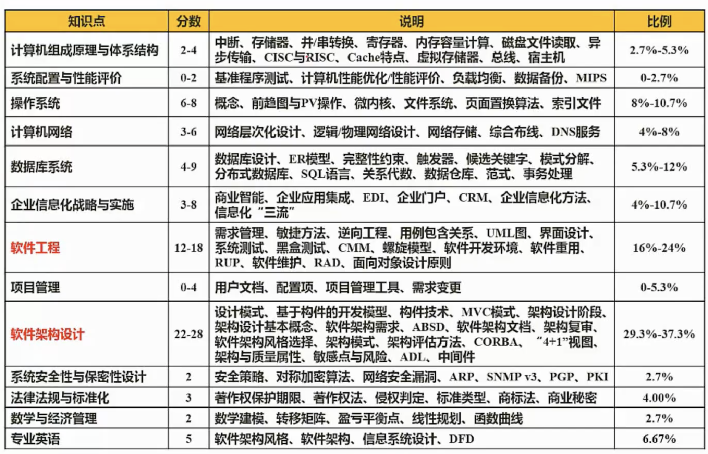
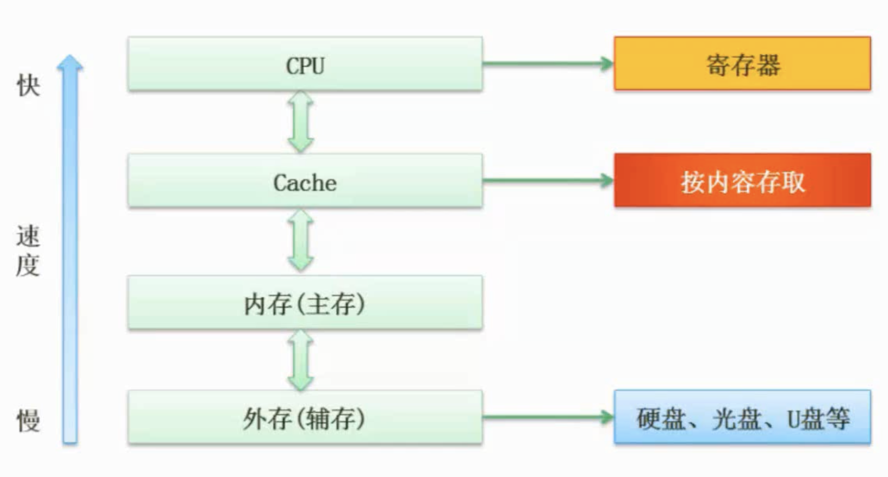
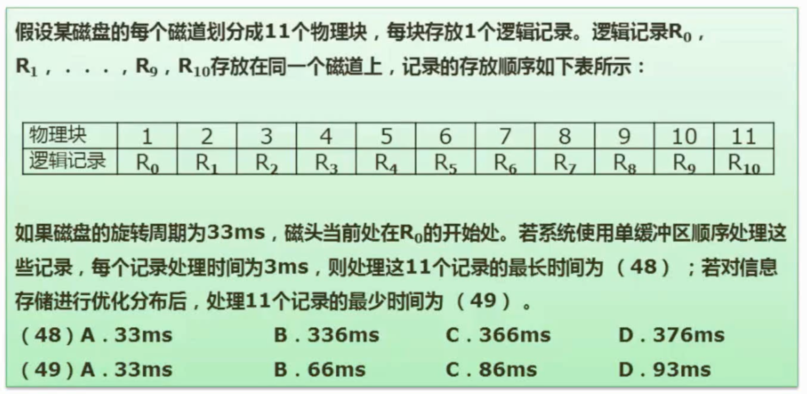

# 软考备考

## 计算机组成与体系结构

### Flynn分类法

|体系结构类型|结构|关键特性|代表|
|:--:|:--:|:--:|:--:|:--:|
|单指令流单数据流(SISD)|控制部分:一个 处理器:一个 主存模块:一个||单处理器系统|
|单指令流多数据流(SIMD)|控制部分:一个 处理器:多个 主存模块:多个|各处理器以异步的形式执行同一条指令|并行处理机 阵列处理机 超级向量处理机|
|多指令流单数据流(MISD)|控制部分:多个 处理器:一个 主存模块:多个|被证明不可能，至少是不实际|目前没有，有文献称流水线计算机为此类|
|多指令多数据流(MIMD)|控制部分:多个 处理器:多个 主存模块:多个|能够实现作业、任务、指令等各级全面并行|多处理机系统 多计算机|

* 阵列处理机：适合数组类的运算，比如二维数组

### CISC与RISC

|指令系统类型|指令|寻址方式|实现方式|其它|
|:--:|:--:|:--:|:--:|:--:|
|CISC(复杂)|数量多，使用频率差别大，可变长格式|支持多种|微程序控制技术(微码)|研制周期长|
|RISC(精简)|数量少，使用频率接近，订长格式，大部分为单周期指令，操作寄存器，只有Load/Store操作内存|支持方式少|增加了通用寄存器；硬布线逻辑控制为主；适合采用流水线|优化编译，有效支持高级语言|

### 流水线

### 存储系统

#### Cache

> 提高CPU数据输入输出的速率，突破冯·诺伊曼瓶颈，即CPU与存储系统间数据传送贷款的限制

* 在计算机存储系统体系中，Cache是访问速度最快的层次(因寄存器在CPU中，大多数时候未将寄存器放在存储体系中讨论，<front color="red">最快的有寄存器选寄存器，没有选Cache</front>)
* 使用Cache改善性能的依据是程序的局部性原理

如果以$h$代表对Cache的访问命中率，$t_1$表示Cache的周期时间，$t_2$表示主存储器周期时间，以读操作为例，使用“Cache+主存储器”的系统的平均周期为$t_3$，则:
$$t_3=h\times t_1 +(1-h)\times t_2$$
其中，$(1-h)$又称为失效率(未命中率)

#### 局部性原理

* 时间局部性
* 空间局部性
* 工作集理论：工作集是进程运行时被频繁访问的页面集合

#### 主存

##### 分类

* 随机存取存储器:掉电信息丢失
  * DRAM(Dynamic RAM, 动态RAM) -SDRAM
  * SRAM(Static RAM, 静态RAM)

* 只读存储器:掉电信息不丢失
  * MROM(Mask ROM，掩模式ROM)
  * PROM(Programmable ROM，一次可编程ROM)
  * EPROM(Erasable PROM，可擦除的PROM)
  * 闪速存储器(flash memory，闪存)

##### 编址

![主存编制]（架构设计师备考//主存编制.png）

#### 例题
内存地址从AC000H到C7FFFH，共有_K个地址单元，如果该内存地址按字(16bit)编址，由28片存储器芯片构成。已知构成此内存的芯片每片由16K个存储单元，则该芯片每个存储单元存储_位[^1]

#### 磁盘结构与参数
> 存取时间=寻道时间+等待时间(平均定位时间+转动延迟)
*寻道时间指磁头移动到磁道所需的时间；等待时间为等待读写的扇区转到磁头下方所用的时间*

#### 例题
[^2]
### 校验码
### 并行处理

## 系统配置与性能评价

### 性能指标
* 字长和数据通路宽度
* 主存容量和存取速度
* 运算速度
  * 主频与CPU时钟周期
  * CPI与IPC
  * MIPS与MFLOPS
    > $$MIPS = 指令条数/(执行时间\times 10^6)=主频/CPI=主频\times IPC$$
    > $$MFLOPS = 浮点操作次数/(执行时间\times 10^6)$$

* 吞吐量与吞吐率
* 响应时间与完成时间
* 兼容性
### 阿姆达尔解决方案

对系统中某组件采用某种更快的执行方式，所获得的系统性能的改变程度，取决于该组件被使用的频率，或所占总执行时间的比例。加速比计算公式如下：
$$R=\frac{T_p}{T_i}=\frac{1}{(1-F_e)+F_e/S_e}$$
其中，$T_p$表示不使用改进组件时完成整个任务的时间，$T_i$表示使用改进组件时完成整个任务的时间。
加速比主要取决于两个因素：
* 在原有的系统上，能被改进的部分在总执行时间中所占的比例。这个值称为改进比例，记为$F_e$，它总小于1
* 通过改进的执行方式所取得的性能提高，即如果整个系统使用了改进的执行方式，那么系统的执行速度会有多少提高，这个值等于在原来条件下系统执行时间与使用改进组件后系统的执行时间之比，记为$S_e$，它总大于1

#### 例题

在计算机系统中，某一功能的处理时间为整个系统运行时间的50%，若使该功能的处理速度加快10倍，根据Amdahl定律，这样做可以使整个系统的性能提高_倍。若要使整个系统的性能提高1.5倍，则该功能的处理速度应加快__倍。[^3]

### 性能评价方法
* 时钟频率法
> CPU、片面性极大，早期方式
* 指令执行速度法
> 单位时间执行指令数，片面性大(只衡量加法指令)
* 等效指令速度法(吉普森混合法)
> 每条指令使用概率乘以每条指令执行时间，相当于取平均值，依然局限在运算能力
* 数据处理速率法(PDR)
> 会考虑存储交互性
* 综合理论性能法(CTP)
> 考虑每一个处理部件、计算单元的有效计算率，根据字长调整，比较平衡地取得每个计算单位理论的性能值
* 基准程序法
  * Dhrystone基准程序
  * Linpack基准程序
  * Whetstone基准程序
  * SPEC基准程序(SPECmark、SPECint、SPECfp、SPECrate)
  * TPC基准程序
    * TPC-A：OLTP环境下的数据库和硬件性能
    * TPC-B：不包括网络的纯事务处理，模拟企业计算环境
    * TPC-C：联机订货系统
    * TPC-D、TPC-H、TPC-R：决策支持系统
    * TPC-E：大型企业信息服务系统
    * TPC-W：通过Internet进行市场服务和销售的商业行为

### 性能检测方法

* 软件监控：使用软件对系统性能数据进行采集分析，此方法会消耗较多的系统资源
* 硬件监控：使用专用硬件设备对系统性能进行采集分析，适用于高负载的计算机系统 

[^1]: 112、4
[^2]: C、B
[^3]: 1.8、3