# 软考备考


## 计算机组成与体系结构

### Flynn分类法

|体系结构类型|结构|关键特性|代表|
|:--:|:--:|:--:|:--:|:--:|
|单指令流单数据流(SISD)|控制部分:一个<br>处理器:一个<br>主存模块:一个||单处理器系统|
|单指令流多数据流(SIMD)|控制部分:一个<br>处理器:多个<br>主存模块:多个|各处理器以异步的形式执行同一条指令|并行处理机<br><font color="red">阵列处理机</font><br>超级向量处理机|
|多指令流单数据流(MISD)|控制部分:多个<br>处理器:一个<br>主存模块:多个|被证明不可能，至少是不实际|目前没有，有文献称流水线计算机为此类|
|多指令多数据流(MIMD)|控制部分:多个<br>处理器:多个<br>主存模块:多个|能够实现作业、任务、指令等各级全面并行|多处理机系统<br>多计算机|

* 阵列处理机：适合数组类的运算，比如二维数组

### CISC与RISC

|指令系统类型|指令|寻址方式|实现方式|其它|
|:--:|:--:|:--:|:--:|:--:|
|CISC(复杂)|数量多，使用频率差别大，可变长格式|支持多种|微程序控制技术(微码)|研制周期长|
|RISC(精简)|数量少，使用频率接近，订长格式，大部分为单周期指令，操作寄存器，只有Load/Store操作内存|支持方式少|增加了通用寄存器；硬布线逻辑控制为主；适合采用流水线|优化编译，有效支持高级语言|

### 流水线

### 存储系统

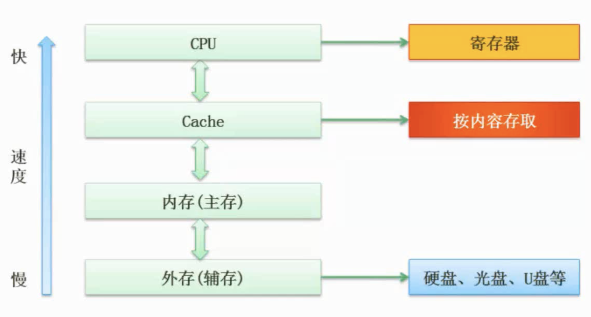

#### Cache

> 提高CPU数据输入输出的速率，突破冯·诺伊曼瓶颈，即CPU与存储系统间数据传送带宽的限制

* 在计算机存储系统体系中，Cache是访问速度最快的层次(因寄存器在CPU中，大多数时候未将寄存器放在存储体系中讨论，<font color="red">最快的有寄存器选寄存器，没有选Cache</font>)
* 使用Cache改善性能的依据是程序的局部性原理

如果以$h$代表对Cache的访问命中率，$t_1$表示Cache的周期时间，$t_2$表示主存储器周期时间，以读操作为例，使用“Cache+主存储器”的系统的平均周期为$t_3$，则:
$$t_3=h\times t_1 +(1-h)\times t_2$$
其中，$(1-h)$又称为失效率(未命中率)

#### 局部性原理

* 时间局部性
* 空间局部性
* 工作集理论：工作集是进程运行时被频繁访问的页面集合

#### 主存

##### 分类

* 随机存取存储器:掉电信息丢失
  * DRAM(Dynamic RAM, 动态RAM) -SDRAM
  * SRAM(Static RAM, 静态RAM)


* 只读存储器:掉电信息不丢失
  * MROM(Mask ROM，掩模式ROM)
  * PROM(Programmable ROM，一次可编程ROM)
  * EPROM(Erasable PROM，可擦除的PROM)
  * 闪速存储器(flash memory，闪存)

##### 编址

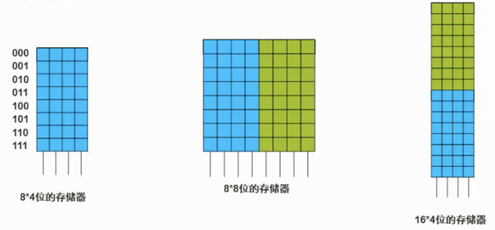

#### 例题
内存地址从AC000H到C7FFFH，共有_K个地址单元，如果该内存地址按字(16bit)编址，由28片存储器芯片构成。已知构成此内存的芯片每片由16K个存储单元，则该芯片每个存储单元存储_位[^1]

#### 磁盘结构与参数
> 存取时间=寻道时间+等待时间(平均定位时间+转动延迟)
*寻道时间指磁头移动到磁道所需的时间；等待时间为等待读写的扇区转到磁头下方所用的时间*

#### 例题[^2]

### 校验码
### 并行处理

## 系统配置与性能评价

### 性能指标
* 字长和数据通路宽度
* 主存容量和存取速度
* 运算速度
  * 主频与CPU时钟周期
  * CPI与IPC
  * MIPS与MFLOPS
    > $$MIPS = 指令条数/(执行时间\times 10^6)=主频/CPI=主频\times IPC$$
    > $$MFLOPS = 浮点操作次数/(执行时间\times 10^6)$$

* 吞吐量与吞吐率
* 响应时间与完成时间
* 兼容性
### 阿姆达尔解决方案

对系统中某组件采用某种更快的执行方式，所获得的系统性能的改变程度，取决于该组件被使用的频率，或所占总执行时间的比例。加速比计算公式如下：
$$R=\frac{T_p}{T_i}=\frac{1}{(1-F_e)+F_e/S_e}$$
其中，$T_p$表示不使用改进组件时完成整个任务的时间，$T_i$表示使用改进组件时完成整个任务的时间。
加速比主要取决于两个因素：
* 在原有的系统上，能被改进的部分在总执行时间中所占的比例。这个值称为改进比例，记为$F_e$，它总小于1
* 通过改进的执行方式所取得的性能提高，即如果整个系统使用了改进的执行方式，那么系统的执行速度会有多少提高，这个值等于在原来条件下系统执行时间与使用改进组件后系统的执行时间之比，记为$S_e$，它总大于1

#### 例题

在计算机系统中，某一功能的处理时间为整个系统运行时间的50%，若使该功能的处理速度加快10倍，根据Amdahl定律，这样做可以使整个系统的性能提高_倍。若要使整个系统的性能提高1.5倍，则该功能的处理速度应加快__倍。[^3]

### 性能评价方法
* 时钟频率法
> CPU、片面性极大，早期方式
* 指令执行速度法
> 单位时间执行指令数，片面性大(只衡量加法指令)
* 等效指令速度法(吉普森混合法)
> 每条指令使用概率乘以每条指令执行时间，相当于取平均值，依然局限在运算能力
* 数据处理速率法(PDR)
> 会考虑存储交互性
* 综合理论性能法(CTP)
> 考虑每一个处理部件、计算单元的有效计算率，根据字长调整，比较平衡地取得每个计算单位理论的性能值
* 基准程序法
  * Dhrystone基准程序
  * Linpack基准程序
  * Whetstone基准程序
  * SPEC基准程序(SPECmark、SPECint、SPECfp、SPECrate)
  * TPC基准程序
    * TPC-A：OLTP环境下的数据库和硬件性能
    * TPC-B：不包括网络的纯事务处理，模拟企业计算环境
    * TPC-C：联机订货系统
    * TPC-D、TPC-H、TPC-R：决策支持系统
    * TPC-E：大型企业信息服务系统
    * TPC-W：通过Internet进行市场服务和销售的商业行为

### 性能检测方法

* 软件监控：使用软件对系统性能数据进行采集分析，此方法会消耗较多的系统资源
* 硬件监控：使用专用硬件设备对系统性能进行采集分析，适用于高负载的计算机系统 

## 操作系统基本原理

### 进程管理
* 状态


* 前趋图
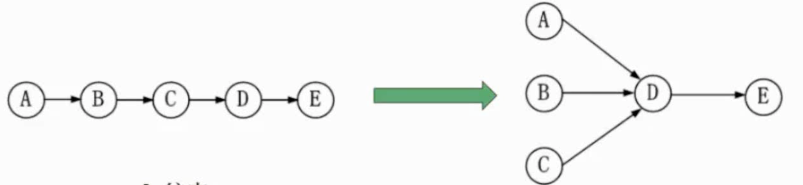
> 考虑哪些有先后，哪些可并行。前趋图描述一系列活动的先后约束关系。

* 同步与互斥
互斥：在同一时刻只允许一个进程使用一个资源
同步：速度有差异，在一定情况下等待
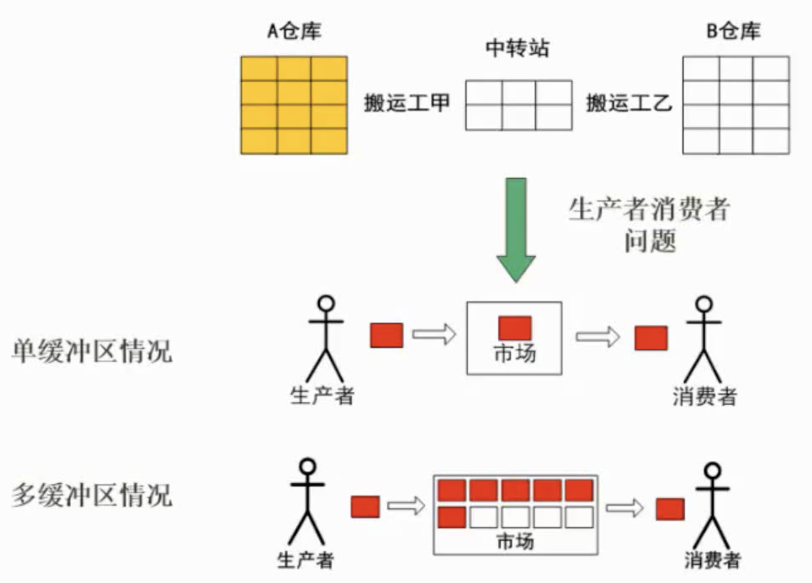

* PV 操作
> 临界资源：诸进程间需要互斥方式对其进行共享的资源，如打印机、磁带机等
> 临界区：每个进程中访问临界资源的那段代码称为临界区
> 信号量：一种特殊的变量(控制临界资源是否能够访问，为1其实就是锁)


单缓冲区生产者、消费者问题PV原语描述，S1初始值为1，S2初始值为0
```
生产者:
    生产一个产品;
    P(S1);
    送产品到缓冲区;
    V(S2);

消费者:
    P(S2);
    从缓冲区取产品;
    V(S1);
    消费产品;
```
* PV操作与前趋图结合


* 死锁问题
>一个进程等待一件不可能发生的事，则进程死锁。如果一个或多个进程产生死锁，就会造成系统死锁
四大条件：环路等待、互斥、保持和等待、不剥夺
死锁的预防：打破四大条件
死锁的避免：有序资源分配法、<font color="red">银行家算法</font>

* 银行家算法
> 当一个进程对资源的最大需求量不超过系统的资源数时可以接纳该进程
> 进程可以分期请求资源，但请求的总数不能超过最大需求量
> 当系统现有的资源不能满足进程尚需资源数时，对进程的请求可以推迟分配，但总能使进程在有限的时间里得到资源


#### 例题
* 例题1[^4]
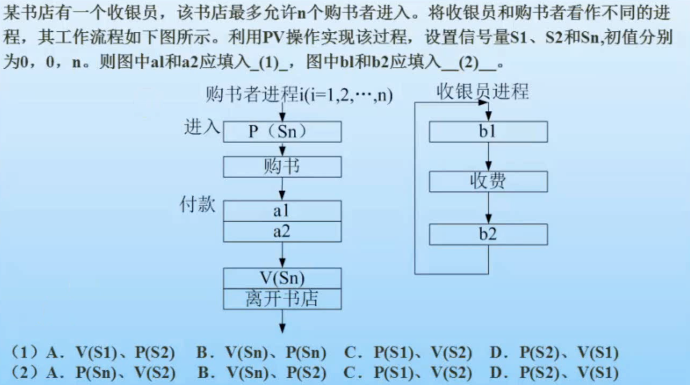
* 例题2[^5]

* 例题3[^6]

* 例题4[^7]
系统有3个进程，A、B、C。这3个进程都需要5个系统资源。则系统至少有多少个资源不可能发生死锁。
* 例题5[^8]
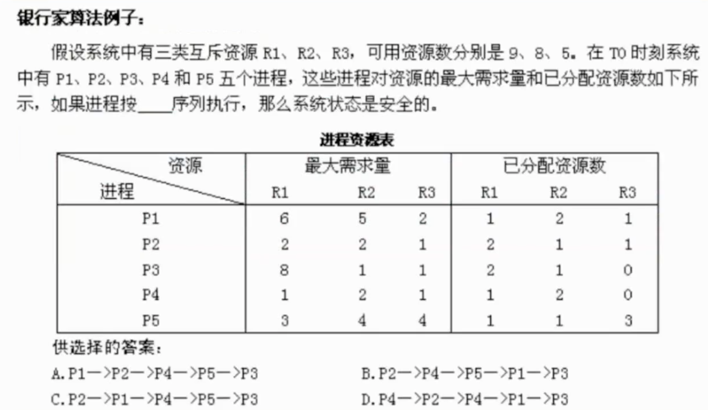

### 存储管理
#### 页式存储
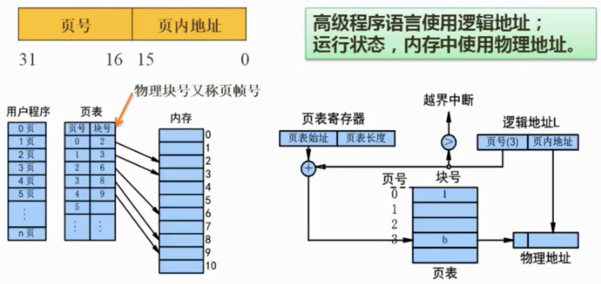
* 优点：利用率高，碎片小，分配及管理简单
* 缺点：增加了系统开销(查表)；可能产生抖动现象

#### 段式存储


#### 段页式存储
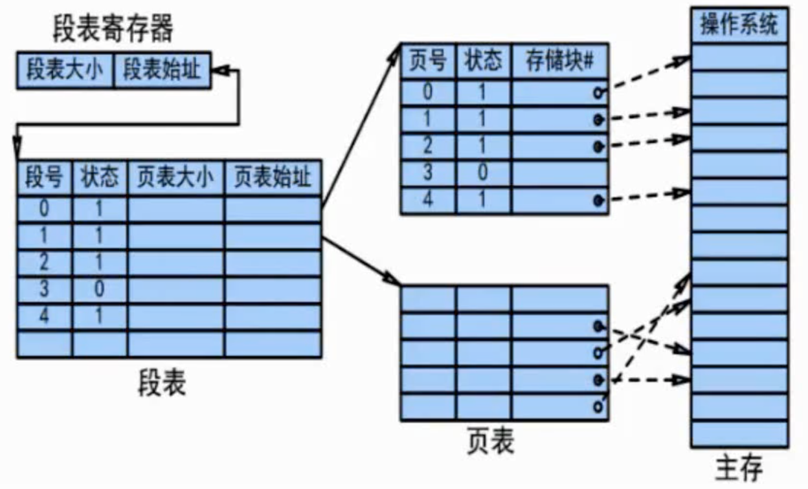
* 优点：空间浪费小，存储共享容易，存储保护容易，能动态链接
* 缺点：由于管理软件的增加，复杂性和开销也随之增加，需要的硬件以及占用的内容也有所增加，使得执行速度大大下降

#### 快表
快表是一块小容量的相联存储器(Associative Memory)，由高速缓存器组成，速度快，并且可以从硬件上保证按内容并行查找，一般用来存放当前访问最频繁的少数活动页面的页号。

#### 页面置换算法
* 最优(Optimal,OPT)算法
* 随机(RAND)算法
* <font color="red">先进先出(FIFO)算法</font>：有可能产生抖动。例如432143543215序列，用3个页面，比4个缺页要少

* <font color="red">最近最少使用(LRU)算法</font>：不会抖动
#### 例题
* 例题1[^9]
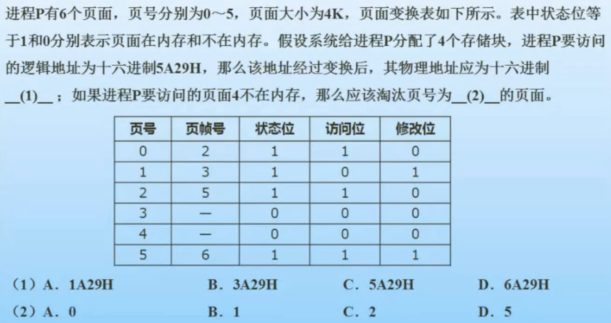
* 例题2[^10]

* 例题3[^11]


### 文件管理
#### 索引文件结构
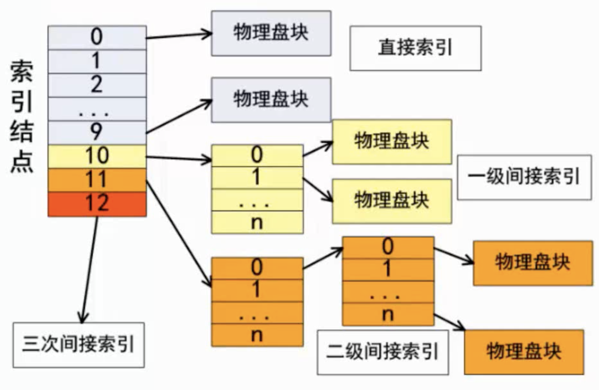

####  文件系统和树型目录结构
* 文件属性:只读文件属性(R)、存档属性(A)、系统文件(S)、隐藏文件(H)
* 文件名组成:驱动器号、路径、主文件名、扩展名
* <font color="red">绝对路径:是从盘符开始的路径</font>
* <font color="red">相对路径:是从当前路径开始的路径</font>

若当前路径为D1，要求F2路径，则绝对路径为：/D1/W2/F2，相对路径：W2/F2

#### 空闲存储空间的管理
* 空闲区表法(空闲文件目录)
* 空闲链表法
* <font color="red">位示图法</font>
* 成组连接法
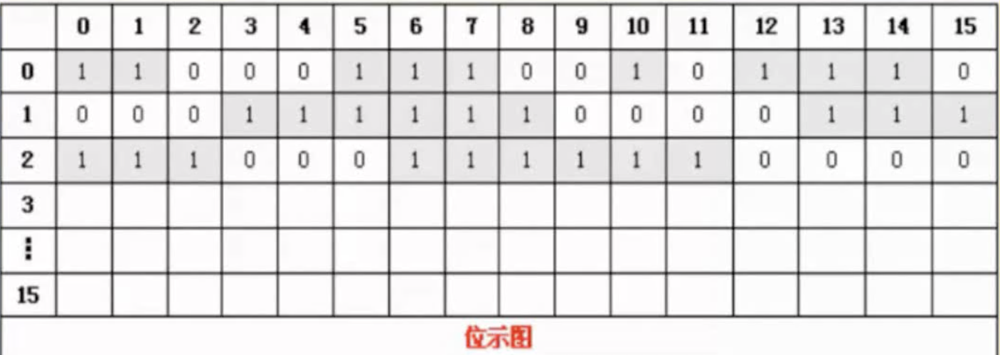
#### 例题
* 例题1[^12]


* 例题2[^13]
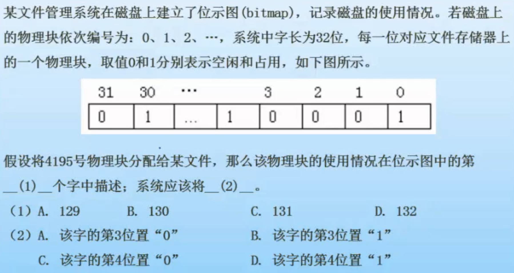

### 设备管理
#### 数据传输控制方式
*  <font color="red">程序控制方式</font>（程序查询方式）：最低级的，CPU介入最多--查询，外设处于被动
*  <font color="red">程序中断方式</font>：外设可以主动触发，效率更高
*  <font color="red">DMA方式</font>(直接存取控制方式)：由专门的DMA控制器控制外设与内存的数据交换
* 通道
* 输入输出处理机

### 微内核操作系统
||实质|优点|缺点|
|:--:|:--:|:--:|:--:|
|单体内核|将图形、设备驱动及文件系统等功能全部在内核中实现，运行在内核状态和同一地址空间|减少进程间通信和状态切换的系统开销，获得较高的运行效率|内核庞大，占用资源较多且不易裁剪<br/>系统的稳定性和安全性不好|
|微内核|只实现基本功能，将图形系统、文件系统、设备驱动及通信功能放在内核之外|内核精炼，便于裁剪和移植<br/>系统服务程序运行在用户地址空间，系统的可靠性、稳定性和安全性较高<br/>可用于分布式系统|用户状态和内核状态需要频繁切换，从而导致系统效率不如单体内核|
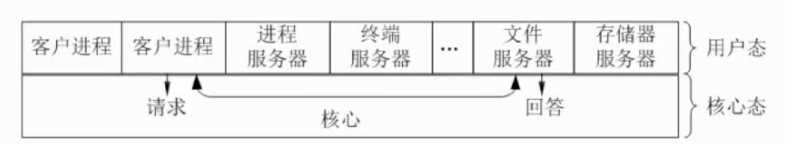

## 数据库系统
### 三级模式-两级映射


### 数据库设计过程


### E-R模型


* 集成的方法
  1. 多个局部E-R图一次集成
  2. 逐步集成，用累加的方式一次集成两个局部E-R
* 集成产生的冲突及解决方法
  1. 属性冲突：包括属性域冲突和属性取值冲突
  2. 命名冲突：包括同名异义和异名同义
  3. 结构冲突：包括同一对象在不同应用中具有不同的抽象，以及同一实体在不同局部E-R图中所包含的属性个数和属性排列次序不完全相同
* E-R模型转关系模式
  1. 一个实体转换为一个关系模式
  2. 1:1联系：最少可以转成2个关系模式，一个实体对应一个关系模式，将联系放入任何一个实体都可
  3. 1:n联系：最少可以转成2个关系模式，一个实体对应一个关系模式，可以把联系记录在n的一端
  4. m:n联系： 最少可以转成3个关系模式，一个实体对应一个关系模式，联系需要一个单独的关系模式记录

#### 例题
* 例题1[^14]


### 关系代数
> 并、交、差、<font color="red">笛卡尔积、投影、选择、联结</font>

* 交并差
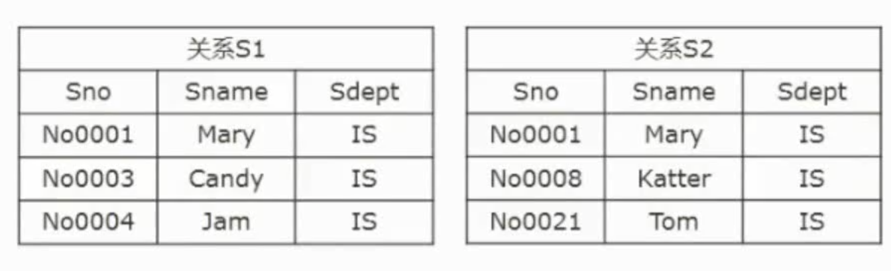
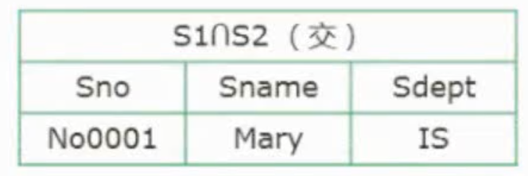

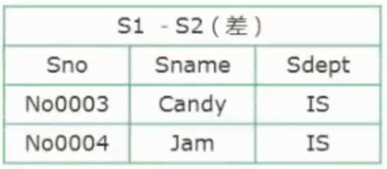

* 笛卡尔积、投影、选择


* 联结
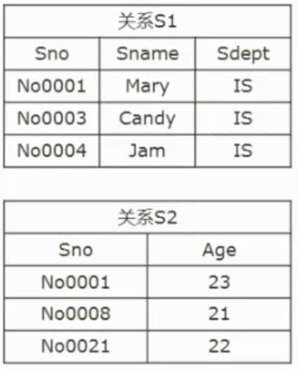


### 规范化理论
> 价值与用途：非规范化的关系模式，可能存在的问题包括：数据冗余，更新异常、插入异常、删除异常

#### 函数依赖
>设R(U)是属性U上的一个关系模式，X和Y是U的子集，r为R的任一关系，如果对于r中的任意两个元组u，v，只要有$u[X]=v[X]$，就有$u[Y]=v[Y]$,则称X函数决定Y，或称Y函数依赖于X，记为$X\rightarrow Y$

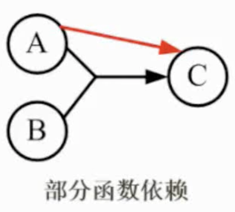


#### 键
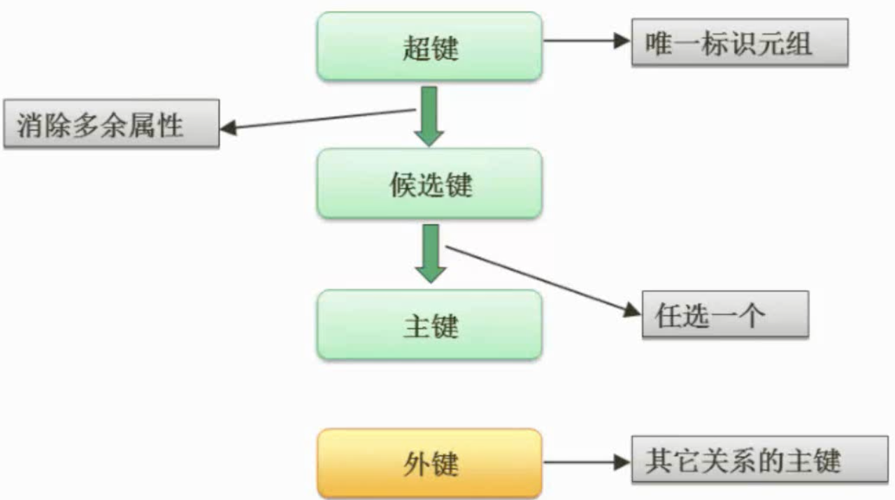
* 求解候选键
  1. 将关系模式的函数依赖关系用“有向图”的方式表示
  2. 找入度为0的属性，并以该属性集合为起点，尝试遍历有向图，若能正常遍历图中所有结点，则该属性集即为关系模式的候选键
  3. 若入度为0的属性不能遍历图中所有结点，则需要尝试性地将一些中间结点(即有入度，也有出度的结点)并入入度为0的属性集中，直至该集合能遍历所有结点，集合为候选键

##### 例题
* 例题1[^15]
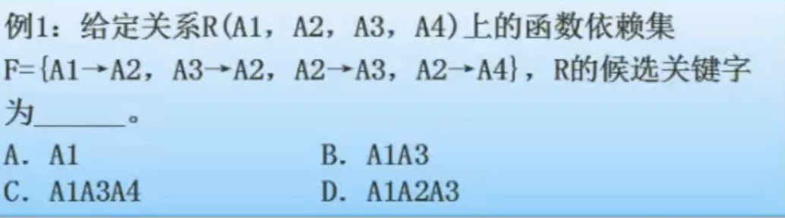
* 例题2[^16]

* 例题3[^17]
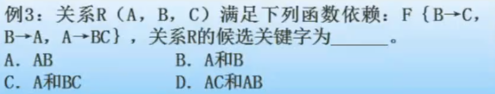

#### 范式
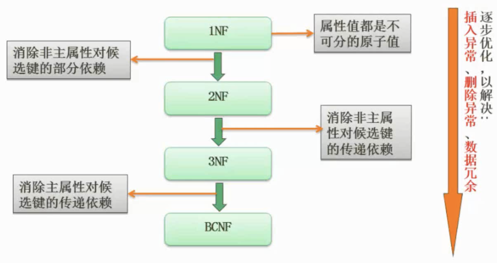

* 第一范式(1NF)：在关系模式R中，当且仅当所有域只包含原子值，即每个分量都是不可再分的数据项，则陈R是第一范式
* 第二范式(2NF)：当且仅当R是第一范式，且第一个非主属性完全依赖主键(<font color="red">不存在部分依赖</font>)时，则称R是第二范式
* 第三范式(3NF)：当且仅当R是1NF，且E中没有非主属性传递依赖的码时，则称R是第三范式
* BC范式(BCNF)：设R是一个关系模式，F是它的依赖集，R属于BCNF当且仅当其F中每个依赖的决定因素必定包含R的某个候选码

##### 例题
* 例题1[^18]


#### 模式分解
* <font color="red">保持函数依赖分解</font>
> 设数据库模式$\sigma = \{R1,R2,\dots,Rk\}$是关系模式R的一个分解，F是R上的函数依赖集，$\sigma$中每个模式Ri上的FD集是Fi。如果$\{F1,F2,\dots,Fk\}$与F是等价的(即相互逻辑蕴涵)，那么称分解$\sigma$保持FD。
* 无损分解
> 有损即不能还原，无损即可以还原

* 无损联接分解
>指将一个关系模式分解成若干个关系模式后，通过自然联接和投影等运算仍能还原到原来的关系模式。

定理：如果R的分解为$\sigma={R_1,R_2}$，F为R所满足的函数依赖集合，分解$\sigma$具有无损联接性的充分必要条件是：
$$R_1\cap R_2 \rightarrow (R_1-R_2)$$
或
$$R_1 \cap R_2 \rightarrow (R_2-R_1)$$
其中，$R_1\cap R_2 $表示模式的交，为$R_1$与$R_2$中公共属性组成，$R_1-R_2$或$R_2-R_1$表示模式的差集，$R_1-R_2$表示$R_1$中去除$R_1$和$R_2$的公共属性所组成。当模式R分解成两个关系模式$R_1$和$R_2$时，如果$R_1$与$R_2$的公共属性能函数决定$R_1$中或$R_2$中的其它属性，这样的分解就具有无损联接性。(<font color="red">只适用于一分为二的分解</font>)

##### 例题
* 例题1[^19]


* 例题2[^20]


### 并发控制
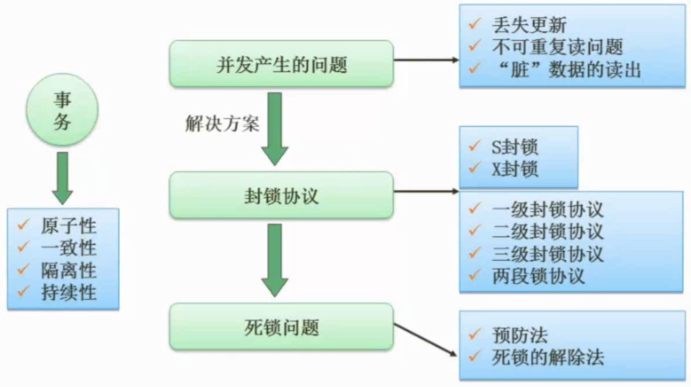

* 并发存在的问题
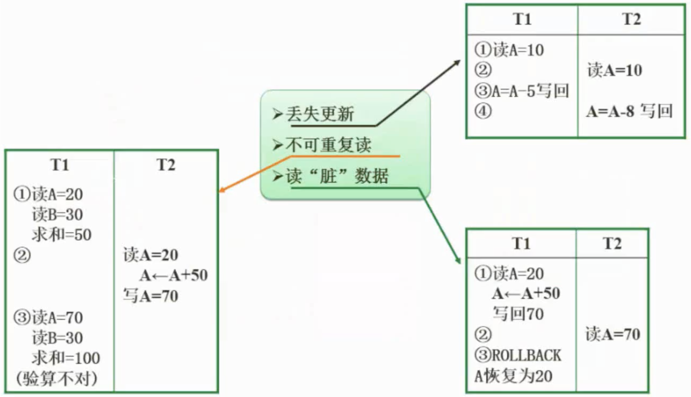

#### 封锁协议
* 一级封锁协议。事务T在修改数据R之前必须先对其加X锁，直到事务结束才释放。<font color="red">可防止丢失修改</font>
* 二级封锁协议。一级封锁协议加上事务T在读取数据R之前先对其加S锁，读完后即可释放S锁。<font color="red">可防止丢失修改，还可防止读“脏”数据</font>
* 三级封锁协议。一级封锁协议加上事务T在读取数据R之前先对其加S锁，直到事务结束才释放。<font color="red">可防止丢失修改，防止读“脏”数据与防止数据重复读</font>
* 两阶段协议。可串行化，可能发生死锁

### 数据库完整性约束
* 实体完整性约束：给数据表定义主键，约束的是主键的值不能为空和重复
* 参照完整性约束：外键完整性约束，允许为空
* 用户自定义完整性约束：可以设置属性值的要求
触发器：应对复杂的完整性约束，通过脚本约束一些复杂要求。上诉三种只能应付简单的要求。

### 数据库安全
|措施|说明|
|:--:|:--:|
|用户标识和鉴定|最外层的安全保护措施，可以使用用户账户、口令及随机数检验等方式|
|存取控制|对用户进行授权，包括操作类型（如查找、插入、删除、修改等动作）和数据对象（主要是数据范围）的权限|
|密码存储和传输|对远程终端信息用密码传输|
|视图的保护|对视图进行授权|
|审计|使用一个专用文件或数据库，自动将用户对数据库的所有操作记录下来|

### 数据备份

* 冷备份：也称静态备份，是将数据库正常关闭，在停止状态下，将数据库的文件全部备份(复制)下来
* 热备份：也称为动态备份，是利用备份软件，在数据库正常运行的状态下，将数据库中的数据文件备份出来

|备份方式|优点|缺点|
|:--:|:--|:--|
|冷备份|非常快速的备份方法(只需复制文件)；<br/>容易归档(简单复制即可)；<br/>容易恢复到某个时间点上(只需将文件再复制回去)；<br/>能与归档方法相结合，做数据库“最佳状态”的恢复；<br/>低度维护，高度安全|单独使用时，只能提供到某一时间点上的恢复；<br/>在实施备份的全过程中，数据库必须要作备份而不能做其它工作；<br/>若磁盘空间有限只能复制到磁带等其它外部存储设备上，速度会很慢；<br/>不能按表或按用户恢复|
|热备份|可在表空间或数据库文件级备份，备份时间短；<br/>备份时数据库仍可使用；<br/>可达到秒级恢复(恢复到某一时间点上)；<br/>可对几乎所有数据库实体做恢复；<br/>恢复是快速的|不能出错，否则后果严重；<br/>若热备份不成功所得结果不可用于时间点的恢复；<br>困难于维护，所以特别小心，不允许"以失败告终"|

* 完全备份：备份所有数据
* <font color="red">差量备份：仅备份上一次完全备份之后变化的数据</font>
* 增量备份：备份上一次备份之后变化的数据

#### 转储
* 静态海量转储：在系统中无运行事务时进行，每次转储全部数据库
* 静态增量转储：在系统中无运行事务时进行，每次只转储上一次转储后更新过的数据
* 动态海量转储：转储期间允许对数据库进行存取或修改，每次转储全部数据库
* 动态增量转储：转储期间允许对数据库进行存取和修改，每次只转储上一次转储后更新过的数据。

日志文件：事务日志是针对数据库改变所做的记录，它可以记录针对数据库的任何操作，并将记录结果保存在独立的文件中

### 数据库故障与恢复
|故障关系|故障原因|解决方法|
|:--:|:--:|:--:|
|事务本身的可预期故障|本身逻辑|在程序中预先设置RollBack语句|
|事务本身的不可预期故障|算术溢出、违反存储保护|由DBMS的恢复子系统通过日志，撤销事务对数据库的修改，回退到事务初始状态|
|系统故障|系统停止运转|通常使用检查点法|
|介质故障|外存被破坏|一般使用日志重做业务|

### 分布式数据库
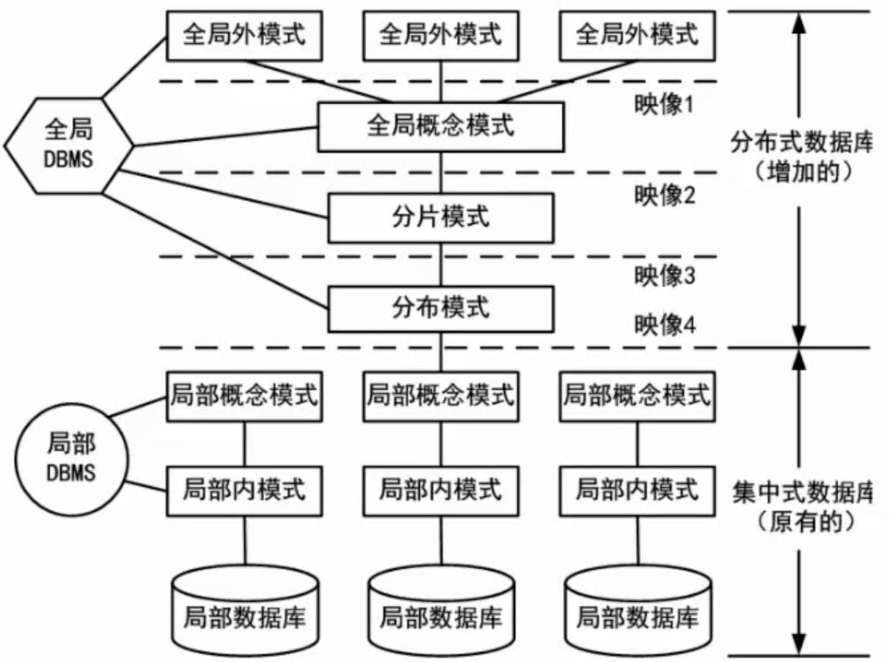
* 分布透明性
  * 分片透明性
    * 水平分片
    * 垂直分片
    * 混合分片
  * 位置透明性
  * 局部数据模型透明性
* 分布式数据库管理系统-组成
  * LDBMS
  * GDBMS
  * 全局数据字典
  * 通信管理(CM)
* 分布式数据库管理系统-结构
  * 全局控制集中的DDBMS
  * 全局控制分散的DDBMS
  * 全局控制部分分散的DDBMS

### 数据库优化
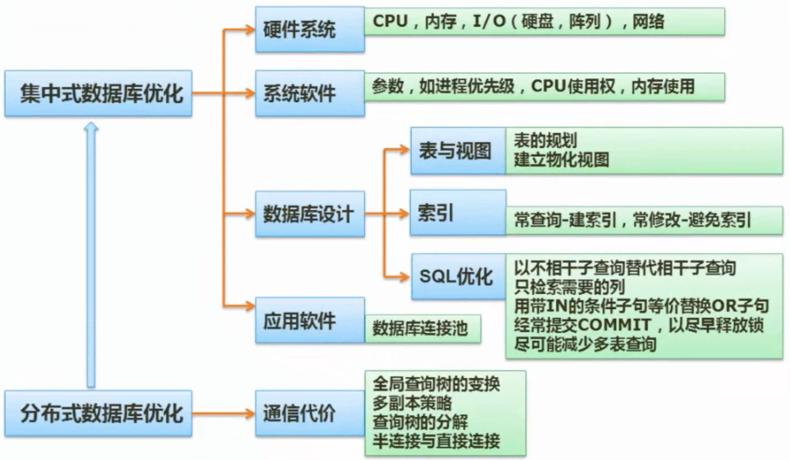

### 数据仓库与数据挖掘
* 面向主题
* 集成的
* 相对稳定的(非易失的)
* 反映历史变化


#### 数据挖掘方法分类
* 方法
  * 决策树
  * 神经网络
  * 遗传算法
  * 关联规则挖掘算法
* 分类
  * 关联分析：挖掘出隐藏在数据间的相互关系
  * 序列模式分析：侧重点是分析数据间的前后关系(因果关系)
  * 分类分析：为每一个记录赋予一个标记再按标记分类
  * 聚类分析：分类分析法的逆过程
  
### 联邦数据库
>联邦数据库系统(FDBS)是一个彼此协作却又相互独立的成员数据库(CDBS)的集合，它将成员数据库系统按不同程度进行集成，对该系统整体提供控制和协同操作的软件叫做联邦数据库管理系统(FDBMS)


* 联邦数据库特征
  * 分布性
  * 异构性
  * 自治性
  * 透明性
* 联邦数据库分类
  * 紧耦合
  * 松耦合

### NoSQL
||关系数据库模式|NoSQL模式|
|:--:|:--:|:--|
|并发支持|支持并发、效率低|并发性能高|
|存储与查询|关系表方式存储、SQL查询|海量数据存储、查询效率高|
|扩展方式|向上扩展，升级服务器|向外扩展，扩展集群|
|索引方式|B树、哈希等|键值索引|
|应用领域|面向通用领域|特定应用领域|

* 缺点(存疑，目前已经算是比较成熟)
* 成熟度不够，大量关键特性有待实现
* 开源数据库产品的支持力度有限
* 数据挖掘与商务智能支持不足，现有的产品无法直接使用NoSQL数据库
* NoSQL数据库专家较少，大部分都处于学习阶段
> SQL + NoSQL = MoreSQL/NewSQL

*Redis、MongoDB、Flare...*

### 反规划化
> 由于规范化会使表不断地拆分，从而导致数据表过多。这样虽然减少了数据冗余，提高了增、删、改的速度，但会增加查询的工作量。系统需要进行多次连接，才能进行查询操作，使得系统效率大大下降。

* 技术手段
  * 增加派生性冗余列
  * 增加冗余列
  * 重新组表
  * 分割表

### 大数据基本概念
> 数据量(Volume)、速度(Velocity)、多样性(Variety)、值(Value)

|比较纬度|传统数据|大数据|
|:--:|:--:|:--:|
|数据量|GB或TB级|PB级或以上|
|数据分析需求|现有数据的分析和检测|深度分析(关联分析、回归分析)|
|硬件平台|高端服务器|集群平台|

* <font color="red">大数据处理系统应具有的重要特性</font>
  * 高度可扩展性
  * 高性能
  * 高度容错
  * 支持异构环境
  * 较短的分析延迟
  * 易用且开放的接口
  * 较低成本
  * 向下兼容性

## 计算机网络
### OSI/RM七层模型
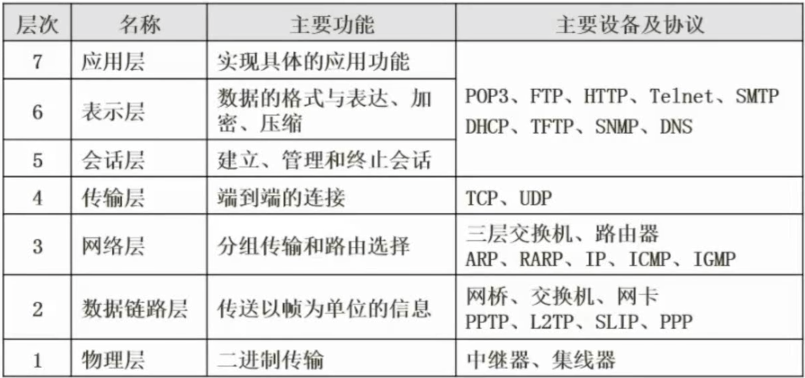
#### 例题
* 例题1[^21]


### 网络技术标准与协议
* TCP/IP协议：Internet，可扩展，可靠，应用最广，牺牲速度和效率
* IPX/SPX协议：NOVELL，路由，大型企业网
* NETBEUI协议：IBM，非路由，快速


* TCP
  * 三次握手
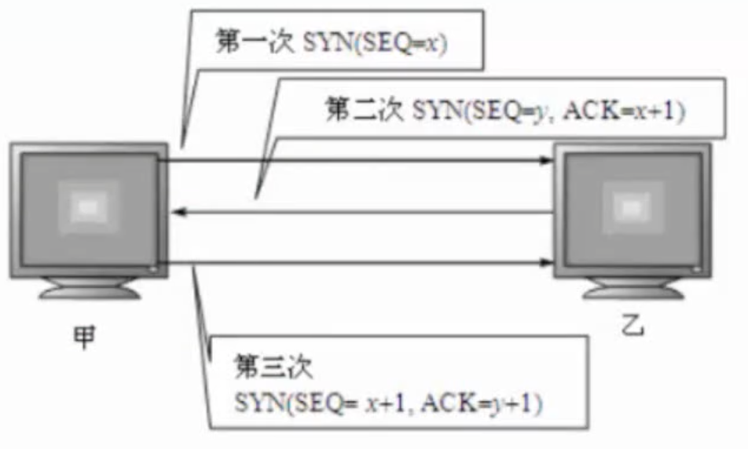
  * 可靠传输
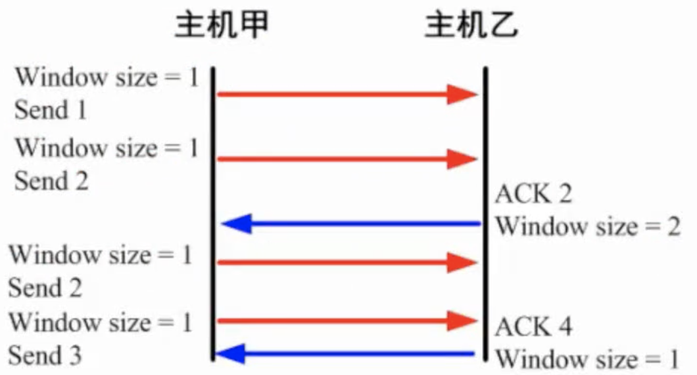

* DHCP
  1. 客户机/服务器模型
  2. 租约默认为8天
  3. 当租约过半时，客户机需要向DHCP服务器申请续租
  4. 当租约超过87.5%时，如果仍然没有和当初提供IP的DHCP服务器联系上，则开始联系其他的DHCP服务器
  5. 固定分配、动态分配和自动分配
  6. 169.254.X.X（Windows）和0.0.0.0（Unix）说明未和DHCP服务器联系上

* DNS协议
  * 递归查询：服务器必须回答目标IP与域名的映射关系。<font color="red">主机向本地域名服务器的查询采用递归查询</font>
  * 迭代查询：服务器收到一次迭代查询回复一次结果，这个结果不一定是目标IP与域名的映射关系，也可以是其它DNS服务器的地址。<font color="red">本地域名服务器向根域名服务器的查询**通常采用**迭代查询</font>
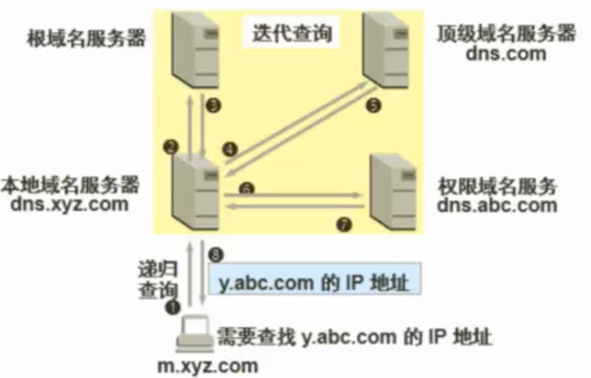

#### 例题
* 例题1[^22]
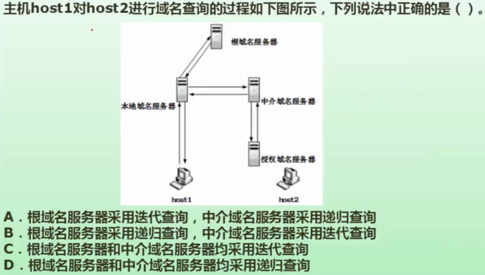

### 网络规划与设计
* 网络规划原则
  * 实用性原则
  * 开放性原则
  * 先进性原则
* 网络设计任务
  * 确定网络总体目标
  * 确定总体设计原则
  * 通信子网设计
  * 资源子网设计
  * 设备选型
  * 网络操作系统与服务器资源设备
  * 网络安全设计
* 网络设计原则
  * 可用性：指网络或网络设备可用于执行预期任务时间所占总量的百分比
  * 可靠性：网络设备或计算机持续执行预定功能的可能性
  * 可恢复性：指网络从故障中恢复的难易程度和时间
  * 适应性：指在用户改变应用要求时网络的应变能力
  * 可伸缩性：指网络技术或设备随着用户需求的增长而扩充的能力
* 网络实施原则
  * 可靠性原则
  * 安全性原则
  * 高效性原则
  * 可扩展性原则
* 网络实施步骤
  * 工程实施计划
  * 网络设备到货验收
  * 设备安装
  * 系统测试
  * 系统试运行
  * 用户培训
  * 系统转换

#### 逻辑设计
> 利用需求分析和现有网络体系分析的结果来设计逻辑网络结构，最后得到一份逻辑网络设计文档

* 逻辑网络设计图
* IP地址方案
* 安全方案
* 具体的软硬件、广域网连接设备和基本服务
* 招聘和培训网络员工的具体说明
* 对软硬件、服务、员工和培训的费用初步估计

#### 物理网络设计
> 物理网络设计是对逻辑网络设计的物理实现，通过对设备的具体物理分布、运行环境等确定，确保网络的物理连接服务逻辑连接的要求

* 网络物理结构图和布线方案
* 设备和部件的详细列表清单
* 软硬件和安装费用的估算
* 安装日程表，详细说明服务的时间以及期限
* 安装后的测试计划
* 用户的培训计划

#### 分层设计
* 接入层：向本地网段提供用户接入
* 汇聚层：网络访问策略控制、数据包处理、过滤、寻址
* 核心层：数据交换

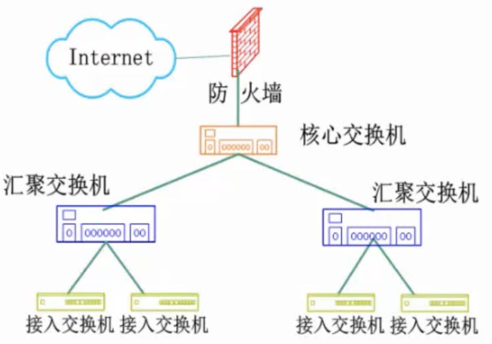

### 无线网
* 分类
  * 无线局域网(WLAN,802.11,WI-FI)
  * 无线城域网(WMAN,802.16,WiMax)
  * 无线广域网(WWAN,3G/4G)
  * 无线个人网(WPAN,802.15,Bluetooth)

* 优势
  * 移动性
  * 灵活性
  * 成本低
  * 容易扩充

* 无线局域网接入方式
  * 有接入点模式
  * 无接入点模式(对等模式)

### 网络接入技术
* 有限接入
  * 公用交换电话网络(PSTN)-(POS机，传真)
  * 数字数据网(DDN)
  * 综合业务数字网(ISDN)
  * 非对称数字用户线路(ADSL)-<font color="red">介质是电话线，上下行不等</font>
  * 同轴光纤技术(HFC)-<font color="red">有线电视网络</font>

* 无线接入
  * IEEE 802.11(WiFi)
  * IEEE 802.15(蓝牙Bluetooth)
  * 红外(IrDA)
  * WAPI

* 3G
  * WCDMA
  * CDMA2000
  * TD-SCDMA

* 4G
  * LET-Advanced
    * TDD(时分):由TD-SCDMA发展而来
    * FDD(频分):由WCDMA发展而来
  * WirelessMAN- Advanced(802.16m)(WiMAX)

### 网络存储技术
#### 分类
* 直连式存储(DAS)：服务器直接和存储相连，可以接磁盘阵列，最原始的一种方式，适用于数据量不大，业务不复杂的场景
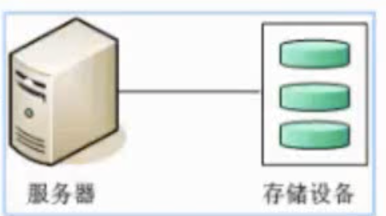

* 网络附加存储(NAS)：存储附加于网络之上，<font color="red">即插即用的存储</font>，是一台存储服务器。<font color="red">网络在某些时间节点很繁忙，是由于NAS未将存储网络和业务网络分开导致</font>
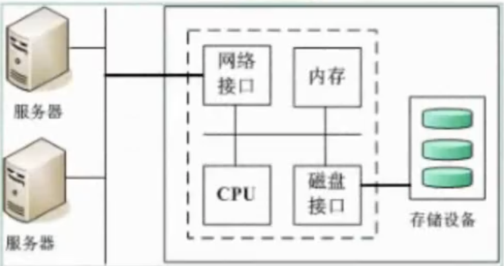

* 存储区域网络(SAN)：将业务网络和存储网络完全分开，存储网络使用光纤网络，速率远高于IP网络，<font color="red">是首次提出业务网络和存储网络分开的技术</font>，性能卓越，<font color="red">缺点只有成本高</font>
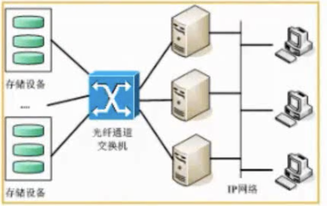

* IPSAN(iSCSI)：SAN的廉价方案，性能比SAN低
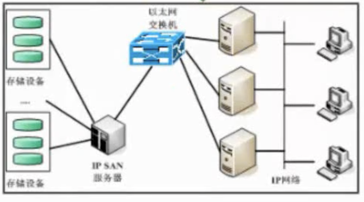

#### Raid
* <font color="red">Raid0(条块化)</font>:性能最高，并行处理，无冗余，损坏无法恢复
* <font color="red">Raid1(镜像结构)</font>:可用性，可恢复性好，仅有50%利用率
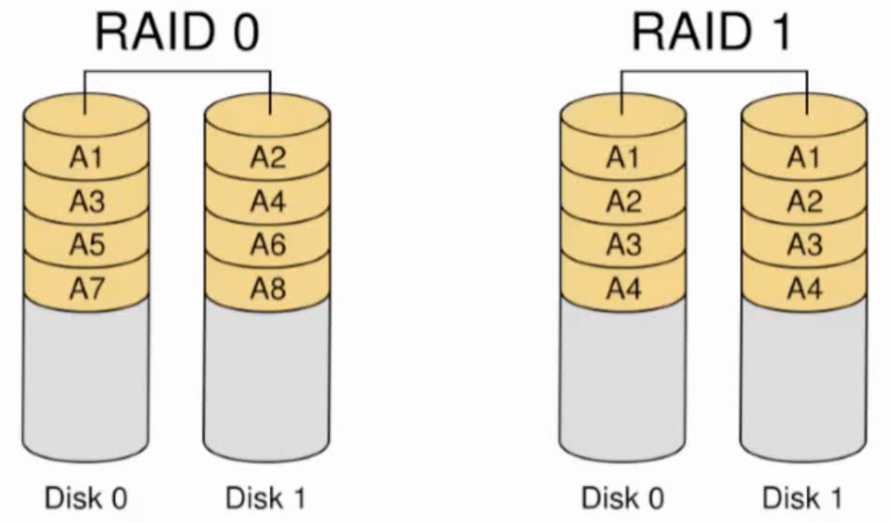
> Raid0磁盘利用率为100&，访问速度最快。Raid1磁盘利用率为50%，具备纠错功能。现在企业采用Raid0+1

* <font color="red">Raid0+1(Raid10)</font>:Raid0与Raid1长处的结合，高效也可靠，利用率也只有50%
* Raid3(奇偶校验并行传送): N+1模式，有固定的校验盘，坏一个盘可恢复
* <font color="red">Raid5(分布式奇偶校验的**独立磁盘**)</font>: N+1模式，无固定的校验盘，坏一个盘可恢复(相比Raid3，优势在于降低整个系统的磁盘出错损坏的概率)
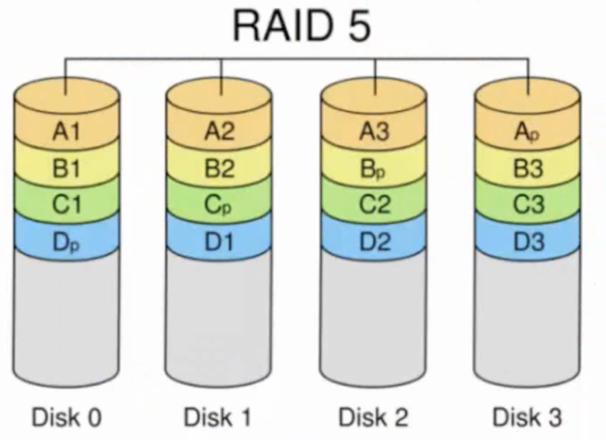
> Raid5磁盘利用率为(n-1)/n，具有容错功能

* Raid6(两种存储的奇偶校验):N+2模式，无固定的校验盘，坏两个盘可恢复

### IPv6
>IPv6是设计用于替代现行版本IP协议(IPv4)的下一代IP协议

* 特点
  * IPv6地址长度为128位，<font color="red">地址空间增大了$2^{96}$倍</font>
  * 灵活的IP报文头部格式。使用一系列固定格式的扩展头部取代了IPv4种可变长度的选项字段。IPv6中选项部分的出现方式也有所变化，是路由器可以简单路过选项而不做任何处理，加快了报文处理速度
  * IPv6简化了报文头部格式，字段只有8个，加快报文转发，提高了吞吐量
  * 提高安全性。身份认证和隐私权是IPv6的关键特性
  * 支持更多的服务类型
  * 允许协议继续演变，增加新的功能，使之适应未来技术的发展

* 地址分类
  * 单播地址(Unicast):用于单个接口的标识符
  * 任播地址(Anycast):泛播地址。一组接口的标识符，<font color="red">IPv4广播地址</font>
  * 组播地址(Multicast):IPv6的组播在功能上与IPv4中的组播类似

### 物联网
>物联网(The Internet of Things)是实现物物相连的互联网络，其内涵包含两个方面：第一，物联网的核心和基础仍然是互联网，是在互联网基础上延伸和扩展的网络；第二，其用户端延伸和扩展到了任何物体与物体之间，使其进行信息交换和通信

* 感知层：识别物体、采集信息。如：二维码、RFID、摄像头、传感器
* 网络层：传递信息和处理信息。通信网与互联网的融合网络、网络管理中心、信息中心和智能处理中心等
* 应用层：解决信息处理和人机交互的问题
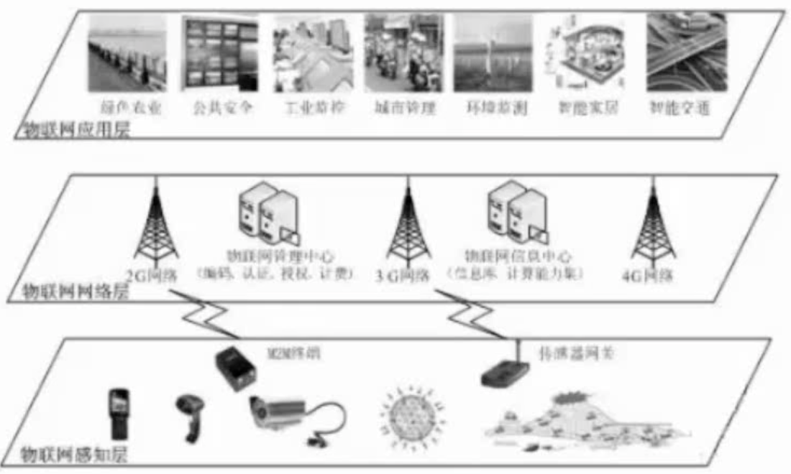

* RFID
> 射频识别技术(Radio Frequency Identification,RFID)，又称电子标签，是一种通信技术，可通过无线电讯号识别特定目标并读写相关数据，而无需识别系统与特定目标之间建立机械或光学接触。该技术是物联网的一项核心技术，很多物联网应用都离不开它。

> RFID的基本组成部分通常包括：标签、阅读器、天线

* 二维码

>二维码是用某种特定的几何图形按一定规律在平面(二维方向上)分布的黑白相间的图形记录数据符号信息的。在代码编制上巧妙地利用构成计算机内部逻辑基础的0、1比特流的概念，使用若干个与二进制相对应的几何形体来表示文字数值信息，通过图像输入设备或光电扫描设备自动识读以实现信息自动处理

二维码常用的码制有：Data Matrix,Maxi Code,Aztec,QR Code,Vericode,PDF417,U1tacode,Code 49,Code 16k
  * PDF417
    * 若采用扩展的字母数字压缩格式，可容纳1850个字符
    * 若采用二进制/ASCII格式，可容纳1108个字节
    * 若采用数字压缩格式，可容纳2710个数字

* 传感网
> 传感网是由随机分布的，集成有传感器(传感器有很多种类型，包括：温度、湿度、速度、气敏等)、数据处理单元和通信单元单元的微小节点，通过自组织的方式构成无线网络

* M2M
> M2M是将数据从一台终端传送到另一台终端，也就是机器与机器(Machine to Machine)的对话。但从广义上M2M可代表机器对机器(Machine to Machine)、人对机器(Man to Machine)、机器对人(Machine to Man)、移动网络对机器(Mobile to Machine)之间的连接和通信，它涵盖了所有实现在人、机器、系统之间建立通信连接的技术和手段

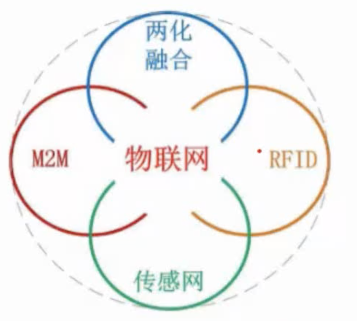

### 云计算
> 云计算是一种基于互联网的计算方式，通过这种方式，共享的软硬件资源和信息可以按需提供给计算机和其它设备。云其实是网络、互联网的一种比喻说法。云计算的核心思想，是将大量用网络连接的计算资源统一管理和调度，构成一个计算资源池向用户按需服务。提供资源的网络被称为"云"。

* 狭义云计算指<font color="red">IT基础设施</font>的交付和使用模式，指通过网络以按需、易扩展的方式获取所需资源
* 广义云计算指<font color="red">服务</font>的交付和使用模式，指通过网络以按需、易扩展的方式获得所需服务。这种服务可以是IT和软件、互联网相关、也可是其他服务
* 特点
  * 集合了大量计算机，规模达到成千上万
  * 多种软硬件技术相结合
  * 对客户端设备的要求低
  * 规模化效应


* 类型
  * 软件即服务(SaaS)
  * 平台即服务(PaaS)
  * 基础设施即服务(IaaS)
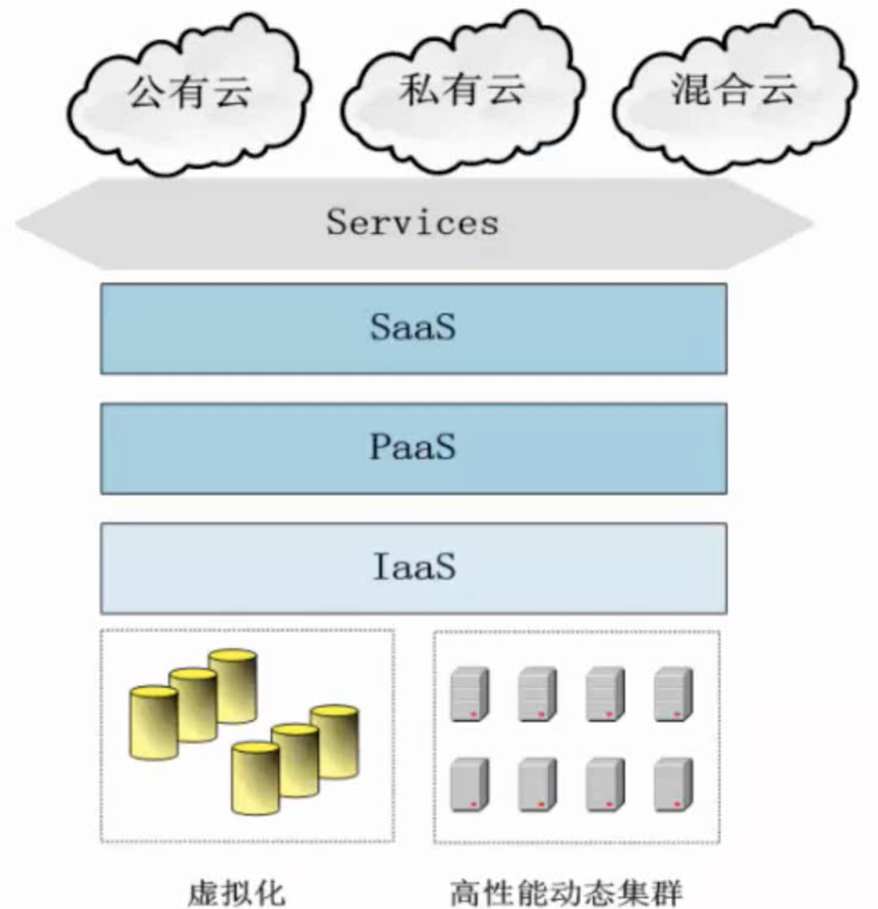

* 应用
  * 存储服务
  * 搜索
  * 科学计算
  * 安全应用
  * 软件即服务

## 企业信息化战略与实施
### 信息与信息化的概念
* 信息
  * 维纳(Norber Wiener)：信息就是信息，既不是物质也不是能量
  * 香农(Claude E.Shannon)：信息就是不确定性的减少
  * 哲学界：信息是事物普遍联系的方式
  * 其它：信息是事先不知道的报导

* 信息化
  * 信息化就是计算机、通信和网络技术的现代化
  * 信息化就是从物质生产占主导地位的社会向信息产业占主导地位社会转变的发展过程
  * 信息化就是从工业社会向信息社会演进的过程

### 信息系统的概念
> 系统指多个元素有机地结合在一起，执行特定的功能以达到特定目标的集合体
> <font color="red">信息系统是输入数据，通过加工处理，产生信息的系统</font>，可以是人工的，手动的

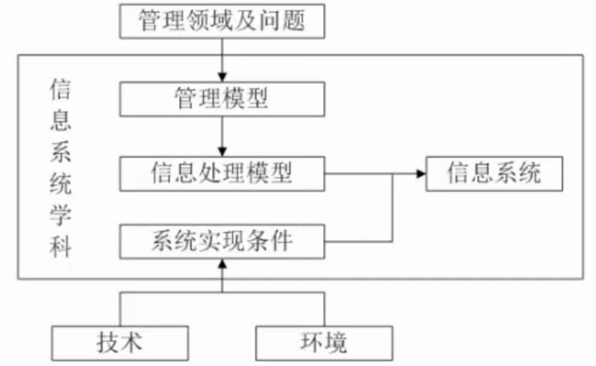

### 信息系统类型
* 数据环境分类
  * 数据文件
  * 应用数据库：比数据文件的好处<font color="red">不用管具体操作，只需告诉要做什么；便于共享</font>
  * 主题数据库
    * 面向业务主题
    * 信息共享
    * 一次一处输入系统
    * 由基本表组成
  * 信息检索系统

* 应用层次分类
  * 战略级(企业最高管理层)
  * 战术级(企业中层经理及其管理部门)
  * 操作级(服务型企业的业务部门)
  * 事务级(企业的管理业务人员)

### 信息系统战略规划-方法
> 以<font color="red">数据处理为核心</font>围绕职能部门需求

* 企业系统规划法(BSP):通过大量调研了解企业战略目标，通过战略目标拆分，得到一些过程和需要处理的数据，然后进行表格转换。用到了多种矩阵，比如UC矩阵，找出数据和过程相关性
* 关键成功因素法(CSF):有目的地找企业的关键成功因素
* 战略集合转化法(SST):企业战略是指导信息系统战略的一个前提，把企业战略相关的集合转化成信息战略的集合
**三种方法结合使用称为BCS方法**


> 以<font color="red">企业内部MIS为核心</font>围绕企业整体需求

* 战略数据规划法(SDP):以BSP为基础，规划企业全局数据，提出主题数据库的概念
* 信息工程法(IE):以BSP为基础，融合SDP。其不仅仅是一门方法，<font color="red">还是一门工程学科，把信息系统开发过程进行了工程化</font>
* ~~战略栅格法(SG):使用2X2矩阵，从战略影响方面标出企业现有和未来的信息系统组合的特征。对企业生存前景的影响做分析~~

> 综合考虑企业内外环境，以<font color="red">集成为核心</font>，围绕企业战略需求

* 价值链分析法(VCA)
* 战略一致性模型(SAM)

### 政府信息化与电子政务
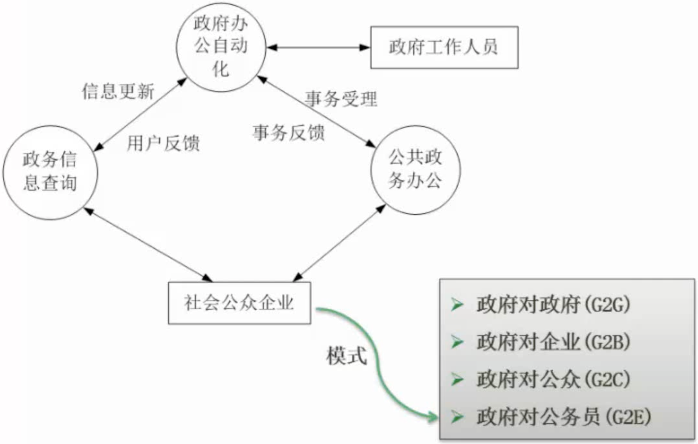

### 企业信息化与电子商务
#### 企业资源计划(ERP)
* 财会管理
  * 会计核算
    * 总账
    * 应收账
    * 应付账
    * 现金
    * 固定资产
    * 多币制
  * 财务管理
    * 财务计划
    * 控制
    * 分析
    * 预测
* 物流管理
  * 分销管理
  * 库存控制
  * 采购管理
* 生产控制管理
  * 主生产计划
  * 物料需求计划
  * 能力需求计划
  * 车间控制
  * 制造标准
* 人力资源管理
  * 人力资源规划
  * 招聘管理
  * 工资核算
  * 工时管理
  * 差旅费核算

#### 客户关系管理(CRM)
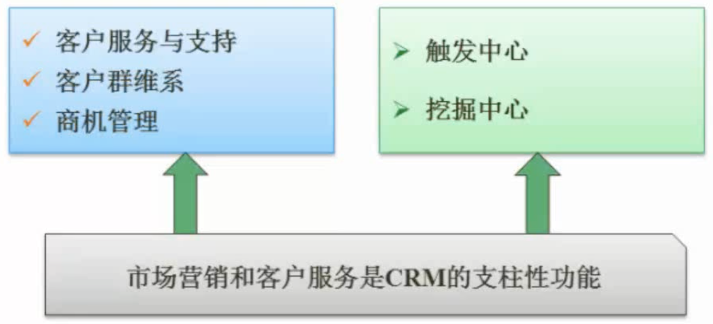

#### 供应链管理(SCM)
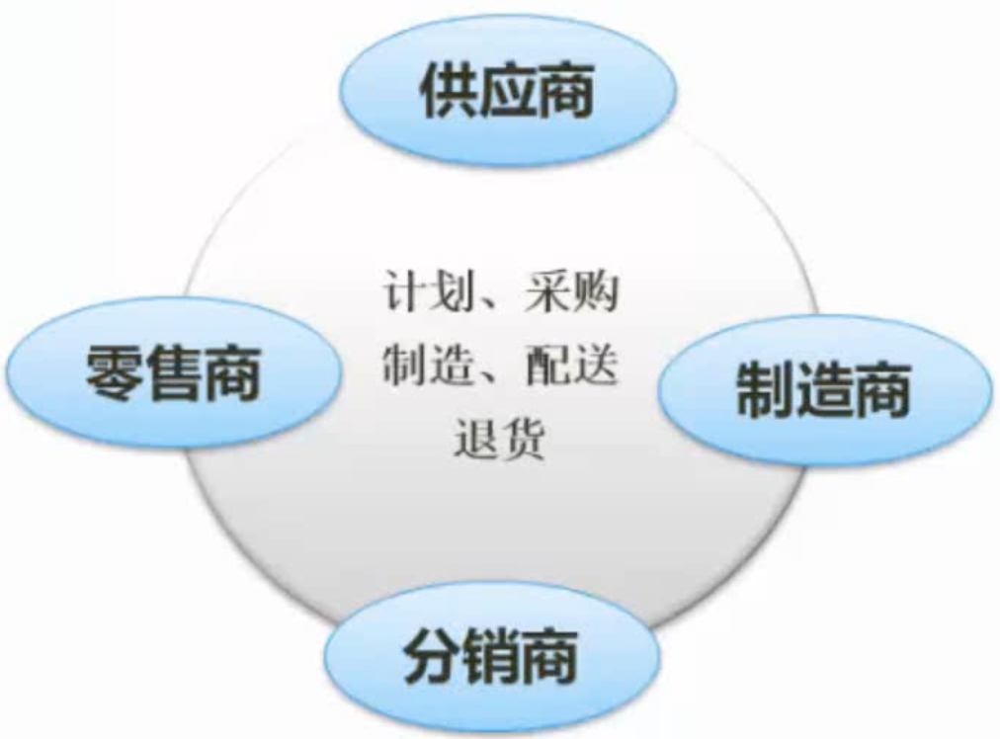
* 设计原则
  * 自顶向下和自底向上结合(所有信息化体系的共性，即全局规划加具体实现)
  * 简洁性原则
  * 互补性原则
  * 协调性原则
  * 动态性原则
  * 创新性原则
  * 战略性原则

#### 商业智能(BI)
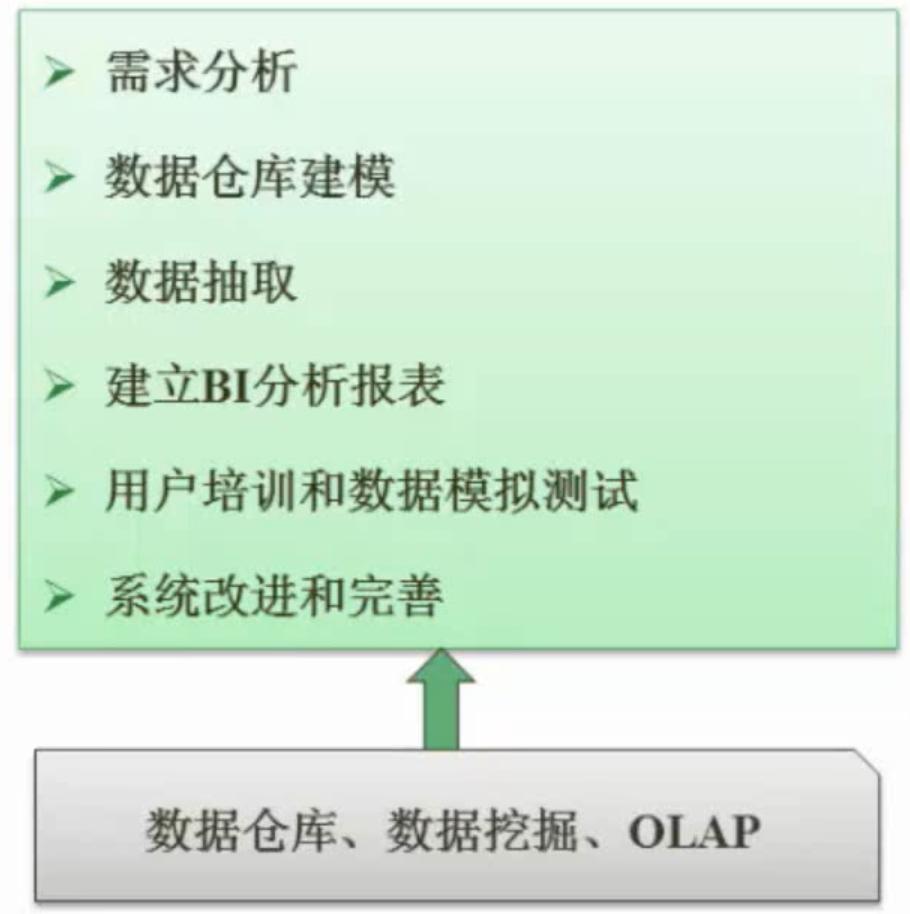

#### 电子数据交换

> EDI系统三要素：EDI软件和硬件、通信网络、数据标准化

* EDI的特点
  * EDI的使用对象是不同的组织之间，EDI传输的企业间的报文，是企业间信息交流的一种方式
  * EDI所传送的资料是一般业务资料，如发票、订单等，而不是指一般性的通知
  * EDI传输的报文是格式化的，是符合国际标准的，这是计算机能够自动处理报文的基本前提
  * EDI使用的数据通信网络一般是增值网、专用网
  * 数据传输由收送双方的计算机系统直接传送、交换资料，不需要人工介入操作
  * EDI与传真或电子邮件的区别是：传真与电子邮件，需要人工阅读判断处理才能进入计算机系统。人工将资料重复输入计算机系统中，既浪费人力资源，也容易发生错误，而EDI不需要再将有关资料人工重复输入系统

**EDI在外贸领域仍在广泛应用**


#### 企业应用集成(常考)
* 过度性质的方案，未在数据上真正整合
  * 表示集成(界面集成)
  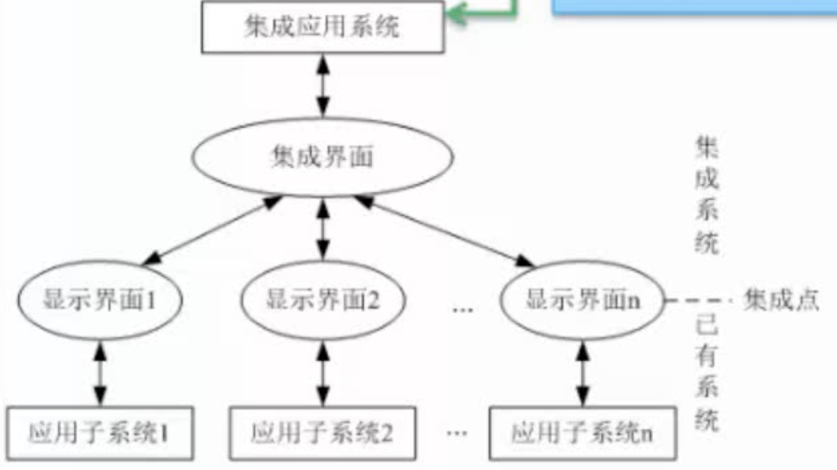

  * 数据集成
  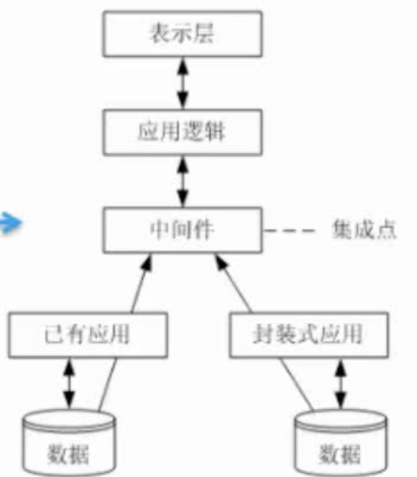

  * 控制集成(应用集成，API集成)
  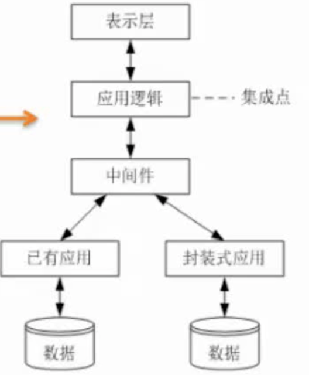

* 业务流程集成(过程集成)：会考虑业务流程优化的问题，不局限于企业内部系统

* 存储体和交换数据的角度划分
  * 消息集成：适用于数据量小，但要求频繁地、立即地、异步地数据交换场合
  * 共享数据库：实用性强、可以频繁交互、数据的交换属于同步方式
  * 文件传输：适用于数据量大、交换频度小，即时性要求低的情况

### 电子商务
* 四流
  * <font color="red">信息流</font>(核型)
  * 资金流(辅助)
  * 物流(辅助)
  * ~~商流~~

* 类型
  * 企业对消费者(B2C)
  * 企业对企业(B2B)
  * 消费者对消费者(C2C)
  * 线上对线下(O2O)

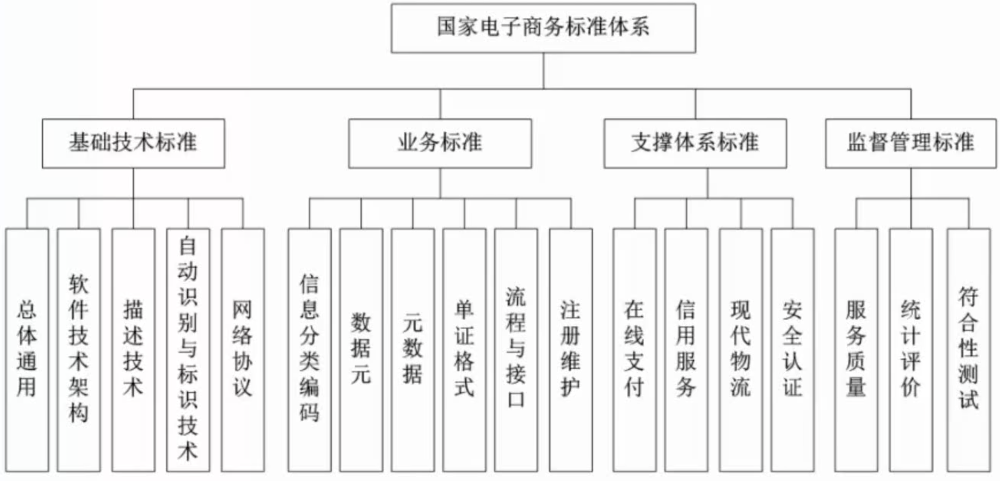

### 信息系统开发方法
* 结构化法
  * 用户至上
  * 严格区分工作节点，每阶段有任务和成果
  * 强调系统开发过程的整体性和全局性
  * 系统开发过程工程化，文档资料标准化
  * 自顶向下，逐步分解(求精)
* 原型法
  * 适用于需求不明确的开发
  * 包括抛弃式原型和演化式原型
* 面向对象方法
  * 更好的复用性
  * 关键在于建立一个全面、合理、统一的模型
  * 分析、设计、实现三个阶段，界限不明确
* 面向服务方法
  * SO方法有三个主要的抽象级别：操作、服务、业务流程
  * SOAD分为三个层次：基础设计层(底层服务构件)、应用结构层(服务之间的接口和服务级协定)和业务组织层(业务流程建模和服务流程编排)
  * 服务建模：分为服务发现、服务规约和服务实现三个阶段

## 软件工程
### 软件开发模型
#### 瀑布模型(SDLC)
* <font color="red">结构化方法模型典型代表</font>，用于结构化开发
* **<font color="red">适合需求明确，二次开发的场景</font>**，或按其他方法把需求做明确再按瀑布模型开发
* 缺点：需求阶段难以把控
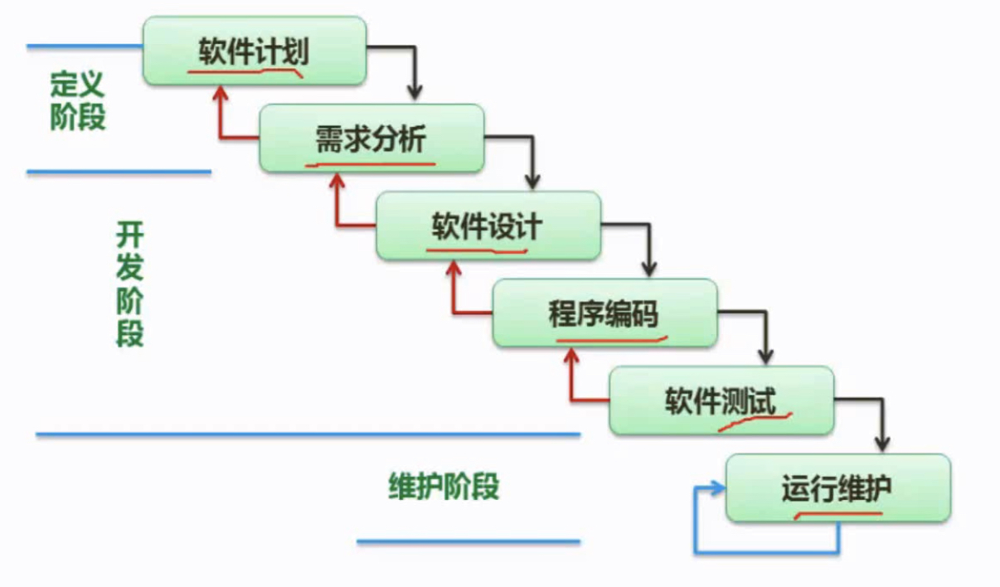

#### 增量模型与螺旋模型
* 增量模型
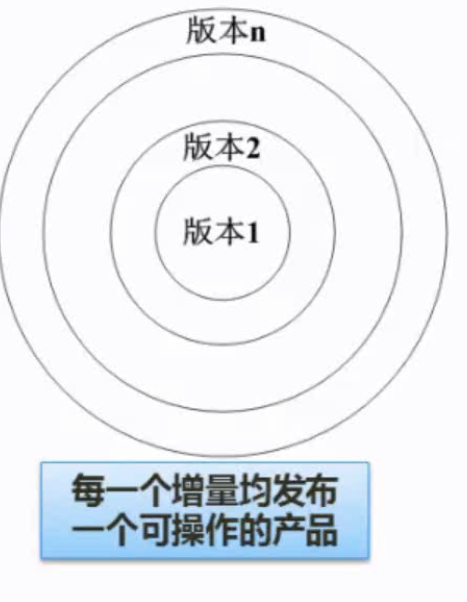

* 螺旋模型
  * 由多个模型组合，原型、瀑布模型、演化模型等(题目描述说针对需求不明确的情况只能选原型，<font color="red">遵循最匹配原则</font>)
  * <font color="red">引入风险分析</font>
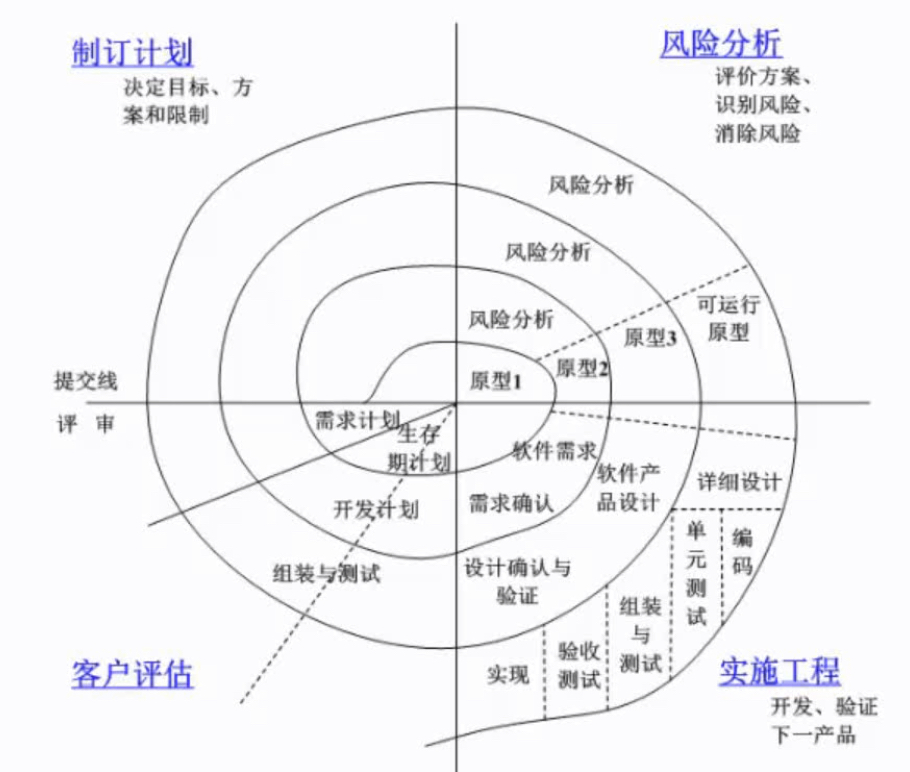

#### 构建组装模型(CBSD)
* 把软件开发中的各个模块做成构建，由构建组装形成软件
* 极大提高软件开发复用性，减小软件开发总时长，降低软件开发成本，提高软件可靠性
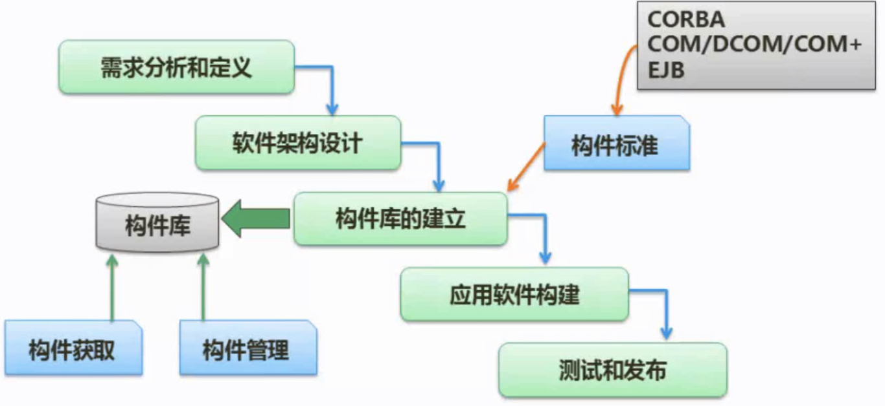

#### V模型、喷泉模型和RAD
* V模型
  * 与瀑布模型接近，测试有更重要的地位
  * 测试计划提前，有助于尽早发现问题
  * <font color="red">强调及早进行测试，测试贯穿开发整个过程中</font>

* 喷泉模型
  * <font color="red">面向对象模型</font>

* RAD
  * 由SDLC和CBSD模型组合而成
  * <font color="red">能快速构建应用系统</font>
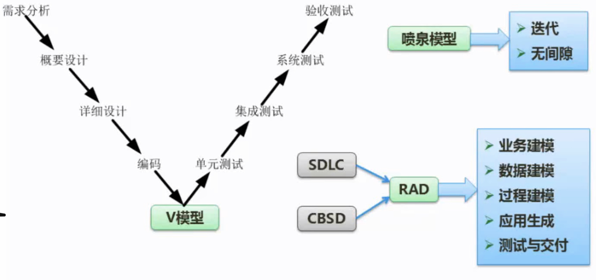

#### 其他经典模型
* 原型和瀑布模型是互补的模型，原型强调在项目初期构造简易系统(界面式或初步系统)，<font color="red">针对需求不明确的情况，只应用于开发中需求分析的阶段</font>
* 演化模型是指从最初的原型通过多步演化调整，最终变成软件产品
* 螺旋模型有原型、演化模型和瀑布模型的特征
* 增量模型由原型的思想和瀑布模型的思想构成，先完成一部分再完成一部分，最后完成整个产品(风险小很对)
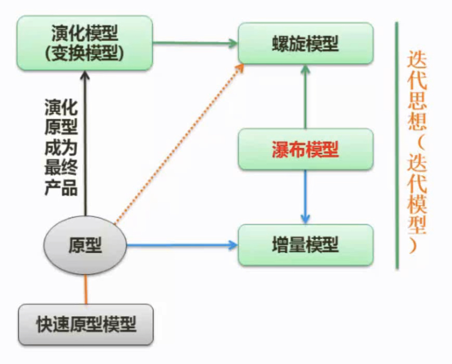

### 统一过程(UP/RUP)
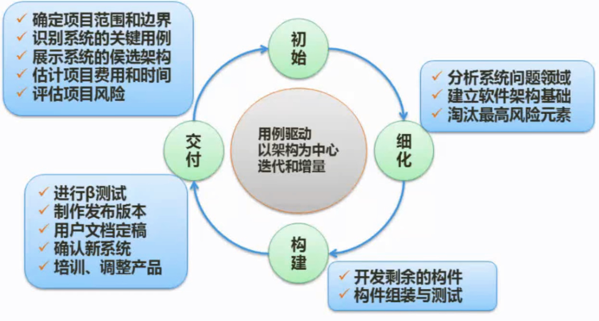

### 敏捷开发方法
<font color="red">适合小型项目，强调小步快跑</font>

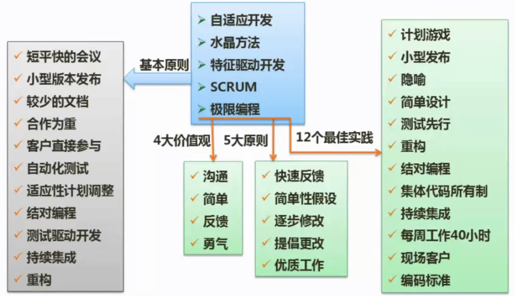


### 逆向工程
> 由已经形成的产品反推设计和需求

## 需求工程
### OOA
> OOA相关概念：对象、类(实体类、边界类、控制类)、抽象、封装、继承与泛化、多态、接口、消息、组件、模式和复用

#### UML
* 图
  * 分类
    * 结构图/静态图：类图、对象图、包图、组合结构图、构件图、部署图、制品图
    * 行为图/动态图：用例图(用例)、顺序图/序列图、通信图/协作图、~~定时图~~、状态图、活动图、~~交互概览图~~
<font color="red">用例图(用例)分类有歧义，选择时先看其他选项，实在无选择再选这个，大多数时候归为动态，少部分时间归为静态</font>
  * 功能
  <font color="red">部署图描述的是软件的构建应该部署在哪个硬件节点上，其他静态图描述的均为关系</font>
    * 用例图(用例)：表达的是系统和外部的交互关系
    * 顺序图/序列图：强调按时间关系
    * 通信图/协作图：与顺序图相同，<font color="red">区别在于没有强调按时间顺序</font>
    * 状态图：表达状态的变迁转移的情况
    * 活动图：和流程图结构一致
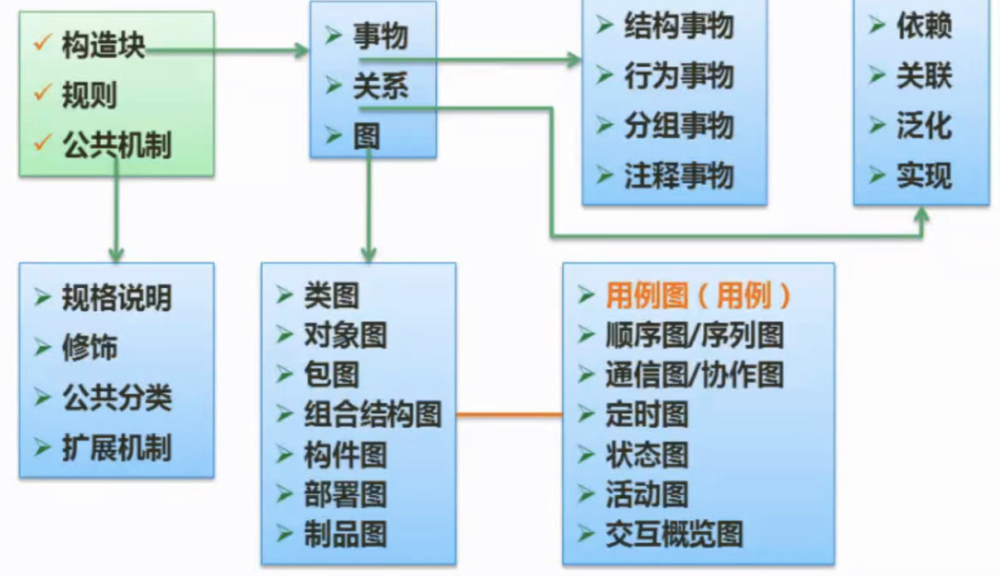

### 需求分类和需求获取
* 分类
  * 业务需求
  * 用户需求
  * 系统需求
    * 功能需求
    * 性能需求(非功能需求)：响应时间、安全性、可靠性
    * 设计约束：和功能与性能无关的影响
* 质量展开模型(QFD)
  * 基本需求：用户明确提出需要完成的
  * 期望需求：用户未明确提出但理所应当觉得应该具有的功能
  * 兴奋需求：用户未提出也没觉得应该做但做了的
* 获取方法
  * 收集资料：了解企业现状
  * 联合需求计划(开会)：已经获取初步需求，各方人员参会讨论;<font color="red">消耗资源多</font>
  * 用户访谈：找关键角色探讨对需求的想法；流程包括<font color="red">准备访谈、确定访谈对象(3个或3个以下一次)、准备问题(开放式/封闭式)、限制访谈时间(90min之内，长了拆分)、寻找异常和错误情况、做好相应记录、总结访谈</font>
    * 结构化形式：逻辑层次严谨，依据充分；事先准备问题，有针对性提问；局限性更大
    * 非结构化形式：开始只有粗略想法，根据访谈进度灵活调整；
    * 优点：灵活度高，应用范围广，了解细节深入
    * 缺点：用户忙难安排时间、信息量大难记录
  * 书面调查：用户访谈的补充形式，问卷下发用户；
    * 缺点：只能看到结果，不能了解选择时的疑问；用户不认真；问题不容易深入；问卷调查设计有难度；问卷发下去收不全(解释重要性)
  * 情节串联板：可以以讲故事思路将各个环节串联起来
  * 现场观摩
  * 参加业务实践
  * 阅读历史文档：获取数据层次时有效
  * 抽样调查：数据量大，解决时间，比较有性价比
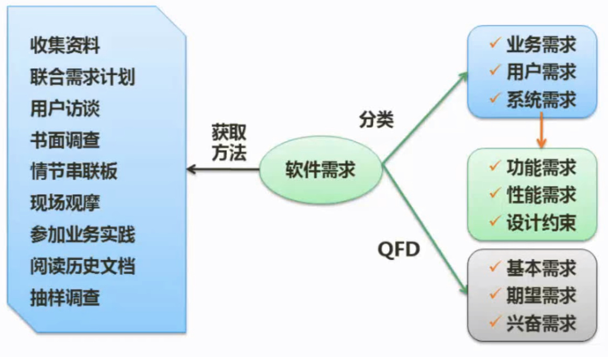

### 需求分析
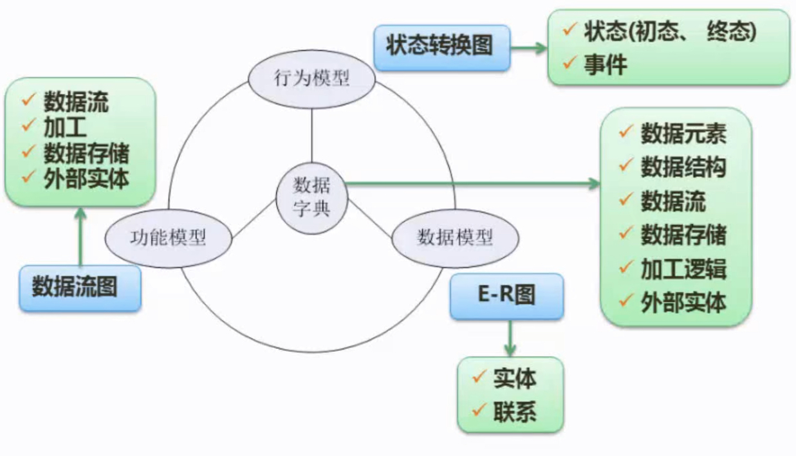

#### 数据流图(分层数据流图DFD)
* 数据流：箭头指示的为数据流
* 加工：处理数据的部件
* 数据存储：存储部件(文件)
* 外部实体：位置在系统之外
<font color="red">顶层图和0层图之间应该保持平衡，即数据流交换应该一致，输入输出要平衡</font>


#### 状态转换图(STD)
> 描述业务流程，描述行为

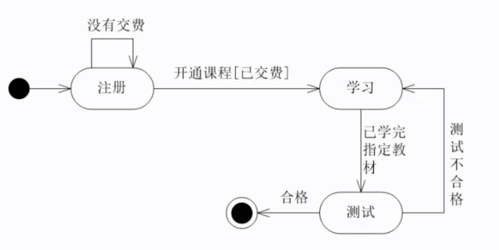

#### ER图
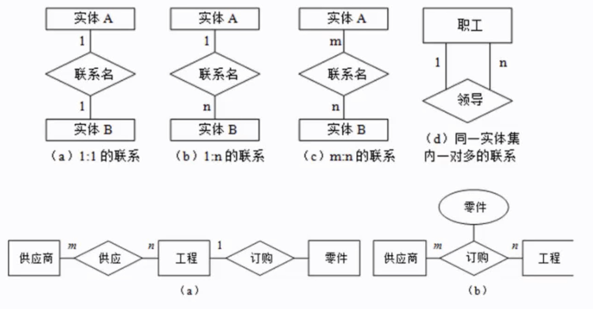

#### 数据字典
> 解释相关信息

* 数据元素
* 数据结构
* 数据流
* 数据存储
* 加工逻辑
  * 结构化语言
  * 判定树
  * 判定表
* 外部实体

## 系统设计
### 处理流程设计
#### 业务流程重组
> BPR是对<font color="red">企业</font>流程进行<font color="red">根本性</font>的再思考和<font color="red">彻底性</font>的再设计，从而获得可以用诸如成本、质量、服务和速度等方面的业绩来衡量的<font color="red">显著性</font>成就

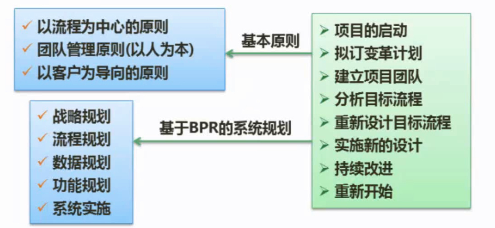

#### 业务流程管理
> BPM是一种以<font color="red">规范化</font>的构造端到端的卓越业务<font color="red">流程</font>为中心，以<font color="red">持续的</font>提高组织业务绩效为目的的<font color="red">系统化</font>方法

* PDCA闭环的管理过程
  * 明确业务流程所欲获取的成果
  * 开发或计划系统的方法，实现以上成果
  * 系统地部署方法，确保全面实施
  * 根据对业务的检查和分析以及持续的学习活动，评估和审查所执行的方法，并进一步提出计划和实施改进措施
* 流程管理包含三个层面：规范流程、优化流程和再造流程

<font color="red">BPM与BRP管理四项最根本的不同就在于流程管理并不要求对所有的流程进行再造。构造卓越的业务流程并不是流程再造，而是根据现有流程的具体情况，对流程进行规范化的设计</font>

### 人机界面设计
* 置于用户控制之下
  * 以不强迫用户进入不必要的或不希望的动作的方式来定义交互方式
  * 提供灵活的交互
  * 允许用户交互可以被中断和撤销
  * 当技能级别增加时可以使交互流水化并允许定制交互
  * 使用户隔离内部技术细节
  * 设计应允许用户和出现在屏幕上的对象直接交互
* 减少用户的记忆负担
  * 较少对短期记忆的要求
  * 建立有意义的缺省
  * 定义直觉性的捷径
  * 界面的视觉布局应该基于真实世界的隐喻
  * 以不断进展的方式提示信息
* 保持界面的一致性
  * 允许用户将当前任务放入有意义的语境
  * 在应用系列内保持一致性
  * 如果去得交互模型已建立起了用户期望，除非有迫不得已的理由，不要改变它

### 结构化设计
>分为概要设计、详细设计

* 基本原则
  * 自顶向下、逐步求精
  * 信息隐藏
  * 模块独立(高内聚、低耦合、复杂度)
    * 保持模块的大小适中
    * 尽可能减少调用的深度
    * 多扇入、少扇出
    * 单入口、单出口
    * 模块的作用域应该在模块之内
    * 功能应该时可预测的

#### 内聚与耦合
* 内聚
> 内聚程度从高到低

|内聚类型|描述|
|:--:|:--|
|功能内聚|完成一个单一功能，各个部分协同工作，缺一不可|
|顺序内聚|处理元素相关，而且必须顺序执行|
|通信内聚|所有处理元素集中在一个数据结构的区域上|
|过程内聚|处理元素相关，而且必须按特定的次序执行|
|瞬时内聚(时间内聚)|所包含的任务必须在同一时间间隔内执行|
|逻辑内聚|完成逻辑上相关的一组任务|
|偶然内聚(巧合内聚)|完成一组没有关系或松散关系的任务|

* 耦合
> 耦合程度由低到高

|耦合类型|描述|
|:--:|:--|
|非直接耦合|两个模块直接没有直接关系，它们之间的联系完全时通过主模块的控制和调用来实现的|
|数据耦合|一组模块借助参数表传递简单数据|
|标记耦合|一组模块通过参数表传递记录信息(数据结构)|
|控制耦合|模块之间传递的信息中包含用于控制模块内部逻辑的信息|
|外部耦合|一组模块都访问同一全局简单变量，而不是通过参数表传递该全局变量的信息|
|公共耦合|多个模块都访问同一个公共数据环境|
|内容耦合|一个模块直接访问另一个模块的内部数据；一个模块不通过正常入口转到另一个模块的内部；两个模块有一部分程序代码重叠；一个模块有多个入口|

#### 系统结构/模块结构
<font color="red">变换型系统结构b重点掌握</font>

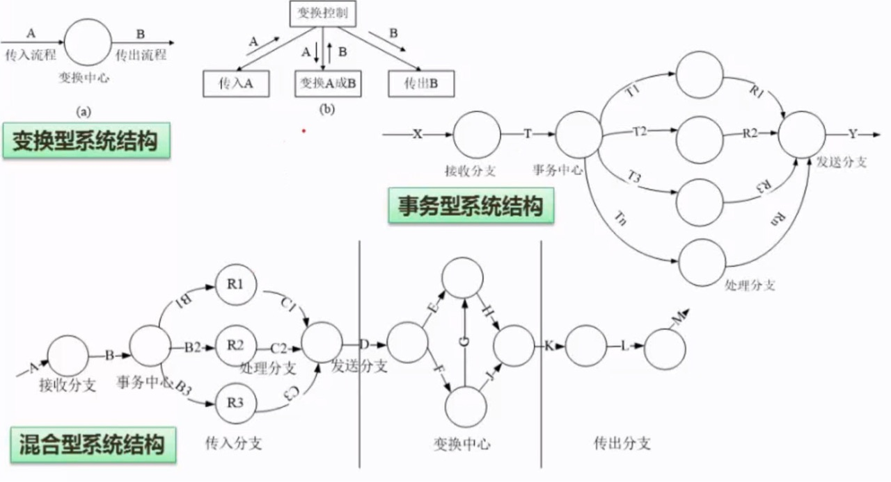

### 面向对象设计-设计原则
* 单一职责原则：设计目的单一的类
* 开放-封闭原则：对扩展开放，对修改封闭
* 里氏(Liskov)替换原则：子类可以替换父类
* 依赖倒置原则：要依赖于抽象，而不是具体实现；针对接口编程，不要针对实现编程
* 接口隔离原则：使用多个专门的接口比使用单一的总接口要好
* 组合重用原则：要尽量使用组合，而不是继承关系达到重用的目的
* 迪米特(Demeter)原则(最少只是法则)：一个对象应当对其它对象由尽可能少的了解

### 设计模式
#### 概念
* 架构模式：软件设计中的高层决策，例如C/S结构就属于架构模式，架构模式反映了开发软件系统过程中所作的基本设计决策(B/S、SOA)
* 设计模式：主要关注软件系统的设计，与具体的实现语言无关(<font color="red">在进行构件设计时</font>)
* 惯用法：最底层的模式，关注软件系统的设计与实现，实现时通过<font color="red">某种特定的程序设计语言</font>来描述构件与构件之间的关系。每种编程语言都有它自己特定的模式，即语言的惯用法。例如引用-计数就是C++语言中的一种惯用法

#### 分类
* 创建型模式：工厂方法(factory method)模式、抽象工厂(abstract factory)模式、原型(prototype)模式、单例(singleton)模式、构建器(builder)模式
* 结构型模式：适配器(adapter)模式、桥接(bridge)模式、组合(composite)模式、装饰(decorator)模式、外观(facade)模式、享元(flyweight)模式、代理(proxy)模式
* 行为型模式：职责链(chain of responsibility)模式、命令(command)模式、解释器(interpreter)模式、迭代器(iterator)模式、中介者(mediator)模式、备忘录(memento)模式、观察者(observer)模式、状态(state)模式、策略(strategy)模式、模板方法(template method)模式、访问者(visitor)模式

* 创建型模式

|设计模式名称|简要说明|
|:--:|:--:|
|Abstract Factory<br/>抽象工厂模式|提供一个接口，可以创建一系列相关或相互依赖的对象，而无需指定它们具体的类|
|Builder<br/>构建器模式|将一个复杂类的表示与其构造相分离，使得相同的构建过程能够得出不同的表示|
|Factory Method<br/>工厂方法模式|定义一个创建对象的接口，但由子类决定需要实例化哪一个类，工厂方法使得子类实例化的过程推迟|
|Prototype<br/>原型模式|用原型实例指定创建对象的类型，并且通过拷贝这个原型来创建新的对象|
|Singleton<br/>单例模式|保证一个类只有一个实例，并提供一个访问它的全局访问点|

* 结构型模式

|设计模式名称|简要说明|速记关键字|
|:--:|:--:|:--:|
|Adapter<br/>适配器模式|将一个类的接口转换成用户希望得到的另一种接口。它使原本不相容的接口得以协同工作|<font color="red">转换</font>接口|
|Bridge<br/>桥接模式|将类的抽象部分和它的实现部分分离开来，使它们可以独立地变化|继承树拆分|
|Composite<br/>组合模式|将对象组合成树型结构以表示“<font color="red">整体-部分</font>”的层次结构，使得用户对单个对象和组合对象的使用具有一致性|树形目录结构|
|Decorator<br/>装饰模式|动态地给一个对象添加一些额外的职责。它提供了用子类扩展功能的一个灵活的替代，比派生一个子类更加灵活|<font color="red">附加职责</font>|
|Facade<br/>外观模式|定义一个<font color="red">高层接口</font>，为子系统中的一组接口提供一个一致的外观，从而简化该子系统的使用|对外统一接口|
|Flyweight<br/>享元模式|提供支持大量细粒度对象共享的方法||
|Proxy<br/>代理模式|为其他对象提供一种代理以控制这个对象的访问||

* 行为型模式

|设计模式名称|简要说明|速记关键字|
|:--:|:--:|:--:|
|Chain of Responsibility<br/>职责链模式|通过给多个对象处理请求的机会，减少请求的发送者与接收者之间的耦合。将接收对象链接起来，在链中传递请求，直到有一个对象处理这个请求|<font color="red">传递职责</font>|
|Command<br/>命令模式|将一个请求封装为一个对象，从而可用不同的请求对客户进行参数化，将请求排队或记录请求日志，支持可撤销操作|日志记录，可<font color="red">撤销</font>|
|Interpreter<br/>解释器模式|给定一种语言，定义它的文法表示，并定义一个解释器，该解释器用来根据文法表示来解释语言中的句子||
|Iterator<br/>迭代器模式|提供一种方法来顺序访问一个聚合对象中的各个元素而不需要暴露该对象的内部表示||
|Mediator<br/>中介者模式|用一个中介对象来封装一系列的对象交互，它使各对象不需要显示地相互调用，从而达到低耦合，还可以独立地改变对象间的交互|不直接引用|
|Memento<br/>备忘录模式|在不破坏封装性的前提下，捕获一个对象的内部状态，并在该对象之外保存这个状态，从而可以在以后将对象恢复到原先保存的状态||
|Observer<br/>观察者模式|定义对象间的一种一对多的依赖关系，当一个对象的状态发生改变时，所有依赖于它的对象都得到通知并自动更新||
|State<br/>状态模式|允许一个对象在其内部状态改变时改变它的行为|状态变成类|
|Strategy<br/>策略模式|定义一系列算法，把它们一个个封装起来，并且使它们之间可互相替换，从而让算法可以独立于使用它的用户而变化|多方案切换|
|Template Method<br/>模板方法模式|定义一个操作中的算法骨架，而将一些步骤延迟到子类中，使得子类可以不改变一个算法的接口即可重新定义算法的某些特定步骤||
|Vistor<br/>访问者模式|表示一个作用于对象结构中的各元素的操作，使得在不改变各元素的类的前提下定义作用于这些元素的新操作||

### 软件测试
#### 原则和类型
* 原则
  * 尽早、不断地进行测试
  * 程序员避免测试自己设计的程序
  * 既要选择有效、合理的数据、也要选择无效、不合理的数据
  * 修改后进行回归测试
  * 尚未发现的错误数量与该程序已发现的错误数成正比

* 分类
  * 动态测试
    * 黑盒测试法
    * 白盒测试发
    * 灰盒测试法
  * 静态测试
    * 桌前检查
    * 代码走查
    * 代码审查

#### 测试用例设计
* 黑盒测试
  * 等价类划分：把所有数据进行归类，同一类的选一个进行测试
  * 边界值分析：端点、略小于下区间的值、略大于大区间的值
  * 错误推测
  * 因果图：由果分析因
* 白盒测试
  * 基本路径测试
  * 循环覆盖测试
  * <font color="red">逻辑覆盖测试</font>：<font color="red">语句覆盖(层次最低)、判定覆盖(真假分支各走一遍)、条件覆盖(拆分判定)</font>、条件判定覆盖、修正的条件判断覆盖、条件组合覆盖、点覆盖、边覆盖、<font color="red">路径覆盖(层次最高)</font>

#### 测试阶段
* 单元测试：模块级，局部功能，模块相关接口
* 集成测试：各个模块联合测试，测试模块之间衔接、接口（增量式组装工作量更大但更全面）
* 确认测试
* 系统测试：偏重于压力性能等(<font color="red">负载测试(高并发)、强度测试(资源突然下降)、容量测试</font>)
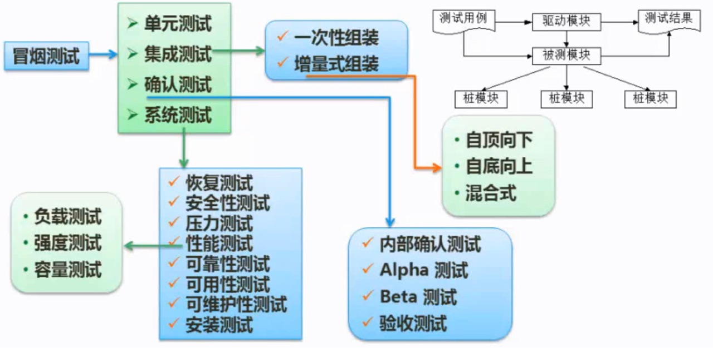

#### 面向对象的测试
* 算法层(单元测试)：包括等价类划分测试、组合功能测试（基于判定表的测试）、递归函数测试和多态消息测试
* 类层(模块测试)：包括不变式边界测试、模态类测试和非模态类测试
* 模板层/类树层(集成测试)：包括多态服务测试和展平测试
* 系统层(系统测试)

#### 测试管理
* 测试团队管理
* 测试计划管理
* <font color="red">错误(缺陷)跟踪管理</font>
  * 错误植入法：$a_1:b_1=a_2:b_2$，人为植入错误，从结果查看哪些使植入的，按比例估算错误数，以此考核团队成员是否有效发现错误。(估算错误数)
  * 两组并行测试：$DN=(a\times b)/c$，a代表a团队测出的错误数，b代表b团队测出的错误数，c代表俩团队共同测出的错误数。(估算错误数)
  * 错误曝光率(DRE)：$DRE=e/(e+d)$，e表示测试阶段发现的问题，d表示用户使用时发现的问题，两者之和为缺陷的总数。(客观、准确，缺点是只有交付之后才能计算)
* 测试件管理

#### 软件调试
* 软件调试方法
  * 蛮力法：主要是想是“通过计算机找错”，低效，耗时
  * 回溯法：从出错处人工沿控制流程往回追踪，直至发现出错的根源，复杂程度由于回溯路径多，难以实施
  * 原因排除法：主要思想是演绎和归纳，用二分法实现
* 软件调试和测试的区别
  * 测试的目的是找出存在的错误，而调试的目的是定位错误并修改程序以修正错误
  * 调试时测试之后的活动，测试和调试在目标、方法和思路上都有所不同
  * 测试从一个已知的条件开始，使用预先定义的过程，有预知的结果；调试从一个未知的条件开始，结束的过程不可预计
  * 测试过程可以事先设计，进度可以事先确定；调试不能描述过程或持续时间

### 系统运行与维护
> 软件维护时生命周期的一个完整部分。可以将软件维护定义为需要提供软件支持的全部活动，这些活动包括在交付前完成的活动，以及交付后完成的活动。交付前完成的活动包括交付后运行的计划和维护计划等；交付后的活动包括软件修改、培训、帮助资料等

* 可维护性
  * 易分析性：源代码理解容易
  * 易改变性：修改代码比较容易(耦合度低)
  * 稳定性
  * 易测试性
* 维护类型
  * 改正性维护(25%)/正确性维护：用户发现缺陷则修正缺陷
  * 适应性维护(20%)：环境改变(操作系统、数据环境)，<font color="red">软件需要适应的情况均属于此范畴</font>
  * 完善性维护(50%)：在系统运行过程中扩充功能，改善性能
  * 预防性维护(5%)：现在不维护将来可能导致问题

### 软件过程改进(CMMI)
* 阶段式：组织能力成熟度

|成熟度等级|过程域|
|:--:|:--|
|已管理级(项目级)|需求管理有、项目计划、配置管理、项目监督与控制、供应商合同管理、度量和分析、过程和产品质量保证|
|已定义级(<font color="red">组织级、文档化、标准化、知识由隐性变为显性</font>)|需求开发、技术解决方案、产品集成、验证、确认、组织级过程焦点、组织级过程定义、组织级培训、集成项目管理、风险管理、集成化的团队、决策分析和解决方案、组织级集成环境|
|定量管理级(<font color="red">量化</font>)|组织级过程性能、定量项目管理|
|优化级|组织级改革与实施、因果分析和解决方案|

* 连续式：软件过程能力

|连续式分组|过程域|
|:--:|:--|
|过程管理|组织级过程焦点、组织级过程定义、组织级培训、组织级过程性能、组织级改革与实施|
|项目管理|项目计划、项目监督与控制、供应商合同管理、集成项目管理、风险管理、集成化的团队、定量项目管理|
|工程|需求管理、需求开发、技术解决方案、产品集成、验证、确认|
|支持|配置管理、度量和分析、过程和产品质量保证、决策分析和解决方案、组织级集成环境、因果分析和解决方案|

## 项目管理
### 范围管理
* 范围定义
  * 产品范围：需求调研获取到的信息
  * 工作范围：完成项目需要开展的一系列工作
* 创建WBS：工作包的分解，界定项目范围
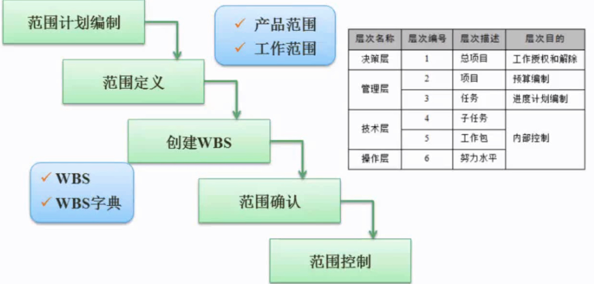

### 时间管理
* 活动定义：把活动找出来
* 活动排序：采取拓扑排序的方式
* 活动资源估算：人员、时间、物料、服务器、设备等
* 活动历时估算：活动需要多少时间
  * 三点估算法：$\frac{best+4\times mid+ worst}{6}$
  * 自下而上的估算：必须先完成WBS分解
* 制订进度计划：
* 进度控制：
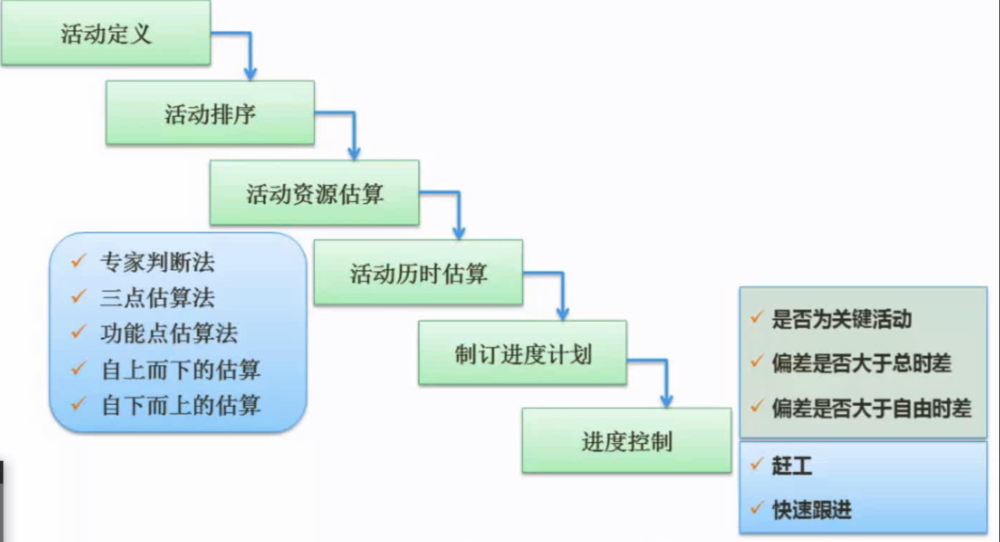
#### 单代号网络图
* <font color="red">FS: A完成B才能开始</font>
* FF：A完成B才能完成，谁先开始没有约定
* SS：A开始B才能开始
* SF：A开始B才能结束，例如新老系统切换，新系统运行才能下线老系统
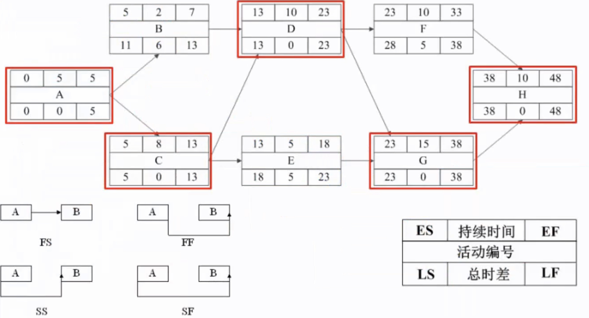
* 整推
  * ES：最早开始时间(上一个活动的最大EF)
  * EF：最早结束时间(ES+持续时间)
* 逆推
  * LS：最晚开始时间(LF-持续时间)
  * LF：最晚结束时间(下一个节点最小的LS)
$总时差=ES-LS=EF-LF$
<font color="red">总时差等于0的节点连起来就为关键路径</font>
<font color="red">关键路径越少越好，否则管理难度增大</font>

#### 双代号网络图
> 边表示活动，节点表示事件；虚线画的活动不会给活动名或者给一个活动名而不是给历时(虚活动，虚构出来的活动，表达依赖关系不能直接去掉但不占用资源)

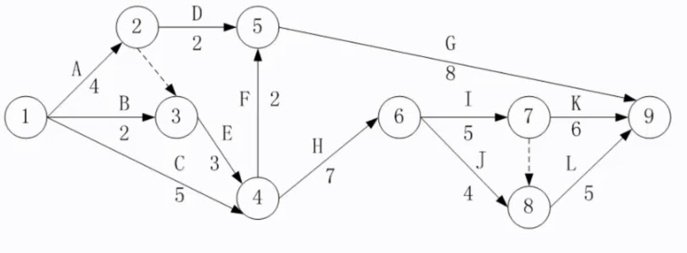
* 求解关键路径
关键路径为1-2-3-4-6-7-9 (A、E、H、I、K)
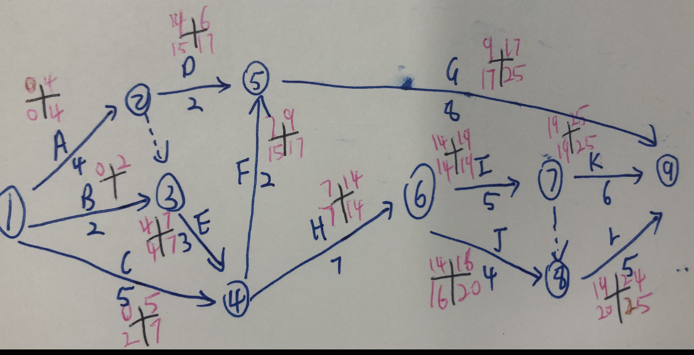


#### 关键路径法
> 关键路径法是在制定进度计划时使用的一种进度网络分析技术。关键路线法沿用项目进度网络路线进行正向与反向分析，从而计算出所有计划活动理论上的最早开始与完成日期、最迟开始与完成日期，不考虑任何资源限制

* 总时差(松弛时间)：在不延误总工期的前提下，该活动的机动时间。活动的总时差等于该活动最迟完成时间与最早完成时间之差，或该活动最迟开始时间之差
* 自由时差：在不影响紧后活动的最早开始时间前提下，该活动的机动时间
  * 对于有紧后活动的活动，其自由时差等于所有紧后活动最早开始时间减本活动最早完成时间所得之差的最小值
  * 对于没有紧后活动的活动，也就是以网络计划终点节点为完成节点的活动，其自由时差等于计划工期与本活动最早完成时间之差
* 对于网络计划中以终点节点为完成节点的活动，其自由时差与总时差相等。此外，由于活动的自由时差时其总时差的构成部分，所以，当活动的总时差为零时，其自由时差必然为零，可不必进行专门计算

* 自由时差例题[^23]
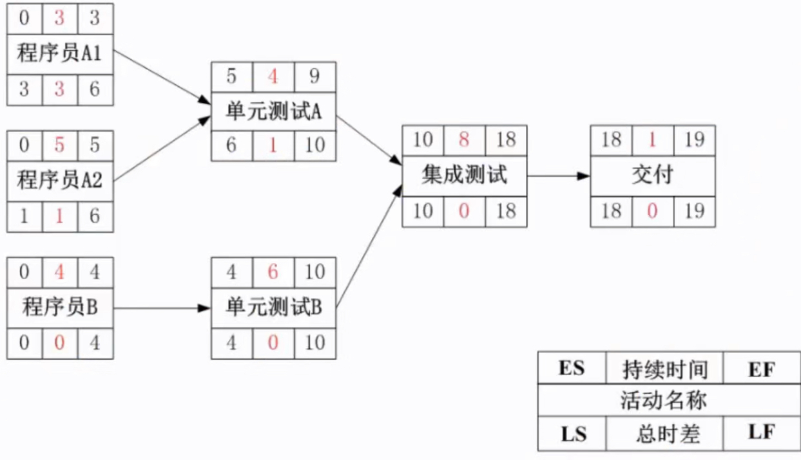

### 甘特图
> 细横线：代表计划值；粗横线：代表实际完成值

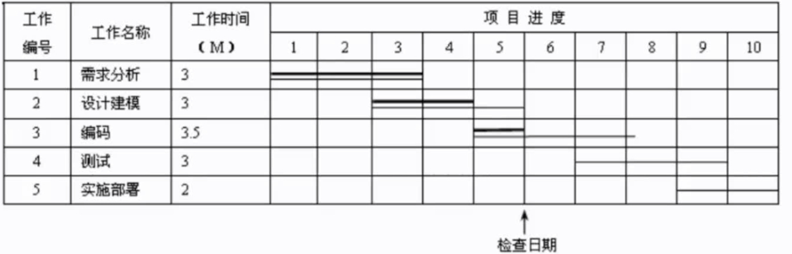

* 优点：甘特图直观、简单、容易制作，便于理解，能很清晰地标识出直到每一项任务的起始与结束时间，一般适用比较简单的小型项目，可用于WBS的任何层次、进度控制、资源优化、编制资源和费用计划
* 缺点：不能系统地表达一个项目所包含的各项工作之间的复杂关系，难以进行定量的计算和分析，以及计划的优化等

### 成本管理
1. 成本估算
   * 自顶向下的估算
   * 自底向上的估算
2. 成本预算
   * 直接成本与间接成本：直接成本指由项目组花掉的钱(人力成本等，项目经理能控制的)；间接成本指公摊性质的成本(项目经理无法控制的)，以每天多少成本衡量
   * 管理储备：项目经理无权动用，要企业高层审批
   * 零基准预算
3. 成本控制
   * 挣值分析

#### 挣值管理
* 计算工作量的预算成本(PV)：$PV=计划工作量 \times 预算定额$(<font color="red">顺序3</font>)
* 已完成工作量的实际成本(AC)：项目实际花掉的钱，<font color="red">考题一般会直接给出</font>(<font color="red">顺序1</font>)
* <font color="red">已完成工作量</font>的预算成本(EV)：$EV=已完成工作量 \times 预算定额$(<font color="red">顺序2</font>)
* 完工预算(BAC)：$BAC = 完工时的PV总和$
* 进度偏差：$SV=EV-PV$，为负代表进度滞后
* 成本偏差：$CV=EV-AC$，为负代表成本超支
* 进度绩效指数：$SPI=EV/PV$，小于1表示不好，等于1表示与计划持平，大于1表示超预期
* 成本绩效指数：$CPI=EV/AC$，小于1表示不好，等于1表示与计划持平，大于1表示超预期
* 剩余工作的成本(ETC)：
  按计划走(<font color="red">非典型偏差</font>)：$ETC=BAC-EV$
  不按计划走(<font color="red">典型偏差</font>)：$ETC=\frac{BAC-EV}{CPI}$
* 完工预估(EAC)：$EAC=AC+ETC$


* 例题1[^24]
> 希赛教育在线测试项目涉及对10个函数代码的编写（假设每个函数代码的编写工作量相等），项目由2个程序员进行结对编程，计划在10天内完成，总体预算时1000元，每个函数的平均成本时100元，项目进行到第5天，实际消耗费用时400元，完成了3个函数的编写。

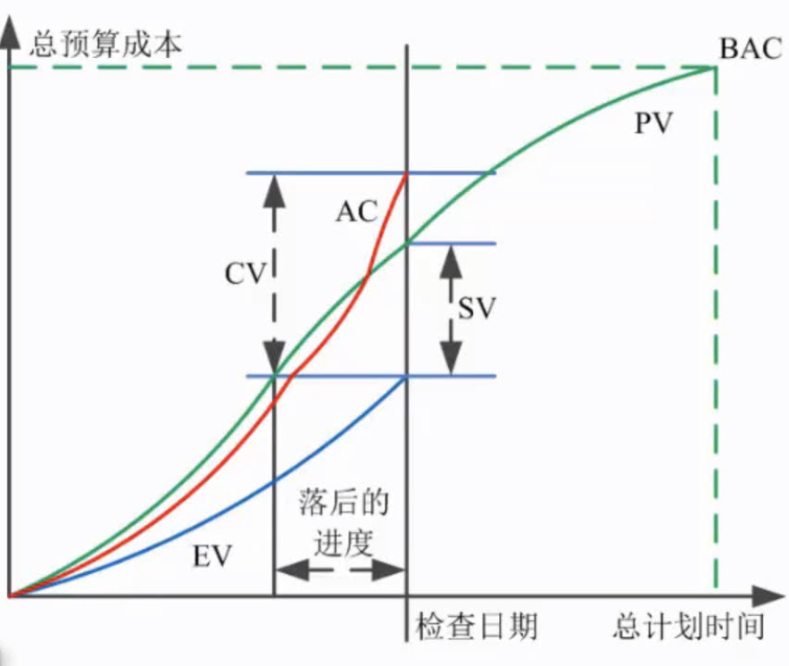

### 质量管理
* 质量模型
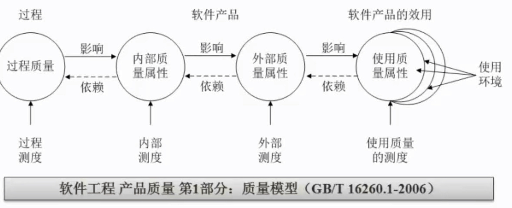

* 外部和内部质量
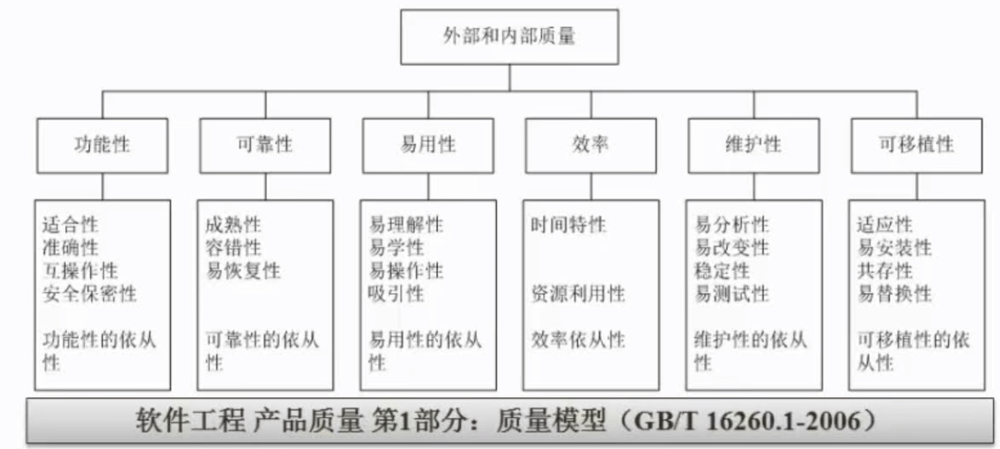

* 质量管理过程(PDCA循环)
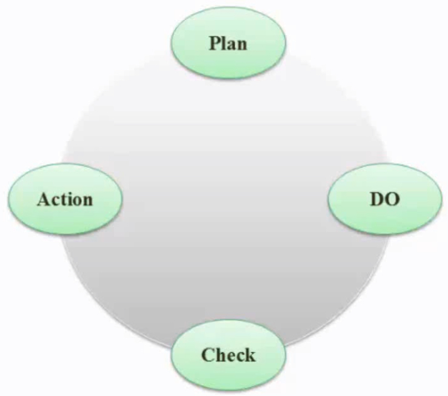

* 质量保证和质量控制
  * 质量保证一般是<font color="red">每隔一定时间</font>(例如，每个阶段末)进行的，主要通过系统的质量审计和过程分析来保证项目的质量(<font color="red">强调过程</font>)
  * 质量控制是<font color="red">实时监控项目的具体结果</font>，以判断它们是否符合相关质量标准，制定有效方案，以消除产生质量问题的原因(<font color="red">强调结果</font>)
  * 一定时间内质量控制的结果也是质量保证的质量审计对象。质量保证的成果又可以指导下一阶段的质量工作，包括质量控制和质量改进

* 质量工具
  * 核对表：即checklist，清单
  * 帕累托分析(排列图)：统计错误出现的频次，按从高到底排列，先解决小部分高频次的问题
  * 因果分析(鱼骨图)：鱼头是要解决的问题，鱼骨是朔源，由果反推因
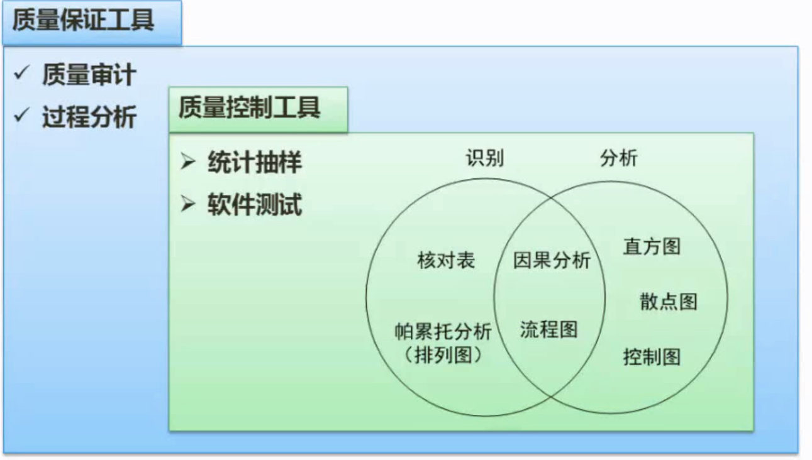

* 项目管理三角形
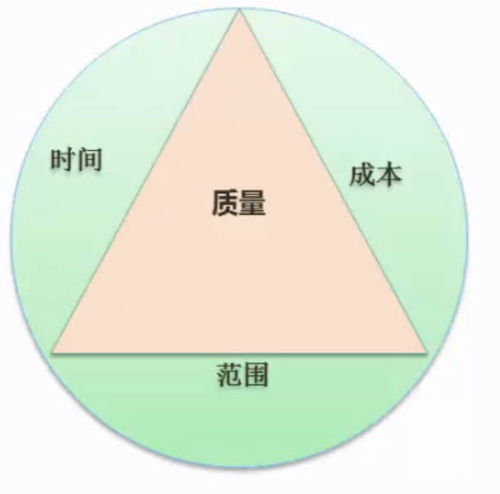

### 配置管理
> IEEE对配置项的定义为硬件、软件或二者兼有的集合，为配置管理制定的

* 在配置管理过程中作为一个单独的实体对待，可作为配置项管理的有：外部交付的软件产品和数据、指定的内部软件工作产品和数据、指定的用于创建或支持软件产品的支持工具、供方/供应商提供的软件和客户提供的设备/软件
* 典型配置项：项目计划书、需求文档、设计文档、源代码、可执行代码、测试用例、运行软件所需的各种数据(它们经评审和检查通过后进入软件配置管理(SCM))
* 配置项的主要属性：名称、标识符、文件状态、版本、作者和日期等。
<font color="red">所有配置项都被保存在配置库里，确保不会混淆、丢失、配置项及其历史记录反映了软件的演化过程</font>

#### 配置库
* 开发库(动态库、程序员库、工作库；动态系统、开发者系统、开发系统、工作空间)：开发阶段(不断地调整修改阶段用的)，管辖内容程度最低，修改基本没有约束
* 受控库(主库、系统库；主系统、受控系统)：完成测试(测试通过)后放入，<font color="red">管理系统的基线</font>，不允许随意修改，修改需要走变更控制流程
* 产品库(<font color="red">备份库</font>、静态库、软件仓库；静态系统)：<font color="red">完全不能修改</font>

* 检查点：只在规定的时间间隔内对项目进行检查，比较实际与计划之间的差异，并根据差异进行调整
* 里程碑：完成阶段性工作的标志，不同类型的项目里程碑不同
* 基线：指一个(或一组)配置项在项目生命周期的不同时间点上通过正式评审而进入正式受控的一种状态，基线是一些重要的里程碑。但相关交付成果要通过正式评审，并作为后续工作的基准和出发点。基线一旦建立后其变化需要受控制
* 变更控制


* 版本控制
  * 草稿版：0.YZ
  * 正式版：X.Y
  * 修改版：X.YZ
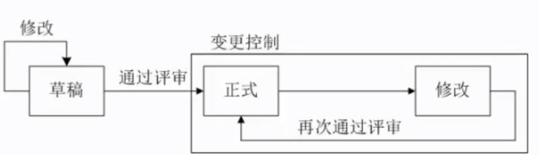

### 风险管理
#### 特性
> 关心未来、关心变化、关心选择

* 风险存在的客观性和普遍性
* 某一具体风险发生的偶然性和大量风险发生的必然性
* 风险的可变性
* 风险的多样性和多层次性
* <font color="red">基本属性：随机性和相对性</font>
* 风险承受能力
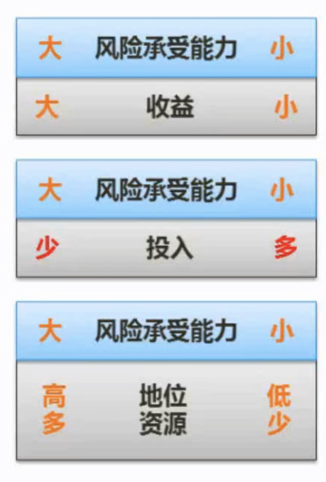

#### 分类
* 项目风险
  * 潜在的预算、进度、人员和组织(<font color="red">预算本身不足</font>)、资源、用户和需求问题
  * 项目复杂性、规模和结构的不确定性
* 技术风险
  * 潜在的设计、实现、接口、测试和维护方面的问题
  * 规格说明的多义性、技术上的不确定性、技术陈旧、最新技术(不成熟)
* 商业风险
  * 市场风险：系统虽然很优秀但不是市场真正所想要的
  * 策略风险：系统不再符合企业的信息系统战略
  * 销售风险：开发了销售部门不清楚如何推销的系统
  * 管理风险：由于重点转移或人员变动而失去上级支持(<font color="red">预算足够，但是上层不给</font>)
  * 预算风险：开发过程没有得到预算或人员的保证(<font color="red">预算足够，但是上层不给</font>)

#### 风险曝光度
> 风险曝光度(Risk Exposure):计算方法是风险出现的概率乘以风险可能造成的损失

* 例
> 假设正在开发的软件项目可能存在一个未被发现的错误，而这个错误出现的概率是0.5%，给公司造成的损失将是1000000元，那么这个错误的风险曝光度应为$1000000 \times 0.5\%=5000元$

### 项目管理工具
* <font color="red">能做什么(项目管理相关的工作辅助)</font>：任务调度、成本估算、资源分配、预算跟踪、人时统计、配置控制、确定关键路径、松弛时间、超前时间和滞后时间，生成一定格式的报表和报告
* <font color="red">不能做什么(开发技术相关的辅助工作)</font>：不能指导软件设计人员按软件生存周期各个阶段的适用技术进行设计工作

## 软件架构设计
### 软件架构风格
> 架构设计的一个核心问题是能否达到架构级的软件复用
> 架构风格反映了领域中众多系统所共有的结构和语义特性，并指导如何将各个构件有效地组织成一个完整的系统
> 架构风格定义了用于描述系统的术语表和一组指导构建系统的规则

* 数据流风格：批处理序列、管道-过滤器
* 调用/返回风格：主程序/子程序、、面向对象、层次结构
* 独立构件风格：进程通信、事件驱动系统(隐式调用)
* 虚拟机风格：解释器、基于规则的系统
* 仓库风格：数据库系统、超文本系统、黑板系统

#### 数据流风格
* 批处理序列：构件为一系列固定顺序的计算单元，构件之间只通过数据传递交互。每个处理步骤是一个独立的程序，<font color="red">每一步必须在其前一步结束后才能开始，数据必须是完整的，以整体的方式传递。整个处理过程没有用户交互</font>
* <font color="red">管道-过滤器</font>：每个构件都有一组输入和输出，构件读输入的数据流，经过内部处理，然后产生输出数据流，<font color="red">支持流式处理，不必等一批全部处理完在走下一个</font>。（这个过程通常是通过对输入数据流的变换或计算来完成的，包括通过计算或增加信息以丰富数据、通过浓缩或删除以精简数据、通过改变记录方式以转化数据和递增地转化数据等。）这里的构件称为过滤器，连接件就是数据流传输的管道，将一个过滤器的输出传到另一个过滤器的输入

#### 调用/返回风格
* 主程序/子程序：单线程控制，把问题划分为若干个处理步骤，构件即为主程序和子程序，子程序通常可合成为模块。过程调用作为交互机制，即充当连接件的角色。调用关系具有层次性，其语义逻辑表现为主程序的正确性取决于它调用的子程序的正确性。(<font color="red">结构化开发中常见</font>)
* 面向对象：<font color="red">显式调用</font>。构件是对象，对象是抽象数据类型的实例。在抽象数据类型中，数据的表示和它们的相应操作被封装起来，对象的行为体现在其接受和请求的动作。连接件即是对象间交互的方式，对象是通过函数和过程的调用来交互的
* 层次结构：构建组织成一个层次结构，连接件通过决定层间如何交互的协议来定义。每层为上一层提供服务，使用下一层的服务，只能见到与自己邻接的层。通过层次结构，可以将大的问题分解为若干个渐进的小问题逐步解决，可以隐藏问题的复杂度，修改某一层，最多影响相邻的两层(通常只能影响上层)(<font color="red">缺点：层次多则效率低、层次划分没有定论</font>)

#### 独立构件风格
* 进程通信：<font color="red">独立构件</font>。构件是独立的过程，连接件是消息传递。构件通常是命名过程，消息传递的方式可以是点对点，异步或同步方式，以及远程过程(方法)调用等
* <font color="red">事件驱动系统：隐式调用</font>。构件不直接调用一个过程，而是触发或广播一个或多个事件。构件中的过程在一个或多个事件中注册，当某个事件被触发时，系统自动调用在这个事件中注册的所有过程。一个事件的触发就导致了另一个模块中的过程调用。这种风格中的构件是匿名的过程，它们之间交互的连接件往往是以过程之间的隐式调用来实现的。<font color="red">主要优点是为软件复用提供了强大的支持，为构件的维护和演化带来了方便；其缺点是构件放弃了对系统计算的控制</font>

#### 虚拟机风格
* 解释器：解释器通常包括一个完成解释工作的解释引擎、一个包含将被解释的代码的存储区、一个记录解释引擎当前工作状态的数据结构，以及一个记录源代码被解释执行的进度的数据结构。具有解释器风格的软件中含有一个虚拟机，<font color="red">可以仿真硬件的执行过程和一些关键应用，其缺点是执行效率比较低</font>
* 基于规则的系统：基于规则的系统包括规则集、规则解释器、规则/数据选择器和工作内存，一般用在人工智能领域和DSS中

#### 仓库风格
> <font color="red">以数据为核心</font>


* 数据库系统：<font color="red">数据共享</font>。构件主要有两大类，一类是中央共享数据源，保存当前系统的数据状态；另一类是多个独立处理单元，处理单元对数据元素进行操作
* 黑板系统：包括知识源、黑板和控制三部分。知识源包括若干独立计算的不同单元，提供解决问题的知识。知识源响应黑板的变化，也只修改黑板；黑板是一个全局数据库，包含问题域解空间的全部状态，是知识源相互作用的唯一媒介；知识源响应是通过黑板状态的变化来控制的。黑板系统通常应用在对于解决问题没有确定性算法的软件中(<font color="red">信号处理、问题规划和编译器优化等</font>)
* 超文本系统：构件以网状链接方式相互连接，用户可以在构件之间进行按照人类的联想思维方式任意跳转到相关构件。超文本是一种非线性的网状信息组织方式。它以结点为基本单位，链作为结点之间的联想式关联。超文本系统通常应用在互联网领域

#### C/S架构
* 两层C/S架构
> 开发成本较高、客户端程序设计复杂、信息内容和形式单一、用户界面风格不一、<font color="red">软件移植困难、软件维护和升级困难</font>、新技术不能轻易应用

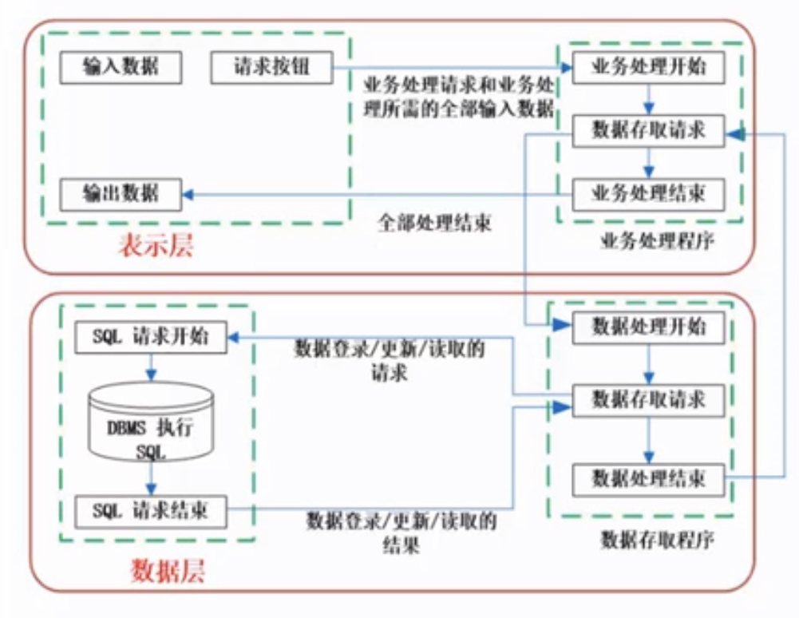

* 三层C/S架构
> 各层在逻辑上保持相对独立，整个系统的逻辑结构更为清晰，能提高系统和软件的可维护性和可扩展性
> 允许灵活有效地选用相应的平台和硬件系统，具有良好的可升级性和开放性
> 各层可以并行开发，各层也可以选择各自最适合的开发语言
> 功能层有效地隔离表示层与数据层，为严格的安全管理奠定了坚实的基础；整个系统的管理层次也更加合理和可控制

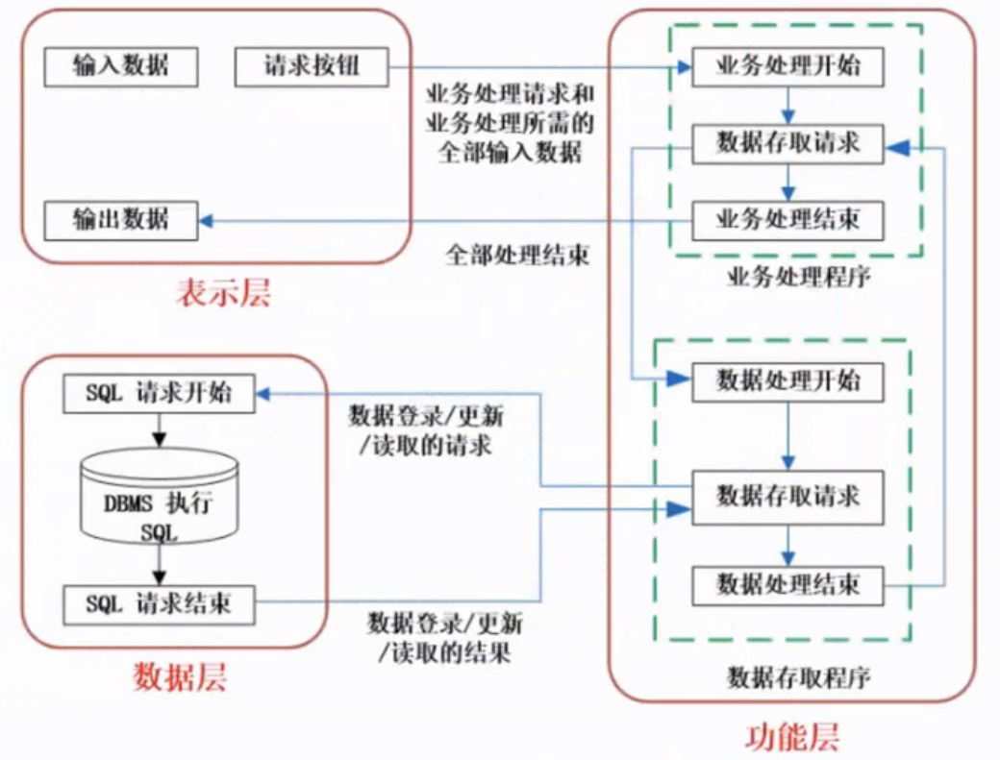


#### 三层B/S架构
* B/S架构缺乏对动态页面的支持能力，没有集成有效的数据库处理功能
* B/S架构的安全性难以控制
* 采用B/S架构的应用系统，在数据查询等响应速度上，要远远低于C/S架构
* B/S架构的数据提交一般以页面为单位，数据的动态交互性不强，不利于OLTP应用

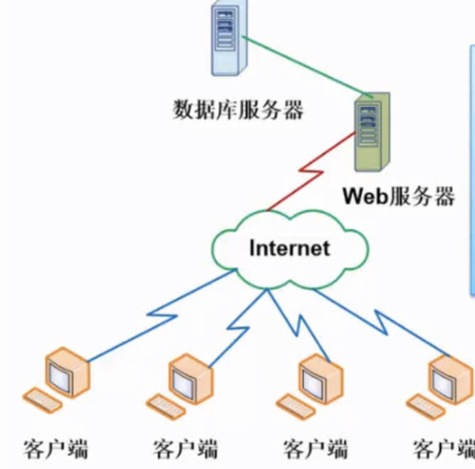

#### 混合架构风格
* 内外有别模型：内部C/S发挥性能优势，外部B/S架构
* 查改有别模型

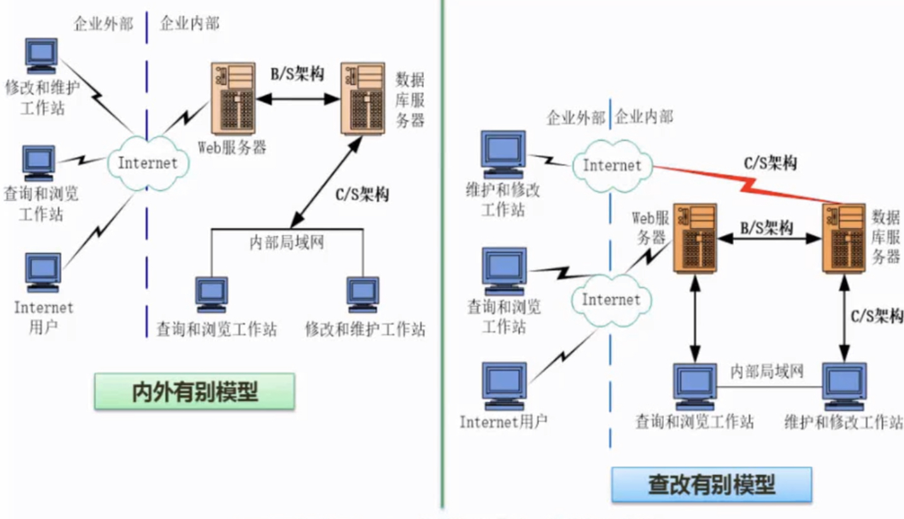

#### 富互联网应用(RIA)
* RIA结合了C/S架构反应速度快、交互性强的优点、以及B/S架构传播范围广及容易传播的特性
* RIA简化并改进了B/S架构的用户交互
* 数据能够被缓存在客户端，从而可以实现一个比基于HTML的响应速度更快且数据往返于服务器的次数更少的用户界面

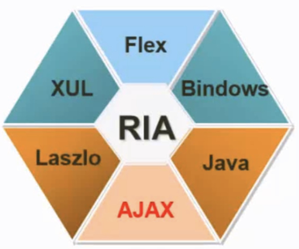

##### AJAX
* 基于HTML和CSS标准的表示
* 使用DOM进行动态显示和交互
* 使用XML和XLST进行数据交换及相关操作
* 使用XMLHttpRequest与服务器进行异步通信
* 使用JavaScript绑定一切

#### mushup
* RSS：一种用于对网站内容进行描述和同步的格式，是目前最广泛的Web资源发布方式
* REST：从资源的角度看待整个网络，各处的资源由URI确定，客户端的应用通过URI获取资源的表示
* SOAP：一种基于XML的数据格式定义，用来进行Web服务调用过程中的参数调用和返回
* ATOM：一种基于XML的文档格式和基于HTTP的协议，用来聚合网络内容

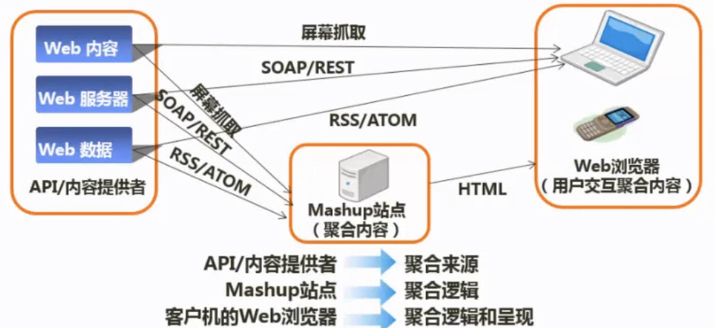

#### 基于服务的架构(SOA)
> 服务是一种为了满足某项业务需求的操作、规则等的逻辑组合，它包含一系列有序活动的交互，为实现用户目标提供支持

* 特色：松散耦合、粗粒度(服务>构件>对象)、标准化接口
* 与传统构件的区别
  * 服务构件粗粒度，传统构件细粒度居多
  * 服务构件的接口是标准的，主要是WSDL接口，传统构件常以具体API形式出现
  * 服务构建的实现与语言无关，传统构件绑定某种特定的语言
  * 服务构件可以通过构件容器提供QoS服务，传统构件完全由程序代码直接控制
* 实现方式
  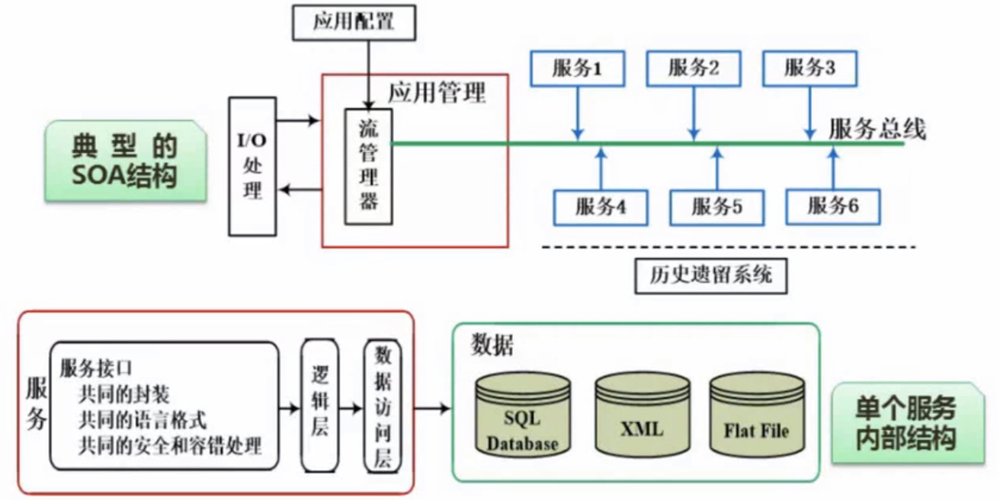
  * Web Service 
  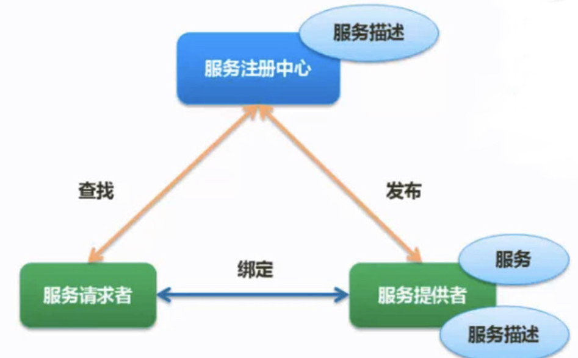
  

  |功能|协议|
  |:--:|:--:|
  |发现服务|<font color="red">UDDI</font>、DISCO|
  |描述服务|<font color="red">WSDL</font>、XML Schema|
  |消息格式层|<font color="red">SOAP</font>、REST|
  |编码格式层|XML|
  |传输协议层|HTTP、TCP/IP、SMTP等|

  * ESB
  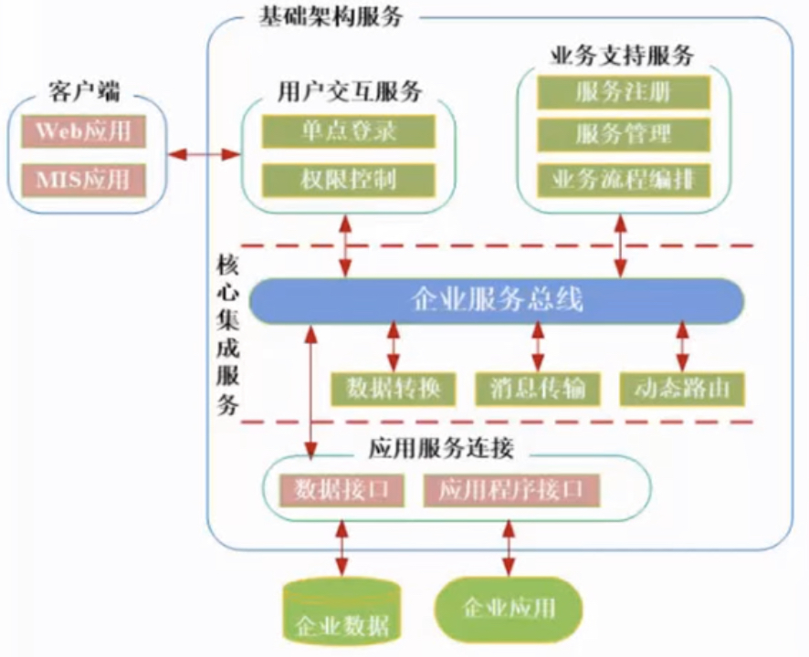
    * 提供位置透明性的消息路由和寻址服务
    * 提供服务注册和命名的管理功能
    * 支持多种消息传递范型
    * 支持多种可以广泛使用的传输协议
    * 支持多种数据格式及其相互转换
    * 提供日志和监控功能

### 软件架构评估
#### 质量属性
* <font color="red">性能</font>
> 性能(performance)是指系统的<font color="red">响应能力</font>，即要经过多长事件才能对某个事件做出响应，或者在某段时间内系统所能处理的事件的个数。经常用单位事件内所处理事务的数量或系统完成某个事务处理所需的时间来对性能进行定量的表示。性能测试经常要使用基准测试程序（用以测量性能指标的特定事务集或工作量环境）

* 可靠性
> 可靠性(reliability)是软件系统在应用或系统错误面前，在意外或错误使用的情况下维持软件系统的功能特性的基本能力。可靠性通常用平均失效等待时间(Mean Time To Failure，简称MTTF)和平均失效间隔时间(Mean Time Between Failure，简称MTBF)来衡量。在<font color="red">失效率</font>为常数和修复时间很短的情况下，MTTF和MTBF几乎相等

* <font color="red">可用性</font>
> 可用性(avaliability)是系统能够正常运行的<font color="red">时间比例</font>。经常用两次故障之间的时间长度或在出现故障时系统能够恢复正常的速度来表示。

* <font color="red">安全性</font>
> 安全性(security)时滞系统在向合法用户提供服务的同时能够阻止非授权用户使用的企图或拒绝服务的能力。安全性时根据系统可能收到的安全威胁的类型来分类的。安全性又可划分为<font color="red">机密性、完整性、不可否认性及可控性</font>等特性

* <font color="red">可修改性</font>
> 可修改性(modifiability)是指能够快速地以较高的性能价格比对系统进行变更的能力。通常以某些具体的变更为基准，通过考察这些变更的代价衡量可修改性(<font color="red">设计阶段就需要考虑</font>)

* 功能性
> 功能性(functionality)是系统所能完成所期望的工作的能力。一项任务的完成需要系统中许多或大多数构件的相互协作

* ~~可变性~~
> 可变性(changeability)是指系统结构经扩充或变更而成为新体系结构的能力。这种新体系结构应该符合预先定义的规则，在某些具体方面不同于所有的体系结构。当要将某个体系结构作为一系列相关产品(例如，软件产品线)的基础时，可变性是很重要的

* ~~互操作性~~
> 作为系统组成部分的软件不是独立存在的，经常与其它系统或自身环境相互作用。为了支持互操作性(interoperation)，软件体系结构必须为外部可视的功能特性和数据结构提供精心设计的软件入口，程序和用其他编程语言编写的软件系统的交互作用就是互操作性的问题，这种互操作性也影响应用的软件体系结构

#### 概念表述
* 敏感点：变化值很小但对结果影响很大的点(敏感度很高的值，往往是一个)
* 权衡点：影响到多个质量属性的特性，多个都是属于敏感点(多个质量属性的折中)
* 风险点：潜在的存在问题的隐患
* 非风险点

#### 评估方法
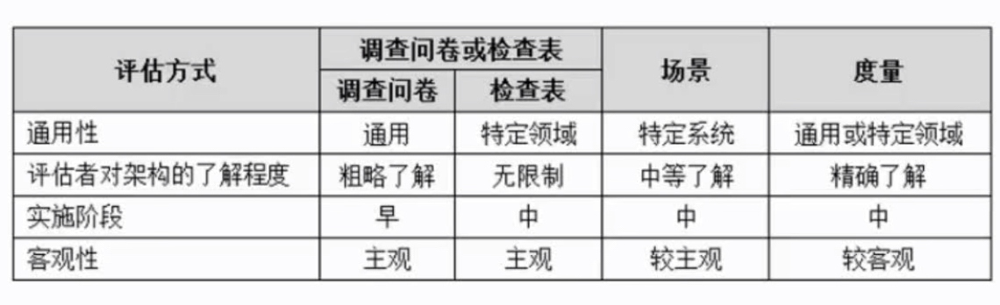
* 基于调查问卷(检查表)的方式(最客观的方式)
* 基于度量的方式
* <font color="red">基于场景的方式</font>
  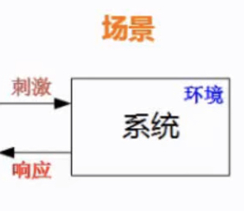

##### 基于场景的方式
> 确定应用领域的功能和软件架构的结构之间的映射
> 设计用于体现待评估质量属性的场景
> 分析软件架构对场景的支持程度

* 架构权衡分析法(ATAM)
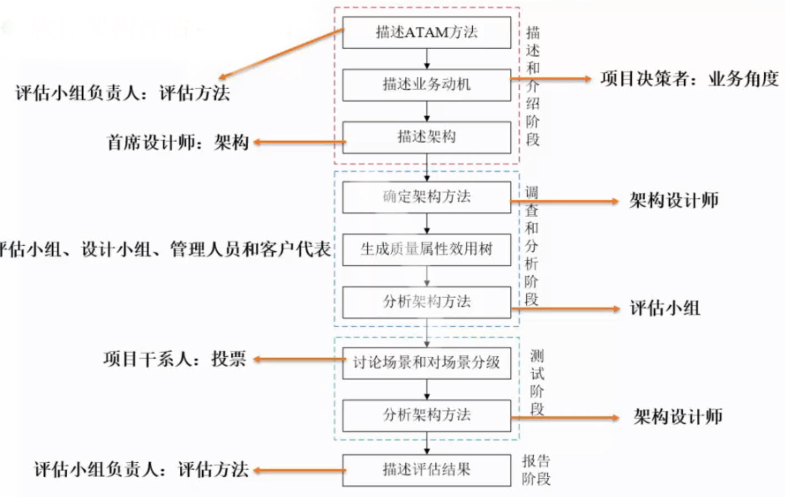

* 软件架构分析法(SAAM)
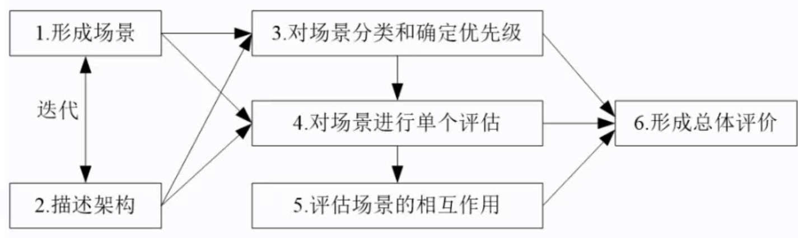

* 成本效益分析法(CBAM)

### 软件产品线
> 过程驱动、特定领域、技术支持、以架构为中心

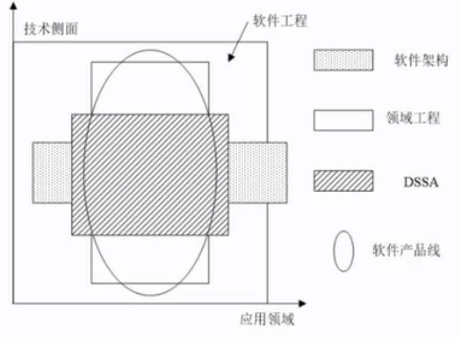

* 过程模型-双生命周期模型
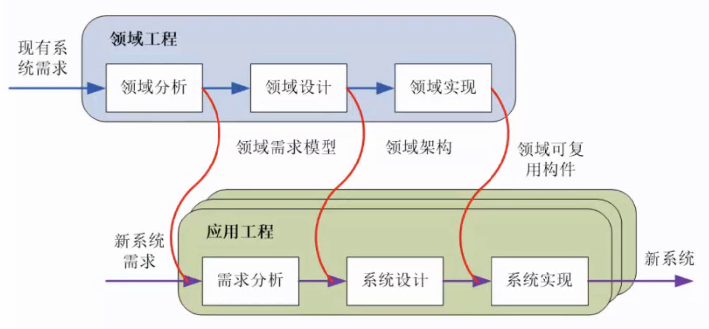

* 过程模型-SEI模型
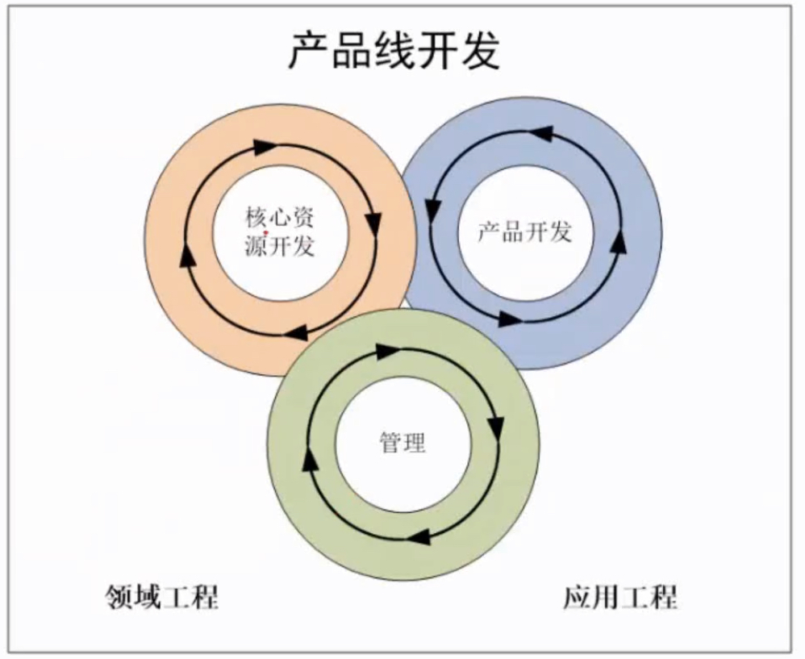

* ~~过程模型-三生命周期模型~~
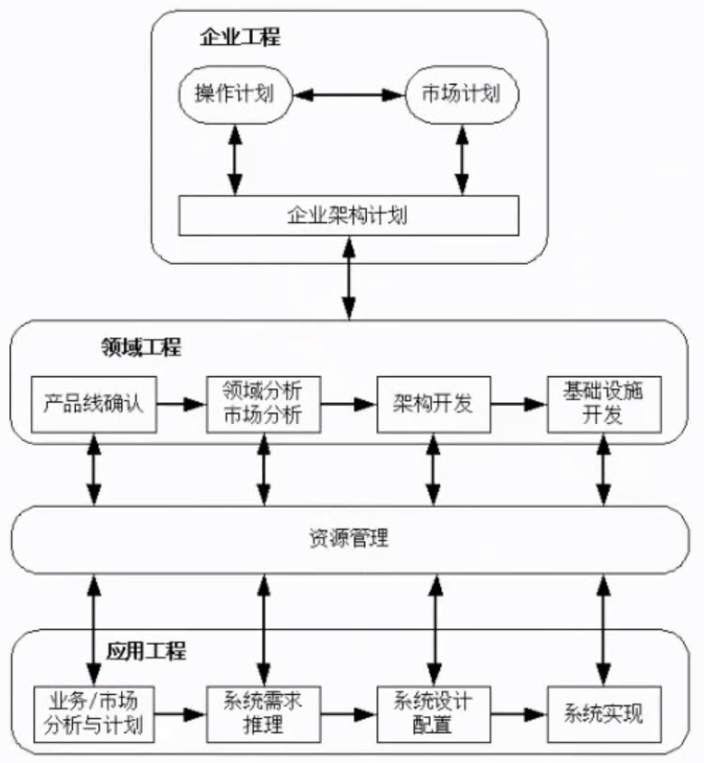

#### 组织结构
* <font color="red">设立独立的核心资源小组</font>：核心的、行业共性的开发工作(绝大多数部分)
* 不设立独立的核心资源小组：核心开发和应用开发在一个小组，但仍然会区分核心部分和应用部分，两者分别对待
* 动态的组织结构

#### <font color="red">建立方式</font>
* 将现有产品演化为产品线
* 用软件产品线替代现有产品集
* 全新软件产品线的演化
* 全新软件产品线的开发

||演化方式|革命方式|
|:--:|:--|:--|
|基于现有产品|基于现有产品架构设计产品线的架构，经演化现有构件，开发产品线构件|核心资源的开发基于现有产品集的需求和可预测的、将来的需求的超集|
|全新产品线|产品线核心资源随产品新成员的需求而演化|开发满足所有预期产品线成员的需求的核心资源|

### 中间件技术
> 中间件是一种独立的系统软件或服务程序，可以帮助分布式应用软件在不同的技术之间共享资源

* 负责客户机与服务器之间的连接和通信，以及客户机与应用层之间的高效率通信机制
* 提供应用层不同服务之间的互操作机制，以及应用层与数据库之间的连接和控制机制
* 提供多层架构的应用开发和运行的平台，以及应用开发框架，支持模块化的应用开发
* 屏蔽硬件、操作系统、网络和数据库的差异
* 提供应用的负载均衡和高可用性、安全机制与管理功能，以及交易管理机制，保证交易的一致性
* 提供一组通用的服务去执行不同的功能，避免重复的工作和使应用之间可以协作

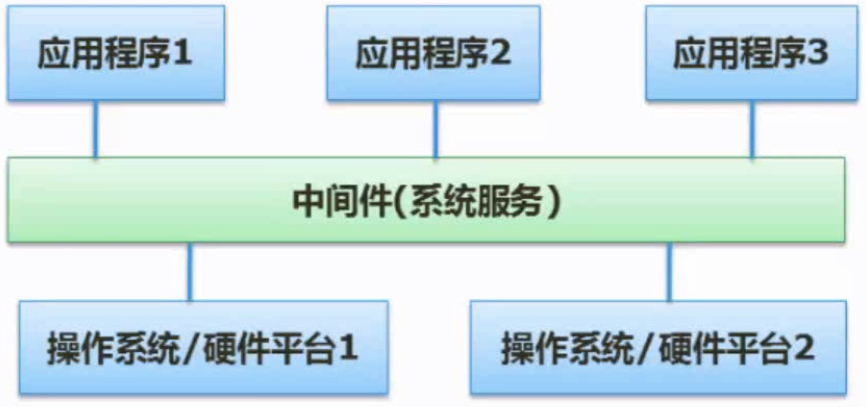

#### 主要中间件
* 远程过程调用
* 对象请求代理
* 远程方法调用
* 面向消息的中间件
* 事务处理监控器

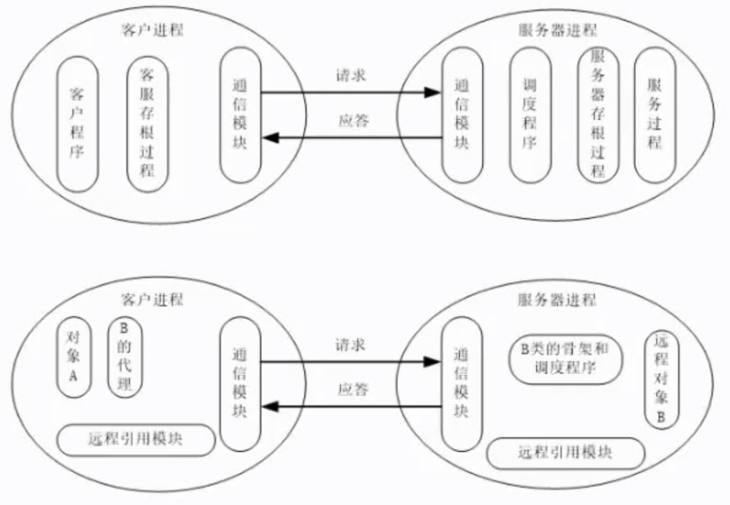
* Corba(公共对象请求代理体系结构)
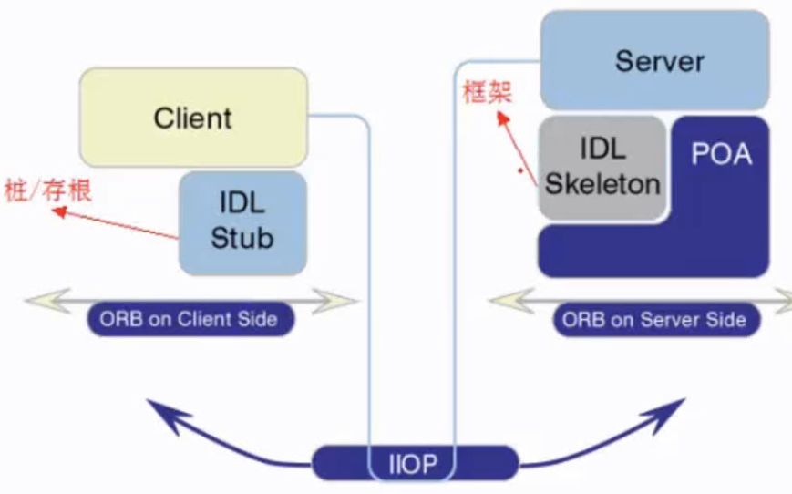

### 典型应用架构
#### J2EE-分布式多层应用程序
  * 业务层
    * 会话Bean：短暂会话
    * 实体Bean：持久化数据
    * 消息驱动Bean：会话Bean+JMS
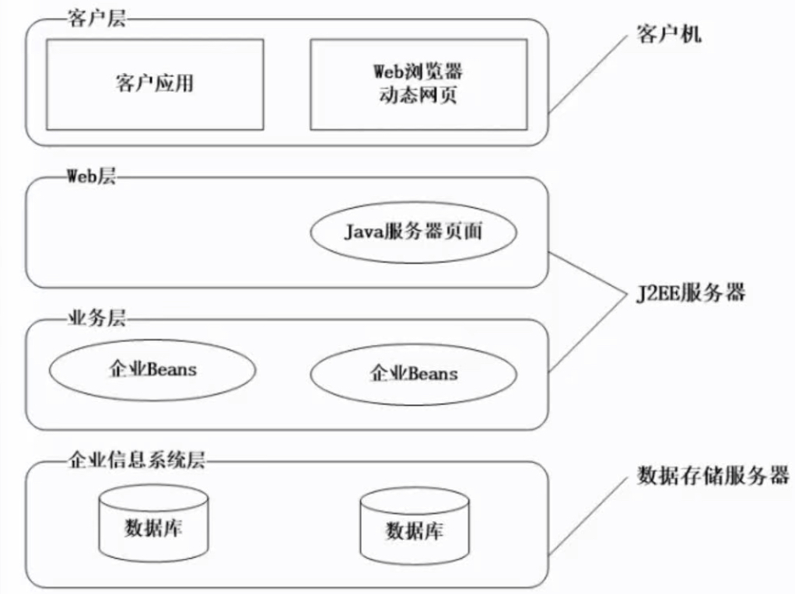

#### .NET
  * 通用语言运行环境：支持多种语言，各语言被转换为通用语言运行规范，在通用语言运行环境上运行(对应java的虚拟机)
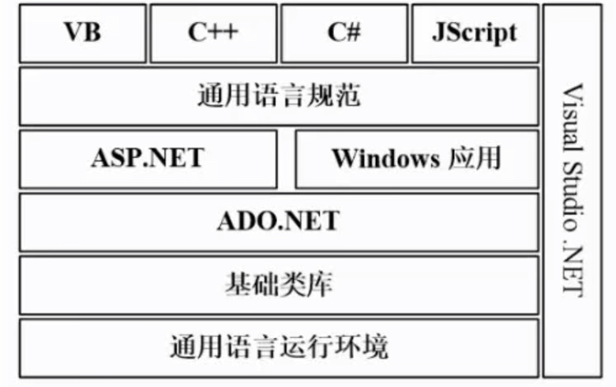
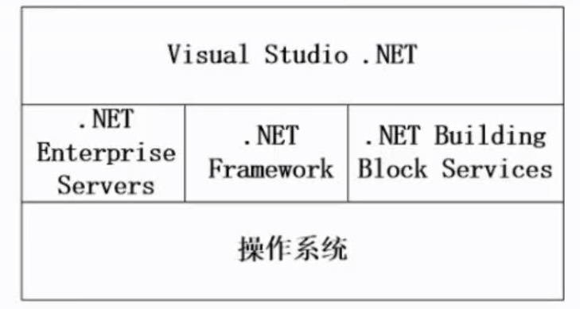

#### .NET与J2EE
  * JVM和CLR：同样思想下的产物
  * 对多层分布式应用的支持：没有多大差异
  * 安全性
  * 应用程序的部署
  * 可移植性：.NET的可移植性较差(依附于微软自己的操作系统平台)，J2EE可移植性较好
  * 外部支持：.NET支持语言多一下

#### MVC设计模式
  * 主动MVC
    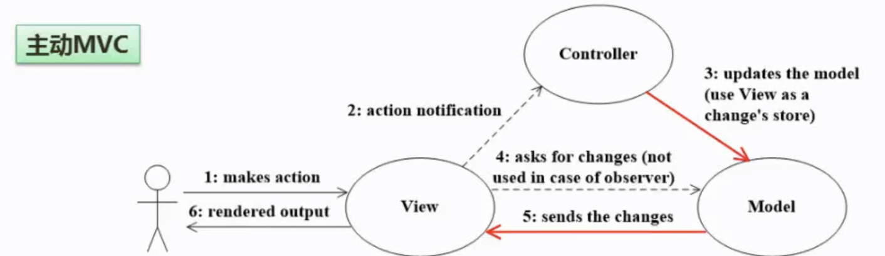
  * 被动MVC
    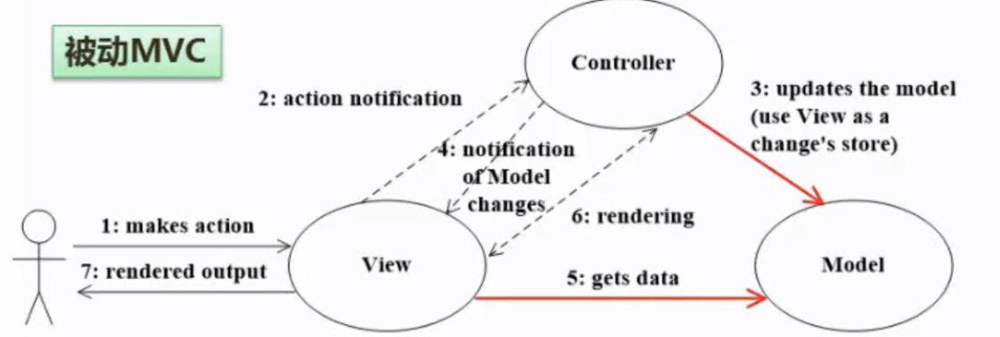

#### MVP设计模式
* MVP是MVC的变种
* MVP实现了V与M之间的解耦(V不直接使用M，修改V不会影响M)
* MVP更好的支持单元测试(业务逻辑在P中，可以脱离V来测试这些逻辑；可以将一个P用于多个V，而不需要改变P的逻辑)
* MVP中V要处理界面事件，业务逻辑在P中，MVC中界面事件由C处理

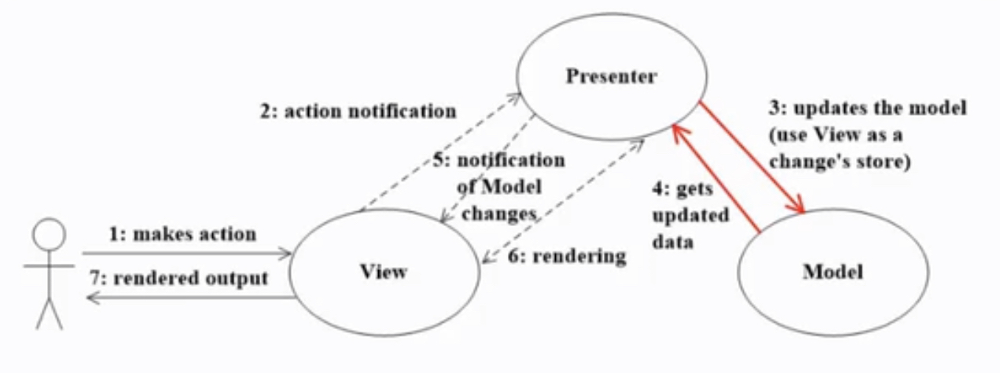

## 信息安全分析与设计
### 信息系统安全属性
* 保密性：最小授权原则、防暴露、信息加密、物理加密
* 完整性：安全协议、校验码、密码校验、数字签名、公证
* 可用性：综合保障（IP过滤、业务流控制、路由选择控制、审计跟踪）
* 不可抵赖性：数字签名

### 对称加密技术
* DES：替换+移位、56位密钥、64位数据块、速度快、密钥易生成
  * 3DES(三重DES)：两个56位的密钥K1、K2（加密：K1加密->K2解密->K1加密；解密：k1解密->K2加密->K1解密）
* AES：高级加密标准Rijndael加密法，是美国联邦政府采用的一种区块加密标准。这个标准用来替代原先的DES。堆区要求是“至少与3DES一样安全”
* RC-5：RSA数据安全公司的很多产品都使用了RC-5
* IDEA算法：128位密钥、64位数据块、比DES的加密性好、对计算机功能要求相对低，PGP

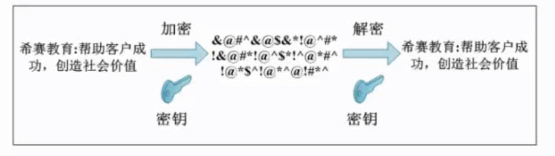
<font color="red">优点：加密速度快、效率高；缺点：加密强度不高、密钥分发困难</font>

### 非对称加密技术
* RSA：512位（或1024位）密钥、计算量极大、破解难
* <font color="red">Elgamal：其基础是Diffie-Hellman密钥交换算法</font>
* ECC：椭圆曲线算法
* 其它非对称算法包括：<font color="red">背包算法、Rabin、D-H</font>

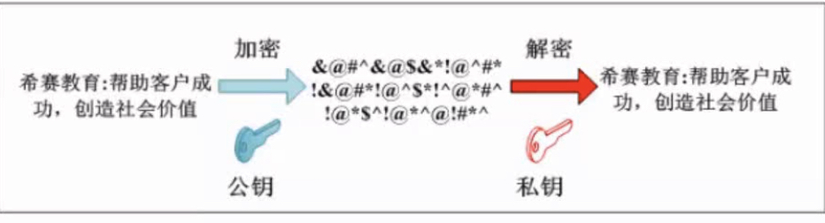
<font color="red">优点：破解难；缺点：加密速度慢，不适合加密大数据量</font>

### 信息摘要
> 单向散列函数（单向Hash函数）、固定长度的散列值

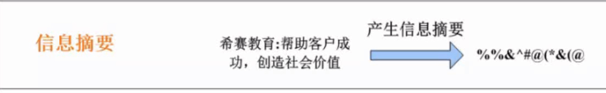
**常用的信息摘要算法有MD5、SHA等，市场上广泛使用的MD5、SHA算法的散列值分别位128位和160位，由于SHA通常采用的密钥长度较长，因此安全性高于MD5**

### 数字签名
> 防抵赖的技术、没有保密的职能只有识别身份的作用

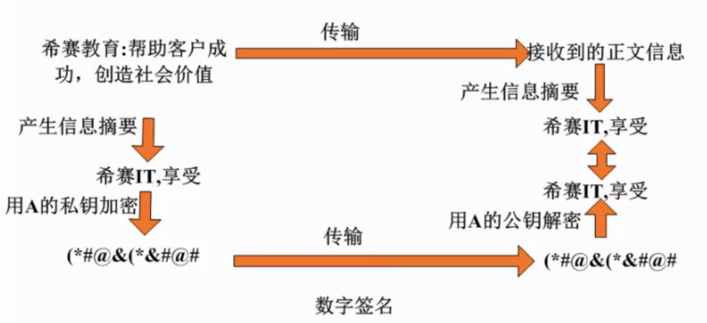

### 数字信封与PGP
* 数字信封
  1. 发送方将原文用对称加密传输，而将对称密钥用接收方公钥加密发送给对方
  2. 接收方收到电子信封，用自己的私钥解密信封，取出对称密钥解密得到原文

* PGP协议
  * PGP可用于电子邮件、也可以用于文件存储。采用了杂合算法，包括IDEA、RSA、MD5、ZIP数据压缩算法
  * PGP承认两种不同的证书格式：PGP证书和X.509证书
  * PGP证书包含PGP版本号、证书持有者的公钥、证书持有者的信息、证书拥有者的数字签名、证书的有效期、密钥首选的对称加密算法
  * X.509证书包含证书版本、证书的序列号、签名算法标识、证书有效期、证书发行商名字、证书主体名、<font color="red">主体公钥信息</font>、发布者的数字签名

### 练习题-设计邮件加密系统
要求邮件以加密方式传输，邮件最大附件内容可达500MB，发送者不可抵赖，若邮件被第三方截获，第三方无法篡改[^25]

### PKI公钥体系
> 防欺骗

* 运行流程
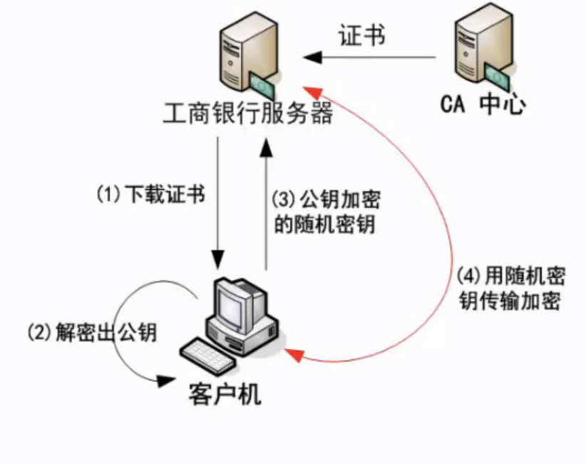

* PKI公钥体系分层
> CA、RA、证书受理点、密钥管理中心-KMC


### 信息系统安全保障层次
* 身份认证
  * 用户名+口令
  * 数字证书
  * 生物特征识别
* 访问控制
  * 自主访问控制(DAC)：权限赋予过程有自主权利，给相应的主体赋予能够访问哪些客体的权限(存在安全风险)
  * 访问控制列表(ACL)：从客体出发，看哪些主体能访问客体(给资源指定能访问的主体列表)
  * 强制访问控制(MAC)：对主体和客体分级
  * 基于角色的访问控制模型(RBAC)
  * 基于任务的访问控制(TBAC)

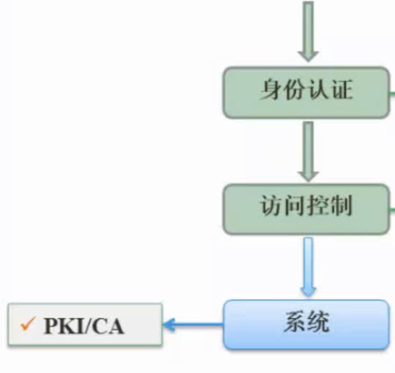

### 安全审计与安全系统设计原则
* 安全审计的作用
  * 震慑、警告
  * 发现计算机的滥用情况
  * 提供有效的追纠证据
  * 帮助发现系统的入侵和漏洞
  * 帮助发现系统性能上的不足
* 设计原则
  * <font color="red">木桶原则</font>：首先加强短板
  * 整体性原则
  * 安全性评价与平衡原则
  * 标准化和一致性原则
  * 技术与管理相结合原则
  * 统筹规划，分步实施原则
  * 等级性原则
  * 动态发展原则
  * 易操作性原则

### 网络安全-各个网络层次的安全保障
* SET：面向电子商务
* SSL：做选择时不要先对SSL所属的层次做定义，先对其他做判断
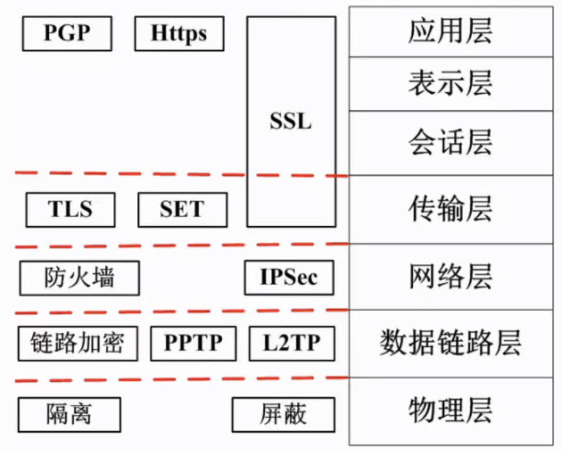

### 网络威胁与攻击

|威胁名称|描述|
|:--:|:--|
|重放攻击(ARP)/ARP欺骗攻击|所截获的某次合法的通信数据拷贝，出于非法的目的而被重新发送|
|拒绝服务(DOS)|对信息或其它资源的合法访问被无条件地阻止|
|窃听|用各种可能的合法或非法的手段窃取系统中的信息资源和敏感信息。例如对通信线路中传输的信号进行搭线监听，或者利用通信设备在工作过程中产生的电磁泄漏截取游用信息等|
|业务流分析|通过对系统进行<font color="red">长期监听</font>，利用<font color="red">统计分析方法</font>对诸如通信频度、通信的信息流向、通信总量的变化等参数进行研究，从而发现有价值的通信和规律|
|信息泄露|信息被泄露或透露给某个非授权的实体|
|破坏信息的完整性|数据被非授权地进行增删、修改或破坏而受到损失|
|非授权访问|某一资源被非授权的人、或以非授权的方式使用|
|假冒|通过欺骗通信系统(或用户)达到非法用户冒充合法用户，或者特权小的用户冒充特权大的用户的目的。黑客大多时采用假冒进行攻击|
|旁路控制|攻击者利用<font color="red">系统的安全缺陷或安全性上的脆弱之处</font>获得非授权的权利或特权。例如，攻击者通过各种攻击手段发现原本应保密，但是却又暴露出来的一些系统“特性”。利用这些“特性”，攻击者可以绕过防线守卫者侵入系统的内部|
|授权侵犯|被授权以某一目的的使用某一系统或资源的个人，却将此权限用于其它非授权的目的，也称为“内部攻击”|
|特洛伊木马|软件中含有一个察觉不出的或者无害的程序段，当它被执行时，会破坏用户的安全|
|陷阱门|在某个系统或某个部件中设置了“机关”，使得当提供特定的输入数据时允许违反安全策略|
|抵赖|这是一种来自用户的攻击，比如：否认自己曾经发布过的某条信息，伪造一份对方来行等|

* DoS(拒绝服务)与DDoS
> 破坏系统的可用性

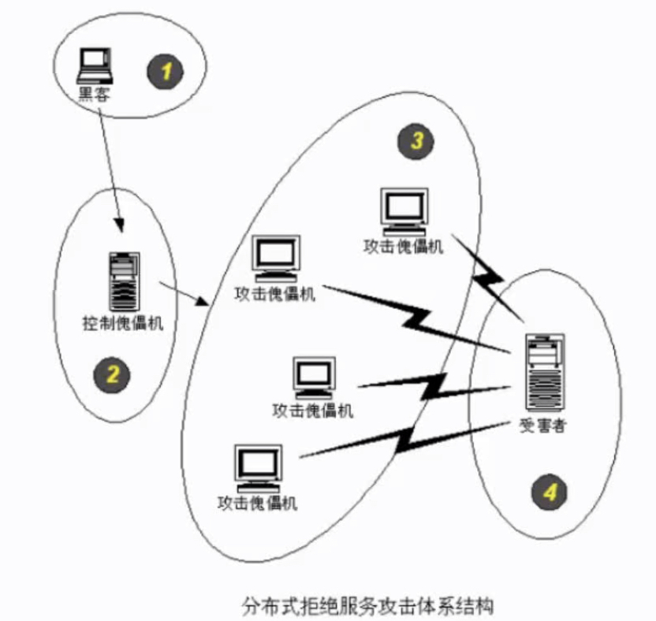

### 防火墙
> 防外不防内

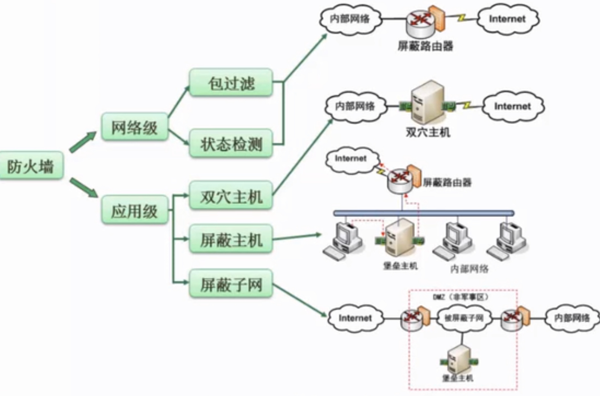
* 网络级：层次低，效率高(只检测IP头可以伪造)
  * 状态检测：检测TCP/IP连接信息
* 应用级：层次高，效率低(开箱检查)
  * <font color="red">屏蔽子网：在外网和内网之间建立屏蔽子网区/隔离区/DMZ非军事区，既不属于内部网络也不属于外部网络。主要放对外提供服务的服务器</font>

### 入侵检测
* 入侵检测流程
  

* 入侵检测特点
  

### 计算机病毒与木马
* 病毒：编制或者在计算机程序中插入的破坏计算机功能或破坏数据，影响计算机使用并且<font color="red">能够自我复制</font>的一组计算机指令或者程序代码。病毒具有：传染性、隐藏性、潜伏性、破坏性、针对性、衍生性、寄生性、未知性
* 木马：计算机木马是一种后门程序，常被黑客用作<font color="red">控制远程计算机</font>的工具

* 病毒分类
  * 系统引导型病毒
  * 文件外壳型病毒
  * 目录型病毒：破坏目录文件
  * 蠕虫病毒（Worm）：熊猫烧香、罗密欧与朱丽叶、恶魔、尼达姆、冲击波(感染可执行文件)
  * 木马（Trojan）：QQ消息尾巴木马
  * 宏病毒（Macro）：美丽莎（Melissa）、台湾1号(感染Office体系的)
* 几种代表性病毒
  * CIH病毒：史上唯一破坏硬件的病毒
  * 红色代码：蠕虫病毒+木马

## 系统可靠性分析和设计
### 系统故障模型
> 部件失效、物理干扰、操作或设计不当引起的错误状态

* 表现形式：永久性、间歇性、瞬时性
* 逻辑级的故障模型：短路故障、开路故障、桥接故障(物理层次)
* 数据结构级的故障：独立差错、算数差错、单向差错
* <font color="red">软件故障和软件差错</font>：非法转移、误转移、死循环、空间溢出、数据执行、无理数据
* 系统级的故障模型

### 可靠性指标

* 平均无故障事件(MTTF)：$MTTF = \frac{1}{\lambda}$，$\lambda$为失效率
* 平均故障修复时间(MTTR)：$MTTR = \frac{1}{\mu}$，$\mu$为修复率
* 平均故障间隔事件(MTBF)：$MTBF=MTTR+MTTF$
* 系统可用性：$\frac{MTTF}{MTTR+MTTF}\times 100\%$

<font color="red">在实际应用中，一般MTTR很小，所以通常认为$MTBF \approx MTTF$</font>

* 可靠性和可用性
> <font color="red">系统可靠性</font>是系统在规定的时间内及规定的环境条件下，完成规定功能的能力，也就是系统无故障运行的概率
> <font color="red">系统可用性</font>是指在某个给定的时间点上系统能够按照需求执行的效率
提高可靠性需要强调减少<font color="red">系统中断(故障)的次数</font>，提高可用性需要强调<font color="red">减少从灾难中恢复的事件</font>
* 例
假设同一型号的1000台计算机，在规定的条件下工作1000小时，其中有10台出现故障。
这种计算机千小时的可靠度R为$\frac{(1000-10)}{1000}=0.99$
失效率为$\frac{10}{1000 \times 1000}=1\times 10^{-5}$
$MTTF=\frac{1}{1\times 10^{-5}}=10^{5}小时$

### 可靠性分析
* 串联系统
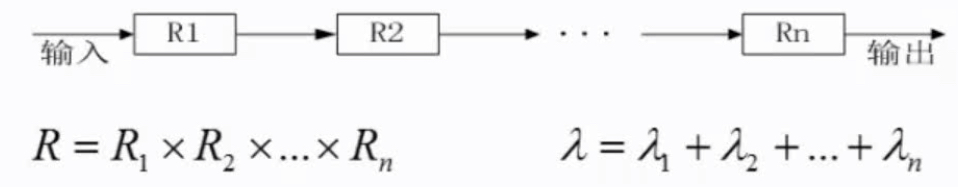

* 并联系统
  * 失效率可以用$1-R$求得即1减去可靠度
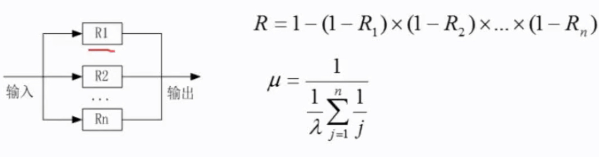

* ~~N模冗余系统~~
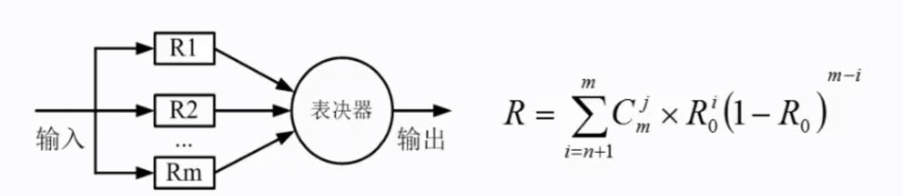

* 混合系统
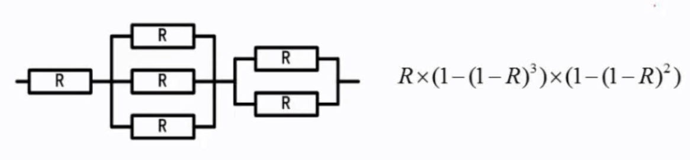

### 系统容错
* 避错技术：测试、验证等
* 容错技术
  * 结构冗余（硬件冗余、软件冗余）
    * 静态冗余（屏蔽冗余、被动冗余、模冗余系统）：通过表决和比较来屏蔽系统的错误，没有过多检测和反复的过程
    * 动态冗余（主动冗余：备份系统、集群系统）：通过检测定位问题然后进行恢复
      * 故障检测
      * 故障定位
      * 故障恢复
    * 混合冗余：
  * 信息冗余（校验码）
  * 事件冗余（重复多次进行相同得计算）
  * 冗余附加（为实现上述冗余技术所需的资源和技术）

#### 冗余系统
* 故障检测
* 故障屏蔽
* 故障限制
* 复执
* 故障诊断
* 系统重配置
* 系统恢复
  * 前向恢复：<font color="red">使当前的计算继续下去</font>，把系统恢复成连贯的正确状态，弥补当前状态的不连贯情况
  * 后向恢复：系统恢复到前一个正确状态，继续执行
* 系统重新启动
* 修复
* 系统重组合

后向恢复简单地把变量恢复到检查点的取值；前向恢复将对一些变量的状态进行修改和处理，且这个恢复过程将由程序设计者设计
前向恢复适用于可预见的易定义的的错误；后向恢复可屏蔽不可预见的错误

### 软件容错
* N版本程序设计
> 与通常软件开发过程不同的是，N版本程序设计增加了三个新的阶段：相异成份规范评审、相异性确认、背对背测试
> N版本程序的同步、N版本程序之间的通信、表决算法（全等表决、非精确表决、Cosmetie表决）、一致比较问题、数据相异性

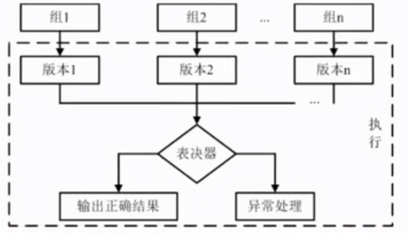

* 恢复块方法
> 设计时应保证实现主块和后备块之间的独立性，避免相关错误的产生，使主块和备份块之间的共性错误降到最低程度
> 必须保证验证测试程序的正确性


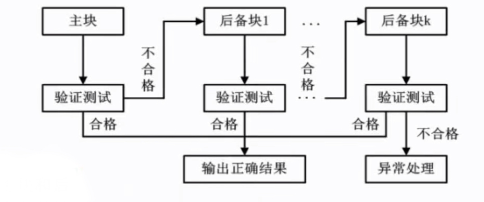

* N版本和恢复块比较

||恢复块方法|N版本程序设计|
|:--:|:--:|:--:|
|硬件运行环境|单机|多机|
|错误检测方法|验证测试程序|表决|
|恢复策略|后向恢复|前向恢复|
|实时性|差|好|

* 防卫式程序设计
> 对于程序中存在的错误和不一致性，通过在程序中包含错误检查代码和错误恢复代码，使得一旦错误发生，程序能撤销错误状态，恢复到一个已知的正确状态中去
> 实现策略：错误检测、破坏估计、错误恢复

* 双机容错
  * 双机热备模式（主系统、备用系统）
  * 双机互备模式（同时提供不同的服务，心不跳则接管）
  * 双机双工模式（同时提供相同的服务，集群的一种）

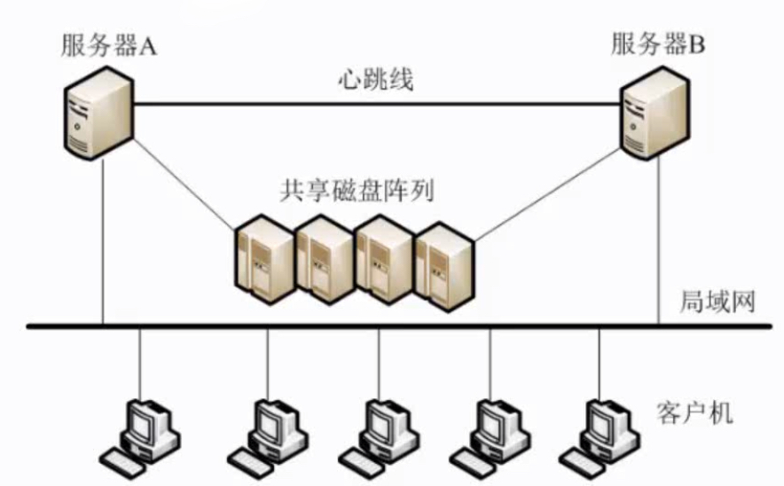

### 集群技术
> 可伸缩性、高可用性、可管理性、高性价比、高透明性

* 高性能计算集群
* 负载均衡集群
  * 基于特定软件的负载均衡
  * 基于DNS的负载均衡
  * 基于NAT的负载均衡
  * 反向代理负载均衡
  * 混合型负载均衡
* 高可用性集群

#### 负载均衡算法
* 静态算法：轮转算法、加权轮转算法、最小连接数算法、加权最小连接数算法、源地址哈希散列算法、目标地址哈希散列算法、随机算法
* 动态算法：加权百分比算法


[^1]: 112、4
[^2]: C、B
[^3]: 1.8、3
[^4]: A、C
[^5]: C、A、A
[^6]: D、A、C
[^7]: 13，计算公式：a*(n-1)+1
[^8]: B
[^9]: D、B(访问位为1的不能淘汰，只能淘汰为0的)
[^10]: 12、5、9
[^11]: B、C(指令一次性读入，只产生一次缺页中断，数据跨页产生两次)
[^12]: C、D
[^13]: D($\frac{4195+1}{32}$)、B(第132字第0位置为：4192，第1位置：4193，第2位置：4194，第3位置：4195)，字从1开始算，位置从0开始算
[^14]: C
[^15]: A 

[^16]: ABCD 

[^17]: B 

[^18]: C、D、A
[^19]: 是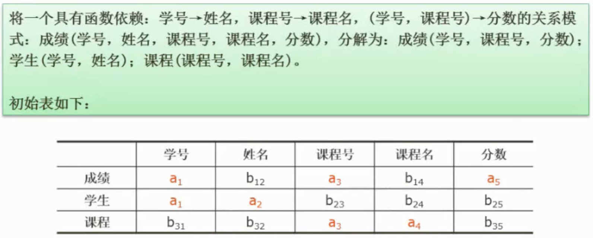
[^20]: 是、否
[^21]: B
[^22]: A
[^23]: 程序员A1:2;程序员A2:0；程序员B:0；单元测试A:1；单元测试B:0； 集成测试:0
[^24]: AC:400，EV:300，PV：500，SV=-200，CV=-100，SPI=0.6，CPI=0.75，ETC=700(按计划)/933.33(不按计划走)，EAC=1100(按计划)/1333.33(不按计划)
[^25]: 加密解密技术、对称加密技术、数字信封、数字摘要、数字签名