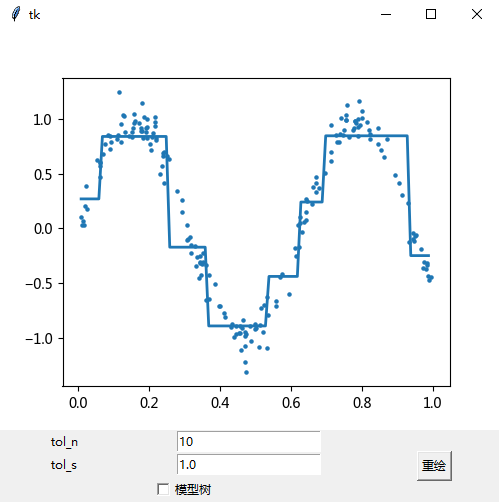
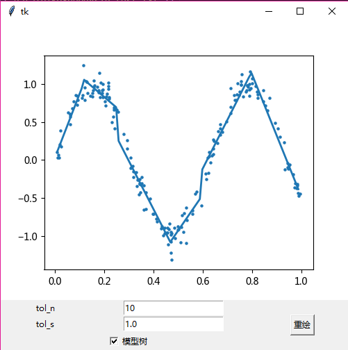

## 树回归概述
> 使用二元切分来处理连续数据

### 树回归的优缺点
* 优点：可以对复杂和非线性的数据建模
* 缺点：结果不易理解
* 适用数据类型：数值型和标称型数据

### 树回归的工作原理
**CART(Classification And Regression Trees，分类回归树)** 采用二元切分来处理连续型变量。如果特征值大于给定值就走左子树，否则就走右子树，树构建一般是离线完成。其中回归树是在每个叶节点构建一个数值，而模型树是在每个叶节点构建一个线性模型。

### 树回归的一般流程
1. 收集数据：采用任意方法收集数据
2. 准备数据：需要数值型的数据，标称型数据应该映射成二值型数据
3. 分析数据：绘出数据的二维可视化显示结果，以字典方式生成树
4. 训练算法：大部分时间都花费在叶节点树模型的构建上
5. 测试算法：使用测试数据上的R2值来分析模型的效果
6. 使用算法：使用训练出的树做预测

## 树回归的实现
在Python中，由于其简单的数据结构，可以使用字典来存储构建的树，该字典包含四个元素:
* 待切分的特征
* 待切分的特征值
* 右子树。当不再需要切分的时候，也可以是单个值
* 左子树。当不再需要切分的时候，也可以是单个值

### CART算法实现
* creat_tree()伪代码
```
找到最佳的待切分特征：
    如果该节点不能再分，将该节点存为叶节点
    执行二元切分
    在右子树调用create_tree()方法
    在左子树调用create_tree()方法
```
* CART实现
```Python
def load_data_set(file_name):
    """加载数据
    :param file_name: 文件名
    :return:
    """
    data_mat = []
    with open(file_name, 'r', encoding='utf-8') as f:
        for line in f.readlines():
            cur_line = line.strip().split('\t')
            # 将每行映射成为浮点数
            flt_line = list(map(np.float, cur_line))
            data_mat.append(flt_line)
    return data_mat


def bin_split_data_set(data_set, feature, value):
    """将数据切分成两个子集并返回
    :param data_set: 数据集
    :param feature: 待切分的特征
    :param value: 该特征的某个值
    :return:
    """
    # nonzero返回的是index
    mat_0 = data_set[np.nonzero(data_set[:, feature] > value)[0], :]
    mat_1 = data_set[np.nonzero(data_set[:, feature] <= value)[0], :]
    return mat_0, mat_1


def create_tree(data_set, leaf_type=reg_leaf, err_type=reg_err, ops=(1, 4)):
    """创建树
    :param data_set: 数据集
    :param leaf_type: 建立叶节点的函数
    :param err_type: 误差计算函数
    :param ops: 树构建所需要的其他元组
    :return:
    """
    # 切分数据集
    feat, val = choose_best_split(data_set, leaf_type, err_type, ops)
    if feat is None:
        # 如果满足条件
        # 则返回叶节点
        return val
    # 不满足则创建新的字典
    ret_tree = dict({})
    ret_tree['sp_ind'] = feat
    ret_tree['sp_val'] = val
    # 切分数据集
    l_set, r_set = bin_split_data_set(data_set, feat, val)
    # 递归调用创建树
    ret_tree['left'] = create_tree(l_set, leaf_type, err_type, ops)
    ret_tree['right'] = create_tree(r_set, leaf_type, err_type, ops)
    return ret_tree

```
### 回归树构建
回归树假设叶节点是常数值。如果需要成功构建以常数分段为叶节点的树，需要度量出数据的一致性。使用树分类时需要在给定节点计算数据的混乱度。计算连续型数值的混乱度首先计算数据的均值，然后计算每条数据的值到均值的差值(使用绝对值或平方值)
* 最佳二元切分伪代码
```
对每个特征：
    对每个特征值：
        将数据集切分成两份
        计算切分的误差
        如果当前误差小于当前最小误差：
            将当前切分设定为最佳切分并更新最小误差
返回最佳切分的特征和阈值
```

* 回归树切分
```Python
def reg_leaf(data_set):
    """生成叶节点
    :param data_set: 数据集
    :return:
    """
    # 回归树中是目标变量的均值
    return np.mean(data_set[:, -1])


def reg_err(data_set):
    """误差估计函数
    :param data_set:
    :return:
    """
    # 总方差等于均方差乘以样本个数
    return np.var(data_set[:, -1]) * np.shape(data_set)[0]


def choose_best_split(data_set, leaf_type=reg_leaf, err_type=reg_err, ops=(1, 4)):
    """寻找数据的最佳二元切分方式
    :param data_set: 数据集
    :param leaf_type: 生成叶节点函数
    :param err_type: 误差函数
    :param ops: 用于控制函数的停止时机
    :return:
    """
    # 容许的误差下降值
    tol_s = ops[0]
    # 切分的最少样本树
    tol_n = ops[1]
    if len(set(data_set[:, -1].T.tolist()[0])) == 1:
        # 统计不同特征的数目
        # 如果为1就不再切分直接返回
        return None, leaf_type(data_set)
    # 计算当前数据集的大小和误差
    m, n = np.shape(data_set)
    # 误差用于与新切分的误差进行对比
    # 来检查新切分能否降低误差
    s = err_type(data_set)
    best_s = np.inf
    best_index = 0
    best_value = 0
    for feat_index in range(n-1):
        # 遍历所有特征
        for split_val in set(data_set[:, feat_index].T.tolist()[0]):
            # 遍历该特征上的所有取值
            mat_0, mat_1 = bin_split_data_set(data_set, feat_index, split_val)
            if np.shape(mat_0)[0] < tol_n or np.shape(mat_1)[0] < tol_n:
                # 如果切分后子集不够大
                # 进入下一次循环
                continue
            new_s = err_type(mat_0) + err_type(mat_1)
            if new_s < best_s:
                # 如果新子集的误差小于最好误差
                # 更新特征下标/切分值/最小误差
                best_index = feat_index
                best_value = split_val
                best_s = new_s
    if s-best_s < tol_s:
        # 如果切分数据集后提升不大
        #  则不在进行切分而直接创建叶节点
        return None, leaf_type(data_set)
    mat_0, mat_1 = bin_split_data_set(data_set, best_index, best_value)
    if np.shape(mat_0)[0] < tol_n or np.shape(mat_1)[0] < tol_n:
        # 如果切分出的数据集很小则退出
        return None, leaf_type(data_set)
    return best_index, best_value
```

### 树剪枝
当一棵树的节点过多，表明该模型可能对数据进行了"过拟合"。通过降低决策树的复杂度来避免过拟合的过程称为 **剪枝(pruning)**。在函数`choose_best_split()`中提前终止条件是一种 **预剪枝(prepruning)**；使用测试集和训练集的方式是 **后剪枝(postpruning)**。
#### 预剪枝
通过不断修改停止条件`tol_s`来得到合理结果。
* 使用默认`ops`项
```Python
In [5]: my_data = mat(reg_trees.load_data_set('data/ex2.txt'))

In [6]: reg_trees.create_tree(my_data)
Out[6]:
{'left': {'left': {'left': {'left': 105.24862350000001,
    'right': 112.42895575000001,
    'sp_ind': 0,
    'sp_val': 0.958512},
    ...
 'sp_ind': 0,
 'sp_val': 0.499171}
```
* 使用较大的`tol_s`
```Python
In [8]: reg_trees.create_tree(my_data, ops=(10000,4))
Out[8]:
{'left': 101.35815937735848,
 'right': -2.6377193297872341,
 'sp_ind': 0,
 'sp_val': 0.499171}
```
#### 后剪枝
使用后剪枝需要将数据集分成测试集和训练集。首先指定参数，使构建出的树足够大、足够复杂，便于剪枝。接下来从上而下找到叶节点，用测试集判断这些叶节点合并是否能降低测试误差
* 伪代码
```
基于已有的树切分测试数据：
    如果存在任一子集是一棵树，在该子集递归剪枝过程
    计算将当前两个叶节点合并后的误差
    计算不合并的误差
    如果合并会降低误差：
        合并叶节点
```
* 剪枝函数
```Python
def is_tree(obj):
    """判断是否是树
    :param obj: 需要判断的对象
    :return:
    """
    return type(obj).__name__ == 'dict'


def get_mean(tree):
    """计算叶节点的平均值
    :param tree: 树
    :return:
    """
    if is_tree(tree['right']):
        tree['right'] = get_mean(tree['right'])
    if is_tree(tree['left']):
        tree['left'] = get_mean(tree['left'])
    return (tree['left']+tree['right'])/2.0


def prune(tree, test_data):
    """ 树剪枝
    :param tree: 待剪枝的树
    :param test_data: 剪枝所需的测试数据
    :return:
    """
    if np.shape(test_data)[0] == 0:
        # 确认数据集是否是空
        return get_mean(tree)
    # 如果是子树就对该子树进行剪枝
    if is_tree(tree['right']) or is_tree(tree['left']):
        l_set, r_set = bin_split_data_set(test_data, tree['sp_ind'], tree['sp_val'])
    if is_tree(tree['left']):
        tree['left'] = prune(tree['left'], l_set)
    if is_tree(tree['right']):
        tree['right'] = prune(tree['right'], r_set)
    if not is_tree(tree['left']) and not is_tree(tree['right']):
        # 如果不是子树就进行合并
        l_set, r_set = bin_split_data_set(test_data, tree['sp_ind'], tree['sp_val'])
        error_no_merge = np.sum(np.power(l_set[:, -1]-tree['left'], 2))+np.sum(np.power(r_set[:, -1]-tree['right'], 2))
        tree_mean = (tree['left']+tree['right'])/2.0
        error_merge = np.sum(np.power(test_data[:, -1] - tree_mean, 2))
        if error_merge < error_no_merge:
            # 比较合并前后的误差
            # 合并后的误差比合并前的误差小
            # 就返回合并的树
            print("merging")
            return tree_mean
        else:
            # 否则直接返回
            return tree
    else:
        return tree
```
### 模型树
模型树将叶节点设定为分段线性函数，**分段线性函数(piecewise linear)**是指模型由多个线性片段组成。模型树具有可解释性和更高的预测准确度。模型树的误差通过线性的模型对指定的数据集进行拟合，然后计算真实的目标值与模型预测值间的差值。最后将这些差值的平方求和就得到所需的误差。
* 模型树叶节点
```Python
# 模型树
def linear_solve(data_set):
    """目标变量转换
    将数据集格式化成目标变量Y和自变量X
    :param data_set: 数据集
    :return:
    """
    m, n = np.shape(data_set)
    x = np.mat(np.ones((m, n)))
    x[:, 1:n] = data_set[:, 0:n-1]
    y = data_set[:, -1]
    x_t_x = x.T*x
    if np.linalg.det(x_t_x) == 0.0:
        raise NameError('该矩阵不能求逆，尝试提高ops参数的第二个值')
    ws = x_t_x.I*(x.T*y)
    return ws, x, y


def model_leaf(data_set):
    """生成叶子节点的回归系数
    :param data_set: 数据集
    :return:
    """
    ws, x, y = linear_solve(data_set)
    return ws


def model_err(data_set):
    """计算误差
    :param data_set: 数据集
    :return:
    """
    ws, x, y = linear_solve(data_set)
    y_hat = x*ws
    return np.sum(np.power(y-y_hat, 2))
```

## 示例：树回归与标准回归的比较[^1]
* 树回归预测
```Python
def reg_tree_eval(model, in_dat):
    """数据转换
    :param model: 树结构
    :param in_dat: 输入数据
    :return:
    """
    return np.float(model)


def model_tree_eval(model, in_data):
    """数据转换
    :param model: 树结构
    :param in_data: 输入数据
    :return:
    """
    n = np.shape(in_data)[1]
    x = np.mat(np.ones((1, n+1)))
    x[:, 1:n+1] = in_data
    return np.float(x*model)


def tree_fore_cast(tree, in_data, model_eval=reg_tree_eval):
    """预测函数
    :param tree: 树结构
    :param in_data: 输入数据
    :param model_eval: 树的类型
    :return:
    """
    if not is_tree(tree):
        return model_err(tree, in_data)
    if in_data[tree['sp_ind']] > tree['sp_val']:
        if is_tree(tree['left']):
            return tree_fore_cast(tree['left'], in_data, model_eval)
        else:
            return model_eval(tree['left'], in_data)
    else:
        if is_tree(tree['right']):
            return tree_fore_cast(tree['right'], in_data, model_eval)
        else:
            return model_eval(tree['right'], in_data)


def create_for_cast(tree, test_data, model_eval=reg_tree_eval):
    """ 测试函数
    :param tree: 树结构
    :param test_data: 测试数据
    :param model_eval: 树类型
    :return:
    """
    m = len(test_data)
    y_hat = np.mat(np.zeros((m, 1)))
    for i in range(m):
        y_hat[i, 0] = tree_fore_cast(tree, np.mat(test_data[i]), model_eval)
    return y_hat
```
* 创建回归树
```Python
In [13]: train_mat = mat(reg_trees.load_data_set('data/bikeSpeedVsIq_train.txt'))

In [14]: test_mat = mat(reg_trees.load_data_set('data/bikeSpeedVsIq_test.txt'))

In [15]: my_tree = reg_trees.create_tree(train_mat, ops=(1,20))

In [16]: y_hat = reg_trees.create_for_cast(my_tree, test_mat[:,0])

In [17]: corrcoef(y_hat, test_mat[:,1], rowvar=0)[0,1]
Out[17]: 0.96408523182221506
```
* 创建模型树
```Python
In [18]: my_tree = reg_trees.create_tree(train_mat, reg_trees.model_leaf,reg_trees.model_err, (1,20))

In [19]: y_hat = reg_trees.create_for_cast(my_tree, test_mat[:,0], reg_trees.model_tree_eval)

In [20]: corrcoef(y_hat, test_mat[:,1], rowvar=0)[0,1]
Out[20]: 0.97604121913806285
```
* 线性回归
```Python
In [21]: ws, x, y = reg_trees.linear_solve(train_mat)

In [22]: for i in range(shape(test_mat)[0]):
    ...:     y_hat[i]=test_mat[i,0]*ws[1,0]+ws[0,0]
    ...:

In [23]: corrcoef(y_hat, test_mat[:,1], rowvar=0)[0,1]
Out[23]: 0.94346842356747662
```

因为相关系数越接近1越好，所以可以看出在这里对数据的预测模型树>回归树>线性回归。

## 使用Tkinter创建GUI
* 回归树界面

* 模型树界面


****
[示例代码](https://github.com/coldJune/machineLearning/tree/master/MachineLearningInAction/reg_trees)
[^1]: 数据集是骑自行车的速度和人的智商之间的关系
