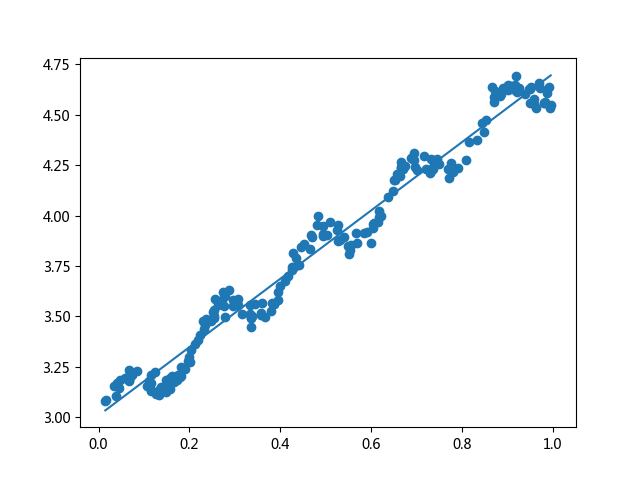
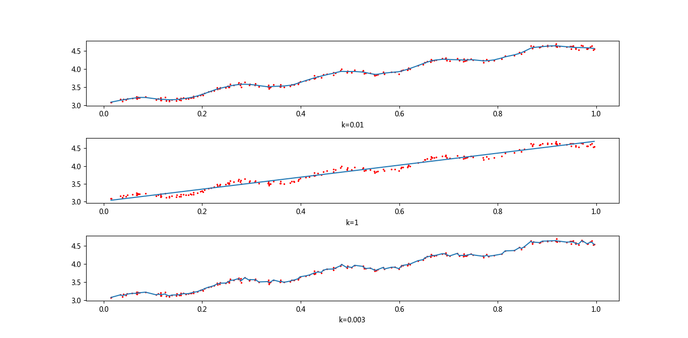

## 线性回归概述
> 依赖输入写出一个目标值的公式

### 线性回归的优缺点
* 优点：结果易于理解，计算上不复杂
* 缺点：对非线性的数据拟合不好
* 适用数据类型：数值型和标称型数据

### [线性回归的工作原理](https://github.com/coldJune/machineLearning/blob/master/machineLearningCourseraNote/Note2.pdf)
**回归** 是指寻找 **回归方程(regression equation)** 的回归系数的过程。线性回归是指可以将输入项分别乘以一些常量，再将结果加起来得到输出。[^1]
输入数据存放在矩阵$x$中，而回归系数存放在向量$w$中。对于给定的数据$x_1$中，预测结果将会通过$y_1=x_1^Tw$给出。而确定系数$w$需要使得预测$y$值和真实$y$值之间的差值最小，为了防止误差简单累加将使正差值和负差值相互抵消，所以使用平方误差。平方误差写做：
$$\sum_{i=1}^m(y_i-x_i^Tw)^2$$
用矩阵表示还可以写做$(y-Xw)^T(y-Xw)$。对$w$求导后得到$x^T(y-xw)$，令其等于0，解出$w$如下：
$$\hat{w}=(x^Tx)^{-1}x^Ty$$
其中$\hat{w}$表示当前可以估计出的$w$的最优解。对矩阵$(x^Tx)^{-1}$求逆的部分表示这个方程只能在逆矩阵存在的时候适用。
除了适用矩阵方法外，还可以使用最小二乘法

### 线性回归的一般流程
1. 收集数据：采用任意方法收集数据
2. 准备数据：回归需要数值型数据，标称型数据将被转成二值型数据
3. 分析数据：绘出数据的可视化二维图将有助于对数据做出理解和分析，在采用缩减法求得新回归系数之后，可以将新拟合线绘在图上作为对比
4. 训练算法：找到回归系数
5. 测试算法：使用R2或者预测值和数据的拟合度，来分析模型的效果
6. 使用算法：使用回归，可以在给定输入的时候预测出一个数值，这是对分类方法的提升，这样可以预测连续型的数据

## 回归算法的实现
### 线性回归
* 数据导入
```Python
def load_data_set(file_name):
    """加载数据
    :param file_name: 文件名
    :return:
    """
    num_feat = len(open(file_name).readline().split('\t')) -1
    data_mat = []
    label_mat = []
    with open(file_name, 'r', encoding='utf-8') as f:
        for line in f.readlines():
            line_arr = []
            cur_line = line.strip().split('\t')
            for i in range(num_feat):
                line_arr.append(float(cur_line[i]))
            data_mat.append(line_arr)
            label_mat.append(float(cur_line[-1]))
    return data_mat, label_mat
```
* 标准回归函数
```Python
def stand_regress(x_arr, y_arr):
    """计算最佳拟合直线
    :param x_arr: 数据集
    :param y_arr: 结果集
    :return:
    """
    x_mat = np.mat(x_arr)
    y_mat = np.mat(y_arr).T
    x_t_x = x_mat.T*x_mat
    if np.linalg.det(x_t_x) == 0.0:
        # 判断x_t_x行列式是否为0(是否可逆)
        print('奇异矩阵不能求逆')
        return
    ws = x_t_x.I*(x_mat.T*y_mat)
    # 返回参数向量
    return ws
```
* 绘制回归曲线
```Python
In [13]: x_arr,y_arr = regression.load_data_set('data/ex0.txt') #加载数据

In [14]: ws = regression.stand_regress(x_arr,y_arr)#训练回归系数

In [15]: x_mat = mat(x_arr)

In [16]: y_mat = mat(y_arr).T

In [17]: fig = plt.figure()

In [18]: ax = fig.add_subplot(111)

In [19]: ax.scatter(x_mat[:,1].flatten().A[0],y_mat[:,0].flatten().A[0])
Out[19]: <matplotlib.collections.PathCollection at 0x1735a89bcf8>

In [20]: x_copy = x_mat.copy()

In [21]: x_copy.sort(0)

In [22]: y_hat = x_copy*ws

In [23]: ax.plot(x_copy[:,1],y_hat)
Out[23]: [<matplotlib.lines.Line2D at 0x1735b407e48>]
```
* 数据集合最佳拟合直线


可以通过计算预测值$\hat{y}$序列和真实值$y$序列的匹配程度，也就是计算两个序列的相关系数来判断模型的好坏。
* 计算相关系数
```Python
In [33]: y_hat = x_mat*ws

In [34]: corrcoef(y_hat.T, y_mat.T)
Out[34]:
array([[ 1.        ,  0.98647356],
       [ 0.98647356,  1.        ]])
```

### 局部加权线性回归
由于线性回归求的是具有最小均方误差的无偏估计，所以有可能出现欠拟合现象。对于这种情况可以在估计中引入一些偏差来降低预测的均方误差。
**局部加权线性回归(Locally Weighted Linear Regression,LWLR)** 算法在待预测点附近的每个点赋予一定的权重，然后在这个子集上基于最小均方差来进行普通的回归。这种算法每次预测都需要实现选取出对应的数据子集。其解出回归系数$w$的形式如下：
$$\hat{w}=(w^Twx)^{-1}x^Twy$$
其中$w$是一个矩阵，用来给每个数据点赋予权重。
LWLR使用“核”来对附近的点赋予更高的权重。最常用的核是高斯核，其对应的权重如下:
$$w(i,i)=e^{\frac{\mid x^{(i)}-x\mid}{-2 k^2}}$$
这构建了一个只含对角元素的权重矩阵$w$,并且点$x$与$x(i)$越近，$w(i,i)$将会越大。参数$k$决定了对附近的点赋予多大的权重。
* 局部加权线性回归
```Python
def lwlr(test_point, x_arr, y_arr, k=1.0):
    """局部加权线性回归
    给出x空间的任意一点，计算出对应的预测值y_hat
    :param test_point: 测试数据点
    :param x_arr: 数据集
    :param y_arr: 结果集
    :param k: 权重参数，决定对附近的点赋予多大权重，控制衰减速度
    :return:
    """
    x_mat = np.mat(x_arr)
    y_mat = np.mat(y_arr).T
    m = np.shape(x_mat)[0]
    # 创建对角权重矩阵
    weights = np.mat(np.eye(m))
    for j in range(m):
        # 计算高斯核对应的权重
        # 随着样本点与待预测点距离的递增，权重将以指数基衰减
        diff_mat = test_point - x_mat[j, :]
        weights[j, j] = np.exp(diff_mat*diff_mat.T/(-2.0*k**2))
    x_t_x = x_mat.T*(weights*x_mat)
    if np.linalg.det(x_t_x) == 0.0:
        print('奇异矩阵不能求逆')
        return
    ws = x_t_x.I*(x_mat.T*(weights*y_mat))
    return test_point*ws


def lwlr_test(test_arr, x_arr, y_arr, k=1.0):
    """测试局部加权线性回归
    :param test_arr: 测试数据集
    :param x_arr: 数据集
    :param y_arr: 结果集
    :param k: 权重参数，决定对附近的点赋予多大权重，控制衰减速度
    :return:
    """
    m = np.shape(test_arr)[0]
    y_hat = np.zeros((m,1))
    for i in range(m):
        y_hat[i] = lwlr(test_arr[i], x_arr, y_arr, k)
    return y_hat
```
* 绘制不同k值的拟合曲线
```Python
In [3]: import regression

In [4]: x_arr,y_arr = regression.load_data_set('data/ex0.txt') #加载数据

In [5]: fig = plt.figure()

In [6]: ax1= fig.add_subplot(3,1,1)

In [7]: y_hat_1 = regression.lwlr_test(x_arr,x_arr,y_arr,0.01)

In [8]: x_mat = mat(x_arr)

In [9]: srt_ind = x_mat[:,1].argsort(0)

In [10]: x_sort = x_mat[srt_ind][:,0,:]

In [11]: ax1.plot(x_sort[:,1], y_hat_1[srt_ind][:,0,:])
Out[11]: [<matplotlib.lines.Line2D at 0x1ed7b2a3630>]

In [12]: ax1.scatter(x_mat[:,1].flatten().A[0],mat(y_arr).T.flatten().A[0], s=2, c='red')
Out[12]: <matplotlib.collections.PathCollection at 0x1ed7b2be400>

In [13]: ax1.set_xlabel('k=0.01')
Out[13]: <matplotlib.text.Text at 0x1ed71765780>

In [14]: y_hat_2 = regression.lwlr_test(x_arr,x_arr,y_arr,1)

In [15]: ax2 = fig.add_subplot(3,1,2)

In [16]: ax2.plot(x_sort[:,1], y_hat_2[srt_ind][:,0,:])
Out[16]: [<matplotlib.lines.Line2D at 0x1ed7b44f550>]

In [17]: ax2.scatter(x_mat[:,1].flatten().A[0],mat(y_arr).T.flatten().A[0], s=2, c='red')
Out[17]: <matplotlib.collections.PathCollection at 0x1ed7b4418d0>

In [18]: ax2.set_xlabel('k=1')
Out[18]: <matplotlib.text.Text at 0x1ed71c38860>

In [19]: y_hat_3 = regression.lwlr_test(x_arr,x_arr,y_arr,0.003)

In [20]: ax3 = fig.add_subplot(3,1,3)

In [21]: ax3.scatter(x_mat[:,1].flatten().A[0],mat(y_arr).T.flatten().A[0], s=2, c='red')
Out[21]: <matplotlib.collections.PathCollection at 0x1ed719c5d30>

In [22]: ax3.plot(x_sort[:,1], y_hat_3[srt_ind][:,0,:])
Out[22]: [<matplotlib.lines.Line2D at 0x1ed719ffbe0>]

In [23]: ax3.set_xlabel('k=0.003')
Out[23]: <matplotlib.text.Text at 0x1ed71a59470>

In [27]: plt.subplots_adjust(hspace=0.5)
```
* 不同k值的局部加权回归

上图中的k=0.01，中图k=1，下图k=0.003。当k=1时的模型效果和最小二乘法法相差不多，k=0.01时该模型挖出数据的潜在规则，而k=0.003时则考虑了太多噪声，导致了过拟合现象

### 缩减系数
缩减系数适用于当特征比样本点多($n>m$，即输入数据的矩阵$x$不是满秩矩阵)的情况。
#### 岭回归
岭回归是在矩阵$x^Tx$是加上一个$\lambda I$从而使得矩阵非奇异。进而能对$x^Tx+\lambda I$求逆。其中矩阵$I$是一个$m\times m$的单位矩阵，对角线上的元素全为1，其他元素全为0。$\lambda$是定义的一个数值，其限制了所有$w$之和，通过引入惩罚项，能够减少不重要的参数：
$$\hat{w}=(x^Tx+\lambda I)^{-1}x^Ty$$
$\lambda$通过误差最小化获得，通过选取不同的$\lambda$值来得到使预测误差最小的$\lambda$
* 岭回归
```Python
def ridge_regress(x_mat, y_mat, lam=0.2):
    """岭回归
    :param x_mat: 数据集
    :param y_mat: 结果集
    :param lam: 缩减系数
    :return:
    """
    x_t_x = x_mat.T*x_mat
    denom = x_t_x+np.eye(np.shape(x_mat)[1])*lam
    if np.linalg.det(denom) == 0.0:
        print('奇异矩阵不能求逆')
        return
    ws = denom.I*(x_mat.T*y_mat)
    return ws


def ridge_test(x_arr, y_arr):
    """测试岭回归
    :param x_arr: 数据集
    :param y_arr: 结果集
    :return:
    """
    x_mat = np.mat(x_arr)
    y_mat = np.mat(y_arr).T

    y_mean = np.mean(y_mat, 0)
    y_mat = y_mat - y_mean
    # 对特征进行标准化处理
    # 所有特征减去各自的均值并除以方差
    x_mean = np.mean(x_mat, 0)
    x_var = np.var(x_mat, 0)
    x_mat = (x_mat-x_mean)/x_var
    num_test_pts = 30
    w_mat = np.zeros((num_test_pts, np.shape(x_mat)[1]))
    for i in range(num_test_pts):
        # 在30个不同的lambda下求回归系数
        # lambda以指数级变化
        ws = ridge_regress(x_mat, y_mat, np.exp(i-10))
        w_mat[i, :] = ws.T
    return w_mat
```

### lasso
在增加如下约束时，普通的最小二乘法回归会得到与岭回归一样的公式:
$$\sum_{k=1}^nw_k^2 \leq \lambda$$
lasso对回归系数做如下限定:
$$\sum_{k=1}^n\mid w_k\mid\leq y$$
这个限定用绝对值取代了平方和，当$\lambda$足够小时，一些系数会因此被迫缩减到0。

### 前向逐步回归
前向逐步回归属于一种贪心算法，即每一步都尽可能减少误差。一开始所有的权重都为1，然后每一步所做的决策是对某个权重增加或减少一个很小的值
* 伪代码
```
数据标准化，使其分布满足0均值和单位方差
在每轮迭代过程中：
    设置当前最小误差lowest_error为正无穷
    对每个特征：
        增大或缩小：
          改变一个系数得到一个新的w
          计算新w下的误差
          如果误差error小于当前最小误差lowest_error:
              设置w_best等于当前w
          将w设置为新的w_best
```
* 前向逐步回归
```Python
def stage_wise(x_arr, y_arr, eps=0.01, num_it=100):
    """逐步线性回归
    :param x_arr: 数据集
    :param y_arr: 结果集
    :param eps: 每次迭代需要调整的步长
    :param num_it: 迭代次数
    :return:
    """
    x_mat = np.mat(x_arr)
    y_mat = np.mat(y_arr).T
    # 对数据进行标准化处理
    y_mean = np.mean(y_mat, 0)
    y_mat = y_mat - y_mean
    x_mean = np.mean(x_mat, 0)
    x_var = np.var(x_mat, 0)
    x_mat = (x_mat - x_mean) / x_var
    m, n = np.shape(x_mat)
    return_mat = np.zeros((num_it, n))
    ws = np.zeros((n, 1))
    ws_max = ws.copy()
    for i in range(num_it):
        # 开始优化
        print(ws.T)
        # 将当前最小误差设置为正无穷
        lowest_error = np.inf
        for j in range(n):
            # 对每个特征
            for sign in [-1, 1]:
                # 增大或缩小
                ws_test = ws.copy()
                # 改变一个系数得到新的ws
                # 计算预测值
                # 计算误差
                ws_test[j] += eps*sign
                y_test = x_mat*ws_test
                rss_err = rss_error(y_mat.A, y_test.A)
                if rss_err < lowest_error:
                    # 更新最小误差
                    lowest_error = rss_err
                    ws_max = ws_test
        # 更新回归系数
        ws = ws_max.copy()
        return_mat[i, :] = ws.T
    return return_mat
```
## 权衡偏差和方差
偏差和方差的内容查看[Coursera上的MachineLearning课程资料](https://github.com/coldJune/machineLearning/blob/master/machineLearningCourseraNote/Note6.pdf)

## 示例：预测乐高玩具套装的价格
因为GoogleAPI无法使用，所以解析提供的html文档得到数据
* 解析文档
```Python
def scrape_page(in_file, out_file, yr, num_pce, orig_prc):
    """解析下载的网页
    :param in_file: 读取文件
    :param out_file: 写入文件
    :param yr: 年份
    :param num_pce: 数量
    :param orig_prc: 价格
    :return:
    """
    from bs4 import BeautifulSoup
    with open(in_file, 'r', encoding='utf-8') as in_f:
        with open(out_file, 'a', encoding='utf-8') as out_f:
            soup = BeautifulSoup(in_f.read(), 'lxml')
            i = 1
            current_row = soup.findAll('table', r='%d' % i)
            while len(current_row) != 0:
                title = current_row[0].findAll('a')[1].text
                lwr_title = title.lower()
                if lwr_title.find('new') > -1 or lwr_title.find('nisb') > -1:
                    new_flag = 1.0
                else:
                    new_flag = 0.0
                sold_uniccde = current_row[0].findAll('td')[3].findAll('span')
                if len(sold_uniccde) == 0:
                    print('item %d did not sell' % i)
                else:
                    sold_price = current_row[0].findAll('td')[4]
                    price_str = sold_price.text
                    price_str = price_str.replace('$', '')
                    price_str = price_str.replace(',', '')
                    if len(sold_price) > 1:
                        price_str = price_str.replace('Free shipping','')
                    print('%s\t%d\t%s' % (price_str, new_flag, title))
                    out_f.write('%d\t%d\t%d\t%f\t%s\n' % (yr, num_pce, new_flag, orig_prc, price_str))
                i += 1
                current_row = soup.findAll('table', r='%d' % i)


def set_data_collect():
    """设置数据集
    :return:
    """
    scrape_page('data/setHtml/lego8288.html', 'data/lego.txt', 2006, 800, 49.99)
    scrape_page('data/setHtml/lego10030.html', 'data/lego.txt', 2002, 3096, 269.99)
    scrape_page('data/setHtml/lego10179.html', 'data/lego.txt', 2007, 5195, 499.99)
    scrape_page('data/setHtml/lego10181.html', 'data/lego.txt', 2007, 3428, 199.99)
    scrape_page('data/setHtml/lego10189.html', 'data/lego.txt', 2008, 5922, 299.99)
    scrape_page('data/setHtml/lego10196.html', 'data/lego.txt', 2009, 3263, 249.99)
```
* 交叉验证测试岭回归
```Python
def cross_validation(x_arr, y_arr, num_val=10):
    """交叉验证集测试岭回归
    :param x_arr: 数据集
    :param y_arr: 结果集
    :param num_val: 交叉验证次数
    :return:
    """
    m = len(x_arr)
    index_list = list(range(m))
    error_mat = np.zeros((num_val, 30))
    for i in range(num_val):
        train_x, train_y = [], []
        test_x, test_y = [], []
        # 对元素进行混洗，实现对训练集和测试集数据点的随机选取
        np.random.shuffle(index_list)
        for j in range(m):
            if j < m*0.9:
                # 90%分隔成训练集，其余10%为测试集
                train_x.append(x_arr[index_list[j]])
                train_y.append(y_arr[index_list[j]])
            else:
                test_x.append(x_arr[index_list[j]])
                test_y.append(y_arr[index_list[j]])
        # 保存所有回归系数
        w_mat = ridge_test(train_x, train_y)
        for k in range(30):
            # 使用30个不同的lambda值创建30组不同的回归系数
            mat_test_x = np.mat(test_x)
            mat_train_x = np.mat(train_x)
            # 岭回归需要使用标准化数据
            # 对数据进行标准化
            mean_train = np.mean(mat_train_x, 0)
            var_train = np.var(mat_train_x, 0)
            mat_test_x = (mat_test_x-mean_train)/var_train
            y_est = mat_test_x*np.mat(w_mat[k, :]).T + np.mean(train_y)
            # 计算误差
            # 保存每个lambda对应的多个误差值
            error_mat[i, k] = rss_error(y_est.T.A, np.array(test_y))
    # 计算误差的均值
    mean_errors = np.mean(error_mat, 0)
    min_mean = float(min(mean_errors))
    best_weights = w_mat[np.nonzero(mean_errors == min_mean)]
    x_mat = np.mat(x_arr)
    y_mat = np.mat(y_arr).T
    mean_x = np.mean(x_mat, 0)
    var_x = np.var(x_mat, 0)
    # 数据还原
    un_reg = best_weights/var_x
    print('岭回归最好的模型是：\n', un_reg)
    print('常数项是：', -1*np.sum(np.multiply(mean_x, un_reg)) + np.mean(y_mat))
```
****
[示例代码](https://github.com/coldJune/machineLearning/blob/master/MachineLearningInAction/regression/regression.py)
[^1]: $y=0.1x_1+0.2x_2$就是回归方程，$0.1$和$0.2$就是回归系数
