## matplotlib API入门
使用[matplotlib](https://matplotlib.org/index.html)时以`--pylab`模式打开
```
ipython --pylab
```
matplotlib API的函数都位于matplotlib.pyplot模块之下，通常通过以下语句引用:
```Python
import matplotlib.pyplot as plt
```
### Figure和Subplot
matplotlib的图像都位于Figure对象中，使用`plt.figure`创建一个新的Figure；`plt.figure`的`figsize`选项用于确保当图片保存到磁盘时具有一定的大小和纵横比；通过`plt.gcf()`得到当前Figure的引用；不能在空Figure上绘图，必须通过`add_subplot`创建一个或多个subplot，返回的对象是AxesSubplot对象：
```Python
In [7]: fig = plt.figure()

In [8]: ax1 = fig.add_subplot(2,2,1)  #在figure实例上调用add_subplot创建一个2x2的图像，且当前选中的事第一个(编号从1
   ...: 开始)

In [9]: ax2 = fig.add_subplot(2,2,2)

In [10]: ax3 = fig.add_subplot(2,2,4)

```
* 带有三个subplot的Figure
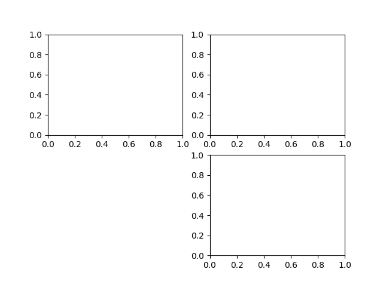
如果这时发出一条绘图命令，matplotlib会在最后一个用过的subplot(没有则创建一个)上进行绘制,`k--`是一个线型选项，告诉matplotlib绘制黑色虚线图:
```Python
In [16]: plt.plot(randn(50).cumsum(),'k--')
Out[16]: [<matplotlib.lines.Line2D at 0x26fc86694a8>]

In [17]: plt.savefig('Figure_2.png')
```
* 绘制一次后的图像
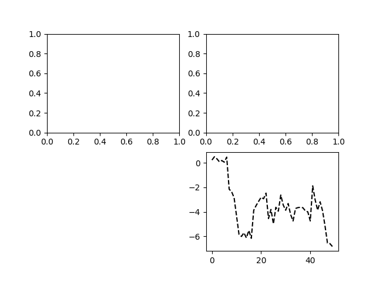
对于`add_subplot`返回AxesSubplot直接调用它们的实例方法就可以在对应的实例上画图了：
```Python
In [14]: _ = ax1.hist(randn(100),bins=20,color='k',alpha=0.3)

In [15]: ax2.scatter(np.arange(30),np.arange(30)+3*randn(30))
Out[15]: <matplotlib.collections.PathCollection at 0x2213001c2e8>

In [16]: plt.savefig('Figure_3.png')
```
* 继续绘制两次之后的图像
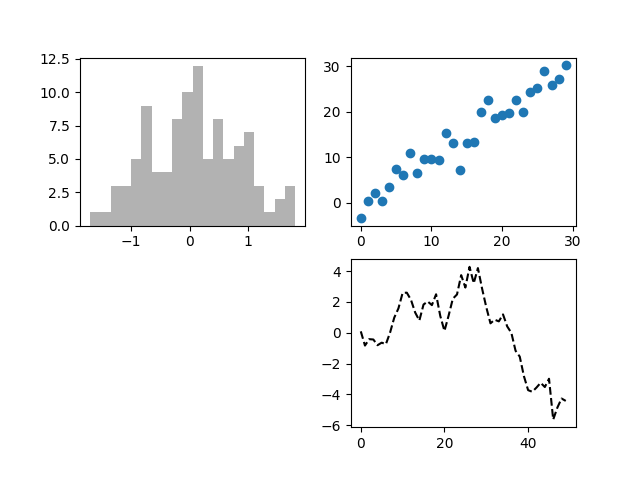

`plt.subplots`创建一个新的Figure，返回一个含有已创建的subplot对象的NumPy数组，可以通过索引获取对应的AxesSubplot对象进行绘图:
* pyplot.subplots的选项

|    参数    |                             说明                              |
|:----------:|:-------------------------------------------------------------:|
|   nrows    |                         subplot的行数                         |
|   ncols    |                         subplot的列数                         |
|   sharex   | 所有subplot应该使用相同的X轴刻度(调节xlim将会影响所有subplot) |
|   sharey   | 所有subplot应该使用相同的Y轴刻度(调节ylim将会影响所有subplot) |
| subplot_kw |                 用于创建个subplot的关键字字典                 |
|  **fig_kw  |    创建figure的其他关键字如plt.subplots(2,2,figsize=(8,6))    |

```Python
In [17]: fig,axes = plt.subplots(2,3)

In [18]: axes
Out[18]:
array([[<matplotlib.axes._subplots.AxesSubplot object at 0x000002213099BDD8>,
        <matplotlib.axes._subplots.AxesSubplot object at 0x000002213088D940>,
        <matplotlib.axes._subplots.AxesSubplot object at 0x0000022136CD45F8>],
       [<matplotlib.axes._subplots.AxesSubplot object at 0x0000022136CE7358>,
        <matplotlib.axes._subplots.AxesSubplot object at 0x0000022136B9E320>,
        <matplotlib.axes._subplots.AxesSubplot object at 0x0000022136BBB198>]], dtype=object)

In [19]: fig
Out[19]: <matplotlib.figure.Figure at 0x22130a437b8>

In [20]: axes[0,1].scatter(np.arange(30),np.arange(30)+3*randn(30))
Out[20]: <matplotlib.collections.PathCollection at 0x22136ead278>

In [21]: fig.savefig('Figure_4.png')
```
* 通过`plt.subplots`创建的Figure和AxesSubplot数组


#### 调整subplot周围的间距
matplotlib会在subplot外围留下一定的边距，并在subplot之间留下一定的间距。间距和图像的高宽有关，只要图像大小调整则间距也会自动调整利用的Figure的`subplots_adjust`方法可以修改间距，同时它也是个顶级函数；`wspace`和`hspace`用于控制宽度和高度的百分比，可以用作subplot之间的间距。matplotlib不会检查标签是否重叠，所以只能自己设定刻度的位置和刻度标签:
```Python
In [23]: plt.subplots_adjust(wspace=0,hspace=0)

In [24]: fig.savefig('Figure_5.png')
```
* 调整间距之后的图像
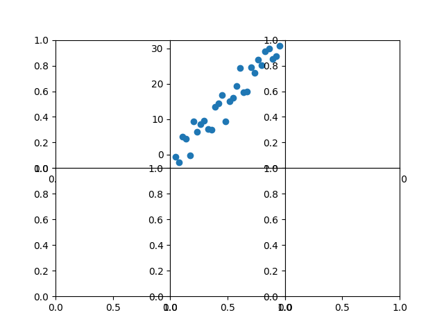

#### 颜色、标记和线型
matplotlib的plot函数接受一组X和Y的坐标，还可以接受一个表示`color`颜色和`linestyle`[线型](https://matplotlib.org/api/_as_gen/matplotlib.lines.Line2D.html?highlight=drawstyle#matplotlib.lines.Line2D.lineStyles)的字符串缩写；常用的颜色都有一个缩写词(`color='g'`)，如果需要使用其他颜色可以指定其RGB值('#CECECE')；线形图可以加上一些[标记](https://matplotlib.org/api/_as_gen/matplotlib.lines.Line2D.html?highlight=drawstyle#matplotlib.lines.Line2D.markers)`marker`来强调实际的数据点；标记和颜色都可以放在格式字符串中，但标记类型和线型必须放在颜色后面：
```Python
In [29]: fig = plt.figure()

In [30]: axe1 = fig.add_subplot()

In [31]: plt.plot(data,'ko--')
Out[31]: [<matplotlib.lines.Line2D at 0x22137639198>]

In [32]: plt.plot(data,color='k',linestyle='dashed',marker='o')
Out[32]: [<matplotlib.lines.Line2D at 0x2213a7bd588>]

In [33]: plt.savefig('Figure_6.png')
```
* 带有标记的线型图实例
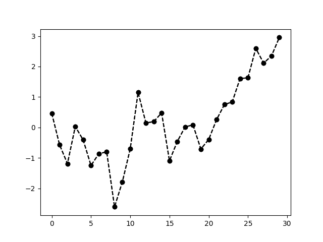
非实际数据点默认是按线性方式插值的，可以通过[drawstyle选项](https://matplotlib.org/api/_as_gen/matplotlib.lines.Line2D.html?highlight=drawstyle#matplotlib.lines.Line2D.drawStyles)修改:
```Python
In [34]: plt.plot(data,'k--',label='Default')
Out[34]: [<matplotlib.lines.Line2D at 0x22134d35198>]

In [35]: plt.plot(data,'k--',label='step-post',drawstyle='steps-post')
Out[35]: [<matplotlib.lines.Line2D at 0x22134d35b70>]

In [37]: plt.legend(loc='best')
Out[37]: <matplotlib.legend.Legend at 0x22134b3a240>
```
* 使用不同的drawstyle选项的线型图实例
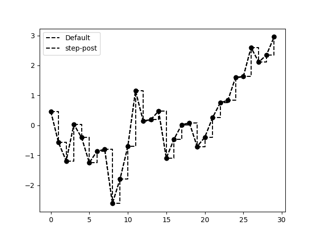

#### 刻度、标签和图例
对于大多数图标的装饰项，有两种实现方式，一是使用过程型的`pyplot`接口，二是使用面向对象的原生 *matplotlib API*。`pyplot`接口是为了交互式使用，它含有`xlim`、`xticks`和`xticklabels`等方法。分别控制图标的范围、刻度位置、刻度标签等。使用方式有两种：
1. 调用时不带参数，则返回当前的配置值。(`plt.xlim()`返回当前的X轴绘图范围)
2. 调用时带参数，则是则会参数值。(`plt.xlim([0,10])`将X轴的范围设置为0到10)
所有方法都是对当前或最近创建的AxesSubplot起作用的，它们各自对应subplot对象的两个方法，以`xlim`为例对应`ax.get_xlim`和`ax.set_xlim`

##### 设置标题、轴标签、刻度以及刻度标签
要修改X轴的刻度，使用`set_xticks`和`set_xticklabels`方法。`set_xticks`告诉matplotlib要将刻度放在数据范围中的哪些位置，默认情况下这些位置也就是刻度标签。`set_xticklabels`将任何其他值用作标签；`set_xlabel`为X轴设置一个名称;`set_title`设置一个标题：
```Python
In [39]: fig = plt.figure()

In [40]: ax = fig.add_subplot(1,1,1)

In [41]: ax.plot(randn(1000).cumsum())
Out[41]: [<matplotlib.lines.Line2D at 0x2213dfb8e48>]

In [42]: fig.savefig('Figure_8.png')

In [43]: ticks = ax.set_xticks([0,250,500,700,1000])

In [44]: fig.savefig('Figure_9.png')

In [45]: labels = ax.set_xticklabels(['one','two','three','four','five'], rotation=30, fontsize='small')

In [46]: ax.set_title('FIRST')
Out[46]: <matplotlib.text.Text at 0x2213f03bb70>

In [47]: ax.set_xlabel('STAGES')
Out[47]: <matplotlib.text.Text at 0x2213ddaf320>

In [48]: fig.savefig('Figure_10.png')
```
* 用于显示xticks的线型图
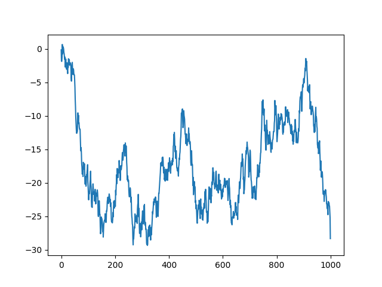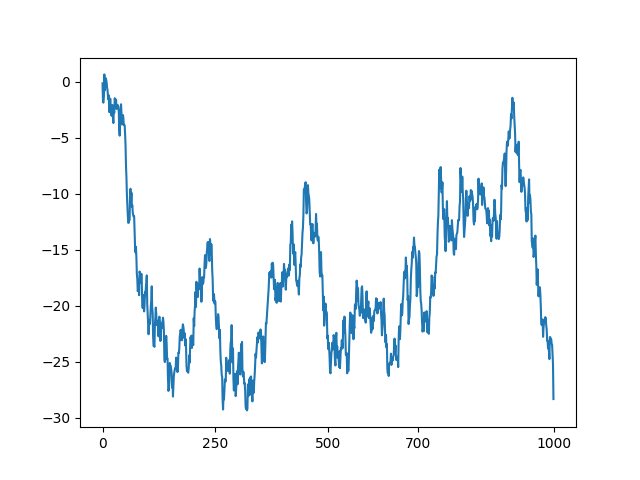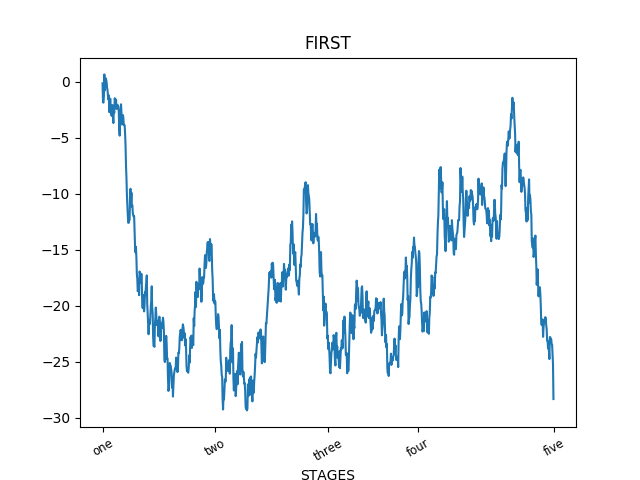
##### 添加图例
图例(legend)是一种标识图标元素的重要工具，通过在添加 *subplot* 的时候传入`label`参数，然后调用`ax.legend(loc='best')`；其中`legend`的`loc`参数告诉matplotlib要将图例放在哪儿。要从图例中去除一个或多个元素，不传入label或传入`label='_nolegend_'`:
```Python
In [51]: fig = plt.figure()

In [52]: ax = fig.add_subplot(1,1,1)

In [53]: ax.plot(randn(1000).cumsum(),'k',label='one')
Out[53]: [<matplotlib.lines.Line2D at 0x22136e7f5c0>]

In [54]: ax.plot(randn(1000).cumsum(),'k--',label='two')
Out[54]: [<matplotlib.lines.Line2D at 0x221404f6be0>]

In [55]: ax.plot(randn(1000).cumsum(),'k.',label='three')
Out[55]: [<matplotlib.lines.Line2D at 0x2213b9aba58>]

In [56]: ax.legend(loc='best')
Out[56]: <matplotlib.legend.Legend at 0x2213dffc208>

In [57]: fig.savefig('Figure_11.png')
```
* 带有三条线及图例的简单线型图
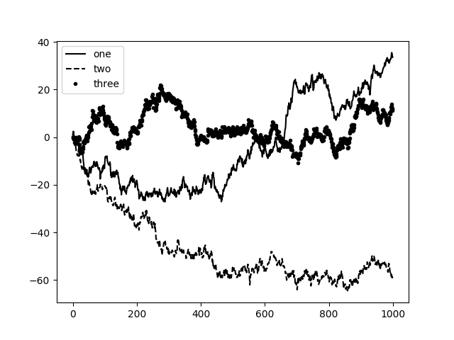

### 注解以及在Subplot上绘图
#### 注解
注解可以通过`text`、`arrow`和`annotate`等函数添加。`text`可以将文本绘制在图标的指定坐标(x,y)，还可以加上一些自定义格式`ax.text(x,y,'Hello world!', family='monospace', fontsize=10)`，注解中可以既含有文本也哈有箭头：
```Python
In [67]: fig = plt.figure()

In [68]: ax = fig.add_subplot(1,1,1)

In [69]: data = pd.read_csv('D:\Python\ipython\spx.csv',index_col=0, parse_dates=True)

In [70]: spx = data['SPX']

In [71]: spx.plot(ax=ax, style='k-')
Out[71]: <matplotlib.axes._subplots.AxesSubplot at 0x2213f993c50>

In [72]: crisis_data = [
    ...:         (datetime(2007,10,11),'Peak of bull market'),
    ...:         (datetime(2008,3,12),'Bear Stearbs Fails'),
    ...:         (datetime(2008,9,15),'Lehman Bankruptcy')
    ...:         ]
    ...:

In [73]: for date, label in crisis_data:
    ...:     ax.annotate(label, xy=(date,spx.asof(date)+50),
    ...:                 xytext=(date, spx.asof(date)+200),
    ...:                 arrowprops=dict(facecolor='black'),
    ...:                 horizontalalignment='left', verticalalignment='top')
    ...:

In [74]: # 放大到2007-2010

In [76]: ax.set_xlim(['1/1/2007','1/1/2011'])
Out[76]: (732677.0, 734138.0)

In [76]: ax.set_xlim(['1/1/2007','1/1/2011'])
Out[76]: (732677.0, 734138.0)
```
* 2008-2009年金融危机期间的重要日期[^1]
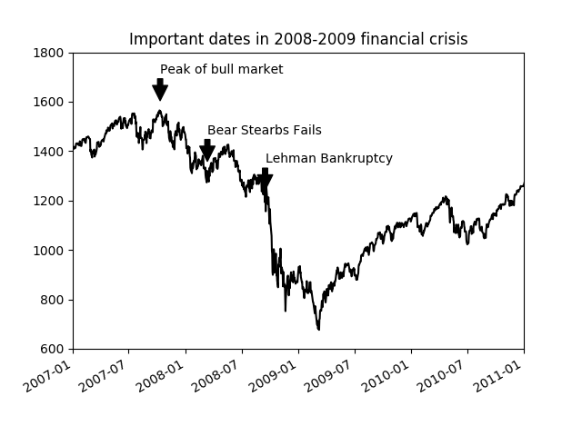

#### 绘图
matplotlib有一些表示常见图形的对象被称为 **块**(patch)，完整的集合位于`matplotlib.patches`中，有些可以在`matplotlib.pyplot`中找到(如Rectangle和Circle)。要在图表中添加一个图形，需要先创建一个块对象shp，然后通过`ax.add_patch(shp)`将其添加到subplot中:
```Python
In [81]: fig = plt.figure()

In [82]: ax = fig.add_subplot(1,1,1)

In [83]: rect = plt.Rectangle((0.2,0.75),0.4,0.15,color='k',alpha=0.3)

In [84]: circ = plt.Circle((0.7,0.2),0.15,color='b',alpha=0.3)

In [85]: pgon = plt.Polygon([[0.15,0.15],[0.35,0.4],[0.2,0.6]],color='g',alpha=0.5)

In [86]: ax.add_patch(rect)
Out[86]: <matplotlib.patches.Rectangle at 0x22142e4a908>

In [87]: ax.add_patch(circ)
Out[87]: <matplotlib.patches.Circle at 0x22140caa6d8>

In [88]: ax.add_patch(pgon)
Out[88]: <matplotlib.patches.Polygon at 0x2214117b940>

In [89]: fig.savefig('Figure_13.png')
```
* 由三块图形组成的图
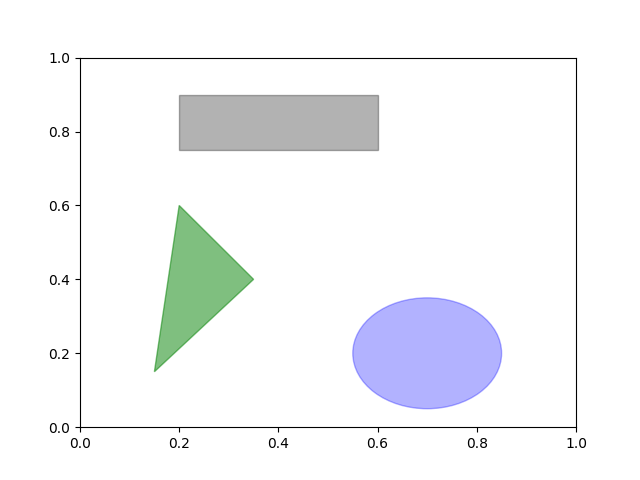

### 将图表保存到文件
利用`plt.savefig`可以将当前图表保存到文件，其相当于Figure对象的实例方法`savefig`。文件类型是通过文件扩展名推断出来的。可以通过`dpi`参数控制分辨率，通过`bbox_inches`剪除当前图表周围的空白部分`plt.savefig('filepath.png', dpi=400,bbox_inches='tight')`;
* savepig的选项

|         参数         |                                  说明                                  |
|:--------------------:|:----------------------------------------------------------------------:|
|        fname         | 含有文件路径的字符串或Python的文件型对象。图像格式由文件扩展名推断得出 |
|         dpi          |                    图像分辨率(每英寸点数),默认为100                    |
| facecolor、edgecolor |                     图像的背景色，默认为"w"(白色)                      |
|        format        |                  显式设置文件格式(png/pdf/svg/ps....)                  |
|     bbox_inches      |   图表需要保存的部分。如果设置为"tight"则尝试剪除图表周围的空白部分    |

### matplotlib配置
matplotlib自带一些配色方案，几乎所有默认行为都能通过一组全局参数进行自定义，它们可以管理图像大小、subplot边距、配色方案、字体大小、网格类型等。操作matplotlib配置系统可以使用`rc`方法，`rc`第一个参数是希望自定义的对象，其后可以跟上一系列的关键字参数，可以将这些选项写成一个字典:
```Python
In [100]: font_options={'family':'monospace',
     ...:               'weight':'bold',
     ...:               'size':10}
     ...:

In [101]: plt.rc('font', **font_options)
```

## pandas中的绘图函数
matplotlib是一种比较低级的工具，要组装一张图表，得使用它的各种基础组件才行：数据展示(即图标类型：线型图、柱状图、盒型图、散布图、等值线图等)、图例、标题、刻度标签以及其他注解型信息。
在pandas中因为已经有行标签、列标签以及分组信息，所以能够看利用DataFrame对象数据组织特点来创建标准图表的高级方法
* Series.plot方法的餐素

|    参数   |                                         说明                                         |
| :-------: | :----------------------------------------------------------------------------------: |
|   label   |                                    用于图例的标签                                    |
|     ax    | 要在其上进行绘制的matplotlib subplot对象。如果没有设置，则使用当前matplotlib subplot |
|   style   |                       将要传给matplotlib的风格字符串(如'ko--')                       |
|   alpha   |                             图表的填充不透明度(0到1之间)                             |
|    kind   |                          可以是'line'、'bar'、'barh'、'kde'                          |
|    logy   |                                  在Y轴上使用对数标签                                 |
| use_index |                               将对象的索引用作刻度标签                               |
|    rot    |                                 旋转刻度标签(0到360)                                 |
|   xticks  |                                    用作X轴刻度的值                                   |
|   yticks  |                                    用作Y轴刻度的值                                   |
|    xlim   |                                X轴的界限(例如[0,10])                                 |
|    ylim   |                                      Y轴的界限                                       |
|    grid   |                                显示轴网格线(默认打开)                                |

* 专用于DataFrame的plot参数

|     参数     |                        说明                        |
| :----------: | :------------------------------------------------: |
|   subplots   |       将各个DataFrame列绘制到单独的subplot中       |
|    sharex    | 如果subplots=True，则共用同一个X轴，包括刻度和界限 |
|    sharey    |        如果subplots=False，则共用同一个Y轴         |
|   figsize    |                 表示图像大小的元组                 |
|    title     |                表示图像标题的字符串                |
|    legend    |           添加一个subplot图例(默认为True)          |
| sort_columns | 以字母顺序绘制各列，默认使用当前列顺序                                                   |

### 线型图
Series和DataFrame都有一个生成各类图表的`plot`方法，默认情况下它们生成的是线型图。Series对象的索引会被传给matplotlib，并用以绘制X轴；通过`use_index=False`禁用该功能；X轴的刻度和界限可以通过`xticks`和`xlim`选项进行调节;Y轴用`yticks`和`ylim`：
```Python
In [10]: s = Series(np.random.randn(10).cumsum(),index=np.arange(0,100,10))

In [11]: s.plot()
Out[11]: <matplotlib.axes._subplots.AxesSubplot at 0x10a781588>
```
* 简单的Series图表
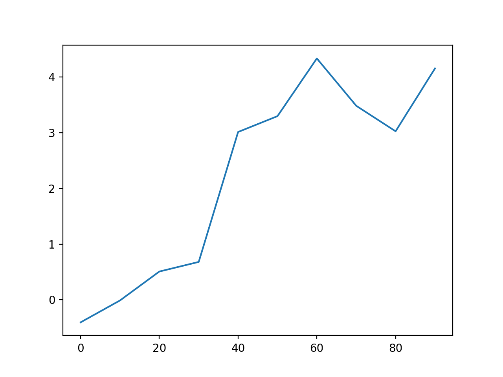

pandas的大部分绘图方法有一个可选的`ax`参数，它可以是一个matplotlib的subplot对象。这使得在网格布局中更灵活地处理subplot的位置，DataFrame的plot方法会在一个subplot中为各列绘制一条线，并自动创建图例:
```Python
In [16]: df = DataFrame(np.random.randn(10,4).cumsum(0),
    ...:                columns=['A','B','C','D'],
    ...:                index=np.arange(0,100,10))
    ...:

In [17]: df.plot()
Out[17]: <matplotlib.axes._subplots.AxesSubplot at 0x10b8704a8>
```
* 简单的DataFrame图表
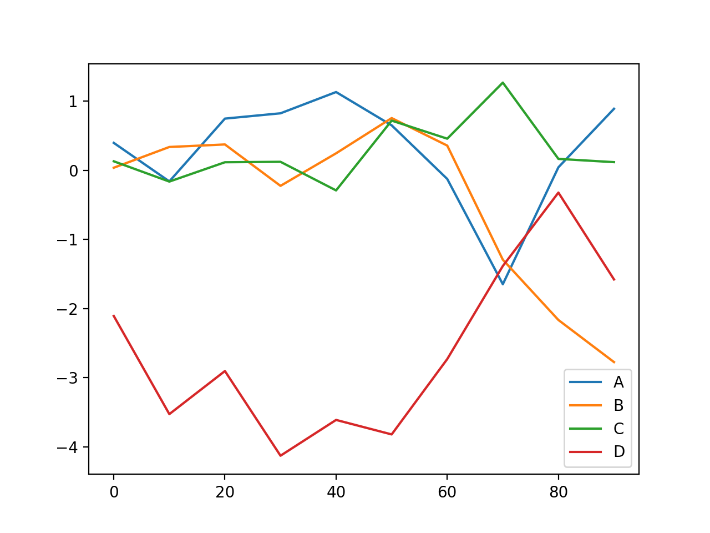
### 柱状图
在生成线型图的代码中加上`kind='bar'`(垂直柱状图)或`kind='barh'`(水平柱状图)即可生成柱状图。Series和DataFrame的索引会被用作X(bar)或Y(barh)刻度:
```Python
In [26]: fig, axes = plt.subplots(2,1)

In [27]: data = Series(np.random.rand(16),index=list('abcdefghijklmnop'))

In [28]: data.plot(kind='bar', ax=axes[0],color='k', alpha=0.7)
Out[28]: <matplotlib.axes._subplots.AxesSubplot at 0x1186e90b8>

In [29]: data.plot(kind='barh', ax=axes[1],color='k', alpha=0.7)
Out[29]: <matplotlib.axes._subplots.AxesSubplot at 0x118bd52e8>

In [30]: fig.savefig('Figure_16.png')
```
* Series柱状图
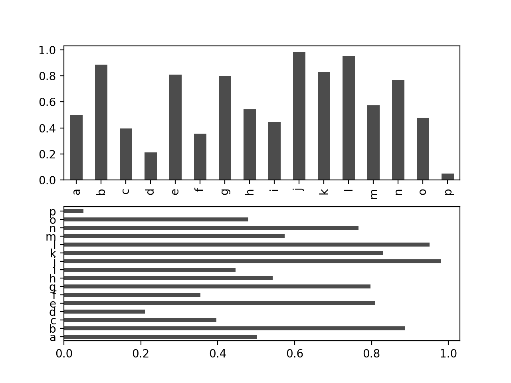

对于DataFrame，柱状图会将每一行的值分为一组，使用`stacked=True`会使每行的值堆积在一起:
```Python
In [34]: df = DataFrame(np.random.rand(6,4),
    ...:                index=['r1','r2','r3','r4','r5','r6'],
    ...:                columns=pd.Index(['A','B','C','D'],name='Genus'))
    ...:

In [35]: df
Out[35]:
Genus         A         B         C         D
r1     0.820633  0.228560  0.550244  0.236735
r2     0.968056  0.268256  0.539757  0.453413
r3     0.827034  0.905531  0.722537  0.368674
r4     0.433393  0.154539  0.223513  0.340216
r5     0.037282  0.609635  0.609266  0.172542
r6     0.359212  0.399398  0.044828  0.712773

In [36]: fig, axes = plt.subplots(2,1)

In [37]: df.plot(kind='bar',ax=axes[0])
Out[37]: <matplotlib.axes._subplots.AxesSubplot at 0x11eecb198>

In [38]: df.plot(kind='barh',ax=axes[1],stacked=True, alpha=0.5)
Out[38]: <matplotlib.axes._subplots.AxesSubplot at 0x11e691048>

In [39]: fig.savefig('Figure_17.png')
```
* DataFrame柱状图
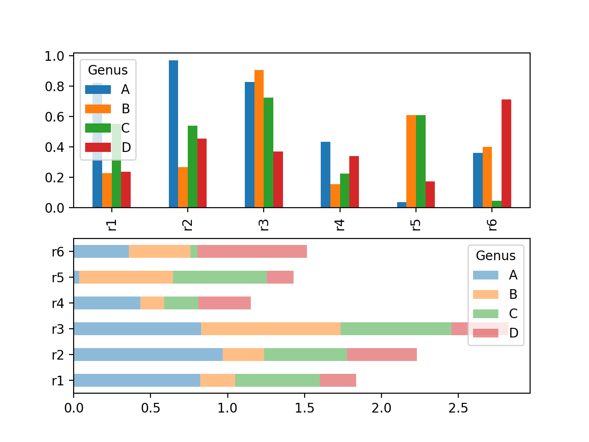

### 直方图和密度图
直方图是一种可以对值频率进行离散化显示的柱状图。数据点被拆分到离散的、间隔均匀的面元中，绘制的是各面元中数据点的数量,通过`hist`方法绘制“小费占消费总额的百分比”([数据集](https://github.com/coldJune/Python/blob/master/ipython/tips.csv)):
```Python
In [75]: tips = pd.read_csv('/Users/dengxiaojun/Documents/pydata-book-2nd-edition/examples/tips.csv')

In [76]: tips['tip_pct'] = tips['tip']/tips['total_bill']

In [77]: tips['tip_pct'].hist(bins=50)
Out[77]: <matplotlib.axes._subplots.AxesSubplot at 0x10ce1c240>
```
* 小费百分比的直方图
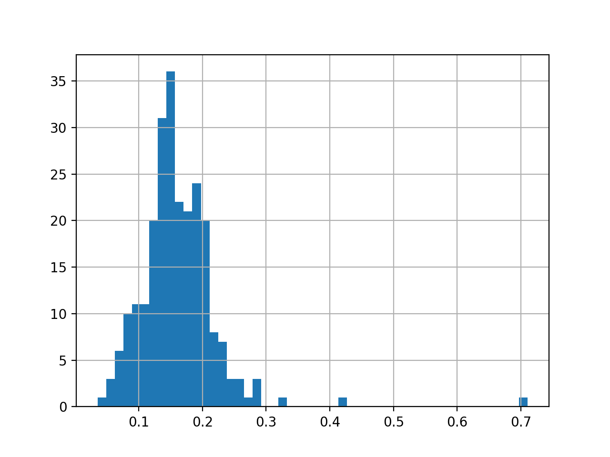

与此相关的是密度图，它通过计算“可能会产生观测数据的连续概率分布的估计”而产生。一般的过程是将该分布近似为一组核(即诸如正态(高斯)分布之类的较为简单的分布),t通过调用`plot`的`kind='kde'`生成:
```Python
In [91]: tips['tip_pct'].plot(kind='kde')
Out[91]: <matplotlib.axes._subplots.AxesSubplot at 0x120178ba8>
```
* 小费百分比密度图
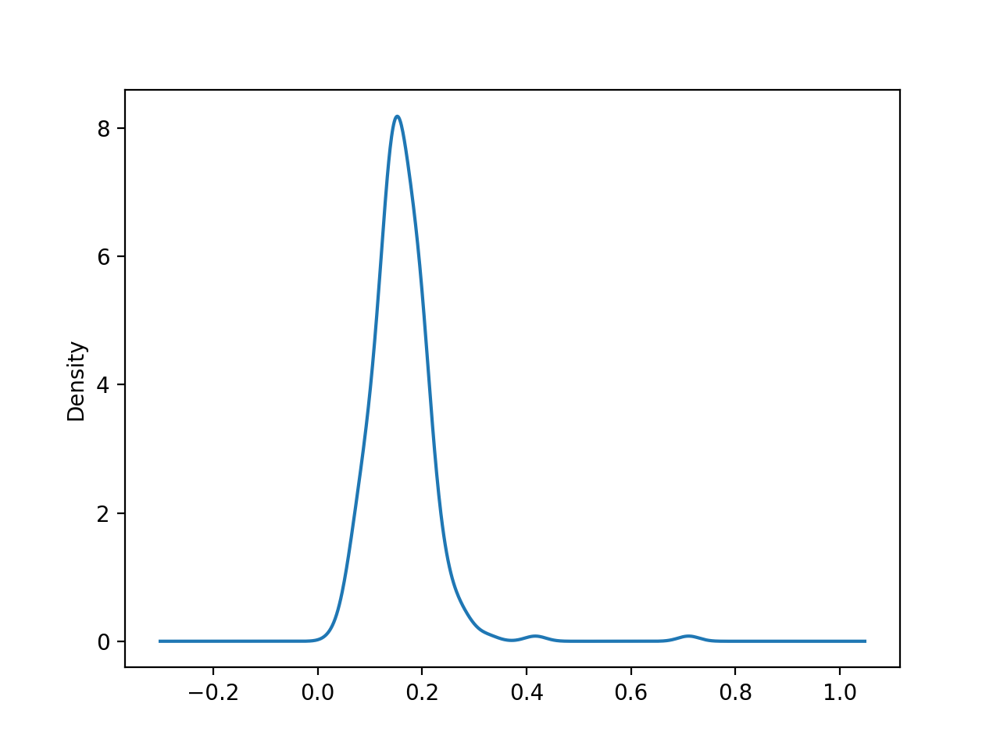

这两种图表常常被画在一起。直方图以规格化形式给出(以便给出面元化密度)，然后再在其上绘制核密度估计:
```Python
In [98]: comp1  = np.random.normal(0,1,size=200)

In [99]: comp2 = np.random.normal(10,2,size=200)

In [100]: values = Series(np.concatenate([comp1,comp2]))

In [101]: values.hist(bins=100, alpha=0.3, color='k', density=True)
Out[101]: <matplotlib.axes._subplots.AxesSubplot at 0x119e863c8>

In [102]: values.plot(kind='kde', style='k--')
Out[102]: <matplotlib.axes._subplots.AxesSubplot at 0x119e863c8>
```
* 带有密度估计的规格化直方图
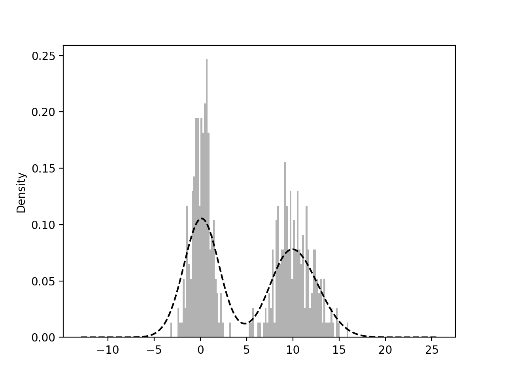

### 散布图
散布图是观察两个一维数据序列之间的关系的有效手段。matplotlib的`scatter`方法是绘制散布图的主要方法，(加载[数据集](https://github.com/coldJune/Python/blob/master/ipython/macrodata.csv)选择其中几列，计算对数差:
```Python
In [114]: macro = pd.read_csv('/Users/dengxiaojun/Documents/pydata-book-2nd-edition/examples/macrodata.csv')

In [115]: data = macro[['cpi','m1','tbilrate','unemp']]

In [116]: trans_data = np.log(data).diff().dropna()

In [117]: trans_data[-5:]
Out[117]:
          cpi        m1  tbilrate     unemp
198 -0.007904  0.045361 -0.396881  0.105361
199 -0.021979  0.066753 -2.277267  0.139762
200  0.002340  0.010286  0.606136  0.160343
201  0.008419  0.037461 -0.200671  0.127339
202  0.008894  0.012202 -0.405465  0.042560

In [118]: plt.scatter(trans_data['m1'],trans_data['unemp'])
Out[118]: <matplotlib.collections.PathCollection at 0x11b24c780>

In [119]: plt.title('Changes in log %s vs .log %s' % ('m1', 'unemp'))
Out[119]: Text(0.5,1,'Changes in log m1 vs .log unemp')
```
* 一张简单的散布图
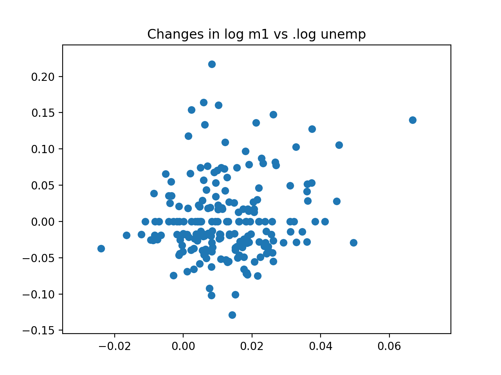

在探索式数据分析工作中，同时观察一组变量的散布图很有意义，这也被称为散布矩阵。pandas.plotting提供了一个能从DataFrame创建散布图矩阵的`scatter_matrix`函数，它还支持在对角线上放置各变量的直方图或密度图:
```Python
In [121]: pd.plotting.scatter_matrix(trans_data,diagonal='kde',color='k',alpha=0.4)
Out[121]:
array([[<matplotlib.axes._subplots.AxesSubplot object at 0x11b3591d0>,
        <matplotlib.axes._subplots.AxesSubplot object at 0x11b499dd8>,
        <matplotlib.axes._subplots.AxesSubplot object at 0x11b857f98>,
        <matplotlib.axes._subplots.AxesSubplot object at 0x11b3e7eb8>],
       [<matplotlib.axes._subplots.AxesSubplot object at 0x11b383390>,
        <matplotlib.axes._subplots.AxesSubplot object at 0x11b383208>,
        <matplotlib.axes._subplots.AxesSubplot object at 0x11b873da0>,
        <matplotlib.axes._subplots.AxesSubplot object at 0x11d0574e0>],
       [<matplotlib.axes._subplots.AxesSubplot object at 0x119b73f98>,
        <matplotlib.axes._subplots.AxesSubplot object at 0x119b75f28>,
        <matplotlib.axes._subplots.AxesSubplot object at 0x119afddd8>,
        <matplotlib.axes._subplots.AxesSubplot object at 0x119ae6128>],
       [<matplotlib.axes._subplots.AxesSubplot object at 0x119af3128>,
        <matplotlib.axes._subplots.AxesSubplot object at 0x1261c6860>,
        <matplotlib.axes._subplots.AxesSubplot object at 0x11ac44b70>,
        <matplotlib.axes._subplots.AxesSubplot object at 0x126938ac8>]],
      dtype=object)

```
* 散布图矩阵
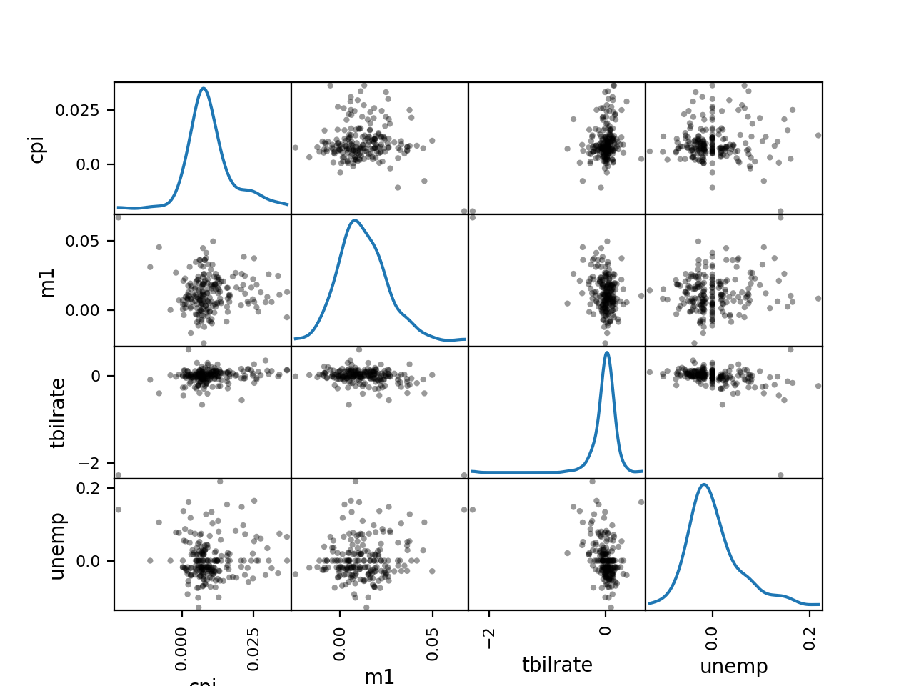


[^1]:[数据来源](https://github.com/coldJune/Python/blob/master/ipython/spx.csv)
