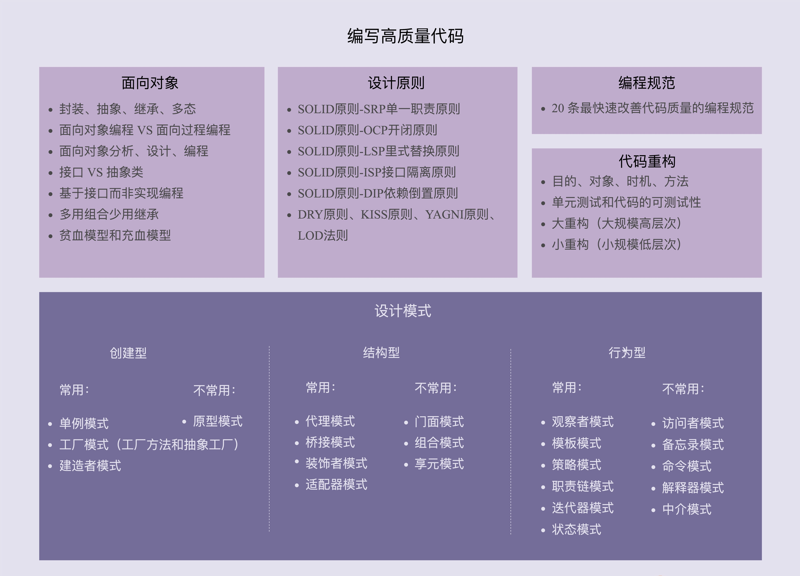

# 面向对象
* 特性：封装、继承、抽象、多态
* 面向对象编程：以类和对象作为组织代码的基本单元，将四大特性作为代码设计和实现的基石
* 面向对象编程语言：支持类和对象的语法机制，能方便地实现面向对象编程四大特性的编程语言

## 封装(Encapsulation)
* 信息隐藏或数据访问保护
* 需要语言语法提供访问权限控制
* 提高类中属性可控性
* 提高类的易用性

## 抽象(Abstraction):
* 隐藏方法的具体实现
* 并不一定要为实现类定义接口类（万物皆可抽象）

## 继承(Inheritance):
* 代码复用
* 过度使用使可读性可维护性变差

## 多态(Polymorphism):
* 继承加方法重写实现
* 接口实现
* 提高代码的可扩展性和复用性

## 面向对象和面向过程
|面向对象|面向过程|
|:--:|:--:|
|以类和对象作为组织代码的基本单元|以过程（方法、函数、操作等）作为组织代码的基本单元，是一种流程化的编程风格|
|方法和其数据结构绑定|方法和其数据结构分开|
|更能应对大规模复杂程序开发，使用类先建模后实现（模块化）|大规模复杂程序开发呈现网状结构，梳理逻辑困难|
|更易复用、扩展、维护|不易复用、扩展和维护（要实现代价更高）|
|更高级、人性化和智能（人的思维方式）|不够高级、人性化和智能（计算机思维方式，顺序编程）|

## 似对象实过程
* 滥用set/get方法(set使封装性丧失/get返回对象使上层能够修改对象导致数据不一致)
* 滥用全局变量和全局方法（实在要用可以细化分类，尽量哪儿使用哪儿定义/职责单一）
* 定义数据和方法分离的类
* 基于贫血模型的开发模式

## 抽象类和接口
|抽象类|接口|
|:--:|:--:|
|不允许实例化(new报错)，只能被继承|不能是实例化，只能实现|
|可以包含属性和方法，方法可以实现也可以不实现(抽象方法)|不能包含属性，只能声明方法不能包含具体实现|
|子类继承抽象类必须实现抽象方法|类实现接口时必须实现接口声明的所有方法|
|一种特殊的类 (is-a)|表示具有某些功能(has-a)/协议(contract)|
|自下而上，现有子类代码重复然后抽象为父类|自上而下，先考虑接口再考虑具体实现|

### 抽象类
* 代码复用
* 能使用多态特性(父类无法实例化，子类强制要求实现抽象方法)

#### 无抽象类语法的问题：
* 影响父类代码可读性
* 忘记重新父类的方法（抽象类中为抽象方法的部分）
* 父类能被实例化，增加类被误用的风险

### 接口
* 提高复用性
* 解耦(侧重)

### 模拟实现抽象类和接口
* 不能实例化(显式定义构造函数且并让其拥有访问控制，比如java修饰为protected）
* 成员变量(不定义）
* 子类必须实现方法(abstract/virtual 修饰，不支持的语言如python直接在父类方法抛出异常

## 基于接口（抽象）而非实现编程(program to an interface,not to an implementation)：
* 抽象层面的接口指的一组协议或约定
* 代码层面上接口可理解为编程语法的接口类或抽象类
* 将接口和实现分离，暴露稳定的接口，封装不稳定的实现（实现更改时调用方不用更改，提高可扩展性）

### 如何遵循：
* 函数命名不能暴露任何实现细节
* 封装具体的实现细节
* 为实现类定义抽象的接口
* 功能如只有一种实现方式，未来也不会改动（没必要实现接口）

## 多用组合少用继承
### 不推荐继承的原因
* 继承层次过深过复杂影响代码可维护性
* 父类修改影响所有子类

### 组合：
* 职责单一，可复用（通过组合、接口、委托）
* 需要更细粒度的拆分/更多的类和接口

### 如何选择
* 继承：类之间继承结构稳定、层次浅，关系不复杂，无法改变类中方法只能继承
* 组合：系统不稳定、层次深，关系复杂

## 贫血模型、充血模型和领域驱动设计(DDD)：
### 贫血模型
* 只包含数据不包含业务逻辑的类（如Entity）
* 将数据与操作分离，破坏了OOP的封装性
* 重Service轻BO（BO只包含数据）
* 面向SQL开发

### 充血模型
* 数据和对应的业务逻辑封装在一个类里
* 轻Service重Domain（Domain包括数据和业务逻辑）
* 领域模型相当于可复用的业务中间件

### DDD
* 指导如何解耦业务系统，划分业务模块，定义业务领域模型及其交互

### 贫血盛行原因
* 业务系统简单，基于CRUD都能完成
* 充血模型设计更有难度
* 思维固化

### 充血模型场景
* 复杂系统（包括各种利息计算模型和还款模型的金融系统）

｜贫血模型|充血模型｜
｜:--:|:--:|
|业务逻辑全在service|部分业务逻辑移到domain|
||保留service不移除是为了和repository层交互|
||controller和repository层两者基本相同|

# 设计原则
## 单一职责原则
* 一个类或模块只负责完成一个职责或功能
* 实现代码高内聚低耦合，提高代码复用性、可读性和可维护性
* 拆分过细会降低内聚性

### 判断是否职责是否单一
* 类中代码行数、函数或属性过多（200行/10个）
* 类依赖的其他类过多，或者依赖类的其他类过多
* 私有方法过多
* 类中的大量方法集中操作类中的某几个属性

## 开闭原则
* 软件实体（类模块、类、方法等）应该对扩展开放，对修改关闭
* 以最小修改代码的代价来完成新功能的开发
* 同样的改动，在粗粒度下被认为是修改，细粒度下被认定为扩展

### 方法
* 具备扩展意识、抽象意识、封装意识
* 事先留好扩展点
* 多态、依赖注入、基于接口而非实现编程，以及大部分的设计模式（比如，装饰、策略、模板、职责链、状态）

## 里氏替换原则
* 子类对象能够替换父类对象出现的任何地方，并且保证原来程序的逻辑行为不变及正确性不被破坏
* 按照协议设计：子类设计时要遵守父类的行为约定（输入、输出、异常的约定甚至注释中罗列的任何特殊说明）

## 接口隔离原则
* 客户端（接口的调用者或使用者）不应该强迫依赖它不需要的接口

### 接口含义
* 一组API接口集合：某个为服务或类库的接口，部分接口只被部分调用者使用就应该将这部分接口给力出来单独提供给对应的调用者
* 单个API接口或函数：函数的设计要功能单一，不将多个不同的功能逻辑在一个函数中实现
* OOP中的接口概念

|接口隔离|单一职责|
|:--:|:--:|
|更侧重于接口设计|针对模块、类、接口|
|提供了判断接口是否单一的标准：通过调用者如何使用接口|拆分粒度可大可小、可粗可细，没有明确的标准|

## 依赖反转原则/依赖倒置原则
* 高层（调用者）模块不依赖低层（被调用者）模块，高层模块和低层模块应该通过抽象来互相依赖；抽象不依赖具体实现细节，具体实现细节依赖抽象
* 控制反转：控制指对程序执行流程的控制，反转指的是使用框架前程序员自己控制程序执行；使用框架后整个执行流程通过框架控制
* 依赖注入：不通过 new 的方式在类内部创建依赖类的对象，而是将依赖的类对象在外部创建好之后，通过构造函数、函数参数等方式传递（或注入）给类来使用

## KISS原则
* 尽量保持简单
* 本身便复杂的问题用复杂的方法解决不算违背KISS原则

### 方法
* 不要使用复杂的技术或过于高级的特性
* 善于使用已经有的工具类
* 不要过度优化

## YAGNI原则
* 不要设计当前用不到的功能

## DRP原则
* 不要重复你自己

### 重复情况
* 实现逻辑重复：实现相同但语义不同不视为违反DRP；对于重复的代码可以抽象为更细粒度的函数来解决
* 功能语义重复：功能语义重复就算实现不同，也认为违反了DRP
* 代码执行重复

|代码复用性|代码复用|DRP原则|
|:--:|:--:|:--:|
|表示代码可被复用的特性或能力|表示一种行为：开发新功能时复用已经存在的代码|不要写重复的代码|
|||不重复不代表可复用|
|从代码开发者的角度|从代码使用者的角度||

### 提高复用性
* 减少代码耦合
* 满足单一职责原则：粒度越细越容易被复用
* 模块化：将功能独立的代码封装成模块
* 业务与非业务逻辑分离：越是业务无关的代码越容易复用
* 通用代码下沉：越底层的代码越通用，只允许上层调用下层和同层，不允许下层调用上层
* 继承、多态、抽象、封装：越抽象越不依赖具体实现；隐藏可变细节，暴露不变接口
* 应用模版等设计模式
* 泛型编程
**第一次不考虑复用性，第二次用到再来重构**

## 迪米特法则（最小知识原则）
* 每个模块只应该了解那些与它关系密切的模块
* 高内聚：相近的功能应该放到同一个类中，不相近的功能不放到同一个类
* 低耦合：类与类之间的依赖关系简单清晰

# 规范与重构
## 概念
* 重构是一种对软件内部结构的改善，目的是在不改变软件的可见行为的情况下，使其更易理解，修改成本更低
* 持续重构
* 重构对象

|大规模高层次（大型重构）|小规模低层次（小型重构）|
|:--:|:--:|
|对象：系统、模块、代码结构、类与类之间的关系|对象：类、函数、变量等代码级|
|手段：分层、模块化、解耦、抽象可复用组件|手段：规范命名、规范注释、消除超大类或函数、提取重复代码|
|提前做好完善的重构计划，每个阶段完成一部分在开始下一阶段，保证代码一直处于可运行逻辑正确的状态|因范围小，随时都可以|

## 单元测试

|集成测试|单元测试|
|:--:|:--:|
||研发工程师自己编写，测试代码正确性|
|整个系统或某个功能模块，是端到端的测试|类或者函数是否按照预期逻辑执行，代码层级|
||粒度更小|

### 作用
* 单元测试能有效发现代码中的bug
* 单元测试能发现代码设计上的问题
* 单元测试是对集成测试的有力补充
* 写单元测试的过程本身就是重构的过程
* 阅读单元测试能快速熟悉代码
* 单元测试是TDD可落地执行的改进方案

### 方法
* 编写单元测试尽管繁琐但并不耗时，大多可以copy-paste
* 可以稍微放低对单元测试代码质量的要求
* 覆盖率作为衡量单元测试的唯一标准是不合理的
* 单元测试不要依赖被测试代码的具体实现逻辑
* 单元测试框架无法测试，多半是因为代码的可测试性不好

## 可测试性
* 针对代码编写单元测试的难易程度

### 方法
* 使用依赖注入而不是new
* 多用组合少用继承
* mock解决外部以来的服务问题（面向接口而非实现编程）

### 测试不友好的代码
* 代码中包含未决行为逻辑
* 滥用可变全局变量
* 滥用静态方法
* 使用复杂的继承关系
* 高度耦合的代码

## 解耦
* 解耦保证代码松耦合高内聚，是控制代码复杂度的有效手段

### 判断方法
* 间接：看代码修改是否牵一发而动全身
* 直接：画出模块与模块、类与类之间的依赖关系图，根据依赖关系图的复杂性判断是否需要解耦

### 方法
1. 封装和抽象
2. 中间层
   * 引入一个中间层，包裹老的接口，提供新的接口定义
   * 新开发的代码依赖中间层提供的新接口
   * 将依赖老接口的代码改为调用新接口
   * 确保所有的代码都调用新接口之后，删除掉老的接口
3. 模块化
4. 其它设计思想和原则
   * 单一职责原则
   * 基于接口而非实现编程
   * 依赖注入
   * 多用组合少用继承
   * 迪米特法则

## 编码规范
### 命名
* 长度：以能准确达意为目标，众人熟知的用缩写，函数内临时变量可以短，类名等作用域大的用长命名
* 利用上下文简化命名
* 命名要可读可搜索：不用生僻难发音的单词，统一规约方便搜索
* 命名接口和抽象类：接口加I前缀或者不加而其实现类加impl后缀；抽象类加Abstract前缀或不加；项目里保证统一

### 注释
* 内容
  * 做什么/为什么/怎么做：简单的类名不能包涵太多信息，需要注释详尽描述；注释起到总结性作用、文档的作用；总结性注释让代码结构更清晰
* 多少
  * 太多意味着代码可读性不高，需要大量注释，且后续维护困难；类和函数要写注释，要尽量详尽、全面；函数内部注释较小，靠好的命名约束，提高可读性

### 代码风格
1. 类和函数多大合适
  * 函数大小不超过显示屏的垂直高度（50行）
  * 类行数过多：当一个类的代码阅读困难；实现某个功能不知道该用哪个函数；只用到一个小功能需要引入整个类
2. 一行代码多长合适
  * 一行代码最长不能超过IDE显示的宽度
3. 善用空行分割单元块
  * 成员变量与函数之间
  * 静态成员变量和普通成员变量、函数之间
  * 成员变量之间
4. 四格缩进还是两格缩进
  * 跟业内推荐的风格统一，跟著名开源项目统一
  * 推荐两格缩进：节省空间；四格缩进代码嵌套层次过深，累计缩进过多，容易导致一行折成两行
  * 不用tab键缩进，不同ide下tab键的显示宽度不同
5. 打括号是否要另起一行
  * 将括号放到语句同一行：节省代码行数
  * 跟随业内标准和开源项目
6. 类中成员的排列顺序
  * 成员变量排在函数前面
  * 成员变量和函数之间按照先静态（静态成员变量或静态函数）后普通（非静态成员变量或非静态函数）的方式排列
  * 成员变量和函数之间按照作用域范围从大到小的顺序排列，先写public成员变量或函数，然后写protected，最后是private
  * 把有调用关系的函数放一块儿，一个public调用一个private则两者放一块儿

### 编程技巧
* 把代码分割成更小的单元块
* 避免函数参数过多
  * 考虑函数职责是否单一，是否能通过拆分为多个函数的方式减少参数
  * 将函数的参数封装成对象
* 勿用函数参数来控制逻辑：存在控制标志可以考虑拆分为不同函数，保持职责单一
* 函数设计要职责单一
* 移除过深的嵌套层次
  * 去掉多余的if或else语句
  * 使用编程语言提供的continue、break、return关键字提前退出嵌套
  * 调整执行顺序减少嵌套
  * 将部分嵌套逻辑封装成函数调用
  * 使用多态来替代if-else、switch-case条件判断的方法
* 学会使用解释性变量
  * 常量取代魔法数字
  * 使用解释性变量来解释复杂表达式

## 发现代码质量问题
### 常规checklist
* 目录设置是否合理
* 模块划分是否清晰
* 代码结构是否满足“高内聚、松耦合”
* 是否遵循经典的设计原则和设计思想（SOLID、DRY、KISS、YAGNI、LOD 等）
* 设计模式是否应用得当、是否有过度设计
* 代码是否容易扩展，如果要添加新功能，是否容易实现
* 代码是否可以复用，是否可以复用已有的项目代码或类库，是否有重复造轮子
* 代码是否容易测试，单元测试是否全面覆盖了各种正常和异常的情况
* 代码是否易读，是否符合编码规范（比如命名和注释是否恰当、代码风格是否一致等）

### 业务需求checklist
* 代码是否实现了预期的业务需求
* 逻辑是否正确，是否处理了各种异常情况
* 日志打印是否得当，是否方便 debug 排查问题
* 接口是否易用，是否支持幂等、事务等
* 代码是否存在并发问题，是否线程安全
* 性能是否有优化空间，比如，SQL、算法是否可以优化
* 是否有安全漏洞，比如输入输出校验是否全面

## 函数出错返回什么
* 返回错误码（有异常处理机制尽量不用错误码）
* 返回null值（查询类表示数据不存在可用）
* 返回空对象（空字符串和空集合）
* 抛出异常对象

### 处理异常
* 直接吞掉
* 原封不动re-throw
* 包装成新的异常re-throw

### 原则
* 如果 func1() 抛出的异常是可以恢复，且 func2() 的调用方并不关心此异常，可以在 func2() 内将 func1() 抛出的异常吞掉
* 如果 func1() 抛出的异常对 func2() 的调用方来说，也是可以理解的、关心的 ，并且在业务概念上有一定的相关性，可以选择直接将 func1 抛出的异常 re-throw；
* 如果 func1() 抛出的异常太底层，对 func2() 的调用方来说，缺乏背景去理解、且业务概念上无关，可以将它重新包装成调用方可以理解的新异常，然后 re-throw


# 设计模式与范式：创建型
## 单例模式
>一个类只允许创建一个对象（或者叫实例）

### 为什么使用单例模式
* 处理资源访问冲突
* 表示全局唯一类

### 如何实现一个单例
* 构造函数需要private访问权限，这样才能避免外部通过new创建实例
* 考虑对象创建时的线程安全问题
* 考虑是否支持延迟加载
* 考虑getInstance()性能是否足够高（是否加锁）

### 分类
* 饿汉式：在类加载的时候，instance 静态实例就已经创建并初始化好了；不支持延迟加载
* 懒汉式：使用时再初始化，但因为加锁导致并行度低；支持延迟加载
* 双重检测：即支持延迟加载又支持高并行
* 静态内部类：运用静态内部类的特性，类似饿汉式但是做到了延迟加载，instance的唯一性和线程安全性都由JVM保证，所以这种方式即保证线程安全又支持懒加载
* 枚举：通过java枚举类型本身的特性保证线程安全和实例的唯一性

### 单例模式存在的问题
* 对OOP特性的支持不友好
* 单例会隐藏类之间的依赖关系
* 单例对代码的扩展性不友好
* 单例对代码的可测试性不友好
* 单例不支持有参数的构造函数

#### 解决方案
* 创建完实例后再调用一个init()函数传递参数
* 将参数放到getInstance()方法中（存在调用两次传递不同参数的问题，可以在传递两次参数不同时给予提示）
* 将参数放到另一个全局变量中（最推荐的方式）

### 替代解决方案
* 可以使用静态方法而不是单例保证全局唯一（但存在比单例更多的问题，不支持延迟加载，不灵活
* 工厂模式保证类对象全局唯一性
* IOC容器保证类对象全局唯一性

### 其他知识点
* 单例类对象中的唯一性的作用范围是进程唯一的
* 线程唯一的单例可以通过hashmap实现，key存储线程id，value存储对象；Java提供的ThreadLocal并发工具类可以实现线程单例
* 集群间单例可以通过将对象存储在外存，通过序列化反序列化获取对象，通过加锁避免其他进程获取对象
* 多例模式可以通过Map存储对象类型和对象之间的对应关系来控制对象个数
* 对于Java而言，单例的作用域并非进程而是类加载器（因为双亲委托模式）

## 工厂模式
### 分类
* 简单工厂
* 工厂方法
* 抽象工厂

### 场景
* 代码中存在 if-else 分支判断，动态地根据不同的类型创建不同的对象。针对这种情况，考虑使用工厂模式，将if-else 创建对象的代码抽离出来，放到工厂类中（简单工厂模式）
* 单个对象本身的创建过程比较复杂，比如做各种初始化操作。在这种情况下，考虑使用工厂模式，将对象的创建过程封装到工厂类中（工厂方法模式）

### 作用
* 封装变化：创建逻辑有可能变化，封装成工厂类之后，创建逻辑的变更对调用者透明
* 代码复用：创建代码抽离到独立的工厂类之后可以复用
* 隔离复杂性：封装复杂的创建逻辑，调用者无需了解如何创建对象
* 控制复杂度：将创建代码抽离出来，让原本的函数或类职责更单一，代码更简洁

### DI容器设计
* 配置解析：容器读取配置文件，根据配置文件提供的信息来创建对象
* 对象创建：利用反射机制动态加载创建对象
* 对象生命周期管理：如返回单例对象还是调用一次创建一个、是否支持懒加载、配置对象init和destroy方法

## 建造者模式
### 使用场景
* 属性过多，避免构造方法参数列表过长
* 属性之间有一定的依赖关系或者约束条件
* 希望创建不可变对象，对象一旦创建后不能改变，所以不能暴露set方法设置属性值

### 实现方式
* 私有化构造函数
* 定义静态内部类Builder，暴露set方法设置属性
* 调用Builder的build方法创建对象

### 和工厂模式的区别
* 工厂模式：创建不同的同一类型对象，由给定的参数来创建哪种类型的对象
* 建造者模式：创建一种类型的复杂对象，通过可设置的参数定制化创建对象

## 原型模式
* 基于原型来创建对象

### 应用场景
* 对象中的数据需要进行复杂的计算才能获得
* 需要从RPC、网络、数据库、文件系统等慢速I/O中读取

### 实现方式
* 深拷贝：即复制索引也复制数据，得到的是完全独立的对象
* 浅拷贝：只复制索引本身，不复制数据，得到的对象和原始对象共享一份数据（除非操作非常耗时，否则不推荐浅拷贝）
**在 Java 语言中，Object 类的 clone() 方法执行的就是浅拷贝。它只会拷贝对象中的基本数据类型的数据（比如，int、long），以及引用对象（SearchWord）的内存地址，不会递归地拷贝引用对象本身**

### 深拷贝实现
* 递归拷贝对象、对象的引用对象以及引用对象的引用对象，直到要拷贝的对象只包含基本数据类型数据，没有引用对象为止
* 先将对象序列化再反序列化为新的对象

### 应用方式
* 先通过浅拷贝复制对象，然后对需要更新的部分采用深拷贝，即利用了浅拷贝节省时间、空间的优点，又兼顾了深拷贝所具备的数据不共享性，不会因为更改而影响老数据的使用


# 设计模式与范式：结构型
## 代理模式
>在不改变原始类（或叫被代理类）代码的情况下，通过引入代理类来给原始类附加功能

### 静态代理
* 代理类和原始类实现相同的接口，原始类只负责业务功能，代理类负责在业务代码执行前后附加其他逻辑代码，并通过委托的方式调用原始类来执行业务代码（需要原始类和代理类有相同的接口）
* 如果原始类与代理类没有相同的接口，并且原始类的代码并非自己维护，对于这种外部类扩展采用继承的方式，通过代理类继承原始类，然后扩展附加功能

#### 存在的问题
* 代理类中需要将原始类所有方法实现一遍，并且每个方法都附加相似的代码逻辑
* 如果要添加的附加功能的类不止一个，需要针对每个类创建一个代理类

### 动态代理
* 不事先为每个原始类编写代理类，而是在运行的时候，动态地创建原始类对应的代理类
```Java
public class MetricsCollectorProxy {
  private MetricsCollector metricsCollector;

  public MetricsCollectorProxy() {
    this.metricsCollector = new MetricsCollector();
  }

  public Object createProxy(Object proxiedObject) {
    Class<?>[] interfaces = proxiedObject.getClass().getInterfaces();
    DynamicProxyHandler handler = new DynamicProxyHandler(proxiedObject);
    return Proxy.newProxyInstance(proxiedObject.getClass().getClassLoader(), interfaces, handler);
  }

  private class DynamicProxyHandler implements InvocationHandler {
    private Object proxiedObject;

    public DynamicProxyHandler(Object proxiedObject) {
      this.proxiedObject = proxiedObject;
    }

    @Override
    public Object invoke(Object proxy, Method method, Object[] args) throws Throwable {
      long startTimestamp = System.currentTimeMillis();
      Object result = method.invoke(proxiedObject, args);
      long endTimeStamp = System.currentTimeMillis();
      long responseTime = endTimeStamp - startTimestamp;
      String apiName = proxiedObject.getClass().getName() + ":" + method.getName();
      RequestInfo requestInfo = new RequestInfo(apiName, responseTime, startTimestamp);
      metricsCollector.recordRequest(requestInfo);
      return result;
    }
  }
}

//MetricsCollectorProxy使用举例
MetricsCollectorProxy proxy = new MetricsCollectorProxy();
IUserController userController = (IUserController) proxy.createProxy(new UserController());
```

### 使用场景
* 业务系统的非功能性需求开发：监控、统计、鉴权、限流、事务、幂等、日志
* 在RPC、缓存中使用

## 桥接模式
* 将抽象和实现解耦，让它们可以独立变化
* 一个类存在两个（或多个）变化的维度，可以通过组合的方式，让两个（或多个）纬度可以独立扩展

### 使用场景
* 需要分离抽象和实现的业务场景（参见jdbc Driver源码）

## 装饰器模式
### 解决问题
* 解决继承关系过于复杂的问题，通过组合来替代继承

### 作用
* 给原始类增强功能

### 特点
* 可以对原始类嵌套使用多个装饰器（装饰器类需要跟原始类继承相同的抽象类或接口）

## 适配器模式
* 将不兼容的接口转换为可兼容的接口，让原本由于接口不兼容而不能一起工作的类可以一起工作

### 实现方式
* 类适配器：使用继承实现
* 对象适配器：使用组合实现

### 选择依据
* 如果待转化的接口方法不多，两种均可
* 如果待转化的接口方法很多，而且大多数和待适配的接口相同，推荐使用类适配器，因为适配器能复用父类的方法，比起对象适配器代码量更少
* 如果待转化的接口方法很多，而大多数与待适配的接口不同，推荐使用对象适配器，因为组合结构相对于继承更灵活

### 使用场景
* 封装有缺陷的接口设计
* 统一多个类的接口设计
* 替换以来的外部系统
* 兼容老版本接口
* 适配不同格式的数据

### 代理、桥接、装饰器、适配器 4 种设计模式的区别
* 代理模式：代理模式在不改变原始类接口的条件下，为原始类定义一个代理类，主要目的是控制访问，而非加强功能，这是它跟装饰器模式最大的不同。
* 桥接模式：桥接模式的目的是将接口部分和实现部分分离，从而让它们可以较为容易、也相对独立地加以改变。
* 装饰器模式：装饰者模式在不改变原始类接口的情况下，对原始类功能进行增强，并且支持多个装饰器的嵌套使用。
* 适配器模式：适配器模式是一种事后的补救策略。适配器提供跟原始类不同的接口，而代理模式、装饰器模式提供的都是跟原始类相同的接口

## 门面模式
>门面模式为子系统提供一组统一的接口，定义一组高层接口让子系统更易用

### 组织门面接口
* 门面接口不多，可以和非门面接口放在一起不做特殊标记
* 门面接口很多，在已有的接口上再重新抽象一层专门放置门面接口，从类、包的命名上跟原来的接口层做区分
* 门面接口特别多，可以将门面接口放到一个新的子系统中

### 应用场景
* 通过将多个接口调用替换为一个门面接口调用来解决因需要调用多个接口造成的性能问题
* 通过提供一组更加简单易用、更高层的接口来解决易用性问题
* 通过门面模式包装需要保证事务性的多个接口来解决分布式事务问题

## 组合模式
>将一组对象组织（Compose）成树形结构，以表示一种“部分 - 整体”的层次结构。组合让客户端可以统一单个对象和组合对象的处理逻辑

### 前提
* 业务场景必须能表示成树形结构

## 享元模式
>当一个系统中存在大量重复对象的时候，如果这些重复的对象是不可变对象，就可以利用享元模式将对象设计成享元，在内存中只保留一份实例，供多处代码引用

### 代码结构
* 通过工厂模式，在工厂类中通过一个map来缓存已经创建过的享元对象来达到复用的目的

### 享元模式 vs 单例、缓存、对象池
* 单例：在单例模式中，一个类只能创建一个对象，而在享元模式中，一个类可以创建多个对象，每个对象被多处代码引用共享
* 缓存：平时所讲的缓存，主要是为了提高访问效率，而非复用
* 池化技术：池化技术中的“复用”可以理解为“重复使用”，主要目的是节省时间；享元模式中的“复用”可以理解为“共享使用”，在整个生命周期中，都是被所有使用者共享的，主要目的是节省空间

### 享元在Integer中的使用
* 在 Java Integer 的实现中，-128 到 127 之间的整型对象会被事先创建好，缓存在 IntegerCache 类中。当使用自动装箱或者 valueOf() 来创建这个数值区间的整型对象时，会复用 IntegerCache 类事先创建好的对象。IntegerCache 类就是享元工厂类，事先创建好的整型对象就是享元对象

### 享元在String中的使用
* String 类的享元模式的设计，跟 Integer 类稍微有些不同。Integer 类中要共享的对象，是在类加载的时候，就集中一次性创建好的。对于字符串来说，是在某个字符串常量第一次被用到的时候，存储到常量池中，当之后再用到的时候，直接引用常量池中已经存在

设计模式与规范：行为型
观察者模式
观察者模式也称为发布订阅模式，在对象之间定义一个一对多的依赖，当一个对象状态改变的时候，所有依赖的对象都会自动收到通知
实现方式
* 同步阻塞：观察者和被观察者代码在同一个线程内执行，被观察者一直阻塞，直到所有的观察者代码都执行完成之后，才执行后续的代码
* 异步非阻塞：在每个 执行函数中，创建一个新的线程执行代码；基于 EventBus 来实现
* 进程内的实现方式：以上两种均为进程内实现方式
* 跨进程的实现方式：基于消息队列的方式
模版模式
模板方法模式在一个方法中定义一个算法骨架，并将某些步骤推迟到子类中实现。模板方法模式可以让子类在不改变算法整体结构的情况下，重新定义算法中的某些步骤
作用
* 复用
* Java InputStream
* Java AbstractList
* 扩展：基于这个作用，模板模式常用在框架的开发中，让框架用户可以在不修改框架源码的情况下，定制化框架的功能
* Java Servlet
* JUnit TestCase
回调
* 原理
* A 类事先注册某个函数 F 到 B 类，A 类在调用 B 类的 P 函数的时候，B 类反过来调用 A 类注册给它的 F 函数。这里的 F 函数就是“回调函数”。A 调用 B，B 反过来又调用 A，这种调用机制就叫作“回调”。
* 分类
* 同步回调：函数返回之前执行回调函数（像模板模式）
* 异步回调：函数返回之后执行回调函数（像观察者模式）
* 应用
* JdbcTemplate：JdbcTemplate 通过回调的机制，将不变的执行流程抽离出来，放到模板方法 execute() 中，将可变的部分设计成回调 StatementCallback，由用户来定制。query() 函数是对 execute() 函数的二次封装，让接口用起来更加方便。
* setClickListener：往 setOnClickListener() 函数中注册好回调函数之后，并不需要等待回调函数执行
* addShutdownHook：Tomcat和JVM的shutdown hook；JVM 提供了 Runtime.addShutdownHook(Thread hook) 方法，可以注册一个 JVM 关闭的 Hook。当应用程序关闭的时候，JVM会自动调用Hook代码
回调
模板模式
应用场景几乎一致
应用场景几乎一致
基于组合关系来实现，把一个对象传递给另一个对象，是一种对象之间的关系
基于继承关系来实现，子类重写父类的抽象方法，是一种类之间的关系

像 Java 这种只支持单继承的语言，基于模板模式编写的子类，已经继承了一个父类，不再具有继承的能力
可以使用匿名类来创建回调对象，可以不用事先定义类
针对不同的实现都要定义不同的子类
回调就更加灵活，只需要往用到的模板方法中注入回调对象即可
如果某个类中定义了多个模板方法，每个方法都有对应的抽象方法，那即便我们只用到其中的一个模板方法，子类也必须实现所有的抽象方法
策略模式
定义一族算法类，将每个算法分别封装起来，让它们可以互相替换。策略模式可以使算法的变化独立于使用它们的客户端
策略定义
* 包含一个策略接口和一组实现这个接口的策略类。所有的策略类都实现相同的接口，客户端代码基于接口而非实现编程，可以灵活地替换不同的策略
策略创建
* 使用策略的时候通过类型来判断创建哪个策略使用
* 为了封装创建细节，把根据类型创建策略的逻辑抽离出来放到工厂类中
* 无状态可以缓存策略，不用每次创建
* 有状态需要每次创建
策略使用
* 运行时动态确定使用哪种策略，即在程序运行期间根据配置、用户输入、计算结果等不确定因素动态决定使用哪种策略
解决if-esle过多的问题
* 不每次创建的策略实际是使用查表法，根据类型查表替代根据类型分支判断
* 每次创建的策略实际是将原本的if-else分支判断转移到工厂之中
作用
* 解耦策略的定义、创建和使用，控制代码的复杂度，让每个部分都不至于过于复杂、代码量过多
* 对于复杂代码来说，还能让其满足开闭原则，添加新策略的时候，最小化、集中化代码改动，减少引入 bug 的风险
职责链模式
将请求的发送和接收解耦，让多个接收对象都有机会处理这个请求。将这些接收对象串成一条链，并沿着这条链传递这个请求，直到链上的某个接收对象能够处理它为止
实现方式
* 用链表存储处理器
* 用数组存储处理器
应用场景
* 敏感词过滤
* 过滤器（Servlet Filter）
* 拦截器（Spring Interceptor）
为什么
* 可以应对代码复杂性
* 让代码满足开闭原则，提高代码扩展性
* 配置链更灵活，可以选择配置哪几个处理器而不是全部
Servlet Filter
* tomcat ApplicationFilterChain：使用递归实现，可以做到双向过滤
Spring Interceptor
* 因为请求和响应分开拦截，所以未使用递归
AOP、Servlet Filter、Spring Interceptor选择
根据需求粒度进行选择
* Servlet Filter：与框架无关，对所有请求响应有效，能处理原始请求，但无法获取请求控制器的信息
* Spring Interceptor：与框架耦合，可以通过Spring提供配置，相比而言更灵活
* AOP：业务内拦截，更细粒度
状态模式
状态机实现方式
* 分支逻辑法：参照状态转移图，将每一个状态转移，原模原样地直译成代码。编写的代码会包含大量的 if-else 或 switch-case 分支判断逻辑，甚至是嵌套的分支判断逻辑

* 查表法：状态机用二维表来表示，在二维表中，第一维表示当前状态，第二维表示事件，值表示当前状态经过事件之后，转移到的新状态及其执行的动作

* 状态模式：通过将事件触发的状态转移和动作执行，拆分到不同的状态类中，来避免分支判断逻辑
迭代器模式
迭代器模式将集合对象的遍历操作从集合类中拆分出来，放到迭代器类中，让两者的职责更加单一

实现
* 迭代器中需要定义 hasNext()、currentItem()、next() 三个最基本的方法
* 待遍历的容器对象通过依赖注入传递到迭代器类中
* 容器通过 iterator() 方法来创建迭代器

使用迭代器的原因
* 迭代器模式封装集合内部的复杂数据结构，开发者不需要了解如何遍历，直接使用容器提供的迭代器即可
* 迭代器模式将集合对象的遍历操作从集合类中拆分出来，放到迭代器类中，让两者的职责更加单一
* 迭代器模式让添加新的遍历算法更加容易，更符合开闭原则。除此之外，因为迭代器都实现自相同的接口，在开发中，基于接口而非实现编程，替换迭代器也变得更加容易
修改集合导致未决行为
* 遍历时不允许增删元素（无法得知结束点，实现困难）
* 增删元素后让遍历报错（设置modCount和expectedModCount，修改之后更新modCount，迭代时每次检查两个值，不相等则报错）
安全删除集合元素（Java）
* 增加一个lastRet成员变量来记录游标指向的前一个元素，通过迭代器去删除这个元素的时候，更新迭代器中的游标和 lastRet 值，来保证不会因为删除元素而导致某个元素遍历不到
实现支持快照功能的迭代器
* 在迭代器类中定义一个成员变量 snapshot 来存储快照。每当创建迭代器的时候，都拷贝一份容器中的元素到快照中，后续的遍历操作都基于这个迭代器自己持有的快照来进行（由于拷贝，会增加内存消耗）
* 为每个元素保存两个时间戳，一个是添加时间戳 addTimestamp，一个是删除时间戳 delTimestamp。当元素被加入到集合中的时候，将 addTimestamp 设置为当前时间，将 delTimestamp 设置成最大长整型值（Long.MAX_VALUE）。当元素被删除时，将 delTimestamp 更新为当前时间，表示已经被删除，只做标记删除（三个数组，一个元素数组，两个时间戳数组，为了支持随机下表访问，再增加一个元素数组，一个真实删除，一个作为快照数组逻辑删除）
访问者模式
允许一个或多个操作应用到一组对象上，解耦操作和对象本身

设计意图
* 解耦操作和对象本身
* 保持类职责单一
* 满足开闭原则
* 应对代码的复杂性
设计难点
* 难点在代码实现。原因是函数重载在大部分面向对象编程语言中是静态绑定的。调用类的哪个重载函数，是在编译期间，由参数的声明类型决定的，而非运行时，根据参数的实际类型决定的
应用场景
* 访问者模式针对的是一组类型不同的对象（PdfFile、PPTFile、WordFile）。尽管这组对象的类型是不同的，但是它们继承相同的父类（ResourceFile）或者实现相同的接口。在不同的应用场景下，我们需要对这组对象进行一系列不相关的业务操作（抽取文本、压缩等），但为了避免不断添加功能导致类（PdfFile、PPTFile、WordFile）不断膨胀，职责越来越不单一，以及避免频繁地添加功能导致的频繁代码修改，我们使用访问者模式，将对象与操作解耦，将这些业务操作抽离出来，定义在独立细分的访问者类（Extractor、Compressor）中

public abstract class ResourceFile {
  protected String filePath;
  public ResourceFile(String filePath) {
    this.filePath = filePath;
  }
  abstract public void accept(Visitor vistor);
}

public class PdfFile extends ResourceFile {
  public PdfFile(String filePath) {
    super(filePath);
  }

  @Override
  public void accept(Visitor visitor) {
    visitor.visit(this);
  }

  //...
}
//...PPTFile、WordFile跟PdfFile类似，这里就省略了...

public interface Visitor {
  void visit(PdfFile pdfFile);
  void visit(PPTFile pdfFile);
  void visit(WordFile pdfFile);
}

public class Extractor implements Visitor {
  @Override
  public void visit(PPTFile pptFile) {
    //...
    System.out.println("Extract PPT.");
  }

  @Override
  public void visit(PdfFile pdfFile) {
    //...
    System.out.println("Extract PDF.");
  }

  @Override
  public void visit(WordFile wordFile) {
    //...
    System.out.println("Extract WORD.");
  }
}

public class Compressor implements Visitor {
  @Override
  public void visit(PPTFile pptFile) {
    //...
    System.out.println("Compress PPT.");
  }

  @Override
  public void visit(PdfFile pdfFile) {
    //...
    System.out.println("Compress PDF.");
  }

  @Override
  public void visit(WordFile wordFile) {
    //...
    System.out.println("Compress WORD.");
  }

}

public class ToolApplication {
  public static void main(String[] args) {
    Extractor extractor = new Extractor();
    List<ResourceFile> resourceFiles = listAllResourceFiles(args[0]);
    for (ResourceFile resourceFile : resourceFiles) {
      resourceFile.accept(extractor);
    }

    Compressor compressor = new Compressor();
    for(ResourceFile resourceFile : resourceFiles) {
      resourceFile.accept(compressor);
    }
  }

  private static List<ResourceFile> listAllResourceFiles(String resourceDirectory) {
    List<ResourceFile> resourceFiles = new ArrayList<>();
    //...根据后缀(pdf/ppt/word)由工厂方法创建不同的类对象(PdfFile/PPTFile/WordFile)
    resourceFiles.add(new PdfFile("a.pdf"));
    resourceFiles.add(new WordFile("b.word"));
    resourceFiles.add(new PPTFile("c.ppt"));
    return resourceFiles;
  }
}
单分派（Single Dispatch）
* 执行哪个对象的哪个方法，只跟“对象”的运行时类型有关
* 执行哪个对象的方法，根据对象的运行时类型来决定
* 执行对象的哪个方法，根据方法参数的编译时类型来决定
双分派（Double Dispatch）
* 执行哪个对象的哪个方法，跟“对象”和“方法参数”两者的运行时类型有关
* 执行哪个对象的方法，根据对象的运行时类型来决定
* 执行对象的哪个方法，根据方法参数的运行时类型来决定。
备忘录模式
在不违背封装原则的前提下，捕获一个对象的内部状态，并在该对象之外保存这个状态，以便之后恢复对象为先前的状态
要求
* 存储副本以便后期恢复
* 在不违背封装原则的前提下，进行对象的备份和恢复
应用场景
* 防丢失
* 撤销
* 恢复
与备份的区别
* 备忘录模式：侧重于代码的设计和实现
* 备份：侧重架构设计和产品设计
大对象备份问题
* 只备份必要的恢复信息，结合最新的数据来恢复
* 全量备份和增量备份相结合
* 低频全量备份，高频增量备份，两者结合来做恢复
命令模式
命令模式将请求（命令）封装为一个对象，这样可以使用不同的请求参数化其他对象（将不同请求依赖注入到其他对象），并且能够支持请求（命令）的排队执行、记录日志、撤销等（附加控制）功能
应用场景
* 用来控制命令的执行，比如，异步、延迟、排队执行命令、撤销重做命令、存储命令、给命令记录日志等等
与策略模式的区别
* 策略模式：不同的策略具有相同的目的、不同的实现、互相之间可以替换
* 命令模式：不同的命令具有不同的目的，对应不同的处理逻辑，并且互相之间不可替换
解释器模式
解释器模式为某个语言定义它的语法（或者叫文法）表示，并定义一个解释器用来处理这个语法
实现
* 思想：将语法解析的工作拆分到各个小类中，以此来避免大而全的解析类
* 做法：语法规则拆分成一些小的独立的单元，然后对每个单元进行解析，最终合并为对整个语法规则的解析
* 
中介模式
中介模式定义了一个单独的（中介）对象，来封装一组对象之间的交互。将这组对象之间的交互委派给与中介对象交互，来避免对象之间的直接交互

与观察者模式的区别
* 观察者模式：参与者之间的交互比较有条理，一般都是单向的，一个参与者只有一个身份，要么是观察者，要么是被观察者
* 中介模式：参与者之间的交互关系错综复杂，既可以是消息的发送者、也可以同时是消息的接收者
