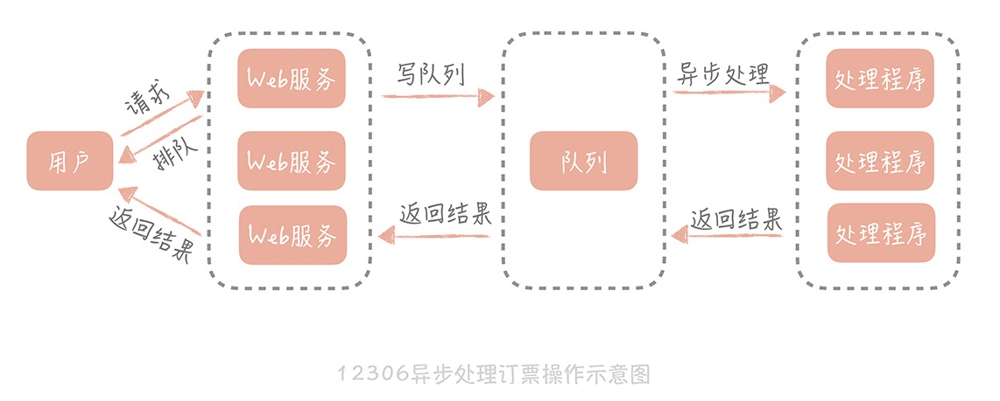
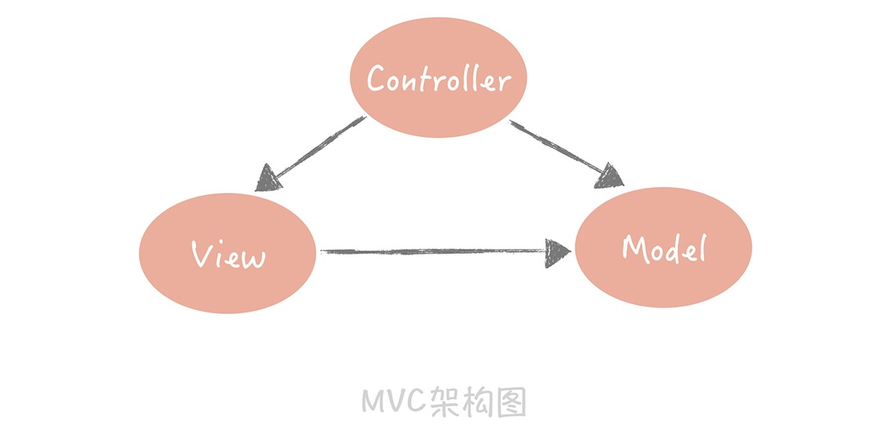
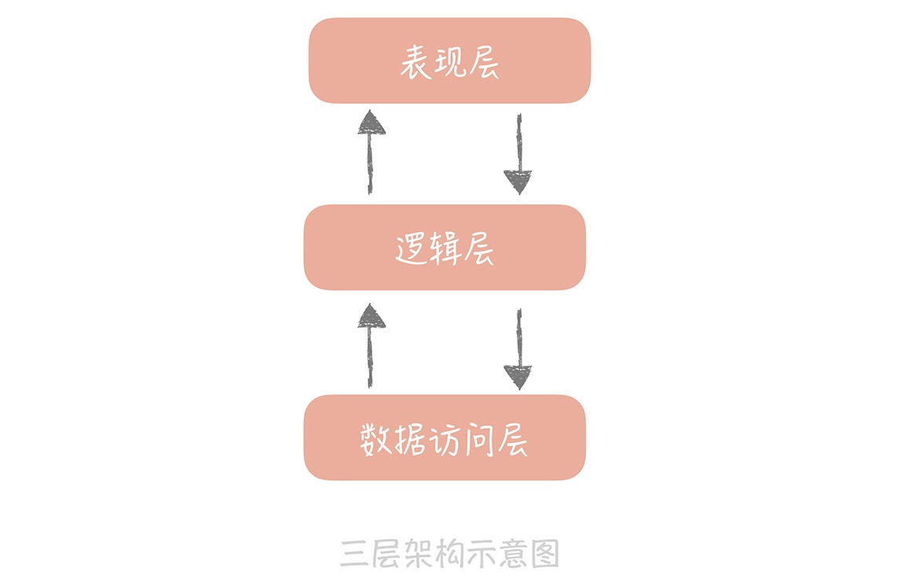
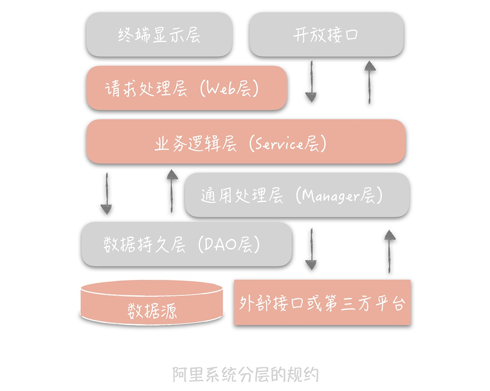
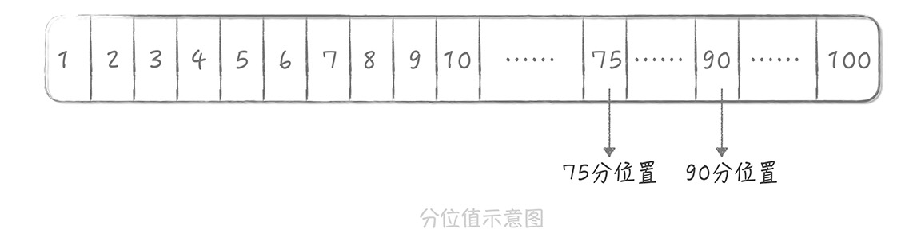
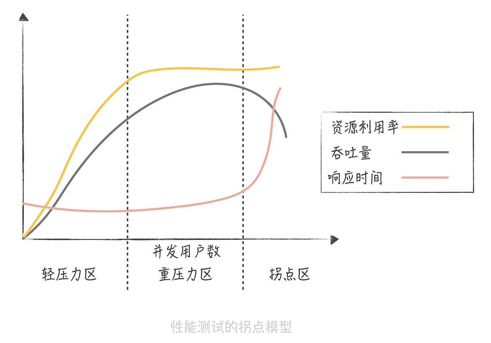
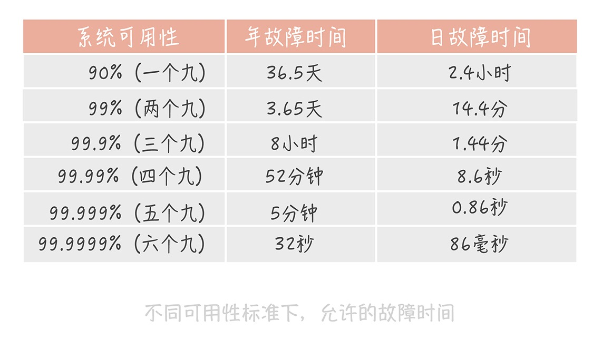
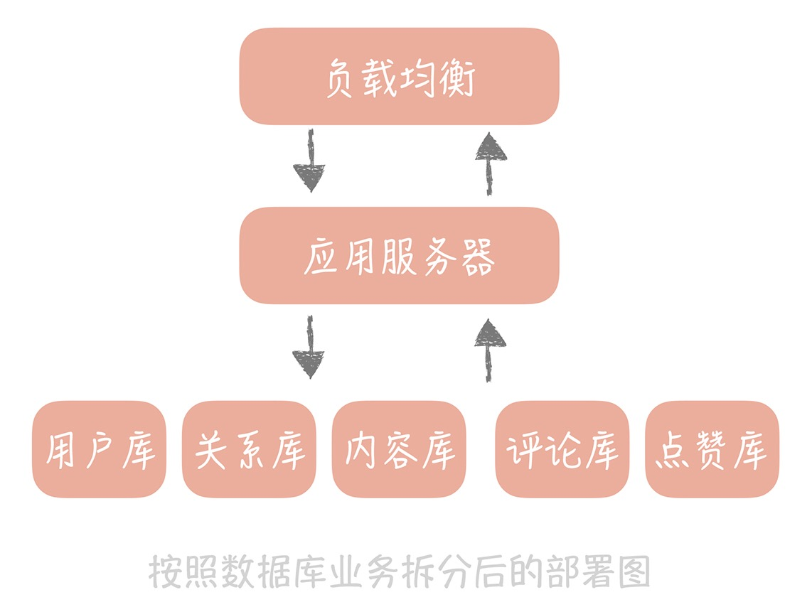
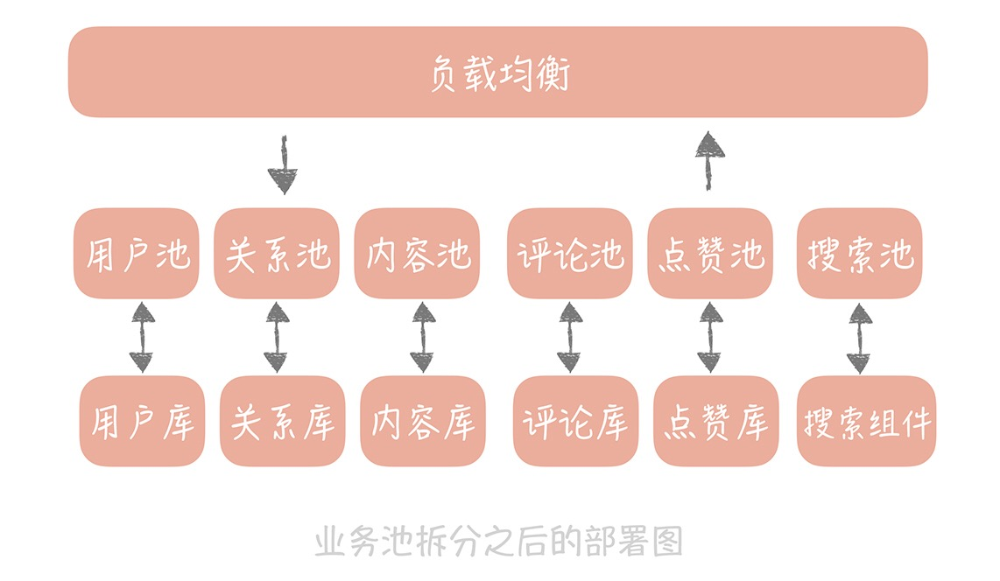
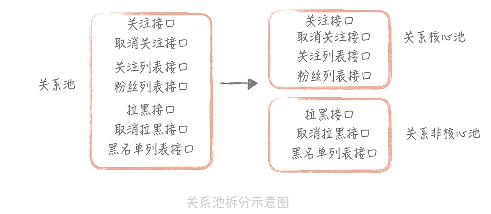

# 基础
## 通用设计方法
* 横向扩展(Scale out)
|Scale up(纵向扩展）|Scale out（横向扩展）|
  |:--:|:--:|
|通过购买性能更好的硬件提升并发处理能力|将多个低性能的机器组成一个分布式集群来共同抵御高并发流量|
|系统设计初期|系统并发超过单机限制|
|简单|引入一定的复杂度|

* 缓存->提升系统的访问性能
  1. CPU执行指令和内存寻址ns（纳秒）级别，千兆网卡读取数据微秒级别
  2. 磁盘因为物理结构存在寻道时间，是计算机中慢的一环

* 异步
|同步|异步|
|:--:|:--:|
|调用方要阻塞等待被调用方逻辑执行完成并返回|不用等待被调用方就可执行其他逻辑|
||放入消息队列并返回用户正在处理|

**高并发设计是循序渐进的，不能毕其功于一役**

## 分层设计
### mvc/三层架构

* 表现层：展示数据和接受用户指令
* 逻辑层：复杂业务逻辑
* 数据访问层：处理和存储之间的交互

### 分层的好处
1. 简化系统设计，不同的人专注做一件事
2. 高复用
3. 更容易做横向扩展（高并发的基础）

### 做系统分层

* 终端显示层：各端模版渲染并执行显示
* 开放接口层：Service层封装为开放接口并做网关安全控制和流量控制
* Web层：对访问控制转发/基本参数校验/不复用业务逻辑简单处理
* Service层：业务逻辑层
* Manager层：通用业务逻辑处理（通用能力下沉/封装对第三方接口调用，如支付等）
* DAO层：数据访问层
* 外部接口或第三方平台：其他部分或公司提供的外部接口

### 分层的不足：
1. 增加代码复杂度
2. 通过网络交互带来性能损失
### 设计思想
* 单一职责原则：每个类只有单一的功能（每一层职责单一，层与层边界清晰）
* 迪米特法则：对其他对象尽可能少的了解，不能跨层访问
* 开闭原则：对扩展开放，对修改封闭
## 高并发设计的目标：高性能、高可用、可扩展
> 高并发：运用系统设计手段让系统能处理更多用户请求流量

### 性能优化原则
* 问题导向：不要盲目提早优化
* 二八原则：即20%的精力优化80%的问题，抓住主要矛盾
* 数据支撑：优化使响应时间减少量和吞吐提升量
* 持续性：达到目标为止

### 性能度量指标
>吞吐量和响应时间呈倒数关系，响应时间200ms是一个分界点，之前感受不到延迟；1s也是一个分界点，超过有明显等待的感觉

* 响应时间平均值：敏感度较低，瞬时改变可能无法反应，只能作为一个参考
* 响应时间最大值：过于敏感
* 分位数：排除偶发极慢请求影响，分位数越高对慢请求的影响越敏感

### 性能优化
* 提升系统处理核心：增加系统并行处理能力（思路简单，吞吐量=并发进程数/响应时间）
* 减少单次任务响应时间：
  1. CPU密集型：更高效的算法或减少运算次数，通过Profile工具找到消耗CPU消耗时间最多的模块（Linux的perf/eBPF）
	2. IO密集型：数据库问题看锁表和索引等/网络IO问题看网络参数能否优化，是否有大量超时重传和丢包；采用工具或对每一步骤做分时监控发现问题

## 高可用（High Availability，HA）：系统具备较高的无故障运行能力
### 可用性度量
* MTBF(Mean Time Between Failure)：平均故障间隔，即系统平均正常运行时间，越长越稳定
* MTTR(Mean Time To Repair)：故障的平均恢复时间，即平均故障时间，越小对用户影响越小
* Availability=MTBF/(MTBF+MTTR)：通过几个九描述系统可用性

### 高可用设计思路
#### 系统设计
* Design for failure
* 故障转移（failover）
* 完全对等的节点：随机访问另一个节点即可
* 不对等的节点（主备）：需要选主操作
* 超时控制：收集系统之间的调用日志，统计比如99%响应时间，据此设置超时时间
* 降级：为了保证核心业务的稳定而牺牲非核心业务
* 限流：对并发请求进行限速

#### 系统运维
* 灰度发布：系统变更不一次性推到线上，而是按比例逐步推进
* 故障演练：对系统进行一些破坏性手段，观察局部故障时系统的表现从而发现潜在问题（混沌工程）

### 扩展性：
#### 提升扩展性的复杂性
* 处理核心增长和并行处理能力增长并非线性关系
* 数据库、缓存、依赖的第三方、负载均衡、交换机带宽会成为系统扩展的瓶颈

#### 高可扩展的设计思路
##### 拆分
>把复杂的系统拆分成独立具有单一职责的模块

###### 存储
* 存储拆分考虑业务纬度
* 当业务拆分也达到单机极限时考虑按照数据特征做水平拆分（数据迁移成本极高，尽量一次性增加足够节点）
* 数据库拆分之后尽量不使用事务（超过一个数据库时涉及两阶段提交，协调各数据库成本极高）

##### 业务层
* 业务维度：相同业务拆分为单独业务池，每个业务依赖于自己的数据库资源（减少扩容复杂性）
* 重要性维度：将业务分为核心池和非核心池（优先保证核心池功能，降级非核心池功能以保证系统稳定性）
* 请求来源维度：根据接入客户端类型不同划分业务池

## 存储
池化技术：以空间换时间
	⁃	建立数据库连接耗时：
	0.	TCP三次握手
	0.	服务端校验密码
	•	用连接池预先建立数据库连接
	0.	最小连接数（10左右）
	0.	最大连接数（20～30左右）
	•	检测连接是否可用
	0.	启用一个线程定期检测连接池中的连接是否可用（select 1）/推荐
	0.	获取链接之后先校验连接是否可用（引入多余开销，测试使用）
	•	用线程池预先创建线程
	•	JDK1.5引入ThreadPoolExcutor
	0.	coreThreadCount
	0.	maxThreadCount
	•	适用于CPU密集型的任务（创建相当于CPU核心数的线程）
	•	需要监控线程池的等待队列
	•	不能使用无界队列，否则导致任务不会被抛弃从而大量任务占据大量内存，引发full gc导致宕机

数据库
	•	主从读写分离
	•	主从复制：从库过多导致主库资源消耗（一般挂3～5个从库即可）
	0.	数据冗余解决延迟问题（一次性发送所有数据而不是关键数据）
	0.	使用缓存（适合新增数据的场景）
	0.	查询主库（不推荐）
	⁃	要关注主从延迟带来的问题（正常时间为毫秒级）

	•	访问数据库
	•	TDDL(Taobao Distributed Data Layer)：以代码形式内嵌运行在应用程序内部/配置多个数据源（简单易用，无多余的部署成本）
	•	单独部署的代理层方案：由代理层管理数据源，应用只需访问代理层（所有Sql都要跨两次网络

互联网优先考虑性能而不是强一致性

分库分表：
	⁃	4核8G云服务器MySQL5.7做benchmark可以支撑500TPS和10000QPS
	•	垂直拆分
	⁃	按照业务类型拆分，专库专用（无法解决单表过大的问题）
	•	水平拆分
	⁃	将单一数据表按照规则拆分到多个数据库
	0.	按照某一个字段的hash值进行拆分（实体表，如用户表）
	0.	按照某一个字段的区间进行拆分（列表数据，如某一个人的订单）/需提前建好
	•	引入的问题解决
	0.	分区键：建立ID和查询字段的映射表（只有少数字段，也可以分库分表）
	0.	数据库特性难以实现：join、计数等操作（可以将计数记录在redis等缓存中）

分库分表后全局id唯一性保证：
	•	主键选择：
	0.	业务字段（不适用）
	0.	使用生成的唯一ID
	⁃	搭建发号器服务生成
	0.	UUID（不适合）
	•	性能好
	•	不依赖于三方系统
	⁃	无序性
	⁃	不具备业务含义
	⁃	占用空间大（32个16进制数）
	0.	SnowFlake算法：
	•	ID单调递增能支持排序和提高写入性能
	•	简单易实现
	•	全局唯一性
	•	包含一定的业务含义

	•	实现方式
	0.	嵌入到业务代码，分布在业务服务器中
	•	不需要跨网络调用
	⁃	需要更多的机器id位来支持更多业务服务器（引入Zookeeper等分布一致性组件确保每次机器重启获得唯一的机器id）
	0.	独立部署发号器服务
	•	减少机器码位数，留更多位给最后的自增信息位
	•	因为机器位少或者是没有，可以将机器位写入配置文件而不用引入三方组件
	⁃	多一次网络调用
	•	缺点
	0.	依赖系统时间戳：发现系统时钟不准停止发号直至准确
	0.	请求发号器QPS不高，比如每毫秒一个会导致最后一位都为1，从而使分库分表分配不均
	0.	时间戳记录到秒
	0.	生成器的起始序号做随机
数据库和NoSql互补
	•	NoSql
	•	原因
	0.	弥补了传统数据库性能的不足
	0.	数据库变更方便，不需要更改原来的数据结构
	0.	适合互联网项目大数据量场景
	•	作用
	0.	提升写入性能：随机写转换为顺序写，大多数使用基于LSM树的存储引擎，牺牲一定读性能来换取写性能的提升（HBase、Cassandra、LevelDB）
	0.	场景补充：为搜索建立倒排索引
	0.	提升扩展性：天生支持分布式，支持数据冗余和数据分片的特性

缓存

缓存基础
	•	案例
	0.	Linux内存管理中的TLB组件
	0.	http缓存

	•	缓存和缓冲区

缓存
缓冲区
空间换时间的优化手段
临时存储数据的区域，类似于消息队列，数据最终要输入到其他地方
	•	分类
	0.	静态缓存：缓存静态资源
	0.	分布式缓存：缓存动态请求
	0.	热点本地缓存：极端热点数据查询
	•	不足：
	0.	适合读多写少，最好数据带有热点属性
	0.	给系统带来一定复杂度
	0.	有数据不一致风险
	0.	通常使用内存，但内存有限，成本高
	0.	带来运维成本
读写策略
	•	Cache Aside（旁路缓存）策略
	⁃	应同时变更数据库和缓存，否则会带来数据不一致
	⁃	直接更新缓存会带来丢失更新的问题
	⁃	同样存在数据不一致的可能，但由于写数据库比缓存慢，所以概率极小
	⁃	写入频繁会导致缓存频繁清理，影响缓存命中率
	0.	更新数据时更新缓存，更新缓存前加一个分布式锁
	0.	更新数据时更新缓存，给缓存一个较短的过期时间
	•	读策略
	0.	从缓存读取数据
	0.	缓存命中则直接返回
	0.	缓存不命中则从数据库查询
	0.	查询到数据后将数据写入缓存并返回给用户
	•	写策略
	0.	更新数据库记录
	0.	删除缓存记录
	•	Read/Write Through（读穿/写穿策略）
	•	用户只与缓存打交道
	•	write through
	0.	查询要写入的数据在缓存是否存在
	0.	存在则更新缓存，由缓存组件同步更新到数据库
	0.	缓存不存在则发生Write Miss
	•	Write Allocate（按写分配）：写入缓存相应位置并由缓存组件同步更新到数据库
	•	No-Write Allocate（不按写分配）：不写入缓存直接更新数据库（少一次缓存写入，常用）
	•	Read Through
	0.	查询缓存数据是否存在
	0.	存在直接返回
	0.	不存在由缓存组件同步数据

	•	Write Back（写回）策略（计算机体系中的设计，不能运用到常用的数据库和缓存场景）
	•	写策略
	0.	写入数据时只写入缓存，把缓存块标记为脏
	0.	脏块再次被使用时将其中的数据写入后端
	•	读策略
	0.	缓存命中则返回
	0.	缓存不命中则寻找一个可用的缓存块
	0.	缓存块为脏则先将之前的数据写入后端，并从后端加载数据到缓存块
	0.	不是脏块则由缓存组件将后端数据加载到缓存，并设置为非脏并返回数据

缓存的高可用
	•	客户端方案
	•	客户端配置多个缓存节点，通过缓存写入和读取算法策略实现分布式，提高可用性
	⁃	写入数据时要进行数据分片
	⁃	读数据利用多组缓存做容错提升可用性
	•	如何分片
	0.	hash分片：对缓存的key做hash算法，然后对总的缓存节点个数取余（节点数目变化造成缓存不可用，降低命中率，最好有另外一层缓存兜底）
	0.	一致性hash分片：将hash值的空间组织成一个圆环，将节点做hash后放在圆环上，对key做同样的hash然后在圆环上找到顺时针方向碰到的第一个节点（解决节点数目变化带来的问题）（缓存节点分布不均会导致部分节点压力过大）（脏数据问题）
	•	脏数据：节点掉线后又恢复（设置缓存过期时间解决）

	•	主从机制（能解决大多数场景）
	0.	每一组master配置一组slave
	0.	优先从slave读数据
	0.	读取不到则穿透到master并将数据回种到slave
	⁃	slave宕机有master兜底

	•	多副本
	⁃	极端流量场景，slave网卡成为瓶颈
	⁃	副本组要比master/slave小，只存储更热的数据
	0.	在master/slave之间增加一个副本层
	0.	先选择一个副本组进行查询
	0.	失败则查询master/slave，然后回种到副本组

	•	中间代理层方案
	•	在应用代码和缓存节点之间增加代理层，客户端所有写入读取请求都通过代理层，代理层内置高可用策略提高缓存系统可用性
	•	通过通用协议实现多语言复用

	•	服务端方案
	•	Redis Sentinel方案(>2.4)
	⁃	主节点挂了之后自动将从节点提升为主节点
	0.	配置master地址，监控master状态
	0.	master一段时间无反应则认为挂了，选取一个从节点提升为主节点
	0.	把所有其他从节点设置为新主的从节点

缓存穿透解决
	⁃	缓存中查不到数据而不得不从后端查询
	⁃	核心缓存命中率要保持99%以上，非核心缓存的命中率要保持90%以上
	⁃	少量穿透无害，大量穿透会压垮后端
	•	原因
	0.	互联网数据量大而缓存有限，无法存储所有数据
	0.	28原则，经常访问的是20%的数据，剩下80%不常访问
	•	解决方案
	0.	回种空值：数据库查询到为空值时会发生异常时向缓存回种一个空值，并设置一个较短的过期时间（如果大量空值请求会使缓存中空值占用大量空间而使正常数据穿透，需评估缓存容量）
	0.	布隆过滤器：使用hash算法将元素映射到数组，查询元素使用相同的hash算法（因为hash碰撞会把不是集合中的元素判断为集合中，不支持删除元素）（其false positive的特性尤其适合缓存穿透：判断不在则一定不在）（使用多个hash，删除可以通过打标实现）
	⁃	狗桩效应：极热数据失效导致大量穿透
	0.	启动后台线程从数据库加载数据到缓存，未加载之前直接返回不穿透
	0.	通过Memcached或Redis设置分布式锁，未获取锁的不允许穿透

CDN静态资源加速
	•	就近访问
	•	CDN：将静态资源分发到位于多个地理位置机房的服务器上
	•	如何让请求到达CDN节点
	•	通过DNS解析映射节点域名和实际ip
	•	DNS解析性能问题（向上多次查询）
	0.	启动时对要解析的域名做预解析，把解析结果存放在本地LRU缓存中

	•	如何找到离用户最近的CDN节点
	•	GSLB（Global Server Load Balance，全局负载均衡）：对于部署在不同地域的服务器之间做负载均衡
	0.	是一种负载均衡服务器，让流量平均分配是下面管理的服务器负载更均衡
	0.	需要保证流量流经的服务与流量源头在边缘上比较接近

数据迁移
	•	目标
	0.	在线迁移
	0.	保证数据完整性
	0.	迁移过程中能回滚
	•	方案
	•	双写
	0.	将新库配置为源库的从库
	0.	改造业务代码，要同时写入新库和旧库，写入新库失败的日志单独记录，方便恢复数据
	0.	数据校验（全量过多可抽样检验）
	0.	读流量切换到新库（全量切换可能有未知影响，可灰度发布）
	0.	存在任何问题可切换到旧库
	0.	确认无问题后将双写改为只写新库
	⁃	在迁移之前写好数据校验工具或脚本，做充分测试
	⁃	自建机房到云需考虑网络延迟和带宽
	⁃	迁移过程随时可回滚，风险最低；时间周期长，有改造成本

	•	级联同步（适合自建机房到云）
	0.	新库配置为旧库从库，用作数据同步
	0.	新增备库为新库从库，用作数据备份
	0.	同时写入三个库待数据一致则切换读流量到新库
	0.	暂停业务写入，将写流量切换到新库（需选低峰期）
	⁃	简单易施，无改造成本；切换写需暂停业务

	•	缓存预热（缓存迁移的重点是保持缓存热度）
	•	使用副本组预热缓存
	0.	在云端布置一个副本组
	0.	云上的副本组足够热之后（命中率>90%）将云上机房的缓存服务器指向该组（云上请求发生穿透会存在跨专线访问数据库的问题）
	•	改造云上副本组
	0.	云上部署多组副本组，自建机房写入请求优先写入自建机房缓存节点，异步写入云上节点
	0.	指定部分流量走云上（比如10%），使穿透可控
	0.	云上缓存命中率达90%后在云上部署应用服务器，云上的应用服务器走云上节点

消息队列
秒杀场景下：
	•	读请求过高：
	0.	热点数据使用缓存策略
	0.	能静态化的尽量静态化
	0.	限流策略（对同一个请求做丢弃处理）
	•	写请求过高：
	•	消息队列（平衡低速系统和高速系统处理任务的时间差）
	•	削峰填谷
	•	异步处理
	•	系统模块之间松耦合

消息投递
	•	消息丢失

	0.	生产过程中丢失：网络抖动导致消息生产超时（重传2～3次）（有重复的风险）
	0.	消息队列中丢失：消息队列意外未刷盘（消息队列部署集群方式保证多个副本）
	0.	有一定容忍度：不建议集群
	0.	消费过程中丢失：消息消费时由于业务异常导致未执行完成（接受和处理完消息后再更新消息进度）

	•	消息只被消费一次
	0.	在生产消费中增加冥等性保证：每条消息生成唯一id，消费时比对id
	0.	事务机制：避免过程中掉电宕机等异常（成本高、一般不考虑）
	0.	使用乐观锁：在数据中增加一个版本号，更新时带上版本号查询并更新版本号，则相同的版本号的重复数据将不会更新

消息延迟
	•	监控消息延迟
	0.	使用消息队列自带的工具监控（JMX和kafka-consumer-groups.sh）
	0.	生成监控消息的方式监控：循环写入一个内容为消息生成时间的特殊消息，比对消息消费时间和生成时间的差值
	⁃	两种结合使用效果更佳

	•	减少延迟
	•	消费端
	•	优化消费代码提升性能
	•	增加消费者数量
	0.	kafka创建多个分区：Kafka一个分区只能有一个消费者，所以增加消费者无用
	0.	消费者使用多线程并行异步处理，可以一次性多拉取几条消息（注意线程空转的问题，可在拉取不到消息时使线程暂停10～100ms）

	•	消息队列
	0.	选择高性能存储方式：比如使用本地磁盘的pagecache
	0.	配合零拷贝技术：sendfile减少数据被拷贝次数

分布式服务
系统架构
	•	一体化架构（项目初期）
	•	优势
	0.	开发简单直接，项目和代码集中管理
	0.	只需维护一个工程，维护人力成本低
	0.	排查问题只需排查一个应用，目标性强
	•	缺点
	0.	数据库连接成为瓶颈
	0.	增加研发成本，抑制了研发效率提升
	0.	代码过多构建耗时

	•	微服务化
	0.	按照业务做横向拆分，解决数据库层面的扩展性
	0.	将业务无关功能下沉为单独服务

构造微服务
	•	服务拆分原则：
	0.	单一服务高内聚低耦合
	0.	拆分粒度：先粗略拆分再逐渐细化
	0.	避免影响产品日常迭代
	0.	优先剥离独立的边界服务
	0.	优先剥离被依赖的服务
	0.	服务接口定义需有扩展性
	•	微服务化的问题
	0.	服务调用接口从跨进程到垮网络，需要引入服务注册中心
	0.	多个服务有错综复杂的依赖关系：被依赖的服务出问题导致整个依赖链故障（熔断、降级、限流、超时控制）
	0.	链路上故障难以排查（引入分布式追踪工具、更细致的服务端监控报表）
RPC框架

	•	提升网络传输性能
	•	高性能IO模型
	0.	同步阻塞I/O
	0.	同步非阻塞I/O
	0.	同步多路I/O复用（推荐）
	0.	信号驱动I/O
	0.	异步I/O
	•	网络参数调优：比如强交互场景socket开启tcp_nodelay，使包发送不用等待/设置接受缓冲区和发送缓冲区大小
	•	选择合适的序列化方法
	•	考虑因素
	0.	时间性能
	0.	空间性能：过大的二进制串占据传输带宽影响效率
	0.	跨语言跨平台
	0.	扩展性
	•	序列化备选方案
	0.	JSON：简单易用、可读（性能要求不高，数据占用带宽不大的情况下选用）
	0.	Thrift：Facebook开源的高性能序列化协议，时间空间上都有较高性能（有配套RPC框架，性能要求高并需要一体化解决方案选用）
	0.	Protobuf：谷歌开源的序列化协议（性能要求高、存储的数据占用空间大选用）
	•	Thrift和Protobuf 引入IDL(Interface Description language)，通过特定编译器转换成各语言对应的代码实现跨语言（IDL的存在带来使用上的不便）
注册中心

	•	不重启客户端变更服务节点
	•	实现优雅关闭：先停流量再停服务
	•	服务状态管理：
	0.	主动探测：注册中心每隔一段时间RPC服务暴露的端口是否可用
	0.	心跳模式：RPC服务每隔一段时间向注册中心发送心跳
	•	避免服务过度摘除：达到一定阈值停止摘除并触发告警
	•	通知风暴：控制注册中心管理集群的规模/扩容注册中心节点

分布式TRACE
	•	一体化架构慢请求排查：
	0.	使用requestID跟踪调用链
	0.	使用静态代理的方式实现切面编程打印调用日志（静态代理AspectJ比动态代理Spring AOP性能好一些）
	0.	增加日志采样率而不是全量打印
	0.	把日志打印到消息队列而不是本地文件（解决需要登录到服务器查看日志的问题）

	•	分布式
	0.	traceId（requestId）+spanId（记录rpc调用）（spanid和tranceId在线程上下文获取，然后生成本次rpc调用的spanId，再将tranceId和本次调用spanId序列化发送给服务方）
	⁃	开源组件选择较低采样率，观察系统性能后再调整到合适数值（Zipkin/Jaeger）
	⁃	自研避坑可提供开关控制打印日志时间

负载均衡
	•	负载均衡服务器分类
	•	代理类负载均衡服务
	⁃	以单独的服务方式部署，所有请求都经过负载均衡服务器，在负载均衡服务中选择一个合适的服务节点，由负载均衡服务调用这个服务节点来实现流量分发
	⁃	需承担全部流量，性能要求高
	⁃	LVS：在OSI模型的第四层传输层工作，又称四层负载
	⁃	Nginx：在OSI模型的第七层应用层工作，又称七层负载
	•	在入口处部署LVS将流量分发到多个Nginx服务器上，再由Nginx服务器分发到应用服务器上
	•	QPS未超过10万不建议引入LVS
	•	适用于普通Web服务，不适用于微服务（服务节点存储在注册中心，LVS很难拿到，微服务之间使用RPC而不是Http，Nginx很难满足）
LVS
Nginx
做请求包转发，客户端和后端直接建立连接，后续不再经过LVS服务器，性能高
性能相比而言会差一些，但也能承担每秒几万次的请求
由于在第四层，所以不能针对URL做更细致的请求分发
配置上更加灵活，还能感知后端服务是否出现问题

	•	客户端负载均衡服务：将负载均衡的服务内嵌在RPC客户端中
	0.	和客户端部署在同一个进程
	0.	结合注册中心使用，注册中心提供服务节点的完整列表
	0.	客户端拿到列表后使用负载均衡服务的策略选取一个合适的节点发送请求

	•	负载均衡策略
	•	静态策略：选择服务节点时不参考后端服务的实际运行情况
	•	轮询（RoundRobin，RR）：记录上次请求后端服务的地址或序号，在请求时按照服务列表的顺序，请求下一个后端服务节点（平均分配流量到所有负载节点，未考虑服务配置，无法发挥性能）
	•	带权重的轮询：给节点加上权重值，解决轮询的问题
	•	Nginx：ip_hash和url_hash
	•	LVS：请求源地址和目标地址hash
	•	Dubbo：一致性hash和随机选取
	⁃	优先考虑轮询和带权重轮询（Nginx优先使用轮询）
	•	动态策略：依据后端服务的一些负载特性来决定选取哪一个节点（优先使用）
	•	选取负载最小、资源最空闲的服务来调用
	•	Dubbo的LeastActive策略：优先选择活跃连接数最少的服务
	•	Spring Cloud 中Ribbon 提供的WeightedResponseTimeRule：是使用响应时间给每个服务节点计算一个权重，然后依据这个权重，来给调用方分配服务节点
	•	检测节点可用性
	•	淘宝开源的 Nginx 模块nginx_upstream_check_module：定期探测后端服务的一个指定接口，根据返回状态码判断是否存活，不存活次数达到阈值则从负载均衡服务器中摘除这个服务
	•	节点检测能帮助实现优雅关闭
	0.	服务刚启动时初始化默认的Http状态码为500，Nginx认为服务不可用，则能等待服务依赖的资源加载完成，避免服务初始启动的波动
	0.	完成初始化后状态码改为200，Nginx两次探测后就能标示为可用
	0.	服务关闭时先把状态码改为500，等待Nginx探测为不可用后，流量将不会发往该节点
	0.	等待服务处理完所有请求后重启服务
API网关
	⁃	api网关是一种架构模式，它将一些服务共有的功能整合在一起独立部署成单独的一层，来解决一些服务治理的问题
	•	分类
	•	入口网关：部署在负载均衡服务器和应用服务器之间
	0.	提供客户端一个统一接入地址，将用户请求动态路由到不同的业务服务，并且做一些必要的协议转换
	0.	植入一些服务治理的策略（熔断、降级、流量控制、分流等）
	0.	客户端的认证和鉴权
	0.	做黑白名单
	0.	请求日志记录

	•	出口网关：应用服务器和第三方系统之间
	0.	对调用外部的API做统一的认证、授权以及控制访问

	•	实现
	0.	考虑性能（首要任务，关键在于I/O模型）
	0.	扩展性：将每一个操作定义成filter，使用责任链模式将filter串起，责任链可以动态组织filter，实现解耦，方便动态增删
	0.	使用线程池并行执行请求：防止线程阻塞，需针对不同的服务做线程隔离或保护
	•	后端服务多，针对不同服务采用不同线程池
	•	线程池内部针对不同服务甚至不同接口做线程保护（比如设置每个服务最多使用线程数）
	•	开源组件
	•	Kong：运行在Nginx的Lua程序
	•	Zuul：Spring全家桶成员
	•	Tyk：Go实现的轻量网关
	•	引入网关
	0.	将API网关从Web层独立出来：将协议转换、限流、黑白名单等事情挪到 API 网关中来处理，形成独立的入口网关层
	0.	服务接口数据聚合
	•	再独立一组网关做服务聚合、超时控制（前一种为流量网关，此种为业务网关）
	•	抽取独立的服务层，专门做接口聚合的操作（接口数据聚合是业务操作，推荐这个方案）

多机房部署
	⁃	在不同的IDC机房中部署多套服务，这些服务共享同一套业务数据并都可以承接来自用户的流量
	•	难点
	•	延迟：同地双机房1～3ms/国内异地双机房50ms/国际双机房100～200ms

	•	逐步迭代多机房部署方案
	⁃	数据读取和服务调用尽量保持在同一个机房内
	•	同城双活：机房级别容灾，无法做到城市级别容灾（复杂度低，延迟低）

	•	异地多活：城市级别容灾（可用性高）
	•	数据存储
	0.	基于存储系统的主从复制
	0.	基于消息队列的方式

服务治理
	•	概念
	•	数据平面：负责数据传输，
	•	控制平面：控制服务治理策略的植入
	⁃	出于性能考虑会将服务治理策略植入到数据平面，控制平面负责服务治理策略数据的下发
	•	Istio：将组件分为数据平面和控制平面，数据平面即为sidecar，控制平面负责服务治理策略执行（每次请求都要通过控制平面，性能存在瓶颈）

	•	sidecar
	•	iptables：使用Linux内核防火墙软件的管理工具，Istio默认使用（对业务完全透明，高并发下有性能损耗）

	•	轻量级客户端：在RPC客户端配置sidecar的部署端口，通过轻量级客户端将调用服务的请求发送给sidecar（建议）

	•	Cilium：从socket层面转发，避免iptables的损耗
	•	开源框架
	•	Istio
	•	Linkerd
	•	SOFAMesh
维护
系统监控
* 监控指标
    * 延迟：请求的响应时间（接口、数据库、缓存）
    * 通信量：即吞吐量，单位时间内请求量的大小
    * 错误：当前发生的系统错误数（4**、5**和代码业务出错）
    * 饱和度：服务或资源到达上限的程度（CPU使用率、内存使用率等）

* 采集
    * Agent：在数据源的服务器上部署自研或者开源的 Agent 来收集收据，发送给监控系统
    * 埋点：面向切面实现或在资源客户端中直接计算调用资源或者服务的耗时、调用量、慢请求数，并且发送给监控服务器（先对埋点做汇总，避免过高请求量到达监控）
    * 日志：Tomcat和Nginx日志，通过日志采集工具发送到监控服务器（Apache Flume、Fluentd和Filebeat）
* 处理和存储
    * 消息队列（两个）
        * 接收数据后存到Elasticsearch，然后用Kibana展示，用作原始数据查询
        * 流式中间件对数据作处理（storm、spark）：
            * 解析数据格式（url、请求量、响应时间）
            * 聚合运算（响应时间分位值，非200请求等）
            * 将数据存储到时序数据库（InfluxDB、OpenTSDB、Graphite）
            * 通过Grafana 来连接时序数据库，将监控数据绘制成报表

* 报表
    * 访问趋势报表：接入的是 Web 服务器，和应用服务器的访问日志，展示了服务整体的访问量、响应时间情况、错误数量、带宽等信息。主要反映的是服务的整体运行情况，帮助你来发现问题
    * 性能报表：对接的是资源和依赖服务的埋点数据，展示了被埋点资源的访问量和响应时间情况。它反映了资源的整体运行情况
    * 资源报表：对接的是使用 Agent 采集的资源的运行情况数据。当某一个资源出现了问题，就可以进一步从这个报表中，发现资源究竟出现了什么问题，是连接数异常增高还是缓存命中率下降
应用性能管理
- APM：对应用各个层面做全方位的监测，期望及时发现可能存在的问题，并加以解决，从而提升系统的性能和可用性
* 搭建
    * 数据采集：在客户端植入SDK，SDK采集数据通过固定接口定时发送服务端
    * 处理和存储：加密传输数据，存储到消息中间件，做聚合运算，绘制报表

* 监控的数据：
    * 客户端网络问题（首要）：埋点的方式

* 价值
    * 数据为用户上报真实数据，能准确真实实时反应用户操作体验
    * 是性能优化的指向标，做优化行为时能够反馈用户性能数据，引导业务正向优化接口性能、可用性等指标
    * 能监控CDN链路质量，弥补CDN监控依赖CDN厂商，但CDN厂商无法感知客户端到CDN链路的问题
    * 能上报一些异常数据：登录失败、下单失败等
压力测试
- 压力测试指的是在高并发大流量下进行测试
- 应该周期性进行
- 应该包含整个调用链
- 流量发起应尽量接近客户端，远离服务
* 搭建
    * 要点
        * 流量的隔离
        * 风险的控制
    * 模块
        * 流量构造和产生模块
            * 拷贝入口流量存储到数据流量工厂（流量拷贝工具GoRelay）
            * 对流量染色，标记为压测数据
        * 压测数据隔离模块
            * 针对读取数据的请求，不能压测的组件或服务采用Mock
            * 写入数据到影子库（同一个实例的不同Schema），缓存则增加特定前缀
        * 系统健康度检查和压测流量干预模块
            * 逐步增大流量，观察瓶颈
            * 开发流量监控组件，设置性能阈值（cpu使用率、慢请求比例等）

配置管理
* 方式
    * 配置文件
        * 把配置文件存储的目录标准化为特定的目录
        * 使用版本管理工具管理配置项
        * 相同配置项放在一个目录供多个机房共用
        * 将不同的配置放在以机房名为名称的不同目录
        * 先读取特定的配置再读取公共配置
    * 配置中心（推荐Apollo）
        * 变更推送
            1. 轮询查询：应用程序想配置中心注册一个监听器，定期查询配置是否改变（多个服务器拉取配置，配置中心带宽可能成为瓶颈，通过计算配置的MD5判断是否改变来解决）（实时性要求不高，建议采用）
            2. 长连推送：配置中心服务端保存每个连接关注的配置列表，比轮询复杂但更实时

* 配置中心高可用
    - 让配置中心旁路化：配置中心宕机，或者配置中心依赖的存储宕机，仍然能够保证应用程序可以启动
    * 增加缓存：配置中心客户端上增加两级缓存，第一级为内存的缓存，第二级为文件的缓存
        * 内存缓存：配置中心客户端获取后同步写入，降低客户端和配置中心的交互频率，提升性能
        * 文件缓存：异步写入，做为容灾，配置中心发生故障，应用程序优先使用文件中的配置，虽无法获取变更，但仍可以起起来，算是降级
降级熔断
- 怕的不是宕是慢，慢会引发雪崩效应
* 熔断：发起服务调用的时候，如果返回错误或者超时的次数超过一定阈值，则后续的请求不再发向远程服务而是暂时返回错误（是一种有限状态机，在三个状态之间转换）

* 降级：站在整体系统负载的角度上，放弃部分非核心功能或者服务，保证整体的可用性的方法，是一种有损的系统容错方式
    * 限流降级
    * 开关降级：在代码中预先埋设一些开关，可通过配置中心控制（需区分哪些是核心业务哪些不是）
    - 策略
        * 读取数据：直接返回降级数据（缓存数据，非核心则返回固定数据）
        * 轮询查询：降低获取数据频率
        * 写数据：同步写变成异步写
    - 只有演练的开关才是有用的开关
限流
- 通过限制到达系统的并发请求数量，保证系统能够正常响应部分用户请求，对于超过限制的流量，通过拒绝服务的方式保证整体系统的可用性
- 部署在服务的入口层，比如Api网关
- 微服务架构中在RPC客户端引入限流策略，保证单个服务的可用性
- 阈值放在配置中心动态配置
* 纬度
    * 系统每分钟处理的请求数
    * 单个接口每分钟处理的请求数
    * 单个IP/用户ID/设备ID/在一段时间内发送的请求数
    * 服务于第三方应用的平台限制appKey的访问接口速度
* 限流算法
    * 固定窗口和滑动窗口：无法限制短时间的集中流量
固定窗口	滑动窗口
记录时间范围内的请求量，超过则触发限流策略返回请求失败	将时间窗口划分为多个小窗口
实现简单，但无法限制短时间内的集中流量	解决了临界时间点上突发流量无法控制的问题，但因为增加了时间片存储，空间复杂度有所升高

    * 漏桶和令牌桶算法：推荐使用令牌桶
漏桶算法	令牌桶算法
在流量产生端和接受端增加一个漏桶，流量暂存在里面，出口按照固定速率将流量漏出到接受端，当流量超过漏桶承受极限时多余的流量触发限流策略	设置放入令牌的时间间隔和令牌桶的大小，每个请求先获取令牌，没用令牌则等待或直接拒绝服务
随机产生的流量被整形成平滑的流量	随机产生的流量被整形成平滑的流量
使用消息队列存储，队列流量溢出则拒绝	单机使用变量，分布式可以使用redis（减少交互可以每一次获取一批令牌）
会增加请求响应时间

